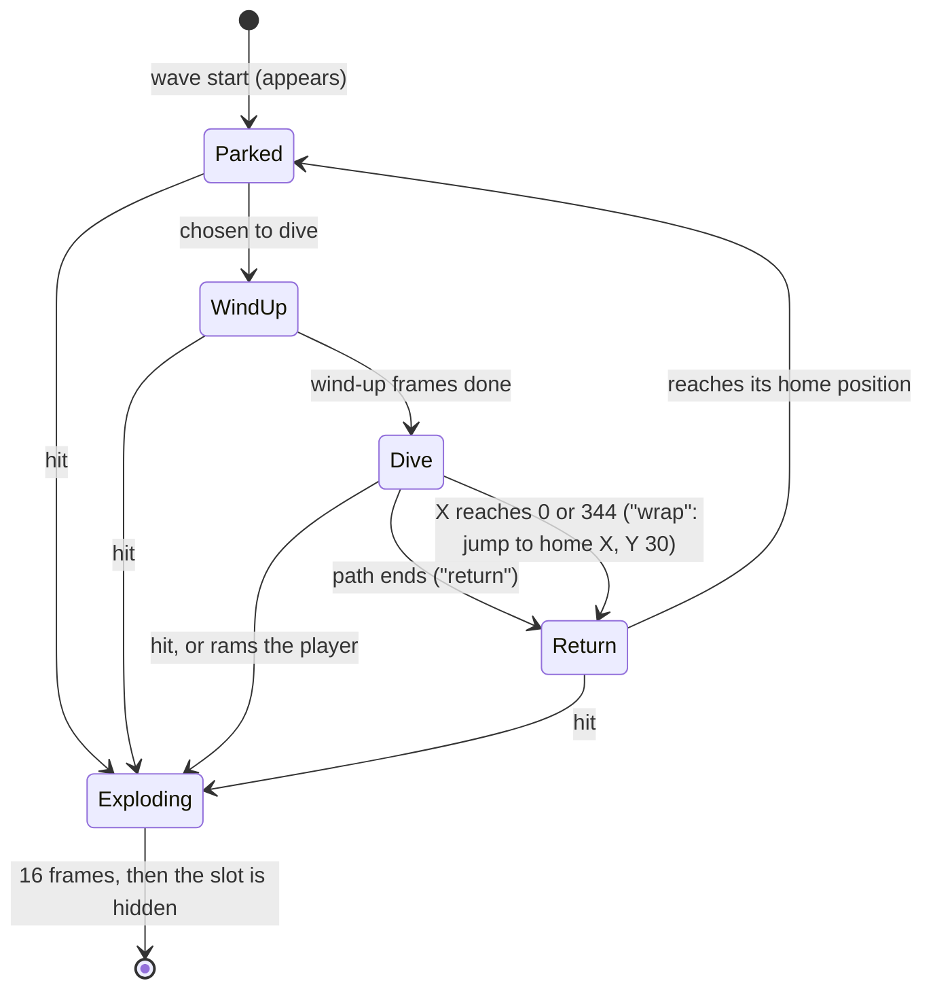
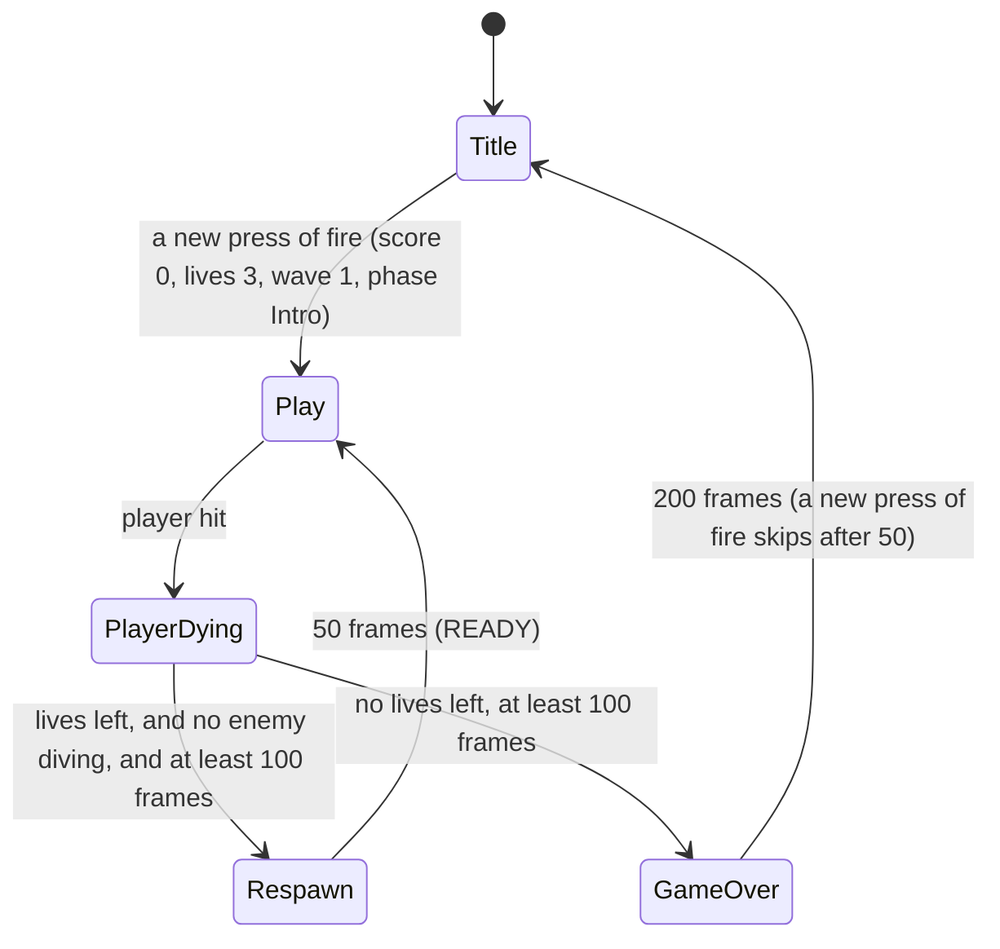
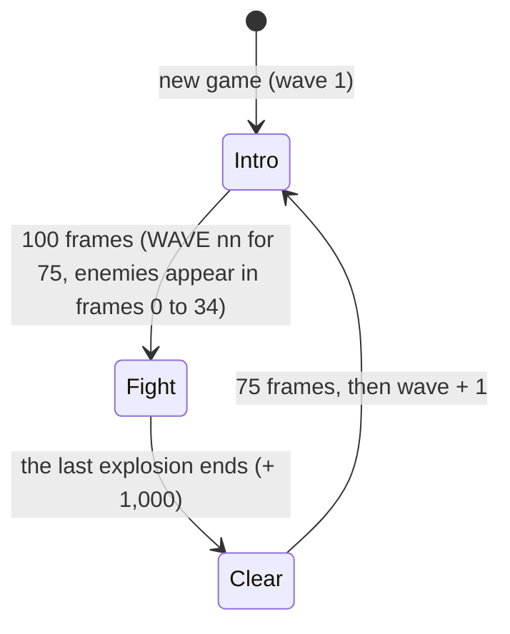

# Swarm: game design

**Status: approved by Simon, 2026-10-01** (stage 0 gate). Changes after playtests go through this
document first, then the code.

M4's training game ([brief](../../milestones/M4-training-game.md)). This document is the source of
truth for behaviour; what Simon decided at approval is in [Decisions](#decisions).

**Changed after the technical design (2026-10-01), no behaviour change:** the panel and the whole
screen use extended colour mode, with a 64-glyph character set
([Screen layout](#screen-layout), [Character set](#character-set-64-glyphs), decision 8); and the
rules for whoever draws the sprites are collected in [Art rules](#art-rules), including the new one
that enemy shapes keep their bottom row empty. **2026-10-02, no behaviour change:** stars are kept
out of every cell that text uses ([Text cells and the star rule](#text-cells-and-the-star-rule)),
sprite and text colours have a table ([Colours](#colours)), and the hit boxes and the area the art
may occupy are exact ([Hit boxes](#hit-boxes)). **2026-10-02, after stage 1, no behaviour change:**
feel target 2 states the measured fire rate (4.76 a second, not 5), the choices the stage 1 build
made where this document was silent are written down as rules
([Stage 1 rules](#stage-1-rules-confirmed-from-the-build)), and the fire-rate options were set out for
Simon's playtest. **2026-10-02, after Simon's stage 1 playtest, no behaviour change:** the fire rate
stays as built ([Fire rate: decided](#fire-rate-decided), decision 9). **2026-10-02, after stage 2
and Simon's playtest of it, no change to anything built:** the playtest is recorded (feel targets 9
and 11), up to 4 enemy explosions run at once, not 2 ([Explosions at once](#explosions-at-once)),
the choices the stage 2 build made are rules
([Stage 2 rules](#stage-2-rules-confirmed-from-the-build)), and stage 3 is specified to the frame
([Stage 3 rules](#stage-3-rules)). **2026-10-02, after stage 3 and Simon's playtest of it:** one
layout change, **the play-area messages move from text row 12 to row 9** (the formation's bottom row
covered row 12: [Text cells and the star rule](#text-cells-and-the-star-rule)); no change to how
stage 3 plays. The playtest is recorded (feel targets 3, 4, 7 and 9, and
[Stage 3 playtest and the difficulty curve](#stage-3-playtest-and-the-difficulty-curve)), the
wind-up's wording says what it does (a 2-pixel swing), and stage 4 is specified to the frame
([Stage 4 rules](#stage-4-rules)).

Every number that can be checked without the game is checked by
[tests/games/swarm/check_design.py](../../../tests/games/swarm/check_design.py)
(`uv run python tests/games/swarm/check_design.py`; its output is in
[check_design_results.txt](../../../tests/games/swarm/check_design_results.txt)). Its flicker figures
come from a Python model of the multiplexer's selection rules, so they are **design estimates**, not
measurements: QA's `positions.py` on the real game replaces them (deliverable 6).

## The pitch

Eighteen aliens hang in formation over your ship. One at a time, then in twos and threes, they peel
off and dive at you along curving paths, dropping aimed shots, while you slide left and right and
shoot back with two bullets on screen. A diver is worth double, so the best score comes from
shooting the thing that's trying to kill you.

## Units and coordinates

- Time in frames (50 a second). Speeds in pixels per frame.
- Positions are **sprite coordinates**, the values written to `mux_x_*` / `mux_y`: the sprite's
  top-left corner. X 24 is the left edge of the display window and X 320 is the last fully visible
  position; a sprite at X ≤ 0 or X ≥ 344 is off screen. A sprite at Y is displayed on raster lines
  Y + 1 to Y + 21.
- All sprites are 24 × 21, unexpanded, and **all hires, one colour each: every sprite in the same
  mode**. Bullets need the resolution, and uniform zone blocks have the larger timing margin
  ([engine v1 limits](../../../engine/README.md#v1-limits)).

## Screen layout

| Text rows | Raster lines | Contents |
|---|---|---|
| 0–23 | 51–242 | Play area: black background, star field characters, messages, all sprites |
| 24 | 243–250 | Status panel: a solid blue bar with white text, all 40 columns. No raster split is needed |

- **Screen mode: extended colour mode (ECM) for the whole screen**, set once and never changed
  (Simon, 2026-10-01; decision 8). In ECM the top two bits of a cell's screen code choose its
  background colour and the low six bits choose the glyph. Play-area cells use codes 0–63 (black
  background); panel cells use the same glyph's code **+ 64** (blue background), with colour RAM
  white. **Every one of the 40 panel cells is written**, the blanks as space + 64, or the bar has
  black holes. The registers are in the
  [memory map](memory-map.md#the-panel).
- The price is **64 glyphs for the whole screen**. The design uses 35: see
  [Character set](#character-set-64-glyphs).
- Why not reverse video, as this document first said: a reverse-video character draws its glyph in
  the background colour, so the text on a blue bar would be black, not white (measured by the
  Technical Director: `tests/timing/ecm_panel`).

- `MUX_Y_MAX` = **221** (panel line 243 − 22). The player sits at Y 221, displayed on 222–242.
- Panel columns: `SCORE` 1–5, six digits 7–12; `HI` 15–16, six digits 18–23; `WAVE` 26–29, two
  digits 31–32; spare ships 35–37 (one ship character each, 2 at the start of a game: see
  [Stage 1 rules](#stage-1-rules-confirmed-from-the-build) for what the wave number and the markers mean).
- Messages in the play area, **row 9** (raster lines 123–130, between formation rows 1 and 2),
  centred: `WAVE nn`, `READY`, `GAME OVER`. Never row 12: the formation's bottom row is drawn over it.
- **Star field:** 48 stars at fixed cells in rows 0–23, from a table (built once from a fixed seed;
  none in the cells reserved for text: [the star rule](#text-cells-and-the-star-rule)). Two star characters (dot high, dot low: one
  pixel each). Twinkle:
  each frame one star, in turn, steps its colour through white, light grey, grey, dark grey. That's
  **one colour RAM write a frame**; each star changes every 48 frames. The stars twinkle only: they
  don't move.

### Text cells and the star rule

Every text the design shows in the play area, with its cells (a text of n characters is centred:
first column (40 − n) div 2). Text row r is raster lines 51 + 8r to 58 + 8r.

| Screen | Row | Raster lines | Text | Columns |
|---|---|---|---|---|
| Title | 5 | 91–98 | `SWARM` | 17–21 |
| Title | 9 / 11 / 13 | 123–130 / 139–146 / 155–162 | `150 PTS` / ` 80 PTS` / ` 50 PTS` (right-aligned) | 17–23 |
| Title | 16 | 179–186 | `DIVING SCORES DOUBLE` | 10–29 |
| Title | 19 | 203–210 | `PRESS FIRE` | 15–24 |
| Game | **9** | 123–130 | `WAVE nn` | 16–22 |
| Game | **9** | 123–130 | `READY` | 17–21 |
| Game over | **9** | 123–130 | `GAME OVER` | 15–23 |

**Sprites are drawn over characters,** so a message must be on a row that no parked enemy covers.
A sprite at Y is on lines Y + 1 to Y + 21 and parked enemies never change Y, so the drift doesn't
matter: the formation is on lines 57–77, 97–117 and 137–157 and the ship on 222–242, at every `fx`.
The text rows clear of all four are **4, 9 and 14–20** (`check_design.py`, "Text rows").

**Changed 2026-10-02 (the stage 3 bug): the three game messages move from row 12 to row 9. The
columns don't change.** Row 12 (lines 147–154) is inside formation row 2 (137–157), so `READY` read
`R  DY`.

| Message | Old cells | New cells |
|---|---|---|
| `WAVE nn` | Row 12, columns 16–22 | Row **9**, columns 16–22 |
| `READY` | Row 12, columns 17–21 | Row **9**, columns 17–21 |
| `GAME OVER` | Row 12, columns 15–23 | Row **9**, columns 15–23 |
| Every title text | – | Unchanged: no formation is on screen at the title, and the title's three sprites are in columns 12–14, left of every text (first column 17 on their rows) |

Row 9 against everything that could cover it (lines 123–130):

| Thing | Lines | Clear of row 9 by |
|---|---|---|
| Formation row 0 (Y 56) | 57–77 | 45 lines |
| Formation row 1 (Y 96), parked or winding up | 97–117 | 5 lines (6 to the last line the enemy art may use, 116) |
| Formation row 2 (Y 136), parked or winding up | 137–157 | 6 lines (7 to the first line the art may use, 138) |
| The ship (Y 221) | 222–242 | 91 lines |

**Why row 9 and not the open sky (rows 14–20):** below the formation every row is on a diver's level
run (the Sweep at Y 164 is on lines 165–185, rows 14–16; the Plunge leaving at Y 192 is on 193–213,
rows 17–20), and `GAME OVER` is shown while divers are still flying home. Row 9 is only ever crossed
on the way down, early in a dive, and nothing returns through it (a Hook climbs back to Y 136, lines
137 and below; a wrap comes down from the top to row 0 or 1, lines 117 and above).

What can pass over each message (`check_design.py`, "What can pass over the message row"):

| Message | When it shows | Parked enemies | Divers | Enemy shots | Player shots |
|---|---|---|---|---|---|
| `WAVE nn` | Intro frames 0–74: every enemy is new and Parked | Never | **None exist:** the wave before ended with all 18 dead | **None:** the longest-lived shot lasts 67 frames, and the last was fired before the 75 empty frames began | His own, see below |
| `READY` | The 50 frames of Respawn, which starts only when no enemy is in WindUp, Dive or Return ([Stage 3 rules](#stage-3-rules) 9); nothing launches until Play | Never | **None:** not even one returning | **None:** removed at the hit, and none fired since | His own, see below |
| `GAME OVER` | From frame 100 of the last PlayerDying, whatever is still diving | Never | **None over the text:** a Sweep is last over row 9 in frame 43 after its launch and a Plunge in frame 62 (loop 0, the slowest; a Hook never), and nothing launches from the hit's frame on: 37 frames to spare | None (as `READY`) | None: the ship is gone, and a shot lives 21 frames |

**Accepted:** the player's own shot crosses row 9 for 2 frames (at Y 125 and 117), 2 pixels wide, and
is over `READY` only when fired from ship X 148–188 (`WAVE nn`: 140–196), which includes the respawn
X 171. It is his own shot, it is 2 pixels of one letter for 2 frames, and no row above the ship
avoids it. So in every case the letters are whole apart from that.

**The star rule: no star in columns 10–29 of rows 5, 9, 11, 13, 16 and 19.** That is one 20-column
band on each of the **six** text rows (120 of the 960 play-area cells), wide enough for the longest
text, so the same test serves every row. Row 12 is no longer a text row and leaves the list; row 9
was already in it for the title. The 48 stars are drawn from the other **840** cells (it was 820);
the count doesn't change. Because of the rule, a text is written and erased (with spaces) without
looking at the star table, and the twinkle's colour write never lands on a letter.

**The 48-entry star table is rebuilt from the six-band list** (the generator's list drops row 12),
so the code's list is this one. Still 48 stars; some move, because row 12's 20 cells are open to
them again. The table as built in stage 3 doesn't break the new rule (its seven bands include
these six), so nothing is wrong on screen until it is rebuilt: the rebuild is to keep one list, not
to fix a fault.

**If a text is added, moved or lengthened:** it must stay inside those bands, or the band list
(rows, columns 10–29) changes here first and the star table is rebuilt from it; and a text shown
during play must be on a row clear of the formation and the ship (4, 9, 14–20), with what crosses it
written down as above. The title's parked sprites may pass over stars, as sprites do in play.

### Title and game-over screens

- **Title:** the star field and panel (showing the high score) stay. `SWARM` on row 5; rows 9, 11
  and 13 show one parked enemy sprite of each type (X 120, Y 119 / 135 / 151: three sprites, 16 lines
  apart, far below any limit) with `150 PTS`, `80 PTS`, `50 PTS` beside them; `DIVING SCORES DOUBLE`
  on row 16; `PRESS FIRE` on row 19, on for 32 frames and off for 32. A new press of fire starts a
  game. No formation, ship or shot is shown. To the frame: [Stage 4 rules](#stage-4-rules) 9–12.
- **Game over:** `GAME OVER` on row 9 for 200 frames (a new press of fire skips it after 50), then
  the title. The high score is updated when GameOver starts.

### Character set (64 glyphs)

ECM allows screen codes 0–63 only. Everything the design puts on the screen, counted:

| Text | Where | Letters it needs |
|---|---|---|
| `SCORE`, `HI`, `WAVE` | Panel | S C O R E H I W A V |
| `WAVE nn`, `READY`, `GAME OVER` | Row 9 | + D Y G M |
| `SWARM` | Title | (none new) |
| `150 PTS`, `80 PTS`, `50 PTS` | Title | + P T |
| `DIVING SCORES DOUBLE` | Title | + N U B L |
| `PRESS FIRE` | Title | + F |

| Glyphs | Count | Screen codes |
|---|---|---|
| Letters `A B C D E F G H I L M N O P R S T U V W Y` | 21 | 1–25, the ROM's own (within A–Z) |
| Digits `0`–`9` | 10 | 48–57, the ROM's own |
| Space | 1 | 32 |
| Star, dot high; star, dot low | 2 | Custom: two codes no text uses |
| Ship (the spare-ships marker in the panel) | 1 | Custom: one code no text uses |
| **Total used** | **35 of 64** | **29 spare** |

- **Nothing had to be cut or reworded.** All the text is capitals, digits and spaces: no
  punctuation, no lower case. The five letters not used (J K Q X Z) and all the punctuation in codes
  33–47 and 58–63 are still there if a later text wants them.
- The three custom glyphs go in codes that no text uses; codes **27–29** (`[`, `£`, `]`) are the
  suggestion, the choice is the engineer's.
- **Rule for any text added later:** capitals, digits and the ROM's punctuation in codes 0–63 only.
  No lower case, no reverse video, no graphics characters (all are codes 64 and up, which ECM shows
  as a glyph from 0–63 on another background colour).
- Stars keep all 16 colours: ECM restricts glyphs and backgrounds, not the colour RAM colour.

## Controls and rules

Joystick in port 2.

| Input | Effect |
|---|---|
| Left / right | Player X − 3 / + 3 a frame, clamped to 24–318. No inertia |
| Left and right together | Nothing: they cancel |
| Fire (held or pressed) | Fires if a player-shot slot is free and the cooldown is 0. The cooldown is 10 frames from each shot. Holding fire repeats |
| Up / down | Nothing, alone or with any other input |

- **What kills the player:** an enemy shot's box or an enemy's box overlapping the player's box
  (boxes below). An enemy that rams the player dies too and scores its diving value.
- **What scores:** a player shot hitting an enemy; clearing a wave.
- The player has **3 lives**. No extra lives. (Tuning note: if five minutes feels short, add one at
  10,000 points.)

### Stage 1 rules (confirmed from the build)

Cases this document left open, which the stage 1 build chose. **All confirmed as built: no
behaviour change.** Measured by [check.py](../../../tests/games/swarm/check.py)
([results](../../../tests/games/swarm/check_results.txt)).

| # | Rule | Why |
|---|---|---|
| 1 | **Left and right together cancel:** no movement, fire still works | A stick can't do it; a keyboard-mapped emulator can. No direction should win by accident of the code |
| 2 | **Start X = respawn X = 171**, at the start of every game and after every death | The middle of 24–318, and on the 3-pixel grid: 49 frames to either edge |
| 3 | **Order each frame: player shots move and are removed, then the player moves, then fires.** So (a) a shot spawns at the player's X **after** this frame's move; (b) a new shot is shown at Y 213 for one frame before it moves: 21 frames in all, Y 213 down to 53; (c) a slot freed this frame can fire this frame | (b) puts the shot's first frame at the ship's nose, so it is seen to leave the ship. (c) costs a miss nothing extra. Later stages keep the order: shots move, collisions, then the player |
| 4 | **The cooldown** is set to 10 when a shot spawns and counts down once a frame: the next shot is 10 frames later at the earliest, fire held or tapped | Measured: gaps of exactly 10 with a slot always free |
| 5 | **Up and down do nothing,** alone or with other inputs | As the table above |
| 6 | **Spare-ship markers = lives − 1** (none at 0 lives), filled from column 35, redrawn whenever lives changes. 3 lives: 2 markers, column 37 blank (it is there for the extra life of decision 4, if that is ever added) | The ship in play isn't a spare. The marker goes at the hit, when lives goes down, not at the respawn: one rule, one redraw |
| 7 | **The panel's `WAVE` and the `WAVE nn` message both show n, the running count** from 1: n = loop × 3 + pattern (pattern 1–3, loop from 0). Two digits, **stopping at 99**; the game carries on past it | A pattern number would read 1, 2, 3, 1: the player wants to see how far he got |
| 8 | **From stage 4, three stores:** the shown wave (BCD, 01–99, sticks at 99), the pattern index (0–2, cycles for ever), the loop (0–3, sticks at 3, first reached at wave 10). Pattern and loop are counted, never derived from the shown number | No divide by 3 in 6502, and the pattern must keep cycling after the display stops at 99 |

### Stage 2 rules (confirmed from the build)

Cases this document left open, which the stage 2 build chose. **All confirmed as built: no
behaviour change.** Measured by `check.py` (cases hit, exploding, double, clear, score-cap).

| # | Rule | Why |
|---|---|---|
| 1 | **An enemy explosion is shown for exactly 16 frames:** the hit's frame and the 15 after it, 4 shapes of 4 frames, where the enemy was when hit. The player's: 32 frames, the hit's frame and the 31 after, 4 shapes of 8 | One count for art, sound (16 frames) and code |
| 2 | **"Enemies alive" counts every enemy that isn't Dead, an exploding one included.** So the wave is clear when the last explosion ends, and the launcher's "4 or fewer alive" lags a hit by up to 16 frames | The clear must wait for the explosion anyway. The launcher reads the count only when it reloads its timer (every 50 frames or more), so the lag changes at most one interval, once |
| 3 | **Stages 2 and 3, when the formation is cleared:** the sky is empty for 75 frames (the player still moves and fires), and in the 75th frame after the last explosion ended the same 18 are back at once, `fx` 48 moving right. No bonus; wave, pattern and loop don't change. **Stage 4 replaces this:** + 1,000 in the frame the last explosion ends, whatever the player's state; the same 75 empty frames; then Intro with wave + 1, the next pattern and loop, `WAVE nn`, and the enemies appearing one every 2 frames ([Stage 4 rules](#stage-4-rules) 1–5) | The 75 frames are the design's pause, so stage 4 changes what follows it, not the timing |
| 4 | **The score stops at 999,990:** an addition that would pass it leaves 999,990 | Six digits, and every value is a multiple of 10 |
| 5 | **The high score changes only when GameOver starts** (if score > high score). The panel's `HI` never changes during play | One panel field to redraw in play, not two; the moment is still shown, on the game-over screen |
| 6 | **An enemy can be hit from the first frame it is shown,** the frame the formation returns included (from stage 4: the frame each enemy appears) | The rule is "what is shown can be hit": no grace period to explain or code |
| 7 | **An explosion hits nothing and stops nothing:** a shot passes through it and hits what is behind | As the hit box table |

### Explosions at once

**Rule: at most 4 enemy explosions are shown at once. A 5th enemy hit while 4 are running dies
without one:** it is hidden in the hit's frame and counted out of "alive" at once; its score, its
sound and (if it rammed) the player's death are unchanged. As built (`EXPLOSION_SLOTS` = 4).

- Why 4 is enough (`check_design.py`, "Explosions at once"): shots spawn 10 frames apart and fly at
  most 20, so player shots make at most **3** hits in any 16 frames while every target is parked
  (flights 18, 13, 8) and **4** with divers (it takes flights of 20, 6, 11 and 1 frames in a row).
  A 5th can only be an enemy ramming the player inside those same 16 frames, and its missing
  explosion is under the player's own, which is bigger, white and twice as long.
- Not taken: a 5th slot. No sprite either way (an explosion is drawn in the dead enemy's own
  sprite); about 42 cycles more in the worst frame (the brief's 168 for 4), from the formation's
  row, which has none to spare, for a case a player will not see.
- The flicker model is unchanged: its enemies never die, so every enemy sprite is already counted
  where it is in every frame, exploding or not.

## Entities

| Kind | Virtual sprites | Most at once | Pinned | Speed | Notes |
|---|---|---|---|---|---|
| Player | 0 | 1 | **Yes** | 3 px/frame, X only | Y fixed at 221. Its explosion uses the same slot |
| Enemy shot | 1–3 | 3 | **Yes** | Y + 2 a frame (+ 3 from loop 2), X − 1, 0 or + 1 | Removed when Y > 221 |
| Player shot | 4–5 | 2 | No | Y − 8 a frame | Spawns at (player X, 213), shown there for one frame. Removed when Y < 46 (last shown at Y 53), or on a hit |
| Enemy | 6–23 (6 + row × 6 + column) | 18 | No | Parked: the drift. Diving: up to 2 px X, 3 px Y a path step | Its explosion uses the same slot |

**Total 24 of 24, 4 pinned of 4.** This is the brief's split, reordered so the pinned sprites have
the lowest indices (the engine pins the first four flagged).

**Why these four are pinned.** The player must never flicker (Simon). The other three go to enemy
shots because they are the small things that kill: a bullet missing for a frame is an unfair death,
while a 24-pixel diver missing for one frame is still readable. The cost is that the flicker moves
onto divers and player shots: with the shots pinned the model gives enemy shots 0% missing, divers
up to 2.1% and player shots up to 1.2% of their frames; with only the player pinned, enemy shots are
missing in up to 3.8% of theirs (`check_design_results.txt`, both tables).

### Hit boxes

In sprite pixels inside the 24 × 21 cell: columns 0–23 from the left, rows 0–20 from the top,
ranges inclusive. The **hit box** is what the collision code tests. The **art area** is every pixel
the shape may use: nothing is drawn outside it. For the player and the enemies it is the box plus
exactly 2 pixels on each side, cut off at the cell's edge; for the shots it is the box.

| Kind | Hit box: left, top, width, height | Hit box columns, rows | Art area columns, rows | Art area size |
|---|---|---|---|---|
| Player | 6, 6, 12, 15 | 6–17, 6–20 | **4–19, 4–20** | 16 × 17 (the ship is bigger than its box: near misses are misses) |
| Enemy (types A, B, C, both frames; every state but exploding) | 4, 3, 16, 15 | 4–19, 3–17 | **2–21, 1–19** (rows 0 and 20 empty) | 20 × 19 |
| Player shot | 11, 0, 2, 8 | 11–12, 0–7 | **11–12, 0–7**: the box, every pixel set | 2 × 8, at the top of the cell |
| Enemy shot | 11, 14, 2, 7 | 11–12, 14–20 | **11–12, 14–20**: the box, every pixel set | 2 × 7, at the bottom of the cell |
| Explosion (4 shapes) | none: an explosion hits nothing and can't be hit | – | 0–23, 0–20: the whole cell | 24 × 21 |

The player and enemy shapes must also **reach** their box: some pixel on each of the box's four
edges, so that a hit is never scored on empty space more than a pixel or two from the drawing.

Consequences (checked): an enemy can touch the player only at **Y ≥ 210**; an enemy shot hits from
Y ≥ 207; a player shot moving 8 a frame can't pass through a 15-line enemy box.

### Sprite shapes (13)

Player; player shot; enemy shot; enemy types A, B, C × 2 animation frames; explosion × 4. Enemies
swap frames every 16 frames, all together. The enemy explosion is 4 shapes × 4 frames (16 frames,
stationary); the player's is the same 4 shapes × 8 frames (32 frames) in white.

### Art rules

For whoever draws the sprites. Colours are set by the game, per sprite, not by the art.

1. **24 × 21 pixels, hires, one colour plus transparent.** No multicolour, no expanded sprites, and
   no exceptions: every sprite on screen is in the same mode (decision 7).
2. **13 shapes**, as listed above. Each stays inside its **art area** in the
   [hit box table](#hit-boxes) (exact columns and rows) and is centred on its box: a shape that
   overhangs its box makes deaths look unfair.
3. **Enemy shapes (types A, B, C, both frames) keep sprite row 20, the bottom row, empty.** A
   wrapping diver re-enters at Y 30, which is displayed on raster lines 31–51, and line 51 is the
   first line of the display window: anything drawn in row 20 would show for a frame as a line of
   pixels at the top of the screen, above the enemy's home. The enemy art area is rows 1–19, so
   this costs nothing.
4. **Player shot:** 2 pixels wide, in columns 11–12, rows 0–7 (the top of the cell). **Enemy
   shot:** 2 pixels wide, columns 11–12, rows 14–20 (the bottom of the cell). The rest of each cell
   is empty: the shape is the hit box.
5. **Enemy animation:** the two frames of a type have the same outline size and centre, so the
   16-frame swap doesn't look like movement.
6. **One set of 4 explosion shapes** serves enemies and the player; they are drawn in the dead
   object's slot and may fill the cell.
7. **Among sprites, white is reserved** for the wind-up flash and the player's explosion (text is
   white too: the panel and the messages). No sprite's own colour is white or light grey, and none
   is blue, which is the panel's colour. The colours are in the table below.

### Colours

**The designer's proposal for placeholder art.** Simon is art director and reviews the colours in
the first playable build: **this is the one table to change**, and the code takes its colours from
one table to match. Colour changes don't touch behaviour. Names and numbers are the C64's 16.

| Thing | Colour | Why |
|---|---|---|
| Player | **Cyan** (3) | Bright and cool; nothing else on screen is cyan but its own shots |
| Player shot | **Cyan** (3) | Reads as the player's |
| Enemy type A (row 0, 150 / 300) | **Purple** (4) | The three types are a warm, a cool-dark and a green hue, far apart on black |
| Enemy type B (row 1, 80 / 160) | **Yellow** (7) | |
| Enemy type C (row 2, 50 / 100) | **Light green** (13) | |
| Enemy animation frames | Both frames of a type are the type's colour | The colour is the type; the animation is only the shape |
| Enemy in WindUp | Its type's colour, and **white** (1) on alternate 4-frame periods | The warning, with the 2-pixel shake (behaviour table) |
| Enemy shot | **Light red** (10) | The only red thing on screen: the thing that kills. Can't be taken for a cyan player shot or for any enemy |
| Enemy explosion | **Orange** (8), all 4 shapes | Used for nothing else, so a kill reads the same whatever died |
| Player explosion | **White** (1), all 4 shapes | As designed |
| Player after a respawn (100 frames) | **Cyan** (3) and **dark grey** (11), alternating every 4 frames | A ghost of the ship: visibly there, visibly not normal. Not white, so it isn't read as an explosion |
| Title screen's three parked enemies | Their types' colours | |
| Panel text and ship markers | **White** (1) on **blue** (6) | Decision 8 |
| Messages and title text | **White** (1) on black | |
| Stars | White, light grey (15), grey (12), dark grey (11), in turn | The twinkle |
| Background and border | **Black** (0) | |

## The formation

| | |
|---|---|
| Rows (Y) | Row 0: **56**, row 1: **96**, row 2: **136** (40 lines apart; displayed on 57–77, 97–117, 137–157) |
| Columns (X) | 34 + `fx` + 36 × column, columns 0–5 |
| Drift | `fx` runs 0 → 96 → 0 as a triangle, 1 pixel every 2 frames (every frame from loop 2). Starts at 48, moving right. X only: parked enemies never change Y |
| Extent | Sprite X 34–310 over the whole drift (visible range 24–320) |
| Types | Row 0: type A, row 1: type B, row 2: type C |

**Why 40 lines.** By the multiplexer's selection rule three rows of 6 are all shown from **31
lines** apart (the brief's 24 would flicker: checked by the script), and the README's written
guarantee needs 39. At 40, each row's guarantee window (Y − 38 … Y + 25) holds only its own 6, so
**two more sprites can cross any row with no flicker at all**: both player shots, or a shot and a
diver. Flicker starts with the third visitor. The price is height: 64 lines between the bottom
row and the player.

Tuning note: if the dives feel cramped, try **32** in stage 3. It adds 16 lines of dive height and
makes every crossing flicker; it's one table.

## Enemy behaviour

| State | Position each frame | Scores | Fires |
|---|---|---|---|
| Parked | Home: (34 + `fx` + 36 × column, row Y) | Parked value | No |
| WindUp | Home X + 1 (frames t mod 4 = 0, 1) or − 1 (t mod 4 = 2, 3), home Y: **a 2-pixel swing, 1 pixel either side of home**, a full shake every 4 frames; it is never drawn at home X itself. White when t mod 8 is 0–3, its own colour when 4–7. t counts from 0 in the launch frame. Lasts W = 24 / 20 / 16 / 12 frames (loops 0–3). The dive sound starts here | Diving value | No |
| Dive | The path table, one step a frame (more on later loops), from (home X, row Y) as they are in frame W; its own colour | Diving value | At the path's fire steps |
| Return | X moves toward home X by at most 2, Y toward home Y by at most 2, every frame, until both match: Parked in that frame | Diving value | No |
| Exploding | Stationary, where it was hit | – | No |

Every state but Exploding can be hit, and animates with the formation (the 16-frame shape swap).

**The wind-up's shake, in full,** because "1 pixel" has been read as the size of the movement: the
enemy jumps between home X + 1 and home X − 1, two frames at each, so what the eye sees is **2
pixels of travel** (measured, `check.py` windup: X − home X = +1, +1, −1, −1, +1, …). On top of that
the home itself drifts 1 pixel every 2 frames (every frame from loop 2), so against the screen the
enemy moves by 0 to 3 pixels in a frame. Against its neighbours it is always exactly 1 pixel off
its place, to one side or the other. As built, to spec, and it stays (Simon, 2026-10-02).

### Dive paths

One path per row. A path is a list of segments **(dx, dy, steps)**: add (dx, dy) to the position
once per step. Authored heading right; at the end of the wind-up the diver is **mirrored** (dx
negated for the whole dive) if the player's X is less than its own, so every dive heads for the
player's side. X is clamped to 0–344 (both ends are off screen). `steps` = 0 means "repeat until X
reaches 0 or 344". A segment with a step count runs all its steps even while X is clamped (the diver
is out of sight, and can't touch the player there: his box stops at least 11 pixels short of the diver's); only a
`steps` = 0 segment tests for the edge. Steps are numbered from 1 through the whole path.

**Hook** (row 2, type C). Ends in Return (climbs home from below: 32 frames). 58 steps.

| # | dx | dy | Steps | Offset after (x, Y) | What it looks like |
|---|---|---|---|---|---|
| 1 | +1 | +1 | 8 | (8, 144) | Peels off |
| 2 | +2 | +2 | 12 | (32, 168) | Dives toward the player's side |
| 3 | +1 | +3 | 12 | (44, 204) | Steepens |
| 4 | 0 | +2 | 6 | (44, 216) | Drops to the player's level |
| 5 | −2 | 0 | 12 | (20, 216) | Skims back the way it came, 24 pixels |
| 6 | −1 | −2 | 8 | (12, 200) | Pulls up, then Return |

Fire steps: 8 (Y 144), 16 (Y 160). Lethal to touch (Y ≥ 210) on steps 35–53: 19 steps.

**Sweep** (row 1, type B). Never low enough to ram: it's the bomber. Ends by leaving the side of the
screen, then wraps. 38 fixed steps, at most 175 before it's off screen.

| # | dx | dy | Steps | Offset after (x, Y) | What it looks like |
|---|---|---|---|---|---|
| 1 | −1 | +1 | 8 | (−8, 104) | Peels away from the player first |
| 2 | +1 | +2 | 16 | (8, 136) | Swings back down through row 2 |
| 3 | +2 | +2 | 14 | (36, 164) | Levels out below the formation |
| 4 | +2 | 0 | 0 | off screen at Y 164 | Runs across the screen, bombing |

Fire steps: 24 (Y 136), 38, 62, 86 (all Y 164).

**Plunge** (row 0, type A). The long fast dive from the top. Leaves the side of the screen, then
wraps. 95 fixed steps, at most 188 before it's off screen.

| # | dx | dy | Steps | Offset after (x, Y) | What it looks like |
|---|---|---|---|---|---|
| 1 | 0 | −1 | 6 | (0, 50) | Rises out of the row |
| 2 | +1 | +2 | 20 | (20, 90) | Tips over toward the player |
| 3 | +2 | +3 | 20 | (60, 150) | Full dive |
| 4 | +1 | +3 | 16 | (76, 198) | Straightens |
| 5 | 0 | +2 | 9 | (76, 216) | Drops to the player's level |
| 6 | +2 | −1 | 24 | (124, 192) | Pulls up and away |
| 7 | +2 | 0 | 0 | off screen at Y 192 | Leaves |

Fire steps: 26 (Y 90), 36 (Y 120), 46 (Y 150). Lethal to touch on steps 68–77: 10 steps.

**Wrap.** When a wrapping diver's X reaches 0 or 344 it jumps to (home X, 30), hidden under the top
border, and enters Return: it slides down into its place in 13 frames (row 0) or 33 (row 1).

**Why no diver leaves through the bottom:** a sprite can't overlap the panel, so it would vanish in
full view at Y 221. Divers leave sideways or climb back. And no lethal skim runs toward a screen
edge, so the player is never cornered by something he can't shoot.

### Firing

- A dive with N shots ([Waves](#waves)) uses the path's **first N fire steps**. Straight after taking
  a fire step (so a 2-step frame can't skip one), the diver fires if: the game state is Play, an
  enemy-shot slot (1–3, lowest free first) is free, and its X is 24–320. A fire step that can't
  fire is lost: the shot is not saved for a later step.
- Every fire step in the tables is at Y ≤ **164** (asserted by the script): the code doesn't test Y.
- The shot starts at the diver's position (same X, same Y: its art is at the bottom of the cell).
  Its dx is fixed when fired, from d = player X − shot X: **0 if |d| ≤ 15, else + 1 if d > 0, − 1 if
  d < 0**. Its dy is 2 (3 from loop 2). Each frame X + dx (clamped to 0–344), Y + dy; removed when
  Y > 221. It is shown at its spawn position for one frame before it moves.
- From Y 164 a shot reaches the player in 22 frames at dy 2, 15 at dy 3: never point blank.

### Choosing a diver

**Divers active** = the enemies in WindUp, Dive or Return (0–3): the count the launcher and the
respawn test.

A launch timer counts down every frame the game state is Play (not in PlayerDying, Respawn or
GameOver), stopping at 0. At 0, if divers active is less than the wave's maximum: pick among the
Parked enemies in the wave's rows (if there are none, among all Parked enemies), put it in WindUp,
and reload the timer with the wave's interval, **halved (rounded down) if 4 or fewer enemies are
alive at that moment**. If the maximum is reached or nothing is Parked, the timer stays at 0 and
the launcher tries again next frame. An enemy always uses its own row's path.

**The pick:** draw r in 0–17 and take the first candidate at enemy index r, r + 1, … wrapping at 18.
This favours an enemy that follows a gap; accepted, it can't be seen. How r is drawn is the
engineer's, inside the Technical Director's budget.

### Stage 3 rules

What stage 3 builds, to the frame. Where this and the prose above differ, this wins.

Stage 4 replaces rule 1 (waves advance), rule 12 (the wave timer) and the last sentence of rule 13
(GameOver leads to the title): [Stage 4 rules](#stage-4-rules).

**Order of a frame** (the star update may go anywhere):

| # | Step | Notes |
|---|---|---|
| 1 | Input, panel, the game state's timer | |
| 2 | Player shots move | As stage 1 |
| 3 | Formation: drift, home X, animation, explosion timers | As stage 2 |
| 4 | Enemy shots move and are removed | Before 5, so a new shot stays at its spawn position for a frame |
| 5 | Divers: the launcher, then WindUp, Dive (steps, firing), Return | A launch is frame t = 0 of its WindUp |
| 6 | Collisions: (a) player shots against enemies, (b) the player against enemy shots, (c) the player against enemies | (b) and (c) only in Play with the invulnerability timer at 0. **At most one player hit a frame:** if (b) hits, (c) is skipped |
| 7 | Player: explosion and invulnerability timers, move, fire | A player hit in 6 doesn't move or fire in 7 |

| # | Rule | Why |
|---|---|---|
| 1 | **Stage 3 plays pattern 3 at loop 0 on every formation** (all rows dive, 2 at once, interval 100, 2 shots a dive), read from the pattern and loop stores of Stage 1 rule 8 so that a test can set them. The panel stays at `WAVE 01` | Simon's playtest sees all three paths. Waves are stage 4 |
| 2 | **Extra path steps:** at loop 1 every diver takes 2 steps in frames whose frame number mod 4 is 0; from loop 2, mod 2 is 0. All divers together | One test a frame, and what the model does |
| 3 | **Mirror:** decided once, in frame W (the frame of step 1, before the step): mirrored if player X < the diver's home X. It uses the player's X as it stands then, also when the player is dead (where he died) | |
| 4 | **Wrap:** in the frame X reaches 0 or 344 in a `steps` = 0 segment the diver is put at (this frame's home X, 30), in Return. Return follows the drifting home | |
| 5 | **A diver that is hit** (WindUp, Dive or Return): the shot is removed, the diving value scored, it explodes where it is (orange, Stage 2 rule 1) and **divers active − 1 in the hit's frame**: its diver slot is free at once. Enemies alive − 1 when the explosion ends. Its shots in flight carry on | The launcher shouldn't wait for an explosion |
| 6 | **A ram:** in 6c an enemy at Y ≥ 210 whose box overlaps the player's. The player is hit (rule 8) and the enemy is treated as hit by rule 5, scoring its diving value. An enemy hit by a shot in 6a of the same frame is already Exploding and can't ram | The shot wins: the player killed it first |
| 7 | **Invulnerable or dead player:** steps 6b and 6c are not run, so shots and divers pass through him and a diver that would have rammed flies on | |
| 8 | **The player is hit** (frame 0 of PlayerDying): lives − 1 and the markers redrawn; all enemy shots removed; the ship becomes the white explosion, stationary, 32 frames, then hidden. Player shots in flight carry on, hit and score. The launch timer stops and **no diver fires**; enemies in WindUp, Dive or Return carry on to Parked; the formation drifts on | Nothing new threatens a player who isn't there |
| 9 | **PlayerDying ends** in the first frame, 100 or later, with divers active = 0: Respawn if lives > 0. With lives = 0 it ends at frame 100 whatever is diving: GameOver. Longest wait at loop 0: 232 frames (a Sweep launched in the hit's frame: 24 + 175 + 33) | |
| 10 | **Respawn** (50 frames): `READY` on row 9 (row 12 as first built: [Text cells](#text-cells-and-the-star-rule)); the ship appears at X 171 in its first frame and **moves and fires at once**; the invulnerability timer is set to **150** and counts down every frame (the flash: cyan or dark grey by the timer, 4 frames each). After 50 frames `READY` is erased and the state is Play with the launch timer at 50: 100 invulnerable frames of play, as designed | A frozen ship reads as a hang. Nothing is diving or in flight during `READY`, so one timer does both jobs |
| 11 | **The player moves and fires whenever the ship is shown,** in any game state | As built in stage 1 |
| 12 | **The formation cleared while the player is dying or respawning:** Stage 2 rule 3 runs on its own timer, whatever the game state. The launch timer is set to 50 when a formation returns and when Play is entered | No special case in stage 3 |
| 13 | **GameOver** starts in frame 100 of the last PlayerDying: the high score is updated, `GAME OVER` on row 9, columns 15–23 (row 12 as first built), for 200 frames; from its frame 50 a **new press** of fire (not a held button) ends it. The formation, divers and explosions carry on; nothing launches or fires. **Until stage 4's title exists a new game starts in the next frame:** text erased, score 0, lives 3, the formation as at power-on (all 18 Parked, `fx` 48, no diver, shot or explosion), ship at X 171 with no invulnerability, launch timer 50; the high score is kept | Held fire would skip the screen the player died holding it on |
| 14 | **No sound in stage 3** | `engine/sfx.asm` is stage 4 |
| 15 | **One ram a frame.** 6c tests the diver slots in slot order and stops at the first enemy that rams: that enemy dies and scores, the player is hit, and any other diver overlapping him in the same frame flies on (from the next frame he is dead and rule 7 applies). So a frame has at most 2 shot hits, 1 ram and 1 player hit, at every loop, with 2 or 3 divers out | As built. "At most one player hit a frame" (step 6) already meant it; this says so for two or three divers on the ship at once, which loop 1's third diver makes more likely |

Checked for rule 10: at loop 0 the first thing that can hit a respawned player is a Hook's shot,
50 + 24 + 8 + 32 = 114 frames into play, after the 100.

## Waves

Wave n (from 1): pattern = (n − 1) mod 3 + 1 (the table's 1–3), loop = (n − 1) div 3. The formation
is the same 18 each time. Loops past 3 play as loop 3. What is shown and what is stored:
[Stage 1 rules](#stage-1-rules-confirmed-from-the-build) 7 and 8.

| Pattern | Rows that dive | Max diving at once (loops 0 / 1 / 2 / 3) | Launch interval, frames (loops 0 / 1 / 2 / 3) | Shots per dive at loop 0 |
|---|---|---|---|---|
| 1 "Hooks" | 2 | 1 / 2 / 2 / 2 | 150 / 120 / 100 / 80 | 1 |
| 2 "Bombers" | 1, 2 | 2 / 2 / 3 / 3 | 120 / 100 / 80 / 64 | 2 |
| 3 "All in" | 0, 1, 2 | 2 / 3 / 3 / 3 | 100 / 80 / 64 / 50 | 2 |

**What "faster" means,** per loop:

| | Loop 0 | Loop 1 | Loop 2 | Loop 3+ |
|---|---|---|---|---|
| Path steps per frame for a diver | 1 | 1, and 2 on every 4th frame (× 1.25) | 1, and 2 on every 2nd frame (× 1.5) | as loop 2 |
| Shots per dive | table above | + 1 | + 2 | + 3 (never more than the path's fire steps) |
| Enemy shot dy | 2 | 2 | 3 | 3 |
| Wind-up frames | 24 | 20 | 16 | 12 |
| Formation drift | 1 px / 2 frames | 1 px / 2 frames | 1 px / frame | 1 px / frame |

Return speed, player speed and player shots never change.

**Wave start (Intro, 100 frames):** `WAVE nn` shows for 75 frames. Enemies appear in place (no
fly-in), one every 2 frames, row 0 first, left to right (the last in frame 34). The launcher starts
at frame 100 with the launch timer at 50. **Wave clear** (all 18 dead and exploded): + 1,000, 75
frames' pause, next wave. To the frame: [Stage 4 rules](#stage-4-rules).

## Scoring

| Event | Points |
|---|---|
| Type C (row 2) | 50 parked, 100 diving |
| Type B (row 1) | 80 parked, 160 diving |
| Type A (row 0) | 150 parked, 300 diving |
| Wave cleared | 1,000 |

"Diving" is any of WindUp, Dive and Return. Six decimal digits (BCD), stopping at 999,990. The
session high score starts at 5,000 and is lost at power-off. A wave is worth 2,680 to 4,360.

## Game flow

Two machines, each with its own store and timer: the **game state** (what the player is doing, as
built in stage 3, plus Title) and, from stage 4, the **wave phase** (what the formation is doing).

The launcher runs only in Play and Fight together. The wave timer counts in every frame with
lives > 0, whatever the game state, so a wave can clear, pause and start while the player is dying
or respawning. The rules are [Stage 4 rules](#stage-4-rules).

**Losing a life:** on the hit, lives − 1, enemy shots are removed, the player explodes (32 frames) and
is hidden. No new dives start; enemies already diving finish and return. Player shots in flight
carry on and score. On respawn the player appears at X 171 and can't be hit for the 50 frames of
`READY` and the first 100 of play (drawn in alternating colours every 4 frames, not hidden); the
launch timer restarts at 50. The frame-by-frame rules are [Stage 3 rules](#stage-3-rules) 8–13.

## Stage 4 rules

What stage 4 builds, to the frame: waves, the title, sound, the high score. Where this and the
prose elsewhere differ, this wins. Everything stage 3 built stays as it is except where a rule here
says "replaces".

**The wave phase**

| # | Rule | Why |
|---|---|---|
| 1 | **A wave phase** (Intro, Fight, Clear) with its own timer, beside the game state. **The wave timer counts in every frame in which lives > 0** (Play, Respawn, and PlayerDying unless the last life has just gone); it stands still in the last PlayerDying, in GameOver and at the title. Replaces Stage 3 rule 12 and Stage 2 rule 3's stage 2 and 3 behaviour | As built, the formation's pause already runs on its own timer whatever the player is doing. Stopping it with the last life keeps `WAVE nn` and a wave number the player never played off the game-over screen |
| 2 | **Intro, 100 frames (0–99).** Frame 0: every enemy is Waiting (hidden, can't be hit, isn't Parked); **enemies alive = 18**; `fx` = 48 moving right, and the drift and the animation run from this frame; `WAVE nn` is written (rule 6); the panel's `WAVE` is redrawn; the wave start sound. **Enemy k (0–17: row 0 left to right, then rows 1 and 2) becomes Parked at its home in frame 2k,** so the last appears in frame 34. Frame 75: `WAVE nn` is erased. Nothing launches in Intro | 18 alive from frame 0 so the wave can't read as cleared while it is still arriving. One enemy every 2 frames keeps the multiplexer's sort to one new sprite at a time |
| 3 | **Fight** starts in the frame after Intro's frame 99, with the launch timer set to 50. **The launcher runs only when the game state is Play and the phase is Fight;** entering Play still sets the timer to 50 (Stage 3 rule 10) | First launch 150 frames after the wave appears, as stage 3's formation return gave |
| 4 | **Clear, 75 frames.** Starts in the frame enemies alive reaches 0 (the last explosion ends: Stage 2 rule 2), whatever the game state. In that frame: **+ 1,000** and the wave clear sound. The sky is empty; the player moves and fires. No enemy is in WindUp, Dive or Return at a Clear (all 18 are dead, and a hit frees its diver slot at once), so the next Intro starts with divers active = 0 and every diver slot free: if the code's re-park doesn't guarantee that, it must clear them | The bonus is paid when it is earned, also to a dying player: with the last life gone it still counts toward the high score, which is taken 100 frames after the hit |
| 5 | **The frame after Clear's 75th:** shown wave + 1 (BCD, sticks at 99), pattern + 1 (2 wraps to 0), and loop + 1 when the pattern wraps (sticks at 3); then Intro's frame 0 with the new numbers. **Only here do the three stores change in a game;** a new game sets them to 01, 0, 0 (rule 10) and its first Intro doesn't advance them. Everything a loop changes (drift speed, wind-up, steps, shots, shot speed) is read from the loop store when it is used: no diver or enemy shot exists when it changes | Stage 1 rule 8. A test can still set the stores |
| 6 | **Row 9 holds one message at a time.** `WAVE nn` is `WAVE`, a space and the shown wave's two digits (`WAVE 01`). `GAME OVER` is written over whatever is there (it covers columns 15–23, the widest). **`READY` is written only if the phase is Fight in Respawn's first frame, and erased at Respawn's end only if it was written;** Respawn's 50 frames, the ship and the flash are the same without it. `WAVE nn` and `GAME OVER` can't meet: with the last life gone the wave timer stops (rule 1), and the player can't be hit while `WAVE nn` shows (rule 7) | A Respawn that falls in a Clear or an Intro would write `READY` into `WAVE nn` or erase part of it. The wave message says the same thing: get ready |
| 7 | **What can hit the player outside Fight:** only an enemy shot still in flight in Clear's first 51 frames (the longest-lived shot lasts 67 frames and its diver died at least 16 before the Clear). Nothing in Intro. A death there is an ordinary death | No special case |
| 8 | **A typical case, to check the rules against:** the player rams the last enemy in frame d with lives left. d + 16: Clear, + 1,000. d + 91: Intro frame 0, `WAVE nn`, enemies appearing. d + 100: Respawn, the ship back, no `READY` (phase Intro). d + 150: Play. d + 166: `WAVE nn` erased. d + 191: Fight, launch timer 50. d + 241: first launch. d + 250: invulnerability ends. With the last life: d + 16 Clear and + 1,000, the timer stops, d + 100 GameOver over an empty sky | |

**The title, starting and ending a game**

| # | Rule | Why |
|---|---|---|
| 9 | **Entering the title** (power-on, and when GameOver ends): every sprite hidden, row 9's message erased, the three title enemies shown (X 120, Y 119 / 135 / 151, types A / B / C in their colours, swapping shape every 16 frames; they can't be hit), the six title texts written. The panel is left as the last game ended (its score and wave, no ship markers, `HI`); at power-on score 000000, `HI 005000`, `WAVE 01`, lives 0 and no markers. Stars twinkle; a sound still playing finishes. `PRESS FIRE` is shown when the title's frame count mod 64 is 0–31 and erased when 32–63, from frame 0. The title's drawing may be spread over its first 8 frames; **fire is read from frame 8** | The parked formation and any diver left from the game vanish at once: the title is a clean screen |
| 10 | **A new press of fire** starts a game. In the frame of the press: the random numbers are seeded (rule 11), the start sound, the title's texts and sprites removed (the erase may take up to 8 frames: the next step waits for it). Then the **new game**, all in one frame, which is Intro's frame 0: score 0; lives 3 and 2 markers; shown wave 01, pattern 0, loop 0; no enemy shot, player shot or explosion; divers active 0 and every diver slot free; the ship at X 171, shown, invulnerability 0, **fire cooldown 25**; game state Play; all four panel fields redrawn; the high score kept | The cooldown: the press that started the game is still held, and without it the ship fires in its first frame. 25 frames is a held press let go |
| 11 | **Seeding:** `rng_seed` with a frame counter that has run since power-on (its low byte) and the raster line read at the press (`$D012`), as `engine/rng.md` already says. Nothing else reseeds. Under `AUTOPLAY` a constant. The stars' table is fixed and doesn't use it | Which enemy dives is the only random thing in the game; a constant seed makes every game from power-on the same. A scripted test presses fire in the same frame every run, so it still repeats |
| 12 | **"A new press"** everywhere (the title, skipping GameOver): fire down in this frame and up in the frame before. At power-on the frame before counts as down. So the press that skips GameOver can't start a game, and a button held through GameOver and the title starts nothing until it is let go | One rule for both screens; it is what stage 3's GameOver already does |
| 13 | **GameOver** as Stage 3 rule 13, but when it ends (200 frames, or a new press from frame 50) the title is entered, not a new game. The game over sound starts in its frame 0 | |
| 14 | **The high score** is as Stage 2 rule 5: compared and copied once, in GameOver's frame 0; the panel's `HI` changes then. It starts at 5,000, lasts until power-off, and nothing else marks a new high score | |

**Sound** is in [Sound effects](#sound-effects): the table says the frame each effect starts in.

## Worst case per frame

Active objects (all bounded by the slot counts):

| Kind | Most at once | Per-frame work each |
|---|---|---|
| Player | 1 | Joystick, move, fire |
| Player shots | 2 | Move; box test against up to 18 enemies (36 tests) |
| Enemy shots | 3 | Move; box test against the player (3 tests) |
| Enemies parked or winding up | 18 | Home position from `fx` |
| Enemies in Dive or Return | 3 (2 until loop 1) | Up to 2 path steps; box test against the player (3 tests) |
| Explosions | **4** enemy + 1 player (in the dead object's slot: no sprite of their own). A 5th enemy gets none ([Explosions at once](#explosions-at-once)) | Animation timer |
| Stars | 1 colour write | |
| Sound | 3 voices | |
| **Box tests in all** | **42** | |
| Sprites whose Y changes by more than 8 lines in one frame | **3** (a wrap, a shot spawning or leaving) | No mass re-sort ever: the formation's Y is fixed and enemies appear one per 2 frames |

Sprites per window, from the model (full formation, nothing ever dies, player firing at the maximum
rate, 6,000 frames per row; "window" is the README's Y − 38 … Y + 25 around any one sprite):

| Situation | Most in one window | Frames with any sprite dropped | Longest run a sprite is missing |
|---|---|---|---|
| Formation, player, 2 shots, no diver | at most 8 | 0% | 0 |
| Pattern 1, loop 0 | 14 | 0% | 0 |
| Pattern 2, loop 0 | 14 | 2.2% | 1 frame |
| Pattern 3, loop 0 | 16 | 7.1% | 1 frame |
| Pattern 3, loop 3 (the worst) | 17 | 10.5% | 1 frame |
| Player and enemy shots, every case | – | **never dropped** | 0 |

Sprites in the shown range: up to **24**, every slot in use at once, first when all 3 enemy shots
are in flight together: pattern 2 from loop 1, where a dive has 3 shots (the model's "sprites in
range" column; divers don't add to it, being enemies that are already counted). A window of 14–17 is a diver
between two rows, seeing both; what matters is the dropped column. A real game is lighter: enemies
die, and shots stop at the first thing they hit.

**Close to the limits:** all 24 virtual sprites and all 4 pins are used, with none spare. Row spacing
40 against the guarantee's 39. The player's zone (Y 183–221) can hold player + 2 shots + 3 enemy
shots + 3 divers = 9, one over, from loop 1: the four pinned are safe and a diver or player shot
misses a frame. Pinned sprites evicting in a crowd cost CPU (README: about 226 cycles an eviction),
which is the Technical Director's to budget; the v1 promise's one exception needs a mass re-sort,
which this design never does.

## Requests of the engine

**None are required**: everything above fits v1 as documented. What the design needs from the
modules M4 already plans: box collisions with a different box per kind (`engine/collision.asm`), an
8-bit random number (`engine/rng.asm`), joystick port 2 with fire (`engine/input.asm`), and three
SID voices with priorities (`engine/sfx.asm`).

One thing it would use if it existed, with what it buys: **sprites passing behind the bottom panel**
would let divers leave through the bottom, as in Galaga, instead of sideways. Multiplexer v1 can't do it, so it is a **candidate for multiplexer v2, not
part of M4**. The design above is the version without it.

## Sound effects

No music. Three voices, one effect per voice at a time. **The rule** (`engine/sfx.md` has the same):
a new effect starts if its voice is idle or is playing an effect of **equal or lower** priority,
which it cuts off; otherwise the new effect is dropped, not queued. A voice is idle again when its
effect's frames are up. Two effects asked for on one voice in the same frame: the higher priority
plays, the later on a tie. Higher numbers win.

| Effect | Starts in the frame | Voice | Priority | Sounds like | Frames |
|---|---|---|---|---|---|
| Player shot | A player shot spawns | 1 | 1 | A short, high pulse-wave "pew" falling in pitch | 8 |
| Enemy shot | An enemy shot spawns | 1 | 1 | A lower, duller blip | 6 |
| Dive | A WindUp starts (frame t = 0) | 3 | 1 | A sawtooth swooping down over about an octave | 30 |
| Enemy explosion | An enemy is hit by a shot or rams (also the 5th, which has no explosion shown) | 2 | 2 | A noise burst, quick decay | 16 |
| Player hit | The player is hit (frame 0 of PlayerDying) | 2 and 3: two effects, started together | 3 | A long, low noise rumble falling in pitch | 60 |
| Wave start | Intro's frame 0 | **3** | 2 | Three rising notes | 30 |
| Wave clear | Clear's first frame, with the + 1,000 | **3** | 2 | Four rising notes | 40 |
| Start | The press of fire that leaves the title | 1 | 3 | One bright note | 10 |
| Game over | GameOver's frame 0 | 1 | 3 | Three falling notes | 50 |

- **Changed 2026-10-02: wave start and wave clear are on voice 3, not 1.** On voice 1 at priority 2
  they silenced the player's shots for 30 and 40 frames, just when he is shooting the enemies as
  they appear. Voice 3 is the dive's, and no dive can start in Clear or Intro.
- What the rule gives, so nobody has to work it out: player and enemy shots cut each other off
  (voice 1, both priority 1); a new dive restarts the dive sound; the dive sound (30 frames) runs on
  into the dive at every loop (wind-up 24 to 12 frames); a ram plays the player hit, not the enemy
  explosion (same frame, voice 2, priority 3 against 2); for 60 frames after the player is hit no
  enemy explosion or dive is heard; the game over notes start 100 frames after the hit, when the
  rumble has ended; the start note (10 frames) is over before the ship can fire (cooldown 25).
- One sound per event, also when two happen in a frame: two enemies hit in one frame ask for the
  explosion twice and it plays once.
- No sound is started at the title. Stage 4 has no sound for `READY`, the respawn or a new high score.

## Feel targets

A playtester can check each of these.

1. The player crosses the screen in **1.96 s** (98 frames) and stops the frame the stick is released.
2. A player shot reaches the bottom row in 8 frames and, if it hits nothing, is gone after 21.
   Holding fire with every shot missing gives **4.76 shots a second**: 2 shots every 21 frames,
   spawned at frames 0, 10, 21, 31, 42 (gaps of 10 and 11). **The two slots are the limit, not the
   10-frame cooldown**, because a miss lives 21 frames and two cooldowns are 20. The rate is exactly
   5 a second only while each shot hits something within 20 frames. Measured in the game
   (`check.py` fire-hold: 20 shots in 200 frames, printed as 4.77) and the same in the model. (An
   earlier version of this target said a steady 5 with the cooldown as the limit: that was wrong.
   **Settled 2026-10-02:** Simon played stage 1 in VICE and on a C64 Ultimate, "fire feels good",
   and the rate stays as it is ([Fire rate: decided](#fire-rate-decided), decision 9). If a later
   playtest wants misses to cost more, slow the shot to 6 px/frame: a miss then lives 28 frames,
   3.57 shots a second.)
3. A dive is announced: the wind-up (flash, 2-pixel shake and sound) starts **1.2 s** before a Hook
   can first touch the player at loop 0 (24 wind-up frames + 35 path steps), and about 0.7 s at loop
   3 (12 + 24). **Met at loop 0, stage 3 playtest (Simon, C64 Ultimate, 2026-10-02):** dives are
   readable and fair, and the warning flash gives enough time. (No sound yet: stage 4 adds it.
   Loops 1–3 are stage 4's to check.)
4. No enemy shot arrives less than **0.44 s** after it's fired at loops 0–1, 0.3 s later. (Loop 0
   played in stage 3: fair.)
5. The player and the enemy shots never flicker. Nothing is missing for 2 frames running.
6. With nothing diving, nothing flickers.
7. A new player clears wave 1 on the first or second game, and usually loses the first life in
   wave 2 or 3. (Stage 3, Simon, playing wave 3's settings on every formation: "it is quite easy,
   but probably about right for a first level". Not yet a test of this target: waves are stage 4.
   See [Stage 3 playtest and the difficulty curve](#stage-3-playtest-and-the-difficulty-curve).)
8. A first game lasts 2 to 4 minutes. A good player reaches loop 2 (wave 7) in about 5 minutes.
9. Every death has a visible cause: the player can say what hit him. (The same for kills, stage 2,
   Simon on the C64 Ultimate, 2026-10-02: "it is clear when something is hit".) **Met, stage 3
   playtest (Simon, C64 Ultimate, 2026-10-02):** deaths feel like your fault.
10. Shooting a diver feels better than clearing parked enemies: the scores above make a game spent
    on divers worth about 1.6 times one spent on the formation.
11. Hits are exact: a shot one pixel outside an enemy's box misses, and a well-timed shot can slip
    past rows 2 and 1 and take the top-row enemy of the same column (the drift moves the formation
    5 pixels between the shot passing row 2, 8 frames after firing, and reaching row 0, at 18).
    **Met, stage 2 playtest (Simon, C64 Ultimate, 2026-10-02):** collisions "all good", and that
    shot "feels nice and precise". No change requested: the boxes, the shot speed and the drift
    stay as they are.

## Stage 3 playtest and the difficulty curve

**Simon, 2026-10-02, stage 3 on a real C64 Ultimate.** Dives are readable and fair. The warning
flash gives enough time. Deaths feel like your fault. "It is quite easy, but probably about right
for a first level." **No change to stage 3's behaviour.** (He read the wind-up as wobbling "1
pixel" and saw more: it is a 2-pixel swing, to spec: [Enemy behaviour](#enemy-behaviour).) The one
fault found was the layout's, not the feel's: the messages under the formation's bottom row
([Text cells](#text-cells-and-the-star-rule)).

**What he played was wave 3,** not wave 1: stage 3 runs pattern 3 at loop 0 on every formation
(Stage 3 rule 1). The curve as designed, per wave (`check_design.py`, "Difficulty by wave":
launches and shots counted in the model with a formation that never dies, so they are the most the
launcher can do; a real wave thins out, then the interval halves for the last 4):

| Wave | Pattern, loop | Launch interval | Divers at once | Shots a dive (Hook / Sweep / Plunge) | Launches a minute | Enemy shots a minute | Wind-up to a Hook's first lethal frame | A shot from Y 164 to the ship | Diver speed |
|---|---|---|---|---|---|---|---|---|---|
| 1 | 1, 0 | 150 | 1 | 1 / – / – | 20 | 20 | 1.18 s | 0.44 s | × 1 |
| 2 | 2, 0 | 120 | 2 | 2 / 2 / – | 25 | 49 | 1.18 s | 0.44 s | × 1 |
| **3 (played)** | 3, 0 | 100 | 2 | 2 / 2 / 2 | 30 | 58 | 1.18 s | 0.44 s | × 1 |
| 4 | 1, 1 | 120 | 2 | 2 / – / – | 25 | 49 | 0.96 s | 0.44 s | × 1.25 |
| 5 | 2, 1 | 100 | 2 | 2 / 3 / – | 30 | 72 | 0.96 s | 0.44 s | × 1.25 |
| 6 | 3, 1 | 80 | 3 | 2 / 3 / 3 | 38 | 94 | 0.96 s | 0.44 s | × 1.25 |
| 7 | 1, 2 | 100 | 2 | 2 / – / – | 30 | 59 | 0.80 s | 0.30 s | × 1.5 |
| 8 | 2, 2 | 80 | 3 | 2 / 4 / – | 38 | 100 | 0.80 s | 0.30 s | × 1.5 |
| 9 | 3, 2 | 64 | 3 | 2 / 4 / 3 | 47 | 129 | 0.80 s | 0.30 s | × 1.5 |
| 10 | 1, 3 | 80 | 2 | 2 / – / – | 38 | 74 | 0.72 s | 0.30 s | × 1.5 |
| 11 | 2, 3 | 64 | 3 | 2 / 4 / – | 47 | 129 | 0.72 s | 0.30 s | × 1.5 |
| 12 and on | 3, 3 | 50 | 3 | 2 / 4 / 3 | 60 | 160 | 0.72 s | 0.30 s | × 1.5 |

The designer's reading:

- **Later waves are meaningfully harder for a player who finds wave 3 easy.** Wave 6 has 1.6 times
  wave 3's shots, a third diver, a quarter more speed and 0.22 s less warning. Wave 9 has 2.2 times
  the shots, and the shots themselves are half as fast again (0.30 s from the lowest fire step, not
  0.44). Wave 12 has 2.8 times the shots and half the launch interval. Nothing needs adding to the
  top of the curve.
- **The curve is a sawtooth, on purpose:** each loop opens with Hooks only (waves 4, 7, 10), a
  breather with fewer shots than the wave before but faster.
- **The risk is the other end.** Waves 1 and 2 are easier than what Simon called quite easy: wave 1
  has one Hook out at a time and a third of wave 3's shots (20 a minute against 58). At about 50
  seconds a wave (feel target 8), the first minute and a half of every game is below the level he
  played, in a game that has to be fun for five minutes. Feel target 7 wants wave 1 that gentle for
  a new player; Simon has three stages of practice and is no longer one.
- **Proposal: build stage 4 as designed and change nothing before Simon plays it.** The questions
  for that playtest: do waves 1 and 2 hold his interest, and is wave 4 to 6 a step he can feel?
- **If waves 1 and 2 drag, the change to try first** (two numbers in the wave table, loop 0 of
  pattern 1 only): launch interval **150 to 120** and divers at once **1 to 2**. Wave 1 becomes 25
  launches a minute with two Hooks out, still one shot a dive and still only Hooks, so it stays the
  wave that teaches the Hook; waves 2 and on are untouched. Not proposed: making wave 3 harder
  (he called it about right), or touching speeds or wind-up, which are what make deaths fair.
- **If the top is too hard or too easy** once he reaches it, the loop 1 row is the one to tune
  (interval and the third diver in wave 6), and that needs a playtest that gets there.

## Fire rate: decided

**Held fire rate: no change (option a).** Simon played stage 1 on 2026-10-02, in VICE and on a real
C64 Ultimate: "fire feels good". A miss lives 21 frames (Y 213 to 53 by 8), so held fire stays at
100 / 21 = 4.76 a second, gaps 10, 11, 10, 11 frames, and 5.00 when shots hit within 20 frames. The
two slots are the limit. The 5% and the 1-frame (20 ms) difference between gaps can't be seen or
heard.

Options not taken, each of which would have given exactly 5.00 with gaps all 10:

- **b. Kill line at Y < 54 (from 46).** The shot vanishes 8 lines lower, 11 lines inside the screen
  instead of 3, and a diver sliding in from the wrap can first be hit 4 frames later (Y 44, not 36).
  The one to take if exactly 5 is ever wanted: one constant, no sprite, no art.
- **c. A third shot slot.** No free sprite: all 24 are allocated and v1 has no 25th, so it costs an
  enemy shot (3 to 2) or an enemy (17, against the brief's 18), takes box tests from 36 to 54, and
  puts a third visitor in a row's window, which is where flicker starts
  ([The formation](#the-formation)).
- **d. Spawn at Y 205 (from 213).** The shot appears 12 lines above the ship's nose, not 4: it looks
  less like it left the gun.

If fire later feels too slow or too fast, that is a different question (shot speed, or how many
shots) and gets its own numbers.

## Decisions

Simon, 2026-10-01: the stage 0 open questions, each answered as recommended.

| # | Question | Decision | Why |
|---|---|---|---|
| 1 | Which sprites are pinned besides the player? | **The 3 enemy shots** | A lethal bullet that flickers is an unfair death; the flicker goes to divers and the player's own shots instead (about 2% and 1% of their frames in the worst wave, one frame at a time) |
| 2 | One-row panel, or two rows with a divider? | **One row** | A second row would cost 8 of the 64 lines between the formation and the player, which is where the game is played |
| 3 | Row spacing 40 lines, or tighter for a taller dive zone? | **40.** Try 32 in stage 3 if the dives feel cramped | 40 lets both player shots cross a row with no flicker |
| 4 | Extra lives? | **None** for M4. Add one at 10,000 if five minutes feels short | The brief says 3 lives |
| 5 | Should the stars drift downward? | **No: twinkle only**, no drift yet | A drift costs about 12 screen writes every 8 frames; twinkle is one colour write a frame |
| 6 | Enemies appear in place at wave start, with no fly-in. Enough? | **Yes: no fly-in** | A fly-in is a fourth and fifth path and a mass re-sort risk |
| 7 | Hires or multicolour sprites? | **Hires, all sprites the same mode** | Sharper bullets and the larger zone-timing margin |

Simon, 2026-10-01, after the technical design:

| # | Question | Decision | Why |
|---|---|---|---|
| 8 | The panel's white text on a blue bar can't be done with reverse video (the text would be black). Extended colour mode, or black text on a lighter bar? | **Extended colour mode for the whole screen** | White on blue as designed, with no raster split. The cost is 64 glyphs for the whole screen; the design uses 35 ([Character set](#character-set-64-glyphs)) |

Simon, 2026-10-02, after playing stage 1 in VICE and on a C64 Ultimate:

| # | Question | Decision | Why |
|---|---|---|---|
| 9 | Held fire gives 4.76 shots a second, not 5. Change it (options a to d)? | **a: leave it.** 4.76 a second held, the two shot slots are the limit | "Fire feels good." Each way to reach exactly 5 costs something the player can see ([Fire rate: decided](#fire-rate-decided)) |

Simon, 2026-10-02, after playing stage 2 on the C64 Ultimate: nothing to decide. Hits are clear,
collisions are good, the precise shot feels right (feel targets 9 and 11).

Simon, 2026-10-02, after playing stage 3 on the C64 Ultimate: no change to how it plays (dives,
the warning, deaths and the level of difficulty:
[Stage 3 playtest](#stage-3-playtest-and-the-difficulty-curve)). The wind-up's 2-pixel swing stays.

**Open for Simon, at the stage 4 playtest** (the designer's recommendation in each):

| # | Question | Recommendation |
|---|---|---|
| 10 | The messages are now on row 9, between formation rows 1 and 2, 5 and 6 lines clear of them. Does `READY` / `WAVE nn` read well there, or does it look squeezed? | **Keep row 9:** it is the only place nothing but the player's own shot ever crosses. If it looks squeezed, `WAVE nn` and `READY` can go to row 16 in open sky (already a star band: nothing flies during either), with `GAME OVER` staying on row 9 because divers do fly during it |
| 11 | Are waves 1 and 2 too gentle now that wave 3 is "quite easy"? | **Play stage 4 first.** If they drag: pattern 1 at loop 0, interval 150 to 120 and 1 diver to 2 |
| 12 | Wave start and wave clear sounds on voice 3 so the player's shots are never silenced: agreed? | **Yes** |
| 13 | A new game holds fire for 25 frames so the press that started it doesn't shoot. Right length? | **Yes, 25** (half a second, under `WAVE 01`, before anything can be hit that matters) |

Noted, not required: divers leaving through the bottom (see
[Requests of the engine](#requests-of-the-engine)), a multiplexer v2 candidate.
