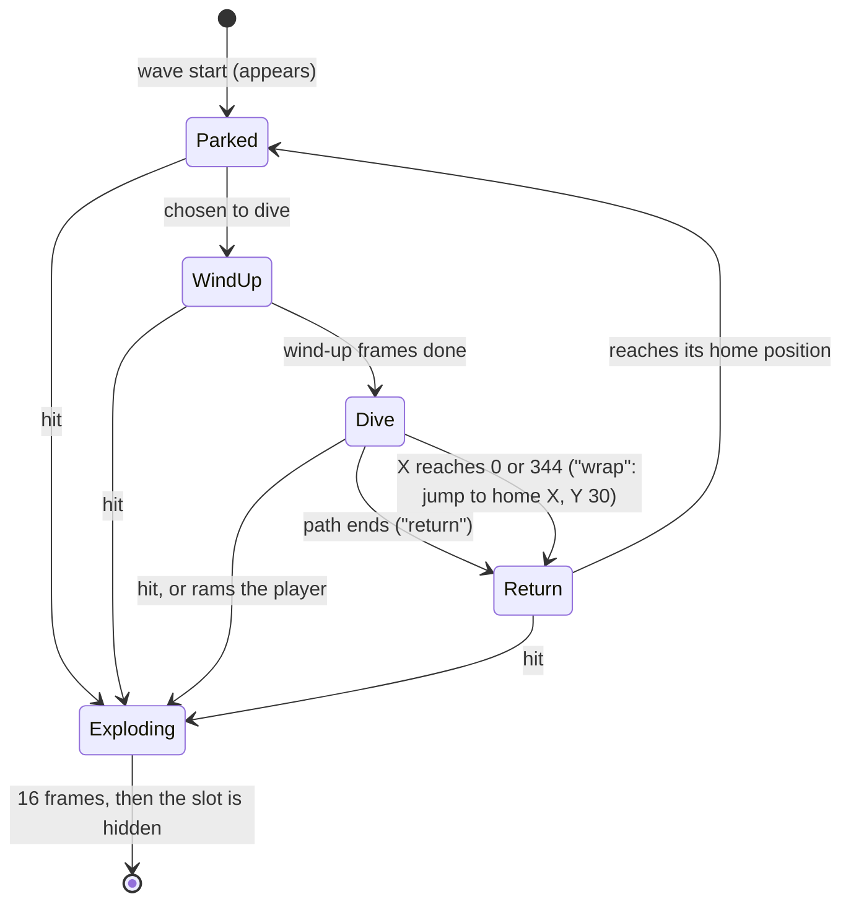
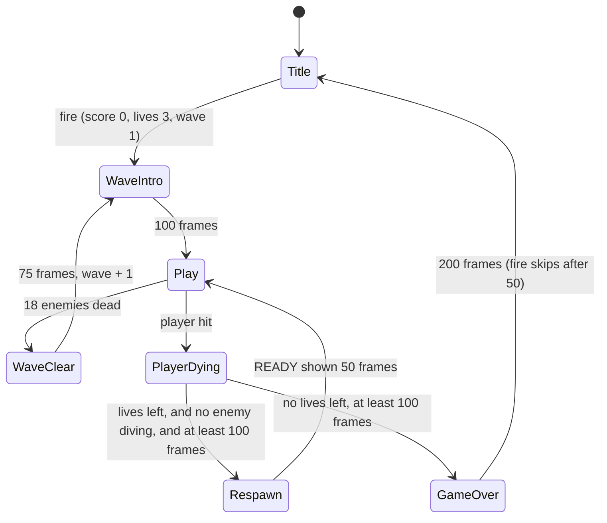

# Swarm: game design

**Status: approved by Simon, 2026-10-01** (stage 0 gate). Changes after playtests go through this
document first, then the code.

M4's training game ([brief](../../milestones/M4-training-game.md)). This document is the source of
truth for behaviour; what Simon decided at approval is in [Decisions](#decisions).

**Changed after the technical design (2026-10-01), no behaviour change:** the panel and the whole
screen use extended colour mode, with a 64-glyph character set
([Screen layout](#screen-layout), [Character set](#character-set-64-glyphs), decision 8); and the
rules for whoever draws the sprites are collected in [Art rules](#art-rules), including the new one
that enemy shapes keep their bottom row empty. **2026-10-02, no behaviour change:** stars are kept
out of every cell that text uses ([Text cells and the star rule](#text-cells-and-the-star-rule)),
sprite and text colours have a table ([Colours](#colours)), and the hit boxes and the area the art
may occupy are exact ([Hit boxes](#hit-boxes)). **2026-10-02, after stage 1, no behaviour change:**
feel target 2 states the measured fire rate (4.76 a second, not 5), the choices the stage 1 build
made where this document was silent are written down as rules
([Stage 1 rules](#stage-1-rules-confirmed-from-the-build)), and the fire-rate options wait for
Simon's playtest ([Tuning options awaiting playtest](#tuning-options-awaiting-playtest)).

Every number that can be checked without the game is checked by
[tests/games/swarm/check_design.py](../../../tests/games/swarm/check_design.py)
(`uv run python tests/games/swarm/check_design.py`; its output is in
[check_design_results.txt](../../../tests/games/swarm/check_design_results.txt)). Its flicker figures
come from a Python model of the multiplexer's selection rules, so they are **design estimates**, not
measurements: QA's `positions.py` on the real game replaces them (deliverable 6).

## The pitch

Eighteen aliens hang in formation over your ship. One at a time, then in twos and threes, they peel
off and dive at you along curving paths, dropping aimed shots, while you slide left and right and
shoot back with two bullets on screen. A diver is worth double, so the best score comes from
shooting the thing that's trying to kill you.

## Units and coordinates

- Time in frames (50 a second). Speeds in pixels per frame.
- Positions are **sprite coordinates**, the values written to `mux_x_*` / `mux_y`: the sprite's
  top-left corner. X 24 is the left edge of the display window and X 320 is the last fully visible
  position; a sprite at X ≤ 0 or X ≥ 344 is off screen. A sprite at Y is displayed on raster lines
  Y + 1 to Y + 21.
- All sprites are 24 × 21, unexpanded, and **all hires, one colour each: every sprite in the same
  mode**. Bullets need the resolution, and uniform zone blocks have the larger timing margin
  ([engine v1 limits](../../../engine/README.md#v1-limits)).

## Screen layout

| Text rows | Raster lines | Contents |
|---|---|---|
| 0–23 | 51–242 | Play area: black background, star field characters, messages, all sprites |
| 24 | 243–250 | Status panel: a solid blue bar with white text, all 40 columns. No raster split is needed |

- **Screen mode: extended colour mode (ECM) for the whole screen**, set once and never changed
  (Simon, 2026-10-01; decision 8). In ECM the top two bits of a cell's screen code choose its
  background colour and the low six bits choose the glyph. Play-area cells use codes 0–63 (black
  background); panel cells use the same glyph's code **+ 64** (blue background), with colour RAM
  white. **Every one of the 40 panel cells is written**, the blanks as space + 64, or the bar has
  black holes. The registers are in the
  [memory map](memory-map.md#the-panel).
- The price is **64 glyphs for the whole screen**. The design uses 35: see
  [Character set](#character-set-64-glyphs).
- Why not reverse video, as this document first said: a reverse-video character draws its glyph in
  the background colour, so the text on a blue bar would be black, not white (measured by the
  Technical Director: `tests/timing/ecm_panel`).

- `MUX_Y_MAX` = **221** (panel line 243 − 22). The player sits at Y 221, displayed on 222–242.
- Panel columns: `SCORE` 1–5, six digits 7–12; `HI` 15–16, six digits 18–23; `WAVE` 26–29, two
  digits 31–32; spare ships 35–37 (one ship character each, 2 at the start of a game: see
  [Stage 1 rules](#stage-1-rules-confirmed-from-the-build) for what the wave number and the markers mean).
- Messages in the play area, row 12, centred: `WAVE nn`, `READY`, `GAME OVER`.
- **Star field:** 48 stars at fixed cells in rows 0–23, from a table (built once from a fixed seed;
  none in the cells reserved for text: [the star rule](#text-cells-and-the-star-rule)). Two star characters (dot high, dot low: one
  pixel each). Twinkle:
  each frame one star, in turn, steps its colour through white, light grey, grey, dark grey. That's
  **one colour RAM write a frame**; each star changes every 48 frames. The stars twinkle only: they
  don't move.

### Text cells and the star rule

Every text the design shows in the play area, with its cells (a text of n characters is centred:
first column (40 − n) div 2):

| Screen | Row | Text | Columns |
|---|---|---|---|
| Title | 5 | `SWARM` | 17–21 |
| Title | 9 / 11 / 13 | `150 PTS` / ` 80 PTS` / ` 50 PTS` (right-aligned) | 17–23 |
| Title | 16 | `DIVING SCORES DOUBLE` | 10–29 |
| Title | 19 | `PRESS FIRE` | 15–24 |
| Game | 12 | `WAVE nn` | 16–22 |
| Game | 12 | `READY` | 17–21 |
| Game over | 12 | `GAME OVER` | 15–23 |

**The star rule: no star in columns 10–29 of rows 5, 9, 11, 12, 13, 16 and 19.** That is one
20-column band on each of the seven text rows (140 of the 960 play-area cells), wide enough for the
longest text, so the same test serves every row. The 48 stars are drawn from the other 820 cells;
the count doesn't change. Because of the rule, a text is written and erased (with spaces) without
looking at the star table, and the twinkle's colour write never lands on a letter.

**If a text is added, moved or lengthened:** it must stay inside those bands, or the band list
(rows, columns 10–29) changes here first and the star table is rebuilt from it. The title's parked
sprites may pass over stars, as sprites do in play.

### Title and game-over screens

- **Title:** the star field and panel (showing the high score) stay. `SWARM` on row 5; rows 9, 11
  and 13 show one parked enemy sprite of each type (X 120, Y 119 / 135 / 151: three sprites, 16 lines
  apart, far below any limit) with `150 PTS`, `80 PTS`, `50 PTS` beside them; `DIVING SCORES DOUBLE`
  on row 16; `PRESS FIRE` on row 19, on for 32 frames and off for 32. Fire starts a game.
- **Game over:** `GAME OVER` on row 12 for 200 frames (fire skips it after 50), then the title. The
  high score is updated when the game ends.

### Character set (64 glyphs)

ECM allows screen codes 0–63 only. Everything the design puts on the screen, counted:

| Text | Where | Letters it needs |
|---|---|---|
| `SCORE`, `HI`, `WAVE` | Panel | S C O R E H I W A V |
| `WAVE nn`, `READY`, `GAME OVER` | Row 12 | + D Y G M |
| `SWARM` | Title | (none new) |
| `150 PTS`, `80 PTS`, `50 PTS` | Title | + P T |
| `DIVING SCORES DOUBLE` | Title | + N U B L |
| `PRESS FIRE` | Title | + F |

| Glyphs | Count | Screen codes |
|---|---|---|
| Letters `A B C D E F G H I L M N O P R S T U V W Y` | 21 | 1–25, the ROM's own (within A–Z) |
| Digits `0`–`9` | 10 | 48–57, the ROM's own |
| Space | 1 | 32 |
| Star, dot high; star, dot low | 2 | Custom: two codes no text uses |
| Ship (the spare-ships marker in the panel) | 1 | Custom: one code no text uses |
| **Total used** | **35 of 64** | **29 spare** |

- **Nothing had to be cut or reworded.** All the text is capitals, digits and spaces: no
  punctuation, no lower case. The five letters not used (J K Q X Z) and all the punctuation in codes
  33–47 and 58–63 are still there if a later text wants them.
- The three custom glyphs go in codes that no text uses; codes **27–29** (`[`, `£`, `]`) are the
  suggestion, the choice is the engineer's.
- **Rule for any text added later:** capitals, digits and the ROM's punctuation in codes 0–63 only.
  No lower case, no reverse video, no graphics characters (all are codes 64 and up, which ECM shows
  as a glyph from 0–63 on another background colour).
- Stars keep all 16 colours: ECM restricts glyphs and backgrounds, not the colour RAM colour.

## Controls and rules

Joystick in port 2.

| Input | Effect |
|---|---|
| Left / right | Player X − 3 / + 3 a frame, clamped to 24–318. No inertia |
| Left and right together | Nothing: they cancel |
| Fire (held or pressed) | Fires if a player-shot slot is free and the cooldown is 0. The cooldown is 10 frames from each shot. Holding fire repeats |
| Up / down | Nothing, alone or with any other input |

- **What kills the player:** an enemy shot's box or an enemy's box overlapping the player's box
  (boxes below). An enemy that rams the player dies too and scores its diving value.
- **What scores:** a player shot hitting an enemy; clearing a wave.
- The player has **3 lives**. No extra lives. (Tuning note: if five minutes feels short, add one at
  10,000 points.)

### Stage 1 rules (confirmed from the build)

Cases this document left open, which the stage 1 build chose. **All confirmed as built: no
behaviour change.** Measured by [check.py](../../../tests/games/swarm/check.py)
([results](../../../tests/games/swarm/check_results.txt)).

| # | Rule | Why |
|---|---|---|
| 1 | **Left and right together cancel:** no movement, fire still works | A stick can't do it; a keyboard-mapped emulator can. No direction should win by accident of the code |
| 2 | **Start X = respawn X = 171**, at the start of every game and after every death | The middle of 24–318, and on the 3-pixel grid: 49 frames to either edge |
| 3 | **Order each frame: player shots move and are removed, then the player moves, then fires.** So (a) a shot spawns at the player's X **after** this frame's move; (b) a new shot is shown at Y 213 for one frame before it moves: 21 frames in all, Y 213 down to 53; (c) a slot freed this frame can fire this frame | (b) puts the shot's first frame at the ship's nose, so it is seen to leave the ship. (c) costs a miss nothing extra. Later stages keep the order: shots move, collisions, then the player |
| 4 | **The cooldown** is set to 10 when a shot spawns and counts down once a frame: the next shot is 10 frames later at the earliest, fire held or tapped | Measured: gaps of exactly 10 with a slot always free |
| 5 | **Up and down do nothing,** alone or with other inputs | As the table above |
| 6 | **Spare-ship markers = lives − 1** (none at 0 lives), filled from column 35, redrawn whenever lives changes. 3 lives: 2 markers, column 37 blank (it is there for the extra life of decision 4, if that is ever added) | The ship in play isn't a spare. The marker goes at the hit, when lives goes down, not at the respawn: one rule, one redraw |
| 7 | **The panel's `WAVE` and the `WAVE nn` message both show n, the running count** from 1: n = loop × 3 + pattern (pattern 1–3, loop from 0). Two digits, **stopping at 99**; the game carries on past it | A pattern number would read 1, 2, 3, 1: the player wants to see how far he got |
| 8 | **From stage 4, three stores:** the shown wave (BCD, 01–99, sticks at 99), the pattern index (0–2, cycles for ever), the loop (0–3, sticks at 3, first reached at wave 10). Pattern and loop are counted, never derived from the shown number | No divide by 3 in 6502, and the pattern must keep cycling after the display stops at 99 |

## Entities

| Kind | Virtual sprites | Most at once | Pinned | Speed | Notes |
|---|---|---|---|---|---|
| Player | 0 | 1 | **Yes** | 3 px/frame, X only | Y fixed at 221. Its explosion uses the same slot |
| Enemy shot | 1–3 | 3 | **Yes** | Y + 2 a frame (+ 3 from loop 2), X − 1, 0 or + 1 | Removed when Y > 221 |
| Player shot | 4–5 | 2 | No | Y − 8 a frame | Spawns at (player X, 213), shown there for one frame. Removed when Y < 46 (last shown at Y 53), or on a hit |
| Enemy | 6–23 (6 + row × 6 + column) | 18 | No | Parked: the drift. Diving: up to 2 px X, 3 px Y a path step | Its explosion uses the same slot |

**Total 24 of 24, 4 pinned of 4.** This is the brief's split, reordered so the pinned sprites have
the lowest indices (the engine pins the first four flagged).

**Why these four are pinned.** The player must never flicker (Simon). The other three go to enemy
shots because they are the small things that kill: a bullet missing for a frame is an unfair death,
while a 24-pixel diver missing for one frame is still readable. The cost is that the flicker moves
onto divers and player shots: with the shots pinned the model gives enemy shots 0% missing, divers
up to 2.1% and player shots up to 1.2% of their frames; with only the player pinned, enemy shots are
missing in up to 3.8% of theirs (`check_design_results.txt`, both tables).

### Hit boxes

In sprite pixels inside the 24 × 21 cell: columns 0–23 from the left, rows 0–20 from the top,
ranges inclusive. The **hit box** is what the collision code tests. The **art area** is every pixel
the shape may use: nothing is drawn outside it. For the player and the enemies it is the box plus
exactly 2 pixels on each side, cut off at the cell's edge; for the shots it is the box.

| Kind | Hit box: left, top, width, height | Hit box columns, rows | Art area columns, rows | Art area size |
|---|---|---|---|---|
| Player | 6, 6, 12, 15 | 6–17, 6–20 | **4–19, 4–20** | 16 × 17 (the ship is bigger than its box: near misses are misses) |
| Enemy (types A, B, C, both frames; every state but exploding) | 4, 3, 16, 15 | 4–19, 3–17 | **2–21, 1–19** (rows 0 and 20 empty) | 20 × 19 |
| Player shot | 11, 0, 2, 8 | 11–12, 0–7 | **11–12, 0–7**: the box, every pixel set | 2 × 8, at the top of the cell |
| Enemy shot | 11, 14, 2, 7 | 11–12, 14–20 | **11–12, 14–20**: the box, every pixel set | 2 × 7, at the bottom of the cell |
| Explosion (4 shapes) | none: an explosion hits nothing and can't be hit | – | 0–23, 0–20: the whole cell | 24 × 21 |

The player and enemy shapes must also **reach** their box: some pixel on each of the box's four
edges, so that a hit is never scored on empty space more than a pixel or two from the drawing.

Consequences (checked): an enemy can touch the player only at **Y ≥ 210**; an enemy shot hits from
Y ≥ 207; a player shot moving 8 a frame can't pass through a 15-line enemy box.

### Sprite shapes (13)

Player; player shot; enemy shot; enemy types A, B, C × 2 animation frames; explosion × 4. Enemies
swap frames every 16 frames, all together. The enemy explosion is 4 shapes × 4 frames (16 frames,
stationary); the player's is the same 4 shapes × 8 frames (32 frames) in white.

### Art rules

For whoever draws the sprites. Colours are set by the game, per sprite, not by the art.

1. **24 × 21 pixels, hires, one colour plus transparent.** No multicolour, no expanded sprites, and
   no exceptions: every sprite on screen is in the same mode (decision 7).
2. **13 shapes**, as listed above. Each stays inside its **art area** in the
   [hit box table](#hit-boxes) (exact columns and rows) and is centred on its box: a shape that
   overhangs its box makes deaths look unfair.
3. **Enemy shapes (types A, B, C, both frames) keep sprite row 20, the bottom row, empty.** A
   wrapping diver re-enters at Y 30, which is displayed on raster lines 31–51, and line 51 is the
   first line of the display window: anything drawn in row 20 would show for a frame as a line of
   pixels at the top of the screen, above the enemy's home. The enemy art area is rows 1–19, so
   this costs nothing.
4. **Player shot:** 2 pixels wide, in columns 11–12, rows 0–7 (the top of the cell). **Enemy
   shot:** 2 pixels wide, columns 11–12, rows 14–20 (the bottom of the cell). The rest of each cell
   is empty: the shape is the hit box.
5. **Enemy animation:** the two frames of a type have the same outline size and centre, so the
   16-frame swap doesn't look like movement.
6. **One set of 4 explosion shapes** serves enemies and the player; they are drawn in the dead
   object's slot and may fill the cell.
7. **Among sprites, white is reserved** for the wind-up flash and the player's explosion (text is
   white too: the panel and the messages). No sprite's own colour is white or light grey, and none
   is blue, which is the panel's colour. The colours are in the table below.

### Colours

**The designer's proposal for placeholder art.** Simon is art director and reviews the colours in
the first playable build: **this is the one table to change**, and the code takes its colours from
one table to match. Colour changes don't touch behaviour. Names and numbers are the C64's 16.

| Thing | Colour | Why |
|---|---|---|
| Player | **Cyan** (3) | Bright and cool; nothing else on screen is cyan but its own shots |
| Player shot | **Cyan** (3) | Reads as the player's |
| Enemy type A (row 0, 150 / 300) | **Purple** (4) | The three types are a warm, a cool-dark and a green hue, far apart on black |
| Enemy type B (row 1, 80 / 160) | **Yellow** (7) | |
| Enemy type C (row 2, 50 / 100) | **Light green** (13) | |
| Enemy animation frames | Both frames of a type are the type's colour | The colour is the type; the animation is only the shape |
| Enemy in WindUp | Its type's colour, and **white** (1) on alternate 4-frame periods | The warning (behaviour table) |
| Enemy shot | **Light red** (10) | The only red thing on screen: the thing that kills. Can't be taken for a cyan player shot or for any enemy |
| Enemy explosion | **Orange** (8), all 4 shapes | Used for nothing else, so a kill reads the same whatever died |
| Player explosion | **White** (1), all 4 shapes | As designed |
| Player after a respawn (100 frames) | **Cyan** (3) and **dark grey** (11), alternating every 4 frames | A ghost of the ship: visibly there, visibly not normal. Not white, so it isn't read as an explosion |
| Title screen's three parked enemies | Their types' colours | |
| Panel text and ship markers | **White** (1) on **blue** (6) | Decision 8 |
| Messages and title text | **White** (1) on black | |
| Stars | White, light grey (15), grey (12), dark grey (11), in turn | The twinkle |
| Background and border | **Black** (0) | |

## The formation

| | |
|---|---|
| Rows (Y) | Row 0: **56**, row 1: **96**, row 2: **136** (40 lines apart; displayed on 57–77, 97–117, 137–157) |
| Columns (X) | 34 + `fx` + 36 × column, columns 0–5 |
| Drift | `fx` runs 0 → 96 → 0 as a triangle, 1 pixel every 2 frames (every frame from loop 2). Starts at 48, moving right. X only: parked enemies never change Y |
| Extent | Sprite X 34–310 over the whole drift (visible range 24–320) |
| Types | Row 0: type A, row 1: type B, row 2: type C |

**Why 40 lines.** By the multiplexer's selection rule three rows of 6 are all shown from **31
lines** apart (the brief's 24 would flicker: checked by the script), and the README's written
guarantee needs 39. At 40, each row's guarantee window (Y − 38 … Y + 25) holds only its own 6, so
**two more sprites can cross any row with no flicker at all**: both player shots, or a shot and a
diver. Flicker starts with the third visitor. The price is height: 64 lines between the bottom
row and the player.

Tuning note: if the dives feel cramped, try **32** in stage 3. It adds 16 lines of dive height and
makes every crossing flicker; it's one table.

## Enemy behaviour

| State | Position each frame | Scores | Fires |
|---|---|---|---|
| Parked | Home: (34 + `fx` + 36 × column, row Y) | Parked value | No |
| WindUp | Home, plus 1 pixel left/right alternating every 2 frames; drawn white on alternate 4-frame periods. Lasts 24 / 20 / 16 / 12 frames (loops 0–3). The dive sound starts here | Diving value | No |
| Dive | The path table, one step a frame (more on later loops) | Diving value | At the path's fire steps |
| Return | X moves toward home X by at most 2, Y toward home Y by at most 2, every frame, until both match | Diving value | No |
| Exploding | Stationary | – | No |

### Dive paths

One path per row. A path is a list of segments **(dx, dy, steps)**: add (dx, dy) to the position
once per step. Authored heading right; at the end of the wind-up the diver is **mirrored** (dx
negated for the whole dive) if the player's X is less than its own, so every dive heads for the
player's side. X is clamped to 0–344 (both ends are off screen). `steps` = 0 means "repeat until X
reaches 0 or 344".

**Hook** (row 2, type C). Ends in Return (climbs home from below: 32 frames). 58 steps.

| # | dx | dy | Steps | Offset after (x, Y) | What it looks like |
|---|---|---|---|---|---|
| 1 | +1 | +1 | 8 | (8, 144) | Peels off |
| 2 | +2 | +2 | 12 | (32, 168) | Dives toward the player's side |
| 3 | +1 | +3 | 12 | (44, 204) | Steepens |
| 4 | 0 | +2 | 6 | (44, 216) | Drops to the player's level |
| 5 | −2 | 0 | 12 | (20, 216) | Skims back the way it came, 24 pixels |
| 6 | −1 | −2 | 8 | (12, 200) | Pulls up, then Return |

Fire steps: 8 (Y 144), 16 (Y 160). Lethal to touch (Y ≥ 210) on steps 35–53: 19 steps.

**Sweep** (row 1, type B). Never low enough to ram: it's the bomber. Ends by leaving the side of the
screen, then wraps. 38 fixed steps, at most 175 before it's off screen.

| # | dx | dy | Steps | Offset after (x, Y) | What it looks like |
|---|---|---|---|---|---|
| 1 | −1 | +1 | 8 | (−8, 104) | Peels away from the player first |
| 2 | +1 | +2 | 16 | (8, 136) | Swings back down through row 2 |
| 3 | +2 | +2 | 14 | (36, 164) | Levels out below the formation |
| 4 | +2 | 0 | 0 | off screen at Y 164 | Runs across the screen, bombing |

Fire steps: 24 (Y 136), 38, 62, 86 (all Y 164).

**Plunge** (row 0, type A). The long fast dive from the top. Leaves the side of the screen, then
wraps. 95 fixed steps, at most 188 before it's off screen.

| # | dx | dy | Steps | Offset after (x, Y) | What it looks like |
|---|---|---|---|---|---|
| 1 | 0 | −1 | 6 | (0, 50) | Rises out of the row |
| 2 | +1 | +2 | 20 | (20, 90) | Tips over toward the player |
| 3 | +2 | +3 | 20 | (60, 150) | Full dive |
| 4 | +1 | +3 | 16 | (76, 198) | Straightens |
| 5 | 0 | +2 | 9 | (76, 216) | Drops to the player's level |
| 6 | +2 | −1 | 24 | (124, 192) | Pulls up and away |
| 7 | +2 | 0 | 0 | off screen at Y 192 | Leaves |

Fire steps: 26 (Y 90), 36 (Y 120), 46 (Y 150). Lethal to touch on steps 68–77: 10 steps.

**Wrap.** When a wrapping diver's X reaches 0 or 344 it jumps to (home X, 30), hidden under the top
border, and enters Return: it slides down into its place in 13 frames (row 0) or 33 (row 1).

**Why no diver leaves through the bottom:** a sprite can't overlap the panel, so it would vanish in
full view at Y 221. Divers leave sideways or climb back. And no lethal skim runs toward a screen
edge, so the player is never cornered by something he can't shoot.

### Firing

- At each of its path's fire steps a diver fires if: it has shots left for this dive (table below),
  an enemy-shot slot (1–3) is free, its Y ≤ **164**, and its X is 24–320.
- The shot starts at the diver's position. Its dx is fixed when fired: 0 if the player's X is within
  16 of the shot's, else 1 toward the player. Its dy is 2 (3 from loop 2).
- From Y 164 a shot reaches the player in 22 frames at dy 2, 15 at dy 3: never point blank.

### Choosing a diver

A launch timer counts down every frame of play while the player is alive. At 0, if fewer than the
wave's maximum of enemies are in WindUp, Dive or Return: pick at random among the Parked enemies
in the wave's rows (if there are none, among all Parked enemies), put it in WindUp, and reload the
timer with the wave's interval, **halved when 4 or fewer enemies are alive**. Otherwise retry next
frame. An enemy always uses its own row's path.

## Waves

Wave n (from 1): pattern = (n − 1) mod 3 + 1 (the table's 1–3), loop = (n − 1) div 3. The formation
is the same 18 each time. Loops past 3 play as loop 3. What is shown and what is stored:
[Stage 1 rules](#stage-1-rules-confirmed-from-the-build) 7 and 8.

| Pattern | Rows that dive | Max diving at once (loops 0 / 1 / 2 / 3) | Launch interval, frames (loops 0 / 1 / 2 / 3) | Shots per dive at loop 0 |
|---|---|---|---|---|
| 1 "Hooks" | 2 | 1 / 2 / 2 / 2 | 150 / 120 / 100 / 80 | 1 |
| 2 "Bombers" | 1, 2 | 2 / 2 / 3 / 3 | 120 / 100 / 80 / 64 | 2 |
| 3 "All in" | 0, 1, 2 | 2 / 3 / 3 / 3 | 100 / 80 / 64 / 50 | 2 |

**What "faster" means,** per loop:

| | Loop 0 | Loop 1 | Loop 2 | Loop 3+ |
|---|---|---|---|---|
| Path steps per frame for a diver | 1 | 1, and 2 on every 4th frame (× 1.25) | 1, and 2 on every 2nd frame (× 1.5) | as loop 2 |
| Shots per dive | table above | + 1 | + 2 | + 3 (never more than the path's fire steps) |
| Enemy shot dy | 2 | 2 | 3 | 3 |
| Wind-up frames | 24 | 20 | 16 | 12 |
| Formation drift | 1 px / 2 frames | 1 px / 2 frames | 1 px / frame | 1 px / frame |

Return speed, player speed and player shots never change.

**Wave start:** `WAVE nn` shows for 75 frames. Enemies appear in place (no fly-in), one every 2 frames, row 0 first, left
to right (36 frames). Play begins at frame 100 with the launch timer at 50. **Wave clear** (all 18 dead and exploded):
+ 1,000, 75 frames' pause, next wave.

## Scoring

| Event | Points |
|---|---|
| Type C (row 2) | 50 parked, 100 diving |
| Type B (row 1) | 80 parked, 160 diving |
| Type A (row 0) | 150 parked, 300 diving |
| Wave cleared | 1,000 |

"Diving" is any of WindUp, Dive and Return. Six decimal digits (BCD), stopping at 999,990. The
session high score starts at 5,000 and is lost at power-off. A wave is worth 2,680 to 4,360.

## Game flow

**Losing a life:** on the hit, lives − 1, enemy shots are removed, the player explodes (32 frames) and
is hidden. No new dives start; enemies already diving finish and return. Player shots in flight
carry on and score. On respawn the player appears at X 171 and can't be hit for 100 frames (drawn
in alternating colours every 4 frames, not hidden); the launch timer restarts at 50. If the last
enemy dies while the player is dying, the wave clear follows the respawn.

## Worst case per frame

Active objects (all bounded by the slot counts):

| Kind | Most at once | Per-frame work each |
|---|---|---|
| Player | 1 | Joystick, move, fire |
| Player shots | 2 | Move; box test against up to 18 enemies (36 tests) |
| Enemy shots | 3 | Move; box test against the player (3 tests) |
| Enemies parked or winding up | 18 | Home position from `fx` |
| Enemies in Dive or Return | 3 (2 until loop 1) | Up to 2 path steps; box test against the player (3 tests) |
| Explosions | 2 enemy + 1 player (in the dead object's slot) | Animation timer |
| Stars | 1 colour write | |
| Sound | 3 voices | |
| **Box tests in all** | **42** | |
| Sprites whose Y changes by more than 8 lines in one frame | **3** (a wrap, a shot spawning or leaving) | No mass re-sort ever: the formation's Y is fixed and enemies appear one per 2 frames |

Sprites per window, from the model (full formation, nothing ever dies, player firing at the maximum
rate, 6,000 frames per row; "window" is the README's Y − 38 … Y + 25 around any one sprite):

| Situation | Most in one window | Frames with any sprite dropped | Longest run a sprite is missing |
|---|---|---|---|
| Formation, player, 2 shots, no diver | at most 8 | 0% | 0 |
| Pattern 1, loop 0 | 14 | 0% | 0 |
| Pattern 2, loop 0 | 14 | 2.2% | 1 frame |
| Pattern 3, loop 0 | 16 | 7.1% | 1 frame |
| Pattern 3, loop 3 (the worst) | 17 | 10.5% | 1 frame |
| Player and enemy shots, every case | – | **never dropped** | 0 |

Sprites in the shown range: up to **24**, every slot in use at once, first when all 3 enemy shots
are in flight together: pattern 2 from loop 1, where a dive has 3 shots (the model's "sprites in
range" column; divers don't add to it, being enemies that are already counted). A window of 14–17 is a diver
between two rows, seeing both; what matters is the dropped column. A real game is lighter: enemies
die, and shots stop at the first thing they hit.

**Close to the limits:** all 24 virtual sprites and all 4 pins are used, with none spare. Row spacing
40 against the guarantee's 39. The player's zone (Y 183–221) can hold player + 2 shots + 3 enemy
shots + 3 divers = 9, one over, from loop 1: the four pinned are safe and a diver or player shot
misses a frame. Pinned sprites evicting in a crowd cost CPU (README: about 226 cycles an eviction),
which is the Technical Director's to budget; the v1 promise's one exception needs a mass re-sort,
which this design never does.

## Requests of the engine

**None are required**: everything above fits v1 as documented. What the design needs from the
modules M4 already plans: box collisions with a different box per kind (`engine/collision.asm`), an
8-bit random number (`engine/rng.asm`), joystick port 2 with fire (`engine/input.asm`), and three
SID voices with priorities (`engine/sfx.asm`).

One thing it would use if it existed, with what it buys: **sprites passing behind the bottom panel**
would let divers leave through the bottom, as in Galaga, instead of sideways. Multiplexer v1 can't do it, so it is a **candidate for multiplexer v2, not
part of M4**. The design above is the version without it.

## Sound effects

No music. One effect per voice at a time; a new effect replaces one of equal or lower priority on
its voice.

| Effect | When | Voice | Priority | Sounds like | Frames |
|---|---|---|---|---|---|
| Player shot | A player shot spawns | 1 | 1 | A short, high pulse-wave "pew" falling in pitch | 8 |
| Enemy shot | An enemy shot spawns | 1 | 1 | A lower, duller blip | 6 |
| Dive | WindUp starts | 3 | 1 | A sawtooth swooping down over about an octave | 30 |
| Enemy explosion | An enemy is hit | 2 | 2 | A noise burst, quick decay | 16 |
| Player hit | The player is hit | 2 and 3 | 3 | A long, low noise rumble falling in pitch | 60 |
| Wave start | WaveIntro starts | 1 | 2 | Three rising notes | 30 |
| Wave clear | WaveClear starts | 1 | 2 | Four rising notes | 40 |
| Start / game over | Leaving the title; GameOver starts | 1 | 3 | One bright note; three falling notes | 10; 50 |

## Feel targets

A playtester can check each of these.

1. The player crosses the screen in **1.96 s** (98 frames) and stops the frame the stick is released.
2. A player shot reaches the bottom row in 8 frames and, if it hits nothing, is gone after 21.
   Holding fire with every shot missing gives **4.76 shots a second**: 2 shots every 21 frames,
   spawned at frames 0, 10, 21, 31, 42 (gaps of 10 and 11). **The two slots are the limit, not the
   10-frame cooldown**, because a miss lives 21 frames and two cooldowns are 20. The rate is exactly
   5 a second only while each shot hits something within 20 frames. Measured in the game
   (`check.py` fire-hold: 20 shots in 200 frames, printed as 4.77) and the same in the model. (An
   earlier version of this target said a steady 5 with the cooldown as the limit: that was wrong.
   Tuning: [options below](#tuning-options-awaiting-playtest). If misses should cost more, slow the
   shot to 6 px/frame: a miss then lives 28 frames, 3.57 shots a second.)
3. A dive is announced: the wind-up (flash and sound) starts **1.2 s** before a Hook can first touch
   the player at loop 0 (24 wind-up frames + 35 path steps), and about 0.7 s at loop 3 (12 + 24).
4. No enemy shot arrives less than **0.44 s** after it's fired at loops 0–1, 0.3 s later.
5. The player and the enemy shots never flicker. Nothing is missing for 2 frames running.
6. With nothing diving, nothing flickers.
7. A new player clears wave 1 on the first or second game, and usually loses the first life in
   wave 2 or 3.
8. A first game lasts 2 to 4 minutes. A good player reaches loop 2 (wave 7) in about 5 minutes.
9. Every death has a visible cause: the player can say what hit him.
10. Shooting a diver feels better than clearing parked enemies: the scores above make a game spent
    on divers worth about 1.6 times one spent on the formation.

## Tuning options awaiting playtest

**Held fire rate.** Not changed until Simon has played stage 1. A miss lives 21 frames (Y 213 to 53
by 8), so held fire is 100 / 21 = 4.76 a second.

| | Change | Held rate, all misses | Costs |
|---|---|---|---|
| **a** | **None** | 4.76 a second, gaps 10, 11, 10, 11 frames; 5.00 when shots hit within 20 frames | Nothing. The 5% and the 1-frame (20 ms) difference between gaps can't be seen or heard |
| b | Kill line: removed when Y < **54** (from 46). A miss lives 20 frames, last shown at Y 61 | 5.00, gaps all 10 | The shot vanishes 8 lines lower: its top at raster line 62, 11 lines inside the screen, not 3. Row 0 is still hit (its box is lines 60–74). A diver sliding in from the wrap can first be hit at Y 44, not 36: 4 frames later |
| c | A third shot slot | 5.00, gaps all 10, up to 3 in flight | **No free sprite: all 24 are allocated and v1 has no 25th.** It takes an enemy shot's slot (3 to 2, which removes the third bomb of pattern 2 from loop 1) or an enemy (17, against the brief's 18). Box tests 36 to 54. A third shot is the third visitor in a row's window, which is where flicker starts ([The formation](#the-formation)) |
| d | Spawn at Y **205** (from 213). A miss lives 20 frames, kill line and top of screen unchanged | 5.00, gaps all 10 | The shot appears 12 lines above the ship's nose, not 4: it looks less like it left the gun |

**Recommendation: a.** The gap between 4.76 and 5.00 is one frame in 21; b, c and d each trade it
for something the player can see. If the fire feels too slow or too fast in play, that is a
different question (shot speed, or how many shots), and it gets its own numbers after the playtest.
If Simon wants exactly 5, take **b**: one constant, no sprite, no art.

## Decisions

Simon, 2026-10-01: the stage 0 open questions, each answered as recommended.

| # | Question | Decision | Why |
|---|---|---|---|
| 1 | Which sprites are pinned besides the player? | **The 3 enemy shots** | A lethal bullet that flickers is an unfair death; the flicker goes to divers and the player's own shots instead (about 2% and 1% of their frames in the worst wave, one frame at a time) |
| 2 | One-row panel, or two rows with a divider? | **One row** | A second row would cost 8 of the 64 lines between the formation and the player, which is where the game is played |
| 3 | Row spacing 40 lines, or tighter for a taller dive zone? | **40.** Try 32 in stage 3 if the dives feel cramped | 40 lets both player shots cross a row with no flicker |
| 4 | Extra lives? | **None** for M4. Add one at 10,000 if five minutes feels short | The brief says 3 lives |
| 5 | Should the stars drift downward? | **No: twinkle only**, no drift yet | A drift costs about 12 screen writes every 8 frames; twinkle is one colour write a frame |
| 6 | Enemies appear in place at wave start, with no fly-in. Enough? | **Yes: no fly-in** | A fly-in is a fourth and fifth path and a mass re-sort risk |
| 7 | Hires or multicolour sprites? | **Hires, all sprites the same mode** | Sharper bullets and the larger zone-timing margin |

Simon, 2026-10-01, after the technical design:

| # | Question | Decision | Why |
|---|---|---|---|
| 8 | The panel's white text on a blue bar can't be done with reverse video (the text would be black). Extended colour mode, or black text on a lighter bar? | **Extended colour mode for the whole screen** | White on blue as designed, with no raster split. The cost is 64 glyphs for the whole screen; the design uses 35 ([Character set](#character-set-64-glyphs)) |

Noted, not required: divers leaving through the bottom (see
[Requests of the engine](#requests-of-the-engine)), a multiplexer v2 candidate.
