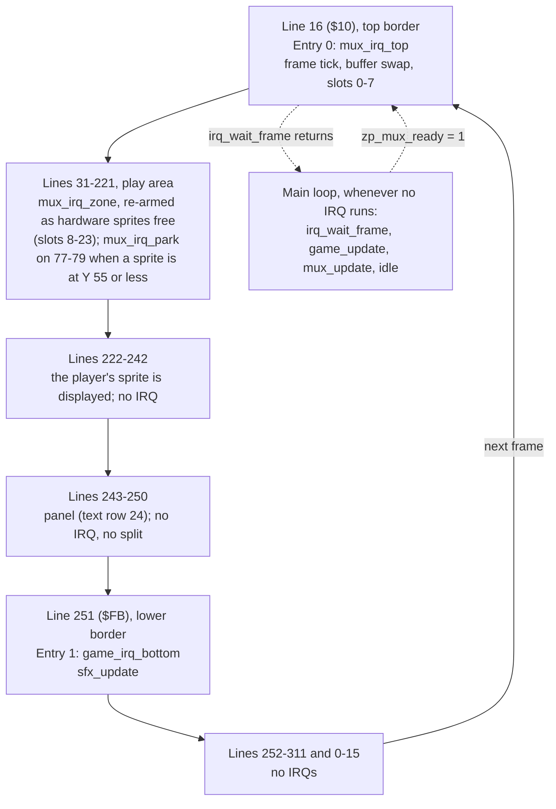

# Swarm: memory map, raster timeline and frame budget

M4 stage 0 technical design (Technical Director, 2026-10-01; brought in line with the design doc
and the engine README on 2026-10-02: panel decided, character set, colour and star tables; stage 1's
measured costs, the panel budget decision and the main loop as built added the same day, then
stage 2's: the collision budget raised from measurement, [Stage 2 part A, measured](#stage-2-part-a-measured);
then the stage 3 budget decisions: [Stage 2 part B, measured](#stage-2-part-b-measured), `stars_update`
moved, rows 3, 4 and 10 re-set, [Stage 3: what the gameplay-engineer must do](#stage-3-what-the-gameplay-engineer-must-do-to-stay-in-budget)) for the approved
[game design](design.md) and the [M4 brief](../../milestones/M4-training-game.md). The
gameplay-engineer builds to this page; changing the layout means changing this page in the same
commit ([coding standards](../../standards/coding-standards.md#memory)).

**How to read the numbers:** **measured** = from a probe or the engine's spikes, with its source;
*estimate* = a design figure nobody has measured yet (CPU cycles counted from the intended code,
then × 1.27 for DMA, the measured share for main-loop code running through the display with 24
sprites: [vic-ii-timing.md](../../reference/vic-ii-timing.md#frame-budget-worked-example-pal));
*counted* = worked out from measured parts (instruction cycles, or the measured steals laid on a
raster line: [Short routines in the display](#short-routines-in-the-display)), not yet seen in a run;
*model* = from a Python model of the multiplexer's selection rules, an estimate too. Every estimate
here has a check in [tests/games/swarm/budget.json](../../../tests/games/swarm/budget.json) that
replaces it with a measurement at the stage named.

## Verdict

**The approved design fits the machine and engine v1.** The one correction this page asked for
(the panel's colours) is decided and in the design: [The panel](#the-panel). Budgeted game logic and sound: **6,575** raster cycles a frame against the engine's promise
of **7,200** ([engine/README.md](../../../engine/README.md#the-v1-promise-and-its-one-exception),
**measured**): **625 of headroom (8.7%)**. It was 6,265 and 935 until the collision module was
**measured** in stage 2: its 42 tests cost more than counted and row 8 rose by 350
([The collision budget](#the-collision-budget)), which made 6,615 and 585; the stage 3 decisions
(2026-10-02) raised row 3 by 90 and lowered rows 4 and 10 by 130 between them
([Short routines in the display](#short-routines-in-the-display)). In a normal frame
the game has about 11,600 available, so the headroom there is about 5,000. The one place the
budget no longer fits is the engine's excepted case (about 6,400 left), which the model says this
design doesn't reach: [Risks](#risks-in-order), item 1. Stage 1's routines and stage 2's formation
are **measured** and inside their rows ([Stage 1, measured](#stage-1-measured),
[Stage 2 part A, measured](#stage-2-part-a-measured),
[Stage 2 part B, measured](#stage-2-part-b-measured)) with one exception, `stars_update`, which met
a badline after the collisions (129 against 100) and moves back to the border. Almost everything
measured so far ran above the display's first badline, so the display allowance for long routines
is tested only by the collision spike (× 1.23–1.29 **measured** against the 1.27 assumed).
**The stage 3 design fits**: [Does stage 3 fit?](#does-stage-3-fit-yes-by-count).

## Configuration

| Setting | Value | Why |
|---|---|---|
| `$01` | `$35` | BASIC and KERNAL out, I/O in. Set by `irq_init`; never changed afterwards |
| VIC bank (`$DD00`) | 0 (`$0000–$3FFF`), the power-on default: not written | The whole program is one PRG from `$0801`; nothing has to be copied under I/O (which would need `$01=$34` with interrupts off). It's the configuration every multiplexer measurement was taken in. The cost: the VIC can't see `$1000–$1FFF`, so only code goes there |
| `$D018` | `$1A` | Screen at `$0400`, charset at `$2800` |
| `$D011` | `$5B`, written once at init | Extended colour mode (ECM) on, screen on, 25 rows, YSCROLL 3, bit 7 clear ([IRQ ownership](../../standards/coding-standards.md#irq-ownership)). See [The panel](#the-panel) |
| `$D016` | `$C8` (default) | 40 columns, no multicolour, XSCROLL 0 |
| `$D020` / `$D021` / `$D022` | black / black / blue | Border, play area background, panel background (ECM background 1) |
| `$D015`, `$D010`, `$D01C`, `$D000–$D00F`, `$D027–$D02E` | Multiplexer's | Game code never writes them |
| `$D017`, `$D01D` | 0, written once at init | No sprite expansion (engine v1 condition 4) |
| `$D01B` | 0 | Sprites in front of characters |
| `MUX_SCREEN` | `$0400` | Sprite pointers at `$07F8–$07FF` |
| `MUX_Y_MAX` | `221` (`$DD`) | Panel starts on line 243; a sprite at Y shows on Y+1…Y+21 (**measured**, `tests/timing/sprite_wrap`), so 243 − 22 |
| SID `$D400–$D418` | `engine/sfx.asm`'s | Game code never writes them |
| CIA 1 `$DC00`, `$DC02` | `engine/input.asm`'s | Joystick port 2 |
| Video standard | PAL | |

### The panel

**Decided: extended colour mode (ECM) for the whole screen, set once at init. No raster split and
no chain entry for the panel** (Simon, 2026-10-01; [design decision 8](design.md#decisions),
[Screen layout](design.md#screen-layout)).

| | Play area, rows 0–23 | Panel, row 24 |
|---|---|---|
| Screen code | Glyph code **0–63** | The same glyph's code **+ 64** (`$40`–`$7F`) |
| Background | `$D021`, black | `$D022`, blue (ECM background 1) |
| Colour RAM | Per cell: white for text, the twinkle's colour for a star | White, all 40 cells |

- In ECM the top two bits of a screen code choose the background and the low six the glyph, so the
  whole screen has **64 glyphs** ([Character set](#character-set)). Codes `$80` and up
  (`$D023`, `$D024`) are never written; those two registers are left alone.
- **All 40 panel cells are written at init, blanks included**: a blank is space + 64 = `$60`, not
  `$20`, which would be a black hole in the bar. The same goes for every later panel write: a spare
  ship is erased with `$60`. Panel code adds `PANEL_BG` (= `$40`) to every code it stores; nothing
  else in the game does.
- White on blue with these values is **measured**: `tests/timing/ecm_panel`,
  [picture](../../../screenshots/swarm-panel-ecm-white-on-blue.png).
- History, one line: the design first asked for reverse video, which gives **black** text on the
  bar (a reverse-video glyph is drawn in the background colour; **measured**, the same probe), and
  this page offered ECM or a lighter bar with black text.
- A real split (white on blue without ECM) stays the wrong tool: line 243 is a badline, and a
  stable entry needs the same sprite DMA every frame on the two lines before it, which the player
  and enemy shots at Y 200–221 don't give.

ECM changes what the pixels show, not when the VIC-II fetches, so the multiplexer's timing is
expected to be the same; that is *unverified* until QA's write-timing run on the game (F3 in the
[README](../../../engine/README.md#verdict-safe-for-m4-with-the-zone-code-frozen)), which is run
on the build as shipped.

### Character set

64 glyphs at `$2800–$29FF`: the character ROM's codes 0–63 (upper case and graphics set, ROM
`$D000–$D1FF`), with three replaced. The design uses **35 of 64**: 21 letters, 10 digits, space and
the three custom glyphs; **29 spare** ([design](design.md#character-set-64-glyphs)).

| Constant | Code | Replaces (unused by any text) | Charset bytes | On screen as |
|---|---|---|---|---|
| `GLYPH_STAR_HI` | **27** (`$1B`) | `[` | `$28D8–$28DF` | 27, play area only |
| `GLYPH_STAR_LO` | **28** (`$1C`) | `£` | `$28E0–$28E7` | 28, play area only |
| `GLYPH_SHIP` | **29** (`$1D`) | `]` | `$28E8–$28EF` | 29 + 64 = 93 (`$5D`), panel only |

- **Codes 27–29 are confirmed** (the designer's suggestion). No text uses them (letters are within
  1–25, space 32, digits 48–57), and being adjacent they are one 24-byte patch at `$28D8`, copied
  from a `glyph_data` block in the game tables after the ROM copy.
- Text is stored in the tables as codes 0–63 and written to the play area as it is; the panel
  routine adds `PANEL_BG`. **Every string goes through the `GameText()` macro** (`tables.asm`),
  never `.text`: KickAssembler can't read back the bytes a `.text` emitted, so an `.errorif` over
  the string data isn't possible (found in stage 1). `GameText()` maps each character to its code
  itself and stops the build on anything outside the 64 glyphs, the three replaced codes included.
- The other 26 codes keep the ROM's glyphs (J K Q X Z, `@`, punctuation), free for later text under
  the design's rule: capitals, digits and ROM punctuation in codes 0–63 only.

A note on the design's wrap: a diver re-entering at Y 30 is displayed on lines 31–51, and line 51 is
the first line of the display window, so its last sprite row (row 20) shows. The enemy art keeps
row 20 empty: the design's enemy art area is rows 1–19 ([art rule 3](design.md#art-rules),
[hit-box table](design.md#hit-boxes); the hit box itself is rows 3–17).

## Memory layout

One PRG, `$0801` upwards. Every block starts with `* = $xxxx "Name"` and ends with an `.errorif`
against the next block's start.

| Range | Contents | Size | Owner |
|---|---|---|---|
| `$0002–$00FF` | Zero page ([below](#zero-page)) | | zp.asm |
| `$0100–$01FF` | Stack | | |
| `$0400–$07E7` | Screen: play area rows 0–23, panel row 24 | 1,000 B | Game (panel, stars, messages) |
| `$07F8–$07FF` | Sprite pointers | 8 B | Multiplexer only |
| `$0801–$080F` | BASIC upstart | | |
| `$0810–$27FF` | **Engine block**: `irq.asm`, `multiplexer.asm` (+ `multiplexer_flicker.asm`), `input.asm`, `rng.asm`, `collision.asm`, `sfx.asm`, then the chain tables | 8,176 B reserved. IRQ + multiplexer: **6,045 measured** (DEBUG, [README](../../../engine/README.md#zero-page)); the four new modules: about 720 (sfx 500 *estimate*; collision 148 with 150 reserved, input 32 and rng 37 are **measured**) | raster-engineer |
| `$2800–$29FF` | Charset: 64 glyphs ([above](#character-set)). Copied from the character ROM at init (`$01=$33`, interrupts off, **before** `irq_init`), then codes 27–29 patched: star high, star low, ship | 512 B (zeros in the PRG) | Game init |
| `$2A00–$2FFF` | Unused: the rest of the charset slot. In ECM the VIC-II never fetches a glyph above code 63, so nothing is shown from here. Kept empty | 1,536 B | |
| `$3000–$37FF` | Sprite shapes, pointers `$C0–$DF`. 13 used (`$C0–$CC`, `$3000–$333F`) from `png2sprites`; 19 spare for art changes | 2 KB | tools-engineer (art), game |
| `$3800–$3FFF` | Game tables ([below](#game-tables)): colour table at `$3800`, then stars, glyphs, collision pairs, column X, dive paths, waves, strings, sound effect data | 2 KB reserved, about 840 *estimate* | gameplay-engineer |
| `$4000–$5FFF` | Game code and variables (per-enemy arrays: 18 × about 10 B) | 8 KB reserved, 4–5 KB *estimate* | gameplay-engineer |
| `$6000–$CFFF` | Free | 28 KB | |
| `$D000–$DFFF` | I/O. Colour RAM `$D800–$DBE7`: star colours, panel text colour | | Game |
| `$FFFA–$FFFF` | NMI / RESET / IRQ vectors (RAM under the KERNAL) | 6 B | IRQ framework only |

- `$1000–$1FFF` is inside the engine block: the VIC sees the character ROM there, so it can only
  hold code and CPU data, which is what the engine block is
  ([memory-map.md](../../reference/memory-map.md#bank-selection-dd00-bits-01-inverted)).
- The M3 spikes put sprite data at `$2800`. Swarm puts the charset there and sprites at `$3000`, so
  the engine block can grow to 8 KB before anything moves.
- Nothing in the game needs `$01=$34`, RAM under I/O or a second screen.

### Game tables

`$3800–$3FFF`, one block, `.errorif` against `$4000`. Only the colour table's address is fixed (so
a colour can be changed from the monitor during art review); the rest follow in this order and the
labels find them.

| Table | Label(s) | Size | Notes |
|---|---|---|---|
| Colours | `colour_table`, at **`$3800`** | 19 B used, 32 reserved (`$3800–$381F`) | Below |
| Stars | `star_lo`, `star_hi`, `star_glyph` | 3 × 48 = 144 B | Below |
| Custom glyphs | `glyph_data` | 3 × 8 = 24 B | Star high, star low, ship: copied to `$28D8` at init |
| Collision pairs | `col_pairs` | 3 × 4 = 12 B | `ColPair` rows ([engine/collision.md](../../../engine/collision.md)) |
| Column X | | 6 B | 34 + 36 × column |
| Dive paths and fire steps | | about 75 B | [Below](#dive-paths-as-data) |
| Wave tables | | about 40 B | |
| Strings | | about 150 B | 81 characters in 11 texts, with row, column and length; codes 0–63 |
| Sound effect data | | about 350 B | [engine/sfx.md](../../../engine/sfx.md) |
| **Total** | | **about 840 of 2,048** (*estimate*) | |

**Colour table.** Every colour the game writes comes from `colour_table`, indexed by a `COL_*`
constant: no colour number appears anywhere else in the code. It is the code's copy of the design's
[colour table](design.md#colours), which is the designer's proposal until Simon's art review, so a
colour change is one byte here and one row there.

| Index | Constant | Value (design) | | Index | Constant | Value (design) |
|---|---|---|---|---|---|---|
| 0 | `COL_BORDER` (`$D020`) | 0 black | | 10 | `COL_ENEMY_EXPLODE` | 8 orange |
| 1 | `COL_BACKGROUND` (`$D021`) | 0 black | | 11 | `COL_PLAYER_EXPLODE` | 1 white |
| 2 | `COL_PANEL_BG` (`$D022`) | 6 blue | | 12 | `COL_RESPAWN_ALT` | 11 dark grey |
| 3 | `COL_PLAYER` | 3 cyan | | 13 | `COL_PANEL_TEXT` (ships too) | 1 white |
| 4 | `COL_PLAYER_SHOT` | 3 cyan | | 14 | `COL_MESSAGE_TEXT` | 1 white |
| 5 | `COL_ENEMY_A` (row 0) | 4 purple | | 15 | `COL_STAR_0` | 1 white |
| 6 | `COL_ENEMY_B` (row 1) | 7 yellow | | 16 | `COL_STAR_1` | 15 light grey |
| 7 | `COL_ENEMY_C` (row 2) | 13 light green | | 17 | `COL_STAR_2` | 12 grey |
| 8 | `COL_WINDUP_FLASH` | 1 white | | 18 | `COL_STAR_3` | 11 dark grey |
| 9 | `COL_ENEMY_SHOT` | 10 light red | | 19–31 | spare | |

Indices 5–7 are in row order, so an enemy's colour is `colour_table + COL_ENEMY_A + row`; 15–18 are
the twinkle's four steps in order. Sprite colours go to `mux_col` (never to `$D027–$D02E`), text
and star colours to colour RAM.

**Star table.** 48 stars, three parallel arrays indexed by star number: `star_lo` / `star_hi` are
the cell's offset from the start of the screen (row × 40 + column, 0–959; add `$0400` for the
screen, `$D800` for colour RAM), `star_glyph` is `GLYPH_STAR_HI` or `GLYPH_STAR_LO`.

- It is **assembled data, not built at run time**: generated by a KickAssembler script loop from a
  fixed seed, so every build and screenshot has the same sky and init has nothing to compute.
- It is built under the design's **band rule**
  ([Text cells and the star rule](design.md#text-cells-and-the-star-rule)): rows 0–23 only, **no
  star in columns 10–29 of rows 5, 9, 11, 12, 13, 16 and 19**, and no two stars in one cell. The
  generator rejects such cells and draws again, and an `.errorif` over the finished table checks
  all three conditions, so a hand-edited table can't break the rule silently.
- What the rule buys, and the code relies on: text is written and erased with spaces without
  consulting the star table, and the twinkle's one colour RAM write a frame
  (`stars_update`, budget row 10) never lands on a letter. If the band list changes in the design,
  the generator's list changes with it.
- Stars are drawn once at init (48 screen writes) and never redrawn; nothing but text writes to the
  play area's screen cells afterwards, and text stays inside the bands.

### Dive paths as data

Per path (hook, sweep, plunge): a list of 3-byte segments `dx, dy, steps` (signed, signed, count;
`steps` 0 = repeat until X reaches 0 or 344), ended by the path's end code (return or wrap), and a
list of fire steps ended by 0. Row r uses path `path_of_row[r]`. A diver holds: segment pointer
(index into the table, 1 byte), steps left, step count, mirror flag, shots left, next fire step.

## Sprite allocation

All 24 virtual sprites and all 4 pins are used (the design's split, confirmed).

| Virtual sprites | Kind | `mux_flags` | Notes |
|---|---|---|---|
| 0 | Player (and its explosion) | `$80` pinned | Y fixed at 221 = `MUX_Y_MAX` |
| 1–3 | Enemy shots | `$80` pinned | Hidden (`MUX_OFF`) when free. A hidden pinned sprite costs nothing |
| 4–5 | Player shots | `$00` | |
| 6–23 | Enemies, 6 + row × 6 + column (and their explosions) | `$00` | The title screen shows 6, 12 and 18 |

- `mux_flags` is written **once at init, all 24 entries**, and never again. Bit 0 (multicolour) is 0
  everywhere, hidden sprites included: the engine takes its cheaper uniform path only when all 24
  agree ([README](../../../engine/README.md#as-built-stage-3)), and the uniform zone blocks have
  the larger timing margin: **17 cycles** in DEBUG and **39** in release, against **3** for DEBUG
  mixed (all **measured**, worst case found, not a proven bound:
  [engine/README.md](../../../engine/README.md#verdict-safe-for-m4-with-the-zone-code-frozen),
  the four-mode table and "Where Swarm (M4) sits").
- Parked enemies' `mux_y` is written when the enemy changes state, not every frame.
- Hide a sprite with `mux_y` = `MUX_OFF`. Don't park hidden sprites at a real Y.

## Zero page

`games/swarm/src/zp.asm` declares all of it. Addresses of the engine labels are the README's
suggested ones; the game's are ranges by owner, and the gameplay-engineer names the bytes.

| Range | Name(s) | Owner | Notes |
|---|---|---|---|
| `$02–$09` | `zp_tmp0`–`zp_tmp7` | Anyone in the main loop | Scratch. `mux_update` uses `zp_tmp0–3`, `collision.asm` and `rng.asm` none. Never held across a `jsr`, **never in an IRQ handler** |
| `$0A` | `zp_irq_idx` | IRQ framework | IRQ only |
| `$0B` | `zp_irq_frame` | **Shared**: IRQ writes, main reads | One byte: atomic |
| `$0C` | `zp_mux_front` | **Shared**: IRQ writes on the swap | Game code doesn't touch it |
| `$0D` | `zp_mux_ready` | **Shared**: main sets, IRQ clears | Game code doesn't touch it |
| `$0E–$0F` | `zp_mux_slot`, `zp_mux_end` | Multiplexer IRQs | IRQ only |
| `$10` | `zp_joy` | `input.asm`, main loop | Stick state this frame ([engine/input.md](../../../engine/input.md)) |
| `$11` | `zp_joy_pressed` | `input.asm`, main loop | Bits that went from up to down this frame |
| `$12–$13` | `zp_rng_lo`, `zp_rng_hi` | `rng.asm`, main loop | Generator state ([engine/rng.md](../../../engine/rng.md)) |
| `$14–$15` | `zp_sfx_ptr` | `sfx.asm`, **IRQ only** (`sfx_update`) | Pointer into the effect data. The main loop never touches it |
| `$16–$17` | reserved for the engine | | |
| `$18–$1F` | Main loop and state machine: `zp_game_frame` (the value `irq_wait_frame` returned), `zp_game_state`, `zp_state_timer` (2), `zp_idle_lo`, `zp_idle_hi`, `game_idle_min` (2, DEBUG) | Game core | [Labels the game must provide](#labels-the-game-must-provide) |
| `$20–$2F` | Player, shots, formation: player X (2), cooldown, invulnerability timer, lives, `fx`, drift direction, launch timer, divers active, enemies alive, wave, loop | Game | **`zp_wave` is BCD** (`$01`–`$99`, the number as shown), like `game_score` and `game_hiscore` (3 bytes each, most significant first): the panel prints nibbles. Code that needs the wave as an index (pattern, loop) uses `zp_loop` and its own binary counter, not `zp_wave` |
| `$30–$3F` | Pointers and per-call scratch for game routines (path pointer, screen pointer, star index) | Game | |
| `$40–$FF` | Free | | Per-object arrays (18 enemies, 5 shots) are absolute, not zero page |

**Sharing rules.** The only bytes shared between IRQs and the main loop are the three marked
above, all the engine's, all one byte. The game's one IRQ handler (`game_irq_bottom`) calls
`sfx_update` and nothing else; `sfx.asm`'s request bytes are the only game-side data that cross
(one byte per voice, written by the main loop, consumed by the IRQ:
[engine/sfx.md](../../../engine/sfx.md)). No multi-byte value is shared.

## Raster timeline (PAL, 312 lines)

Two chain entries. YSCROLL 3, so badlines are on 51 + 8n up to 243 (**measured**,
[vic-ii-timing.md](../../reference/vic-ii-timing.md#badlines)).



| Line | Handler | Job | Cost (raster cycles) | Budget until the next handler |
|---|---|---|---|---|
| 16 (`$10`) | `mux_irq_top`, entry 0, `IrqNormal` | Frame tick, swap, slots 0–7 | 378 / 381 / 393 + 32 before it + 6 `rti` (**measured**, README) | Border: no DMA |
| ≈ 31–221, dynamic | `mux_irq_zone`, re-armed | Slots 8–23 | ≤ 2,950 an IRQ (**measured** max 2,763) + 30 framework | Engine's |
| 77–79, some frames | `mux_irq_park`, re-armed | Disable hardware sprites whose last slot is at Y ≤ 55 (a Plunge rising to Y 50, a wrap re-entering from Y 30) | 80 + 30 (**measured**) | Engine's |
| 251 (`$FB`) | `game_irq_bottom`, entry 1, `IrqNormal` | `jsr sfx_update`, `IrqDone()` | 93 framework (**measured**) + 6 `jsr` + `sfx_update` ≤ 500 (*estimate*, [engine/sfx.md](../../../engine/sfx.md)) | Lines 251–311 and 0–15: 77 lines, 4,851 cycles, no DMA |

Why these lines:

- **No entry for the panel**: ECM needs no register change at line 243.
- **Entry 1 at 251, the sound tick.** Three reasons. (1) Every multiplexer measurement was taken
  with entry 0 plus one fixed entry at `$FB`; a one-entry chain with the multiplexer has never been
  run, and M4 is told to develop in the configurations that were measured. (2) Sound keeps its
  tempo when the main loop repeats a frame. (3) It's where music goes in M5, so M4 tries the
  pattern. Line 251 is past the README's rule for fixed entries (`MUX_Y_MAX` + 3 = 224 or later),
  past the last badline (243) and past the player's sprite DMA (lines 221–241), so the handler's
  span has no DMA and its cost is exact.
- Nothing between lines 16 and 224, and nothing before line 16
  ([README](../../../engine/README.md#raster-timeline)).
- `irq_lines` is never rewritten.

## Frame budget

### What the engine leaves (README, all **measured** in the `multiplexer` spike, DEBUG, raster cycles)

| | Normal frame (no overflow) | Overflow frame (flicker, pinned sprites in the crowd) |
|---|---|---|
| Whole frame | 19,656 | 19,656 |
| All IRQs (the spike's fixed entry does nothing) | 522–3,779, average 2,227; limit 4,000 | the same |
| `mux_update` | 3,563–6,783, **average 4,261** | 4,665–12,330 in the spike, average 6,711, at about 8 evictions and drops a frame |
| **Left for the game** | **about 11,600** at the IRQ maximum | **≥ 7,200 promised** in every frame but one case (below); worst measured 5,328 idle + 1,909 = 7,237 over about 800,000 frames |

### The game's budget (raster cycles a frame, worst case; an *estimate* unless marked **measured**)

Worst case = full formation, 3 divers taking 2 path steps each, 2 player shots and 3 enemy shots
in flight, 2 enemy hits and a launch in the same frame, 4 enemy explosions running (3 ending).
Rows are in the table's old order; the order they run in is [Order of the frame](#order-of-the-frame).
"Border" = the routine runs above the first badline (line 51), so its figure is CPU cycles plus at
most a wrapped diver's sprite fetches; "display" = it runs among badlines and the formation's sprites.

| # | Subsystem | Budget (raster) | CPU count behind it | Check in `budget.json` (labels), from stage |
|---|---|---|---|---|
| 1 | Main loop, state machine, timers | 150 | 100 | part of `game_update` |
| 2 | Input (`jsr input_read`, the whole call) | **40**, **measured** | 40: `jsr` 6 + 28 + `rts` 6 ([engine/input.md](../../../engine/input.md#cycle-budget)). No DMA allowance: see below | `tests/engine/input` (locks the 28); part of `game_update` |
| 3 | Player: move, clamp, cooldown, fire, flash, explosion timer. **Display**, after the collisions: the one short routine there | **290**, *counted* | 150: **measured 122** moving and firing + 28 *counted* for stage 3's respawn flash. + a badline (43) + 8 sprites on each of 5 lines (95) = 288: [Short routines](#short-routines-in-the-display). Was 200 (150 × 1.27 = 190, which a badline alone breaks) | `player_update`, 1 |
| 4 | Player shots (2): move, remove. **Border** | **60**, **measured** | **43 measured**, + 5%, + 3 wrapped divers' fetches on its one line (52 *counted*). Was 150 | `pshot_update`, 1 |
| 5 | Formation: drift, 18 home X (9 bits), animation frame, 4 explosion slots. **Border**. The wind-up wobble is row 6's | 750 | 627: **measured 437** (turn and swap in one frame) + 190 *counted* for the slots (3 ending at 53, 1 animating at 31); **measured 538** with 4 animating then ending together. + 3 wrapped divers' fetches: 735. [Row 5](#row-5-the-formation-and-its-explosions) | `formation_update`, 2 |
| 6 | Divers (3): 2 path steps each (about 90 a step), return, shot spawn; the wind-up wobble and flash of the one enemy that can be winding up (about 90, in place of its path steps); the launcher's pick and scan of 18 on a launch frame (about 300, of which at most 2 `rng_next` calls: 84, **measured**). Border into the first enemy row | 1,350 | 1,050 | `diver_update`, 3 |
| 7 | Enemy shots (3): move, remove. **Border** (called with `pshot_update`) | 200 | 150; with 3 wrapped divers' fetches 177 *counted* | `eshot_update`, 3 |
| 8 | Collisions: 42 box tests (**2,450**: the spike's **measured** 2,335 through the display + 5%) and the responses to 2 enemy hits or a player hit: state, score add, explosion start (375, *estimate*) | **2,825** | **1,813 measured** (`spike_mix`) + 295. Was 2,475 on a count of 1,641: [The collision budget](#the-collision-budget) | `collide_update`, 2 |
| 9 | Panel, **in a frame of play**: redraw score, lives and wave. The four-field redraw is exempt: [The panel's budget](#the-panels-budget) | 250 | 200 (**measured** 231, no DMA) | `panel_update`, 1 |
| 10 | Star twinkle: one colour RAM write. **Border**, straight after the panel: no DMA at all | **60**, **measured** | **57 measured** there (stages 1 and 2A), + 5%. Was 100, and **129 measured** when it ran after the collisions (part B) | `stars_update`, 1 |
| 11 | Sound: `sfx_play` calls from the main loop (up to 3) | 100 | 75 | inside the routines that call it |
| | **Main loop, `game_update` in all** | **6,075** | | `game_update`, 1 |
| 12 | Sound tick in `game_irq_bottom` (IRQ time, no DMA): three effects starting in one frame | 500 | 500 | `game_irq_bottom`, 4 |
| | **Game logic and sound in all** | **6,575** | | |
| | **Engine's promise** | 7,200 | | |
| | **Headroom** | **625 (8.7%)** | | `game_idle_min` × 16 ≥ 625, 1 |

What changed on 2026-10-02 for stage 3 (the totals were 6,115 / 6,615 / 585): row 3 + 90, row 4
− 90, row 10 − 40: **40 back to the headroom**. Rows 5, 6, 7, 8 and 9 are unchanged.

**Measured rows** (2026-10-02, M4 stage 1; the span convention is
[engine/README.md](../../../engine/README.md#which-span-a-figure-is)):

- **Input, 40.** The whole call, no DMA: `input_read` is called straight after `irq_wait_frame`,
  which returns when `mux_irq_top` has finished, in the top border: `game_update` is reached on
  **line 23, cycle 33** (**measured**, below), and the first line with sprite DMA is 30 (`MUX_Y_MIN`). The earlier 75
  was an estimate with a DMA allowance it doesn't need. Saves 35: the totals fell from 5,800 /
  6,300 to 5,765 / 6,265 and the headroom rose from 900 to 935 (before stage 2's change to row 8).
- **Random numbers, 42 a call** (`jsr rng_next`, constant time, no DMA;
  [engine/rng.md](../../../engine/rng.md#cycle-budget)). The launcher calls it in the display, so
  budget about **54 raster** a call (× 1.27). **Rule for the gameplay-engineer: at most 2
  `rng_next` calls in a frame.** A pick that needs a number below 18 by mask-and-retry and fails
  twice, or lands on an enemy that isn't parked, is settled without another call (scan on from that
  index to the next parked enemy, or try again next frame): an unbounded retry loop has no worst
  case to budget. Row 6 is unchanged: its 300 for a launch frame covers the two calls (84 CPU) and
  the scan, and stays an *estimate* until stage 3.
- **`tests/games/swarm/budget.json` agrees with this table** (brought in line 2026-10-02, and
  again for the stage 3 decisions): `game_update` ≤ 6,075, `player_update` ≤ 290, `pshot_update`
  and `stars_update` ≤ 60, `collide_update` ≤ 2,825 and `game_idle_min` × 16 ≥ 625, in the stage 1
  checks and the stage 5 soak.

#### Stage 1, measured

**Measured** 2026-10-02 on the stage 1 build (commit 68ff14c; VICE 3.10 x64sc PAL, DEBUG):
`make test ARGS=swarm` (the `AUTOPLAY` build, 300 or 600 passes a check) and the gameplay-engineer's
`vice_profile` runs recorded in each routine's header. Profile spans, raster cycles. The estimates
stay as the budgets.

| Row | Routine | Budget (*estimate*) | **Measured**, stage 1 | The same code in the display (× 1.27, *estimate*) |
|---|---|---|---|---|
| 3 | `player_update` | 200 | max **122** | 155 |
| 4 | `pshot_update` (2 shots) | 150 | **43** | 55 |
| 10 | `stars_update` | 100 | **57** | 72 |
| 9 | `panel_update` | 250 | **9** with nothing dirty (the usual frame); **231** with score, lives and wave dirty; about 325 with the high score too (*counted*, not measured) | 293 for the 231: **over 250**, see [The panel's budget](#the-panels-budget) |
| | `game_update` in all | 5,765 then (6,075 now) | 262–317 in the game; max **580** in `AUTOPLAY` (three panel fields redrawn every frame) | |
| | All IRQ time a frame (check: ≤ 4,500) | | **620**, of which `game_irq_bottom` is 93 of framework and no work | |
| | `mux_update`, 3 sprites shown | engine: 4,261 average with 24 | **1,073–1,120** | |
| | Idle in the worst frame (`game_idle_min` × 16) | ≥ 935 then (625 now) | **15,888** | |

(The budgets in this table are stage 1's. Rows 3, 4 and 10 were re-set for stage 3, and the
"× 1.27" column is superseded for them: [Short routines in the display](#short-routines-in-the-display).)

**These figures carry no DMA, so they don't test the budget's display allowance.** With three
sprites and so little work, `game_update` runs on **lines 23–31** (**measured**: `vice_start` on
`build/swarm_budget/swarm_budget.prg`, then `vice_run_until` `game_update`, `panel_update`,
`game_update_end`: line 23 cycle 33, line 27 cycle 38, line 31 cycle 23), all above the first
badline (51), and nothing but a player shot at the top of its flight puts sprite DMA there. What
stage 1 shows is that the CPU counts behind rows 3, 4 and 10 were generous and row 9's was 31 short
(231 against 200). What it can't show is the × 1.27: from stage 2 `game_update` runs on into the
display with 21 sprites on screen, and the per-routine checks then measure the allowance for the
first time. So **no limit in `budget.json` is re-baselined to a stage 1 figure**: measured + 5% of a
border-only run would be a limit the same code fails as soon as the formation exists.

#### Stage 2 part A, measured

**Measured** 2026-10-02 on the stage 2 part A build (commit 18ed31d: the formation, 18 enemies
parked, no collisions yet; VICE 3.10 x64sc PAL, DEBUG, the `AUTOPLAY` build):
`uv run --package budget-runner python tests/games/swarm/stage2a_costs.py`, results in
[stage2a_costs.txt](../../../tests/games/swarm/stage2a_costs.txt). It stands in for the stage 2
checks, which stay PENDING until part B bumps `"stage"`. Raster cycles, IRQs excluded.

| Row | Routine | Budget | **Measured**, stage 2 part A | Where it ran |
|---|---|---|---|---|
| 5 | `formation_update` | 750 | **323–437**, average 331 (296–437 in the game at loop 0: the routine's header) | Lines 29–36: **no DMA** |
| | `game_update` in all | 6,115 | **841–1,007**, average 863 | Lines 23–39: no DMA |
| | `mux_update`, 21 sprites, no overflow | engine: average ≤ 5,000, max 7,400 | **3,729–5,847**, average **4,069** | Lines 36–151 |
| | Idle in the worst frame | ≥ 585 | **10,240** | |
| | `game_flicker_frames`, `mux_max_age`, `game_overrun_count`, late counts, 3,000 frames | 0 | **0** | The formation alone never overflows (rows 40 lines apart: the limit is 39) |

- **Row 5 stays 750.** The gameplay-engineer's estimate of about 555 (437 × 1.27) is for
  `formation_update` running *after* the collisions, in the display. That is not the order built
  and not the order decided ([Order of the frame](#order-of-the-frame)): the formation moves
  before the collisions test it, so it stays on about lines 29–37, above the first badline (51).
  What it can meet there is the sprite DMA of player shots at the top of their flight and, from
  stage 3, divers at Y 30–50: at most 5 sprites over about 9 lines, about 120 cycles (*counted*:
  2 a sprite a line + 3). So: 437 **measured** + the 150 CPU counted for explosion shapes and
  timers (part B) and the wind-up wobble (stage 3) + 120 = about **710 of 750**. Nothing to give
  back to the headroom, and the two additions together have **about 190 cycles** to live in. If
  they need more, report it; the row isn't raised by the engineer.
- `game_update` so far is all border work, so the × 1.27 in rows 3, 4 and 10 is still untested;
  `player_update` and `stars_update` run after the collisions from part B and meet DMA then.
- `mux_update` with the 21 sprites is inside the engine's limits with nothing new to budget.

#### Stage 2 part B, measured

**Measured** 2026-10-02 on the stage 2 part B build (commit 2dee8cf: player shots hit the
formation, explosions, score; VICE 3.10 x64sc PAL, DEBUG) by the gameplay-engineer's
`uv run --package budget-runner python tests/games/swarm/stage2b_costs.py`, results in
[stage2b_costs.txt](../../../tests/games/swarm/stage2b_costs.txt); the `AUTOPLAY` figures again by
`make test ARGS=swarm`. Raster cycles, IRQs excluded. The frame order was part A's with
`collide_update` added: `player_update` and `stars_update` after the collisions.

| Row | Routine | Budget then | **Measured**, stage 2 part B | Where it ran |
|---|---|---|---|---|
| 8 | `collide_update`, `AUTOPLAY` (full formation, 2 shots, hits scored, nothing dies) | 2,825 | **18–1,192**, average 685 (600 passes; 1,185–1,189 in `make test`) | Starts on lines 34–37, ends by 55: **almost no DMA** |
| 8 | `collide_update`, game build, two hits in one frame, each at the far end of its scan, both scores and explosion starts | 2,825 | **1,245** (8 frames, states set through the monitor) | Lines 30–50: no DMA |
| 8 | `collide_update`, no shot in flight | | **18** | |
| 5 | `formation_update`, `AUTOPLAY` (4 free explosion slots) | 750 | **352–466**, average 359 | Lines 28–37: no DMA |
| 5 | `formation_update`, game build, 4 explosions animating for 15 frames and ending together in the 16th, drift every frame | 750 | **431–538** (256 passes) | Lines 24–33: no DMA |
| 3 | `player_update` | 200 | **57–123** | Starts on lines 35–56: no firing pass met a badline |
| 10 | `stars_update` | 100 | **56–129** over 600 passes: **over**. `make test` (300 passes) reads **100** | Starts on lines 36–58: it met badline 51 (57 + 43 = 100) and badline 59 inside the first enemy row (129) |
| | `game_update` in all | 6,115 | **883–2,217**, average 1,669 | Lines 23 to 37–58 |
| | `mux_update`, 21 sprites, no overflow | engine: average ≤ 5,000, max 7,400 | **3,414–6,089**, average **4,184** | To lines 100–165 |
| | Idle in the worst frame | ≥ 585 | **9,488** | |
| | `game_flicker_frames`, `mux_max_age`, `game_overrun_count`, late counts, 3,000 frames | 0 | **0** | |

What it settles and what it opens:

- **The grid fallback wasn't needed in part B** (trigger 2,050, measured 1,192). The figure is
  almost pure CPU: the same work later in the frame is about 1,680 by count (1,245 × 1.35), which
  stage 3 measures.
- **`stars_update` was over its row**, and showed that the × 1.27 method is wrong for short
  routines: next section.
- **Up to 4 explosions run at once, not the design's 2**: [Row 5](#row-5-the-formation-and-its-explosions).
- **A budget build where nothing dies can't measure what dying costs.** The explosion start and
  the explosion slots were measured on the game build with states set through the monitor. The
  list for stage 3: [What AUTOPLAY cannot measure](#what-autoplay-cannot-measure).

#### Short routines in the display

**Decided (Technical Director, 2026-10-02): a routine of up to a few hundred CPU cycles that runs
in the display is budgeted CPU + a fixed allowance, not CPU × 1.27. Better: it runs in the border,
where it needs none.**

The × 1.27 is the **measured** share for *long* main-loop code (thousands of cycles, crossing many
lines: [vic-ii-timing.md](../../reference/vic-ii-timing.md#frame-budget-worked-example-pal)). A short
routine either misses every badline or loses a whole one, **43 cycles** (**measured**,
[vic-ii-timing.md](../../reference/vic-ii-timing.md#badlines)), and it pays the sprite fetches of
each line it touches: 2 a sprite + 3 a line, **19** with 8 (**measured**, the same page). So:

> worst raster = CPU + 43 + (2 × sprites + 3) × lines touched

*Counted* for every start cycle by
[tests/games/swarm/short_routine_dma.py](../../../tests/games/swarm/short_routine_dma.py), results
in [short_routine_dma.txt](../../../tests/games/swarm/short_routine_dma.txt). It reproduces the
measured points: `stars_update` 57 → **100** on badline 51 with no sprites (model 100); the timing
probes' 126 CPU → **245** across a badline with sprites 0–7 and **183** without the badline (model
245 and 183); `stars_update` **129** in the first enemy row (model: 130 for two lines' fetches, 145
at the worst start cycle, which 600 passes didn't hit).

| CPU cycles | × 1.27 | Worst, badline, no sprites | Worst, badline, 6 sprites a line | Worst, badline, 8 sprites a line |
|---|---|---|---|---|
| 43 (`pshot_update`) | 55 | 86 | 116 | 124 |
| 57 (`stars_update`) | 72 | 100 | 145 | 157 |
| 122 (`player_update` now) | 155 | 165 | 225 | 241 |
| 150 (`player_update`, stage 3; `eshot_update`) | 190 | 193 | 253 | 288 |

Every short row checked against it:

| Row | Routine | Where it runs | Was | Now |
|---|---|---|---|---|
| 1 | Main loop, state machine | Pieces of a few cycles between the calls, most in the border | 150 | 150: no single span to meet a badline; inside `game_update`'s check |
| 2 | `input_read` | Border, line 23 | 40 | 40 |
| 3 | `player_update` | **Display**, after the collisions (it fires after them: the order is checked by `check.py`'s 37 cases and Simon's playtest, so it isn't moved) | 200 | **290** = 150 + 43 + 5 × 19 |
| 4 | `pshot_update` | Border | 150 | **60** |
| 7 | `eshot_update` | **Border**: called with `pshot_update`, not after the divers | 200 | 200 (150 CPU; 177 with 3 wrapped divers) |
| 9 | `panel_update` | Border, lines 24–28: no sprite DMA before line 30 | 250 | 250 (**measured** 231) |
| 10 | `stars_update` | **Border**: moved, straight after `panel_update` | 100 | **60** |
| 11 | `sfx_play` calls | Inside the callers' spans | 100 | 100 (stage 4) |

Rows 5 and 6 are in the border or start there; rows 6 and 8 are long, and keep × 1.27 and the
**measured** × 1.23–1.36.

**Sampling.** A border routine's cost depends only on its own state, so a sample count that covers
that state's cycle sees the worst case: `stars_update`'s star counter repeats every 48 frames
(300 passes: six turns), the formation's drift every 192 at loop 3 (600 passes: three). A display
routine lands on a different line every frame, and the `AUTOPLAY` script's parts (sweep 196 frames,
drift 192, shots every 10, swap 32) come round together only after thousands of frames: **300
passes read 100 for `stars_update` where 600 read 129, and neither is the worst (157)**. So a
display routine's limit is the *counted* worst case, its check takes 600 passes as a look, and
`make test-long` (× 34) is the longer look at sign-off.

#### Row 5: the formation and its explosions

**Decided (Technical Director, 2026-10-02): row 5 stays 750. `EXPLOSION_SLOTS` = 4 is a rule. The
wind-up wobble is not in this row: it is `diver_update`'s.**

| Part | CPU cycles | Basis |
|---|---|---|
| Drift step and turn, six columns' home X, 18 placed, the animation swap, all in one frame | 437 | **Measured** (part A: equal to the count) |
| 4 explosion slots, all free | 28 (7 each) | *Counted*; **measured** 466 − 437 = 29 |
| A slot animating / a slot ending (`enemy_kill`) | 31 / 53 | *Counted* from `formation.asm` |
| Worst frame: 3 ending, 1 animating | 437 + 190 = **627** | *Counted*. Three explosions start in one frame at most (2 shot hits and a diver ramming the player), so three end together |
| 4 animating, then 4 ending together | **538** max | **Measured** on the game build (not a frame play can produce: 4 can't start together) |
| The same 627 with 3 wrapped divers' sprites on every line (Y 30–50: the only sprite DMA above line 51) | **735** | *Counted* (`short_routine_dma.txt`) |

- **750 holds with 15 to spare, and nothing is taken from the headroom.** It holds because
  `formation_update` stays in the border: it must end above line 51 (it ends by about line 45 in
  the worst frame: [Order of the frame](#order-of-the-frame)).
- **Why 4 explosions and not 2:** shots are 10 frames apart and live at most 21, so 4 can hit
  inside one explosion's 16 frames (the engineer's count, `formation.asm`); stage 3's close-range
  hits make that more likely, not more numerous. A diver ramming the player explodes too, which
  could be a fifth.
- **Rule: at most 4 enemy explosions animate at once. A fifth enemy killed while 4 are running
  dies at once with no explosion** (`enemy_explode` falls through to `enemy_kill`), still scored and
  sounded. The alternative, a fifth slot, costs 7 cycles every frame and 53 in the worst one to draw
  a case that needs four hits and a ram inside 16 frames. The design's worst-case table says "2
  enemy + 1 player": that line is the designer's to change to 4 + 1.
- **The wind-up wobble** (home X ± 1 every 2 frames, white on alternate 4-frame periods) is per
  diver, not per formation: the enemy's state has bit 7 set, so `formation_update` already leaves
  its X alone, and the diver's slot code writes it from `formation_home_x_lo/hi` (this frame's,
  because `diver_update` runs after `formation_update`). About **90 CPU** *counted* (timer, column,
  9-bit home X ± 1, colour), **for one enemy at most**: a wind-up lasts 24 frames or less and
  launches are at least 25 frames apart (the shortest interval, 50, halved), so two are never
  winding up together. A winding-up diver takes no path step (2 × 90 budgeted), so row 6 pays for
  it without growing. If the design's intervals or wind-up times change so that two can overlap,
  that is still inside row 6 (two fewer path steps each).
- The part A note that explosions and wobble had "about 190 cycles to live in" is superseded by
  this section.

#### Order of the frame

**Decided (Technical Director, 2026-10-02; changed the same day for stage 3: `stars_update` moved
up, `eshot_update` placed).** Short, fixed-cost work first, in the border, where it carries no
badline; every mover before the collisions, so a test sees the positions the next frame shows; the
player last, because it fires after the collisions (a slot freed by a hit can be fired from in the
same frame, and a new shot isn't moved in the frame it appears):

```
input_read                          // line 23
[autoplay_update]                   // budget build only
panel_update                        // lines 24-28
stars_update                        // lines 27-29: MOVED here from the end of the frame
pshot_update                        //
eshot_update                        // stage 3: with the other shots, not after the divers
[the state timer], formation_update // ends by about line 45: above the first badline (51)
diver_update                        // stage 3: launcher, wind-up, paths, return. Into the first row
collide_update                      // through the display: its budget is a display figure
player_update                       // the only short routine in the display: row 3
```

| Routine | Budget | Starts no later than (line) | Ends no later than (line) | DMA it can meet |
|---|---|---|---|---|
| `input_read`, `panel_update`, `stars_update` (+ `autoplay_update`, 45) | 40 + 250 + 60 | 23 | 29 | None: no sprite DMA before line 30 (`MUX_Y_MIN`), first badline 51 |
| `pshot_update`, `eshot_update` | 60 + 200 | 29 | 34 | Up to 3 wrapped divers (Y 30–50) |
| `formation_update` | 750 | 34 | **45** | The same |
| `diver_update` | 1,350 | 45 | 67 | Badlines 51 and 59; row 0's sprites from line 56 |
| `collide_update` | 2,825 | 67 | 112 | Rows 0 and 1, divers, shots: × 1.35 |
| `player_update` | 290 | 112 | 117 | A badline and up to 8 sprites a line |

Lines are *counted* from the budgets (63 cycles a line from line 23, cycle 33, **measured**), so
they are the latest each can be; **measured** in part B the border work ended on lines 34–37.
`game_update_end` is reached by about line 120 in the worst frame.

- **`stars_update` straight after `panel_update`.** It depends on nothing else in the frame (its
  own counter, the star table, colour RAM). There its cost is its CPU count, 56–57 (**measured** in
  stages 1 and 2A, when it also ran in the border), and it can't change with what the rest of the
  frame does. Row 10 is 60 on that basis. The colour write is in the top border, a frame's worth
  of raster before the cell is drawn: no visible change.
- **`eshot_update` with `pshot_update`**, before the formation and the divers. A shot spawned by
  `diver_update` is first moved in the next frame, so it is shown once where it was fired
  ([design](design.md#firing): "the shot starts at the diver's position"), as a player shot is.
  It keeps row 7 in the border.
- **Border work must end above line 51.** With every border row at its budget it ends on line 45:
  about 350 cycles spare. `formation_update` ending on line 49 or later in any measured frame is
  reported to the Technical Director (row 5's 750 assumes no badline).
- `collide_update` therefore starts on about line 37 in stage 2 and no later than about line 67
  in stage 3's worst frame.

#### The panel's budget

**Decided (Technical Director, 2026-10-02): the budget stays 250 and is "per frame of play". It
does not rise. The four-field redraw is exempt, and `panel_update` moves to the top of the frame.**

1. **Row 9 covers the most a frame of play can ask for**: score, lives and wave
   (`PANEL_DIRTY_PLAY`), **measured 231**. Real play is lighter: the wave changes at a wave's start,
   when nothing is being hit, so score + lives is the real worst frame.
2. **The four-field redraw (about 325, *counted*) is exempt from the 250**, because it never
   shares a frame with the costs the budget protects. It happens twice: in `panel_init`, before
   `irq_init`, which isn't a frame at all; and when a game ends
   ([design](design.md#title-and-game-over-screens): "the high score is updated when the game ends"). **Rule:
   `PANEL_DIRTY_HI` is set only by `panel_init` and by the state machine on entering game over,
   never by a play-state routine.** With item 3 it is drawn in the following frame, a game-over
   frame, which runs no collisions (2,825), no launcher and no hits, so 75 over the row is covered
   many times.
   Raising the budget to 350 instead would take 100 from the headroom (585 then) in every frame of
   play to pay for a frame that has thousands spare.
3. **`panel_update` is called straight after `input_read`** (after `autoplay_update` in the
   budget build), not last. Stage 1 calls it last, which from stage 2 puts it in the display after
   up to 5,500 cycles of game logic: 231 × 1.27 = about 293, over the 250. Called first it runs on
   about lines 24–28 (done in stage 2: **measured** above), always in the border (the first badline is 51), so its cost stays the
   measured 231 whatever the rest of the frame does. It draws the fields dirtied by the previous
   frame's updates: one frame later than now, which is the frame in which the sprites that caused
   the change appear (positions written in frame N are shown in frame N + 1,
   [README](../../../engine/README.md#frame-flow-and-double-buffering)), so score and explosion
   arrive together. This is a change to `games/swarm/src/main.asm` for the gameplay-engineer at
   the start of stage 2, and it was made there.
4. **`AUTOPLAY`'s panel load is right, and stays**: it sets `PANEL_DIRTY_PLAY` every frame, so
   the `panel_update` check measures item 1's worst case in every pass, and `game_update` carries
   it in every frame (about 220 more than the game proper does in its usual frame). Lives are 3 in
   that build (two markers drawn), the lives loop's longest path but one cycle. It is deliberately
   harsher than play, and it does not include the high score, by item 2. Nothing in `make test`
   measures the four-field redraw; it doesn't need a check.

The rows are simultaneous worst cases that can't all happen in one frame (a launch scan, two hits
and a player hit together), so the measured `game_update` should come in under the sum.

#### The collision budget

**Decided (Technical Director, 2026-10-02, M4 stage 2): bounding boxes stay, row 8 rises from
2,475 to 2,825, taken from the headroom (935 → 585). The grid lookup is not required from the
start; it is the fallback, with a measured trigger.**

**Method:** one object against a run of targets, bounding boxes, exact to the pixel, reading the
multiplexer's own `mux_x_lo` / `mux_x_hi` / `mux_y` arrays
([engine/collision.md](../../../engine/collision.md)). Each test is two unsigned range checks:
Y first (8 bits), then X (9 bits) only if Y overlaps. All **measured** in `tests/engine/collision`
(whole calls, CPU cycles, no DMA):

| | Cycles |
|---|---|
| `jsr collision_begin` | 95 |
| `jsr collision_range` | 22 + 17 a target rejected on Y + 39 a target tested on X (exactly 1 fewer when it runs to the end) |
| `jsr collision_one` | up to 52 (a hit) |
| The design's 42 tests, worst mix: two player shots each inside a row's Y band, one with 3 divers there (15 full tests, 21 rejects); the player against 3 enemy shots (a range) and 3 divers (`collision_one` each); 4 hits | 4 × 95 + 3 × 22 + 18 × 39 + 21 × 17 + 3 × 52 = 1,661, + the caller's loads and branches (about 60) and the 4 hits (about 90) = **1,813** (`spike_mix`, a lock) |
| The same through the display, lines 39–89, 24 sprites shown | **2,227–2,335** (× 1.23–1.29) |
| Moving, typical | 1,639–2,279, average 1,885 |

**Why the first budget was wrong.** A test costs less than counted (17 and 39 against 19 and 42).
The count of 1,641 left out what goes round the tests: the `jsr` / `rts` of four `collision_begin`
and three `collision_range` calls, `collision_one` at 13 more than a loop pass, the caller's
register loads, and the four hits: 172 in all. The DMA factor was as assumed.

**Why raise it, and not the other two options:**

| Option | Verdict |
|---|---|
| (a) Budget what was measured | **Chosen.** Tests: 2,335 **measured** + 5% = **2,450**, the rule every measured limit here uses. The 5% is also the allowance for running later in the frame: the worst window for this code (a row's 21 sprite lines, 15 clear lines, 5 badlines) costs × 1.29–1.36 by count (6 or 8 sprites a line), and 2,450 is 1,813 × 1.35. Responses stay 375 (*estimate*, 295 CPU: the spike's hits only record). Row 8 = **2,825** |
| (b) Grid lookup for parked enemies from the start | Not yet. It saves about 700 CPU cycles (*counted*), but it is a second collision path with its own edge cases (an enemy leaving or rejoining the grid, the drift's 9-bit X, a shot that straddles two columns), in the stage that is meant to prove the module. 585 of headroom is enough to measure first |
| (c) Restructure the calls | Nothing here lowers the **worst** frame by more than about 40: with all six of the player's targets low on the screen and both shots in a row's band, every call is needed. The typical frame is another matter: rules 2 and 3 below are free and save 2 × 95 + about 130 in almost every frame |

**Rules for `collide_update`** (gameplay-engineer, part B):

1. Called once, after every enemy and shot has moved and before `player_update` ([Order of the frame](#order-of-the-frame)).
2. **No `collision_begin` for an object that can't hit**: a free shot slot is skipped by the
   game's own test (about 7 cycles), not left to the module's hidden-A test (95).
3. **The player's two scans are guarded by Y**: the player is at Y 221, so an enemy shot can only
   touch it at Y ≥ 207 and a diver at Y ≥ 210 (constants derived from the box table, not typed:
   `MUX_Y_MAX` + player `ay0` − target `by1`). Test `mux_y` of the three shots (not `MUX_OFF`,
   which is ≥ 207) and of the diving enemies first; only if one qualifies, `collision_begin` and
   test. Costs about 9 a target, saves 95 a scan.
4. A player shot is one `collision_range` over all 18 enemies (`X` = `SPR_ENEMY + 17`,
   `A` = `SPR_ENEMY`). On a hit, an `ENEMY_EXPLODING` target is passed over with `collision_next`;
   any other is the hit, and the scan stops there (the shot is gone).
5. At most **2 enemy hits and 1 player hit** are answered in a frame; the answers (state, BCD
   score add, explosion start, `sfx_play`, a panel dirty flag) have 375 raster cycles between
   them. The panel is drawn next frame by `panel_update`, never from here.

**The fallback and its trigger.** Parked enemies are a grid, so a player shot finds its one
candidate by row and column (about 80 cycles a shot) and only divers go through the box test:
about 700 CPU cycles less, no design change. The gameplay-engineer **must switch to it**, without
asking, and report the figures, when either of these is **measured** in the `AUTOPLAY` build
(`make test ARGS=swarm`, `collide_update` → `collide_update_end`, max over 600 passes):

- **Part B** (no divers, no enemy shots, so the player's scans are skipped by rule 3): **over
  2,050**. Not reached: **measured 1,192** ([Stage 2 part B, measured](#stage-2-part-b-measured)). Stage 3 adds about 570 CPU to this routine (*counted* from the measured calls: the
  player's two scans 505, three divers in a shot's band 66), about 770 raster, and 2,050 + 770 is
  the budget.
- **Stage 3 on** (the full mix): **over 2,825**, which is the `budget.json` check failing.

Also from stage 3: if `game_overrun_count` is not 0 or `game_idle_min` × 16 is under 625 with
`collide_update` inside its 2,825, report to the Technical Director; the fallback is then the
first remedy considered, since it is the largest saving available without a design change.

**Boxes.** `col_pairs` is typed from the design's [hit-box table](design.md#hit-boxes), which is
the only place the numbers live: player 6–17 × 6–20, enemy 4–19 × 3–17, player shot 11–12 × 0–7,
enemy shot 11–12 × 14–20 (columns × rows, inclusive); explosions have no box, and the game skips an
exploding target. Checked against the budget's assumptions (2026-10-02): every `range_y` is 21–29,
inside the module's limit of 64; the rows are 40 lines apart and a shot's Y band against an enemy
is 22 lines, so a shot is in at most one row's band, and the two shots (80 lines apart at the
10-frame cooldown) can each be in one, which is the 6 + 6 + 3 divers = 15 full tests budgeted;
the player's 6 tests are all full only for enemies at Y ≥ 210 and shots at Y ≥ 207, as the design
says. The art areas don't enter the collision code. Hidden targets are rejected by the module's
arithmetic because `MUX_Y_MAX` + `ay1` − `by0` < 255 for every pair (221 + 17 at most): `ColPair`
stops the build otherwise.

#### What AUTOPLAY cannot measure

`AUTOPLAY` keeps the formation full and the player alive so that every scan stays at its longest.
The price (found in stage 2 part B): **a build where nothing dies can't measure what dying costs.**
These are measured on the **game's DEBUG build** (`build/swarm`), with the state set through the
monitor at `game_update_end` and the game then left to run, by a `stageN_costs.py` beside
`budget.json` whose output is committed (the pattern is
[stage2b_costs.py](../../../tests/games/swarm/stage2b_costs.py), part 2). They are not in `make test`.

| Cost | Why `AUTOPLAY` misses it | State to set | Measured |
|---|---|---|---|
| An enemy hit's answer in `collide_update` (`enemy_explode`: 61–88 + `jsr`, the score add) | The enemy stays, so no explosion starts | Both shots one move away from an enemy at the far end of its scan | Part B: **1,245** for two |
| `formation_update` with explosion slots animating and ending | No explosion ever runs | Enemies in `ENEMY_EXPLODING`, slots taken, timers set | Part B: **538** (4 together). Stage 3: **3 ending + 1 animating on a turn-and-swap frame** (count 627) |
| The frame a cleared formation comes back (`formation_init`, about 2,000 *counted*, inside `game_update`) | The wave never ends | `zp_enemies_alive` = 0, `zp_state_timer` = 1 | **Not yet.** Stage 3: `game_update` for that frame |
| A fifth explosion (dies at once) | As above | 4 slots taken, a fifth hit | Stage 3: behaviour, in `check.py` |
| **Stage 3:** the player's hit answered in `collide_update` (lives, enemy shots removed, explosion start, state) | The player can't be hit | An enemy shot at Y ≥ 207 over the player, and a diver at Y ≥ 210 | Stage 3 |
| **Stage 3:** `collide_update`'s worst frame: both shots in a row's band with 3 divers there, both of the player's scans running, 2 enemy hits and the player's | The script reaches the parts, not all at once | All of it, placed | Stage 3: against 2,825 |
| **Stage 3:** `player_update` while dying (explosion shapes, 32 frames), hidden, and respawned (the flash) | The player never dies | Each player state in turn | Stage 3: against 290 |
| **Stage 3:** the launcher with 4 or fewer alive: the halved interval, and the scan from the picked index to the one parked enemy furthest from it | 18 are always parked or diving | 17 dead, the survivor at the far end of the scan, launch timer 1 | Stage 3: `diver_update` on that frame, against 1,350 |
| **Stage 3:** a diver hit while winding up, diving and returning; a diver that rams | Divers don't die | A shot placed under each | Stage 3: behaviour, in `check.py`; cost inside the `collide_update` case above |
| Entering game over: the four-field panel redraw (about 325 *counted*, exempt: [The panel's budget](#the-panels-budget)) | Lives never run out | Lives 1, a hit | Stage 4, with the state machine |

What `AUTOPLAY` **does** measure in stage 3, by these changes to it (gameplay-engineer; exact
because the checks rely on them):

1. **The player's scans run, and a hit is counted, not answered.** In `collide_update` the Y
   guards and the two scans are the game's own code. Under `#if AUTOPLAY` a reported hit does only
   this: add 1 to **`autoplay_player_hits`** (`.word 0` in `autoplay.asm`, little-endian,
   saturating at `$FFFF`) and carry on; the shot or diver is left alone. Under `#if AUTOPLAY` the
   scans are also **not** skipped for invulnerability. `budget.json` requires
   `autoplay_player_hits` ≥ 1 from stage 3: 0 means the scans (505 CPU) were never in the
   `collide_update` figure.
2. **The respawn flash runs every frame.** `autoplay_update` writes `zp_player_invuln` = 2 every
   frame (before `player_update` counts it down), so `player_update` takes its longest path (move,
   fire, flash) in every firing frame.
3. Divers launch, fire, wrap and return as in the game at wave 12 (pattern 3, loop 3); a diver
   that is hit is scored and the shot removed, and it carries on (as parked enemies do now).

#### Stage 3: what the gameplay-engineer must do to stay in budget

**Before any stage 3 code** (one commit, `"stage"` still 2): move `jsr stars_update` in
`games/swarm/src/main.asm` to straight after `jsr panel_update`, and correct the two headers that
describe the order (`main.asm`, `stars.asm`). `make test ARGS=swarm` fails on `stars_update`
(100 against 60) until this is done, and must pass 15/15 after it: expect 56–57.

1. **Frame order**, exactly as [Order of the frame](#order-of-the-frame): `input_read`,
   (`autoplay_update`), `panel_update`, `stars_update`, `pshot_update`, `eshot_update`, the state
   timer, `formation_update`, `diver_update`, `collide_update`, `player_update`.
2. **Where each new routine goes and what it may cost** (raster cycles to its `_end` label, IRQs
   excluded; one `rts`, on the `_end` label):

   | Routine | Budget | CPU behind it | Contents |
   |---|---|---|---|
   | `eshot_update` | **200** | 150: 3 × about 45 + loop | Each shot in flight: Y + dy, X + dx (9 bits), removed below Y 221 or off the sides. A free slot costs a test (about 9). Border: before `formation_update` |
   | `diver_update` | **1,350** | 1,050 | The launch timer and launcher (about 300 on a launch frame, never in a frame where the maximum are already out); per diver slot by state: **WindUp** (about 90: timer, home X ± 1 from `formation_home_x_lo/hi`, flash colour; at 0 the mirror choice and Dive), **Dive** (up to 2 path steps at about 90, the fire step's shot spawn, the end code), **Return** (X and Y toward home by 2; `enemy_park` on arrival). After `formation_update` |
   | The player's two scans, inside `collide_update` | **680** of row 8's 2,825 | 505 (**measured** calls): shots 95 + 22 + 3 × 39, divers 95 + 3 × 52, loads | Guarded: below |
   | The player's hit answered, inside `collide_update` | part of row 8's 375 for responses | about 100 | Lives − 1, `PANEL_DIRTY` lives, the 3 enemy shots hidden, explosion start, state. At most 1 a frame |
   | `player_update` | **290** | 150 | Play: move, fire, flash while `zp_player_invuln` ≠ 0. Dying and hidden: the explosion timer only. Still after `collide_update` |
   | `formation_update` | **750** | 627 | Unchanged code: no wobble here. `EXPLOSION_SLOTS` stays 4 |

3. **The Y guards** ([The collision budget](#the-collision-budget), rule 3), with the constants
   already in `consts.asm`: before the shot scan, test `mux_y` of the 3 enemy shots for
   **≥ `PLAYER_HIT_ESHOT_Y` (207)** and not `MUX_OFF`; before the diver tests, test each diver
   slot's enemy for **≥ `PLAYER_HIT_ENEMY_Y` (210)** and not `MUX_OFF`. Only if one qualifies:
   one `collision_begin` for the player with that pair, then `collision_range` over the 3 shots,
   or `collision_one` for each qualifying diver. About 9 cycles a target when nothing qualifies
   (54 for the six), which is almost every frame. Neither scan runs while the player is dying or
   hidden; in the game neither runs while `zp_player_invuln` ≠ 0 (in `AUTOPLAY` they do).
4. **Random numbers: at most 2 `rng_next` calls a frame**, both the launcher's
   ([Measured rows](#the-games-budget-raster-cycles-a-frame-worst-case-an-estimate-unless-marked-measured)).
   A pick that fails twice, or lands on an enemy that isn't parked, scans on from that index to
   the next parked enemy in the wave's rows, or tries again next frame. No loop that calls
   `rng_next` until it likes the answer. A shot's dx is not random (the design fixes it from the
   player's X).
5. **Engine rules as before**: no `sei`, no `$01` write; enemy shots are pinned sprites 1–3,
   hidden with `MUX_OFF`; `mux_flags` is not written; a diver's position is its multiplexer entry.
6. **What must be measured, and how:**
   - `"stage"` to 3 in `budget.json` (nothing else there). `make test ARGS=swarm` then runs
     `diver_update`, `eshot_update`, the pinned-sprite counts, `mux_max_age` ≤ 1,
     `game_flicker_frames` ≥ 1 and `autoplay_player_hits` ≥ 1 for the first time. Report every
     maximum, not only pass or fail.
   - `tests/games/swarm/stage3_costs.py` with its results beside it: the `AUTOPLAY` spans with
     the raster lines each starts and ends on (as `stage2b_costs.py` prints them), 600 passes;
     then the game-build cases marked "Stage 3" in
     [What AUTOPLAY cannot measure](#what-autoplay-cannot-measure).
   - From those lines, state where `formation_update` ends in the latest frame (it must be
     above line 51) and where `collide_update` and `player_update` ran.
   - `mux_update`'s maximum over all frames and `game_idle_min` × 16 (expected about 3,200–3,700,
     *estimate*; required ≥ 625).
7. **Fallback triggers.** Limits are not edited to pass, and no row is borrowed from another:

   | Measured | Action |
   |---|---|
   | `collide_update` over **2,825** (in `make test` or in the placed worst frame) | Switch parked enemies to the grid lookup without asking, and report the figures ([The collision budget](#the-collision-budget)) |
   | `diver_update` over **1,350** | Report the figure and which state cost it. Don't cut path steps or the launcher's rules: those are the design's |
   | `player_update` over 290, `eshot_update` over 200, `formation_update` over 750, `pshot_update` or `stars_update` over 60 | Report; first check the routine is where the order puts it |
   | `formation_update` ending on **line 49 or later** in any frame | Report: the border rows assume no badline |
   | `game_overrun_count` not 0, or `game_idle_min` × 16 under **625**, with every routine inside its row | Report to the Technical Director; the grid lookup is the first remedy considered |
   | `mux_max_age` 2 or more, a pinned drop, or `game_flicker_frames` 0 | Report to the designer and the Technical Director: the model and the engine disagree |

#### Does stage 3 fit? Yes, by count

The stage 3 design (3 divers stepping paths, 3 enemy shots, the player's two guarded scans, lives
and game over) is the worst case this budget was drawn for; nothing in it is new work. What
changed is what is known:

| | Budget | Expected in stage 3's worst frame | Basis |
|---|---|---|---|
| Border work: rows 2, 4, 5, 7, 9, 10 | 1,360 | about 1,290: 40 + 231 + 57 + 52 + 177 + 735 | **Measured** parts; the explosion and diver-sprite additions *counted* |
| `diver_update` | 1,350 | at most 1,350; nearer 1,000: a launch never shares a frame with 3 divers stepping (the launcher only runs when fewer than the maximum are out), and the 1,050 CPU assumed both | *Estimate* |
| `collide_update` | 2,825 | **about 2,450**: 1,245 **measured** (two hits, no DMA) + 571 *counted* from measured calls (the player's scans 505, 3 divers in a shot's band 66) = 1,816 CPU, × 1.35. **About 2,600** if the player's hit (about 100 CPU) is answered in the same frame | **Measured** calls, *counted* mix and allowance |
| `player_update` | 290 | 288 at the worst start cycle; usually under 170 | *Counted* |
| Main loop, `sfx_play` calls | 250 | 150 (no sound until stage 4) | *Estimate* |
| **`game_update`** | **6,075** | **about 5,200–5,700** if every worst case fell in one frame, which they can't | |

Against the frame: part B **measured** `game_update` at most 2,217 and 9,488 idle in the worst
frame. Stage 3 adds about 3,000–3,500 to `game_update` by the table, about 300 of IRQ time for
three more sprites, and overflow frames for the first time (about 1,900–2,500 more in
`mux_update`: (a) below). Expected idle in the worst frame: **about 3,200–3,700** (*estimate*), against
the floor of 625.

### Does it fit? Yes

| Frame | `mux_update` | IRQs incl. sound tick | Game | Idle left | Basis |
|---|---|---|---|---|---|
| Normal (89.5–100% of frames) | 4,261 avg, ≤ 6,783 | ≤ 4,300 | ≤ 6,075 | **≥ about 2,500**, typically about 6,500 | Engine **measured**, game *estimate* |
| Overflow (0–10.5% of frames, *model*) | about 5,400–6,500 *estimate*: 1–3 evictions and drops against the spike's 8 | ≤ 4,300 | ≤ 6,075 | about 2,700 *estimate*; **≥ 625 by the promise** | Promise **measured** in a harsher spike |
| The README's excepted case, if it could happen | ≤ 12,342 | ≤ 4,300 | ≤ 6,075 | **None: short by about 175** (game left about 6,400, **measured**, against 6,575): one repeated frame | Doesn't occur in this design: see (b). It fitted by 135 before stage 2's collision figure |

### (a) Pinned evictions in the player's zone

- **How often and how many** (*model*, [tests/games/swarm/mux_load.py](../../../tests/games/swarm/mux_load.py),
  results beside it; worst-case play, 6,000 frames a wave): a pinned sprite evicts in **0% to 4.75%
  of frames** (worst: pattern 3, loop 3), **at most 2 evictions in a frame**, and no pinned sprite is
  ever left out. The engine's cap is 8 (`MUX_PIN_EVICT_MAX`), never approached. The design's "9 in
  the player's zone" is the theoretical maximum: the model never saw more than **7** there.
- **Why almost every overflow near the bottom is a pinned eviction:** the player is at
  `MUX_Y_MAX`, last in Y order, so when its window is full it is the sprite that doesn't fit.
- **Cost of such a frame over a normal one** (*estimate* from the README's **measured** parts:
  filling the kept list 356, pinned pass 340, the fail decision 244 and eviction 302, restoring ages
  74, rebuild from a late slot about 600): **about 1,900** for one pinned eviction, about 2,500 for
  two. `mux_update` goes from about 4,300 to about 6,200–6,800 in that frame, which leaves the game
  about 9,100 (frame − engine IRQs − `mux_update`) against its 6,575. Budgeted: nothing extra, because the engine's promise already covers it.

### (b) Overflow frames

- **How often** (*model*): 0% (pattern 1, loop 0), 2.2–3.0% (pattern 2), 7.1–10.5% (pattern 3; the
  worst is loop 3) of frames in worst-case play, where nothing ever dies. A real game is lighter.
  At most **3** evictions and drops in a frame, against about 8 on average in the spike that the
  engine's 12,342 worst case comes from.
- **Does the game still fit, or repeat frames? It fits; no repeated frame is expected.** The promise
  of 7,200 was measured in a spike with 65% overflow frames and 4 pinned sprites sweeping through
  crowds; Swarm's 6,575 is inside it by 625, and its overflow frames are lighter.
- **The excepted case** (a mass re-sort **and** pinned sprites evicting in the same frame, about
  6,400 left) needs many sprites to change places in Y order at once. The model's busiest frame has
  **43 shifts** (a full reversal is 276; the spike's stress frames re-order three groups of 8), from
  a diver wrapping to Y 30 while shots cross a row. That costs the sort about 1,000 more than usual
  (*estimate*: 276 shifts ≈ 6,000, README). Frames with 20 or more shifts that also overflow: at
  most 72 in 6,000 (1.2%), 39 with a pinned eviction. Estimated `mux_update` there: about 7,500–8,100,
  leaving the game about 7,800–8,400, which the 6,575 budget fits by about 1,200. **At the README's
  measured floor for the excepted case (6,400) it no longer does: 175 short** (it fitted by 135
  at 6,265). That floor comes from the spike's mass re-sorts with 8 evictions; Swarm would have to
  spend every row's worst case in a frame six times busier in the sort than the model's busiest.
- **If the estimates are wrong** the effect is one repeated frame of sprites (a 1/50 s stutter), no
  corruption. `game_overrun_count` counts them and `make test` requires 0.

### (c) The four conditions for engine v1

| Condition | Does the design break it? |
|---|---|
| 1. Zone code and scheduling constants frozen | No: the game needs no engine change to the multiplexer. All sprites hires, so the uniform blocks are used throughout |
| 2. The main loop never sets `I` while the multiplexer runs | No. The only `sei` work is the charset copy from the character ROM (`$01=$33`), done at init before `irq_init`. Scores use decimal mode (`sed` / `cld`), which is allowed. **Rule for the gameplay-engineer: no `sei`, no `php`/`plp` tricks and no `$01` write after `irq_init`** |
| 3. YSCROLL the same on every line of the play area | No: no scrolling, `$D011` written once. ECM (bit 6) is not YSCROLL |
| 4. No sprite expansion | No: every sprite is 24 × 21; `$D017` = `$D01D` = 0 |
| (5. Build as measured) | The budget build defines `AUTOPLAY` on top of DEBUG (below). It changes game code only; the engine's code is the DEBUG build's |

### Risks, in order

1. **`collide_update` in the display is the largest figure still counted, not measured.** Expected
   about 2,450–2,600 of 2,825 in stage 3's worst frame: the calls are **measured**, the mix and
   the × 1.35 are *counted*, and `AUTOPLAY` can't place the worst frame, so it is measured on the
   game build ([What AUTOPLAY cannot measure](#what-autoplay-cannot-measure)). Over 2,825 switches
   to the grid lookup (about 700 CPU, 900 raster, no design change).
2. **Divers (1,350) are the largest row still wholly an estimate**, and the row that decides where
   the collisions land. Its count (1,050 CPU) assumes a launch and three divers stepping together,
   which can't happen, so the estimate is believed generous; stage 3's `diver_update` check and the
   placed launcher case settle it.
3. **The headroom is 625 (8.7%), and the budget is 175 over what the engine's excepted case
   leaves.** That case isn't reached in the model ((b) above), and the rows' worst cases can't all
   fall in one frame, so no repeated frame is expected. `make test` requires
   `game_overrun_count` = 0.
4. **Overflow frames are a model's until stage 3 runs them.** Part B never overflowed (0 flicker
   frames with 21 sprites). The model has up to 10.5% of frames dropping a sprite and
   `mux_update` about 1,900–2,500 dearer in them; if the engine drops more than the model says,
   feel target 5 fails first (`mux_max_age` ≤ 1, checked from stage 3).
5. **Border work must stay above line 51.** Rows 4, 5, 7 and 10 are budgeted with no badline; at
   their budgets the border work ends on line 45. A routine added before `diver_update`, or the
   order changed, breaks four rows at once: the `stars_update` lesson.
6. **`player_update` at 290 is the worst start cycle with 8 sprites on five lines running.**
   A sampled run will read far less (122–165 usually), so its check has wide margin by design and
   says little; the count is what holds.
7. **The promise itself has almost no margin** (28 cycles over about 800,000 frames in the spike), so
   treat 7,200 as exact, not conservative.
8. **ECM with the multiplexer is unmeasured** in the write-timing run (see [The panel](#the-panel));
   parts A and B ran the 21 sprites under ECM with no late write and no dropped sprite in 3,000
   frames each, and Simon's stage 2 playtest ran it on real hardware.
9. **A fifth explosion is not drawn** ([Row 5](#row-5-the-formation-and-its-explosions)): a rule,
   and a rare one, but visible if it happens to the diver that rams the player.

## Labels the game must provide

`make test` builds `tests/games/swarm/main.asm` (the gameplay-engineer's, stage 1), which is two
lines: `#define AUTOPLAY`, then `#import "games/swarm/src/main.asm"`. The spike is named
`swarm_budget`, so it doesn't overwrite `build/swarm/`. (A `#define` carries into imported
files: checked, [kickassembler.md](../../reference/kickassembler.md#syntax-we-rely-on).)

**`AUTOPLAY`** makes the game play the designer's worst case by itself, with no joystick:

- it skips the title and starts at wave 12 (pattern 3, loop 3) with a fixed `rng_seed`;
- the "joystick" is a script: sweep right and left between the clamps with fire held;
- the player can't be hit, and **enemies don't die**: a hit is detected, scored, sounded and the
  shot removed, but the enemy stays, so the formation stays full and the wave never ends (the same
  rules as `check_design.py`, so the engine's flicker can be compared with the model's);
- from stage 3 the player's two scans still run and a hit on the player is counted in
  `autoplay_player_hits`, not answered; `zp_player_invuln` is held at 2 so the respawn flash runs
  every frame ([What AUTOPLAY cannot measure](#what-autoplay-cannot-measure), which also lists
  what this build can't show and is measured on the game build instead);
- it sets `PANEL_DIRTY_PLAY` (score, lives, wave) every frame, so the panel is at its busiest for
  a frame of play in every pass ([The panel's budget](#the-panels-budget));
- in stages before a feature exists, it simply runs what there is.

| Label | Kind | Meaning | Checked from stage |
|---|---|---|---|
| `game_update`, `game_update_end` | Code | Everything the main loop does in a frame except `mux_update`: from just after `irq_wait_frame` returns to just before `jsr mux_update`. Passed once a frame | 1 |
| `player_update`, `player_update_end` | Code | Row 3. Each `_end` label is on the routine's final `rts` (one exit) | 1 |
| `pshot_update`, `pshot_update_end` | Code | Row 4 | 1 |
| `panel_update`, `panel_update_end` | Code | Row 9 | 1 |
| `stars_update`, `stars_update_end` | Code | Row 10 | 1 |
| `formation_update`, `formation_update_end` | Code | Row 5 | 2 |
| `collide_update`, `collide_update_end` | Code | Row 8: all box tests and their responses | 2 |
| `diver_update`, `diver_update_end` | Code | Row 6, the launcher included | 3 |
| `eshot_update`, `eshot_update_end` | Code | Row 7 | 3 |
| `game_irq_bottom` | Code | Chain entry 1's first instruction (exists from stage 1 as a bare `IrqDone()`; calls `sfx_update` from stage 4) | 4 |
| `game_overrun_count` | 1 byte, DEBUG, saturating at 255 | Frames whose work (`game_update` + `mux_update`) finished after the next frame tick | 1 |
| `game_idle_min` | 2 bytes, little-endian, DEBUG, starts `$FFFF` | Fewest idle-loop iterations in any frame after the first `GAME_IDLE_WARMUP` (200) frames. Overrun frames don't update it | 1 |
| `game_flicker_frames` | 2 bytes, little-endian, DEBUG, saturating | Frames in which `mux_drop_count` was not 0 after `mux_update` | 3 |
| `autoplay_player_hits` | 2 bytes, little-endian, `AUTOPLAY` build only, saturating | Hits on the player that `collide_update`'s two scans reported (counted, not answered) | 3 |
| Engine's: `irq_dispatch`, `irq_exit_rti`, `irq_late_count`, `mux_update`, `mux_update_fast`, `mux_update_end`, `mux_late_count`, `mux_max_age`, `mux_pin_drop_count`, `mux_pin_excess_count` | | Come with the engine imports | 1–3 |

**The main loop**, as built in stage 1 (`games/swarm/src/main.asm`):

```
main:       jsr irq_wait_frame      // wait for the next tick. A = frame number
main_frame: sta zp_game_frame       // entered here, with A = zp_irq_frame, when the tick has
                                    // already happened (from the DEBUG idle loop)
game_update:
            jsr input_read
            jsr panel_update        // from stage 2 (The panel's budget, item 3)
            jsr stars_update        // from stage 3 (Order of the frame): in the border
            ...                     // state machine: the update routines for the current state
game_update_end:
            jsr mux_update

#if DEBUG
            // flicker: if mux_drop_count != 0, inc game_flicker_frames (16 bits, saturating)
            lda zp_irq_frame
            cmp zp_game_frame
            beq game_idle_start     // same frame: the work fitted
            inc game_overrun_count  // a tick went by during the work: an overrun (saturating
            jmp main                // at 255). Wait for the NEXT tick, as release does
game_idle_start:
            // count iterations in zp_idle_lo/hi until zp_irq_frame changes (the tick)
            // after GAME_IDLE_WARMUP frames: game_idle_min = min(game_idle_min, count)
            lda zp_irq_frame
            jmp main_frame          // NOT main: the idle loop has already waited for this tick
#else
            jmp main
#endif
```

- **The idle loop is the wait.** It ends when the tick arrives, so the next frame starts at
  `main_frame`. Going back to `main` from there would call `irq_wait_frame` with the tick already
  used and wait a whole frame more: the game would run at 25 frames a second with every check
  passing. (An earlier version of this page said "then `jmp main`"; the multiplexer spike,
  `tests/engine/multiplexer/main.asm`, has done it this way since M3: `spike_main` is the label
  after its `irq_wait_frame`.)
- **An overrun is detected by comparing frame numbers after `mux_update`**: `zp_irq_frame` no
  longer equal to `zp_game_frame` means the work ran past a tick. It is counted, the idle count
  for that frame is not taken, and the loop goes to `main` to wait for the next tick. Release does
  exactly that with no test: `jmp main` after every frame, on time or late. So an overrun costs one
  repeated frame in both builds, and the two behave the same.
- The DEBUG idle loop is the multiplexer spike's (`spike_idle`): **16 cycles an iteration** (21
  on the 1-in-256 carry), kept inside one page by an `.errorif`. `budget.json` multiplies the count
  by 16. It counts only cycles the loop ran, so IRQs and DMA that land in it lower the figure: it
  is a lower bound on what was free.

**Things the stage 1 engineer had to work out**, recorded so the next one doesn't:

- The budget build is selected by the spike's name or a part of it: **`make test ARGS=swarm`**
  (the spike is `swarm_budget`, built into `build/swarm_budget/`).
- Joystick behaviour is checked by a script, not by the profile and memory checks (they have no
  stick): `tests/games/swarm/check.py`. **`make test` now runs it** on the DEBUG build of the game,
  as the `script` check at the end of `budget.json`; the release build is still run by hand
  (`uv run --package budget-runner python tests/games/swarm/check.py --prg <release prg>`).
- Strings use `GameText()` ([Character set](#character-set)); `zp_wave` and the scores are BCD
  ([Zero page](#zero-page)).

The gameplay-engineer bumps `"stage"` in `budget.json` at the start of each stage and changes
nothing else in it. A check that fails is reported to the Technical Director with the measured
figure; limits are not edited to pass.

**When a stage is built in parts** (stage 2: the formation done, the collisions not): `"stage"`
and `from_stage` are whole numbers of 1 or more (`tools/budget-runner/src/budget_runner/spec.py`),
and a check runs when its `from_stage` ≤ `"stage"`, so there is no stage "2.5" and bumping
`"stage"` early fails on the labels that don't exist yet. Nothing is renumbered now. Until the
stage is whole, in this order of preference:

1. Ask the Technical Director to lower the finished routine's `from_stage` to the current stage
   (a one-line change to a check whose labels exist; the limit is untouched). The check then runs
   in `make test` from that commit.
2. Or measure the part with a script beside the budget file that uses the runner's own
   `profile_excl_irq`, with its output committed, as
   [stage2a_costs.py](../../../tests/games/swarm/stage2a_costs.py) did. It isn't in `make test`.

For the next game, number the stages in tens (10, 20, 30) in the brief and in `budget.json`, so a
part is 25 and needs neither.
