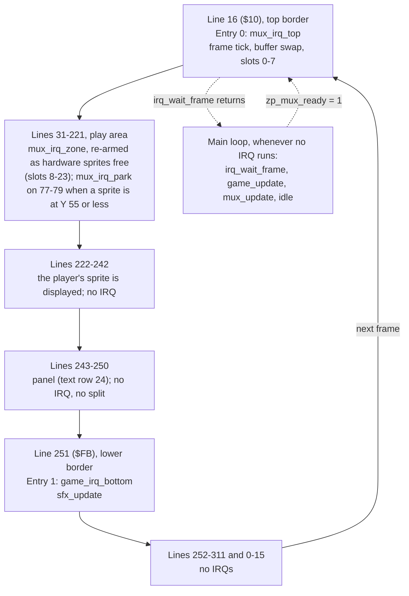

# Swarm: memory map, raster timeline and frame budget

M4 stage 0 technical design (Technical Director, 2026-10-01; brought in line with the design doc
and the engine README on 2026-10-02: panel decided, character set, colour and star tables; stage 1's
measured costs, the panel budget decision and the main loop as built added the same day, then
stage 2's: the collision budget raised from measurement, [Stage 2 part A, measured](#stage-2-part-a-measured);
then the stage 3 budget decisions: [Stage 2 part B, measured](#stage-2-part-b-measured), `stars_update`
moved, rows 3, 4 and 10 re-set, [Stage 3: what the gameplay-engineer must do](#stage-3-what-the-gameplay-engineer-must-do-to-stay-in-budget);
then, after stage 3 was built: [Stage 3, measured](#stage-3-measured), the collision budget for the
grid lookup as built, the ruling on [one-off frames](#one-off-frames), the zero page as built, the
budget table re-set, and [Stage 4: what must be done](#stage-4-what-must-be-done-to-stay-in-budget);
then, with `engine/sfx.asm` built and measured and stage 4 part A built:
[Stage 4 part A, measured](#stage-4-part-a-measured), the sound tick's row set from measurement,
and [Stage 4 part B: sound requests](#stage-4-part-b-sound-requests), the brief part B is built
to; then **at stage 5**, on the build tuned after the stage 4 playtest:
[Stage 4 part B and the tuning, measured](#stage-4-part-b-and-the-tuning-measured),
[Row 6: the divers](#row-6-the-divers) re-set from its placed worst frame, the budget table and
zero page as shipped, the [stage 5 review](#stage-5-review) and
[What Swarm taught us about the engine](#what-swarm-taught-us-about-the-engine)) for the approved
[game design](design.md) and the [M4 brief](../../milestones/M4-training-game.md). The
gameplay-engineer builds to this page; changing the layout means changing this page in the same
commit ([coding standards](../../standards/coding-standards.md#memory)).

**How to read the numbers:** **measured** = from a probe or the engine's spikes, with its source;
*estimate* = a design figure nobody has measured yet (CPU cycles counted from the intended code,
then × 1.27 for DMA, the measured share for main-loop code running through the display with 24
sprites: [vic-ii-timing.md](../../reference/vic-ii-timing.md#frame-budget-worked-example-pal));
*counted* = worked out from measured parts (instruction cycles, or the measured steals laid on a
raster line: [Short routines in the display](#short-routines-in-the-display)), not yet seen in a run;
*model* = from a Python model of the multiplexer's selection rules, an estimate too. Every estimate
here has a check in [tests/games/swarm/budget.json](../../../tests/games/swarm/budget.json) that
replaces it with a measurement at the stage named.

## Verdict

**The approved design fits the machine and engine v1, and the game as built and tuned is measured
inside it** (stage 5, 2026-10-02: [Stage 5 review](#stage-5-review)). The one correction this page asked for
(the panel's colours) is decided and in the design: [The panel](#the-panel). Budgeted game logic and sound: **7,155** raster cycles a frame against the engine's promise
of **7,200** ([engine/README.md](../../../engine/README.md#the-v1-promise-and-its-one-exception),
**measured**): **45 of headroom (0.6%)**. It was 6,530 and 670 until stage 5. One row moved:
`diver_update`, 1,350 → **2,020**, because its own worst frame was placed and **measured at 1,924**
([Row 6: the divers](#row-6-the-divers)); and the 45 held in the sound tick's row for an eighth SID
write went back, Simon having listened and asked for no change.

**The sum is a ceiling no frame reaches, and the 45 is not the game's margin.** Each row is its
routine's own worst frame, and those frames need different states (row 8's needs three divers low
or in a shot's band; row 6's needs a launch, which needs a free diver slot). What the frame really
has, all **measured** on the tuned build: the largest whole `game_update` found is **4,371** in a
placed frame and **3,758** sampled over 6,000 passes, against the 6,720 the rows add up to; the
least idle time in any frame is **5,104** cycles over the 13,400 frames of the stage 5 soak
(`AUTOPLAY`, wave 12) and **8,080** in the placed worst frames. No frame overran anywhere.

History of the two figures before stage 5: 6,265 and 935 at stage 0;
6,615 and 585 when the collision module was **measured** in stage 2 (row 8 + 350:
[The collision budget](#the-collision-budget)); 6,575 and 625 after the stage 3 decisions
([Short routines in the display](#short-routines-in-the-display)); 6,550 and 650 with stage 3
built and **measured**: the separate row for `sfx_play` calls (100) is gone, each call being inside
its caller's row, and row 3 rose by 75 for the one that has no room; **6,530 and 670 with the
sound module measured** (stage 4): the tick's row was 480 (435 as built, 45 held for an eighth SID write in a
start, should Simon ask for it) where it was an estimate of 500. No other row moved then: every caller's
row holds with its sound requests, three of them only under a rule about how the request is made
([Stage 4 part B](#stage-4-part-b-sound-requests)).

**Stage 3 as built is measured and fits with room** ([Stage 3, measured](#stage-3-measured)): in
the `AUTOPLAY` worst case (wave 12, nothing dies) `game_update` is at most **3,455** of its 6,050,
the worst frame has **6,288** cycles idle (floor 650), 9.6% of frames flicker (the model said
10.5%), nothing is missing two frames running, and no frame overran. Every row of the budget now
rests on a measurement except row 1 (*counted*); the sound is **measured** in the module's own
spike (not yet in the game), and what its requests add to rows 3, 5, 6 and 8 is *counted* from
those measurements. **Stage 4 part A (waves and the title, no sound) is measured too and inside
every limit**: [Stage 4 part A, measured](#stage-4-part-a-measured). Two things the stage 3
measurements changed:

- **`collide_update` is the grid lookup, not the box scan** (the fallback's trigger fired at
  2,833–2,836 against 2,825). Its own worst frame is **2,469**, not the 1,846 first reported: the
  frame placed for the box scan isn't the lookup's worst
  ([The collision budget](#the-collision-budget)). Row 8 stays 2,825: 2,595 for the collisions as
  built and 224 *counted* for stage 4's sound requests there (it was "2,600 and 225 for three
  calls at 75"; the 75 was too low for a call and the three calls are now two).
- **Two one-off frames run `formation_update` below the first badline** (a formation's return, a
  new game). Accepted, on conditions: [One-off frames](#one-off-frames).

In a normal frame the game has about 11,600 available. The one place the budget doesn't fit is the
engine's excepted case (about 6,400 left: **755 short** since stage 5; it was 130, 150 and before
that 175), which this design doesn't reach: the worst `mux_update` **measured** in Swarm's worst
case is 8,636 (stage 4 part A; 8,142 at stage 3; 7,929 on the tuned build) against the 12,342 that
case comes from ([Risks](#risks-in-order), item 3).
**Stage 4 part A fits, measured; part B (sound) and the tuning fit, measured**:
[Stage 4](#stage-4-what-must-be-done-to-stay-in-budget),
[Stage 4 part B](#stage-4-part-b-sound-requests),
[Stage 4 part B and the tuning, measured](#stage-4-part-b-and-the-tuning-measured).

## Configuration

| Setting | Value | Why |
|---|---|---|
| `$01` | `$35` | BASIC and KERNAL out, I/O in. Set by `irq_init`; never changed afterwards |
| VIC bank (`$DD00`) | 0 (`$0000–$3FFF`), the power-on default: not written | The whole program is one PRG from `$0801`; nothing has to be copied under I/O (which would need `$01=$34` with interrupts off). It's the configuration every multiplexer measurement was taken in. The cost: the VIC can't see `$1000–$1FFF`, so only code goes there |
| `$D018` | `$1A` | Screen at `$0400`, charset at `$2800` |
| `$D011` | `$5B`, written once at init | Extended colour mode (ECM) on, screen on, 25 rows, YSCROLL 3, bit 7 clear ([IRQ ownership](../../standards/coding-standards.md#irq-ownership)). See [The panel](#the-panel) |
| `$D016` | `$C8` (default) | 40 columns, no multicolour, XSCROLL 0 |
| `$D020` / `$D021` / `$D022` | black / black / blue | Border, play area background, panel background (ECM background 1) |
| `$D015`, `$D010`, `$D01C`, `$D000–$D00F`, `$D027–$D02E` | Multiplexer's | Game code never writes them |
| `$D017`, `$D01D` | 0, written once at init | No sprite expansion (engine v1 condition 4) |
| `$D01B` | 0 | Sprites in front of characters |
| `MUX_SCREEN` | `$0400` | Sprite pointers at `$07F8–$07FF` |
| `MUX_Y_MAX` | `221` (`$DD`) | Panel starts on line 243; a sprite at Y shows on Y+1…Y+21 (**measured**, `tests/timing/sprite_wrap`), so 243 − 22 |
| SID `$D400–$D418` | `engine/sfx.asm`'s | Game code never writes them |
| CIA 1 `$DC00`, `$DC02` | `engine/input.asm`'s | Joystick port 2 |
| Video standard | PAL | |

### The panel

**Decided: extended colour mode (ECM) for the whole screen, set once at init. No raster split and
no chain entry for the panel** (Simon, 2026-10-01; [design decision 8](design.md#decisions),
[Screen layout](design.md#screen-layout)).

| | Play area, rows 0–23 | Panel, row 24 |
|---|---|---|
| Screen code | Glyph code **0–63** | The same glyph's code **+ 64** (`$40`–`$7F`) |
| Background | `$D021`, black | `$D022`, blue (ECM background 1) |
| Colour RAM | Per cell: white for text, the twinkle's colour for a star | White, all 40 cells |

- In ECM the top two bits of a screen code choose the background and the low six the glyph, so the
  whole screen has **64 glyphs** ([Character set](#character-set)). Codes `$80` and up
  (`$D023`, `$D024`) are never written; those two registers are left alone.
- **All 40 panel cells are written at init, blanks included**: a blank is space + 64 = `$60`, not
  `$20`, which would be a black hole in the bar. The same goes for every later panel write: a spare
  ship is erased with `$60`. Panel code adds `PANEL_BG` (= `$40`) to every code it stores; nothing
  else in the game does.
- White on blue with these values is **measured**: `tests/timing/ecm_panel`,
  [picture](../../../screenshots/swarm-panel-ecm-white-on-blue.png).
- History, one line: the design first asked for reverse video, which gives **black** text on the
  bar (a reverse-video glyph is drawn in the background colour; **measured**, the same probe), and
  this page offered ECM or a lighter bar with black text.
- A real split (white on blue without ECM) stays the wrong tool: line 243 is a badline, and a
  stable entry needs the same sprite DMA every frame on the two lines before it, which the player
  and enemy shots at Y 200–221 don't give.

ECM changes what the pixels show, not when the VIC-II fetches, so the multiplexer's timing is
expected to be the same; that is *unverified* until QA's write-timing run on the game (F3 in the
[README](../../../engine/README.md#verdict-safe-for-m4-with-the-zone-code-frozen)), which is run
on the build as shipped.

### Character set

64 glyphs at `$2800–$29FF`: the character ROM's codes 0–63 (upper case and graphics set, ROM
`$D000–$D1FF`), with three replaced. The design uses **35 of 64**: 21 letters, 10 digits, space and
the three custom glyphs; **29 spare** ([design](design.md#character-set-64-glyphs)).

| Constant | Code | Replaces (unused by any text) | Charset bytes | On screen as |
|---|---|---|---|---|
| `GLYPH_STAR_HI` | **27** (`$1B`) | `[` | `$28D8–$28DF` | 27, play area only |
| `GLYPH_STAR_LO` | **28** (`$1C`) | `£` | `$28E0–$28E7` | 28, play area only |
| `GLYPH_SHIP` | **29** (`$1D`) | `]` | `$28E8–$28EF` | 29 + 64 = 93 (`$5D`), panel only |

- **Codes 27–29 are confirmed** (the designer's suggestion). No text uses them (letters are within
  1–25, space 32, digits 48–57), and being adjacent they are one 24-byte patch at `$28D8`, copied
  from a `glyph_data` block in the game tables after the ROM copy.
- Text is stored in the tables as codes 0–63 and written to the play area as it is; the panel
  routine adds `PANEL_BG`. **Every string goes through the `GameText()` macro** (`tables.asm`),
  never `.text`: KickAssembler can't read back the bytes a `.text` emitted, so an `.errorif` over
  the string data isn't possible (found in stage 1). `GameText()` maps each character to its code
  itself and stops the build on anything outside the 64 glyphs, the three replaced codes included.
- The other 26 codes keep the ROM's glyphs (J K Q X Z, `@`, punctuation), free for later text under
  the design's rule: capitals, digits and ROM punctuation in codes 0–63 only.

A note on the design's wrap: a diver re-entering at Y 30 is displayed on lines 31–51, and line 51 is
the first line of the display window, so its last sprite row (row 20) shows. The enemy art keeps
row 20 empty: the design's enemy art area is rows 1–19 ([art rule 3](design.md#art-rules),
[hit-box table](design.md#hit-boxes); the hit box itself is rows 3–17).

## Memory layout

One PRG, `$0801` upwards. Every block starts with `* = $xxxx "Name"` and ends with an `.errorif`
against the next block's start.

| Range | Contents | Size | Owner |
|---|---|---|---|
| `$0002–$00FF` | Zero page ([below](#zero-page)) | | zp.asm |
| `$0100–$01FF` | Stack | | |
| `$0400–$07E7` | Screen: play area rows 0–23, panel row 24 | 1,000 B | Game (panel, stars, messages) |
| `$07F8–$07FF` | Sprite pointers | 8 B | Multiplexer only |
| `$0801–$080F` | BASIC upstart | | |
| `$0810–$27FF` | **Engine block**: `irq.asm`, `multiplexer.asm` (+ `multiplexer_flicker.asm`), `input.asm`, `rng.asm`, `collision.asm`, `sfx.asm`, then the chain tables | 8,176 B reserved. **7,033 measured** as shipped (DEBUG, `$0810–$2388`, the chain tables and `sfx.asm` included: [stage4_costs.txt](../../../tests/games/swarm/stage4_costs.txt), item 12): **1,143 spare**. It was 6,293 at stage 4 part A, before `sfx.asm` (632: code 586, state 21, DEBUG shadow 25, + its page-alignment padding: [engine/sfx.md](../../../engine/sfx.md#constraints-on-changing-the-module)); each module's own size is in the [README](../../../engine/README.md) | raster-engineer |
| `$2800–$29FF` | Charset: 64 glyphs ([above](#character-set)). Copied from the character ROM at init (`$01=$33`, interrupts off, **before** `irq_init`), then codes 27–29 patched: star high, star low, ship | 512 B (zeros in the PRG) | Game init |
| `$2A00–$2FFF` | Unused: the rest of the charset slot. In ECM the VIC-II never fetches a glyph above code 63, so nothing is shown from here. Kept empty | 1,536 B | |
| `$3000–$37FF` | Sprite shapes, pointers `$C0–$DF`. 13 used (`$C0–$CC`, `$3000–$333F`) from `png2sprites`; 19 spare for art changes | 2 KB | tools-engineer (art), game |
| `$3800–$3FFF` | Game tables ([below](#game-tables)): colour table at `$3800`, then stars, glyphs, collision pairs, column X, dive paths, waves, strings, sound effect data | 2 KB reserved. **1,314 measured** as shipped (`$3800–$3D21`, the sound data in): 734 spare. 1,040 at stage 4 part A | gameplay-engineer |
| `$4000–$5FFF` | Game code and variables (per-enemy arrays: 18 × about 10 B) | 8 KB reserved. **4,641 measured** as shipped (`$4000–$5220`, DEBUG): 3,551 spare. 4,549 at stage 4 part A | gameplay-engineer |
| `$6000–$CFFF` | Free | 28 KB | |
| `$D000–$DFFF` | I/O. Colour RAM `$D800–$DBE7`: star colours, panel text colour | | Game |
| `$FFFA–$FFFF` | NMI / RESET / IRQ vectors (RAM under the KERNAL) | 6 B | IRQ framework only |

- `$1000–$1FFF` is inside the engine block: the VIC sees the character ROM there, so it can only
  hold code and CPU data, which is what the engine block is
  ([memory-map.md](../../reference/memory-map.md#bank-selection-dd00-bits-01-inverted)).
- The M3 spikes put sprite data at `$2800`. Swarm puts the charset there and sprites at `$3000`, so
  the engine block can grow to 8 KB before anything moves.
- Nothing in the game needs `$01=$34`, RAM under I/O or a second screen.

### Game tables

`$3800–$3FFF`, one block, `.errorif` against `$4000`. Only the colour table's address is fixed (so
a colour can be changed from the monitor during art review); the rest follow in this order and the
labels find them.

| Table | Label(s) | Size | Notes |
|---|---|---|---|
| Colours | `colour_table`, at **`$3800`** | 19 B used, 32 reserved (`$3800–$381F`) | Below |
| Stars | `star_lo`, `star_hi`, `star_glyph` | 3 × 48 = 144 B | Below |
| Custom glyphs | `glyph_data` | 3 × 8 = 24 B | Star high, star low, ship: copied to `$28D8` at init |
| Collision pairs | `col_pairs` | 3 × 4 = 12 B | `ColPair` rows ([engine/collision.md](../../../engine/collision.md)) |
| Column X | | 6 B | 34 + 36 × column |
| Dive paths and fire steps | | about 75 B | [Below](#dive-paths-as-data) |
| Wave tables | | about 40 B | |
| Strings | | about 150 B | 81 characters in 11 texts, with row, column and length; codes 0–63 |
| Sound effect data | `sfx_*` tables, emitted by `SfxEnd()`; the effects are **`games/swarm/src/sfx_data.asm`**, the one copy, which the engine's spike imports too ([engine/sfx.md](../../../engine/sfx.md#where-a-games-effect-data-lives)) | **264 B measured** in the spike (10 effects × 6 + 34 steps × 6), + padding where a table would cross a page (each of the twelve is kept inside one) | [engine/sfx.md](../../../engine/sfx.md#data-the-game-provides): tables by effect and by step, not a byte stream. `SfxBegin()`, the import, `SfxEnd()` go last in this block |
| **Total** | | **1,314 of 2,048 measured** as shipped (the dive paths are two mirrored copies); 1,040 at stage 4 part A, before the sound data | |

**Colour table.** Every colour the game writes comes from `colour_table`, indexed by a `COL_*`
constant: no colour number appears anywhere else in the code. It is the code's copy of the design's
[colour table](design.md#colours), which is the designer's proposal until Simon's art review, so a
colour change is one byte here and one row there.

| Index | Constant | Value (design) | | Index | Constant | Value (design) |
|---|---|---|---|---|---|---|
| 0 | `COL_BORDER` (`$D020`) | 0 black | | 10 | `COL_ENEMY_EXPLODE` | 8 orange |
| 1 | `COL_BACKGROUND` (`$D021`) | 0 black | | 11 | `COL_PLAYER_EXPLODE` | 1 white |
| 2 | `COL_PANEL_BG` (`$D022`) | 6 blue | | 12 | `COL_RESPAWN_ALT` | 11 dark grey |
| 3 | `COL_PLAYER` | 3 cyan | | 13 | `COL_PANEL_TEXT` (ships too) | 1 white |
| 4 | `COL_PLAYER_SHOT` | 3 cyan | | 14 | `COL_MESSAGE_TEXT` | 1 white |
| 5 | `COL_ENEMY_A` (row 0) | 4 purple | | 15 | `COL_STAR_0` | 1 white |
| 6 | `COL_ENEMY_B` (row 1) | 7 yellow | | 16 | `COL_STAR_1` | 15 light grey |
| 7 | `COL_ENEMY_C` (row 2) | 13 light green | | 17 | `COL_STAR_2` | 12 grey |
| 8 | `COL_WINDUP_FLASH` | 1 white | | 18 | `COL_STAR_3` | 11 dark grey |
| 9 | `COL_ENEMY_SHOT` | 10 light red | | 19–31 | spare | |

Indices 5–7 are in row order, so an enemy's colour is `colour_table + COL_ENEMY_A + row`; 15–18 are
the twinkle's four steps in order. Sprite colours go to `mux_col` (never to `$D027–$D02E`), text
and star colours to colour RAM.

**Star table.** 48 stars, three parallel arrays indexed by star number: `star_lo` / `star_hi` are
the cell's offset from the start of the screen (row × 40 + column, 0–959; add `$0400` for the
screen, `$D800` for colour RAM), `star_glyph` is `GLYPH_STAR_HI` or `GLYPH_STAR_LO`.

- It is **assembled data, not built at run time**: generated by a KickAssembler script loop from a
  fixed seed, so every build and screenshot has the same sky and init has nothing to compute.
- It is built under the design's **band rule**
  ([Text cells and the star rule](design.md#text-cells-and-the-star-rule)): rows 0–23 only, **no
  star in columns 10–29 of any text row** (the design's list of rows is the only copy: seven rows
  when stage 3 was built, six since the messages moved off the row the formation covers), and no
  two stars in one cell. The generator rejects such cells and draws again, and an `.errorif` over
  the finished table checks all three conditions, so a hand-edited table can't break the rule
  silently.
- What the rule buys, and the code relies on: text is written and erased with spaces without
  consulting the star table, and the twinkle's one colour RAM write a frame
  (`stars_update`, budget row 10) never lands on a letter. If the band list changes in the design,
  the generator's list changes with it.
- Stars are drawn once at init (48 screen writes) and never redrawn; nothing but text writes to the
  play area's screen cells afterwards, and text stays inside the bands.

### Dive paths as data

Per path (hook, sweep, plunge): a list of 3-byte segments `dx, dy, steps` (signed, signed, count;
`steps` 0 = repeat until X reaches 0 or 344), ended by the path's end code (return or wrap), and a
list of fire steps ended by 0. Row r uses path `path_of_row[r]`. A diver holds: segment pointer
(index into the table, 1 byte), steps left, step count, mirror flag, shots left, next fire step.

## Sprite allocation

All 24 virtual sprites and all 4 pins are used (the design's split, confirmed).

| Virtual sprites | Kind | `mux_flags` | Notes |
|---|---|---|---|
| 0 | Player (and its explosion) | `$80` pinned | Y fixed at 221 = `MUX_Y_MAX` |
| 1–3 | Enemy shots | `$80` pinned | Hidden (`MUX_OFF`) when free. A hidden pinned sprite costs nothing |
| 4–5 | Player shots | `$00` | |
| 6–23 | Enemies, 6 + row × 6 + column (and their explosions) | `$00` | The title screen shows 6, 12 and 18 |

- `mux_flags` is written **once at init, all 24 entries**, and never again. Bit 0 (multicolour) is 0
  everywhere, hidden sprites included: the engine takes its cheaper uniform path only when all 24
  agree ([README](../../../engine/README.md#as-built-stage-3)), and the uniform zone blocks have
  the larger timing margin: **17 cycles** in DEBUG and **39** in release, against **3** for DEBUG
  mixed (all **measured**, worst case found, not a proven bound:
  [engine/README.md](../../../engine/README.md#verdict-safe-for-m4-with-the-zone-code-frozen),
  the four-mode table and "Where Swarm (M4) sits").
- Parked enemies' `mux_y` is written when the enemy changes state, not every frame.
- Hide a sprite with `mux_y` = `MUX_OFF`. Don't park hidden sprites at a real Y.

## Zero page

`games/swarm/src/zp.asm` declares all of it, and this table is that file **as shipped** (checked
line by line at stage 5, commit 2d6cf3f). Addresses of the engine labels are the README's suggested ones.

| Range | Name(s) | Owner | Notes |
|---|---|---|---|
| `$02–$09` | `zp_tmp0`–`zp_tmp7` | Anyone in the main loop | Scratch. `mux_update` uses `zp_tmp0–3`, `collision.asm` and `rng.asm` none. Never held across a `jsr`, **never in an IRQ handler** |
| `$0A` | `zp_irq_idx` | IRQ framework | IRQ only |
| `$0B` | `zp_irq_frame` | **Shared**: IRQ writes, main reads | One byte: atomic |
| `$0C` | `zp_mux_front` | **Shared**: IRQ writes on the swap | Game code doesn't touch it |
| `$0D` | `zp_mux_ready` | **Shared**: main sets, IRQ clears | Game code doesn't touch it |
| `$0E–$0F` | `zp_mux_slot`, `zp_mux_end` | Multiplexer IRQs | IRQ only |
| `$10` | `zp_joy` | `input.asm`, main loop | Stick state this frame ([engine/input.md](../../../engine/input.md)) |
| `$11` | `zp_joy_pressed` | `input.asm`, main loop | Bits that went from up to down this frame |
| `$12–$13` | `zp_rng_lo`, `zp_rng_hi` | `rng.asm`, main loop | Generator state ([engine/rng.md](../../../engine/rng.md)) |
| `$14–$17` | reserved for the engine, unused | | `$14–$15` were `zp_sfx_ptr`: **released** (2026-10-02). `sfx.asm` as built uses no zero page ([engine/sfx.md](../../../engine/sfx.md#zero-page)); the label is gone from `zp.asm` |
| `$18` | `zp_game_frame` | Game core | The value `irq_wait_frame` returned for the frame being worked on |
| `$19` | `zp_game_state` | Game core | `GAME_STATE_*`: Play 0, Respawn 1, PlayerDying 2, GameOver 3, Title 4 |
| `$1A` | `zp_state_timer` | Game core | **One byte, counting up**: frames the state has run, 0 in its first frame, stopping at 255; not counted in Play. In Title it wraps (the blink and the shape swap read it). (Stage 0 planned two bytes counting down.) |
| `$1B` | `zp_wave_timer` | Game core | Frames the wave phase has run, counting up from 0, in every frame with lives left, whatever the game state; not counted in Fight. (Stage 3's `zp_clear_timer`.) |
| `$1C–$1D` | `zp_idle_lo`, `zp_idle_hi` | Main loop, DEBUG | Idle-loop iterations this frame |
| `$1E–$1F` | `game_idle_min` (2) | Main loop, DEBUG | Fewest idle iterations in a frame: [Labels the game must provide](#labels-the-game-must-provide). The one zero-page label without the `zp_` prefix: `budget.json` reads it by this name |
| `$20–$21` | `zp_player_x_lo`, `zp_player_x_hi` | Player | X 24–318, bit 8 in bit 0 of the high byte |
| `$22–$24` | `zp_player_cooldown`, `zp_player_invuln`, `zp_lives` | Player | Frames until the next shot; invulnerable frames left; lives, the ship in play included |
| `$25–$26` | `zp_fx`, `zp_drift_dir` | Formation | Drift offset 0–96; 1 or `$FF` |
| `$27–$28` | `zp_launch_timer`, `zp_divers_active` | Divers | |
| `$29` | `zp_enemies_alive` | Formation | Every enemy that isn't Dead, an exploding one included |
| `$2A` | `zp_wave` | Game core | **BCD** (`$01`–`$99`, the number as shown), like `game_score` and `game_hiscore` (3 bytes each, most significant first, absolute): the panel prints nibbles |
| `$2B` | `zp_loop` | Game core | Difficulty loop 0–3: a store, read wherever a loop changes something. Counted from stage 4, never derived from `zp_wave` |
| `$2C–$2E` | `zp_drift_timer`, `zp_anim_timer`, `zp_anim_frame` | Formation | |
| `$2F` | `zp_pattern` | Game core | Wave pattern index 0–2: a store, as `zp_loop`. It took the last free byte of this block in stage 3 |
| `$30–$32` | `zp_star_ptr` (2), `zp_star_idx` | Stars | Colour RAM cell of the star being twinkled; its index 0–47 |
| `$33` | `zp_wave_phase` | Game core | `WAVE_PHASE_*`: Fight 0, Intro 1, Clear 2. The design's second state machine ([Game flow](design.md#game-flow)); its timer is `$1B` |
| `$34–$3F` | Free for the game | | 12 bytes |
| `$40–$FF` | Free | | Per-object arrays (18 enemies, 5 shots, 3 diver slots, 4 explosion slots) are absolute, not zero page |

**Sharing rules.** The only bytes shared between IRQs and the main loop are the three marked
above, all the engine's, all one byte. The game's one IRQ handler (`game_irq_bottom`) calls
`sfx_update` and nothing else; `sfx.asm`'s request bytes are the only game-side data that cross
(one byte per voice, absolute, written by the main loop, consumed by the IRQ:
[engine/sfx.md](../../../engine/sfx.md#zero-page)). No multi-byte value is shared.

## Raster timeline (PAL, 312 lines)

Two chain entries. YSCROLL 3, so badlines are on 51 + 8n up to 243 (**measured**,
[vic-ii-timing.md](../../reference/vic-ii-timing.md#badlines)).



| Line | Handler | Job | Cost (raster cycles) | Budget until the next handler |
|---|---|---|---|---|
| 16 (`$10`) | `mux_irq_top`, entry 0, `IrqNormal` | Frame tick, swap, slots 0–7 | 378 / 381 / 393 + 32 before it + 6 `rti` (**measured**, README) | Border: no DMA |
| ≈ 31–221, dynamic | `mux_irq_zone`, re-armed | Slots 8–23 | ≤ 2,950 an IRQ (**measured** max 2,763) + 30 framework | Engine's |
| 77–79, some frames | `mux_irq_park`, re-armed | Disable hardware sprites whose last slot is at Y ≤ 55 (a Plunge rising to Y 50, a wrap re-entering from Y 30) | 80 + 30 (**measured**) | Engine's |
| 251 (`$FB`) | `game_irq_bottom`, entry 1, `IrqNormal` | `jsr sfx_update`, `IrqDone()` | 93 framework (**measured**) + the whole call of `sfx_update`: 56 idle, 214 three slides, **429** three starts, + 6 more in `irq_exit` when it ends past line 255 (**measured** in the module's spike: [engine/sfx.md](../../../engine/sfx.md#costs)). The handler to its `rti`, **measured in the game**: 117–**498**, exactly the spike's worst case, the `rti` reached on lines 253–259 (line 259, cycle 24 at the latest) | Lines 251–311 and 0–15: 77 lines, 4,851 cycles, no DMA |

Why these lines:

- **No entry for the panel**: ECM needs no register change at line 243.
- **Entry 1 at 251, the sound tick.** Three reasons. (1) Every multiplexer measurement was taken
  with entry 0 plus one fixed entry at `$FB`; a one-entry chain with the multiplexer has never been
  run, and M4 is told to develop in the configurations that were measured. (2) Sound keeps its
  tempo when the main loop repeats a frame. (3) It's where music goes in M5, so M4 tries the
  pattern. Line 251 is past the README's rule for fixed entries (`MUX_Y_MAX` + 3 = 224 or later),
  past the last badline (243) and past the player's sprite DMA (lines 221–241), so the handler's
  span has no DMA and its cost is exact.
- Nothing between lines 16 and 224, and nothing before line 16
  ([README](../../../engine/README.md#raster-timeline)).
- `irq_lines` is never rewritten.

## Frame budget

### What the engine leaves (README, all **measured** in the `multiplexer` spike, DEBUG, raster cycles)

| | Normal frame (no overflow) | Overflow frame (flicker, pinned sprites in the crowd) |
|---|---|---|
| Whole frame | 19,656 | 19,656 |
| All IRQs (the spike's fixed entry does nothing) | 522–3,779, average 2,227; limit 4,000 | the same |
| `mux_update` | 3,563–6,783, **average 4,261** | 4,665–12,330 in the spike, average 6,711, at about 8 evictions and drops a frame |
| **Left for the game** | **about 11,600** at the IRQ maximum | **≥ 7,200 promised** in every frame but one case (below); worst measured 5,328 idle + 1,909 = 7,237 over about 800,000 frames |

### The game's budget (raster cycles a frame, worst case; an *estimate* unless marked **measured**)

Worst case = full formation, 3 divers taking 2 path steps each, 2 player shots and 3 enemy shots
in flight, 2 enemy hits and a launch in the same frame, 4 enemy explosions running (3 ending).
Rows are in the table's old order; the order they run in is [Order of the frame](#order-of-the-frame).
"Border" = the routine runs above the first badline (line 51), so its figure is CPU cycles plus at
most a wrapped diver's sprite fetches; "display" = it runs among badlines and the formation's sprites.
**Re-set 2026-10-02 from stage 3's measurements** ([Stage 3, measured](#stage-3-measured)), and
the sound's rows from the module's ([Stage 4 part B](#stage-4-part-b-sound-requests)); the
"Basis" column says what each row now rests on. Stage 4 part A's figures for the same rows:
[Stage 4 part A, measured](#stage-4-part-a-measured).
The stage 5 figures ("tuned"): [Stage 4 part B and the tuning, measured](#stage-4-part-b-and-the-tuning-measured).

| # | Subsystem | Budget (raster) | **Measured** (DEBUG): stage 3, and "tuned" = the shipped build at stage 5 | Basis of the budget | Check in `budget.json` (labels), from stage |
|---|---|---|---|---|---|
| 1 | Main loop, state machine, timers | 150 | Not on its own: it is what `game_update` has outside the routines' spans | *Counted*: the ten routines' `jsr` and `rts` (120) + `game_state_update` in a frame of play (12–24). A state change's own work is a [one-off frame](#one-off-frames)'s | part of `game_update` |
| 2 | Input (`jsr input_read`, the whole call) | **40** | **40** (28 in the profile span) | **Measured**, a lock ([engine/input.md](../../../engine/input.md#cycle-budget)) | `tests/engine/input`; part of `game_update` |
| 3 | Player: move, clamp, cooldown, fire, flash, explosion timer; from stage 4 one `sfx_play` when it fires. **Display**, after the collisions: the one short routine there | **365** | **248–260** max in `AUTOPLAY` (the flash and a shot in the same frame, lines 43–86); 129–148 in the game; 46 dying, 16–33 hidden. Tuned, with the shot's request: **302–326** max in `AUTOPLAY` (lines 46–88) | 290 *counted* (150 CPU + a badline 43 + 8 sprites on each of 5 lines 95 = 288; the sampled 260 is inside it); with the shot's sound request, 51 CPU on its dearest path (**measured** call), the same count gives **358**: 7 spare. The sampled 326 is inside it. [Short routines](#short-routines-in-the-display) | `player_update`, 1 |
| 4 | Player shots (2): move, remove. **Border** | **60** | **43** | **Measured** + 5% + 3 wrapped divers' fetches (52 *counted*) | `pshot_update`, 1 |
| 5 | Formation: drift, 18 home X (9 bits), animation frame, 4 explosion slots. **Border**. From stage 4 the wave-clear bonus and its sound, in the frame the last explosion ends | **750** | **616–620**: 3 explosions ending + 1 animating on a turn-and-swap frame, placed in the game (counted 627), no DMA. 475–495 max in `AUTOPLAY`, divers out. Tuned: 458–480 in `AUTOPLAY`; Clear's first frame with its request **692–712**, ending on lines 38–39 | **Measured** 620 + 3 wrapped divers' fetches = 735 *counted*. The stage 4 frame (Clear's first) is **692–712 measured** with the wave-clear request in (counted 698–718; no diver exists then, so no DMA): 38 spare | `formation_update`, 2 |
| 6 | Divers (3): path steps, return, shot spawn, the wind-up of the one that can be winding up, the launcher (at most 2 `rng_next`). From stage 4 at most 2 `sfx_play` (the dive; the enemy shot **once a frame**, however many fire). Border into the first enemy row | **2,020** (1,350 until stage 5) | Tuned: **1,924** in its own worst frame, placed (D3L: a launch after the scan of all 18 with the fallback, a Sweep firing on a 2-step frame, the border work before it loaded; lines 41–72); 1,273–1,673 in the other placed frames; **1,268–1,296** max in `AUTOPLAY` (lines 37–61). Before the tuning: 972–1,095 in `AUTOPLAY`, 688 for the launcher's longest scan alone | **Measured** 1,924 + 5% = **2,020**. The 1,350 was "994 sampled + 5% + the requests counted": a sampled maximum of a build that can't reach the dear frames. [Row 6: the divers](#row-6-the-divers) | `diver_update`, 3; the placed frames by `stage5_diver_worst.py`, 5 |
| 7 | Enemy shots (3): move, remove. **Border** (called with `pshot_update`) | **200** | **162–169** max in `AUTOPLAY` (lines 29–33). Tuned: 155–163 (lines 30–34) | **Measured** 169 + 5% = 178, *counted* 177 with 3 wrapped divers on every line. 22 spare. **No sound request here**: shots are spawned by `eshot_spawn`, which `diver_update` calls (row 6) | `eshot_update`, 3 |
| 8 | Collisions, as built: the grid lookup for parked enemies, the box test for divers in a shot's Y band, the player's two guarded scans, and the answers to 3 enemy hits and the player's. From stage 4 at most 2 `sfx_play`: the player's hit (two) **or** the enemy explosion (one, once a frame). **Display** | **2,825** | **2,464–2,471**: the lookup's own worst frame, placed in the game, lines 40–90 (2,471 at stage 4 part A). Tuned, **with the sound requests: 2,010 / 2,554 / 2,612** in the placed frames A / B / C (lines 40–41 to 73 / 95 / 95); 2,154–2,197 for frame C's load in a launch frame (JX); 1,506–1,673 max in `AUTOPLAY` | **Measured** 2,612 with the requests in, + 5% = 2,743. The ceiling stays **2,825** (it was built as 2,471 + 5% = 2,595, + 224 *counted* for the requests = 2,819): 82 spare over the measured frame's 5%, held for the one path frame C doesn't take (the hit's second effect replacing a pending request: 15 CPU, which JX takes). [The collision budget](#the-collision-budget) | `collide_update`, 2; the placed frames by `stage3_collide_worst.py`, 5 |
| 9 | Panel, **in a frame of play**: redraw score, lives and wave. The four-field redraw is exempt: [The panel's budget](#the-panels-budget) | **250** | **231** in every `AUTOPLAY` frame (lines 24–28) | **Measured** + 5% = 243 | `panel_update`, 1 |
| 10 | Star twinkle: one colour RAM write. **Border**, straight after the panel: no DMA at all | **60** | **56–57** (lines 28–29) | **Measured** + 5% | `stars_update`, 1 |
| 11 | Sound requests from the main loop (`sfx_play`, stage 4) | **0**: no row of its own | Whole call **34 / 49 / 37** CPU by path (**measured**, the module's spike); in the display up to 77 / 92 / 80 with no sprites | Every call is inside its caller's row: 1, 3, 5, 6 or 8. It was 100 for "up to 3 calls", which neither said where they were nor covered the 5 a frame can have: [Stage 4 part B](#stage-4-part-b-sound-requests) | inside the routines that call it; `sfx_play`, 4 |
| | **Main loop, `game_update` in all** | **6,720** (6,050 until stage 5) | **3,448–3,455** max in `AUTOPLAY` at stage 3 (average 2,066). Tuned: 3,486 in `make test`, **3,758** over 6,000 passes (average 2,257); **4,371** in the dearest placed frame (JX), 4,030–4,044 in D3L and J2; one-off frames 1,952 and 2,294 | The sum of the rows: each routine's own worst frame, which can't all fall in one frame | `game_update`, 1 |
| 12 | Sound tick in `game_irq_bottom` (IRQ time, no DMA): the whole call of `sfx_update`, three effects starting in one frame, and what it adds to `irq_exit` | **435** (480 until stage 5) | **435**: the whole call **429** + 6 (`irq_exit` is 66, not the 60 in the entry's 93 of framework, when the tick ends past line 255). **In the game, tuned: the handler 498 to its `rti` and `sfx_update` 417 at worst, in every run: the spike's figures to the cycle** | **Measured** 435, a constant path with no DMA, so no margin. The 45 held for an eighth SID write in a start ([option B](../../../engine/sfx.md#option-b-an-eighth-write-in-a-start)) **went back at stage 5**: Simon listened to stage 4 in VICE and on the C64 Ultimate and asked for no change to the sounds. If it is ever wanted, row 12 is 480 and comes from the headroom | `game_irq_bottom` and `sfx_update`, 4 |
| | **Game logic and sound in all** | **7,155** (6,530 until stage 5) | | | |
| | **Engine's promise** | 7,200 | **Measured** left for the game in Swarm's own worst frames: at least 8,782 at stage 3 (19,656 − IRQs 2,732 − `mux_update` 8,142); 9,074 tuned (IRQs 2,653, `mux_update` 7,929) | | |
| | **Headroom** | **45 (0.6%)** (670 until stage 5) | Idle in the worst `AUTOPLAY` frame: **6,288** at stage 3, **5,792** at stage 4 part A; tuned **5,568** in `make test` and **5,104** over the 13,400 frames of the soak. In the placed worst frames: 8,080–12,592 | The sum is a ceiling no frame reaches: [Verdict](#verdict) | `game_idle_min` × 16 ≥ 45, 1; the soak, 5 |

**What changed at stage 5** (2026-10-02; the totals were 6,050 / 6,530 / 670): row 6 + 670 (1,350 →
2,020: its own worst frame placed and **measured**, [Row 6: the divers](#row-6-the-divers)), row 12
− 45 (the eighth SID write wasn't asked for): 6,720 / 7,155 / **45**. Nothing else moved. Rows 3, 5
and 8, which held "by count" at stage 4, are now **measured** with their sound requests in: 326
sampled of 365, 712 placed of 750, 2,612 placed of 2,825. The headroom is no longer a comfortable
figure, and it isn't meant as one: it says the rows' own worst frames, added up, still come under
the promise. What a frame really has left is the idle figure in the last row.

What changed on 2026-10-02 with the sound module measured (the totals were 6,050 / 6,550 / 650):
row 12 − 20 (480: 435 measured + 45 held for option B): **20 to the headroom**. Rows 3, 5, 6 and 8
are unchanged in size; what they are made of is now counted from the measured `sfx_play`, and rows
6 and 8 hold only under the request rules of [Stage 4 part B](#stage-4-part-b-sound-requests).
Their spare is 7, 32, 83 and 6.

What changed on 2026-10-02 after stage 3 (the totals were 6,075 / 6,575 / 625): row 11 − 100 (gone:
each `sfx_play` is in its caller's row), row 3 + 75 (the only caller whose row had no room for
one): **25 back to the headroom**. Row 8 is unchanged in size and changed in what it is made of.
Rows 5, 6 and 7 are unchanged and are now ceilings over a measurement; none is lowered to its
measurement, for the reason in row 6: a sampled maximum of code that runs through the display is
a look, not a bound, and the margin they hold (15, 110 and 22) is what stage 4's sound and waves
are counted to need. The stage 3 decisions before it (6,115 / 6,615 / 585 → 6,075 / 6,575 / 625):
row 3 + 90, row 4 − 90, row 10 − 40.

**Measured rows** (2026-10-02, M4 stage 1; the span convention is
[engine/README.md](../../../engine/README.md#which-span-a-figure-is)):

- **Input, 40.** The whole call, no DMA: `input_read` is called straight after `irq_wait_frame`,
  which returns when `mux_irq_top` has finished, in the top border: `game_update` is reached on
  **line 23, cycle 33** (**measured**, below), and the first line with sprite DMA is 30 (`MUX_Y_MIN`). The earlier 75
  was an estimate with a DMA allowance it doesn't need. Saves 35: the totals fell from 5,800 /
  6,300 to 5,765 / 6,265 and the headroom rose from 900 to 935 (before stage 2's change to row 8).
- **Random numbers, 42 a call** (`jsr rng_next`, constant time, no DMA;
  [engine/rng.md](../../../engine/rng.md#cycle-budget)). The launcher calls it in the display, so
  budget about **54 raster** a call (× 1.27). **Rule for the gameplay-engineer: at most 2
  `rng_next` calls in a frame.** A pick that needs a number below 18 by mask-and-retry and fails
  twice, or lands on an enemy that isn't parked, is settled without another call (scan on from that
  index to the next parked enemy, or try again next frame): an unbounded retry loop has no worst
  case to budget. Row 6 is unchanged: its 300 for a launch frame covers the two calls (84 CPU) and
  the scan, and stays an *estimate* until stage 3.
- **`tests/games/swarm/budget.json` agrees with this table** (brought in line 2026-10-02, for the
  stage 3 decisions, after stage 3 was measured, and again at stage 5): `game_update` ≤ 6,720,
  `player_update` ≤ 365, `pshot_update` and `stars_update` ≤ 60, `formation_update` ≤ 750,
  `diver_update` ≤ 2,020, `eshot_update` ≤ 200, `collide_update` ≤ 2,825, `panel_update` ≤ 250 and
  `game_idle_min` × 16 ≥ 45, in the stage 1 checks and the stage 5 soak; from stage 4 the sound
  tick ≤ 498, `sfx_update` ≤ 417 (both the **measured** worst case, which `AUTOPLAY` reaches every
  64 frames, so both read exactly that) and `sfx_play` ≤ 120 in the display; and from stage 5 the
  soak (10,000 more frames: no overrun, no late write, no pinned sprite dropped, nothing missing
  two frames running) and the two placed-frame scripts, which `make test` now runs: 34 checks.

#### Stage 1, measured

**Measured** 2026-10-02 on the stage 1 build (commit 68ff14c; VICE 3.10 x64sc PAL, DEBUG):
`make test ARGS=swarm` (the `AUTOPLAY` build, 300 or 600 passes a check) and the gameplay-engineer's
`vice_profile` runs recorded in each routine's header. Profile spans, raster cycles. The estimates
stay as the budgets.

| Row | Routine | Budget (*estimate*) | **Measured**, stage 1 | The same code in the display (× 1.27, *estimate*) |
|---|---|---|---|---|
| 3 | `player_update` | 200 | max **122** | 155 |
| 4 | `pshot_update` (2 shots) | 150 | **43** | 55 |
| 10 | `stars_update` | 100 | **57** | 72 |
| 9 | `panel_update` | 250 | **9** with nothing dirty (the usual frame); **231** with score, lives and wave dirty; about 325 with the high score too (*counted*, not measured) | 293 for the 231: **over 250**, see [The panel's budget](#the-panels-budget) |
| | `game_update` in all | 5,765 then (6,720 now) | 262–317 in the game; max **580** in `AUTOPLAY` (three panel fields redrawn every frame) | |
| | All IRQ time a frame (check: ≤ 4,500) | | **620**, of which `game_irq_bottom` is 93 of framework and no work | |
| | `mux_update`, 3 sprites shown | engine: 4,261 average with 24 | **1,073–1,120** | |
| | Idle in the worst frame (`game_idle_min` × 16) | ≥ 935 then (45 now) | **15,888** | |

(The budgets in this table are stage 1's. Rows 3, 4 and 10 were re-set for stage 3, and the
"× 1.27" column is superseded for them: [Short routines in the display](#short-routines-in-the-display).)

**These figures carry no DMA, so they don't test the budget's display allowance.** With three
sprites and so little work, `game_update` runs on **lines 23–31** (**measured**: `vice_start` on
`build/swarm_budget/swarm_budget.prg`, then `vice_run_until` `game_update`, `panel_update`,
`game_update_end`: line 23 cycle 33, line 27 cycle 38, line 31 cycle 23), all above the first
badline (51), and nothing but a player shot at the top of its flight puts sprite DMA there. What
stage 1 shows is that the CPU counts behind rows 3, 4 and 10 were generous and row 9's was 31 short
(231 against 200). What it can't show is the × 1.27: from stage 2 `game_update` runs on into the
display with 21 sprites on screen, and the per-routine checks then measure the allowance for the
first time. So **no limit in `budget.json` is re-baselined to a stage 1 figure**: measured + 5% of a
border-only run would be a limit the same code fails as soon as the formation exists.

#### Stage 2 part A, measured

**Measured** 2026-10-02 on the stage 2 part A build (commit 18ed31d: the formation, 18 enemies
parked, no collisions yet; VICE 3.10 x64sc PAL, DEBUG, the `AUTOPLAY` build):
`uv run --package budget-runner python tests/games/swarm/stage2a_costs.py`, results in
[stage2a_costs.txt](../../../tests/games/swarm/stage2a_costs.txt). It stands in for the stage 2
checks, which stay PENDING until part B bumps `"stage"`. Raster cycles, IRQs excluded.

| Row | Routine | Budget | **Measured**, stage 2 part A | Where it ran |
|---|---|---|---|---|
| 5 | `formation_update` | 750 | **323–437**, average 331 (296–437 in the game at loop 0: the routine's header) | Lines 29–36: **no DMA** |
| | `game_update` in all | 6,115 | **841–1,007**, average 863 | Lines 23–39: no DMA |
| | `mux_update`, 21 sprites, no overflow | engine: average ≤ 5,000, max 7,400 | **3,729–5,847**, average **4,069** | Lines 36–151 |
| | Idle in the worst frame | ≥ 585 | **10,240** | |
| | `game_flicker_frames`, `mux_max_age`, `game_overrun_count`, late counts, 3,000 frames | 0 | **0** | The formation alone never overflows (rows 40 lines apart: the limit is 39) |

- **Row 5 stays 750.** The gameplay-engineer's estimate of about 555 (437 × 1.27) is for
  `formation_update` running *after* the collisions, in the display. That is not the order built
  and not the order decided ([Order of the frame](#order-of-the-frame)): the formation moves
  before the collisions test it, so it stays on about lines 29–37, above the first badline (51).
  What it can meet there is the sprite DMA of player shots at the top of their flight and, from
  stage 3, divers at Y 30–50: at most 5 sprites over about 9 lines, about 120 cycles (*counted*:
  2 a sprite a line + 3). So: 437 **measured** + the 150 CPU counted for explosion shapes and
  timers (part B) and the wind-up wobble (stage 3) + 120 = about **710 of 750**. Nothing to give
  back to the headroom, and the two additions together have **about 190 cycles** to live in. If
  they need more, report it; the row isn't raised by the engineer.
- `game_update` so far is all border work, so the × 1.27 in rows 3, 4 and 10 is still untested;
  `player_update` and `stars_update` run after the collisions from part B and meet DMA then.
- `mux_update` with the 21 sprites is inside the engine's limits with nothing new to budget.

#### Stage 2 part B, measured

**Measured** 2026-10-02 on the stage 2 part B build (commit 2dee8cf: player shots hit the
formation, explosions, score; VICE 3.10 x64sc PAL, DEBUG) by the gameplay-engineer's
`uv run --package budget-runner python tests/games/swarm/stage2b_costs.py`, results in
[stage2b_costs.txt](../../../tests/games/swarm/stage2b_costs.txt); the `AUTOPLAY` figures again by
`make test ARGS=swarm`. Raster cycles, IRQs excluded. The frame order was part A's with
`collide_update` added: `player_update` and `stars_update` after the collisions.

| Row | Routine | Budget then | **Measured**, stage 2 part B | Where it ran |
|---|---|---|---|---|
| 8 | `collide_update`, `AUTOPLAY` (full formation, 2 shots, hits scored, nothing dies) | 2,825 | **18–1,192**, average 685 (600 passes; 1,185–1,189 in `make test`) | Starts on lines 34–37, ends by 55: **almost no DMA** |
| 8 | `collide_update`, game build, two hits in one frame, each at the far end of its scan, both scores and explosion starts | 2,825 | **1,245** (8 frames, states set through the monitor) | Lines 30–50: no DMA |
| 8 | `collide_update`, no shot in flight | | **18** | |
| 5 | `formation_update`, `AUTOPLAY` (4 free explosion slots) | 750 | **352–466**, average 359 | Lines 28–37: no DMA |
| 5 | `formation_update`, game build, 4 explosions animating for 15 frames and ending together in the 16th, drift every frame | 750 | **431–538** (256 passes) | Lines 24–33: no DMA |
| 3 | `player_update` | 200 | **57–123** | Starts on lines 35–56: no firing pass met a badline |
| 10 | `stars_update` | 100 | **56–129** over 600 passes: **over**. `make test` (300 passes) reads **100** | Starts on lines 36–58: it met badline 51 (57 + 43 = 100) and badline 59 inside the first enemy row (129) |
| | `game_update` in all | 6,115 | **883–2,217**, average 1,669 | Lines 23 to 37–58 |
| | `mux_update`, 21 sprites, no overflow | engine: average ≤ 5,000, max 7,400 | **3,414–6,089**, average **4,184** | To lines 100–165 |
| | Idle in the worst frame | ≥ 585 | **9,488** | |
| | `game_flicker_frames`, `mux_max_age`, `game_overrun_count`, late counts, 3,000 frames | 0 | **0** | |

What it settles and what it opens:

- **The grid fallback wasn't needed in part B** (trigger 2,050, measured 1,192). The figure is
  almost pure CPU: the same work later in the frame is about 1,680 by count (1,245 × 1.35), which
  stage 3 measures.
- **`stars_update` was over its row**, and showed that the × 1.27 method is wrong for short
  routines: next section.
- **Up to 4 explosions run at once, not the design's 2**: [Row 5](#row-5-the-formation-and-its-explosions).
- **A budget build where nothing dies can't measure what dying costs.** The explosion start and
  the explosion slots were measured on the game build with states set through the monitor. The
  list for stage 3: [What AUTOPLAY cannot measure](#what-autoplay-cannot-measure).

#### Stage 3, measured

**Measured** 2026-10-02 on the stage 3 build (commit d5586da: enemy shots, divers, the player's
death, lives, game over, and parked enemies hit by the grid lookup; VICE 3.10 x64sc PAL, DEBUG).
Raster cycles, IRQs excluded. Three sources:

- the gameplay-engineer's `uv run --package budget-runner python tests/games/swarm/stage3_costs.py`,
  results in [stage3_costs.txt](../../../tests/games/swarm/stage3_costs.txt): the `AUTOPLAY` spans
  (600 passes each) and the cases `AUTOPLAY` can't reach, placed on the game build. The same script
  on the build before the grid lookup (commit 039ad26):
  [stage3_costs_boxscan.txt](../../../tests/games/swarm/stage3_costs_boxscan.txt);
- `make test ARGS=swarm` (22 checks pass): where two figures are given, the second is its reading;
- the Technical Director's two follow-ups, each with its results beside it:
  [stage3_collide_worst.py](../../../tests/games/swarm/stage3_collide_worst.py) (the grid lookup's
  own worst frame, and the same frames on the box-scan build) and
  [stage3_oneoff.py](../../../tests/games/swarm/stage3_oneoff.py) (the one-off frames).

| Row | Routine | Budget then | **Measured**, stage 3 | Where it ran |
|---|---|---|---|---|
| 9 | `panel_update` (three fields every frame) | 250 | **231** | Lines 24–28 |
| 10 | `stars_update` | 60 | **56–57** | Lines 28–29: back in the border |
| 4 | `pshot_update` | 60 | 18–**43** | Lines 29–30 |
| 7 | `eshot_update` | 200 | 38–**169** (162 in `make test`), average 99 | Lines 29–33 |
| 5 | `formation_update`, `AUTOPLAY` (no explosions, divers out) | 750 | 339–**495** (475), average 353 | Lines 31–41: above the first badline in every pass |
| 5 | `formation_update`, game build: 3 explosions ending + 1 animating, a drift turn and an animation swap in one frame | 750 | **616–620** (counted 627) | Lines 27–37, no DMA |
| 6 | `diver_update`, `AUTOPLAY` (3 divers, 2 steps every other frame, firing, launches) | 1,350 | 180–**972** (978), average 428 | Lines 36–57 |
| 6 | `diver_update`, game build: the launcher with one survivor 17 places past the drawn index, both `rng_next` calls, its first wind-up frame | 1,350 | **688** | Lines 33–44 |
| 8 | `collide_update`, `AUTOPLAY` | 2,825 | 95–**1,399** (1,489), average 434 | Lines 40–86 |
| 8 | `collide_update`, game build, the frame placed for the box scan: both shots hit, the shot scan's 3 full tests, 3 divers at the ship's height, the last one ramming | 2,825 | **1,846** | Lines 40–69 |
| 8 | `collide_update`, game build, **the grid lookup's worst frame**: a diver in each shot's band, the third ramming, the shot scan's 3 full tests | 2,825 | **2,452–2,469** | Lines 40–90 |
| 8 | `collide_update`: the player hit by a shot alone / a ram alone / both shots hitting with 3 divers in one shot's band | 2,825 | **311** / **690** / **1,033** | |
| 3 | `player_update`, `AUTOPLAY` (the flash every frame, firing) | 290 | 92–**260** (248), average 125 | Lines 43–86: in the display |
| 3 | `player_update`, game build: play / the flash, divers flying / dying / hidden | 290 | **129** / **148** / **46** / **16–33** | |
| | `game_update` in all, `AUTOPLAY` | 6,075 | 1,421–**3,448** (3,455), average 2,066 | Lines 23 to 45–86 |
| | `game_update`, the two [one-off frames](#one-off-frames) | 6,075 | **2,875** (a formation's return), **3,713** (a new game); 3,464 for a return with both shots hitting | To lines 69–90 |
| | `mux_update`, frames with no overflow | engine: average ≤ 5,000, max 7,400 | 3,656–**6,672** (6,629), average **4,470** (4,524) | To lines 112–191 |
| | `mux_update`, all frames | engine: 13,000 | 3,708–**7,827** (8,142) | To lines 113–200 |
| | All IRQ time a frame (24 sprites; the sound tick does nothing yet) | 4,500 | **2,732** | |
| | Idle in the worst frame | ≥ 625 | **6,288** | |
| | Frames in which a sprite was dropped | model: 10.5% | **9.6%** (959 of about 10,000) | Wave 12, nothing dies |
| | `mux_max_age` / `mux_pin_drop_count` / `mux_late_count`, `irq_late_count`, `game_overrun_count` | ≤ 1 / 0 / 0 | **1** / **0** / **0** | |

What it settles:

- **Every row is inside its budget, and the frame has three times the idle it was expected to**
  (6,288 against the 3,200–3,700 estimated). `game_update`'s worst is 57% of its budget, as the
  rows' worst cases don't fall together.
- **The fallback's trigger fired and the grid lookup is in.** What it bought, and what its own
  worst frame is: [The collision budget](#the-collision-budget).
- **The short-routine allowance held**: `player_update`, the one short routine in the display,
  read 260 at most against the counted 288. The engine's share is what the README says:
  `mux_update` averages 4,470–4,524 with 24 sprites moving as a game moves them (limit 5,000).
- **Overflow frames are real and cheaper than feared**: `mux_update` at most 8,142 in a frame
  that drops a sprite, against the 12,342 of the engine's spike. The model's flicker figure was
  right to within a point, and nothing was missing two frames running.
- **A trigger fired in two frames that aren't frames of play**: [One-off frames](#one-off-frames).
- **Still not measured:** row 1 on its own; `player_update`, `diver_update` and `collide_update`
  at their worst *start line* (a sampled or placed frame lands where it lands: the 5% and the
  counted allowances cover it, and `make test-long` is the longer look at sign-off).

#### Stage 4 part A, measured

**Measured** 2026-10-02 on the stage 4 part A build (commits 9fc8125 to 7f9e937: messages on row
9, the wave phase with Intro, Fight and Clear, the bonus, the title, starting and ending a game,
the seeding; **no sound**; VICE 3.10 x64sc PAL, DEBUG). Raster cycles, IRQs excluded. Sources: the
gameplay-engineer's `uv run --package budget-runner python tests/games/swarm/stage4_costs.py`
([stage4_costs.txt](../../../tests/games/swarm/stage4_costs.txt)), stage 3's
`stage3_collide_worst.py` run on this build
([stage4a_collide_worst.txt](../../../tests/games/swarm/stage4a_collide_worst.txt)), and
`make test ARGS=swarm` (22 checks pass, 8 pending; where two figures are given the second is its
reading).

| Row | What | Limit | **Measured**, part A | Where it ran |
|---|---|---|---|---|
| 9, 10, 4 | `panel_update`, `stars_update`, `pshot_update`, `AUTOPLAY` | 250, 60, 60 | **231**, **56–57**, 18–**43** | Lines 24–30 |
| 7 | `eshot_update`, `AUTOPLAY` | 200 | 38–**169** (159) | Lines 30–33 |
| 5 | `formation_update`, `AUTOPLAY` | 750 | 339–**492** | Lines 31–41 |
| 5 | **Clear's first frame** (item 1): 3 explosions ending together, a drift turn, an animation swap, the + 1,000 (with the 999,990 stop in 2 of 8) | 750, above line 49 | **650–670** | Lines 27 to 37–38 |
| 6 | `diver_update`, `AUTOPLAY` | 1,350 | 184–**994** (961) | Lines 37–54 |
| 8 | `collide_update`, `AUTOPLAY` | 2,825 | 99–**1,213** (1,338) | Lines 40–86 |
| 8 | `collide_update`, the placed frames A / B / C | 2,600 without sound | **1,863** / **2,446** / **2,471** | Lines 40 to 70 / 90 / 90 |
| 3 | `player_update`, `AUTOPLAY` | 365 (290 without sound) | 92–**245** (242) | Lines 43–88 |
| | `game_update`, `AUTOPLAY` | 6,050 | 1,294–**3,498** (3,693) | Lines 23 to 43–88 |
| | A later wave's Intro frame 0 (item 2), a [one-off frame](#one-off-frames) | 4,000; idle ≥ 5,000 | `game_update` **1,892**, `formation_update` 326 (lines 43–48), idle **15,008** | |
| | The frames of an Intro, the ship sweeping and firing (item 3) | `formation_update` ends above line 49 | `game_update` 981–**1,317**; `formation_update` ends by line **37** | |
| | The new game's frame (item 4), a one-off frame; the frame after | 4,000; idle ≥ 5,000; `panel_update` ≤ 350 for four fields | `game_update` **2,190** (it was 3,713 with 18 `enemy_park` calls), idle 14,720; `panel_update` **320** | |
| | The title (item 5): entering it; its drawing frames; a steady frame; a blink frame; the press; the erase frames | 4,000 entering; expectation under 700 | **965**; 387–**608**; 250–263; 415–476; 446; 266–432. Idle 12,784 entering, over 16,000 otherwise | Lines 23 to 27–38 |
| | The `$D012` read at the press (item 5), 8 presses | The generator's states differ | Line **27** every time (it was counted "about 25"); 8 different states, two presses a frame apart included | |
| | GameOver's frame 0 with 3 divers out (item 6); frame 1 | Above line 49; `panel_update` ≤ 350 | `game_update` **1,524**, `formation_update` ends on line **37**; `panel_update` 138 (the high score alone) and **317** (four fields) | |
| | A whole session by the stick (item 10) | Counters 0 | All 0; lowest idle in a frame: title 13,664, play **9,600**, game over 12,592 | |
| | `mux_update`, no overflow / all frames, `AUTOPLAY` | engine: average ≤ 5,000, max 7,400 / 13,000 | 3,698–**6,848** (6,640), average 4,489 (4,493) / up to **8,636** (8,336) | |
| | All IRQ time a frame (the sound tick does nothing yet) | 4,500 | **2,707** | |
| | Idle in the worst frame, `AUTOPLAY` | ≥ 650 then | **5,792** | |
| | Flicker; `mux_max_age`; the four counters | | 9.5% of frames; 1; all 0 | |
| | Sizes (item 12) | `$27FF`, `$3FFF`, `$5FFF` | Engine block 6,293; game tables 1,040; game code 4,549 | |

What it settles, and what it corrects on this page:

- **Waves and the title fit, measured, with room.** The two new frames of play that add work in
  the border (Clear's first, GameOver's first) end on lines 37–38, eleven lines above the rule's
  49. The one-off frames have 12,800–15,000 cycles idle against the 5,000 required.
- **Clear's first frame is 650–670, not the "about 720" counted**, because the bonus is 62–78
  CPU, not 125 with a sound that isn't there yet. With the request: 718 at most
  ([part B](#stage-4-part-b-sound-requests)).
- **Drawing text costs 17 cycles a cell, not the 12 this page counted.** The longest title
  drawing frame (a text of 20 cells) is **608** as `game_update`, inside the expectation (under
  700) and far inside the one-off limit of 4,000. The 12 is corrected in
  [Stage 4](#stage-4-what-must-be-done-to-stay-in-budget) (c).
- **The worst `AUTOPLAY` frame has less idle than at stage 3** (5,792 against 6,288), and
  `mux_update`'s maximum over all frames is higher (8,636 against 8,142). The budget build now
  starts through wave 12's Intro and its frames fall differently against the script. No row's
  maximum grew by more than 16 (`diver_update` 994 against 978); `game_update`'s sampled maximum
  is 3,498–3,693 against 3,455, which rows fell together to make it was not looked into. Both figures are far from their
  limits (670 and 13,000), and both are sampled maxima of a run that repeats only after thousands
  of frames: `make test-long` is the longer look.
- **`collide_update`'s placed frames didn't move**: 1,863 / 2,446 / 2,471 against stage 3's
  1,846 / 2,452 / 2,469.
- **Still to measure, in part B**: the sound tick in the game, and every row that makes a sound
  request, with the request in ([part B](#stage-4-part-b-sound-requests), the checklist).

#### Stage 4 part B and the tuning, measured

**Measured** 2026-10-02 at stage 5 on the build as shipped (commit 2d6cf3f: stage 4 part B's sound
and title layout, commits 486e7f8 and 2028fbf, then the
[tuning after the stage 4 playtest](design.md#tuning-after-the-stage-4-playtest): Intro 50 frames,
the launch timer 10 at Fight, the new wave tables; VICE 3.10 x64sc PAL, DEBUG). Raster cycles,
IRQs excluded unless it says IRQ time. Sources, all beside `budget.json`:

- the gameplay-engineer's [stage4_costs.txt](../../../tests/games/swarm/stage4_costs.txt) (the
  whole stage 4 list, (f) above, run again after the tuning),
  [stage4b_collide_worst.txt](../../../tests/games/swarm/stage4b_collide_worst.txt),
  [tuning_long_look.txt](../../../tests/games/swarm/tuning_long_look.txt) (6,000 passes) and
  [tuning_make_test.txt](../../../tests/games/swarm/tuning_make_test.txt) (`make test` before and
  after the tuning);
- the Technical Director's stage 5 runs:
  [stage5_make_test.txt](../../../tests/games/swarm/stage5_make_test.txt) (`make test` with
  `"stage": 5`), [stage5_diver_worst.txt](../../../tests/games/swarm/stage5_diver_worst.txt) (the
  placed frames of [Row 6](#row-6-the-divers)) and
  [stage5_newgame_trace.txt](../../../tests/games/swarm/stage5_newgame_trace.txt).

Where two figures are given, the second is `make test`'s reading.

| Row | What | Limit | **Measured**, tuned build | Where it ran |
|---|---|---|---|---|
| 9, 10, 4 | `panel_update`, `stars_update`, `pshot_update`, `AUTOPLAY` | 250, 60, 60 | **231**, **56–57**, 18–**43** | Lines 24–32 |
| 7 | `eshot_update`, `AUTOPLAY` | 200 | 38–**163** (155) | Lines 30–34 |
| 5 | `formation_update`, `AUTOPLAY` | 750 | 339–**480** (458) | Lines 31–41 |
| 5 | Clear's first frame, with the wave-clear request (X kept) | 750, above line 49 | **692–712** (650–670 without the request; counted 698–718) | Lines 27 to 38–39 |
| 6 | `diver_update`, `AUTOPLAY` | 2,020 (1,350 when measured) | 193–**1,095**; **1,268** in `make test`; **1,296** over 6,000 passes. Before the tuning: 192–1,047 (987) | Lines 37–41 to 40–61 |
| 6 | `diver_update`, its own worst frames, placed | 2,020 | **1,273 / 1,429 / 1,673 / 1,635–1,924**: [Row 6](#row-6-the-divers) | Lines 33–41 to 53–72 |
| 8 | `collide_update`, `AUTOPLAY` | 2,825 | 120–**1,510** (1,506); **1,673** over 6,000 passes | Lines 40–61 to 42–87 |
| 8 | `collide_update`, the placed frames A / B / C **with their sound requests** | 2,825 | **2,010 / 2,554 / 2,612** (2,013 / 2,553 / 2,571 before the tuning; 1,863 / 2,446 / 2,471 without sound). `sfx_request` in each: the hit's two effects, no explosion | Lines 40–41 to 73 / 95 / 95 |
| 3 | `player_update`, `AUTOPLAY`, with the shot's request | 365 | 92–**326** (302) | Lines 46–88 |
| 11 | `sfx_play`'s own span, the calls made in the display included | 120 | 22–**110** | Lines 24–87 |
| | `game_update`, `AUTOPLAY` | 6,720 (6,050 when measured) | 1,389–**3,401** (3,486); **3,758** over 6,000 passes, average 2,257 | Lines 23 to 44–95 |
| | `game_update`, the dearest placed frames | 6,720 | **4,371** (JX: a launch frame with frame C's collisions), 4,044 (J2), 4,030 (D3L) | To lines 92, 87, 100 |
| 12 | The sound tick, `game_irq_bottom` → `irq_exit_rti` (IRQ time) | exactly 498 at worst | 117–**498**, 9 ticks of 600 at 498; `sfx_update` 93–**417** | Line 251; the `rti` on lines 253–259 |
| | All IRQ time a frame, with the tick | 4,500 | 1,808–**2,867**, average 2,229 (2,653) | |
| | `mux_update`, no overflow / all frames, `AUTOPLAY` | engine: average ≤ 5,000, max 7,400 / 13,000 | 3,731–**6,703**, average 4,473 (6,427, 4,419) / up to **7,816** (7,929) | To lines 116–213 |
| | Idle in the worst frame, `AUTOPLAY` | ≥ 45 (670 when measured) | **5,568** after 3,400 frames; **5,104** after the soak's 13,400 | |
| | Flicker; `mux_max_age`; the counters (overrun, late chain entry, late write, pinned drop, pin excess) | reported; ≤ 1; 0 | **9.0%** of frames (the model: 10.4% for wave 12); **1**; all **0**, after the soak too | |
| | A later wave's Intro frame 0, a [one-off frame](#one-off-frames), with the wave-start request | 4,000; 750; idle ≥ 5,000 | `game_update` **1,952–1,953**, `formation_update` 326 on lines **44–49**, idle 14,752 | |
| | The new game's frame, a one-off frame; the frame after | 4,000; idle ≥ 5,000; `panel_update` ≤ 350 | `game_update` **2,293–2,294** (to line 59–60), `formation_update` 369 on lines 48–54, idle 14,432; `panel_update` **320** | |
| | The frames of an Intro (50 now), the ship sweeping and firing | `formation_update` ends above line 49 | `game_update` 1,006–**1,378**; `formation_update` ends by line **37** | |
| | The title: entering it; drawing; steady; a blink; the press | 4,000 entering; under 700 | **965**; 387–**608**; 250–263; 415–476; **482** with the start request. Idle 12,720 entering, about 16,000 otherwise | Lines 23 to 27–38 |
| | GameOver's frame 0 with 3 divers out; frame 1 | Above line 49; `panel_update` ≤ 350 | `game_update` **1,579–1,582**, `formation_update` ends on line **38**; `panel_update` 138 and **317** | |
| | A whole session by the stick: title, three waves, game over, title, a second game | Counters 0 | All 0; lowest idle in a frame: title 13,840, play **8,368**, game over 12,640 | |
| | `tests/games/swarm/check.py` | 122 cases | All pass, DEBUG and release | |
| | Sizes | `$27FF`, `$3FFF`, `$5FFF` | Engine block 7,033; game tables 1,314; game code 4,641 | |

What it settles, and what it corrects on this page:

- **The sound is in and every row that asks for a sound is inside its limit, measured.** The
  tick reads exactly the spike's worst case in the game (498 and 417); `collide_update`'s frame C
  is 2,612 with its requests where "about 2,600" was expected; `formation_update` in Clear's first
  frame is 692–712 where 692–718 was counted. The three "once a frame" and "not in the hit's
  frame" rules are in the code ([Stage 5 review](#stage-5-review)).
- **The tuning moved one routine a long way: `diver_update`**, 987 → 1,268 in `make test`, with no
  code change: three tables. And the sampled figure wasn't its worst case: [Row 6](#row-6-the-divers).
  Everything else moved by a few cycles, and the worst `AUTOPLAY` frame has a little *more* idle
  than before the tuning (5,568 against 5,440).
- **The `$D012` read at the title's press is on line 26 or 27, not "line 27 every time".**
  **Measured** over 9 presses ([stage5_newgame_trace.txt](../../../tests/games/swarm/stage5_newgame_trace.txt)):
  the read (the fourth cycle of `lda $d012`) falls between line 26, cycle 61 and line 27, cycle
  11, so it is within a few cycles of the line boundary and returns either number: 26 at one press
  of the 9 and 27 at the other eight, by the value the seed shows was read (`check.py`'s press
  reads 26 too; on the part A build the same 9 presses all read 27, at cycles 1–13). That is one
  bit at most, as [(d)](#stage-4-what-must-be-done-to-stay-in-budget) said: the generator's own
  stepped state is what varies. Nothing to change.
- **A later wave's Intro frame 0 ends `formation_update` on line 49** (lines 44–49; 43–48 in part
  A, before the wave-start request). That frame is a [one-off frame](#one-off-frames), so the
  "above line 49" rule doesn't apply to it, and its four conditions hold with room: nothing is
  diving, `game_update` 1,953 of 4,000, `formation_update` 326 of 750, 14,752 idle of 5,000. The
  line-49 rule is for frames of play, where the dearest `formation_update` (712) ends on line 39.
- **The new game's frame grew by 104–105 in part B (2,189–2,190 → 2,293–2,294), not the 36 of one
  request: traced**
  ([stage5_newgame_trace.txt](../../../tests/games/swarm/stage5_newgame_trace.txt), the same
  frame on both builds, routine by routine with the line and cycle each starts and ends on):

  | Where | Part A | Part B | Why |
  |---|---|---|---|
  | The set-up, from `stars_update`'s end to `formation_update`'s start | 1,441 (line 25, cycle 34 to line 48, cycle 26) | 1,481 (line 25, cycle 28 to line 48, cycle 60) | + 40: the wave-start request (36) and 4 more not traced further (the game tables moved when the sound data went in, so an indexed read crossing a page is likely: *unverified*) |
  | `diver_update` | 53 | 61 | + 8: the enemy-shot flag's test |
  | `collide_update` | 105 | 118 | + 13: the hit flag cleared (6) and tested (7) |
  | `player_update`'s `rts`, the frame's last instruction | 6: line 58, cycles 15–21 | 49: line 59, cycles 8–57 | **+ 43: badline 59.** The frame is 61 cycles longer, so it now ends on line 59 and its last `rts` waits out the badline |

  40 + 8 + 13 + 43 = 104. It doesn't matter: the frame is a one-off frame at 2,294 of 4,000 with
  14,432 cycles idle, and no frame of play ends near a fixed line. It is the short-routine lesson
  again: 61 cycles of code cost 104 because of where the frame's end fell.
- **`stage3_collide_worst.py` as extended by the gameplay-engineer** (it reads `sfx_request`
  when the build has the sound module, holds each frame to 2,825 and checks the three requests) is
  **accepted**: the addition changes nothing on a build without `sfx_request`, the Technical
  Director's run of it at stage 5 reproduces 2,010 / 2,554 / 2,612, and `make test` now runs it.
- **Not measured by any of this:** the tuned design's worst wave for flicker is wave 3 in the
  model (11.6% of frames against wave 12's 10.4%), and `AUTOPLAY` plays wave 12. QA's positions
  run on the game is what looks at wave 3 ([Stage 5 review](#stage-5-review)).

#### Short routines in the display

**Decided (Technical Director, 2026-10-02): a routine of up to a few hundred CPU cycles that runs
in the display is budgeted CPU + a fixed allowance, not CPU × 1.27. Better: it runs in the border,
where it needs none.**

The × 1.27 is the **measured** share for *long* main-loop code (thousands of cycles, crossing many
lines: [vic-ii-timing.md](../../reference/vic-ii-timing.md#frame-budget-worked-example-pal)). A short
routine either misses every badline or loses a whole one, **43 cycles** (**measured**,
[vic-ii-timing.md](../../reference/vic-ii-timing.md#badlines)), and it pays the sprite fetches of
each line it touches: 2 a sprite + 3 a line, **19** with 8 (**measured**, the same page). So:

> worst raster = CPU + 43 + (2 × sprites + 3) × lines touched

*Counted* for every start cycle by
[tests/games/swarm/short_routine_dma.py](../../../tests/games/swarm/short_routine_dma.py), results
in [short_routine_dma.txt](../../../tests/games/swarm/short_routine_dma.txt). It reproduces the
measured points: `stars_update` 57 → **100** on badline 51 with no sprites (model 100); the timing
probes' 126 CPU → **245** across a badline with sprites 0–7 and **183** without the badline (model
245 and 183); `stars_update` **129** in the first enemy row (model: 130 for two lines' fetches, 145
at the worst start cycle, which 600 passes didn't hit).

| CPU cycles | × 1.27 | Worst, badline, no sprites | Worst, badline, 6 sprites a line | Worst, badline, 8 sprites a line |
|---|---|---|---|---|
| 43 (`pshot_update`) | 55 | 86 | 116 | 124 |
| 57 (`stars_update`) | 72 | 100 | 145 | 157 |
| 122 (`player_update` now) | 155 | 165 | 225 | 241 |
| 150 (`player_update`, stage 3; `eshot_update`) | 190 | 193 | 253 | 288 |

Every short row checked against it:

| Row | Routine | Where it runs | Was | Now |
|---|---|---|---|---|
| 1 | Main loop, state machine | Pieces of a few cycles between the calls, most in the border | 150 | 150: no single span to meet a badline; inside `game_update`'s check |
| 2 | `input_read` | Border, line 23 | 40 | 40 |
| 3 | `player_update` | **Display**, after the collisions (it fires after them: the order is checked by `check.py`'s 37 cases and Simon's playtest, so it isn't moved) | 200 | **290** = 150 + 43 + 5 × 19 (**measured** max 260). **365** from stage 4: + one sound request, 51 CPU on its dearest path, counted 358 (`worst(201, 8)`; it was counted 362 for an estimated 55) |
| 4 | `pshot_update` | Border | 150 | **60** |
| 7 | `eshot_update` | **Border**: called with `pshot_update`, not after the divers | 200 | 200 (150 CPU; 177 with 3 wrapped divers) |
| 9 | `panel_update` | Border, lines 24–28: no sprite DMA before line 30 | 250 | 250 (**measured** 231) |
| 10 | `stars_update` | **Border**: moved, straight after `panel_update` | 100 | **60** |
| 11 | `sfx_play` calls | Inside the callers' spans | 100 | No row: each call is in its caller's ([Stage 4 part B](#stage-4-part-b-sound-requests)). One request in the display, alone, is 36–51 CPU (**measured**) and at worst 94 raster with no sprites (**measured**: 92 for the call), 151 with 8 (`worst(51, 8)`). **The earlier "70–75 inside a long routine" is withdrawn**: requests are counted with this section's method, as one piece of added CPU |

Rows 5 and 6 are in the border or start there; rows 6 and 8 are long, and keep × 1.27 and the
**measured** × 1.23–1.36.

**Sampling.** A border routine's cost depends only on its own state, so a sample count that covers
that state's cycle sees the worst case: `stars_update`'s star counter repeats every 48 frames
(300 passes: six turns), the formation's drift every 192 at loop 3 (600 passes: three). A display
routine lands on a different line every frame, and the `AUTOPLAY` script's parts (sweep 196 frames,
drift 192, shots every 10, swap 32) come round together only after thousands of frames: **300
passes read 100 for `stars_update` where 600 read 129, and neither is the worst (157)**. So a
display routine's limit is the *counted* worst case, its check takes 600 passes as a look, and
`make test-long` (× 34) is the longer look at sign-off.

#### Row 5: the formation and its explosions

**Decided (Technical Director, 2026-10-02): row 5 stays 750. `EXPLOSION_SLOTS` = 4 is a rule. The
wind-up wobble is not in this row: it is `diver_update`'s.**

| Part | CPU cycles | Basis |
|---|---|---|
| Drift step and turn, six columns' home X, 18 placed, the animation swap, all in one frame | 437 | **Measured** (part A: equal to the count) |
| 4 explosion slots, all free | 28 (7 each) | *Counted*; **measured** 466 − 437 = 29 |
| A slot animating / a slot ending (`enemy_kill`) | 31 / 53 | *Counted* from `formation.asm` |
| Worst frame: 3 ending, 1 animating | 437 + 190 = **627** | *Counted*. Three explosions start in one frame at most (2 shot hits and a diver ramming the player), so three end together |
| 4 animating, then 4 ending together | **538** max | **Measured** on the game build (not a frame play can produce: 4 can't start together) |
| The same 627 with 3 wrapped divers' sprites on every line (Y 30–50: the only sprite DMA above line 51) | **735** | *Counted* (`short_routine_dma.txt`) |

- **750 holds with 15 to spare, and nothing is taken from the headroom.** It holds because
  `formation_update` stays in the border: it must end above line 51 (it ends by about line 45 in
  the worst frame: [Order of the frame](#order-of-the-frame)).
- **Why 4 explosions and not 2:** shots are 10 frames apart and live at most 21, so 4 can hit
  inside one explosion's 16 frames (the engineer's count, `formation.asm`); stage 3's close-range
  hits make that more likely, not more numerous. A diver ramming the player explodes too, which
  could be a fifth.
- **Rule: at most 4 enemy explosions animate at once. A fifth enemy killed while 4 are running
  dies at once with no explosion** (`enemy_explode` falls through to `enemy_kill`), still scored and
  sounded. The alternative, a fifth slot, costs 7 cycles every frame and 53 in the worst one to draw
  a case that needs four hits and a ram inside 16 frames. The design's worst-case table says "2
  enemy + 1 player": that line is the designer's to change to 4 + 1.
- **The wind-up wobble** (home X ± 1 every 2 frames, white on alternate 4-frame periods) is per
  diver, not per formation: the enemy's state has bit 7 set, so `formation_update` already leaves
  its X alone, and the diver's slot code writes it from `formation_home_x_lo/hi` (this frame's,
  because `diver_update` runs after `formation_update`). About **90 CPU** *counted* (timer, column,
  9-bit home X ± 1, colour), **for one enemy at most**: a wind-up lasts 24 frames or less and
  launches are at least 25 frames apart (the shortest interval, 50, halved), so two are never
  winding up together. A winding-up diver takes no path step (2 × 90 budgeted), so row 6 pays for
  it without growing. If the design's intervals or wind-up times change so that two can overlap,
  that is still inside row 6 (two fewer path steps each).
- The part A note that explosions and wobble had "about 190 cycles to live in" is superseded by
  this section.

#### Row 6: the divers

**Decided (Technical Director, 2026-10-02, stage 5): the 1,350 doesn't stand. Row 6 is 2,020: the
routine's own worst frame, placed and measured at 1,924, + 5%. The 670 comes out of the headroom.
No game code changes for M4.**

What happened. After the tuning `make test` read `diver_update` at 1,268 and a 6,000-pass look at
1,296, against 1,350. The row had been built as "994 sampled + 5% + 223 counted for the sound
requests = 1,267, 83 spare": a margin on a *sampled* figure, from a build that can't reach the
routine's dear frames. `AUTOPLAY` keeps the formation full, so its launcher finds a Parked enemy
within a place or two, its launch interval is never halved, and it plays pattern 3 only. This is
the collision budget's lesson again ("`AUTOPLAY` can't place that frame"), and the answer is the
same: find the worst frame from the code's paths, place it on the game build, measure it.

**The dear paths** (CPU cycles, *counted* from `diver.asm`):

| Part | CPU |
|---|---|
| The frame's fixed part: the 2-step test, the launcher's gate | 44–50 |
| The launcher with the maximum out (it tries every frame once its timer is 0) | 27 |
| A launch: one or both `rng_next` 69–118, set-up 20, **the scan**, taking the enemy and asking for the dive sound about 110 | 200–250 + the scan |
| The scan, an enemy passed over: not Parked **16**; Parked but not in the wave's rows (patterns 1 and 2) **about 35** | up to 272 (17 not Parked), 404 (pattern 2: 12 + 6), 516 (pattern 1: 6 + 12) |
| A diver in Dive taking 2 path steps (every other frame from loop 2) | about 270; **+ about 150** on a fire step that fires; + 21 at a segment's end |
| A diver's first wind-up frame, in the launch's own frame | about 150 |
| The enemy shot's request at the routine's end | 48 |

**What can fall in one frame** is limited by two tables. Launches are at least a launch interval
apart (32 frames at wave 12, **16 with 4 or fewer alive**), and from loop 2 a diver takes 3 steps
every 2 frames; the fire steps are Plunge 26 / 36 / 46, Sweep 24 / 38 / 62 / 86, Hook 8 / 16. So:
with more than 4 alive at most two divers fire in one frame (two Sweeps 48 steps apart); with 4 or
fewer, three Sweeps 24 steps apart can; and a launch can share a frame with two firing divers only
with 4 or fewer alive. Each case below is a frame the game reaches by its own rules; none was seen
in play. **Measured** by
[stage5_diver_worst.py](../../../tests/games/swarm/stage5_diver_worst.py), results in
[stage5_diver_worst.txt](../../../tests/games/swarm/stage5_diver_worst.txt) (the game's DEBUG
build, 6 frames a case, raster cycles, IRQs excluded):

| Case | The frame | `diver_update` | Lines | `game_update` for that frame | Idle left in it |
|---|---|---|---|---|---|
| D0 | 18 alive: two Sweeps fire (steps 86 and 38), a third diver takes 2 steps, the launcher waits at 0. **What `AUTOPLAY` can reach** | **1,273** | 33–53 | 2,112–2,125 | 10,192 |
| D1 | 3 alive: three Sweeps fire together (steps 86, 62, 38) | **1,429** | 33–56 | 2,308 | 12,416 |
| D2 | 3 alive: two Sweeps fire, **and** a launch after the longest scan (17 places), both `rng_next`, its wind-up frame 0 | **1,673** | 33–59 | 2,515 | 12,592 |
| D3 | 8 alive, pattern 2, row 0 Parked: a Sweep fires, another takes 2 steps, and the launcher scans all 18 and falls back to a row 0 enemy | **1,635** | 33–59 | 2,598 | 12,496 |
| D2L | D2 with the border work before it loaded (the panel's three fields, a player shot on row 0's lines, an enemy shot moving, a drift turn and an animation swap) | **1,673** | 39–66 | 3,248–3,296 | 11,424 |
| **D3L** | D3 loaded the same way, with 3 explosions ending and 1 animating in `formation_update` (619): **the worst found** | **1,924** | 41–72 | 4,030 | 9,200 |
| J0 | D0 with the collisions loaded: both player shots hit, the player is hit by a shot (`collide_update` 1,635) | 1,273 | 33–53 | 3,614 | 8,080–8,112 |
| J2 | D2 with the collisions loaded the same way (`collide_update` 1,662) | 1,673 | 33–60 | 4,044 | 11,760 |
| JX | The dearest pair found: a launch frame (one Sweep firing, a Hook ramming) with `collide_update`'s frame C in it (2,154–2,197) | 1,443–1,445 | 33–56 | **4,369–4,371** | 11,328 |

What the table says:

- **D0 agrees with the sampling**: 1,273 starting on line 33, where `AUTOPLAY` reads up to 1,296
  starting on lines 37–41. So `make test`'s figure is the full formation's worst frame, and it will
  go on reading about 1,270–1,300. (*Counted*, the same frame starting on line 41 behind the
  border rows' worst, with eight sprites on row 0's lines, is about 1,450: the old 1,350 wasn't a
  bound for the full formation either.)
- **The row's dear frames are frames with the formation thinned**: a long scan needs most enemies
  dead or the wave's rows empty, and the halved interval needs 4 or fewer alive. The old 1,350 is
  passed in every one of them: by 79 (D1), 323 (D2) and 574 (D3L).
- **D3L is dearer than D2 because of where it runs, not what it runs**: about 1,500 CPU against
  about 1,590, but it starts on line 41 and crosses badlines 51, 59 and 67 and sixteen lines of
  row 0's six sprites and a player shot, where D2 has almost no sprite on its lines (three enemies
  are alive). Pattern 1's scan is longer still (516), but its launch can't share a frame with a
  firing diver (two divers at most, a Hook's fire steps are over 23 frames after its launch, and
  the interval is 50 or more): about 1,240 CPU *counted*, not placed.
- **The 5%** is the rule for a measured display routine and here it is nearly a count: D3L starts
  on line 41 with the border rows at their measured worst; the latest the budget allows is line
  45, and each line later is one more line of row 0's fetches (19) and, past line 75, a fourth
  badline (43): about 100 in all.
- **Found by reading the code's paths, not by a search**, like frame C. A dearer frame may exist.

**Why raise the row, and not the other answers:**

| Option | Verdict |
|---|---|
| (a) Budget what was measured: 1,924 + 5% = **2,020** | **Chosen.** The rule every measured row here uses. It takes 670 from the headroom, which with row 12's 45 back leaves **45**. The total still comes under the promise, and it is what the measurements say |
| (b) Keep 1,350 and call the thin-formation frames exempt, like one-off frames | No. They are frames of play: divers are out and firing, the player can be hit. The one-off rule's first condition is that nothing is diving |
| (c) A joint row for the divers and the collisions, on the argument that their worst frames exclude each other (row 8's needs three divers low or in a shot's band; row 6's needs a launch, so at most two divers already out) | Not for the budget. It is true, and JX shows it: the dearest pair found is 1,445 + 2,197 = 3,642, where the two rows add up to 4,845. But a joint bound rests on the design's tables (intervals, fire steps, diver counts), and a tuning changes those without touching code: this stage is the example. A sum of each routine's own worst frame is cruder and can't be broken that way |
| (d) Change the code so the row comes down | Not for M4: the frame has 9,200 cycles idle in D3L and never less than 5,104 anywhere. Two remedies are identified for a game that needs the cycles: **launch only in a frame the divers take one step in** (a launch waits one frame at loops 2 and 3: 20 ms; about 210 CPU off D2 and D3L; `check.py`'s frame-exact launch cases move), and **a list of launch candidates kept as enemies die and return**, in place of the scan (up to 400 CPU off, more code) |

**What the 45 means.** The budget still adds up under 7,200, by 45. The sum is each routine's own
worst frame, and the measured frames are far from it: `game_update` is 4,371 at most in a placed
frame, of 6,720. The frames in which `diver_update` is dear are the frames in which the engine is
cheap: with the formation thinned `mux_update` is 1,611–3,802 where its average at wave 12 is
4,473, and no sprite is dropped. In the engine's excepted case the budget is 755 short where it
was 130; that case needs a mass re-sort with pinned sprites evicting, which a thinned formation
can't produce ([(b)](#b-overflow-frames)).

**Rules that go with the row:**

- **A change to `wave_interval`, `wave_max_divers`, `wave_shots`, the fire steps, the paths or the
  divers' speed is a budget change.** `make test` now runs the placed frames
  (`stage5_diver_worst.py`, held to 2,020), so a table change that makes a placed frame dearer
  fails there; but a table change can also make a *different* frame the worst, which only reading
  the script's header against the new tables finds. The designer says so in the change, and the
  Technical Director re-derives the cases.
- The enemy shot's sound is still asked for once a frame, and the dive's as the launcher's last
  work ([Stage 4 part B](#stage-4-part-b-sound-requests)): both are in the code.
- `diver_launch`'s header gives "15–16 an enemy scanned": that is an enemy that isn't Parked. A
  Parked enemy outside the wave's rows is about 35 (the row test and the fallback). For the
  gameplay-engineer to correct ([Stage 5 review](#stage-5-review)).

#### Order of the frame

**Decided (Technical Director, 2026-10-02; changed the same day for stage 3: `stars_update` moved
up, `eshot_update` placed).** Short, fixed-cost work first, in the border, where it carries no
badline; every mover before the collisions, so a test sees the positions the next frame shows; the
player last, because it fires after the collisions (a slot freed by a hit can be fired from in the
same frame, and a new shot isn't moved in the frame it appears):

```
input_read                          // line 23
[autoplay_update]                   // budget build only
panel_update                        // lines 24-28
stars_update                        // lines 27-29: MOVED here from the end of the frame
pshot_update                        //
eshot_update                        // stage 3: with the other shots, not after the divers
[the state timer], formation_update // ends by about line 45: above the first badline (51)
diver_update                        // stage 3: launcher, wind-up, paths, return. Into the first row
collide_update                      // through the display: its budget is a display figure
player_update                       // the only short routine in the display: row 3
```

| Routine | Budget | Starts no later than (line) | Ends no later than (line) | **Measured**, stage 3 `AUTOPLAY`: starts / ends on lines | DMA it can meet |
|---|---|---|---|---|---|
| `input_read`, `panel_update`, `stars_update` (+ `autoplay_update`, 45) | 40 + 250 + 60 | 23 | 29 | 23 / 29 | None: no sprite DMA before line 30 (`MUX_Y_MIN`), first badline 51 |
| `pshot_update`, `eshot_update` | 60 + 200 | 29 | 34 | 29 / 30–33 | Up to 3 wrapped divers (Y 30–50) |
| `game_state_update` (row 1), `formation_update` | 750 | 34 | **45** | 31–33 / **36–41** | The same |
| `diver_update` | 2,020 (1,350 until stage 5) | 45 | 77 | 36–41 / 40–57. Tuned: 37–41 / 40–61; placed (D3L) 41 / 72 | Badlines 51 to 75; row 0's sprites from line 57 |
| `collide_update` | 2,825 | 77 | 122 | 40–54 / 42–86. Tuned: 40–61 / 42–87; placed (frame C) 40–41 / 95 | Rows 0 and 1, divers, shots: × 1.27–1.36 |
| `player_update` | 365 | 122 | 128 | 43–76 / 45–86. Tuned: 46–85 / 48–88 | A badline and up to 8 sprites a line |

"No later than" lines are *counted* from the budgets (63 cycles a line from line 23, cycle 33,
**measured**; IRQ time, which the costs leave out and the raster doesn't, pushes a real frame a few
lines further), so they are the latest each can be. `game_update_end` is reached by about line 130
in the worst frame by count (120 until row 6 was re-set at stage 5); **measured** by line 86 in
`AUTOPLAY` and line 90 in the placed frames at stage 3, and on the tuned build by line 95 in
`AUTOPLAY` (6,000 passes) and line 100 in the dearest placed frame (D3L).

- **`stars_update` straight after `panel_update`.** It depends on nothing else in the frame (its
  own counter, the star table, colour RAM). There its cost is its CPU count, 56–57 (**measured** in
  stages 1 and 2A, when it also ran in the border), and it can't change with what the rest of the
  frame does. Row 10 is 60 on that basis. The colour write is in the top border, a frame's worth
  of raster before the cell is drawn: no visible change.
- **`eshot_update` with `pshot_update`**, before the formation and the divers. A shot spawned by
  `diver_update` is first moved in the next frame, so it is shown once where it was fired
  ([design](design.md#firing): "the shot starts at the diver's position"), as a player shot is.
  It keeps row 7 in the border.
- **Border work must end above line 51 in every frame of play.** With every border row at its
  budget it ends on line 45: about 350 cycles spare; **measured**, it ends on lines 36–41.
  `formation_update` ending on line 49 or later is reported to the Technical Director (row 5's
  750 assumes no badline), **except in a [one-off frame](#one-off-frames)**, which has its own
  conditions.
- `collide_update` therefore starts on about line 37 in stage 2 and no later than about line 67
  in stage 3's worst frame.

#### One-off frames

**Decided (Technical Director, 2026-10-02): accepted. `formation_init` does not move. A frame in
which the state machine runs an init is budgeted as a whole, not row by row, on the conditions
below.**

What happened: `game_state_update` runs before `formation_update` (it must: the state decides what
the frame does), and in two frames of stage 3 it does thousands of cycles of set-up there, so
`formation_update` and everything after it start late. The rule "ending on line 49 or later:
report" fired, as it should. **Measured** ([stage3_costs.txt](../../../tests/games/swarm/stage3_costs.txt);
the spans inside the frame and its idle time by
[stage3_oneoff.py](../../../tests/games/swarm/stage3_oneoff.py), results beside it):

| Frame | `game_update` | `formation_update`: cost, lines | `collide_update` | `mux_update` | Idle left in that frame |
|---|---|---|---|---|---|
| A cleared formation comes back (`formation_init`: 18 `enemy_park`) | **2,874–2,875**, to line 69 | **369**, lines 58–64 | 148 | 4,251 | **11,248** |
| The same with both player shots hitting returning enemies in that frame | **3,464**, to line 78 | 369, lines 58–64 | 709 | 5,653 | **9,408** |
| A new game starts (`game_new`) | **3,712–3,713**, to line 90 | **471–474**, lines 70–77 (ended on 86 in `stage3_costs.txt`: where the zone IRQs fall moves it) | 105 | 3,877 | **9,888** |
| For comparison: the worst `AUTOPLAY` frame | up to 3,455 | up to 495, ending by line 41 | up to 1,489 | up to 8,142 | **6,288** |

Why accept:

- **They are lighter than a frame of play, not heavier.** The init runs instead of the frame's
  expensive work, not on top of it: `formation_init` and `game_new` park every enemy, so nothing is
  in WindUp, Dive or Return, the launch timer is back at 50, and the player's scans have no
  target. The frame has 9,400–11,200 cycles idle against the 6,288 of the worst frame of play.
- **Row 5's own figure holds below the badline here**: 369 and 474 against 750. It is light
  because no explosion is running and no diver is out. The border assumption protects the *worst*
  `formation_update` (620 measured, 735 with wrapped divers' fetches), which can't happen in the
  frame of an init.
- **Moving `formation_init` buys nothing and costs behaviour.** Run after `formation_update`, the
  new formation's drift and animation timers would first count a frame later than they do now,
  which `check.py`'s frame-exact cases would see, to save cycles in a frame that has 9,000 spare.
  And stage 4 takes the 18 `enemy_park` calls out of both frames anyway: enemies appear one every
  2 frames ([Stage 4](#stage-4-what-must-be-done-to-stay-in-budget) (b)).

**The rule.** A **one-off frame** is a frame in which `game_state_update` runs a set-up routine
(stage 3: `formation_init` on a return, `game_new`; stage 4: a new game, a later wave's first
Intro frame, entering the title. **Not** GameOver's first frame: divers can still be out in it,
so it is a frame of play). In it the per-routine limits and the "above line 49" rule don't apply, provided all four of these hold, **measured** on the game build by the
stage's costs script (the budget build never reaches one):

1. **Nothing is diving and nothing can launch in that frame**, and the player's two scans find no
   target. (True by construction for the frames listed; a set-up routine that leaves a diver out
   isn't a one-off frame.)
2. **`game_update` for the frame ≤ 4,000** (the largest measured, 3,713, + 5%, rounded up). The
   set-up itself is therefore held to about 2,500.
3. **`formation_update`'s own span in that frame ≤ 750**, wherever it ran.
4. **The frame doesn't overrun** (`game_overrun_count` unchanged) **and has at least 5,000 cycles
   idle**: that it is lighter than a frame of play is the reason it is accepted, so it is checked.

A set-up that can't meet 2 is spread over frames (the design already does this for the title's
drawing and the wave's appearance) or reported. A one-off frame is not a place to put work that a
frame of play can also have: the bonus for a cleared wave, for instance, is in the frame the last
explosion ends, which is a frame of play, and is inside row 5.

#### The panel's budget

**Decided (Technical Director, 2026-10-02): the budget stays 250 and is "per frame of play". It
does not rise. The four-field redraw is exempt, and `panel_update` moves to the top of the frame.**

1. **Row 9 covers the most a frame of play can ask for**: score, lives and wave
   (`PANEL_DIRTY_PLAY`), **measured 231**. Real play is lighter: the wave changes at a wave's start,
   when nothing is being hit, so score + lives is the real worst frame.
2. **The four-field redraw (about 325, *counted*) is exempt from the 250**, because it never
   shares a frame with the costs the budget protects. It happens twice: in `panel_init`, before
   `irq_init`, which isn't a frame at all; and when a game ends
   ([design](design.md#title-and-game-over-screens): "the high score is updated when the game ends"). **Rule:
   `PANEL_DIRTY_HI` is set only by `panel_init` and by the state machine on entering game over
   (and, from stage 4, by `game_new`, whose next frame is a wave's Intro: the design asks for all
   four fields at a new game), never by a play-state routine.** With item 3 it is drawn in the following frame, a game-over
   frame, which runs no collisions (2,825), no launcher and no hits, so 75 over the row is covered
   many times.
   Raising the budget to 350 instead would take 100 from the headroom (585 then) in every frame of
   play to pay for a frame that has thousands spare.
3. **`panel_update` is called straight after `input_read`** (after `autoplay_update` in the
   budget build), not last. Stage 1 calls it last, which from stage 2 puts it in the display after
   up to 5,500 cycles of game logic: 231 × 1.27 = about 293, over the 250. Called first it runs on
   about lines 24–28 (done in stage 2: **measured** above), always in the border (the first badline is 51), so its cost stays the
   measured 231 whatever the rest of the frame does. It draws the fields dirtied by the previous
   frame's updates: one frame later than now, which is the frame in which the sprites that caused
   the change appear (positions written in frame N are shown in frame N + 1,
   [README](../../../engine/README.md#frame-flow-and-double-buffering)), so score and explosion
   arrive together. This is a change to `games/swarm/src/main.asm` for the gameplay-engineer at
   the start of stage 2, and it was made there.
4. **`AUTOPLAY`'s panel load is right, and stays**: it sets `PANEL_DIRTY_PLAY` every frame, so
   the `panel_update` check measures item 1's worst case in every pass, and `game_update` carries
   it in every frame (about 220 more than the game proper does in its usual frame). Lives are 3 in
   that build (two markers drawn), the lives loop's longest path but one cycle. It is deliberately
   harsher than play, and it does not include the high score, by item 2. Nothing in `make test`
   measures the four-field redraw; it doesn't need a check.

The rows are simultaneous worst cases that can't all happen in one frame (a launch scan, two hits
and a player hit together), so the measured `game_update` should come in under the sum.

#### The collision budget

**Decided (Technical Director, 2026-10-02, after stage 3; the sound part re-counted the same day
from the measured module): row 8 stays 2,825, as a ceiling made of two parts: 2,595 for the
collisions as built (the grid lookup's worst frame, 2,471 measured, + 5%) and 224 for stage 4's
sound requests there, 6 spare. Nothing goes back to the headroom from this row.** The stage 2 decision it follows, kept for the record: bounding boxes stay, row 8 rises from
2,475 to 2,825, taken from the headroom (935 → 585); the grid lookup is not required from the
start; it is the fallback, with a measured trigger. The trigger fired in stage 3:
[As built](#as-built-in-stage-3-the-grid-lookup).

**Method:** one object against a run of targets, bounding boxes, exact to the pixel, reading the
multiplexer's own `mux_x_lo` / `mux_x_hi` / `mux_y` arrays
([engine/collision.md](../../../engine/collision.md)). Each test is two unsigned range checks:
Y first (8 bits), then X (9 bits) only if Y overlaps. All **measured** in `tests/engine/collision`
(whole calls, CPU cycles, no DMA):

| | Cycles |
|---|---|
| `jsr collision_begin` | 95 |
| `jsr collision_range` | 22 + 17 a target rejected on Y + 39 a target tested on X (exactly 1 fewer when it runs to the end) |
| `jsr collision_one` | up to 52 (a hit) |
| The design's 42 tests, worst mix: two player shots each inside a row's Y band, one with 3 divers there (15 full tests, 21 rejects); the player against 3 enemy shots (a range) and 3 divers (`collision_one` each); 4 hits | 4 × 95 + 3 × 22 + 18 × 39 + 21 × 17 + 3 × 52 = 1,661, + the caller's loads and branches (about 60) and the 4 hits (about 90) = **1,813** (`spike_mix`, a lock) |
| The same through the display, lines 39–89, 24 sprites shown | **2,227–2,335** (× 1.23–1.29) |
| Moving, typical | 1,639–2,279, average 1,885 |

**Why the first budget was wrong.** A test costs less than counted (17 and 39 against 19 and 42).
The count of 1,641 left out what goes round the tests: the `jsr` / `rts` of four `collision_begin`
and three `collision_range` calls, `collision_one` at 13 more than a loop pass, the caller's
register loads, and the four hits: 172 in all. The DMA factor was as assumed.

**Why raise it, and not the other two options:**

| Option | Verdict |
|---|---|
| (a) Budget what was measured | **Chosen.** Tests: 2,335 **measured** + 5% = **2,450**, the rule every measured limit here uses. The 5% is also the allowance for running later in the frame: the worst window for this code (a row's 21 sprite lines, 15 clear lines, 5 badlines) costs × 1.29–1.36 by count (6 or 8 sprites a line), and 2,450 is 1,813 × 1.35. Responses stay 375 (*estimate*, 295 CPU: the spike's hits only record). Row 8 = **2,825** |
| (b) Grid lookup for parked enemies from the start | Not yet. It saves about 700 CPU cycles (*counted*), but it is a second collision path with its own edge cases (an enemy leaving or rejoining the grid, the drift's 9-bit X, a shot that straddles two columns), in the stage that is meant to prove the module. 585 of headroom is enough to measure first |
| (c) Restructure the calls | Nothing here lowers the **worst** frame by more than about 40: with all six of the player's targets low on the screen and both shots in a row's band, every call is needed. The typical frame is another matter: rules 2 and 3 below are free and save 2 × 95 + about 130 in almost every frame |

**Rules for `collide_update`** (gameplay-engineer, part B):

1. Called once, after every enemy and shot has moved and before `player_update` ([Order of the frame](#order-of-the-frame)).
2. **No `collision_begin` for an object that can't hit**: a free shot slot is skipped by the
   game's own test (about 7 cycles), not left to the module's hidden-A test (95).
3. **The player's two scans are guarded by Y**: the player is at Y 221, so an enemy shot can only
   touch it at Y ≥ 207 and a diver at Y ≥ 210 (constants derived from the box table, not typed:
   `MUX_Y_MAX` + player `ay0` − target `by1`). Test `mux_y` of the three shots (not `MUX_OFF`,
   which is ≥ 207) and of the diving enemies first; only if one qualifies, `collision_begin` and
   test. Costs about 9 a target, saves 95 a scan.
4. A player shot is one `collision_range` over all 18 enemies (`X` = `SPR_ENEMY + 17`,
   `A` = `SPR_ENEMY`). On a hit, an `ENEMY_EXPLODING` target is passed over with `collision_next`;
   any other is the hit, and the scan stops there (the shot is gone).
5. At most **2 enemy hits and 1 player hit** are answered in a frame; the answers (state, BCD
   score add, explosion start, `sfx_play`, a panel dirty flag) have 375 raster cycles between
   them. The panel is drawn next frame by `panel_update`, never from here.

**The fallback and its trigger (stage 2's rule; spent in stage 3).** Parked enemies are a grid,
so a player shot finds its one candidate by row and column and only divers go through the box
test. The gameplay-engineer was to switch to it, without asking, when `collide_update` measured
over 2,050 in part B (not reached: 1,192) or over 2,825 from stage 3. **It measured 2,833–2,836 in
stage 3's placed worst frame, and the switch was made.** Rule 4 above (one `collision_range` over
all 18) describes the box scan and is replaced by the next section; rules 1, 2, 3 and 5 stand.

##### As built in stage 3: the grid lookup

`collide.asm`, commit d5586da. For each player shot in flight:

1. **The one Parked candidate, by arithmetic.** The shot's Y gives the row whose 22-line band it
   is in (three compares; none: no candidate). Its X less this frame's `fx` indexes a table,
   `grid_col`, that gives the column or "between two columns". The enemy at that row and
   column is the candidate if its state is Parked. The box is the module's, to the pixel: the
   band and the table are built from the same `BOX_*` constants as `col_pairs`, and `.errorif`s
   hold the conditions the lookup needs (a shot in at most one row's band and one column's box).
2. **Divers through the module, and only when one is near.** If a diver slot's enemy is within the
   shot's Y band: one `collision_begin` for the shot, then `collision_one` for every diver slot in
   use. An enemy in WindUp, Dive or Return is never the grid's candidate (its state isn't Parked).
3. **The highest virtual sprite hit wins**, as the box scan's order from sprite 23 down chose it,
   so a shot under a parked enemy and a diver hits the same one as before.

The player's two guarded scans and the answers are unchanged.

**Measured** (raster cycles, IRQs excluded, DEBUG; the first three rows from
[stage3_costs.txt](../../../tests/games/swarm/stage3_costs.txt) and
[stage3_costs_boxscan.txt](../../../tests/games/swarm/stage3_costs_boxscan.txt), the lettered frames
from [stage3_collide_worst.py](../../../tests/games/swarm/stage3_collide_worst.py), whose header
gives the commands for both builds):

| | Box scan of all 18 (commit 039ad26) | Grid lookup (d5586da) |
|---|---|---|
| `AUTOPLAY`, 600 passes: average | 938 | **434** |
| `AUTOPLAY`: maximum (and in `make test`) | 2,004 (2,209) | **1,399** (1,489) |
| `AUTOPLAY`: idle in the worst frame | 5,872 | **6,288** |
| Frame A, placed for the box scan: both shots at the far ends of their scans, 3 enemy shots beside the ship, 3 divers at the ship's height, the last one ramming | **2,833–2,836**: over 2,825, the trigger | 1,846 |
| Frame B: a diver in each shot's band (box-tested, missed), 2 parked hits, the third diver ramming, the 3 enemy shots | 2,592–2,595 | 2,452–2,453 |
| Frame C: as B with each band's diver *under* the shot, over a parked enemy: 3 diver hits and the player's | 2,125 | **2,464–2,469** |
| **Worst frame found** | **2,836** (A) | **2,469** (C) |

- **The box-scan figures are reproducible**: check out 039ad26 (a `git worktree` does it without
  touching the working tree), build the game, and run either script on it.
  `stage3_costs_boxscan.txt` and `stage3_collide_worst_boxscan.txt` are those runs.
- **What the fallback bought.** In the usual frame, a lot: the average halves (938 → 434), the
  worst sampled frame falls by 600–700, and the worst `AUTOPLAY` frame has 416 more idle cycles.
  **In the worst frame, 367** (2,836 → 2,469, 13%), not the 990 that frame A alone suggests.
- **Why the difference: the worst frame moved.** Frame A was built to be the box scan's worst:
  long scans, and every diver low enough for the player's scan. The lookup doesn't care where a
  parked enemy is in a scan, so A became cheap. What the lookup added is step 2, which costs a
  `collision_begin` (95) and three `collision_one` (up to 52 each) **for each shot** that has a
  diver in its band, where the box scan met a diver as one more target in a range it was already
  running. A diver can't be both in a shot's band and low enough to ram (the lowest shot is tested
  at Y 205, band Y 188–209; a ram needs Y ≥ 210), so the lookup's worst frame splits the three
  divers: one in each shot's band, one ramming. In frame C the lookup is *dearer* than the box
  scan was (2,469 against 2,125). **A frame placed for one algorithm says nothing about the worst
  frame of the next; it is found again from the new code's paths.**
- **Can play produce frame C?** Only from loop 1 (three divers) and only with two divers crossing
  rows 0 and 2 exactly under the two shots while the third reaches the ship beside three enemy
  shots. It is a bound, not a forecast: `AUTOPLAY`'s 10,000 frames of wave 12 never passed 1,489.

**Row 8 now: 2,825, kept as a ceiling.**

| Part | Raster cycles | Basis |
|---|---|---|
| The collisions as built, worst frame found | 2,469 | **Measured** (frame C, starting on line 40) |
| The same starting on its worst line | **2,595** | 2,471 (stage 4 part A's reading of the same frame) + 5%, the rule for a measured display routine. *Counted* check: about 1,950 CPU; started on a row's first sprite line with 8 sprites on every line of it, about 2,585 |
| Stage 4: the sound requests. Upper bound: the hit flag cleared and set twice (18 CPU), the player's hit as two requests, the second replacing a pending dive or wave-clear request (36 + 51) = 105 CPU | **224** | *Counted* from **measured** calls as one piece of added CPU with a badline and 8 sprites a line ([sfx_request_costs.txt](../../../tests/games/swarm/sfx_request_costs.txt)). Frame C itself has no pending request to replace: 90 CPU → 190 |
| **Row 8** | **2,819 of 2,825** | |

- **The 224 holds only under two rules** ([Stage 4 part B](#stage-4-part-b-sound-requests)): the
  enemy explosion is asked for **once a frame**, at the routine's end; and **not at all in a
  frame in which the player is hit**. In that frame the hit's first effect takes the explosion's
  voice at priority 3, so an explosion request could only be thrown away by `sfx_play`; making it
  costs 45 CPU, which is 2,883 by the same count. Nothing audible changes.
- **Expected when measured**: frame C about 2,600 (2,471 + 90 CPU × 1.3–1.4). The 224 is a bound
  on where 105 cycles can land, on top of a 5% that is itself a bound.

- **Why not lower it to 2,600 and give 225 to the headroom** (stage 3's question)**:** the 225 would come straight back
  in stage 4, from the headroom, for the same routine. `collide_update` is where an enemy's hit
  and the player's are answered, so it is where their sounds are asked for.
- **Why not lower it toward 1,846 or 1,489:** those aren't the worst frame.
- **What it does to the engine's excepted case:** nothing. The game's total was 6,530 (7,155 since
  stage 5, from row 6) against the
  about 6,400 that case leaves, 130 short (it was 175, then 150; the 45 comes from rows 3, 11 and
  12, not from here). It would take lowering row 8 by 150 to close it on paper, which the measurement doesn't
  support, and the case doesn't arise in this design ([Risks](#risks-in-order), item 3).
- **Until the sound is in** the placed worst frame is held to **2,600** (it reads 2,471 at stage 4
  part A); with the sound requests, to 2,825. The `budget.json` limit is 2,825 throughout: `AUTOPLAY` can't
  place the frame, so the check there is a guard on the sampled maximum (1,489), and the placed
  frame is run by the stage's costs script.
- **A saving held in reserve, not asked for:** step 2 calls `collision_one` for every diver slot
  in use once any diver is in the band; testing only those in the band saves up to two calls a
  shot, of the order of 100 raster in frame C (*counted* roughly, not measured). If stage 4's placed frame passes
  2,825, this is the first remedy; the gameplay-engineer reports the figure and makes it.

**Boxes.** `col_pairs` is typed from the design's [hit-box table](design.md#hit-boxes), which is
the only place the numbers live: player 6–17 × 6–20, enemy 4–19 × 3–17, player shot 11–12 × 0–7,
enemy shot 11–12 × 14–20 (columns × rows, inclusive); explosions have no box, and the game skips an
exploding target. Checked against the budget's assumptions (2026-10-02): every `range_y` is 21–29,
inside the module's limit of 64; the rows are 40 lines apart and a shot's Y band against an enemy
is 22 lines, so a shot is in at most one row's band, and the two shots (80 lines apart at the
10-frame cooldown) can each be in one, which is the 6 + 6 + 3 divers = 15 full tests budgeted;
the player's 6 tests are all full only for enemies at Y ≥ 210 and shots at Y ≥ 207, as the design
says. The art areas don't enter the collision code. Hidden targets are rejected by the module's
arithmetic because `MUX_Y_MAX` + `ay1` − `by0` < 255 for every pair (221 + 17 at most): `ColPair`
stops the build otherwise.

#### What AUTOPLAY cannot measure

`AUTOPLAY` keeps the formation full and the player alive so that every scan stays at its longest.
The price (found in stage 2 part B): **a build where nothing dies can't measure what dying costs.**
These are measured on the **game's DEBUG build** (`build/swarm`), with the state set through the
monitor at `game_update_end` and the game then left to run, by a `stageN_costs.py` beside
`budget.json` whose output is committed (the pattern is
[stage2b_costs.py](../../../tests/games/swarm/stage2b_costs.py), part 2). They are not in `make test`.

| Cost | Why `AUTOPLAY` misses it | State to set | Measured |
|---|---|---|---|
| An enemy hit's answer in `collide_update` (`enemy_explode`: 61–88 + `jsr`, the score add) | The enemy stays, so no explosion starts | Both shots one move away from an enemy at the far end of its scan | Part B: **1,245** for two (the box scan). Stage 3: inside the frames below |
| `formation_update` with explosion slots animating and ending | No explosion ever runs | Enemies in `ENEMY_EXPLODING`, slots taken, timers set | Part B: **538** (4 together). Stage 3: **616–620** for 3 ending + 1 animating on a turn-and-swap frame (count 627) |
| The frame a cleared formation comes back, and the frame a new game starts (`formation_init`, `game_new`) | The wave never ends | `zp_enemies_alive` = 0, the clear timer about to end; GameOver's last frame | Stage 3: `game_update` **2,875** and **3,713**: [One-off frames](#one-off-frames) |
| A fifth explosion (dies at once) | As above | 4 slots taken, a fifth hit | Stage 3: behaviour, in `check.py` |
| The player's hit answered in `collide_update` (lives, enemy shots removed, explosion start, state) | The player can't be hit | An enemy shot at Y ≥ 207 over the player, and a diver at Y ≥ 210 | Stage 3: **311** by a shot alone, **690** by a ram alone |
| `collide_update`'s worst frame | The script reaches the parts, not all at once | All of it, placed. **For the grid lookup: a diver in each shot's band and the third ramming** ([The collision budget](#the-collision-budget)), not the frame first placed | Stage 3: **2,464–2,469** (1,846 in the frame placed for the box scan) |
| `player_update` while dying (explosion shapes, 32 frames), hidden, and respawned (the flash) | The player never dies | Each player state in turn | Stage 3: **46**, **16–33**, **148** |
| The launcher with 4 or fewer alive: the halved interval, and the scan from the picked index to the one parked enemy furthest from it | 18 are always parked or diving | 17 dead, the survivor at the far end of the scan, launch timer 1, the generator's state set so that both `rng_next` calls are made | Stage 3: **688** |
| A diver hit while winding up, diving and returning; a diver that rams | Divers don't die | A shot placed under each | Stage 3: behaviour, in `check.py`; cost inside the `collide_update` frames above |
| **Stage 4:** GameOver's first frame and the frame after: the high score, the text, the four-field panel redraw (about 325 *counted*, exempt: [The panel's budget](#the-panels-budget)) | Lives never run out | Lives 1, a hit, 100 frames | Part A: `game_update` **1,524**, `panel_update` **317**. Part B: with the game-over request |
| **Stage 4:** the wave phase: Clear's first frame (the bonus and its sound inside `formation_update`), Intro's first frame, a frame in which an enemy appears | The wave never ends | The last enemy exploding with its timer at 1; the Clear's timer at its last frame | Part A: **650–670**; **1,892**; 981–1,317. Part B: with the wave-clear and wave-start requests |
| **Stage 4:** the title: entering it, a frame of it, the press of fire and the new game's frame | `AUTOPLAY` skips the title | GameOver's last frame; then the stick | Part A: **965** entering, 250–608 a frame of it, **2,190** the new game |
| **Stage 4:** the placed worst `collide_update` frame and `player_update`'s firing frame, with their sound requests | As stage 3 | As stage 3 | Part A, no sound: **2,471** and **245**. Part B: against 2,825 and 365 |

The whole stage 4 list, with limits: [Stage 4](#stage-4-what-must-be-done-to-stay-in-budget) (f).

What `AUTOPLAY` **does** measure in stage 3, by these changes to it (gameplay-engineer; exact
because the checks rely on them):

1. **The player's scans run, and a hit is counted, not answered.** In `collide_update` the Y
   guards and the two scans are the game's own code. Under `#if AUTOPLAY` a reported hit does only
   this: add 1 to **`autoplay_player_hits`** (`.word 0` in `autoplay.asm`, little-endian,
   saturating at `$FFFF`) and carry on; the shot or diver is left alone. Under `#if AUTOPLAY` the
   scans are also **not** skipped for invulnerability. `budget.json` requires
   `autoplay_player_hits` ≥ 1 from stage 3: 0 means the scans (505 CPU) were never in the
   `collide_update` figure.
2. **The respawn flash runs every frame.** `autoplay_update` writes `zp_player_invuln` = 2 every
   frame (before `player_update` counts it down), so `player_update` takes its longest path (move,
   fire, flash) in every firing frame.
3. Divers launch, fire, wrap and return as in the game at wave 12 (pattern 3, loop 3); a diver
   that is hit is scored and the shot removed, and it carries on (as parked enemies do now).

#### Stage 3: what the gameplay-engineer must do to stay in budget

**Done (commits 7d79ee5 to d5586da).** Kept as the brief stage 3 was built to. Of the fallback
triggers in item 7, two fired: `collide_update` over 2,825 in the placed frame (the grid lookup
went in: [The collision budget](#the-collision-budget)) and `formation_update` ending below line
49 in two frames ([One-off frames](#one-off-frames)). The budgets quoted here are stage 3's:
`player_update` is 365 from stage 4.

**Before any stage 3 code** (one commit, `"stage"` still 2): move `jsr stars_update` in
`games/swarm/src/main.asm` to straight after `jsr panel_update`, and correct the two headers that
describe the order (`main.asm`, `stars.asm`). `make test ARGS=swarm` fails on `stars_update`
(100 against 60) until this is done, and must pass 15/15 after it: expect 56–57.

1. **Frame order**, exactly as [Order of the frame](#order-of-the-frame): `input_read`,
   (`autoplay_update`), `panel_update`, `stars_update`, `pshot_update`, `eshot_update`, the state
   timer, `formation_update`, `diver_update`, `collide_update`, `player_update`.
2. **Where each new routine goes and what it may cost** (raster cycles to its `_end` label, IRQs
   excluded; one `rts`, on the `_end` label):

   | Routine | Budget | CPU behind it | Contents |
   |---|---|---|---|
   | `eshot_update` | **200** | 150: 3 × about 45 + loop | Each shot in flight: Y + dy, X + dx (9 bits), removed below Y 221 or off the sides. A free slot costs a test (about 9). Border: before `formation_update` |
   | `diver_update` | **1,350** | 1,050 | The launch timer and launcher (about 300 on a launch frame, never in a frame where the maximum are already out); per diver slot by state: **WindUp** (about 90: timer, home X ± 1 from `formation_home_x_lo/hi`, flash colour; at 0 the mirror choice and Dive), **Dive** (up to 2 path steps at about 90, the fire step's shot spawn, the end code), **Return** (X and Y toward home by 2; `enemy_park` on arrival). After `formation_update` |
   | The player's two scans, inside `collide_update` | **680** of row 8's 2,825 | 505 (**measured** calls): shots 95 + 22 + 3 × 39, divers 95 + 3 × 52, loads | Guarded: below |
   | The player's hit answered, inside `collide_update` | part of row 8's 375 for responses | about 100 | Lives − 1, `PANEL_DIRTY` lives, the 3 enemy shots hidden, explosion start, state. At most 1 a frame |
   | `player_update` | **290** | 150 | Play: move, fire, flash while `zp_player_invuln` ≠ 0. Dying and hidden: the explosion timer only. Still after `collide_update` |
   | `formation_update` | **750** | 627 | Unchanged code: no wobble here. `EXPLOSION_SLOTS` stays 4 |

3. **The Y guards** ([The collision budget](#the-collision-budget), rule 3), with the constants
   already in `consts.asm`: before the shot scan, test `mux_y` of the 3 enemy shots for
   **≥ `PLAYER_HIT_ESHOT_Y` (207)** and not `MUX_OFF`; before the diver tests, test each diver
   slot's enemy for **≥ `PLAYER_HIT_ENEMY_Y` (210)** and not `MUX_OFF`. Only if one qualifies:
   one `collision_begin` for the player with that pair, then `collision_range` over the 3 shots,
   or `collision_one` for each qualifying diver. About 9 cycles a target when nothing qualifies
   (54 for the six), which is almost every frame. Neither scan runs while the player is dying or
   hidden; in the game neither runs while `zp_player_invuln` ≠ 0 (in `AUTOPLAY` they do).
4. **Random numbers: at most 2 `rng_next` calls a frame**, both the launcher's
   ([Measured rows](#the-games-budget-raster-cycles-a-frame-worst-case-an-estimate-unless-marked-measured)).
   A pick that fails twice, or lands on an enemy that isn't parked, scans on from that index to
   the next parked enemy in the wave's rows, or tries again next frame. No loop that calls
   `rng_next` until it likes the answer. A shot's dx is not random (the design fixes it from the
   player's X).
5. **Engine rules as before**: no `sei`, no `$01` write; enemy shots are pinned sprites 1–3,
   hidden with `MUX_OFF`; `mux_flags` is not written; a diver's position is its multiplexer entry.
6. **What must be measured, and how:**
   - `"stage"` to 3 in `budget.json` (nothing else there). `make test ARGS=swarm` then runs
     `diver_update`, `eshot_update`, the pinned-sprite counts, `mux_max_age` ≤ 1,
     `game_flicker_frames` ≥ 1 and `autoplay_player_hits` ≥ 1 for the first time. Report every
     maximum, not only pass or fail.
   - `tests/games/swarm/stage3_costs.py` with its results beside it: the `AUTOPLAY` spans with
     the raster lines each starts and ends on (as `stage2b_costs.py` prints them), 600 passes;
     then the game-build cases marked "Stage 3" in
     [What AUTOPLAY cannot measure](#what-autoplay-cannot-measure).
   - From those lines, state where `formation_update` ends in the latest frame (it must be
     above line 51) and where `collide_update` and `player_update` ran.
   - `mux_update`'s maximum over all frames and `game_idle_min` × 16 (expected about 3,200–3,700,
     *estimate*; required ≥ 625).
7. **Fallback triggers.** Limits are not edited to pass, and no row is borrowed from another:

   | Measured | Action |
   |---|---|
   | `collide_update` over **2,825** (in `make test` or in the placed worst frame) | Switch parked enemies to the grid lookup without asking, and report the figures ([The collision budget](#the-collision-budget)) |
   | `diver_update` over **1,350** | Report the figure and which state cost it. Don't cut path steps or the launcher's rules: those are the design's |
   | `player_update` over 290, `eshot_update` over 200, `formation_update` over 750, `pshot_update` or `stars_update` over 60 | Report; first check the routine is where the order puts it |
   | `formation_update` ending on **line 49 or later** in any frame | Report: the border rows assume no badline |
   | `game_overrun_count` not 0, or `game_idle_min` × 16 under **625**, with every routine inside its row | Report to the Technical Director; the grid lookup is the first remedy considered |
   | `mux_max_age` 2 or more, a pinned drop, or `game_flicker_frames` 0 | Report to the designer and the Technical Director: the model and the engine disagree |

#### Does stage 3 fit? Yes, by count

**Since measured: it fits with more room than this count allowed**
([Stage 3, measured](#stage-3-measured)). The section is kept as the forecast the measurements
were compared with: `game_update` forecast about 5,200–5,700 if every worst case fell in one
frame, **measured** at most 3,455; idle forecast about 3,200–3,700, **measured** 6,288.

The stage 3 design (3 divers stepping paths, 3 enemy shots, the player's two guarded scans, lives
and game over) is the worst case this budget was drawn for; nothing in it is new work. What
changed is what is known:

| | Budget | Expected in stage 3's worst frame | Basis |
|---|---|---|---|
| Border work: rows 2, 4, 5, 7, 9, 10 | 1,360 | about 1,290: 40 + 231 + 57 + 52 + 177 + 735 | **Measured** parts; the explosion and diver-sprite additions *counted* |
| `diver_update` | 1,350 | at most 1,350; nearer 1,000: a launch never shares a frame with 3 divers stepping (the launcher only runs when fewer than the maximum are out), and the 1,050 CPU assumed both | *Estimate* |
| `collide_update` | 2,825 | **about 2,450**: 1,245 **measured** (two hits, no DMA) + 571 *counted* from measured calls (the player's scans 505, 3 divers in a shot's band 66) = 1,816 CPU, × 1.35. **About 2,600** if the player's hit (about 100 CPU) is answered in the same frame | **Measured** calls, *counted* mix and allowance |
| `player_update` | 290 | 288 at the worst start cycle; usually under 170 | *Counted* |
| Main loop, `sfx_play` calls | 250 | 150 (no sound until stage 4) | *Estimate* |
| **`game_update`** | **6,075** | **about 5,200–5,700** if every worst case fell in one frame, which they can't | |

Against the frame: part B **measured** `game_update` at most 2,217 and 9,488 idle in the worst
frame. Stage 3 adds about 3,000–3,500 to `game_update` by the table, about 300 of IRQ time for
three more sprites, and overflow frames for the first time (about 1,900–2,500 more in
`mux_update`: (a) below). Expected idle in the worst frame: **about 3,200–3,700** (*estimate*), against
the floor of 625.

#### Stage 4: what must be done to stay in budget

Stage 4 is waves, sound, the title and the art ([M4 brief](../../milestones/M4-training-game.md));
its behaviour is the design's [Stage 4 rules](design.md#stage-4-rules) and
[Sound effects](design.md#sound-effects), which win over anything here about *what* happens. This
section says *where in the frame* it happens and what it may cost. Nothing below depends on which
text row a message is on. Every figure is an *estimate* (counted from the intended code) unless
marked **measured**. **Status at stage 5: all three steps are done and measured; the limits quoted
in this section are stage 4's (`diver_update` is 2,020 and the headroom 45 since stage 5).**
Status when it was written (2026-10-02): steps 1 and 2 of the order of work are done. The
sound module is built, measured and locked; waves and the title are built and
[measured](#stage-4-part-a-measured). Step 3, the sound in the game, is built to
[Stage 4 part B: sound requests](#stage-4-part-b-sound-requests), **which replaces (a) below
wherever the two differ** ((a) is kept as the plan part A was built to, with its figures
corrected).

**Order of work.** (1) The raster-engineer builds `engine/sfx.asm`, its spike and
`docs/reference/sid.md` to [engine/sfx.md](../../../engine/sfx.md); the Technical Director turns
its measured costs into locks. (2) The gameplay-engineer builds waves and the title on the stage 3
engine, with `"stage"` still 3: every check that is new at stage 4 is a sound check and needs the
module's labels, so waves and the title are measured by `tests/games/swarm/stage4_costs.py` in the
meantime (the [parts rule](#labels-the-game-must-provide)). (3) Sound goes in last, `"stage"`
becomes 4 in the same commit, and `make test ARGS=swarm` runs the four sound checks.

**(a) Sound**

*The tick.* `game_irq_bottom` (chain entry 1, line 251) becomes `jsr sfx_update` then `IrqDone()`,
and nothing else, ever: it is IRQ context (no `zp_tmp*`, no `zp_joy_pressed`). `jsr sfx_init` goes
in `start`, before `irq_init`.

| | Raster cycles | Basis |
|---|---|---|
| The entry's framework | 93 | **Measured** ([README](../../../engine/README.md#irq-framework-costs)); already in every IRQ figure on this page |
| `sfx_update`, the whole call: three effects starting in one tick | **429** | **Measured** and locked in the module's spike ([engine/sfx.md](../../../engine/sfx.md#costs)); the estimate was 500. No DMA on lines 251–260, so raster = CPU |
| `game_irq_bottom` → `irq_exit_rti`: `jsr` 6 + span 417 + `rts` 6 + `jmp` 3 + `irq_exit` **66** | **498** | **Measured** parts; the check, from stage 4 (it was 570). `irq_exit` is 66, not 60, when the tick ends past line 255 |
| What the tick adds to the entry's 93 (row 12) | **435**, budgeted 480 | 429 + 6. The other 45: [option B](../../../engine/sfx.md#option-b-an-eighth-write-in-a-start) |
| All IRQ time a frame | 2,707–2,732 **measured** + 435 = at most about 3,170, limit 4,500 | |

*Requests.* `sfx_play` (A = effect) is called from the main loop only, by these routines and no
others. A request (`lda #` + the whole call) is **36, 51 or 39 CPU** by path (**measured**); what
that is in raster cycles depends on where it is made, and the "55 CPU, 70–75 in a long routine"
this paragraph used to give is withdrawn ([part B](#stage-4-part-b-sound-requests)). The design's
voices are 1–3; the module's are 0–2 (voice − 1).

| Effect | Voice (design), priority | Requested by, when | Row that pays | Most calls a frame |
|---|---|---|---|---|
| Player shot | 1, 1 | `player_update`, when a shot spawns | 3 (365) | 1 |
| Enemy shot | 1, 1 | **`diver_update`, once, at its end, if `eshot_spawn` fired a shot this frame** (changed in part B: it was a call for each shot) | 6 | 2 for the row: the enemy shot once and a dive |
| Dive | 3, 1 | The launcher, in WindUp's frame 0 | 6 | |
| Enemy explosion | 2, 2 | **`collide_update`, once, at its end, if an enemy was hit this frame** (the fifth, which shows no explosion, included) **and the player wasn't**: in a frame the player is hit, by a shot or a ram, the hit takes voice 2 at priority 3 whatever is asked, so nothing is asked (part B) | 8 | 1, or the hit's 2: never 3 |
| Player hit: two effects | 2 and 3, 3 | `player_hit`, called by `collide_update` | 8 | 2 |
| Wave clear | 3, 2 | Where enemies alive reaches 0 (`enemy_kill`, inside `formation_update`), with the bonus | 5 | 1 |
| Wave start | 3, 2 | The wave phase's Intro frame 0, in `game_state_update` | 1 | 1 |
| Start | 1, 3 | The title's press of fire, in `game_state_update` | 1 | 1 |
| Game over | 1, 3 | GameOver's frame 0, in `game_state_update` | 1 | 1 |

*When several happen in one frame:*

1. **The module decides; the game has no priority code.** Each voice holds one pending request.
   `sfx_play` keeps the higher priority of the pending one and the new one, the new one on a tie;
   the tick starts the survivor if its priority is equal to or higher than what the voice is
   playing, and drops it otherwise. So every routine asks for its sound without looking at what
   else happened.
2. **A tie goes to the later call, and the order of calls is the order of the frame**:
   `game_state_update`, `formation_update`, `diver_update`, `collide_update`, `player_update`. On
   voice 1 a player shot beats an enemy shot fired in the same frame. (For the designer: this is
   what "cut each other off" comes to within one frame.)
3. **At most 5 calls in a frame of play** (part B; it was 6): 2 in `diver_update` (a dive, the
   enemy shot once), 2 in `collide_update` (the hit's pair, **or** 1, the explosion) and the
   player's shot, which a frame with the hit doesn't have: so 4 or 5. The explosion and the enemy
   shot are each asked for once a frame (a one-byte flag set by the event, tested before the
   `rts`), because events asking separately don't fit rows 6 and 8, and what plays is the same.
4. **At most three effects start in a tick**, one a voice, whatever was asked: that is the tick's
   worst case and what row 12 budgets.
5. A request made in frame N starts at line 251 of frame N: `game_update` is over by line 90 and
   `mux_update` by line 200 (**measured**), and the sprites that frame N moved are shown from the
   top of frame N + 1. Sound leads picture by a fraction of a frame. (The SID may then hold the
   start back by up to 33 ms for some effects: [sid.md](../../reference/sid.md), fact 15. That is
   the chip's, and the same wherever the request is made.)
6. `sfx_play` uses A, X and Y: a caller that needs one of them afterwards saves it
   (`collide_enemy_hit` holds the enemy's sprite in X: one reason the explosion's request is made
   at the end of `collide_update` and not there).

**(b) Waves**

The design has a wave phase (Intro, Fight, Clear) beside the game state, with its own timer. Zero
page: the phase at `$33`, the timer at `$1B` (stage 3's `zp_clear_timer`); the three wave stores
(`zp_wave` BCD, `zp_pattern`, `zp_loop`) exist. Both machines are stepped in `game_state_update`,
where stage 3's state machine is: after the shots have moved and before `formation_update`, in the
border.

| What | Where it runs | CPU, counted | What it does to the frame |
|---|---|---|---|
| **Clear's first frame**: + 1,000 (a BCD add with the 999,990 stop), the score's dirty flag, the phase and its timer, `sfx_play` | In `enemy_kill`'s "enemies alive is now 0" branch, inside `formation_update`: the design pays the bonus in the frame the last explosion ends | about 125 (46 + 10 + 12 + 57) | Row 5. The worst such frame: 3 explosions ending together on a turn-and-swap frame, about 596 (the **measured** 620 less the fourth slot's animation) + 125 = **about 720 of 750**. **Measured in part A without the sound: 650–670** (the bonus is 62–78 CPU); with the request, 718 at most ([part B](#stage-4-part-b-sound-requests)). No diver exists when the last enemy dies, so there are no sprite fetches above line 51 to add |
| The pause: 75 frames of an empty sky | The wave timer: a decrement and a test in `game_state_update` | about 10 a frame | Row 1. The player still moves and fires; an enemy shot can still be in flight. Frames lighter than any in stage 3 |
| **Intro frame 0 of a later wave**: the three stores advance, the wave field's dirty flag, the formation reset **without parking** (`fx`, the drift and animation timers, the explosion slots, the six home X; 18 enemies Waiting, enemies alive 18), the wave message written, `sfx_play`, enemy 0 parked | `game_state_update` | about 450 (40 + 150 + 110 + 57 + 86) | A [one-off frame](#one-off-frames), and a light one: nothing is alive but one enemy. `game_update` about 1,400 |
| **Enemies appear**: enemy k in Intro frame 2k, k = 1 to 17 | `game_state_update`: one `enemy_park` (74 + 12, counted in its header) and the index | about 105, in 17 frames | Row 1 hasn't room for it, and doesn't need it: nothing dives or launches in Intro, so rows 6 and 7 are idle. Border work then ends about 2 lines later than stage 3's 36–41 (**measured**): still above line 49. The multiplexer gets one new sprite every other frame, where stage 3's return gave it 18 at once and took 4,251 in `mux_update` (**measured**) |
| Intro frame 75: the message erased. Frame 100: Fight, the launch timer set | `game_state_update` | about 110; about 10 | Row 1 |
| **A new game** (the frame after the title is erased): score, lives, the stores, every init, all four panel fields dirty, then Intro frame 0 | `game_state_update` (`game_new`) | Stage 3's `game_new` frame is **3,713 measured** as `game_update`, of which the 18 `enemy_park` calls are about 1,550. Without them: about 2,200–2,600 | A one-off frame: ≤ 4,000 |

- **`formation_init` splits in two**: the reset (run at Intro frame 0) and the parking (now one
  enemy at a time). The stage 3 frame in which a cleared formation came back, **measured 2,875**,
  no longer exists.
- Everything a loop changes is read from `zp_loop` when it is used (as built), and no diver or
  enemy shot exists when the stores advance, so nothing has to be converted at a wave's start.
- A Respawn can fall inside a Clear or an Intro (the design's rule 6 and its typical case). It
  adds the ship's set-up (about 150, as stage 3) to a frame that has no diver: no new worst case.

**(c) The title and game over**

*The title runs almost nothing.* One state test in the main loop skips the play routines:

| Routine | Title | GameOver |
|---|---|---|
| `input_read`, `panel_update`, `stars_update` | Yes: 40 + 9 (nothing dirty) + 57 | Yes |
| `pshot_update`, `eshot_update`, `formation_update`, `diver_update`, `collide_update`, `player_update` | **No** | Yes, as stage 3: the formation, divers and explosions carry on, nothing launches or fires, the ship is hidden |
| `game_state_update` | The title's own code: the frame count, the blink, the three sprites' shape swap, `rng_next` ((d) below), the press | Its timer; a new press from frame 50 |
| `mux_update` | Yes, with 3 sprites: **1,073–1,120 measured** in stage 1 with 3 | Yes |

- **Multiplexer load on the title: none to speak of.** Three sprites 16 lines apart, placed by
  the title's code in three of the enemies' virtual sprites, every other sprite `MUX_OFF`. No
  overflow, no zone IRQ below the third. A title frame is about 150–450 of `game_update` and has
  about 15,000 cycles idle (stage 1 **measured** 15,888 with three sprites and more work).
- **The star field carries on**: `stars_update` is in every state, one colour write a frame.
- **Text is screen codes only.** The play area's colour RAM has been the message colour since
  `screen_init`, and no star is in a text band, so drawing a text is a loop of stores: **17
  cycles a cell, measured** in part A (this page counted 12). The title's six texts are 56 cells.
  **Draw at most one text a frame** (the longest is 20 cells: 340 for the loop, and **608
  measured** for that frame's whole `game_update`), in `game_state_update`, in the title's first six frames; erase
  the same way after the press. The design allows 8 frames for each and reads fire from frame 8.
  So no title frame is a heavy one, and nothing needs measuring to the cycle here: the limit is
  the one-off rule's 4,000 and the expectation is under 700.
- **Entering the title** (frame 0): all 24 sprites hidden (about 150), the message row erased
  (about 110), the three title sprites placed (about 100), the first text. About 600: a one-off
  frame with nothing else in it.
- **GameOver's frame 0 is a frame of play** (divers may still be flying home), so the "above line
  49" rule applies to it. Its extra work in `game_state_update` is the high score's compare and
  copy, the message, the dirty flag and `sfx_play`: about 300. It fits because by then there is
  no shot of either kind (the enemies' were removed at the hit, the player's are gone 21 frames
  after it), so rows 4 and 7 (260 between them) are empty and the ship is hidden.
- **The panel's four-field redraw stays exempt** from row 9's 250
  ([The panel's budget](#the-panels-budget)): about 325 *counted*, limit **350** where it is
  measured. `PANEL_DIRTY_HI` is set in three places from stage 4: `panel_init`, GameOver's frame 0,
  and `game_new` (the design asks for all four fields at a new game). Each is drawn at the top of
  the next frame, in the border: the frame after a new game is Intro frame 1, with one enemy on
  screen; the frame after GameOver's first has no shots, as above. No play-state routine sets it.

**(d) Seeding the random numbers**

**Decided: the generator is stepped once in every title frame, and at the press it is seeded from
its own state mixed with the design's two sources.**

```
// every title frame, in game_state_update:
        jsr rng_next                    // 42 cycles, result unused
// in the frame of the press, before the new game is set up:
        lda $d012                       // reading it is allowed; only writing is the IRQ framework's
        eor zp_rng_hi
        tax
        lda zp_irq_frame                // has run since power-on; never zeroed
        eor zp_rng_lo
        jsr rng_seed                    // A = low, X = high; it replaces 0/0 itself
```

- **Why not the two sources alone**, as [engine/rng.md](../../../engine/rng.md) and the design's
  rule 11 put it: on the title the main loop does the same small amount of work every frame, so
  the code that reads `$D012` runs at the same place in the frame every time (**measured**: the read
  is within a few cycles of the boundary between lines 26 and 27 and returns one or the other, 27
  at 8 presses of 9 on the shipped build: [Stage 4 part B and the tuning, measured](#stage-4-part-b-and-the-tuning-measured);
  part A's "line 27 at all of 8 presses" was a sample; counted "about 25"). That leaves
  `zp_irq_frame`'s 8 bits and at most one more: at most about 500 different games,
  and the same first dive for anyone who presses within the same frame mod 256. Stepping the
  generator while the title is up makes its state at the press depend on how many frames the
  title has been shown (65,535 states) and on every earlier game since power-on.
- Both written rules still hold as written: the seed uses the frame counter and the raster line,
  and nothing else reseeds. `rng_seed` is called here and once at power-on (the constant, which
  the title's stepping starts from).
- **`AUTOPLAY` has no title and keeps the constant seed.** A scripted test that presses fire on
  the same frame every run gets the same game; one that needs a particular sequence writes
  `zp_rng_lo` and `zp_rng_hi` through the monitor after the press, as `stage3_costs.py` does.
- Cost: 42 a title frame, about 50 once. `rng.asm`'s zero page is main loop only: all of this is
  in `game_state_update`, none in the IRQ.

**(e) What `AUTOPLAY` exercises in stage 4, and the checks**

`AUTOPLAY` stays what it is: wave 12, nothing dies, the stick scripted. Stage 4 adds:

1. **It starts through wave 12's Intro** (`game_new` with the stores at wave 12, pattern index 2,
   loop 3), inside the 400-frame warm-up. No title. The wave never clears.
2. **Every `sfx_play` call site is assembled as in the game**: shots, dives, and the explosion's
   once-a-frame request on a detected hit. A hit on the player is still counted and not answered,
   and asks for no sound.
3. **Every 64 frames `autoplay_update` asks for three priority-3 effects, one a voice** (game
   over on voice 1 and the player-hit pair on 2 and 3), and adds 1 to **`autoplay_sfx_triples`**
   (`.word 0`, little-endian, saturating). So the tick's worst case, three effects starting in
   one tick, happens at least 9 times in any 600 frames, and `budget.json` requires the count to
   be 1 or more. Those three calls are in the border (108 in `game_update`: 3 × 36, nothing being
   pending when `autoplay_update` runs): harsher than play,
   as the panel's load is. Between them the voices are held at priority 3 for 50–60 of every 64
   frames, so most of play's requests are dropped at the tick; that is deliberate (the requests'
   cost in the main loop is the same either way) and is why this build says nothing about how the
   game sounds.

Checks in [budget.json](../../../tests/games/swarm/budget.json) that become active when `"stage"`
is 4:

| Check | Kind | Limit | New? |
|---|---|---|---|
| Sound tick IRQ: `game_irq_bottom` → `irq_exit_rti` | `profile`, 600 | **498**: the **measured** worst tick, which `AUTOPLAY` reaches every 64 frames, so the maximum should read exactly 498 (it was 570, an estimate) | There since stage 0 |
| `sfx_update` → `sfx_update_end` in the game | `profile`, 600 | **417**, the same way (it was 488) | **Added** |
| `sfx_play` → `sfx_play_end`, a request made in the display | `profile_excl_irq`, 600 | **120** (its dearest span, 37 CPU **measured**, meeting a badline and 8 sprites' fetches: 118 by `short_routine_dma.py`'s count; it was 125 for an estimated 43) | **Added** |
| `AUTOPLAY` starts three effects in one tick | `memory`, `autoplay_sfx_triples` | ≥ 1 | **Added** |

Checks already running whose figures stage 4 moves: all IRQ time (≤ 4,500; expect at most about
3,170), `game_update` (≤ 6,050), `player_update` (≤ 365), `diver_update` (≤ 1,350), `collide_update`
(≤ 2,825), the headroom (≥ 670 then), and the `check.py` script, which the gameplay-engineer extends
for the title, the waves, the bonus, the high score, the seeding and **which effect each event
asks for** (read from the module's `sfx_request` and `sfx_cur`:
[engine/sfx.md](../../../engine/sfx.md#labels-exported-for-tests)). The four soak checks stay
pending for stage 5. After stage 4: 26 checks run, 4 pending. At stage 5: 34 run (the 4 soak
checks, 2 more soak reads of the flicker counters, and the 2 placed-frame scripts).

**(f) What must be measured on the game build**

By `tests/games/swarm/stage4_costs.py` (gameplay-engineer; the pattern is `stage3_costs.py`),
results committed beside it. Each line is reported with its figure, pass or not.

| # | What | State to set | Limit |
|---|---|---|---|
| 1 | Clear's first frame: `formation_update` with the bonus and the sound, 3 explosions ending on a turn-and-swap frame | As stage 3's formation case, the three being the last alive | ≤ 750, and it ends above line 49. Part A: 650–670, lines 37–38. Part B: expect 692–718 |
| 2 | A later wave's Intro frame 0: `game_update`, `formation_update`, idle in that frame | The Clear's timer at its last frame | One-off rule: ≤ 4,000, ≤ 750, idle ≥ 5,000, no overrun |
| 3 | The frames an enemy appears in: `game_update` over all of Intro, and the line `formation_update` ends on | A wave's start, left to run | Ends above line 49 in every frame |
| 4 | The new game's frame (from the title's press) and the frame after it: `game_update`, `formation_update`, idle; `panel_update` for the four fields | The stick | One-off rule; `panel_update` ≤ 350 |
| 5 | The title: entering it, its drawing frames, a steady frame, a blink frame: `game_update` and idle. **And the raster line of the `$D012` read at the press over 8 presses made on different frames, and whether two presses one frame apart give different `zp_rng_lo/hi`** | GameOver's last frame; the stick | ≤ 4,000 entering; the generator's states must differ |
| 6 | GameOver's frame 0 and frame 1 with 3 divers still out: where `formation_update` ends; `panel_update` for the four fields | Lives 1, a ram at loop 1 or later | Above line 49; ≤ 350 |
| 7 | `collide_update`'s placed frames A, B and C with the sound requests ([stage3_collide_worst.py](../../../tests/games/swarm/stage3_collide_worst.py) runs them as they are), **and `sfx_request` (3 bytes) at `game_update_end` in each** | As the script | ≤ 2,825 (part A, no sound: 1,863 / 2,446 / 2,471; expect about 100–150 more). `sfx_request` for voices 1 and 2 = hit A + 1 and hit B + 1 in all three: the player is hit in each, so no explosion is asked for |
| 8 | `player_update` in a firing frame with the flash, and `diver_update`, with their sound requests: the `AUTOPLAY` maxima and the lines they ran on | `make test` | ≤ 365 (part A: 245; expect under 320); ≤ 1,350 (part A: 994; expect under 1,150) |
| 9 | The sound tick: its maximum, the line its `rti` is on, all IRQ time | `make test` | **= 498** as a maximum (more or less than that is reported); `rti` by line 260; ≤ 4,500 (expect at most about 3,170) |
| 10 | A whole session by script on the game build: title, three waves, game over, title, a second game | The stick | `game_overrun_count`, `mux_late_count`, `irq_late_count`, `mux_pin_drop_count` all 0; the lowest idle reported |
| 11 | `AUTOPLAY`: idle in the worst frame, the flicker share, `mux_max_age` | `make test` | ≥ 670 (part A: 5,792); reported; ≤ 1 |
| 12 | Sizes from the build's memory map: engine block, game tables, game code | | Inside `$27FF`, `$3FFF`, `$5FFF` (the `.errorif`s) |

Fallback triggers. Limits are not edited to pass, and no row borrows from another:

| Measured | Action |
|---|---|
| `sfx_update`'s maximum not 417, or the tick's not 498, in the game | Report, with the figure. Over: `game_irq_bottom` does more than `jsr sfx_update` and `IrqDone()`, or the module changed. Under: three effects never started in one tick (`autoplay_sfx_triples`) |
| `sfx_play` over 120 in the display | Report: the module grew |
| A placed `collide_update` frame over 2,825 with sound | First check the two rules (the explosion once a frame, and not in a frame the player is hit). Then test only the divers that are in the shot's band ([The collision budget](#the-collision-budget)), and report both figures |
| `formation_update` over 750 in Clear's first frame, or ending on line 49 or later in a frame of play | Report. The first remedy is the Technical Director's: **the wave-clear sound alone** moves to the next frame's `game_state_update`, in the border: the notes start one frame (20 ms) later and the score doesn't move. Moving the bonus too would change the frame the score changes in, and isn't needed for a sound's 48 cycles |
| `diver_update` over 1,350 | First check that the enemy shot is asked for once a frame and the dive without saving registers. Report the figure and the line it ran on |
| `player_update` over 365 | First check that the request is the routine's last work, with no register saved. Report the figure and the line it ran on |
| A one-off frame over 4,000 or under 5,000 idle | Spread the set-up over two frames, and report |
| `game_overrun_count` not 0 anywhere, or `game_idle_min` × 16 under 670 | Report to the Technical Director |
| Two presses a frame apart giving the same generator state | Report: the seeding isn't doing what (d) says |
| A request that would fit nowhere in its routine | Not expected. The remedy held in reserve for any row: the event sets a flag and **all requests are made from one place in the border in the next frame** (`game_state_update`), at 36–51 raster each with no badline. It costs every sound one frame, 20 ms, on top of the SID's own delay, so it is the Technical Director's call, not a default |

#### Stage 4 part B: sound requests

**Decided (Technical Director, 2026-10-02), from the measured module
([engine/sfx.md](../../../engine/sfx.md#review-and-decisions-technical-director-2026-10-02)) and
part A's measurements. This is the brief part B is built to.** **Built (commits 486e7f8, 2028fbf)
and measured: every figure "expected" below has its measurement in
[Stage 4 part B and the tuning, measured](#stage-4-part-b-and-the-tuning-measured). Row 6's
"1,267 of 1,350, 83 spare" in this section is superseded by [Row 6: the divers](#row-6-the-divers).** The counts are
[tests/games/swarm/sfx_request_costs.py](../../../tests/games/swarm/sfx_request_costs.py),
results in [sfx_request_costs.txt](../../../tests/games/swarm/sfx_request_costs.txt): `sfx_play`'s
**measured** whole calls laid on the measured DMA steals by
[Short routines](#short-routines-in-the-display)' model, which reproduces the spike's display
measurement (77 / 92 / 80).

**What a request costs.** `lda #SFX_x` + `jsr sfx_play` is **36 CPU** when nothing is pending on
the effect's voice ("take"), **51** when it replaces a pending request of equal or lower priority,
**39** when a pending higher one is kept; + 6 for each of X and Y the caller needs afterwards
(`sfx_play` uses A, X, Y and no zero page: park the register in a `zp_tmp` byte across the call).

| Where | One request, raster cycles at worst (take / replace / keep) |
|---|---|
| Border, no sprite DMA | 36 / 51 / 39 |
| Border with 3 wrapped divers' fetches (lines 31–51) | 45 / 60 / 48 |
| Display, no sprites on the lines (**measured**) | 79 / 94 / 82 |
| Display, 8 sprites on the lines | 117 / 151 / 120 |

Inside a routine in the display the requests are not added at so much a call: their CPU is
added to the routine's, and the worst case of the added cycles is counted as one piece.

**The nine requests.** Six are in the border, where a request is its CPU count; three routines
ask in the display.

| # | Effect (voice of the module, priority) | Where the request goes | Border or display | Path, CPU allowed | Its caller's row with it |
|---|---|---|---|---|---|
| 1 | Start (0, 3) | `title.asm`, the press, after `rng_seed` | Border, line about 27 | Take, 36. No register to keep | A title frame: 446 → about 482 as `game_update`. No limit near |
| 2 | Wave start (2, 2) | `game.asm`, Intro's frame 0, before `ldx #0` / `jmp enemy_park` | Border | Take, 36 | A [one-off frame](#one-off-frames): 1,892 and 2,190 **measured** → about 1,930 and 2,230 against 4,000 |
| 3 | Game over (0, 3) | `game.asm`, GameOver's frame 0, after `game_text_draw` | Border; up to 3 returning divers' fetches | Take, 36 (45 raster) | A frame of play: `game_update` 1,524 **measured**; `formation_update` then ends at most a line later than the 37 measured (rule: above 49). Rows 4 and 7 are empty in it |
| 4 | Wave clear (2, 2) | `game_wave_clear` (`game.asm`), called by `enemy_kill` inside `formation_update`: last thing before its `rts` | **Border**, lines 37–39; no diver exists, so no DMA | Take, 36, + X kept 6, + Y kept 6 if `enemy_kill`'s caller needs it: **48 at most** | **Row 5: 650–670 measured + 48 = 718 of 750. Holds, 32 spare.** Ends on line 38–39 |
| 5 | Dive (2, 1) | `diver.asm`, the launcher: **after** the launch timer is set (the routine's last store), not at `!take`, so that neither X nor Y has to be kept | Border into the display | Take, 36 | Row 6, below |
| 6 | Enemy shot (0, 1) | **Once a frame.** `eshot_spawn` (`eshot.asm`, at `!got`) only sets a flag (`lda #1` / `sta`, 6: A is free there, X and Y are untouched); `diver_update` tests and clears it once, just before `diver_update_end`, and makes the request there | Display (lines 40–57) | Take, 36, + the test 8, + 6 a shot | **Row 6: 994 measured + 5% = 1,044; + 104 CPU (two shots and a dive) → 223 = 1,267 of 1,350. Holds, 83 spare.** A request from each of three shots with X and Y kept is 174 CPU → 312 = 1,356: **over**, which is why it is asked once |
| 7 | Enemy explosion (1, 2) | **Once a frame, and not in a frame the player is hit.** `collide_enemy_hit` sets a flag (cleared at `collide_update`'s start); the paths that don't call `player_hit` pass through one test before `collide_update_end` and ask if it is set. The two paths that call `player_hit` go straight to `collide_update_end` | Display (line about 90) | Take, 36, + the test | Row 8, below |
| 8 | Player hit: two effects, A (1, 3) then B (2, 3) | `player_hit` (`player.asm`), **two calls**, first thing or last: it is called from `collide_update` only, and both callers jump to the end after it, so no register is kept. `player_hit` then uses A, X, Y: correct its header | Display | A: take, 36. B: 36, or **51** when a dive or the wave-clear was asked for on voice 2 earlier in the frame | **Row 8: 2,471 measured + 5% = 2,595; + 105 CPU (flags 18, the pair 87) → 224 = 2,819 of 2,825. Holds, 6 spare** (frame C itself: 90 CPU → 190 = 2,785). With the explosion also asked for in the hit's frame it is 150 CPU → 288 = 2,883: **over**, which is why it isn't |
| 9 | Player shot (0, 1) | `player.asm`, `!spawn`: **after** the stores, the routine's last work before `player_update_end`, so X (the shot's slot) needn't be kept | **Display**, lines 43–88 | Replace at worst (an enemy shot's request may be pending on voice 0): 51 | **Row 3: 150 + 51 = 201 CPU → 358 of 365. Holds, 7 spare** |

`eshot_update` (row 7, 200) makes **no** request: shots are spawned by `eshot_spawn`, which
`diver_update` calls, so the enemy shot's sound is row 6's. Row 7 is unchanged at 159–169
**measured**.

**Why the two "once a frame" rules and the "not in the hit's frame" rule cost nothing audible.**
A request replaced by a request for the same effect is the same request, so one call a frame
plays exactly what three would. And in a frame the player is hit, hit A is on the explosion's
voice at priority 3: `sfx_play` would keep it and drop the explosion (the design's own line: "a
ram plays the player hit, not the enemy explosion"). `sfx_request` at `game_update_end` reads the
same either way, so `check.py` can't tell, and shouldn't. **The designer's table needs no change**;
its notes could say that three enemy shots in a frame ask once, as two explosions do.

**Latency.** Every request is still made in the frame of its event and starts at line 251 of
that frame ((a) 5). Nothing was moved to a later frame. The one move held in reserve (all
requests from the border of the next frame) would cost one frame, 20 ms, and isn't needed.

**The tick.** `game_irq_bottom` is `jsr sfx_update` then `IrqDone()`. To its `rti`: **498** at
worst (three effects starting), 124–286 otherwise; row 12 carries what that adds to the entry's
93 of framework, **435**, and 45 more held for
[option B](../../../engine/sfx.md#option-b-an-eighth-write-in-a-start). All IRQ time a frame:
2,707–2,732 **measured** without the tick's work, at most about 3,170 with it, limit 4,500.

**The checklist** (gameplay-engineer; one commit or several, `make test` passing at each):

0. **Before part B: the raster-engineer moves the effect data** to
   `games/swarm/src/sfx_data.asm` (from `tests/engine/sfx/swarm_sfx.asm`, content unchanged; the
   spike imports it from there). From then on the file is the game's
   ([engine/sfx.md](../../../engine/sfx.md#where-a-games-effect-data-lives)). First versions:
   nobody has heard them; tuning keeps release 0 everywhere and every rate 0 on the two shots.
1. **Imports.** `#import "engine/sfx.asm"` in the engine block, after `collision.asm` and before
   the chain (it pads itself to a page boundary: the block ends by about `$2420`, limit `$27FF`).
   In the game tables, last: `SfxBegin()`, `#import "sfx_data.asm"`, `SfxEnd()`. Remove
   `zp_sfx_ptr` from `zp.asm` (released).
2. **Start-up and the tick.** `jsr sfx_init` in `start`, before `irq_init`. `game_irq_bottom`:
   `jsr sfx_update`, `IrqDone()`, nothing else. No game code writes `$D400–$D418`.
3. **The nine requests**, each where the table above puts it, with the effect's label from
   `sfx_data.asm` (`SFX_START`, `SFX_WAVE_START`, `SFX_GAME_OVER`, `SFX_WAVE_CLEAR`, `SFX_DIVE`,
   `SFX_ENEMY_SHOT`, `SFX_ENEMY_EXPLOSION`, `SFX_PLAYER_HIT_A` then `SFX_PLAYER_HIT_B`,
   `SFX_PLAYER_SHOT`). `sfx_play` is called from the main loop only. The game has no priority
   code: it asks, and the module decides. Remove the "SFX (part B)" markers as each is done.
4. **`AUTOPLAY`.** Every call site is assembled as in the game (the shots, the dive, the
   explosion's once-a-frame request on a detected hit). A hit on the player is still counted and
   not answered, and asks for no sound. **Every 64 frames `autoplay_update` asks for three
   priority-3 effects, one a voice** (`SFX_GAME_OVER`, `SFX_PLAYER_HIT_A`, `SFX_PLAYER_HIT_B`:
   108 cycles in the border) and adds 1 to **`autoplay_sfx_triples`** (`.word 0` in
   `autoplay.asm`, little-endian, saturating at `$FFFF`).
5. **`"stage"` becomes 4** in `tests/games/swarm/budget.json`, in the commit that wires the sound
   in, and nothing else there changes. `make test ARGS=swarm` then runs four more checks: the
   tick's IRQ (maximum **exactly 498**), `sfx_update` (**exactly 417**), `sfx_play` in the display
   (≤ 120) and `autoplay_sfx_triples` ≥ 1: 26 run, 4 pending. Report every maximum.
6. **`stage4_costs.py`** gains what part A left out, results committed beside it:
   - **item 7**: `collide_update` in the placed frames A, B and C with the sound in: each ≤
     **2,825** (expect about 100–150 over part A's 1,863 / 2,446 / 2,471), and `sfx_request` at
     `game_update_end` in each (voices 1 and 2: hit A + 1, hit B + 1; the player is hit in all three,
     so no explosion is asked for);
   - **item 9**: the tick: the maximum of `game_irq_bottom` → `irq_exit_rti` (**498**), the raster
     line its `rti` is on (by line 260), all IRQ time a frame (≤ 4,500), `irq_late_count` 0;
   - **inside item 1**: Clear's first frame again, with the wave-clear request: `formation_update`
     ≤ **750** (expect 692–718), ending above line 49 (expect 38–39), and voice 2's request;
   - **inside item 2**: a later wave's Intro frame 0 with the wave-start request: the one-off
     rule (`game_update` ≤ 4,000, expect about 1,930; idle ≥ 5,000);
   - **inside item 6**: GameOver's frame 0 with the game-over request and 3 divers out:
     `formation_update` ends above line 49 (expect 37–38);
   - **inside item 8**: the `AUTOPLAY` maxima of `player_update` (≤ **365**, expect under 320) and
     `diver_update` (≤ **1,350**, expect under 1,150) with their requests, and the lines they ran on;
   - items 10 and 11 again (the session's counters, idle ≥ **670**).
7. **`check.py`**: which effect each event asks for, read from `sfx_request` at
   `game_update_end` (before the tick takes it) and from `sfx_cur` after the tick; the design's
   same-frame cases (a ram: the hit, no explosion; a player shot and an enemy shot together: the
   player's; two hits: one explosion). In DEBUG and release (`sfx_shadow` is DEBUG only;
   `$D400–$D418` through the monitor reads the last value written in both).
8. **Fallback triggers**: the table at the end of
   [Stage 4](#stage-4-what-must-be-done-to-stay-in-budget) (f). Limits are not edited to pass,
   and no row borrows from another.
9. **Simon listens** to the game as he does to the spike. Nothing here can hear it.

### Does it fit? Yes

Stage 3 **measured** (`AUTOPLAY`, wave 12, nothing dies: [Stage 3, measured](#stage-3-measured)),
stage 4 part A ([measured](#stage-4-part-a-measured)) and the shipped build at stage 5
([measured](#stage-4-part-b-and-the-tuning-measured)), then the same frames with the game at
its full budget (6,720 since stage 5) and the IRQs with the sound tick as **measured** in the game
(2,867 a frame at most):

| Frame | `mux_update` | IRQs | Game | Idle left | Basis |
|---|---|---|---|---|---|
| **Measured**: the worst frame in about 10,000, stage 3 / stage 4 part A | ≤ 8,142 / ≤ 8,636 | 2,732 / 2,707 (no sound yet) | ≤ 3,455 / ≤ 3,693 | **6,288** / **5,792** | **Measured** |
| **Measured**, the shipped build: the worst frame in 13,400 (`AUTOPLAY`, the soak) | ≤ 7,929 | ≤ 2,867, the sound tick included | ≤ 3,758 | **5,104** | **Measured** |
| **Measured**, the shipped build: the placed worst frames of rows 6 and 8 | 1,611–4,638 | | ≤ 4,371 | **8,080** at least | **Measured** ([Row 6](#row-6-the-divers)) |
| Normal (90.4–91% of frames **measured**; the model said 89.5%), game at its budget | 4,470–4,524 average, ≤ 6,848 **measured** | ≤ 2,867 | ≤ 6,720 | **≥ about 3,220**; about 10,500 with all three at their **measured** averages (4,656, 2,229, 2,257) | Engine, IRQs and tick **measured**; game budget |
| Overflow (9.0–9.6% of frames **measured**), game at its budget | ≤ 8,636 **measured** (it was estimated at 5,400–6,500, and 7,500–8,100 for the busiest) | ≤ 2,867 | ≤ 6,720 | **≥ about 1,430**; ≥ 45 by the promise | The same |
| The README's excepted case, if it could happen | ≤ 12,342 | ≤ 4,300 | ≤ 6,720 + 435 | **None: short by about 755** (game left about 6,400, **measured** in the engine's spike, against 7,155): one repeated frame | Doesn't occur in this design: see (b). The shortfall was 130 until stage 5, 175 before stage 3's re-set and 150 before the sound was measured; the budget fitted by 135 before stage 2's collision figure |

### (a) Pinned evictions in the player's zone

- **How often and how many** (*model*, [tests/games/swarm/mux_load.py](../../../tests/games/swarm/mux_load.py),
  results beside it; worst-case play, 6,000 frames a wave): a pinned sprite evicts in **0% to 4.75%
  of frames** (worst: pattern 3, loop 3), **at most 2 evictions in a frame**, and no pinned sprite is
  ever left out. The engine's cap is 8 (`MUX_PIN_EVICT_MAX`), never approached. The design's "9 in
  the player's zone" is the theoretical maximum: the model never saw more than **7** there.
- **Why almost every overflow near the bottom is a pinned eviction:** the player is at
  `MUX_Y_MAX`, last in Y order, so when its window is full it is the sprite that doesn't fit.
- **Cost of such a frame over a normal one** (*estimate* from the README's **measured** parts:
  filling the kept list 356, pinned pass 340, the fail decision 244 and eviction 302, restoring ages
  74, rebuild from a late slot about 600): **about 1,900** for one pinned eviction, about 2,500 for
  two. `mux_update` goes from about 4,300 to about 6,200–6,800 in that frame, which leaves the game
  about 9,100 (frame − engine IRQs − `mux_update`) against its 7,155 (6,530 until stage 5). Budgeted: nothing extra, because the engine's promise already covers it.
- **Measured in stage 3**: no pinned sprite was ever left out (`mux_pin_drop_count` 0), and
  `mux_update` in a frame that dropped or evicted anything was at most **7,827–8,142**: about
  1,500 over its no-overflow maximum (6,629–6,672), a little under the estimate above.

### (b) Overflow frames

- **How often** (*model*): 0% (pattern 1, loop 0), 2.2–3.0% (pattern 2), 7.1–10.5% (pattern 3; the
  worst is loop 3) of frames in worst-case play, where nothing ever dies. A real game is lighter.
  At most **3** evictions and drops in a frame, against about 8 on average in the spike that the
  engine's 12,342 worst case comes from.
- **Measured in stage 3**: **9.6%** of frames in the worst case (959 of about 10,000; 913 in
  `make test`'s shorter run), `mux_max_age` 1: the model was right to within a point.
- **Does the game still fit, or repeat frames? It fits; no frame repeated** (`game_overrun_count`
  0). The promise of 7,200 was measured in a spike with 65% overflow frames and 4 pinned sprites
  sweeping through crowds; Swarm's 7,155 is inside it by 45 (6,530 and 670 until stage 5), and its
  overflow frames are lighter: what Swarm's own worst frames left the game was at least 8,782 at
  stage 3 (19,656 − 2,732 − 8,142), 8,288 at stage 4 part A (`mux_update` up to 8,636) and 8,860
  on the shipped build (19,656 − 2,867 − 7,929).
- **The excepted case** (a mass re-sort **and** pinned sprites evicting in the same frame, about
  6,400 left) needs many sprites to change places in Y order at once. The model's busiest frame has
  **43 shifts** (a full reversal is 276; the spike's stress frames re-order three groups of 8), from
  a diver wrapping to Y 30 while shots cross a row. That costs the sort about 1,000 more than usual
  (*estimate*: 276 shifts ≈ 6,000, README). Frames with 20 or more shifts that also overflow: at
  most 72 in 6,000 (1.2%), 39 with a pinned eviction. Estimated `mux_update` there: about 7,500–8,100
  (**measured** since: 8,142 at most at stage 3, 8,636 at stage 4 part A, 7,929 shipped), leaving the game about
  7,800–8,400, which the 7,155 budget fits by about 650 (the 6,530 budget fitted by about 1,300). **At the README's measured floor for
  the excepted case (6,400) it doesn't: 755 short** (130 until stage 5, 175 before stage 3's re-set, 150 before the
  sound was measured; it fitted by 135 at 6,265). The tuning adds one thing here: the model now
  sees 4 sprites change Y by more than 8 lines in one frame (it was 3), which is still far from a
  mass re-sort (the model's busiest frame was 43 shifts of a possible 276), and the shipped
  build's `mux_update` maximum (7,929) is no higher than stage 4 part A's (8,636). That floor comes from the
  spike's mass re-sorts with 8 evictions; Swarm would have to spend every row's worst case in a
  frame six times busier in the sort than the model's busiest. Stage 4 removes the one frame that
  came nearest a mass re-sort, 18 enemies appearing at once (which itself took only 4,251 in
  `mux_update`, **measured**): they now appear one every 2 frames.
- **If the estimates are wrong** the effect is one repeated frame of sprites (a 1/50 s stutter), no
  corruption. `game_overrun_count` counts them and `make test` requires 0.

### (c) The four conditions for engine v1

| Condition | Does the design break it? |
|---|---|
| 1. Zone code and scheduling constants frozen | No: the game needs no engine change to the multiplexer. All sprites hires, so the uniform blocks are used throughout |
| 2. The main loop never sets `I` while the multiplexer runs | No. The only `sei` work is the charset copy from the character ROM (`$01=$33`), done at init before `irq_init`. Scores use decimal mode (`sed` / `cld`), which is allowed. **Rule for the gameplay-engineer: no `sei`, no `php`/`plp` tricks and no `$01` write after `irq_init`** |
| 3. YSCROLL the same on every line of the play area | No: no scrolling, `$D011` written once. ECM (bit 6) is not YSCROLL |
| 4. No sprite expansion | No: every sprite is 24 × 21; `$D017` = `$D01D` = 0 |
| (5. Build as measured) | The budget build defines `AUTOPLAY` on top of DEBUG (below). It changes game code only; the engine's code is the DEBUG build's |

### Risks, in order

As the game ships (stage 5, 2026-10-02). The stage 4 list is in the history of this file; what it
called risks 1 and 4 (rows that held "by count", the tick unmeasured in the game) are **measured**
now, and risk 10 (nobody had heard the sound) is closed: Simon listened in VICE and on the C64
Ultimate and asked for no change.

1. **The budget's headroom is 45 (0.6%), and it is 755 short of what the engine's excepted case
   leaves.** The sum is each routine's own worst frame, and no frame is all of them: the largest
   `game_update` measured is 4,371 of 6,720 (placed) and 3,758 (sampled), and the least idle time
   in any frame is 5,104. The excepted case wasn't reached in 13,400 frames of the soak
   (`mux_update` at most 7,929 against the 12,342 it comes from). If a frame did overrun: one
   repeated frame, counted by `game_overrun_count`, which `make test` requires to be 0.
2. **The worst frames of rows 6 and 8 were found by reading the code's paths, not by a search**
   (1,924 of 2,020; 2,612 of 2,825). A dearer one may exist; the 5% is for where the frame lands,
   not for that. `make test` runs both sets of placed frames since stage 5.
3. **The budget rests on the design's tables.** A tuning that touched no code moved
   `diver_update`'s sampled maximum from 987 to 1,268 and showed its real worst frame to be 1,924.
   A change to the wave tables, the paths, the fire steps or the speeds is a budget change
   ([Row 6](#row-6-the-divers), the rules).
4. **Border work must stay above line 51 in a frame of play.** Rows 4, 5, 7 and 10 are budgeted
   with no badline; **measured**, the border work ends on lines 36–41 (39 in Clear's first frame),
   and at the rows' budgets on line 45. A routine added before `diver_update`, or the order
   changed, breaks four rows at once: the `stars_update` lesson.
5. **Sampled maxima of display routines aren't worst cases.** `player_update` reads 326 sampled
   against 358 counted; `game_update`'s 3,758 is a look. `make test-long` is the longer look at
   sign-off ([Stage 5 review](#stage-5-review)).
6. **The promise itself has almost no margin** (28 cycles over about 800,000 frames in the spike), so
   treat 7,200 as exact, not conservative.
7. **ECM with the multiplexer is unmeasured in the write-timing run** (see [The panel](#the-panel))
   until QA's positions run on the game (F3). The evidence so far: 24 sprites under ECM with no
   late write and no dropped pinned sprite in every run since stage 3, the soak included, and
   Simon has played stages 2 to 5 on real hardware.
8. **Flicker in the tuned design's worst wave is a model figure**: wave 3, 11.6% of frames with a
   sprite dropped. `AUTOPLAY` plays wave 12 (9.0% **measured**; the model said 10.4%). QA's
   positions run should include wave 3.
9. **A fifth explosion is not drawn** ([Row 5](#row-5-the-formation-and-its-explosions)): a rule,
   and a rare one, but visible if it happens to the diver that rams the player.
10. **A start can be about 33 ms late when it cuts off a slowly decaying effect**
    ([sid.md](../reference/sid.md), fact 15). Simon didn't notice it; the eighth SID write that
    would fix it (480 for row 12, from the headroom) wasn't asked for.

## Stage 5 review

Technical Director, 2026-10-02, on the build as shipped (commit 2d6cf3f: stage 4 with sound, then
the tuning after the stage 4 playtest).

**Swarm is technically fit to ship as M4's training game.** No engine rule is broken, every budget
check passes with the soak switched on, and the one budget row that didn't stand (row 6) is re-set
from a measurement, with the total still under the engine's promise. Two things are still to be
run, neither the Technical Director's: QA's positions run on the game (F3, below), and the long
run in Simon's terminal.

### `make test` at stage 5

`"stage"` is 5 in `budget.json`, so the soak runs: 10,000 frames after the 3,400 the other checks
take. The Swarm lines are in
[stage5_make_test.txt](../../../tests/games/swarm/stage5_make_test.txt): **34 of 34 pass**
(`make test ARGS=swarm_budget`, 2 min 44 s), and the whole of `make test` is **113 of 113** across 10 spikes (5 min 56 s). Two soak reads were added to
the four written at stage 0 (the pinned-drop count and `mux_max_age` after the soak), and the two
placed-frame scripts now run as `script` checks, so the worst frames of rows 6 and 8 are measured
on every run and not only when someone remembers the script.

| Check | Reads | Limit |
|---|---|---|
| `game_update` | 3,486 | 6,720 |
| `player_update`, `pshot_update`, `panel_update`, `stars_update` | 302, 43, 231, 57 | 365, 60, 250, 60 |
| `formation_update`, `diver_update`, `eshot_update`, `collide_update` | 458, 1,268, 155, 1,506 | 750, 2,020, 200, 2,825 |
| The sound tick, `sfx_update`, `sfx_play` | 498, 417, 110 | exactly 498, exactly 417, 120 |
| `mux_update`: no overflow (average), all frames | 6,427 (4,419), 7,929 | 7,400 (5,000), 13,000 |
| All IRQ time a frame | 2,653 | 4,500 |
| Idle in the worst frame: after 3,400 frames, after the soak's 13,400 | 5,568, **5,104** | ≥ 45 |
| Overruns, late chain entries, late writes, pinned drops, pin excess: before and after the soak | 0 | 0 |
| `mux_max_age`, before and after the soak | 1 | ≤ 1 |
| Frames with a sprite dropped; player hits detected; three-effect ticks | 1,147; 318; 199 | ≥ 1 each |
| Placed worst frames: `diver_update` (D0 to JX), `collide_update` (A, B, C) | 1,924 at most; 2,612 at most | 2,020; 2,825 |
| `check.py`, 122 cases | all pass | |

### The code against the engine's rules and the coding standards

Read file by file: `games/swarm/src/`, 3,313 lines in 17 files.

| Rule | Holds? | Where |
|---|---|---|
| No `sei`, no `php`/`plp`, no `$01` write after `irq_init` | **Yes** | The only `sei` and the only `$01` writes are `screen_charset_init` (`screen.asm` 13, 15, 24), called at `main.asm` 111; `irq_init` is at 138 |
| No write to `$DC00` or `$DC02`; `input_read` once a frame, straight after the tick | **Yes** | `input_init` at `main.asm` 117, before `irq_init`; `input_read` at 149 and nowhere else. No game code names a CIA register |
| Sprites through the `mux_*` arrays only; `mux_flags` written once | **Yes** | No write to `$D000–$D010`, `$D015`, `$D01C`, `$D027–$D02E` or `$07F8–$07FF` in the game. `mux_flags` only in `game_sprites_init` (`main.asm` 252–261), all 24, bit 0 clear |
| `sfx_play` from the main loop only; the tick does nothing else | **Yes** | Ten call sites, all under `game_update`: `title.asm` 135; `game.asm` 108, 147, 292; `diver.asm` 126, 206; `collide.asm` 225; `player.asm` 68, 70, 206 (and `autoplay.asm` 46–50). `game_irq_bottom` (`main.asm` 242–244) is `jsr sfx_update`, `IrqDone()`. No game code writes `$D400–$D418` |
| The three request rules of [part B](#stage-4-part-b-sound-requests) | **Yes** | The enemy shot once a frame (`eshot_fired`: `eshot.asm` 106, `diver.asm` 121–126); the explosion once a frame and not in the hit's frame (`collide_hit`: `collide.asm` 66, 222–225; both `player_hit` paths jump past it, 179–180 and 215–216); the dive as the launcher's last work (`diver.asm` 205–206) |
| Zero page as allocated; no `zp_tmp` in an IRQ | **Yes** | `zp.asm` matches [Zero page](#zero-page). The handler uses none. One wording point: below, L10 |
| Only the IRQ framework touches the vectors and `$D012` | **Yes** | `$D012` is read once, never written (`title.asm` 128) |
| v1 condition 1: zone code and scheduling constants frozen | **Yes** | `engine/irq.asm`, `multiplexer.asm` and `multiplexer_flicker.asm` are unchanged since the M3 follow-up (commit 86bfdf2, the size lock); the game edits nothing in `engine/` |
| v1 condition 2: the main loop never sets `I` | **Yes** | As the first row. Decimal mode is used three times (`collide.asm` 248–259, `game.asm` 127–135 and 189–192), which is allowed |
| v1 condition 3: YSCROLL constant | **Yes** | `$D011` written once (`screen.asm` 72: `$5B`, bit 7 clear), before `irq_init` |
| v1 condition 4: no sprite expansion | **Yes** | `$D017` and `$D01D` written 0 once (`screen.asm` 49–50) |
| At most 2 `rng_next` a frame; no retry loop | **Yes** | `diver.asm` 152 and 156 in play; one a frame at the title (`title.asm` 85); `rng_seed` at start-up and at the press |
| Files under about 500 lines, a header on every routine, named hardware registers | **Yes** | The longest is `diver.asm`, 464. Three bare numbers and a register defined outside `consts.asm`: L9, L11 |

**Findings.** None is high or medium: nothing here changes what the game does or breaks a rule.
All are for the gameplay-engineer unless another owner is named; none is fixed in this review.

| # | Severity | Where | What | The fix |
|---|---|---|---|---|
| L1 | Low | `diver.asm` 79–88 | `diver_update`'s header quotes figures from before the tuning (192–1,047, 987 in `make test`) and the old budget | 1,268–1,296 sampled, 1,924 in the placed worst frame (`stage5_diver_worst.txt`), budget 2,020 |
| L2 | Low | `diver.asm` 138–140 | `diver_launch`'s cost says "15–16 an enemy scanned": true of an enemy that isn't Parked. A Parked enemy outside the wave's rows costs about 35, and that path is what makes the routine's worst frame | State both costs |
| L3 | Low | `player.asm` 98–106 | "303 in make test", "Budget 290" | 302–326 sampled; budget 365 |
| L4 | Low | `pshot.asm` 27–28 | "budget 150" | 60 |
| L5 | Low | `title.asm` 78–79 | "The `$D012` read at the press is on raster line 27 every time" | Line 26 or 27 (the read is within a few cycles of the boundary) |
| L6 | Low | `collide.asm` 55–58 | The placed frames and the `AUTOPLAY` figures are from before the tuning | 2,010 / 2,554 / 2,612; 1,506–1,673 |
| L7 | Low | `formation.asm` 198–199 | "Budget 750 (… which also has to hold stage 3's wind-up wobble …)": the wobble is `diver_update`'s | Drop the clause |
| L8 | Low | `game.asm` 43–46, 81–83; `main.asm` 147 | `game_new` and `game_wave_intro` quote part A's frames (2,190; 1,892 on lines 43–48); "Budget 6,050" | 2,293–2,294 to line 59–60; 1,952–1,953, `formation_update` on lines 44–49; 6,720 |
| L9 | Low | `main.asm` 84; `screen.asm` 14, 23 | The sound tick's line is a bare `$fb`, and the two port values bare `$33` and `$37` | Named constants in `consts.asm`, with an `.errorif` that the tick's line is `MUX_Y_MAX` + 3 or later (the README's rule for a fixed entry, which nothing in the engine or the game checks at build time) |
| L10 | Low | `zp.asm` 4–5 against `game.asm` 145–148 | "Never held across a `jsr`", and `game_wave_clear` keeps X in `zp_tmp0` across `jsr sfx_play`. It is safe and it is what this page and the game guide told the engineer to do (`sfx_play` touches no zero page) | The comment in `zp.asm`: "never held across a `jsr` to a routine that uses them". The same exception belongs in `docs/standards/coding-standards.md` (zero page): for the producer to assign |
| L11 | Low | `title.asm` 29 | `VIC_RASTER` is defined in `title.asm`, the other registers in `consts.asm` | Move it, with its "read only" comment |
| L12 | Info | `zp.asm` 39 | `game_idle_min` is a zero-page label without the `zp_` prefix | None: `budget.json` reads it by that name. Noted in [Zero page](#zero-page) |

Pages outside this one that the stage 5 figures make stale, for their owners: `engine/GAME-GUIDE.md`
sections 1 and 3 (the engine block is 7,033 bytes with the sound module; the `$D012` read is on
one of two lines, measured) and `design.md`'s "Close to the limits after the tuning" (its "no
count rises" is true of the counts and not of `diver_update`, whose worst frame the shorter
interval and the halved interval reach: [Row 6](#row-6-the-divers)).

### What QA's run on the game should target (F3 and the soak)

Deliverable 6: a scripted playthrough and a soak with varied joystick input, and `positions.py`
and `--slack` on the game itself for 10,000 frames or more, in DEBUG and release. From what this
review measured and didn't:

1. **Extended colour mode.** Every multiplexer write-timing figure was taken without ECM; the
   game is the first thing to run it. The `--slack` figures to compare with: 17 cycles (DEBUG
   uniform) and 39 (release uniform), [README](../../../engine/README.md#v1-limits).
2. **Wave 3, not only wave 12.** The tuned design's worst wave for flicker is wave 3 in the model
   (11.6% of frames, never two running, never a pinned sprite); `make test` plays wave 12 (9.0%).
3. **A thinned formation at wave 12 and later**: 4 or fewer alive with three divers out. It is
   where `diver_update` is dearest, where launches are 16 frames apart, and where a wrap to Y 30
   moves a sprite furthest in the sort.
4. **The wrap**: a Sweep or a Plunge leaving by the side and re-entering at Y 30
   (`mux_irq_park`, lines 77–79; row 20 of the enemy art on line 51).
5. **The frames no budget build reaches**: the player's death with three divers out, GameOver,
   the title, a new game, a wave's Clear and Intro, a fifth explosion. The DEBUG counters after
   each (`game_overrun_count`, `mux_late_count`, `irq_late_count`, `mux_pin_drop_count` all 0,
   `mux_max_age` ≤ 1) and the lowest `game_idle_min` × 16 (8,368 in the engineer's scripted
   session; the floor is 45).
6. **The release build**, which has no counters: positions and `$D400–$D418` through the
   monitor, screenshots, and the disk image's boot.

### The long run

Not run by an agent (it is longer than a background command is allowed). In Simon's terminal,
from the repo root:

```
make test-long ARGS=swarm_budget
```

Every sample and frame count × 34: 20,400 passes of each routine, the memory checks after 102,000
frames and the soak 340,000 more (about two and a half hours of the game at wave 12, in warp). The
duration is *unmeasured*: perhaps 45 to 75 minutes (`make test ARGS=swarm_budget` is 2 min 44 s).
`make test-long LONG_SCALE=10 ARGS=swarm_budget` is the shorter look.

**What signs it off:** the last line reads `34/34 checks passed`. Expect `diver_update` at about
1,300 (it can't pass about 1,450 in this build: [Row 6](#row-6-the-divers), D0), `game_update`
under 4,000, the tick at exactly 498, idle in the worst frame above 4,500, and every counter 0
with `mux_max_age` 1. A failing line goes to the Technical Director with its figure; a
`mux_max_age` of 2 goes to the designer as well.

## What Swarm taught us about the engine

M4's purpose was to put engine v1 under a real game before a real title depends on it. This is
what the game needed, where v1 was the limit, and what that says for multiplexer v2
([requirements](../../../engine/README.md#multiplexer-v2-requirements),
[M3 brief](../../milestones/M3-engine-basics.md)). **Recommendations, not engine changes**: the
requirements are Simon's and the producer's to change, the engine is the raster-engineer's.

### What the game used

| Resource | v1 gives | Swarm used | At the limit? |
|---|---|---|---|
| Virtual sprites | 24 | 24: player 1, enemy shots 3, player shots 2, enemies 18 | **Yes.** No third player shot (held fire is 4.76 a second, not 5: the design's decision 9) and no fourth enemy shot (enemy fire tops out at about 2.9 shots a second from wave 9: its open question 16) |
| Pinned sprites | 4 | 4: the player and the 3 enemy shots | **Yes.** A fourth lethal bullet would have to flicker |
| Where a panel can go | The bottom only | One text row at the bottom | **Yes: divers can't leave by the bottom.** They leave by the side and wrap to the top, so a diver rarely threatens on its way out. Simon named this as one reason the game was too easy |
| Full row under full row | 39 lines | Rows of 6, 40 lines apart | No. Rows of 6 are all shown from 31 lines apart |
| Flicker | Unpinned sprites take turns, 2 frames running at most (4 with 4 pinned in the crowd) | 9.0–9.6% of frames drop a sprite at wave 12, never two frames running, never a pinned one, **measured** | No. Nobody who played it mentioned it |
| CPU for the game | 7,200 a frame promised | `game_update` at most 4,371 (placed), 3,758 (sampled); never less than 5,104 idle | No, in any frame measured. The budget's *sum* is at the limit (45): that is the method, below |
| `mux_update` | Average ≤ 5,000 | Average 4,473–4,656 with the game's real motion | Inside. It is still the largest single cost: twice the game's own average (2,257) |
| IRQ time | ≤ 4,000 + the game's entries | 2,867 a frame at most, the sound tick included | No |
| Memory | | Engine block 7,033 bytes of 8,176 reserved; 28 KB free | No |
| Sound | 3 voices, priorities | 10 effects, 9 request sites | No |

It ran on real hardware (Simon's C64 Ultimate) at every stage with nothing to report, in DEBUG and
from the release disk.

### What the engine made hard

1. **Leaving by the bottom.** v1 can show a sprite down to Y 249 (`MUX_Y_MAX` ≤ `$F9`), but only
   when there is no panel: the one panel it allows is at the bottom, and a sprite can't pass
   behind it. So the limit Swarm met is really "no top panel". The design asked for this at stage
   0 and was told v2.
2. **Bullets are sprites.** Five of the 24 sprites and three of the four pins are bullets, and
   both of the design's questions about fire rate ended at "there is no sprite".
3. **Anything done in the display costs two to four times its CPU count, and the engine's
   contracts give CPU counts.** A sound request is 36 to 51 CPU and 117 to 151 raster cycles at worst, which is
   why three of the nine requests needed a rule and a flag ("once a frame", "not in the hit's
   frame"); `stars_update` read 129 for 57; a frame that grew by 61 cycles of code grew by 104
   because its end crossed a badline. The remedy was always the same and is the game's: do it in
   the border, or once.
4. **The collision module is exact and too slow for a formation.** A scan of 18 targets is 17 to
   39 cycles each, and the placed worst frame was 2,833 against 2,825. The game replaced it with
   a grid lookup for parked enemies and kept the module for what moves freely.
5. **Worst frames have to be placed by hand.** A build in which nothing dies can't reach them, a
   sampled maximum isn't one, and until stage 5 `make test` couldn't run a placed frame. Three
   times a figure that looked safe wasn't the worst case: `collide_update` (1,846 reported, 2,469
   real), `stars_update` (100 in 300 passes, 129 in 600, 157 by count) and `diver_update` (1,268
   sampled, 1,924 placed).
6. **Rules that only a document enforces.** "No fixed chain entry between line 16 and
   `MUX_Y_MAX` + 3", "`mux_flags` once", "no `sei`" and "the tick does nothing else" are kept by
   Swarm because its engineer read 4,000 lines. Only the zone blocks' size is checked by the build.

What it did **not** make hard, and should be kept as it is: the `mux_*` arrays and `MUX_OFF`;
pins; double buffering (an overrun would be a repeated frame, and none happened); the chain with a
fixed entry at `$FB` for sound; `sei`-free game code (the one need, the charset copy, is at init);
the DEBUG counters, which are what made every check in this file possible.

### What it implies for multiplexer v2

| # | Recommendation | Why (Swarm's evidence) | Relation to the requirements as they stand |
|---|---|---|---|
| 1 | **Make "sprites can leave by the bottom" a requirement, by way of a top panel.** A status panel at the top, the multiplexer's region running to the lower border | The one v1 limit that changed how the game plays, and the one Simon named. It is the standard layout for the genre | Today only a candidate ("a top panel or splits inside the play area", under *limits worth reconsidering*). Two facts to **probe before v2 is designed**, both *unverified* in our reference docs: that a sprite at Y 230–249 is hidden by the lower border from line 251 as expected, with a fixed entry (sound) below it and its DMA on those lines; and whether a sprite set behind the background is hidden by an ECM background-colour bar (expected not: priority is against foreground pixels), which decides whether "behind a bottom panel" is possible at all |
| 2 | **Decide the bullet question before v2's size is fixed**: more virtual sprites and pins (32 and 8, say), or bullets drawn as characters by a new engine module | Swarm is at 24 of 24 and 4 of 4, and both limits were reached by bullets. A real shooter wants more of both kinds | "24 virtual sprites" and "up to 4 pinned" are in v2's *kept from v1* list, so today v2 would inherit the limit. The flicker table between 0 and 4 pins is still unmeasured (README, estimates) |
| 3 | **Keep requirement 1 (`mux_update` ≤ 3,000 on average); it is worth more than requirement 2's last few hundred cycles** | In Swarm `mux_update` averages 4,473 against 2,257 for all the game's logic. The promise's worst case (requirement 2: 7,200 in every frame, a mass re-sort included) was never approached: the game's dear frames are thin-formation frames, where `mux_update` is 1,611–3,802 | No change to either; a priority between them if they compete |
| 4 | **State what is left for the game by how many sprites are shown**, not only the 24-sprite worst case | Row 6's worst frames have 3 to 12 enemies alive. Budgeting them against the 24-sprite promise is what turned a frame with 9,200 cycles idle into a headroom of 45 | New. A measurement, not a design change: the multiplexer spike at 8, 12, 16 and 24 sprites |
| 5 | **Requirement 10 (no unenforced timing lock), widened to the rules a game must keep**: build-time checks for the chain-entry lines against `MUX_Y_MAX`, and a DEBUG trap for a main loop that sets `I` | Finding 6 above. Swarm kept the rules; nothing would have said so if it hadn't | Extends 10 from the zone code to the game-facing rules |
| 6 | **A cheaper sound request** (an inline macro for the usual "nothing pending" case, or requests as flags the tick reads) | 36 to 51 CPU a request, up to 151 raster in the display; three rules in the game to stay inside two rows | Not the multiplexer's: `engine/sfx.asm`, before M5's music goes in at the same entry |
| 7 | **A "placed frame" check in the budget runner** (set state through the monitor, measure one frame) and stages numbered in tens | Six scripts beside `budget.json` each re-implement the same `frame()`, `poke()` and trace; the placed frames only reached `make test` at stage 5 | Tooling, for the tools-engineer |
| 8 | **Budget a game by frame kind, with the placed worst frames in `make test` from the first stage, and treat a design tuning as a budget change** | The per-routine sum was right as a ceiling and useless as a margin by the end (45), and a three-table tuning moved a row by 40% | Process, for the next game's memory map: this page's template |

## Labels the game must provide

`make test` builds `tests/games/swarm/main.asm` (the gameplay-engineer's, stage 1), which is two
lines: `#define AUTOPLAY`, then `#import "games/swarm/src/main.asm"`. The spike is named
`swarm_budget`, so it doesn't overwrite `build/swarm/`. (A `#define` carries into imported
files: checked, [kickassembler.md](../../reference/kickassembler.md#syntax-we-rely-on).)

**`AUTOPLAY`** makes the game play the designer's worst case by itself, with no joystick:

- it skips the title and starts at wave 12 (pattern 3, loop 3) with a fixed `rng_seed`;
- the "joystick" is a script: sweep right and left between the clamps with fire held;
- the player can't be hit, and **enemies don't die**: a hit is detected, scored, sounded and the
  shot removed, but the enemy stays, so the formation stays full and the wave never ends (the same
  rules as `check_design.py`, so the engine's flicker can be compared with the model's);
- from stage 3 the player's two scans still run and a hit on the player is counted in
  `autoplay_player_hits`, not answered; `zp_player_invuln` is held at 2 so the respawn flash runs
  every frame ([What AUTOPLAY cannot measure](#what-autoplay-cannot-measure), which also lists
  what this build can't show and is measured on the game build instead);
- it sets `PANEL_DIRTY_PLAY` (score, lives, wave) every frame, so the panel is at its busiest for
  a frame of play in every pass ([The panel's budget](#the-panels-budget));
- from stage 4 it starts through wave 12's Intro, makes every sound request the game makes, and
  every 64 frames asks for three priority-3 effects at once, counted in `autoplay_sfx_triples`, so
  that the sound tick's worst case is in every run
  ([Stage 4](#stage-4-what-must-be-done-to-stay-in-budget) (e));
- in stages before a feature exists, it simply runs what there is.

| Label | Kind | Meaning | Checked from stage |
|---|---|---|---|
| `game_update`, `game_update_end` | Code | Everything the main loop does in a frame except `mux_update`: from just after `irq_wait_frame` returns to just before `jsr mux_update`. Passed once a frame | 1 |
| `player_update`, `player_update_end` | Code | Row 3. Each `_end` label is on the routine's final `rts` (one exit) | 1 |
| `pshot_update`, `pshot_update_end` | Code | Row 4 | 1 |
| `panel_update`, `panel_update_end` | Code | Row 9 | 1 |
| `stars_update`, `stars_update_end` | Code | Row 10 | 1 |
| `formation_update`, `formation_update_end` | Code | Row 5 | 2 |
| `collide_update`, `collide_update_end` | Code | Row 8: all box tests and their responses | 2 |
| `diver_update`, `diver_update_end` | Code | Row 6, the launcher included | 3 |
| `eshot_update`, `eshot_update_end` | Code | Row 7 | 3 |
| `game_irq_bottom` | Code | Chain entry 1's first instruction (exists from stage 1 as a bare `IrqDone()`; calls `sfx_update` from stage 4) | 4 |
| `sfx_update`, `sfx_update_end`, `sfx_play`, `sfx_play_end` | Code, the engine's | The sound module's two routines ([engine/sfx.md](../../../engine/sfx.md#api)); come with its import | 4 |
| `sfx_request`, `sfx_cur` (3 bytes each), `sfx_shadow` (25, DEBUG) | Data, the engine's | What was asked for this frame and what each voice is playing (effect + 1; 0 = none), and the last value written to each SID register: what `check.py` reads | 4 |
| `game_overrun_count` | 1 byte, DEBUG, saturating at 255 | Frames whose work (`game_update` + `mux_update`) finished after the next frame tick | 1 |
| `game_idle_min` | 2 bytes, little-endian, DEBUG, starts `$FFFF` | Fewest idle-loop iterations in any frame after the first `GAME_IDLE_WARMUP` (200) frames. Overrun frames don't update it | 1 |
| `game_flicker_frames` | 2 bytes, little-endian, DEBUG, saturating | Frames in which `mux_drop_count` was not 0 after `mux_update` | 3 |
| `autoplay_player_hits` | 2 bytes, little-endian, `AUTOPLAY` build only, saturating | Hits on the player that `collide_update`'s two scans reported (counted, not answered) | 3 |
| `autoplay_sfx_triples` | 2 bytes, little-endian, `AUTOPLAY` build only, saturating | Frames in which `autoplay_update` asked for three priority-3 effects, one a voice (every 64th frame) | 4 |
| Engine's: `irq_dispatch`, `irq_exit_rti`, `irq_late_count`, `mux_update`, `mux_update_fast`, `mux_update_end`, `mux_late_count`, `mux_max_age`, `mux_pin_drop_count`, `mux_pin_excess_count` | | Come with the engine imports | 1–3 |

**The main loop**, as built in stage 1 (`games/swarm/src/main.asm`):

```
main:       jsr irq_wait_frame      // wait for the next tick. A = frame number
main_frame: sta zp_game_frame       // entered here, with A = zp_irq_frame, when the tick has
                                    // already happened (from the DEBUG idle loop)
game_update:
            jsr input_read
            jsr panel_update        // from stage 2 (The panel's budget, item 3)
            jsr stars_update        // from stage 3 (Order of the frame): in the border
            ...                     // state machine: the update routines for the current state
game_update_end:
            jsr mux_update

#if DEBUG
            // flicker: if mux_drop_count != 0, inc game_flicker_frames (16 bits, saturating)
            lda zp_irq_frame
            cmp zp_game_frame
            beq game_idle_start     // same frame: the work fitted
            inc game_overrun_count  // a tick went by during the work: an overrun (saturating
            jmp main                // at 255). Wait for the NEXT tick, as release does
game_idle_start:
            // count iterations in zp_idle_lo/hi until zp_irq_frame changes (the tick)
            // after GAME_IDLE_WARMUP frames: game_idle_min = min(game_idle_min, count)
            lda zp_irq_frame
            jmp main_frame          // NOT main: the idle loop has already waited for this tick
#else
            jmp main
#endif
```

- **The idle loop is the wait.** It ends when the tick arrives, so the next frame starts at
  `main_frame`. Going back to `main` from there would call `irq_wait_frame` with the tick already
  used and wait a whole frame more: the game would run at 25 frames a second with every check
  passing. (An earlier version of this page said "then `jmp main`"; the multiplexer spike,
  `tests/engine/multiplexer/main.asm`, has done it this way since M3: `spike_main` is the label
  after its `irq_wait_frame`.)
- **An overrun is detected by comparing frame numbers after `mux_update`**: `zp_irq_frame` no
  longer equal to `zp_game_frame` means the work ran past a tick. It is counted, the idle count
  for that frame is not taken, and the loop goes to `main` to wait for the next tick. Release does
  exactly that with no test: `jmp main` after every frame, on time or late. So an overrun costs one
  repeated frame in both builds, and the two behave the same.
- The DEBUG idle loop is the multiplexer spike's (`spike_idle`): **16 cycles an iteration** (21
  on the 1-in-256 carry), kept inside one page by an `.errorif`. `budget.json` multiplies the count
  by 16. It counts only cycles the loop ran, so IRQs and DMA that land in it lower the figure: it
  is a lower bound on what was free.

**Things the stage 1 engineer had to work out**, recorded so the next one doesn't:

- The budget build is selected by the spike's name or a part of it: **`make test ARGS=swarm`**
  (the spike is `swarm_budget`, built into `build/swarm_budget/`).
- Joystick behaviour is checked by a script, not by the profile and memory checks (they have no
  stick): `tests/games/swarm/check.py`. **`make test` now runs it** on the DEBUG build of the game,
  as the `script` check at the end of `budget.json`; the release build is still run by hand
  (`uv run --package budget-runner python tests/games/swarm/check.py --prg <release prg>`).
- Strings use `GameText()` ([Character set](#character-set)); `zp_wave` and the scores are BCD
  ([Zero page](#zero-page)).

The gameplay-engineer bumps `"stage"` in `budget.json` at the start of each stage and changes
nothing else in it. A check that fails is reported to the Technical Director with the measured
figure; limits are not edited to pass.

**When a stage is built in parts** (stage 2: the formation done, the collisions not): `"stage"`
and `from_stage` are whole numbers of 1 or more (`tools/budget-runner/src/budget_runner/spec.py`),
and a check runs when its `from_stage` ≤ `"stage"`, so there is no stage "2.5" and bumping
`"stage"` early fails on the labels that don't exist yet. Nothing is renumbered now. Until the
stage is whole, in this order of preference:

1. Ask the Technical Director to lower the finished routine's `from_stage` to the current stage
   (a one-line change to a check whose labels exist; the limit is untouched). The check then runs
   in `make test` from that commit.
2. Or measure the part with a script beside the budget file that uses the runner's own
   `profile_excl_irq`, with its output committed, as
   [stage2a_costs.py](../../../tests/games/swarm/stage2a_costs.py) did. It isn't in `make test`.

For the next game, number the stages in tens (10, 20, 30) in the brief and in `budget.json`, so a
part is 25 and needs neither.
