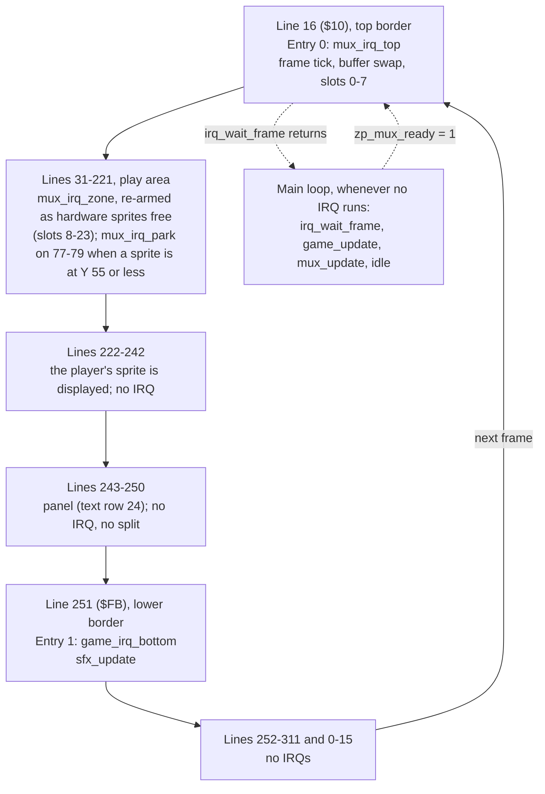

# Swarm: memory map, raster timeline and frame budget

M4 stage 0 technical design (Technical Director, 2026-10-01; brought in line with the design doc
and the engine README on 2026-10-02: panel decided, character set, colour and star tables; stage 1's
measured costs, the panel budget decision and the main loop as built added the same day) for the approved
[game design](design.md) and the [M4 brief](../../milestones/M4-training-game.md). The
gameplay-engineer builds to this page; changing the layout means changing this page in the same
commit ([coding standards](../../standards/coding-standards.md#memory)).

**How to read the numbers:** **measured** = from a probe or the engine's spikes, with its source;
*estimate* = a design figure nobody has measured yet (CPU cycles counted from the intended code,
then × 1.27 for DMA, the measured share for main-loop code running through the display with 24
sprites: [vic-ii-timing.md](../../reference/vic-ii-timing.md#frame-budget-worked-example-pal));
*model* = from a Python model of the multiplexer's selection rules, an estimate too. Every estimate
here has a check in [tests/games/swarm/budget.json](../../../tests/games/swarm/budget.json) that
replaces it with a measurement at the stage named.

## Verdict

**The approved design fits the machine and engine v1.** The one correction this page asked for
(the panel's colours) is decided and in the design: [The panel](#the-panel). Budgeted game logic and sound: **6,265** raster cycles a frame against the engine's promise
of **7,200** ([engine/README.md](../../../engine/README.md#the-v1-promise-and-its-one-exception),
**measured**): **935 of headroom (13.0%)**, nearly all of it on *estimated* game costs (input is **measured**). In a normal frame
the game has about 11,600 available, so the headroom there is about 5,300. Stage 1's routines are
**measured** and inside their rows ([Stage 1, measured](#stage-1-measured)), but with no DMA on
them yet, so the display allowance in every row is still untested.

## Configuration

| Setting | Value | Why |
|---|---|---|
| `$01` | `$35` | BASIC and KERNAL out, I/O in. Set by `irq_init`; never changed afterwards |
| VIC bank (`$DD00`) | 0 (`$0000–$3FFF`), the power-on default: not written | The whole program is one PRG from `$0801`; nothing has to be copied under I/O (which would need `$01=$34` with interrupts off). It's the configuration every multiplexer measurement was taken in. The cost: the VIC can't see `$1000–$1FFF`, so only code goes there |
| `$D018` | `$1A` | Screen at `$0400`, charset at `$2800` |
| `$D011` | `$5B`, written once at init | Extended colour mode (ECM) on, screen on, 25 rows, YSCROLL 3, bit 7 clear ([IRQ ownership](../../standards/coding-standards.md#irq-ownership)). See [The panel](#the-panel) |
| `$D016` | `$C8` (default) | 40 columns, no multicolour, XSCROLL 0 |
| `$D020` / `$D021` / `$D022` | black / black / blue | Border, play area background, panel background (ECM background 1) |
| `$D015`, `$D010`, `$D01C`, `$D000–$D00F`, `$D027–$D02E` | Multiplexer's | Game code never writes them |
| `$D017`, `$D01D` | 0, written once at init | No sprite expansion (engine v1 condition 4) |
| `$D01B` | 0 | Sprites in front of characters |
| `MUX_SCREEN` | `$0400` | Sprite pointers at `$07F8–$07FF` |
| `MUX_Y_MAX` | `221` (`$DD`) | Panel starts on line 243; a sprite at Y shows on Y+1…Y+21 (**measured**, `tests/timing/sprite_wrap`), so 243 − 22 |
| SID `$D400–$D418` | `engine/sfx.asm`'s | Game code never writes them |
| CIA 1 `$DC00`, `$DC02` | `engine/input.asm`'s | Joystick port 2 |
| Video standard | PAL | |

### The panel

**Decided: extended colour mode (ECM) for the whole screen, set once at init. No raster split and
no chain entry for the panel** (Simon, 2026-10-01; [design decision 8](design.md#decisions),
[Screen layout](design.md#screen-layout)).

| | Play area, rows 0–23 | Panel, row 24 |
|---|---|---|
| Screen code | Glyph code **0–63** | The same glyph's code **+ 64** (`$40`–`$7F`) |
| Background | `$D021`, black | `$D022`, blue (ECM background 1) |
| Colour RAM | Per cell: white for text, the twinkle's colour for a star | White, all 40 cells |

- In ECM the top two bits of a screen code choose the background and the low six the glyph, so the
  whole screen has **64 glyphs** ([Character set](#character-set)). Codes `$80` and up
  (`$D023`, `$D024`) are never written; those two registers are left alone.
- **All 40 panel cells are written at init, blanks included**: a blank is space + 64 = `$60`, not
  `$20`, which would be a black hole in the bar. The same goes for every later panel write: a spare
  ship is erased with `$60`. Panel code adds `PANEL_BG` (= `$40`) to every code it stores; nothing
  else in the game does.
- White on blue with these values is **measured**: `tests/timing/ecm_panel`,
  [picture](../../../screenshots/swarm-panel-ecm-white-on-blue.png).
- History, one line: the design first asked for reverse video, which gives **black** text on the
  bar (a reverse-video glyph is drawn in the background colour; **measured**, the same probe), and
  this page offered ECM or a lighter bar with black text.
- A real split (white on blue without ECM) stays the wrong tool: line 243 is a badline, and a
  stable entry needs the same sprite DMA every frame on the two lines before it, which the player
  and enemy shots at Y 200–221 don't give.

ECM changes what the pixels show, not when the VIC-II fetches, so the multiplexer's timing is
expected to be the same; that is *unverified* until QA's write-timing run on the game (F3 in the
[README](../../../engine/README.md#verdict-safe-for-m4-with-the-zone-code-frozen)), which is run
on the build as shipped.

### Character set

64 glyphs at `$2800–$29FF`: the character ROM's codes 0–63 (upper case and graphics set, ROM
`$D000–$D1FF`), with three replaced. The design uses **35 of 64**: 21 letters, 10 digits, space and
the three custom glyphs; **29 spare** ([design](design.md#character-set-64-glyphs)).

| Constant | Code | Replaces (unused by any text) | Charset bytes | On screen as |
|---|---|---|---|---|
| `GLYPH_STAR_HI` | **27** (`$1B`) | `[` | `$28D8–$28DF` | 27, play area only |
| `GLYPH_STAR_LO` | **28** (`$1C`) | `£` | `$28E0–$28E7` | 28, play area only |
| `GLYPH_SHIP` | **29** (`$1D`) | `]` | `$28E8–$28EF` | 29 + 64 = 93 (`$5D`), panel only |

- **Codes 27–29 are confirmed** (the designer's suggestion). No text uses them (letters are within
  1–25, space 32, digits 48–57), and being adjacent they are one 24-byte patch at `$28D8`, copied
  from a `glyph_data` block in the game tables after the ROM copy.
- Text is stored in the tables as codes 0–63 and written to the play area as it is; the panel
  routine adds `PANEL_BG`. **Every string goes through the `GameText()` macro** (`tables.asm`),
  never `.text`: KickAssembler can't read back the bytes a `.text` emitted, so an `.errorif` over
  the string data isn't possible (found in stage 1). `GameText()` maps each character to its code
  itself and stops the build on anything outside the 64 glyphs, the three replaced codes included.
- The other 26 codes keep the ROM's glyphs (J K Q X Z, `@`, punctuation), free for later text under
  the design's rule: capitals, digits and ROM punctuation in codes 0–63 only.

A note on the design's wrap: a diver re-entering at Y 30 is displayed on lines 31–51, and line 51 is
the first line of the display window, so its last sprite row (row 20) shows. The enemy art keeps
row 20 empty: the design's enemy art area is rows 1–19 ([art rule 3](design.md#art-rules),
[hit-box table](design.md#hit-boxes); the hit box itself is rows 3–17).

## Memory layout

One PRG, `$0801` upwards. Every block starts with `* = $xxxx "Name"` and ends with an `.errorif`
against the next block's start.

| Range | Contents | Size | Owner |
|---|---|---|---|
| `$0002–$00FF` | Zero page ([below](#zero-page)) | | zp.asm |
| `$0100–$01FF` | Stack | | |
| `$0400–$07E7` | Screen: play area rows 0–23, panel row 24 | 1,000 B | Game (panel, stars, messages) |
| `$07F8–$07FF` | Sprite pointers | 8 B | Multiplexer only |
| `$0801–$080F` | BASIC upstart | | |
| `$0810–$27FF` | **Engine block**: `irq.asm`, `multiplexer.asm` (+ `multiplexer_flicker.asm`), `input.asm`, `rng.asm`, `collision.asm`, `sfx.asm`, then the chain tables | 8,176 B reserved. IRQ + multiplexer: **6,045 measured** (DEBUG, [README](../../../engine/README.md#zero-page)); the four new modules: about 1,000 *estimate* (sfx 500, collision 300, slack; input 32 and rng 37 are **measured**) | raster-engineer |
| `$2800–$29FF` | Charset: 64 glyphs ([above](#character-set)). Copied from the character ROM at init (`$01=$33`, interrupts off, **before** `irq_init`), then codes 27–29 patched: star high, star low, ship | 512 B (zeros in the PRG) | Game init |
| `$2A00–$2FFF` | Unused: the rest of the charset slot. In ECM the VIC-II never fetches a glyph above code 63, so nothing is shown from here. Kept empty | 1,536 B | |
| `$3000–$37FF` | Sprite shapes, pointers `$C0–$DF`. 13 used (`$C0–$CC`, `$3000–$333F`) from `png2sprites`; 19 spare for art changes | 2 KB | tools-engineer (art), game |
| `$3800–$3FFF` | Game tables ([below](#game-tables)): colour table at `$3800`, then stars, glyphs, collision pairs, column X, dive paths, waves, strings, sound effect data | 2 KB reserved, about 840 *estimate* | gameplay-engineer |
| `$4000–$5FFF` | Game code and variables (per-enemy arrays: 18 × about 10 B) | 8 KB reserved, 4–5 KB *estimate* | gameplay-engineer |
| `$6000–$CFFF` | Free | 28 KB | |
| `$D000–$DFFF` | I/O. Colour RAM `$D800–$DBE7`: star colours, panel text colour | | Game |
| `$FFFA–$FFFF` | NMI / RESET / IRQ vectors (RAM under the KERNAL) | 6 B | IRQ framework only |

- `$1000–$1FFF` is inside the engine block: the VIC sees the character ROM there, so it can only
  hold code and CPU data, which is what the engine block is
  ([memory-map.md](../../reference/memory-map.md#bank-selection-dd00-bits-01-inverted)).
- The M3 spikes put sprite data at `$2800`. Swarm puts the charset there and sprites at `$3000`, so
  the engine block can grow to 8 KB before anything moves.
- Nothing in the game needs `$01=$34`, RAM under I/O or a second screen.

### Game tables

`$3800–$3FFF`, one block, `.errorif` against `$4000`. Only the colour table's address is fixed (so
a colour can be changed from the monitor during art review); the rest follow in this order and the
labels find them.

| Table | Label(s) | Size | Notes |
|---|---|---|---|
| Colours | `colour_table`, at **`$3800`** | 19 B used, 32 reserved (`$3800–$381F`) | Below |
| Stars | `star_lo`, `star_hi`, `star_glyph` | 3 × 48 = 144 B | Below |
| Custom glyphs | `glyph_data` | 3 × 8 = 24 B | Star high, star low, ship: copied to `$28D8` at init |
| Collision pairs | `col_pairs` | 3 × 4 = 12 B | `ColPair` rows ([engine/collision.md](../../../engine/collision.md)) |
| Column X | | 6 B | 34 + 36 × column |
| Dive paths and fire steps | | about 75 B | [Below](#dive-paths-as-data) |
| Wave tables | | about 40 B | |
| Strings | | about 150 B | 81 characters in 11 texts, with row, column and length; codes 0–63 |
| Sound effect data | | about 350 B | [engine/sfx.md](../../../engine/sfx.md) |
| **Total** | | **about 840 of 2,048** (*estimate*) | |

**Colour table.** Every colour the game writes comes from `colour_table`, indexed by a `COL_*`
constant: no colour number appears anywhere else in the code. It is the code's copy of the design's
[colour table](design.md#colours), which is the designer's proposal until Simon's art review, so a
colour change is one byte here and one row there.

| Index | Constant | Value (design) | | Index | Constant | Value (design) |
|---|---|---|---|---|---|---|
| 0 | `COL_BORDER` (`$D020`) | 0 black | | 10 | `COL_ENEMY_EXPLODE` | 8 orange |
| 1 | `COL_BACKGROUND` (`$D021`) | 0 black | | 11 | `COL_PLAYER_EXPLODE` | 1 white |
| 2 | `COL_PANEL_BG` (`$D022`) | 6 blue | | 12 | `COL_RESPAWN_ALT` | 11 dark grey |
| 3 | `COL_PLAYER` | 3 cyan | | 13 | `COL_PANEL_TEXT` (ships too) | 1 white |
| 4 | `COL_PLAYER_SHOT` | 3 cyan | | 14 | `COL_MESSAGE_TEXT` | 1 white |
| 5 | `COL_ENEMY_A` (row 0) | 4 purple | | 15 | `COL_STAR_0` | 1 white |
| 6 | `COL_ENEMY_B` (row 1) | 7 yellow | | 16 | `COL_STAR_1` | 15 light grey |
| 7 | `COL_ENEMY_C` (row 2) | 13 light green | | 17 | `COL_STAR_2` | 12 grey |
| 8 | `COL_WINDUP_FLASH` | 1 white | | 18 | `COL_STAR_3` | 11 dark grey |
| 9 | `COL_ENEMY_SHOT` | 10 light red | | 19–31 | spare | |

Indices 5–7 are in row order, so an enemy's colour is `colour_table + COL_ENEMY_A + row`; 15–18 are
the twinkle's four steps in order. Sprite colours go to `mux_col` (never to `$D027–$D02E`), text
and star colours to colour RAM.

**Star table.** 48 stars, three parallel arrays indexed by star number: `star_lo` / `star_hi` are
the cell's offset from the start of the screen (row × 40 + column, 0–959; add `$0400` for the
screen, `$D800` for colour RAM), `star_glyph` is `GLYPH_STAR_HI` or `GLYPH_STAR_LO`.

- It is **assembled data, not built at run time**: generated by a KickAssembler script loop from a
  fixed seed, so every build and screenshot has the same sky and init has nothing to compute.
- It is built under the design's **band rule**
  ([Text cells and the star rule](design.md#text-cells-and-the-star-rule)): rows 0–23 only, **no
  star in columns 10–29 of rows 5, 9, 11, 12, 13, 16 and 19**, and no two stars in one cell. The
  generator rejects such cells and draws again, and an `.errorif` over the finished table checks
  all three conditions, so a hand-edited table can't break the rule silently.
- What the rule buys, and the code relies on: text is written and erased with spaces without
  consulting the star table, and the twinkle's one colour RAM write a frame
  (`stars_update`, budget row 10) never lands on a letter. If the band list changes in the design,
  the generator's list changes with it.
- Stars are drawn once at init (48 screen writes) and never redrawn; nothing but text writes to the
  play area's screen cells afterwards, and text stays inside the bands.

### Dive paths as data

Per path (hook, sweep, plunge): a list of 3-byte segments `dx, dy, steps` (signed, signed, count;
`steps` 0 = repeat until X reaches 0 or 344), ended by the path's end code (return or wrap), and a
list of fire steps ended by 0. Row r uses path `path_of_row[r]`. A diver holds: segment pointer
(index into the table, 1 byte), steps left, step count, mirror flag, shots left, next fire step.

## Sprite allocation

All 24 virtual sprites and all 4 pins are used (the design's split, confirmed).

| Virtual sprites | Kind | `mux_flags` | Notes |
|---|---|---|---|
| 0 | Player (and its explosion) | `$80` pinned | Y fixed at 221 = `MUX_Y_MAX` |
| 1–3 | Enemy shots | `$80` pinned | Hidden (`MUX_OFF`) when free. A hidden pinned sprite costs nothing |
| 4–5 | Player shots | `$00` | |
| 6–23 | Enemies, 6 + row × 6 + column (and their explosions) | `$00` | The title screen shows 6, 12 and 18 |

- `mux_flags` is written **once at init, all 24 entries**, and never again. Bit 0 (multicolour) is 0
  everywhere, hidden sprites included: the engine takes its cheaper uniform path only when all 24
  agree ([README](../../../engine/README.md#as-built-stage-3)), and the uniform zone blocks have
  the larger timing margin: **17 cycles** in DEBUG and **39** in release, against **3** for DEBUG
  mixed (all **measured**, worst case found, not a proven bound:
  [engine/README.md](../../../engine/README.md#verdict-safe-for-m4-with-the-zone-code-frozen),
  the four-mode table and "Where Swarm (M4) sits").
- Parked enemies' `mux_y` is written when the enemy changes state, not every frame.
- Hide a sprite with `mux_y` = `MUX_OFF`. Don't park hidden sprites at a real Y.

## Zero page

`games/swarm/src/zp.asm` declares all of it. Addresses of the engine labels are the README's
suggested ones; the game's are ranges by owner, and the gameplay-engineer names the bytes.

| Range | Name(s) | Owner | Notes |
|---|---|---|---|
| `$02–$09` | `zp_tmp0`–`zp_tmp7` | Anyone in the main loop | Scratch. `mux_update` uses `zp_tmp0–3`, `collision.asm` and `rng.asm` none. Never held across a `jsr`, **never in an IRQ handler** |
| `$0A` | `zp_irq_idx` | IRQ framework | IRQ only |
| `$0B` | `zp_irq_frame` | **Shared**: IRQ writes, main reads | One byte: atomic |
| `$0C` | `zp_mux_front` | **Shared**: IRQ writes on the swap | Game code doesn't touch it |
| `$0D` | `zp_mux_ready` | **Shared**: main sets, IRQ clears | Game code doesn't touch it |
| `$0E–$0F` | `zp_mux_slot`, `zp_mux_end` | Multiplexer IRQs | IRQ only |
| `$10` | `zp_joy` | `input.asm`, main loop | Stick state this frame ([engine/input.md](../../../engine/input.md)) |
| `$11` | `zp_joy_pressed` | `input.asm`, main loop | Bits that went from up to down this frame |
| `$12–$13` | `zp_rng_lo`, `zp_rng_hi` | `rng.asm`, main loop | Generator state ([engine/rng.md](../../../engine/rng.md)) |
| `$14–$15` | `zp_sfx_ptr` | `sfx.asm`, **IRQ only** (`sfx_update`) | Pointer into the effect data. The main loop never touches it |
| `$16–$17` | reserved for the engine | | |
| `$18–$1F` | Main loop and state machine: `zp_game_frame` (the value `irq_wait_frame` returned), `zp_game_state`, `zp_state_timer` (2), `zp_idle_lo`, `zp_idle_hi`, `game_idle_min` (2, DEBUG) | Game core | [Labels the game must provide](#labels-the-game-must-provide) |
| `$20–$2F` | Player, shots, formation: player X (2), cooldown, invulnerability timer, lives, `fx`, drift direction, launch timer, divers active, enemies alive, wave, loop | Game | **`zp_wave` is BCD** (`$01`–`$99`, the number as shown), like `game_score` and `game_hiscore` (3 bytes each, most significant first): the panel prints nibbles. Code that needs the wave as an index (pattern, loop) uses `zp_loop` and its own binary counter, not `zp_wave` |
| `$30–$3F` | Pointers and per-call scratch for game routines (path pointer, screen pointer, star index) | Game | |
| `$40–$FF` | Free | | Per-object arrays (18 enemies, 5 shots) are absolute, not zero page |

**Sharing rules.** The only bytes shared between IRQs and the main loop are the three marked
above, all the engine's, all one byte. The game's one IRQ handler (`game_irq_bottom`) calls
`sfx_update` and nothing else; `sfx.asm`'s request bytes are the only game-side data that cross
(one byte per voice, written by the main loop, consumed by the IRQ:
[engine/sfx.md](../../../engine/sfx.md)). No multi-byte value is shared.

## Raster timeline (PAL, 312 lines)

Two chain entries. YSCROLL 3, so badlines are on 51 + 8n up to 243 (**measured**,
[vic-ii-timing.md](../../reference/vic-ii-timing.md#badlines)).



| Line | Handler | Job | Cost (raster cycles) | Budget until the next handler |
|---|---|---|---|---|
| 16 (`$10`) | `mux_irq_top`, entry 0, `IrqNormal` | Frame tick, swap, slots 0–7 | 378 / 381 / 393 + 32 before it + 6 `rti` (**measured**, README) | Border: no DMA |
| ≈ 31–221, dynamic | `mux_irq_zone`, re-armed | Slots 8–23 | ≤ 2,950 an IRQ (**measured** max 2,763) + 30 framework | Engine's |
| 77–79, some frames | `mux_irq_park`, re-armed | Disable hardware sprites whose last slot is at Y ≤ 55 (a Plunge rising to Y 50, a wrap re-entering from Y 30) | 80 + 30 (**measured**) | Engine's |
| 251 (`$FB`) | `game_irq_bottom`, entry 1, `IrqNormal` | `jsr sfx_update`, `IrqDone()` | 93 framework (**measured**) + 6 `jsr` + `sfx_update` ≤ 500 (*estimate*, [engine/sfx.md](../../../engine/sfx.md)) | Lines 251–311 and 0–15: 77 lines, 4,851 cycles, no DMA |

Why these lines:

- **No entry for the panel**: ECM needs no register change at line 243.
- **Entry 1 at 251, the sound tick.** Three reasons. (1) Every multiplexer measurement was taken
  with entry 0 plus one fixed entry at `$FB`; a one-entry chain with the multiplexer has never been
  run, and M4 is told to develop in the configurations that were measured. (2) Sound keeps its
  tempo when the main loop repeats a frame. (3) It's where music goes in M5, so M4 tries the
  pattern. Line 251 is past the README's rule for fixed entries (`MUX_Y_MAX` + 3 = 224 or later),
  past the last badline (243) and past the player's sprite DMA (lines 221–241), so the handler's
  span has no DMA and its cost is exact.
- Nothing between lines 16 and 224, and nothing before line 16
  ([README](../../../engine/README.md#raster-timeline)).
- `irq_lines` is never rewritten.

## Frame budget

### What the engine leaves (README, all **measured** in the `multiplexer` spike, DEBUG, raster cycles)

| | Normal frame (no overflow) | Overflow frame (flicker, pinned sprites in the crowd) |
|---|---|---|
| Whole frame | 19,656 | 19,656 |
| All IRQs (the spike's fixed entry does nothing) | 522–3,779, average 2,227; limit 4,000 | the same |
| `mux_update` | 3,563–6,783, **average 4,261** | 4,665–12,330 in the spike, average 6,711, at about 8 evictions and drops a frame |
| **Left for the game** | **about 11,600** at the IRQ maximum | **≥ 7,200 promised** in every frame but one case (below); worst measured 5,328 idle + 1,909 = 7,237 over about 800,000 frames |

### The game's budget (raster cycles a frame, worst case; an *estimate* unless marked **measured**)

Worst case = full formation, 3 divers taking 2 path steps each, 2 player shots and 3 enemy shots
in flight, 2 enemy hits and a launch in the same frame.

| # | Subsystem | Budget (raster) | CPU count behind it | Check in `budget.json` (labels), from stage |
|---|---|---|---|---|
| 1 | Main loop, state machine, timers | 150 | 100 | part of `game_update` |
| 2 | Input (`jsr input_read`, the whole call) | **40**, **measured** | 40: `jsr` 6 + 28 + `rts` 6 ([engine/input.md](../../../engine/input.md#cycle-budget)). No DMA allowance: see below | `tests/engine/input` (locks the 28); part of `game_update` |
| 3 | Player: move, clamp, cooldown, fire, flash, explosion timer | 200 | 150 | `player_update`, 1 |
| 4 | Player shots (2): move, remove | 150 | 100 | `pshot_update`, 1 |
| 5 | Formation: drift, 18 home X (9 bits), animation frame, wind-up wobble, explosion timers | 750 | 550: unrolled by column (6 × about 35) + frame swap 90 + 3 explosions and wind-ups 150 | `formation_update`, 2 |
| 6 | Divers (3): 2 path steps each (about 90 a step), return, shot spawn; the launcher's pick and scan of 18 on a launch frame (about 300, of which at most 2 `rng_next` calls: 84, **measured**) | 1,350 | 1,050 | `diver_update`, 3 |
| 7 | Enemy shots (3): move, remove | 200 | 150 | `eshot_update`, 3 |
| 8 | Collisions: 42 box tests (2,100) and the responses to 2 enemy hits or a player hit: state, score add, explosion start (375) | 2,475 | 1,641 + 295 | `collide_update`, 2 |
| 9 | Panel, **in a frame of play**: redraw score, lives and wave. The four-field redraw is exempt: [The panel's budget](#the-panels-budget) | 250 | 200 (**measured** 231, no DMA) | `panel_update`, 1 |
| 10 | Star twinkle: one colour RAM write | 100 | 60 | `stars_update`, 1 |
| 11 | Sound: `sfx_play` calls from the main loop (up to 3) | 100 | 75 | inside the routines that call it |
| | **Main loop, `game_update` in all** | **5,765** | | `game_update`, 1 |
| 12 | Sound tick in `game_irq_bottom` (IRQ time, no DMA): three effects starting in one frame | 500 | 500 | `game_irq_bottom`, 4 |
| | **Game logic and sound in all** | **6,265** | | |
| | **Engine's promise** | 7,200 | | |
| | **Headroom** | **935 (13.0%)** | | `game_idle_min` × 16 ≥ 935, 1 |

**Measured rows** (2026-10-02, M4 stage 1; the span convention is
[engine/README.md](../../../engine/README.md#which-span-a-figure-is)):

- **Input, 40.** The whole call, no DMA: `input_read` is called straight after `irq_wait_frame`,
  which returns when `mux_irq_top` has finished, in the top border: `game_update` is reached on
  **line 23, cycle 33** (**measured**, below), and the first line with sprite DMA is 30 (`MUX_Y_MIN`). The earlier 75
  was an estimate with a DMA allowance it doesn't need. Saves 35: the totals fell from 5,800 /
  6,300 and the headroom rose from 900.
- **Random numbers, 42 a call** (`jsr rng_next`, constant time, no DMA;
  [engine/rng.md](../../../engine/rng.md#cycle-budget)). The launcher calls it in the display, so
  budget about **54 raster** a call (× 1.27). **Rule for the gameplay-engineer: at most 2
  `rng_next` calls in a frame.** A pick that needs a number below 18 by mask-and-retry and fails
  twice, or lands on an enemy that isn't parked, is settled without another call (scan on from that
  index to the next parked enemy, or try again next frame): an unbounded retry loop has no worst
  case to budget. Row 6 is unchanged: its 300 for a launch frame covers the two calls (84 CPU) and
  the scan, and stays an *estimate* until stage 3.
- **`tests/games/swarm/budget.json` agrees with this table** (brought in line 2026-10-02):
  `game_update` ≤ 5,765 and `game_idle_min` × 16 ≥ 935, in the stage 1 checks and the stage 5 soak.

#### Stage 1, measured

**Measured** 2026-10-02 on the stage 1 build (commit 68ff14c; VICE 3.10 x64sc PAL, DEBUG):
`make test ARGS=swarm` (the `AUTOPLAY` build, 300 or 600 passes a check) and the gameplay-engineer's
`vice_profile` runs recorded in each routine's header. Profile spans, raster cycles. The estimates
stay as the budgets.

| Row | Routine | Budget (*estimate*) | **Measured**, stage 1 | The same code in the display (× 1.27, *estimate*) |
|---|---|---|---|---|
| 3 | `player_update` | 200 | max **122** | 155 |
| 4 | `pshot_update` (2 shots) | 150 | **43** | 55 |
| 10 | `stars_update` | 100 | **57** | 72 |
| 9 | `panel_update` | 250 | **9** with nothing dirty (the usual frame); **231** with score, lives and wave dirty; about 325 with the high score too (*counted*, not measured) | 293 for the 231: **over 250**, see [The panel's budget](#the-panels-budget) |
| | `game_update` in all | 5,765 | 262–317 in the game; max **580** in `AUTOPLAY` (three panel fields redrawn every frame) | |
| | All IRQ time a frame (check: ≤ 4,500) | | **620**, of which `game_irq_bottom` is 93 of framework and no work | |
| | `mux_update`, 3 sprites shown | engine: 4,261 average with 24 | **1,073–1,120** | |
| | Idle in the worst frame (`game_idle_min` × 16) | ≥ 935 | **15,888** | |

**These figures carry no DMA, so they don't test the budget's display allowance.** With three
sprites and so little work, `game_update` runs on **lines 23–31** (**measured**: `vice_start` on
`build/swarm_budget/swarm_budget.prg`, then `vice_run_until` `game_update`, `panel_update`,
`game_update_end`: line 23 cycle 33, line 27 cycle 38, line 31 cycle 23), all above the first
badline (51), and nothing but a player shot at the top of its flight puts sprite DMA there. What
stage 1 shows is that the CPU counts behind rows 3, 4 and 10 were generous and row 9's was 31 short
(231 against 200). What it can't show is the × 1.27: from stage 2 `game_update` runs on into the
display with 21 sprites on screen, and the per-routine checks then measure the allowance for the
first time. So **no limit in `budget.json` is re-baselined to a stage 1 figure**: measured + 5% of a
border-only run would be a limit the same code fails as soon as the formation exists.

#### The panel's budget

**Decided (Technical Director, 2026-10-02): the budget stays 250 and is "per frame of play". It
does not rise. The four-field redraw is exempt, and `panel_update` moves to the top of the frame.**

1. **Row 9 covers the most a frame of play can ask for**: score, lives and wave
   (`PANEL_DIRTY_PLAY`), **measured 231**. Real play is lighter: the wave changes at a wave's start,
   when nothing is being hit, so score + lives is the real worst frame.
2. **The four-field redraw (about 325, *counted*) is exempt from the 250**, because it never
   shares a frame with the costs the budget protects. It happens twice: in `panel_init`, before
   `irq_init`, which isn't a frame at all; and when a game ends
   ([design](design.md#title-and-game-over-screens): "the high score is updated when the game ends"). **Rule:
   `PANEL_DIRTY_HI` is set only by `panel_init` and by the state machine on entering game over,
   never by a play-state routine.** With item 3 it is drawn in the following frame, a game-over
   frame, which runs no collisions (2,475), no launcher and no hits, so 75 over the row is covered
   many times.
   Raising the budget to 350 instead would take 100 from the 935 of headroom in every frame of
   play to pay for a frame that has thousands spare.
3. **`panel_update` is called straight after `input_read`** (after `autoplay_update` in the
   budget build), not last. Stage 1 calls it last, which from stage 2 puts it in the display after
   up to 5,500 cycles of game logic: 231 × 1.27 = about 293, over the 250. Called first it runs on
   about lines 24–28, always in the border (the first badline is 51), so its cost stays the
   measured 231 whatever the rest of the frame does. It draws the fields dirtied by the previous
   frame's updates: one frame later than now, which is the frame in which the sprites that caused
   the change appear (positions written in frame N are shown in frame N + 1,
   [README](../../../engine/README.md#frame-flow-and-double-buffering)), so score and explosion
   arrive together. This is a change to `games/swarm/src/main.asm` for the gameplay-engineer at
   the start of stage 2; if something prevents it, the Technical Director raises row 9 to 300 and
   the headroom falls to 885.
4. **`AUTOPLAY`'s panel load is right, and stays**: it sets `PANEL_DIRTY_PLAY` every frame, so
   the `panel_update` check measures item 1's worst case in every pass, and `game_update` carries
   it in every frame (about 220 more than the game proper does in its usual frame). Lives are 3 in
   that build (two markers drawn), the lives loop's longest path but one cycle. It is deliberately
   harsher than play, and it does not include the high score, by item 2. Nothing in `make test`
   measures the four-field redraw; it doesn't need a check.

The rows are simultaneous worst cases that can't all happen in one frame (a launch scan, two hits
and a player hit together), so the measured `game_update` should come in under the sum.

**Collision method budgeted:** one object against a run of targets, bounding boxes, exact to the
pixel, reading the multiplexer's own `mux_x_lo` / `mux_x_hi` / `mux_y` arrays
([engine/collision.md](../../../engine/collision.md)). Each test is two unsigned range checks:
Y first (8 bits), then X (9 bits) only if Y overlaps.

| | CPU cycles (*counted from the intended loop, not measured*) |
|---|---|
| A target rejected on Y | 19 |
| A target that passes Y and is tested on X (hit or miss) | 42 |
| Set-up per call (`collision_begin`) | about 90 |
| The design's 42 tests, worst mix: two player shots each inside a row's Y band, one with 3 divers there (15 full tests, 21 rejects); the player against 3 enemy shots and 3 divers (6 full) | 21 × 42 + 21 × 19 + 4 × 90 = **1,641**, about 39 a test; × 1.27 = 2,084 raster, budget 2,100 |
| Typical frame: both shots between rows | 36 × 19 + 6 × 42 + 360 = about 1,300 |

**Boxes.** `col_pairs` is typed from the design's [hit-box table](design.md#hit-boxes), which is
the only place the numbers live: player 6–17 × 6–20, enemy 4–19 × 3–17, player shot 11–12 × 0–7,
enemy shot 11–12 × 14–20 (columns × rows, inclusive); explosions have no box, and the game skips an
exploding target. Checked against the budget's assumptions (2026-10-02): every `range_y` is 21–29,
inside the module's limit of 64; the rows are 40 lines apart and a shot's Y band against an enemy
is 22 lines, so a shot is in at most one row's band, and the two shots (80 lines apart at the
10-frame cooldown) can each be in one, which is the 6 + 6 + 3 divers = 15 full tests budgeted;
the player's 6 tests are all full only for enemies at Y ≥ 210 and shots at Y ≥ 207, as the design
says. The art areas don't enter the collision code.

If `collide_update` measures over 2,475, the fallback that needs no design change: parked enemies
are a grid, so a player shot finds its one candidate by row and column (about 80 cycles a shot)
and only divers go through the box test. It saves about 700 CPU cycles and is the
gameplay-engineer's to propose with a measurement, not to do unasked.

### Does it fit? Yes

| Frame | `mux_update` | IRQs incl. sound tick | Game | Idle left | Basis |
|---|---|---|---|---|---|
| Normal (89.5–100% of frames) | 4,261 avg, ≤ 6,783 | ≤ 4,300 | ≤ 5,765 | **≥ about 2,800**, typically about 7,000 | Engine **measured**, game *estimate* |
| Overflow (0–10.5% of frames, *model*) | about 5,400–6,500 *estimate*: 1–3 evictions and drops against the spike's 8 | ≤ 4,300 | ≤ 5,765 | about 3,000 *estimate*; **≥ 935 by the promise** | Promise **measured** in a harsher spike |
| The README's excepted case, if it could happen | ≤ 12,342 | ≤ 4,300 | ≤ 5,765 | about 135 (game left about 6,400, **measured**, against 6,265) | Doesn't occur in this design: see (b) |

### (a) Pinned evictions in the player's zone

- **How often and how many** (*model*, [tests/games/swarm/mux_load.py](../../../tests/games/swarm/mux_load.py),
  results beside it; worst-case play, 6,000 frames a wave): a pinned sprite evicts in **0% to 4.75%
  of frames** (worst: pattern 3, loop 3), **at most 2 evictions in a frame**, and no pinned sprite is
  ever left out. The engine's cap is 8 (`MUX_PIN_EVICT_MAX`), never approached. The design's "9 in
  the player's zone" is the theoretical maximum: the model never saw more than **7** there.
- **Why almost every overflow near the bottom is a pinned eviction:** the player is at
  `MUX_Y_MAX`, last in Y order, so when its window is full it is the sprite that doesn't fit.
- **Cost of such a frame over a normal one** (*estimate* from the README's **measured** parts:
  filling the kept list 356, pinned pass 340, the fail decision 244 and eviction 302, restoring ages
  74, rebuild from a late slot about 600): **about 1,900** for one pinned eviction, about 2,500 for
  two. `mux_update` goes from about 4,300 to about 6,200–6,800 in that frame, which leaves the game
  about 9,100 (frame − engine IRQs − `mux_update`) against its 6,265. Budgeted: nothing extra, because the engine's promise already covers it.

### (b) Overflow frames

- **How often** (*model*): 0% (pattern 1, loop 0), 2.2–3.0% (pattern 2), 7.1–10.5% (pattern 3; the
  worst is loop 3) of frames in worst-case play, where nothing ever dies. A real game is lighter.
  At most **3** evictions and drops in a frame, against about 8 on average in the spike that the
  engine's 12,342 worst case comes from.
- **Does the game still fit, or repeat frames? It fits; no repeated frame is expected.** The promise
  of 7,200 was measured in a spike with 65% overflow frames and 4 pinned sprites sweeping through
  crowds; Swarm's 6,265 is inside it by 935, and its overflow frames are lighter.
- **The excepted case** (a mass re-sort **and** pinned sprites evicting in the same frame, about
  6,400 left) needs many sprites to change places in Y order at once. The model's busiest frame has
  **43 shifts** (a full reversal is 276; the spike's stress frames re-order three groups of 8), from
  a diver wrapping to Y 30 while shots cross a row. That costs the sort about 1,000 more than usual
  (*estimate*: 276 shifts ≈ 6,000, README). Frames with 20 or more shifts that also overflow: at
  most 72 in 6,000 (1.2%), 39 with a pinned eviction. Estimated `mux_update` there: about 7,500–8,100,
  leaving the game about 7,800–8,400. Even at the README's measured floor for the excepted case (6,400)
  the 6,265 budget fits, by 135.
- **If the estimates are wrong** the effect is one repeated frame of sprites (a 1/50 s stutter), no
  corruption. `game_overrun_count` counts them and `make test` requires 0.

### (c) The four conditions for engine v1

| Condition | Does the design break it? |
|---|---|
| 1. Zone code and scheduling constants frozen | No: the game needs no engine change to the multiplexer. All sprites hires, so the uniform blocks are used throughout |
| 2. The main loop never sets `I` while the multiplexer runs | No. The only `sei` work is the charset copy from the character ROM (`$01=$33`), done at init before `irq_init`. Scores use decimal mode (`sed` / `cld`), which is allowed. **Rule for the gameplay-engineer: no `sei`, no `php`/`plp` tricks and no `$01` write after `irq_init`** |
| 3. YSCROLL the same on every line of the play area | No: no scrolling, `$D011` written once. ECM (bit 6) is not YSCROLL |
| 4. No sprite expansion | No: every sprite is 24 × 21; `$D017` = `$D01D` = 0 |
| (5. Build as measured) | The budget build defines `AUTOPLAY` on top of DEBUG (below). It changes game code only; the engine's code is the DEBUG build's |

### Risks, in order

1. **Every game figure but input's is an estimate.** The 935 of headroom is 15% of the game's budget. The
   largest and least certain rows are collisions (2,475) and divers (1,350). Stage 2's
   `collide_update` and stage 3's `diver_update` checks are the ones to watch.
2. **The promise itself has almost no margin** (28 cycles over about 800,000 frames in the spike), so
   treat 7,200 as exact, not conservative. Swarm's real margin comes from its lighter overflow
   frames, which is a model figure until stage 3.
3. **The flicker figures are a model's.** If the engine drops more than the model says, feel target
   5 ("nothing missing 2 frames running") fails first: `mux_max_age` ≤ 1 is checked from stage 3.
4. **ECM with the multiplexer is unmeasured** (see [The panel](#the-panel)).

## Labels the game must provide

`make test` builds `tests/games/swarm/main.asm` (the gameplay-engineer's, stage 1), which is two
lines: `#define AUTOPLAY`, then `#import "games/swarm/src/main.asm"`. The spike is named
`swarm_budget`, so it doesn't overwrite `build/swarm/`. (A `#define` carries into imported
files: checked, [kickassembler.md](../../reference/kickassembler.md#syntax-we-rely-on).)

**`AUTOPLAY`** makes the game play the designer's worst case by itself, with no joystick:

- it skips the title and starts at wave 12 (pattern 3, loop 3) with a fixed `rng_seed`;
- the "joystick" is a script: sweep right and left between the clamps with fire held;
- the player can't be hit, and **enemies don't die**: a hit is detected, scored, sounded and the
  shot removed, but the enemy stays, so the formation stays full and the wave never ends (the same
  rules as `check_design.py`, so the engine's flicker can be compared with the model's);
- it sets `PANEL_DIRTY_PLAY` (score, lives, wave) every frame, so the panel is at its busiest for
  a frame of play in every pass ([The panel's budget](#the-panels-budget));
- in stages before a feature exists, it simply runs what there is.

| Label | Kind | Meaning | Checked from stage |
|---|---|---|---|
| `game_update`, `game_update_end` | Code | Everything the main loop does in a frame except `mux_update`: from just after `irq_wait_frame` returns to just before `jsr mux_update`. Passed once a frame | 1 |
| `player_update`, `player_update_end` | Code | Row 3. Each `_end` label is on the routine's final `rts` (one exit) | 1 |
| `pshot_update`, `pshot_update_end` | Code | Row 4 | 1 |
| `panel_update`, `panel_update_end` | Code | Row 9 | 1 |
| `stars_update`, `stars_update_end` | Code | Row 10 | 1 |
| `formation_update`, `formation_update_end` | Code | Row 5 | 2 |
| `collide_update`, `collide_update_end` | Code | Row 8: all box tests and their responses | 2 |
| `diver_update`, `diver_update_end` | Code | Row 6, the launcher included | 3 |
| `eshot_update`, `eshot_update_end` | Code | Row 7 | 3 |
| `game_irq_bottom` | Code | Chain entry 1's first instruction (exists from stage 1 as a bare `IrqDone()`; calls `sfx_update` from stage 4) | 4 |
| `game_overrun_count` | 1 byte, DEBUG, saturating at 255 | Frames whose work (`game_update` + `mux_update`) finished after the next frame tick | 1 |
| `game_idle_min` | 2 bytes, little-endian, DEBUG, starts `$FFFF` | Fewest idle-loop iterations in any frame after the first `GAME_IDLE_WARMUP` (200) frames. Overrun frames don't update it | 1 |
| `game_flicker_frames` | 2 bytes, little-endian, DEBUG, saturating | Frames in which `mux_drop_count` was not 0 after `mux_update` | 3 |
| Engine's: `irq_dispatch`, `irq_exit_rti`, `irq_late_count`, `mux_update`, `mux_update_fast`, `mux_update_end`, `mux_late_count`, `mux_max_age`, `mux_pin_drop_count`, `mux_pin_excess_count` | | Come with the engine imports | 1–3 |

**The main loop**, as built in stage 1 (`games/swarm/src/main.asm`):

```
main:       jsr irq_wait_frame      // wait for the next tick. A = frame number
main_frame: sta zp_game_frame       // entered here, with A = zp_irq_frame, when the tick has
                                    // already happened (from the DEBUG idle loop)
game_update:
            jsr input_read
            jsr panel_update        // from stage 2 (The panel's budget, item 3)
            ...                     // state machine: the update routines for the current state
game_update_end:
            jsr mux_update

#if DEBUG
            // flicker: if mux_drop_count != 0, inc game_flicker_frames (16 bits, saturating)
            lda zp_irq_frame
            cmp zp_game_frame
            beq game_idle_start     // same frame: the work fitted
            inc game_overrun_count  // a tick went by during the work: an overrun (saturating
            jmp main                // at 255). Wait for the NEXT tick, as release does
game_idle_start:
            // count iterations in zp_idle_lo/hi until zp_irq_frame changes (the tick)
            // after GAME_IDLE_WARMUP frames: game_idle_min = min(game_idle_min, count)
            lda zp_irq_frame
            jmp main_frame          // NOT main: the idle loop has already waited for this tick
#else
            jmp main
#endif
```

- **The idle loop is the wait.** It ends when the tick arrives, so the next frame starts at
  `main_frame`. Going back to `main` from there would call `irq_wait_frame` with the tick already
  used and wait a whole frame more: the game would run at 25 frames a second with every check
  passing. (An earlier version of this page said "then `jmp main`"; the multiplexer spike,
  `tests/engine/multiplexer/main.asm`, has done it this way since M3: `spike_main` is the label
  after its `irq_wait_frame`.)
- **An overrun is detected by comparing frame numbers after `mux_update`**: `zp_irq_frame` no
  longer equal to `zp_game_frame` means the work ran past a tick. It is counted, the idle count
  for that frame is not taken, and the loop goes to `main` to wait for the next tick. Release does
  exactly that with no test: `jmp main` after every frame, on time or late. So an overrun costs one
  repeated frame in both builds, and the two behave the same.
- The DEBUG idle loop is the multiplexer spike's (`spike_idle`): **16 cycles an iteration** (21
  on the 1-in-256 carry), kept inside one page by an `.errorif`. `budget.json` multiplies the count
  by 16. It counts only cycles the loop ran, so IRQs and DMA that land in it lower the figure: it
  is a lower bound on what was free.

**Things the stage 1 engineer had to work out**, recorded so the next one doesn't:

- The budget build is selected by the spike's name or a part of it: **`make test ARGS=swarm`**
  (the spike is `swarm_budget`, built into `build/swarm_budget/`).
- Joystick behaviour is checked by a script, not by the profile and memory checks (they have no
  stick): `tests/games/swarm/check.py`. **`make test` now runs it** on the DEBUG build of the game,
  as the `script` check at the end of `budget.json`; the release build is still run by hand
  (`uv run --package budget-runner python tests/games/swarm/check.py --prg <release prg>`).
- Strings use `GameText()` ([Character set](#character-set)); `zp_wave` and the scores are BCD
  ([Zero page](#zero-page)).

The gameplay-engineer bumps `"stage"` in `budget.json` at the start of each stage and changes
nothing else in it. A check that fails is reported to the Technical Director with the measured
figure; limits are not edited to pass.
