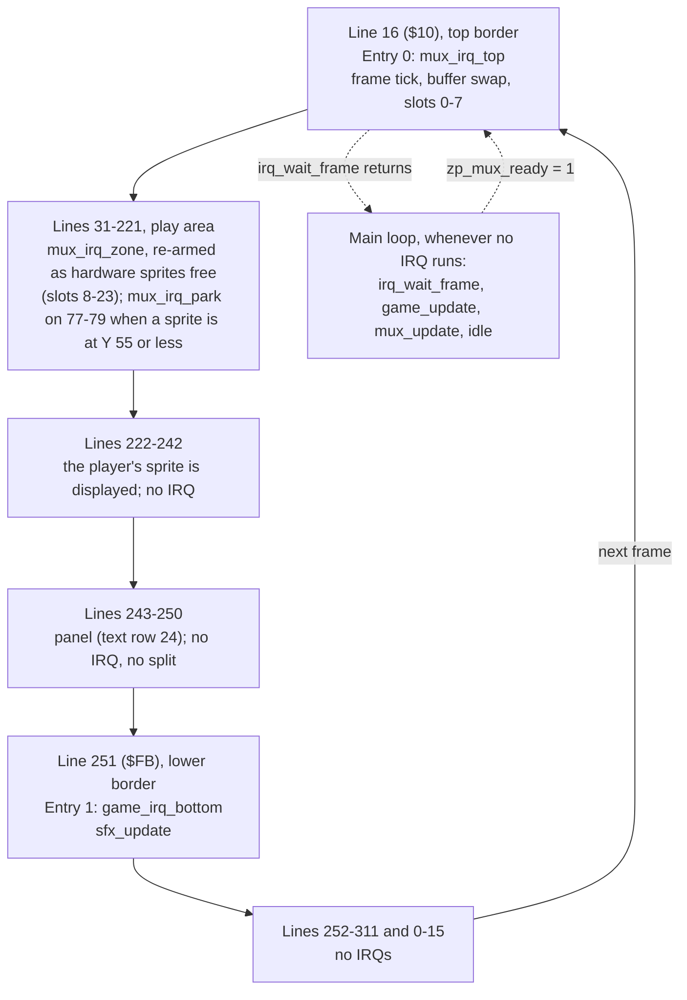

# Swarm: memory map, raster timeline and frame budget

M4 stage 0 technical design (Technical Director, 2026-10-01) for the approved
[game design](design.md) and the [M4 brief](../../milestones/M4-training-game.md). The
gameplay-engineer builds to this page; changing the layout means changing this page in the same
commit ([coding standards](../../standards/coding-standards.md#memory)).

**How to read the numbers:** **measured** = from a probe or the engine's spikes, with its source;
*estimate* = a design figure nobody has measured yet (CPU cycles counted from the intended code,
then × 1.27 for DMA, the measured share for main-loop code running through the display with 24
sprites: [vic-ii-timing.md](../../reference/vic-ii-timing.md#frame-budget-worked-example-pal));
*model* = from a Python model of the multiplexer's selection rules, an estimate too. Every estimate
here has a check in [tests/games/swarm/budget.json](../../../tests/games/swarm/budget.json) that
replaces it with a measurement at the stage named.

## Verdict

**The approved design fits the machine and engine v1, with one correction** (the panel's colours,
below). Budgeted game logic and sound: **6,300** raster cycles a frame against the engine's promise
of **7,200** ([engine/README.md](../../../engine/README.md#the-v1-promise-and-its-one-exception),
**measured**): **900 of headroom (12.5%)**, all of it on *estimated* game costs. In a normal frame
the game has about 11,600 available, so the headroom there is about 5,300.

## Configuration

| Setting | Value | Why |
|---|---|---|
| `$01` | `$35` | BASIC and KERNAL out, I/O in. Set by `irq_init`; never changed afterwards |
| VIC bank (`$DD00`) | 0 (`$0000–$3FFF`), the power-on default: not written | The whole program is one PRG from `$0801`; nothing has to be copied under I/O (which would need `$01=$34` with interrupts off). It's the configuration every multiplexer measurement was taken in. The cost: the VIC can't see `$1000–$1FFF`, so only code goes there |
| `$D018` | `$1A` | Screen at `$0400`, charset at `$2800` |
| `$D011` | `$5B`, written once at init | Extended colour mode (ECM) on, screen on, 25 rows, YSCROLL 3, bit 7 clear ([IRQ ownership](../../standards/coding-standards.md#irq-ownership)). See [The panel](#the-panel) |
| `$D016` | `$C8` (default) | 40 columns, no multicolour, XSCROLL 0 |
| `$D020` / `$D021` / `$D022` | black / black / blue | Border, play area background, panel background (ECM background 1) |
| `$D015`, `$D010`, `$D01C`, `$D000–$D00F`, `$D027–$D02E` | Multiplexer's | Game code never writes them |
| `$D017`, `$D01D` | 0, written once at init | No sprite expansion (engine v1 condition 4) |
| `$D01B` | 0 | Sprites in front of characters |
| `MUX_SCREEN` | `$0400` | Sprite pointers at `$07F8–$07FF` |
| `MUX_Y_MAX` | `221` (`$DD`) | Panel starts on line 243; a sprite at Y shows on Y+1…Y+21 (**measured**, `tests/timing/sprite_wrap`), so 243 − 22 |
| SID `$D400–$D418` | `engine/sfx.asm`'s | Game code never writes them |
| CIA 1 `$DC00`, `$DC02` | `engine/input.asm`'s | Joystick port 2 |
| Video standard | PAL | |

### The panel

**Confirmed: no raster split and no chain entry are needed for the panel. Corrected: its colours.**
The design asks for "a solid blue bar, white text" from reverse-video characters. A reverse-video
character is drawn in the colour RAM colour with its glyph in the background colour, so a blue bar
has **black** text (**measured**: `tests/timing/ecm_panel`,
[picture](../../../screenshots/swarm-panel-reverse-video-black-on-blue.png)). There are two ways
to get a panel with no split:

| Option | What it looks like | Cost |
|---|---|---|
| **A. Extended colour mode for the whole screen** (this page assumes it) | White text on a blue bar, as designed (**measured**: the same probe, [picture](../../../screenshots/swarm-panel-ecm-white-on-blue.png)). Panel cells hold screen code + `$40` (background `$D022`); the play area uses codes 0–63 (background `$D021`) | Only **64 glyphs** on the whole screen: codes 0–63 (`@`, A–Z, punctuation, digits). Every text in the design fits. The two star glyphs and the ship glyph replace unused codes |
| B. Reverse video, as the design says | Black text on a bar of any one colour (cyan or light blue reads best) | None. `$D011` = `$1B`, and the charset copy is 2 KB instead of 512 bytes |

A real split (white on blue without ECM) is the wrong tool here: line 243 is a badline, and a
stable entry needs the same sprite DMA every frame on the two lines before it, which the player and
enemy shots at Y 200–221 don't give.

**Request to the designer and Simon: choose A or B.** Nothing else in this page depends on it.
ECM changes what the pixels show, not when the VIC-II fetches, so the multiplexer's timing is
expected to be the same; that is *unverified* until QA's write-timing run on the game (F3 in the
[README](../../../engine/README.md#verdict-safe-for-m4-with-the-zone-code-frozen)), which is run
on the build as shipped.

A note on the design's wrap: a diver re-entering at Y 30 is displayed on lines 31–51, and line 51 is
the first line of the display window, so its last sprite row (row 20) shows. The enemy art must keep
row 20 empty (the hit-box rule already keeps it to rows 1–19).

## Memory layout

One PRG, `$0801` upwards. Every block starts with `* = $xxxx "Name"` and ends with an `.errorif`
against the next block's start.

| Range | Contents | Size | Owner |
|---|---|---|---|
| `$0002–$00FF` | Zero page ([below](#zero-page)) | | zp.asm |
| `$0100–$01FF` | Stack | | |
| `$0400–$07E7` | Screen: play area rows 0–23, panel row 24 | 1,000 B | Game (panel, stars, messages) |
| `$07F8–$07FF` | Sprite pointers | 8 B | Multiplexer only |
| `$0801–$080F` | BASIC upstart | | |
| `$0810–$27FF` | **Engine block**: `irq.asm`, `multiplexer.asm` (+ `multiplexer_flicker.asm`), `input.asm`, `rng.asm`, `collision.asm`, `sfx.asm`, then the chain tables | 8,176 B reserved. IRQ + multiplexer: **6,045 measured** (DEBUG, [README](../../../engine/README.md#zero-page)); the four new modules: about 1,000 *estimate* (sfx 500, collision 300, input 60, rng 40, slack) | raster-engineer |
| `$2800–$29FF` | Charset: 64 glyphs. Copied from the character ROM at init (`$01=$33`, interrupts off, **before** `irq_init`), then three glyphs patched: star high, star low, ship | 512 B (zeros in the PRG) | Game init |
| `$2A00–$2FFF` | Reserved: the rest of the charset slot (needed only for panel option B) | 1,536 B | |
| `$3000–$37FF` | Sprite shapes, pointers `$C0–$DF`. 13 used (`$C0–$CC`, `$3000–$333F`) from `png2sprites`; 19 spare for art changes | 2 KB | tools-engineer (art), game |
| `$3800–$3FFF` | Game tables: dive paths and fire steps (about 75 B), wave tables (40), star table (48 × 3 = 144), column X table, collision pair table, strings (about 150), sound effect data (about 350) | 2 KB reserved, about 850 *estimate* | gameplay-engineer |
| `$4000–$5FFF` | Game code and variables (per-enemy arrays: 18 × about 10 B) | 8 KB reserved, 4–5 KB *estimate* | gameplay-engineer |
| `$6000–$CFFF` | Free | 28 KB | |
| `$D000–$DFFF` | I/O. Colour RAM `$D800–$DBE7`: star colours, panel text colour | | Game |
| `$FFFA–$FFFF` | NMI / RESET / IRQ vectors (RAM under the KERNAL) | 6 B | IRQ framework only |

- `$1000–$1FFF` is inside the engine block: the VIC sees the character ROM there, so it can only
  hold code and CPU data, which is what the engine block is
  ([memory-map.md](../../reference/memory-map.md#bank-selection-dd00-bits-01-inverted)).
- The M3 spikes put sprite data at `$2800`. Swarm puts the charset there and sprites at `$3000`, so
  the engine block can grow to 8 KB before anything moves.
- Nothing in the game needs `$01=$34`, RAM under I/O or a second screen.

### Dive paths as data

Per path (hook, sweep, plunge): a list of 3-byte segments `dx, dy, steps` (signed, signed, count;
`steps` 0 = repeat until X reaches 0 or 344), ended by the path's end code (return or wrap), and a
list of fire steps ended by 0. Row r uses path `path_of_row[r]`. A diver holds: segment pointer
(index into the table, 1 byte), steps left, step count, mirror flag, shots left, next fire step.

## Sprite allocation

All 24 virtual sprites and all 4 pins are used (the design's split, confirmed).

| Virtual sprites | Kind | `mux_flags` | Notes |
|---|---|---|---|
| 0 | Player (and its explosion) | `$80` pinned | Y fixed at 221 = `MUX_Y_MAX` |
| 1–3 | Enemy shots | `$80` pinned | Hidden (`MUX_OFF`) when free. A hidden pinned sprite costs nothing |
| 4–5 | Player shots | `$00` | |
| 6–23 | Enemies, 6 + row × 6 + column (and their explosions) | `$00` | The title screen shows 6, 12 and 18 |

- `mux_flags` is written **once at init, all 24 entries**, and never again. Bit 0 (multicolour) is 0
  everywhere, hidden sprites included: the engine takes its cheaper uniform path only when all 24
  agree ([README](../../../engine/README.md#as-built-stage-3)), and the uniform zone blocks have
  the larger timing margin (12 cycles DEBUG, 21 release, *counted*, against 4 for mixed).
- Parked enemies' `mux_y` is written when the enemy changes state, not every frame.
- Hide a sprite with `mux_y` = `MUX_OFF`. Don't park hidden sprites at a real Y.

## Zero page

`games/swarm/src/zp.asm` declares all of it. Addresses of the engine labels are the README's
suggested ones; the game's are ranges by owner, and the gameplay-engineer names the bytes.

| Range | Name(s) | Owner | Notes |
|---|---|---|---|
| `$02–$09` | `zp_tmp0`–`zp_tmp7` | Anyone in the main loop | Scratch. `mux_update` uses `zp_tmp0–3`, `collision.asm` and `rng.asm` none. Never held across a `jsr`, **never in an IRQ handler** |
| `$0A` | `zp_irq_idx` | IRQ framework | IRQ only |
| `$0B` | `zp_irq_frame` | **Shared**: IRQ writes, main reads | One byte: atomic |
| `$0C` | `zp_mux_front` | **Shared**: IRQ writes on the swap | Game code doesn't touch it |
| `$0D` | `zp_mux_ready` | **Shared**: main sets, IRQ clears | Game code doesn't touch it |
| `$0E–$0F` | `zp_mux_slot`, `zp_mux_end` | Multiplexer IRQs | IRQ only |
| `$10` | `zp_joy` | `input.asm`, main loop | Stick state this frame ([engine/input.md](../../../engine/input.md)) |
| `$11` | `zp_joy_pressed` | `input.asm`, main loop | Bits that went from up to down this frame |
| `$12–$13` | `zp_rng_lo`, `zp_rng_hi` | `rng.asm`, main loop | Generator state ([engine/rng.md](../../../engine/rng.md)) |
| `$14–$15` | `zp_sfx_ptr` | `sfx.asm`, **IRQ only** (`sfx_update`) | Pointer into the effect data. The main loop never touches it |
| `$16–$17` | reserved for the engine | | |
| `$18–$1F` | Main loop and state machine: `zp_game_frame` (the value `irq_wait_frame` returned), `zp_game_state`, `zp_state_timer` (2), `zp_idle_lo`, `zp_idle_hi`, `game_idle_min` (2, DEBUG) | Game core | [Labels the game must provide](#labels-the-game-must-provide) |
| `$20–$2F` | Player, shots, formation: player X (2), cooldown, invulnerability timer, lives, `fx`, drift direction, launch timer, divers active, enemies alive, wave, loop | Game | |
| `$30–$3F` | Pointers and per-call scratch for game routines (path pointer, screen pointer, star index) | Game | |
| `$40–$FF` | Free | | Per-object arrays (18 enemies, 5 shots) are absolute, not zero page |

**Sharing rules.** The only bytes shared between IRQs and the main loop are the three marked
above, all the engine's, all one byte. The game's one IRQ handler (`game_irq_bottom`) calls
`sfx_update` and nothing else; `sfx.asm`'s request bytes are the only game-side data that cross
(one byte per voice, written by the main loop, consumed by the IRQ:
[engine/sfx.md](../../../engine/sfx.md)). No multi-byte value is shared.

## Raster timeline (PAL, 312 lines)

Two chain entries. YSCROLL 3, so badlines are on 51 + 8n up to 243 (**measured**,
[vic-ii-timing.md](../../reference/vic-ii-timing.md#badlines)).



| Line | Handler | Job | Cost (raster cycles) | Budget until the next handler |
|---|---|---|---|---|
| 16 (`$10`) | `mux_irq_top`, entry 0, `IrqNormal` | Frame tick, swap, slots 0–7 | 378 / 381 / 393 + 32 before it + 6 `rti` (**measured**, README) | Border: no DMA |
| ≈ 31–221, dynamic | `mux_irq_zone`, re-armed | Slots 8–23 | ≤ 2,950 an IRQ (**measured** max 2,763) + 30 framework | Engine's |
| 77–79, some frames | `mux_irq_park`, re-armed | Disable hardware sprites whose last slot is at Y ≤ 55 (a Plunge rising to Y 50, a wrap re-entering from Y 30) | 80 + 30 (**measured**) | Engine's |
| 251 (`$FB`) | `game_irq_bottom`, entry 1, `IrqNormal` | `jsr sfx_update`, `IrqDone()` | 93 framework (**measured**) + 6 `jsr` + `sfx_update` ≤ 500 (*estimate*, [engine/sfx.md](../../../engine/sfx.md)) | Lines 251–311 and 0–15: 77 lines, 4,851 cycles, no DMA |

Why these lines:

- **No entry for the panel**: ECM (or reverse video) needs no register change at line 243.
- **Entry 1 at 251, the sound tick.** Three reasons. (1) Every multiplexer measurement was taken
  with entry 0 plus one fixed entry at `$FB`; a one-entry chain with the multiplexer has never been
  run, and M4 is told to develop in the configurations that were measured. (2) Sound keeps its
  tempo when the main loop repeats a frame. (3) It's where music goes in M5, so M4 tries the
  pattern. Line 251 is past the README's rule for fixed entries (`MUX_Y_MAX` + 3 = 224 or later),
  past the last badline (243) and past the player's sprite DMA (lines 221–241), so the handler's
  span has no DMA and its cost is exact.
- Nothing between lines 16 and 224, and nothing before line 16
  ([README](../../../engine/README.md#raster-timeline)).
- `irq_lines` is never rewritten.

## Frame budget

### What the engine leaves (README, all **measured** in the `multiplexer` spike, DEBUG, raster cycles)

| | Normal frame (no overflow) | Overflow frame (flicker, pinned sprites in the crowd) |
|---|---|---|
| Whole frame | 19,656 | 19,656 |
| All IRQs (the spike's fixed entry does nothing) | 522–3,779, average 2,227; limit 4,000 | the same |
| `mux_update` | 3,563–6,783, **average 4,261** | 4,665–12,330 in the spike, average 6,711, at about 8 evictions and drops a frame |
| **Left for the game** | **about 11,600** at the IRQ maximum | **≥ 7,200 promised** in every frame but one case (below); worst measured 5,328 idle + 1,909 = 7,237 over about 800,000 frames |

### The game's budget (raster cycles a frame, worst case; every figure an *estimate*)

Worst case = full formation, 3 divers taking 2 path steps each, 2 player shots and 3 enemy shots
in flight, 2 enemy hits and a launch in the same frame.

| # | Subsystem | Budget (raster) | CPU count behind it | Check in `budget.json` (labels), from stage |
|---|---|---|---|---|
| 1 | Main loop, state machine, timers | 150 | 100 | part of `game_update` |
| 2 | Input (`input_read`) | 75 | 42; runs in the border, no DMA | `tests/engine/input`; part of `game_update` |
| 3 | Player: move, clamp, cooldown, fire, flash, explosion timer | 200 | 150 | `player_update`, 1 |
| 4 | Player shots (2): move, remove | 150 | 100 | `pshot_update`, 1 |
| 5 | Formation: drift, 18 home X (9 bits), animation frame, wind-up wobble, explosion timers | 750 | 550: unrolled by column (6 × about 35) + frame swap 90 + 3 explosions and wind-ups 150 | `formation_update`, 2 |
| 6 | Divers (3): 2 path steps each (about 90 a step), return, shot spawn; the launcher's scan of 18 on a launch frame (about 300) | 1,350 | 1,050 | `diver_update`, 3 |
| 7 | Enemy shots (3): move, remove | 200 | 150 | `eshot_update`, 3 |
| 8 | Collisions: 42 box tests (2,100) and the responses to 2 enemy hits or a player hit: state, score add, explosion start (375) | 2,475 | 1,641 + 295 | `collide_update`, 2 |
| 9 | Panel: redraw the score digits that changed, lives, wave | 250 | 200 | `panel_update`, 1 |
| 10 | Star twinkle: one colour RAM write | 100 | 60 | `stars_update`, 1 |
| 11 | Sound: `sfx_play` calls from the main loop (up to 3) | 100 | 75 | inside the routines that call it |
| | **Main loop, `game_update` in all** | **5,800** | | `game_update`, 1 |
| 12 | Sound tick in `game_irq_bottom` (IRQ time, no DMA): three effects starting in one frame | 500 | 500 | `game_irq_bottom`, 4 |
| | **Game logic and sound in all** | **6,300** | | |
| | **Engine's promise** | 7,200 | | |
| | **Headroom** | **900 (12.5%)** | | `game_idle_min` × 16 ≥ 900, 1 |

The rows are simultaneous worst cases that can't all happen in one frame (a launch scan, two hits
and a player hit together), so the measured `game_update` should come in under the sum.

**Collision method budgeted:** one object against a run of targets, bounding boxes, exact to the
pixel, reading the multiplexer's own `mux_x_lo` / `mux_x_hi` / `mux_y` arrays
([engine/collision.md](../../../engine/collision.md)). Each test is two unsigned range checks:
Y first (8 bits), then X (9 bits) only if Y overlaps.

| | CPU cycles (*counted from the intended loop, not measured*) |
|---|---|
| A target rejected on Y | 19 |
| A target that passes Y and is tested on X (hit or miss) | 42 |
| Set-up per call (`collision_begin`) | about 90 |
| The design's 42 tests, worst mix: two player shots each inside a row's Y band, one with 3 divers there (15 full tests, 21 rejects); the player against 3 enemy shots and 3 divers (6 full) | 21 × 42 + 21 × 19 + 4 × 90 = **1,641**, about 39 a test; × 1.27 = 2,084 raster, budget 2,100 |
| Typical frame: both shots between rows | 36 × 19 + 6 × 42 + 360 = about 1,300 |

If `collide_update` measures over 2,475, the fallback that needs no design change: parked enemies
are a grid, so a player shot finds its one candidate by row and column (about 80 cycles a shot)
and only divers go through the box test. It saves about 700 CPU cycles and is the
gameplay-engineer's to propose with a measurement, not to do unasked.

### Does it fit? Yes

| Frame | `mux_update` | IRQs incl. sound tick | Game | Idle left | Basis |
|---|---|---|---|---|---|
| Normal (89.5–100% of frames) | 4,261 avg, ≤ 6,783 | ≤ 4,300 | ≤ 5,800 | **≥ about 2,800**, typically about 7,000 | Engine **measured**, game *estimate* |
| Overflow (0–10.5% of frames, *model*) | about 5,400–6,500 *estimate*: 1–3 evictions and drops against the spike's 8 | ≤ 4,300 | ≤ 5,800 | about 3,000 *estimate*; **≥ 900 by the promise** | Promise **measured** in a harsher spike |
| The README's excepted case, if it could happen | ≤ 12,342 | ≤ 4,300 | ≤ 5,800 | about 100 (game left about 6,400, **measured**, against 6,300) | Doesn't occur in this design: see (b) |

### (a) Pinned evictions in the player's zone

- **How often and how many** (*model*, [tests/games/swarm/mux_load.py](../../../tests/games/swarm/mux_load.py),
  results beside it; worst-case play, 6,000 frames a wave): a pinned sprite evicts in **0% to 4.75%
  of frames** (worst: pattern 3, loop 3), **at most 2 evictions in a frame**, and no pinned sprite is
  ever left out. The engine's cap is 8 (`MUX_PIN_EVICT_MAX`), never approached. The design's "9 in
  the player's zone" is the theoretical maximum: the model never saw more than **7** there.
- **Why almost every overflow near the bottom is a pinned eviction:** the player is at
  `MUX_Y_MAX`, last in Y order, so when its window is full it is the sprite that doesn't fit.
- **Cost of such a frame over a normal one** (*estimate* from the README's **measured** parts:
  filling the kept list 356, pinned pass 340, the fail decision 244 and eviction 302, restoring ages
  74, rebuild from a late slot about 600): **about 1,900** for one pinned eviction, about 2,500 for
  two. `mux_update` goes from about 4,300 to about 6,200–6,800 in that frame, which leaves the game
  about 9,100 (frame − engine IRQs − `mux_update`) against its 6,300. Budgeted: nothing extra, because the engine's promise already covers it.

### (b) Overflow frames

- **How often** (*model*): 0% (pattern 1, loop 0), 2.2–3.0% (pattern 2), 7.1–10.5% (pattern 3; the
  worst is loop 3) of frames in worst-case play, where nothing ever dies. A real game is lighter.
  At most **3** evictions and drops in a frame, against about 8 on average in the spike that the
  engine's 12,342 worst case comes from.
- **Does the game still fit, or repeat frames? It fits; no repeated frame is expected.** The promise
  of 7,200 was measured in a spike with 65% overflow frames and 4 pinned sprites sweeping through
  crowds; Swarm's 6,300 is inside it by 900, and its overflow frames are lighter.
- **The excepted case** (a mass re-sort **and** pinned sprites evicting in the same frame, about
  6,400 left) needs many sprites to change places in Y order at once. The model's busiest frame has
  **43 shifts** (a full reversal is 276; the spike's stress frames re-order three groups of 8), from
  a diver wrapping to Y 30 while shots cross a row. That costs the sort about 1,000 more than usual
  (*estimate*: 276 shifts ≈ 6,000, README). Frames with 20 or more shifts that also overflow: at
  most 72 in 6,000 (1.2%), 39 with a pinned eviction. Estimated `mux_update` there: about 7,500–8,100,
  leaving the game about 7,800–8,400. Even at the README's measured floor for the excepted case (6,400)
  the 6,300 budget fits, by 100.
- **If the estimates are wrong** the effect is one repeated frame of sprites (a 1/50 s stutter), no
  corruption. `game_overrun_count` counts them and `make test` requires 0.

### (c) The four conditions for engine v1

| Condition | Does the design break it? |
|---|---|
| 1. Zone code and scheduling constants frozen | No: the game needs no engine change to the multiplexer. All sprites hires, so the uniform blocks are used throughout |
| 2. The main loop never sets `I` while the multiplexer runs | No. The only `sei` work is the charset copy from the character ROM (`$01=$33`), done at init before `irq_init`. Scores use decimal mode (`sed` / `cld`), which is allowed. **Rule for the gameplay-engineer: no `sei`, no `php`/`plp` tricks and no `$01` write after `irq_init`** |
| 3. YSCROLL the same on every line of the play area | No: no scrolling, `$D011` written once. ECM (bit 6) is not YSCROLL |
| 4. No sprite expansion | No: every sprite is 24 × 21; `$D017` = `$D01D` = 0 |
| (5. Build as measured) | The budget build defines `AUTOPLAY` on top of DEBUG (below). It changes game code only; the engine's code is the DEBUG build's |

### Risks, in order

1. **Every game figure is an estimate.** The 900 of headroom is 14% of the game's budget. The
   largest and least certain rows are collisions (2,475) and divers (1,350). Stage 2's
   `collide_update` and stage 3's `diver_update` checks are the ones to watch.
2. **The promise itself has almost no margin** (28 cycles over about 800,000 frames in the spike), so
   treat 7,200 as exact, not conservative. Swarm's real margin comes from its lighter overflow
   frames, which is a model figure until stage 3.
3. **The flicker figures are a model's.** If the engine drops more than the model says, feel target
   5 ("nothing missing 2 frames running") fails first: `mux_max_age` ≤ 1 is checked from stage 3.
4. **ECM with the multiplexer is unmeasured** (see [The panel](#the-panel)).

## Labels the game must provide

`make test` builds `tests/games/swarm/main.asm` (the gameplay-engineer's, stage 1), which is two
lines: `#define AUTOPLAY`, then `#import "games/swarm/src/main.asm"`. The spike is named
`swarm_budget`, so it doesn't overwrite `build/swarm/`. (A `#define` carries into imported
files: checked, [kickassembler.md](../../reference/kickassembler.md#syntax-we-rely-on).)

**`AUTOPLAY`** makes the game play the designer's worst case by itself, with no joystick:

- it skips the title and starts at wave 12 (pattern 3, loop 3) with a fixed `rng_seed`;
- the "joystick" is a script: sweep right and left between the clamps with fire held;
- the player can't be hit, and **enemies don't die**: a hit is detected, scored, sounded and the
  shot removed, but the enemy stays, so the formation stays full and the wave never ends (the same
  rules as `check_design.py`, so the engine's flicker can be compared with the model's);
- in stages before a feature exists, it simply runs what there is.

| Label | Kind | Meaning | Checked from stage |
|---|---|---|---|
| `game_update`, `game_update_end` | Code | Everything the main loop does in a frame except `mux_update`: from just after `irq_wait_frame` returns to just before `jsr mux_update`. Passed once a frame | 1 |
| `player_update`, `player_update_end` | Code | Row 3. Each `_end` label is on the routine's final `rts` (one exit) | 1 |
| `pshot_update`, `pshot_update_end` | Code | Row 4 | 1 |
| `panel_update`, `panel_update_end` | Code | Row 9 | 1 |
| `stars_update`, `stars_update_end` | Code | Row 10 | 1 |
| `formation_update`, `formation_update_end` | Code | Row 5 | 2 |
| `collide_update`, `collide_update_end` | Code | Row 8: all box tests and their responses | 2 |
| `diver_update`, `diver_update_end` | Code | Row 6, the launcher included | 3 |
| `eshot_update`, `eshot_update_end` | Code | Row 7 | 3 |
| `game_irq_bottom` | Code | Chain entry 1's first instruction (exists from stage 1 as a bare `IrqDone()`; calls `sfx_update` from stage 4) | 4 |
| `game_overrun_count` | 1 byte, DEBUG, saturating at 255 | Frames whose work (`game_update` + `mux_update`) finished after the next frame tick | 1 |
| `game_idle_min` | 2 bytes, little-endian, DEBUG, starts `$FFFF` | Fewest idle-loop iterations in any frame after the first `GAME_IDLE_WARMUP` (200) frames. Overrun frames don't update it | 1 |
| `game_flicker_frames` | 2 bytes, little-endian, DEBUG, saturating | Frames in which `mux_drop_count` was not 0 after `mux_update` | 3 |
| Engine's: `irq_dispatch`, `irq_exit_rti`, `irq_late_count`, `mux_update`, `mux_update_fast`, `mux_update_end`, `mux_late_count`, `mux_max_age`, `mux_pin_drop_count`, `mux_pin_excess_count` | | Come with the engine imports | 1–3 |

**The main loop**, both builds:

```
main:   jsr irq_wait_frame          // A = frame number
        sta zp_game_frame
game_update:
        jsr input_read
        ...                         // state machine: the update routines for the current state
game_update_end:
        jsr mux_update
        // DEBUG: if zp_irq_frame != zp_game_frame, the frame overran: inc game_overrun_count,
        //        then jmp main. Otherwise the counting idle loop, then the minimum, then jmp main.
        // Release: jmp main.
```

The DEBUG idle loop is the multiplexer spike's (`tests/engine/multiplexer/main.asm`,
`spike_idle`): **16 cycles an iteration** (21 on the 1-in-256 carry), counting in
`zp_idle_lo/hi` until `zp_irq_frame` changes; then one 16-bit compare against `game_idle_min`.
`budget.json` multiplies the count by 16. After an overrun both builds wait for the next tick, so
the two builds behave the same.

The gameplay-engineer bumps `"stage"` in `budget.json` at the start of each stage and changes
nothing else in it. A check that fails is reported to the Technical Director with the measured
figure; limits are not edited to pass.
