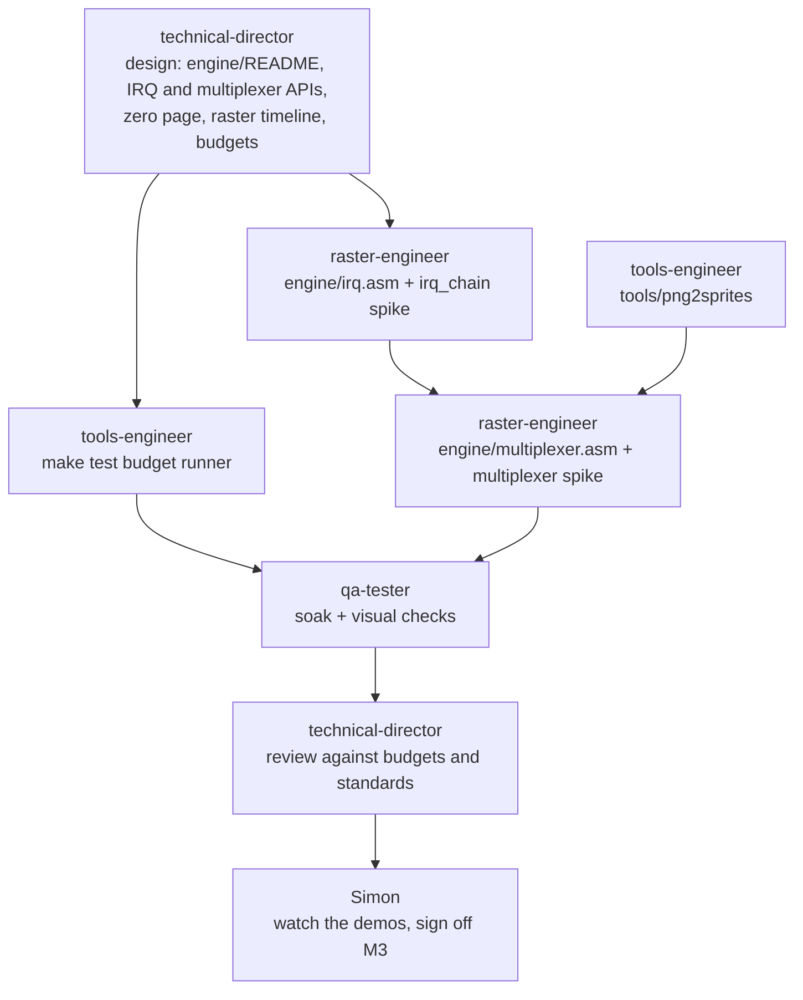

# M3: Engine basics

The first milestone the team builds rather than the producer. It produces the studio's first
reusable engine modules, and the automated test that proves they fit their cycle budgets.
Everything after this (the M4 training game onwards) is built on it.

**Done when:** each module has a spike demo in `tests/engine/`, and `make test` runs every demo's
cycle-budget checks in VICE and passes, with no human in the loop.

## Decisions (agreed with Simon, 2026-09-29)

| Question | Options | Decision |
|---|---|---|
| Multiplexer size for v1 | 16 / **24** / 32 virtual sprites | **24**: enough for a busy shooter, and leaves room to find the limits before v2 |
| More than 8 sprites on one row | Drop the lowest-priority ones / **flicker them in turn** | **Flicker**: nothing vanishes permanently, which is what players notice most |
| Who writes engine code | Gameplay engineer / **a new `raster-engineer` agent** | **New agent**: cycle-exact IRQ and multiplexer work needs a different mindset from game logic (it's in the plan's role list) |

## Deliverables

### 1. IRQ framework: `engine/irq.asm`

- Machine setup: `$01=$35`, CIA interrupts off, NMI pointed at an `rti`, raster IRQ on.
  This replaces the boilerplate every program currently copies from `hello`.
- A **raster chain** defined as a table of (line, handler) pairs. The framework does the vector and
  `$D012` switching, acknowledgement, and register save/restore, so handlers only contain their work.
- A **stable raster** option for handlers that need exact-cycle timing (double IRQ, per
  [raster-interrupts.md](../reference/raster-interrupts.md#jitter-and-stable-rasters)).
- Documented cost: framework overhead per handler, in cycles, measured.

**Acceptance:**
- Spike `tests/engine/irq_chain/`: 4 handlers changing the border colour at 4 lines, with a screenshot.
- Normal handlers start within the measured jitter (≤ 7 cycles). Stable handlers start on the
  **same cycle every time** over 100 frames (checked with `vice_run_until`, which reports the raster cycle).
- Budget checks in `make test`.

### 2. Sprite multiplexer v1: `engine/multiplexer.asm`

- 24 virtual sprites (x, y, colour, frame), sorted by Y each frame (insertion sort: the list
  stays nearly sorted between frames, so it's cheap).
- The IRQ chain reuses the 8 hardware sprites down the screen, assigning them in consecutive runs
  (sprite DMA is cheapest that way: [vic-ii-timing.md](../reference/vic-ii-timing.md#sprite-dma)).
- More than 8 on a row: rotate which ones are shown, so they flicker rather than vanish.
- Documented, measured cost per frame: the sort, the IRQs, and the DMA, against the frame budget.

**Acceptance:**
- Spike `tests/engine/multiplexer/`: 24 sprites bouncing around the screen, with screenshots.
- `qa-tester` soak test: 10,000 frames with no crash or jam, and no sprite missing for more
  than 2 consecutive frames when ≤ 8 are on a row.
- Worst-case frame cost measured and within the budget the Technical Director sets.

### 3. PNG → sprite converter: `tools/png2sprites/`

- A uv project. Converts a PNG sprite sheet to a `.bin` of 64-byte sprites, in hires and multicolour.
- **Validates** C64 rules and fails with the file, sprite and pixel position: 24×21 cells (12×21 in
  multicolour), C64 palette colours only, at most 3 colours plus transparent per multicolour sprite,
  with the two shared colours consistent across the sheet.
- Tests: a good sheet converts byte-for-byte to the expected output, and each bad sheet fails with the right message.

**Acceptance:** the multiplexer spike's sprites come from a PNG through this tool, wired into `make`.

### 4. Cycle-budget test runner: `make test`

- A Python runner (using `mcp/vice/vice_monitor.py`) that builds each spike in `tests/engine/`,
  runs it in VICE, measures the declared routines, and fails if any exceeds its budget.
- Budgets live next to each spike, e.g. `tests/engine/multiplexer/budget.json`:
  `{"routine": ["mux_sort", "mux_sort_end"], "max_cycles": 1800}`, written by the Technical Director.
- Output: one line per check (measured / budget / pass or fail) and a non-zero exit on failure.

## Who does what

`png2sprites` and the budget runner don't depend on engine code, so the tools-engineer can do
them in parallel with the IRQ work.

## Running it

Each step is a prompt to the named agent in a fresh session. The producer (main session)
reviews each report against the definition of done before starting the next step.

1. *"technical-director: design the M3 engine per docs/milestones/M3-engine-basics.md. Write
   engine/README.md with the IRQ framework and multiplexer APIs, zero-page needs, raster timeline
   and budget.json files. Don't write the implementation."*
2. *"tools-engineer: build tools/png2sprites per the M3 brief."*
3. *"raster-engineer: M3 stage 1: implement engine/irq.asm and the irq_chain spike per
   engine/README.md and the build rules in the M3 brief."* In parallel:
   *"tools-engineer: build the `make test` budget runner per engine/README.md#budget-files."*
4. Stages 2–4 by the raster-engineer, one prompt each; then QA, the Technical Director's review, and sign-off.

**Parallel sessions:** agents working at the same time must touch different files, and commit only
their own paths (`git add <their files>`, never `git add -A`). If that gets awkward, use git worktrees,
as the plan describes.

## Build rules (from the producer's design review, 2026-09-29)

The design in [engine/README.md](../../engine/README.md) is approved. These rules apply to building it.

1. **Build the engine in four stages.** Each stage ends with its `budget.json` checks passing
   and a report, before the next starts:

   | Stage | Scope | Checks that must pass |
   |---|---|---|
   | 1 | `engine/irq.asm` and the `irq_chain` spike | All of `tests/engine/irq_chain/budget.json` |
   | 2 | Multiplexer: sort, schedule, zone IRQs, double buffer. **No flicker or pinning yet**: the spike keeps ≤ 8 sprites per window. Also: measure `irq_rearm` (rule 6) | Costs, `irq_late_count`, `mux_late_count`, and all of `irq_chain/budget.json` still |
   | 3 | Add fair flicker; the spike overloads rows | Plus `mux_max_age` (pinning off) |
   | 4 | Add pinning; the spike runs as the design describes | The full `tests/engine/multiplexer/budget.json` |

2. **Measurements beat acceptance limits.** If correctly written code measures outside a
   limit that was an estimate or an unmeasured assumption, **report it and don't bend the code
   to fit.** The Technical Director re-baselines the limit with a probe. In particular, the
   normal-handler jitter limit of 7 cycles comes from an unmeasured figure in
   `raster-interrupts.md`, and 8 is possible. The stable-handler requirement (the same cycle
   every frame) is not negotiable.

3. **The multiplexer's cost must earn its place.** The design leaves about 7,200 cycles (37% of a frame)
   for the game. If the measured `mux_update` is well above **3,000 cycles** in normal frames,
   the Technical Director looks for a fast path before M3 closes, e.g. skipping flicker and eviction
   logic in frames where no window has more than 8 sprites (most frames). The worst case may stay
   expensive. The common case must be cheap.

4. **`make test` comes early.** The tools-engineer builds the budget runner in parallel with stage 1,
   so every stage is checked by the runner rather than by hand.

5. **Framework budgets are locks** (Technical Director, after stage 1). The `irq_chain`
   budgets equal the measured figures (irq_exit 60, dispatch 17, stable extra 106, handler
   start cycles 41 / 33 / 6 / 33, 508 IRQ cycles a frame), with no headroom: the paths are
   straight-line code in a DMA-free layout, so any change is a regression or a deliberate
   re-baseline, never noise. A change to `engine/irq.asm` that moves one of them is reported with
   the new figure; the Technical Director re-baselines. If the runner reads a figure one cycle off
   `measure.py`, that's a runner bug to find, not a budget to loosen.

6. **DMA inside an IRQ is latency, not cost** ([engine/README.md](../../engine/README.md#dma-inside-an-irq)).
   Only spikes that lock framework costs must keep badlines and sprite DMA out of each entry's
   span (trigger line and, for small handlers, the next line: why `irq_chain` uses $69 and $B1).
   Games and the multiplexer budget raster spans, DMA included. Stage 2 must:
   - Add an `IrqRearm` entry to the `irq_chain` spike on DMA-free lines and report
     `irq_rearm` → `irq_exit_rti` (41 *counted*, including the 6-cycle restore; earlier docs said
     35). The Technical Director then adds its locked check to `irq_chain/budget.json`.
   - Treat `MUX_IRQ_LINES` = 1 as at risk: a zone IRQ triggered on a badline starts its handler
     43 cycles later (81 with sprites 0–7), i.e. on the next line. `mux_late_count` = 0 in the
     spike is the test; raise the constant if it fails.
   - Report the last zone IRQ's end line relative to its slot's Y, so the fixed-entry spacing
     (`MUX_Y_MAX + 2`, or + 3 in the badline region) can be confirmed or corrected.

## Out of scope for M3

Music player integration, scrolling, loaders and cartridge formats, and NTSC. They come later, as
engine modules of their own.
