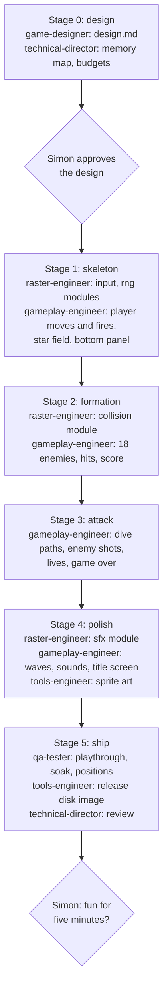

# M4: Training game

The studio's first complete game: small, single-screen, Galaga-style. The game itself is not the
point. M4 is the first time the team builds a whole game, so its job is to find what's missing or
broken before a real title (M5) depends on it.

**Done when:** the game plays from title screen to game over; `make test` passes, including the
game's own budgets; QA's scripted play and soak pass in both builds; a release build boots from a
disk image; and Simon finds it fun for five minutes.

## What M4 is testing

| What we're trying out | Why it matters |
|---|---|
| The engine under real use | The IRQ framework and multiplexer have only run in spikes. A game moves sprites unpredictably |
| The frame budget | The engine leaves about 7,200 cycles a frame. Does real game logic fit? |
| Roles we haven't used | The gameplay-engineer has never run. Nobody has written a design doc, a per-game memory map or a raster timeline |
| What a game needs that the engine lacks | Joystick input, collisions, a score display, sound effects, title and game-over screens, sprite animation, random numbers |
| The art and sound pipeline | Real sprites through `png2sprites`, with Simon as art director |
| QA on a game | Scripted joystick play, soak tests, and "is it fun?" |
| Shipping | A crunched release build on a bootable disk image |

## Decisions

| Question | Decision |
|---|---|
| Kind of game | Galaga-style, single screen (Simon, 2026-10-01). Breakout was considered and rejected as too static: it wouldn't exercise the multiplexer |
| Formation | **All sprites, a smaller formation** (Simon, 2026-10-01): the parked formation is drawn with sprites, not characters. Simpler, and it tests the multiplexer harder |
| Working title | **Swarm** (Simon, 2026-10-01). The game lives in `games/swarm/` |
| Who designs the waves and attack patterns | A new **`game-designer`** agent (Simon, 2026-10-01) |
| Art | **Placeholder sprites generated by the team**, which Simon reviews and directs. The PNGs can be replaced later without code changes (Simon, 2026-10-01) |
| Sound | **Sound effects only** (Simon, 2026-10-01). There's no music player yet |

### Stage 0 gate: design approved (Simon, 2026-10-01)

Simon approved [docs/games/swarm/design.md](../games/swarm/design.md) and the designer's recommended
answers to its seven open questions:

| # | Question | Decision |
|---|---|---|
| 1 | What to pin besides the player | The 3 enemy shots (a small lethal bullet that flickers is an unfair death) |
| 2 | Panel height | One text row |
| 3 | Formation row spacing | 40 lines. Try 32 in stage 3 if dives feel cramped |
| 4 | Extra lives | None for M4. Add one at 10,000 points if five minutes feels short |
| 5 | Star field | Twinkle only, no drift yet |
| 6 | Enemy fly-in | None: enemies appear in place |
| 7 | Sprite mode | Hires, all sprites the same mode |

Noted, not required: divers leaving through the bottom of the screen would need sprites to pass
behind the panel, which multiplexer v1 can't do. A candidate for v2.

### Stage 0 result: technical design (Technical Director, 2026-10-01)

**The design fits, with one change.** [docs/games/swarm/memory-map.md](../games/swarm/memory-map.md)
budgets game logic and sound at 6,300 raster cycles a frame against the engine's 7,200: 900 of headroom
(12.5%). All game figures are estimates until each stage measures them. No repeated frames are expected,
and none of v1's four safety conditions is broken. Contracts for the four new engine modules are in
`engine/input.md`, `engine/rng.md`, `engine/collision.md` and `engine/sfx.md`; the game's 25 budget
checks are in `tests/games/swarm/budget.json`.

| Question | Decision |
|---|---|
| Panel colours: the design's "white text on a blue bar" can't be done with reverse video (the text comes out black) | **Extended colour mode for the whole screen** (Simon, 2026-10-01): white on blue as designed, at the cost of 64 glyphs for the whole screen. Probe: `tests/timing/ecm_panel` |

**Closed before stage 1** (2026-10-02):

| Task | Result |
|---|---|
| Design doc updated for the panel decision | Done (54cd7bb, cc3afa0). The game needs 35 of the 64 glyphs. Also settled: stars kept out of every text cell, a proposed colour table for the placeholder art (Simon reviews it in the first playable build), exact hit boxes and art areas, and the rule that enemy sprites keep row 20 empty |
| `engine/README.md` corrected | Done (c6b1a25). The tightest margin is 3 cycles (DEBUG, mixed multicolour), measured. Swarm uses the uniform blocks: 17 cycles in DEBUG, 39 in release. The build-time size guard is described, with what it does and doesn't catch |

**Still open:** extended colour mode with the multiplexer is unmeasured. QA's write-timing run on the game
(F3) covers it, at stage 5 or earlier.

### Stage 1 result: first playable build (2026-10-02)

Play it with `make run GAME=swarm` (joystick port 2). The ship, two player shots, the star field and
the panel are in. `make test` passes 65/65 with 15 Swarm checks pending for later stages.

| Part | Result |
|---|---|
| `engine/input.asm`, `engine/rng.asm` | Built to their contracts and locked: 28 and 30 cycles (profile span). The rng distribution limit was re-baselined from a model (`tests/engine/rng/limits_model.py`) |
| Placeholder sprites | 13 shapes, script-generated, with a checker for the design's art rules (`games/swarm/art/`) |
| Game skeleton (`games/swarm/src/`) | All game logic takes at most 580 raster cycles against 5,800. `tests/games/swarm/check.py` (16 joystick-driven cases) passes in DEBUG and release |

**Found in stage 1, to settle before stage 2:**

| Item | Owner |
|---|---|
| After editing `games/swarm/src/`, `make test` can measure a stale budget build: the Makefile only watches `SRC_DIR` and `engine/` (workaround: `touch tests/games/swarm/main.asm`). Also the budget build needed a symlink to the game's sprite sheet | tools-engineer |
| Holding fire gives 4.77 shots a second, not the design's "steady 5": a missed shot lives 21 frames, so the two slots limit the rate, not the 10-frame cooldown. Plus cases the design left silent (left and right together, the start position, the order of updates, wave counters) | game-designer, with Simon's playtest view |
| The memory map's main-loop pseudo-code, `panel_update` over budget when all four fields redraw (init and game over only), AUTOPLAY's panel load, the KickAssembler multi-label trap, the rng contract's stale lines and interim checks, and a one-page "what a game needs from the engine" | technical-director |

**Process notes so far** (rule 4): the reading list for a new game engineer is about 4,000 lines; `make test`
can't drive the joystick, so the key input checks live in scripts outside it; statistical limits
should be tried on a model before going into a contract; a design model settles questions prose leaves open.

## The game (scope for M4)

**In:**
- Player ship at the bottom: left and right, fire. Joystick in port 2.
- A formation of **18 enemies, 3 rows of 6**, drifting side to side.
- Enemies peel off and dive along paths defined as data, firing as they go, then return or wrap.
- Three wave patterns, then they repeat faster.
- 3 lives, a score, and a session high score.
- Title screen, game over, and back to the title.
- Sound effects: shot, explosion, dive, player hit.
- A star field drawn with characters, and a status panel (score, lives) at the **bottom** of the screen.
- PAL. A release build on a bootable `.d64`.

**Out:** music, scrolling, bosses and capture beams, two players, saved high scores, NTSC, a
character-drawn formation, real-hardware testing.

## Engine constraints the design must respect

From M3 ([engine/README.md](../../engine/README.md), "v1 limits" and "Slot write deadline"):

- **24 virtual sprites in total**, at most **4 pinned** (never flicker). A first split for the
  Technical Director to confirm: player 1, player shots 2, enemies 18, enemy shots 3. Explosions reuse
  the slot of the enemy that died.
- **At most 8 sprites within any 24-line window** shows without flicker (39 lines for back-to-back
  full rows). Three rows of 6 are only all shown from **31 lines apart** by the README's scheduling
  rule (an earlier draft of this brief said 24, which was wrong; the designer caught it). The design
  uses 40, so each row's window holds only its own 6. Divers passing through a row will cause some
  flicker: that's expected, and it's what we want to see in real use.
- **The status panel can only be at the bottom** (v1 has no top panel or mid-screen splits): no sprite
  below `MUX_Y_MAX`, with the panel starting 22 lines after it.
- **The main loop never disables interrupts** while the multiplexer runs. No `sei` in game code.
- Vertical scroll (`YSCROLL`) stays constant. No expanded sprites.
- The zone IRQ code and the scheduling constants are frozen.
- About **7,200 cycles a frame** for all game logic and sound, in normal frames.

## Deliverables

| # | Deliverable | Owner | Acceptance |
|---|---|---|---|
| 1 | Game design: `docs/games/swarm/design.md` (rules, scoring, the three waves, dive paths as data tables, difficulty curve, what "fun" should feel like) | game-designer | Simon approves it before stage 1 |
| 2 | Technical design: `docs/games/swarm/memory-map.md` from the template (memory layout, zero page, raster timeline, sprite allocation, per-subsystem cycle budgets) and the game's `budget.json` | technical-director | Budgets add up to ≤ 7,200 a frame with headroom stated |
| 3 | New engine modules, each with a spike and budget checks as in M3: `engine/input.asm` (joystick), `engine/collision.asm` (sprite against sprite, bounding boxes), `engine/sfx.asm` (SID sound effects), `engine/rng.asm` | raster-engineer | `make test` covers each; measured costs in the README |
| 4 | The game: `games/swarm/src/` (states, player, formation, divers, shots, scoring, panel, star field) | gameplay-engineer | Plays as designed; game budgets pass; follows the coding standards |
| 5 | Art: sprite sheets as PNGs in `games/swarm/src/`, built through `png2sprites` | tools-engineer (placeholders), Simon directs | Converts cleanly; Simon approves the look |
| 6 | QA: a scripted playthrough and a soak with varied joystick input under `tests/games/swarm/`; `positions.py` and `--slack` run on the game itself, ≥ 10,000 frames, DEBUG and release (measurement F3 from M3) | qa-tester | No crash, jam or corruption; bug reports with steps and screenshots |
| 7 | Release: `make BUILD=release`, crunched, on a `.d64` that boots with `LOAD"*",8,1` | tools-engineer | QA boots it from the disk image |

## Stages

Each stage ends with a build Simon can play (`make run GAME=swarm`). His view of how it feels
steers the next stage: that's the point of a training game.

Simon plays the build at the end of every stage, not only at the two gates.

## Rules

The M3 build rules still apply: measurements beat estimates, agents report a gap and never move a
target, budgets are raster time, and scripts behind any figure live in the repo. In addition:

1. **One stage at a time,** each ending with `make test` passing and a playable build.
2. **Engine code is the raster-engineer's; game code is the gameplay-engineer's.** If the game needs
   something from the engine, the gameplay-engineer reports it, and the producer assigns it.
3. **The design doc is the source of truth for behaviour.** If playing shows something should change,
   the design doc changes first.
4. **Every stage's report says what was learned about the process,** not only what was built: what
   was missing, slow or confusing. Those notes drive the fixes to docs and agent prompts at the end.

## Carried in from M3

- Measurements F1, F2 and F4 (uniform and flicker hunts, the build-time guard on the zone code) are
  in progress and due before the game's sprite code is accepted.
- F3 is deliverable 6 above.
- Multiplexer v2 is due before M5, not M4. The game uses v1.
