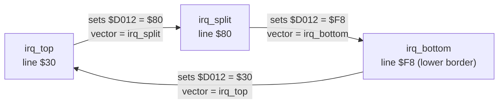

# Raster interrupts

A raster interrupt fires when the VIC-II reaches a chosen raster line. Chaining them (each
handler sets up the next) is how a game splits the screen, multiplexes sprites and runs
code at fixed points in the frame.

Working example in this repo: [games/hello/src/main.asm](../../games/hello/src/main.asm)
(two chained IRQs, KERNAL banked out).

## Registers

| Register | Use |
|---|---|
| `$D012` | Write: compare line bits 0–7. Read: current raster line bits 0–7 |
| `$D011` bit 7 | Write: compare line bit 8. Read: current line bit 8. **Any write to `$D011` also sets the compare bit 8.** Preserve it (`lda $d011 / and #$7f` or `ora #$80`), or you'll move your IRQ to line 256+ by accident |
| `$D01A` bit 0 | Enable the raster interrupt |
| `$D019` bit 0 | Raster interrupt latched. **Acknowledge by writing 1 to it** (`asl $d019` or `lda #$01 / sta $d019`). If you don't, the IRQ fires again as soon as the handler returns, forever |
| `$DC0D` | CIA 1 interrupt control. Write `$7F` to stop its timer IRQ (the KERNAL's 60 Hz keyboard/clock IRQ), then read it once to clear anything pending |
| `$DD0D` | CIA 2 (NMI source). Same treatment if you don't use it |

## Two ways to set it up

| | KERNAL in (`$01`=`$37`/`$36`) | KERNAL out (`$01`=`$35`), **studio default** |
|---|---|---|
| Vector | `$0314/$0315` | `$FFFE/$FFFF` |
| Registers | Already saved by the KERNAL before it jumps via `$0314` | Your handler must save and restore A, X, Y |
| Exit | `jmp $ea81` (restore and RTI), or `jmp $ea31` to also run the KERNAL's keyboard scan and clock | `rti` |
| Overhead before your code | The CPU's 7-cycle interrupt sequence plus the KERNAL's dispatch code | The 7-cycle interrupt sequence only |
| NMI | KERNAL handles RESTORE | Point `$FFFA/$FFFB` at an `rti` |

The KERNAL route is simpler but slower and less predictable. Use the KERNAL-out route for
anything timing-sensitive. The shape of a setup, KERNAL out:

```
        sei
        lda #$7f
        sta $dc0d               // stop CIA 1 timer IRQs
        sta $dd0d               // and CIA 2 NMIs
        lda $dc0d               // clear pending
        lda $dd0d
        lda #$35
        sta $01                 // BASIC and KERNAL out, I/O in
        lda #<nmi_rti
        sta $fffa
        lda #>nmi_rti
        sta $fffb
        lda #<irq_top
        sta $fffe
        lda #>irq_top
        sta $ffff
        lda #LINE_TOP
        sta $d012
        lda $d011
        and #$7f                // compare line bit 8 = 0
        sta $d011
        lda #$01
        sta $d01a               // raster IRQ on
        asl $d019               // acknowledge anything pending
        cli
```

## Chaining

Each handler does its work, points the vector and `$D012` at the next handler, acknowledges,
and returns. The last one points back at the first, so the chain repeats every frame:



Rules for chains in this studio:

- **Only the engine's IRQ framework writes** `$FFFE/$FFFF`, `$FFFA/$FFFB`, `$D012`, `$D019`,
  `$D01A` and `$D011` bit 7. Game code declares a chain entry, so two pieces of code never fight
  over the chain (see [coding standards](../standards/coding-standards.md#irq-ownership) and the
  framework's API in [engine/README.md](../../engine/README.md#irq-framework-engineirqasm)).
- Every game documents its chain as a **raster timeline**: which line each handler starts on, what it does,
  and its measured worst-case cost (`vice_profile`). A handler must finish before the next
  one's line, allowing for badlines and sprite DMA in between ([vic-ii-timing.md](vic-ii-timing.md)).
- Put heavy work (music, sorting, game logic) in the lower-border handler, where there are no badlines.

## Jitter and stable rasters

The CPU only takes an interrupt **after finishing its current instruction**, then spends
7 cycles on the interrupt sequence. So the handler starts a variable number of cycles into the
line: 0 to about 7 cycles of jitter, depending on what was executing.

- **Measured:** with a `jmp *` main loop, `hello`'s two IRQs (48 lines apart = 3,024 cycles)
  arrived 3,023–3,026 cycles apart: 3 cycles of jitter.
- **Measured (worst case)** with the `irq_chain` spike ([tests/engine/irq_chain](../../tests/engine/irq_chain/main.asm),
  `measure.py`, 1,000 frames × 4 IRQs): a main loop of `inc abs,x`, `asl zp`, `bit zp`, `inx`
  and taken branches straight before each `inc abs,x` gives **0–7 cycles** of jitter, all 8
  values seen on every line. The interrupt sequence starts on **cycle 2** of the trigger line
  at the earliest (VICE `CYC`), so with `engine/irq.asm` a handler starts on cycle 26–33.
- The main loop's phase at an IRQ isn't random: the IRQs' own lengths feed back into it. A
  fixed 25-cycle loop hit only 5 phases in 1,000 frames. To see the worst case, vary the loop's
  length (the spike uses an LFSR branch).
- **Measured:** a stable raster with the engine's double IRQ starts on the same cycle in
  1,000 of 1,000 frames (`IRQ_STABLE_CYCLE` = 6, [engine/README.md](../../engine/README.md#stable-handlers)).
- Jitter is fine for most splits if the change happens in the border (e.g. border and background
  colours changed while the beam is off-screen), or if a few pixels of wobble at the split don't show.
- It's **not** fine for effects that need an exact cycle: colour changes mid-line, opening the
  side borders, FLI, VSP. Those need a **stable raster**: the classic technique is a *double IRQ*.
  The first IRQ sets up a second one on the next line, then runs 2-cycle `NOP`s, so the second IRQ
  arrives with at most 1 cycle of jitter. A final `$D012` compare, placed so that it reads
  across the line change, removes that last cycle.

Stable-raster code is subtle. The engine will provide one verified implementation. Don't
hand-roll another, and always prove timing with `vice_profile` and `vice_run_until` (which reports
the raster line and cycle).

## Unmeasured facts the engine depends on

The M3 engine design ([engine/README.md](../../engine/README.md#estimates-to-measure-in-m3))
relies on these. They're *unmeasured* here until a probe in `tests/timing/` shows them:

- ~~On which cycle of its line the raster IRQ is raised~~ **Measured** for lines 32, 105, 175
  and 250 (above): the interrupt sequence starts on cycle 2 at the earliest. Line 0 (commonly
  said to be one cycle later) is still unmeasured.
- Whether writing `$D012` with the line the raster is already on raises the IRQ at once.
  The framework's late check is written to be correct either way.
- Whether a taken branch that doesn't cross a page delays the IRQ by one more instruction
  (the 6502's "branch doesn't poll" quirk), which could push jitter past 7. **Partly measured:**
  the `irq_chain` loop has taken branches straight before 7-cycle `inc abs,x`, and jitter never
  exceeded 7 in 4,000 IRQs in x64sc. Whether that's because VICE doesn't show the quirk, or the
  phase never lined up, isn't known.

## Common bugs

| Symptom | Likely cause |
|---|---|
| Machine locks up and the screen flickers or freezes | IRQ not acknowledged (`$D019`), so it retriggers forever |
| IRQ never fires | Compare bit 8 accidentally set by a `$D011` write, or `$D01A` not enabled, or the `I` flag still set |
| IRQ fires at the wrong times or twice | CIA 1 timer IRQ still enabled, or a pending CIA IRQ not cleared |
| Crash when RESTORE is pressed | NMI vector not set with the KERNAL out |
| Registers corrupted in the main loop | KERNAL-out handler didn't save and restore A, X, Y |
| Split wobbles by a few pixels | Normal IRQ jitter; move the change into the border or use a stable raster |
