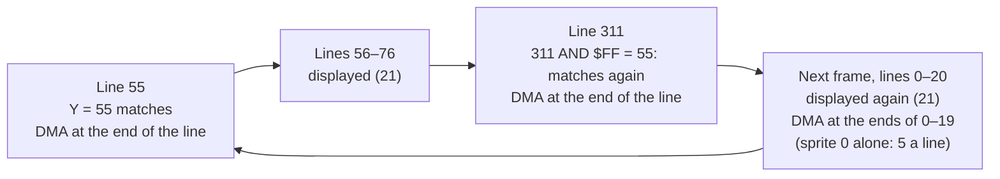
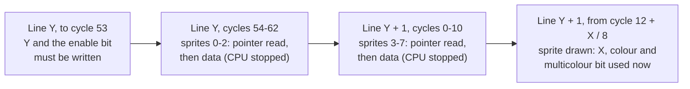
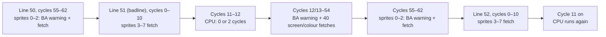

# VIC-II timing

How much CPU time a frame really has, and where the VIC-II takes it away. Every figure below is
marked either **measured**, with the probe that shows it, or *unmeasured*, meaning it's the
standard figure but nobody here has verified it. Measurements were made in VICE 3.10 (x64sc,
PAL) on 2026-09-29. Each probe's header comment has the exact steps to rerun it and the results
it gave:

| Probe | Measures |
|---|---|
| [tests/timing/rasterline](../../tests/timing/rasterline/main.asm) | Cycles per line and per frame, with a CIA timer |
| [tests/timing/badline](../../tests/timing/badline/main.asm) | Badline steal on a free-running `NOP` stream |
| [tests/timing/badline_writes](../../tests/timing/badline_writes/main.asm) | Badline steal while the CPU runs write cycles (`INC abs`, `JSR`) |
| [tests/timing/sprites](../../tests/timing/sprites/main.asm) | Sprite DMA per line; sprites and a badline on the same line |
| [tests/timing/sprites/trace_badline.py](../../tests/timing/sprites/trace_badline.py) | Instruction trace: which cycles of the badline the CPU actually gets |
| [tests/timing/sprite_wrap](../../tests/timing/sprite_wrap/main.asm) + [sweep.py](../../tests/timing/sprite_wrap/sweep.py) | Sprite DMA and display line by line: first/last line, Y expansion, the Y wrap across line 311 → 0 (2026-09-30) |
| [tests/timing/sprite_latch](../../tests/timing/sprite_latch/main.asm) + [sweep.py](../../tests/timing/sprite_latch/sweep.py) | The last cycle at which a write to each sprite register still shows on the sprite's first line, and the first at which a hardware sprite can be rewritten (2026-10-01) |

If you rely on a figure marked *unmeasured*, measure it before you build on it.

## Frame geometry

| | PAL (6569), **our target** | NTSC (6567R8) | Old NTSC (6567R56A) |
|---|---|---|---|
| Raster lines per frame | **312** (0–311), measured | 263, *unmeasured* | 262, *unmeasured* |
| CPU cycles per line | **63**, measured | 65, *unmeasured* | 64, *unmeasured* |
| CPU cycles per frame | **19,656**, measured | 17,095, *unmeasured* | 16,768, *unmeasured* |
| CPU clock | 985,248 Hz, *unmeasured* | 1,022,727 Hz, *unmeasured* | 1,022,727 Hz, *unmeasured* |
| Frames per second | 50.125 (clock ÷ 19,656), *unmeasured* | 59.826, *unmeasured* | 60.99, *unmeasured* |

- **Measured (tests/timing/rasterline):** CIA1 timer A, which counts every clock cycle whether
  or not the VIC-II has the bus, gave 12,598 cycles for 200 raster lines (200 × 63 = 12,600)
  and 19,655 for one frame (312 × 63 = 19,656). The −2/−1 is a constant from the CIA's start/stop
  latency and the poll phase. All 8 samples were identical. At 64 or 65 cycles per line the
  200-line result would have been 12,800 or 13,000.
- `vice_profile` assumes 63 cycles and 312 lines when it turns raster positions into cycles, so
  it can't measure these two figures itself. The CIA measurement above is what justifies it.
- Raster lines 256 and up need bit 8, which is `$D011` bit 7 (read: bit 8 of the current line;
  write: bit 8 of the compare line). *Unmeasured* as a stand-alone fact, but every probe's
  `WaitFrameStart` relies on reading it and they all synchronise correctly.
- The 320×200 display window with 25 rows (`RSEL`=1, `$D011` bit 3) and the default
  `YSCROLL`=3 covers raster lines 51–250 ($33–$FA). With 24 rows (`RSEL`=0) it's 55–246. *Unmeasured.*
- Sprite Y coordinates are raster lines: a sprite at Y is displayed on lines Y+1 to Y+21,
  provided Y was written by cycle 53 of line Y ([write deadlines](#sprite-register-write-deadlines)).
  **Measured (tests/timing/sprite_wrap):** its first DMA is at the end of line Y, and it shows on
  Y+1 onward (Y=56: DMA 56–76, shown 57–77). So Y=50 starts on line 51, the first text row
  (badline $33, measured).
- VICE renders raster lines 16–287. In a `vice_screenshot` "full" image, buffer row = raster line
  − 1 (text row 0, raster 51, is row 50). **Measured** with a reference character in text row 0
  (tests/timing/sprite_wrap/sweep.py).
- VICE's normal PAL frame is 384×272: 32 px of side border and 36 lines of top and bottom border
  around the 320×200 window. This is what `vice_screenshot` returns by default. Checked pixel for
  pixel against `x64sc -exitscreenshot` (see `BORDER_LEFT` in `mcp/vice/server.py`).

## Badlines

On a badline the VIC-II fetches the next text row's 40 screen codes and colours and holds
the CPU off the bus to do it.

**When:** a raster line is a badline if all of these are true (*unmeasured* as rules, but the
probes find badlines exactly where they predict: $33, $3B and $43 with `YSCROLL`=3):

1. It's in the range $30–$F7 (48–247).
2. Its low 3 bits equal `YSCROLL` (`$D011` bits 0–2).
3. `DEN` (`$D011` bit 4, display enable) was set at some point during line $30.

That gives one badline per text row: 25 per frame with the default settings.

**Cost:** 40 cycles of fetches, plus 3 cycles of warning beforehand. The VIC-II pulls BA low
3 cycles early, and the CPU stops at its next read cycle, so write cycles in progress keep running.

| CPU is running… | **Measured** cycles stolen | Probe |
|---|---|---|
| Reads only (`NOP` stream) | **43**, every pass | tests/timing/badline; tests/timing/badline_writes `nop_bl` |
| `INC abs` stream (2 consecutive writes per 6 cycles) | **41–43**, depending on phase (avg 42.3 over 128 passes) | tests/timing/badline_writes `inc_bl` |
| `JSR`/`RTS` stream (2 consecutive writes per 12 cycles) | **41–43**, depending on phase (avg 42.8 over 128 passes) | tests/timing/badline_writes `jsr_bl` |
| 3 consecutive writes (`BRK`, IRQ/NMI entry) | 40 expected, *unmeasured* | |

- **Measured: the CPU gets 20 of the badline's 63 cycles** with no sprites (63 − 43). The
  instruction trace confirms it directly: 20 CPU cycles executed on line 51 in 32 of 32 passes.
- **Measured (trace, VICE cycle numbering):** the CPU is halted for 43 consecutive cycles,
  from cycle 12 or 13 of the badline (depending on how instructions line up) to cycle 54 or 55.
  It runs in cycles 0–11 and 55/56–62.
- The worst case is 43, and the only way to get less is to be in the middle of write cycles, so
  budget 43. The write cases only matter for cycle-exact code that crosses a badline.
- Per frame: 25 × 43 = **1,075 cycles** (5.5% of a PAL frame) with the screen on, worked out
  from the measured 43.

**Levers:**

- Clearing `DEN` removes badlines, but only from the next frame, because the bit is sampled
  during line $30. Recorded earlier as measured (clearing it mid-frame left that frame's badlines
  in place), but the steps weren't written down. *Rerun this to confirm* before depending on it.
- Changing `YSCROLL` moves badlines. Repeatedly pushing them away is the basis of FLD, and
  forcing them is the basis of FLI and similar tricks. *Unmeasured.*
- The border lines (below 48 and above 247) never have badlines. They're the cheapest place
  for heavy per-frame work such as music, sorting and game logic. **Measured:** the probes'
  control blocks on line 16 run at exactly their CPU cycle count.

## Sprite DMA

A sprite whose DMA is active on a line costs CPU time on that line. That's every line it's
displayed on, whether or not the line is under the border. **Measured:** sprites on lines 17–37,
all in the top border, cost exactly what the table below says (tests/timing/sprites `spr_blk`).
**Measured (tests/timing/sprite_wrap):** a sprite has **21** DMA lines, or **42** if Y-expanded
(`$D017`), from the end of line Y to the end of line Y+20 (Y+41). The sprite shows on the line after each fetch.

The VIC-II fetches sprites in order 0→7: sprites 0–2 at the end of a raster line and 3–7 at the
start of the next. **Measured (trace):** sprites 0–2 halt the CPU at the end of the line (it
resumes at cycle 0 or 1), and sprites 3–7 until cycle 10 of the next line. Each active sprite costs **2 cycles**, and each *group* of consecutive fetches
costs **3 more** for the BA warning. The VIC-II keeps the bus across a gap of one unused
sprite (so 0 and 2 behave like 0, 1, 2), but a gap of two or more starts a new group.

All figures below are **measured with tests/timing/sprites** (`spr_blk`, max − 40 over 96
passes, in the border so no badline is involved):

| Sprites active on the line | Cycles stolen |
|---|---|
| 0 | **5** |
| 0, 1 | **7** |
| 0, 2 | **9** (gap bridged: counts as 0–2) |
| 0, 3 | **10** (two groups: 5 + 5) |
| 3–7 | **13** (5 × 2 + 3) |
| 0–7 | **19** (8 × 2 + 3) |

- **Measured (trace):** with sprites 0–7 the CPU is halted from cycle 55 of one line to cycle 10
  of the next (19 cycles), so a non-badline with 8 sprites leaves the CPU **44** cycles (11–54).
- **Measured:** a 126-cycle window through sprite lines costs 126 + 3 × the per-line figure
  (sprite 0: 136, sprites 0–7: 183). DMA adds up linearly from line to line.

**Implications:**

- Assign sprite numbers in **consecutive runs** (e.g. a multiplexer fills 0, 1, 2… in order), never
  scattered.
- A band of 8 sprites costs 21 × 19 = **399** cycles per frame (both factors measured). A
  32-sprite multiplexer (4 bands) costs about 1,600 cycles in DMA alone, before any multiplexer
  code runs.

### Sprite Y and the frame wrap

**Measured (tests/timing/sprite_wrap, VICE 3.10 x64sc PAL, 2026-09-30):** the VIC-II compares a
sprite's Y register with **raster bits 0–7 only**. On PAL (lines 0–311) a sprite with
**Y ≤ 55** (311 − 256) therefore matches **twice** a frame: on line Y, and again on line
256 + Y. Each match starts a full sprite: DMA at the end of the matching line and the 20 after
it, display on the 21 lines after the match (42 when Y-expanded). The second one runs across the
311 → 0 wrap into the top of the next frame, up to line Y − 35 when Y ≥ 35 (line 20 for Y = 55).
At **Y ≥ 56** the second match would be on line 312 or later, which PAL doesn't have, so there's
only one display.

| Sprite 0 at | First display (DMA lines) | Second display (DMA lines) |
|---|---|---|
| Y = 0 | 1–21 (0–20) | 257–277 (256–276) |
| Y = 10 | 11–31 (10–30) | 267–287 (266–286) |
| Y = 35 | 36–56 (35–55) | 292–311 and 0 of the next frame (291–311) |
| **Y = 55** | 56–76 (55–75) | **0–20** of the next frame (311, 0–19) |
| **Y = 56** | 57–77 (56–76) | **none** (no DMA on lines 256–311 or 0–55) |
| Y = 55, Y-expanded | 56–97 (55–96: 42 lines) | 0–41 of the next frame (311, 0–40: 42 lines) |

- **DMA lines are measured for every line** in 0–100 and 256–311, 32 passes each (the probe's
  32 start phases), with the screen off so no badline interferes. The block started on line L
  measures exactly the DMA that feeds display line L + 1; see the probe's header.
- **Display lines are measured from VICE's frame buffer** (screen on, top/bottom border open)
  where VICE renders them, lines 16–287. On every rendered, probed line they are the DMA lines
  + 1, in all six configurations. Lines 0–15 aren't rendered, so the Y = 55 tail shows as lines
  16–20 there; its lines 0–15 are known from their DMA.
- **The wrapped lines cost the same DMA as any sprite line**, with the screen on or off: sprite 0
  alone **5** cycles a line, sprites 0–7 all at Y = 55 **19** a line on lines 311 and 0–19, every
  pass (the figures in [Sprite DMA](#sprite-dma)). A full band of 8 ghosts costs 21 × 19 = **399**
  cycles, spent on lines 311 and 0–19 of the next frame. This probe opens the top/bottom border;
  with it closed the DMA is the same (the `multiplexer` spike, below).



Rerun (the probe's header has the details):

```
make GAME=sprite_wrap SRC_DIR=tests/timing/sprite_wrap
cd mcp/vice && uv run python ../../tests/timing/sprite_wrap/sweep.py      # ~80 s, all configurations
```

By hand, one line: `vice_start build/sprite_wrap/sprite_wrap.prg` runs the default configuration
(sprite 0 at Y = 55, probe on line 311). `vice_profile wrap_blk_hi wrap_blk_hi_end` then gives
**67** (62 + 5) every pass. With `vice_write_memory spr_y 38` (Y = 56) it gives **62**, no DMA.
Screenshots, top/bottom border open, yellow bar = text row 0 (raster 51):

- [screenshots/sprite-wrap-y55-y10-y30-y56-border-open-full.png](../../screenshots/sprite-wrap-y55-y10-y30-y56-border-open-full.png):
  white Y = 55 (tail at the top, 16–20), yellow Y = 10 (again at the bottom, 267–287), green
  Y = 30 (its second display starts on 287, the last rendered line), pink Y = 56 (no second display).
- [screenshots/sprite-wrap-y55-yexpanded-vs-y56-border-open-full.png](../../screenshots/sprite-wrap-y55-yexpanded-vs-y56-border-open-full.png):
  Y = 55 Y-expanded (tail on 16–41) against Y = 56.

**Also seen in the engine** (M3 stage 3.5, 2026-09-30, [engine/README.md#wrap-ghosts](../../engine/README.md#wrap-ghosts)):
in `tests/engine/multiplexer_ghost` (border open), sprites the multiplexer left enabled at Y
48–55 showed their tails at the top of the next frame
(`screenshots/multiplexer-ghost-before-phase0.png`), and its IRQ on line 16 took 419–422 raster
cycles instead of 378/381, the ghosts' DMA on lines 16–20. In the `multiplexer` spike (normal
borders) the same DMA made the five 398–421 outliers of that IRQ, each a frame with sprites left
at Y 53–55. Disabling the sprites after their first display removes both.

**Consequence:** anything that leaves sprites enabled with Y ≤ 55 at the end of a frame (a
multiplexer's top row, a title screen) gets them displayed again, with DMA, on lines 256 + Y
onward. It must disable them, or move them to Y ≥ 56, once they've been displayed, which means
after line Y + 21. With the border closed the ghost is invisible, but its DMA still lands: in
the lower border from line 257 + Y, and for Y ≥ 35 on lines 0 to Y − 35 of the next frame.

### Sprite register write deadlines

**Measured (tests/timing/sprite_latch, VICE 3.10 x64sc PAL, 2026-10-01):** when the VIC-II uses
each sprite register, found by writing the register at every raster cycle in turn and reading
from VICE's frame buffer which display lines show the old value and which the new one. 13,590
samples; the write is made from a stable raster handler (`engine/irq.asm`, on line 102 cycle 6
in every sample), and its cycle is measured in every sample by stepping over the `sta`.

**How to read it.** `Y:53` means cycle 53 (VICE's `CYC`, 0–62) of the sprite's Y line, and
`Y+1:15` cycle 15 of the line after, which is the sprite's first display line. A "write cycle"
is the cycle in which a `sta abs` does its store, which is its fourth and last. If the monitor
stops at the instruction after the store, the write was one cycle before the position it shows.

**Last write cycle at which the first display line (Y + 1) shows the new value:**

| Register | Sprite 0 | Sprite 2 | Sprite 3 | Sprite 7 | A later write |
|---|---|---|---|---|---|
| Y (`$D001 + 2n`) | **Y:53** | **Y:54** | **Y:54** | **Y:54** | From Y:55 the sprite isn't displayed at all in that frame. Sprite 0 written on Y:54 is displayed, but its first line is wrong (16 pixels drawn where the data has 12) |
| Enable bit (`$D015`) | **Y:53** | **Y:54** | **Y:54** | **Y:54** | The same as Y, cycle for cycle |
| Pointer (screen + `$3F8 + n`) | **Y:54** | **Y:58** | **Y:60** | **Y+1:05** | The first line shows the old pointer's data and the new data starts on the second. The next cycle a write is possible at all is Y:60, Y+1:01, Y+1:03 and Y+1:11 (below) |
| X low (`$D000 + 2n`) | **Y+1:15** at X = 24 | the same | the same | the same | See the rule below |
| X bit 8 (`$D010`) | **Y+1:15** at X = 24 | the same | the same | the same | |
| Colour (`$D027 + n`) | **Y+1:15** at X = 24 | the same | the same | the same | Written while the sprite is being drawn: part of the line in each colour |
| Multicolour bit (`$D01C`) | **Y+1:15** at X = 24 | the same | the same | the same | The same: part of the line in each mode |

- **Y and the enable bit are used once, late on line Y**, at the same cycles. Sprites 1 and 4–6
  weren't probed. Treat **Y:53** as the deadline for all of them.
- **The pointer is read just before the sprite's data**, on every line the sprite is displayed. For
  sprites 0–2 that's at the end of line Y, for 3–7 at the start of line Y + 1.
- **X, colour and the multicolour bit are live**: the VIC-II uses whatever they hold when the raster
  reaches the sprite. The last good write cycle on any line is **12 + X ÷ 8** (rounded down), where
  X is the leftmost pixel the write has to beat. All four measured points fit: X = 24 → 15,
  X = 64 → 20, X = 288 → 48, X = 320 → 52. The sprite is 24 pixels (3 cycles) wide, so a colour
  written on cycles 16–18 at X = 24 splits the line.
- A write to X low or `$D010` after the raster has passed the new position but before the old one
  hides the sprite on that line (it matches neither). After the old position, the line shows the
  sprite at the old X.
- Everything in the table repeats a line later: a write that misses line Y + 1 takes effect from
  line Y + 2.

**Cycles at which no write is possible** because the probed sprite's own DMA holds the CPU (each
is the 5 stolen cycles measured in [Sprite DMA](#sprite-dma), now placed):

| Sprite alone | CPU can't write on | Repeats on each of its DMA lines |
|---|---|---|
| 0 | Y:55–59 | yes |
| 2 | Y:59–62 and Y+1:00 | yes |
| 3 | Y:61–62 and Y+1:00–02 | yes |
| 7 | Y+1:06–10 | yes |

So for each sprite the pointer's deadline is the last cycle before its own DMA takes the bus: a
pointer written at the first possible cycle afterwards is already too late. With more sprites
displayed the CPU stops earlier (from cycle 54 with sprites 0–2), which moves the last *possible*
write earlier, not the deadline.

*Derived* from the two tables above (not a separate measurement; the engine's writes at these
positions are measured by `tests/engine/multiplexer_edge/edge.py`, whose latest store with sprites
all round it was on cycle 50):
in these terms a `sta abs` (three reads, then the store) can't *read* on cycles 54–58 with sprite 0
displayed, or on 5–9 with sprite 7; a store whose reads were done by cycle 53 still lands on 54.
With sprites 0–7 the CPU therefore reads on cycles **10–53** (44 cycles). That is the same 19
stolen cycles as the trace above reports as "halted from cycle 55 to cycle 10": the trace gives
the position at which an instruction starts, one cycle later than the cycle it last used.



**Rewriting a hardware sprite after its last line** (the old occupant at Y_old is displayed on
Y_old + 1 to Y_old + 21; writes swept from line Y_old + 19 to Y_old + 23):

| Register | Last write that still marks the old sprite | Effect |
|---|---|---|
| X low | Y_old + 21, cycle 19 (old X 56, new X 24); cycle 48 (old X 288, new X 320) | The last line moves, or disappears |
| Colour | Y_old + 21, cycle 18 at X = 24, cycle 55 at X = 320 | The last line changes colour, wholly or partly |
| Pointer, sprite 0 | Y_old + 20, before its data fetch at the end of the line (cycle 54 by the table above; in this sweep line Y_old + 20 was a badline, so the last write that could be made was on cycle 11) | The last line shows the new pointer's data |
| Pointer, sprites 2 and 3 | Y_old + 20, cycles 58 and 60 | The same |
| Pointer, sprite 7 | Y_old + 21, cycle 5 | The same |

**No write on line Y_old + 22 or later marks the old sprite**, at any cycle, for X, pointer or
colour, on sprites 0, 2, 3 and 7 at X = 24 and X = 320. Line Y_old + 21 is not safe: the sprite is
still being drawn on it.

Rerun (about a minute; the probe's header and `sweep.py`'s have the details, and
[results.txt](../../tests/timing/sprite_latch/results.txt) is the run these figures come from):

```
make GAME=sprite_latch SRC_DIR=tests/timing/sprite_latch
uv run python tests/timing/sprite_latch/sweep.py | tee tests/timing/sprite_latch/results.txt
```

Screenshot: [screenshots/sprite-latch-pointer-sprite0-written-y-cycle60-first-line-old.png](../../screenshots/sprite-latch-pointer-sprite0-written-y-cycle60-first-line-old.png)
(sprite 0's pointer written on Y:60: the first line is still the solid block, the rest is the
striped one).

**What isn't measured:** sprites 1, 4, 5 and 6; X below 24 (the 12 + X ÷ 8 rule is fitted to
X = 24–320); writes made by read-modify-write instructions, whose two write cycles can land where
a `sta` can't; and real hardware. The figures match the usual published VIC-II timing if VICE's
`CYC` is the published (1-based) cycle number minus one, which is *unmeasured* here.

## Badline and sprites on the same line

The steals add up exactly, with no overlap. The badline has **no free cycles at all** when
sprites 0–7 are on it and on the lines either side.

**Measured with tests/timing/sprites**: `bls_blk`, 126 CPU cycles across badline 51 with the
sprites on lines 41–61. The last column comes from `trace_badline.py` over 32 passes.

| Sprites active | Window steal (`vice_profile`) | Breakdown | CPU cycles on the badline (trace) |
|---|---|---|---|
| none | 43 | badline | **20** |
| 0 | 58 | 43 + 3 × 5 | **15** |
| 0–2 | 70 | 43 + 3 × 9 | **10–12** |
| 3–7 | 82 | 43 + 3 × 13 | **6–8** |
| 0–7 | 119 | 43 + 4 × 19 | **0–2** |

- With sprites 0–7 the CPU is halted for **81 consecutive cycles** (19 + 43 + 19): from cycle
  55/56 of the line before the badline to cycle 10 of the line after. The only gap is cycles
  11–12 of the badline. The CPU gets those 2 cycles when an instruction happens to start at
  cycle 11, and none otherwise (16 of 32 passes each).
- The ranges in the last column come from the trace's 2-cycle `NOP`s: an instruction can't use
  one lone free cycle. Real code gets no more than that.



Cycle numbers are VICE's raster cycle (the `CYC` that `vice_registers` reports).

**What this means for raster code:** don't schedule any work on a badline that also has
sprites 0–7 active. An IRQ that becomes due there is delayed until the CPU gets the bus back,
up to 81 cycles later. Put timing-critical writes on non-badlines, or in the border.

## Frame budget worked example (PAL)

| Item | Cycles | Basis |
|---|---|---|
| Whole frame | 19,656 | Measured (rasterline) |
| Badlines, screen on | −1,075 | 25 × measured 43 |
| 8 sprites × 21 lines | −399 | Measured 19 × measured 21 lines (sprites, sprite_wrap) |
| **Left for all code** | **≈18,180** | |

Code that must finish within a region of the screen, such as an IRQ between two splits, has
to fit into the region's lines × 63 minus the DMA on those lines.

**Measured: DMA's share of main-loop time with a multiplexer** (`tests/engine/multiplexer`, M3
stage 2, 24 sprites in 3 bands, screen on, 300 passes): the same routines measured once with
sprites and the display off (CPU cycles) and once in the running spike (raster time):
`mux_update` 4,984 CPU → 6,342 raster on average (+27%), `mux_select` 2,183 → 2,774, `mux_build`
2,183 → 2,743. Main-loop code that runs through the display with a full multiplexer loses about
a quarter of its time to DMA; budget raster time accordingly, or run heavy work in the border.

## Measuring instead of guessing

Raster time is what counts, and `vice_profile(start, end)` measures exactly that: it reports
cycles elapsed on the raster between two labels, including everything the VIC-II stole. Stolen
cycles = raster time − the code's own cycle count
(see [6502-timing.md](6502-timing.md)). To isolate one effect, remove the others first: blank the
screen (then run a frame so DEN is resampled), move sprites into the border, or disable them.

Pitfalls found while building the probes:

- **Don't put the `end` label on a busy-wait loop.** The profiler stops every time the loop
  runs and uses up its stop budget ("No complete start->end passes"). Put one instruction,
  such as a `nop`, between the end label and the loop.
- **To vary where an effect lands in a block, add the delay *before* the raster poll.** A delay
  placed only after a `lda $d012 / cmp / bne` poll is mostly cancelled: the poll's 9-cycle exit
  grid moves with it. That's how the first `JSR` run showed 43 on every pass.
- **An IRQ inside a short routine can double its badline cost, with the IRQ excluded.** Taking an
  IRQ's span out of a main-loop routine's raster time (dispatch − 7 to `rti` + 6, the budget
  runner's `profile_excl_irq`) leaves the routine as two pieces at two places in the frame, and
  each piece can meet a badline and its own lines' sprite fetches. **Measured** (Swarm's
  `player_update`, 186 CPU cycles, 6 sprites a line): 377 raster cycles split by a zone IRQ on
  lines 58–60 and 63–68 across badlines 59 and 67, where one piece can take at most 304; the model
  in `tests/games/swarm/short_routine_dma.py` (`worst_split`) gives 377 for that case
  (`tests/games/swarm/stage5_longrun_fails.py`, results beside it). Count a short routine that
  runs in the display as two pieces at their own worst starts, or keep it out of IRQ range.
- **A border routine's cost depends on where it starts, not only on its own state.** Work placed
  before it that varies (a sound request every 64 frames) can move it onto a line a sprite fetch
  reaches: the first fetch of a sprite at Y is at the end of line Y (sprites 0–2) or the start of
  line Y + 1 (3–7). **Measured**: Swarm's `stars_update`, 57 CPU, read 61 on lines 30–31 with one
  sprite at Y 30 (2 + 3 cycles), and 56–57 on line 28 (same script).
- **Check the premise of a profile limit, not only its figure.** The budget runner records for every
  `profile` / `profile_excl_irq` check the lines the passes started and ended on and how many IRQs
  fired inside them (`budget-runner -v`), and a `budget.json` check can enforce them
  (`start_line_max`, `irqs_inside_max`: [engine/README.md](../../engine/README.md#budget-files)), so
  a count made for "starts by line 29, no IRQ inside" fails when the code moves.
- `vice_profile` reports only min/avg/max. To see *where* in a line the CPU is halted, trace
  it instruction by instruction the way `tests/timing/sprites/trace_badline.py` does.
