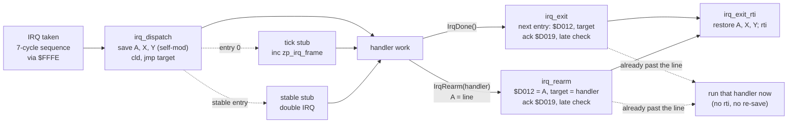
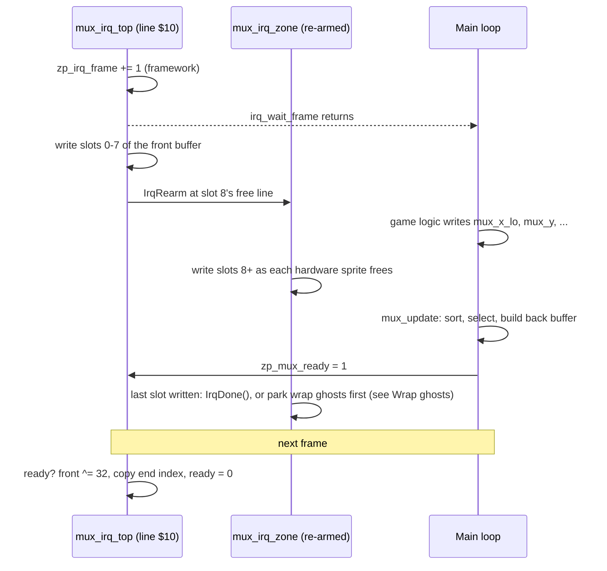
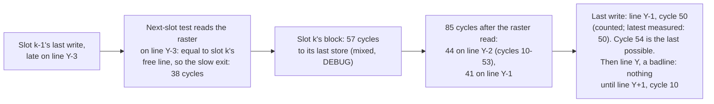
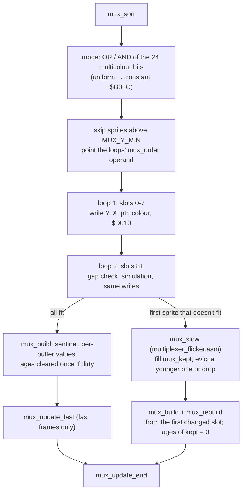
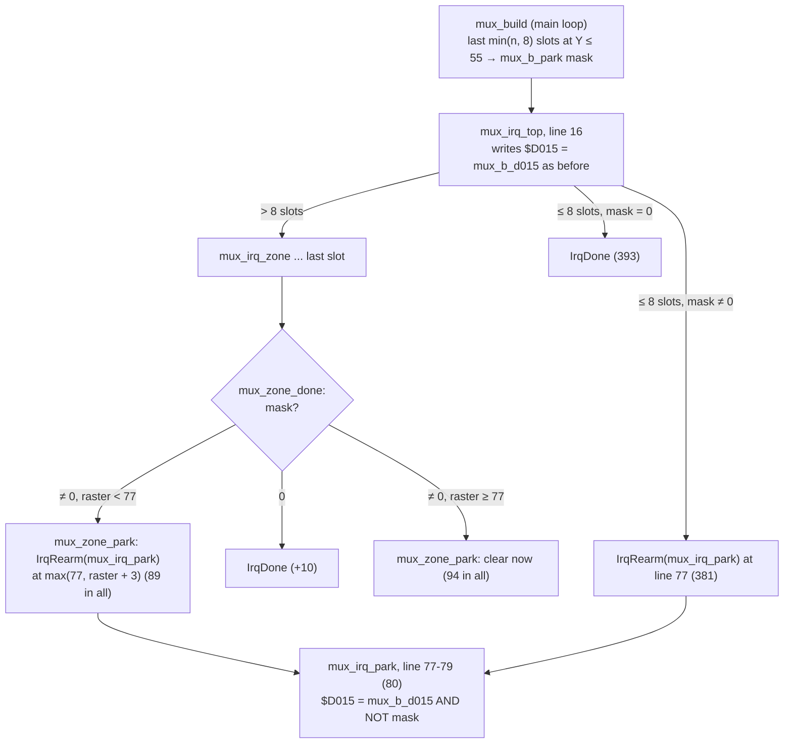
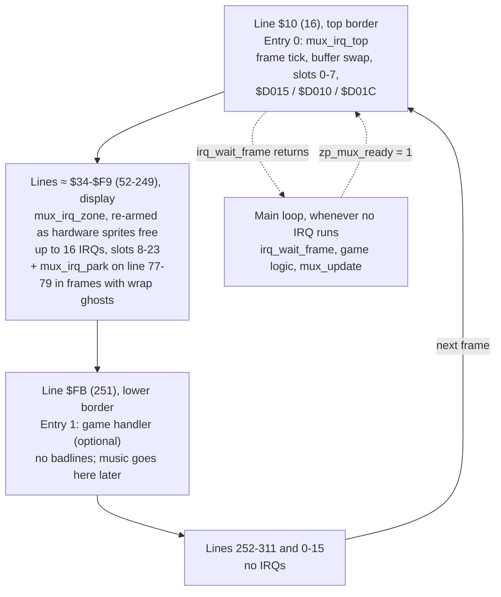
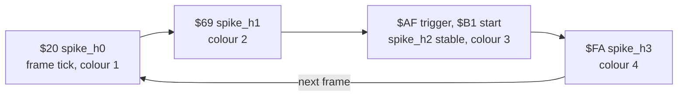

# Engine

Shared modules that every game in the studio builds on. This page is the **design contract**
for M3 ([brief](../docs/milestones/M3-engine-basics.md)): the APIs, zero page, raster timeline
and cycle budgets that the raster-engineer implements and `make test` enforces. The Technical
Director owns it. If the design can't be met, report with numbers and change this page before
the code, not after.

| Module | File | Status |
|---|---|---|
| IRQ framework | `engine/irq.asm` | **Implemented** (M3 stage 1). Costs measured in `tests/engine/irq_chain` |
| Sprite multiplexer v1 | `engine/multiplexer.asm` (+ `engine/multiplexer_flicker.asm`, the slow path) | **Stage 4 implemented** (sort, fast-path select with the build merged in, fair flicker, [pinned sprites](#pinned-sprites), zone IRQs, double buffer), with the stage 3.5 [wrap-ghost fix](#wrap-ghosts). Measured in `tests/engine/multiplexer`, `tests/engine/multiplexer_ghost` and `tests/engine/multiplexer_top` |

**How to read the numbers.** Every figure is marked:

- **measured**: from a probe, with the reference doc that records it.
- *estimate*: a design figure nobody has measured yet. The full list, and who measures what,
  is in [Estimates to measure in M3](#estimates-to-measure-in-m3). When a figure is measured,
  replace it here, in the routine header, and in the spike's `budget.json`.

---

## Using the engine in a game

```
BasicUpstart2(start)
#import "zp.asm"                        // the game's zero page, including the engine's bytes
.const MUX_SCREEN = $0400               // only if you use the multiplexer (see below)
.const MUX_Y_MAX  = $f9
#import "engine/irq.asm"
#import "engine/multiplexer.asm"        // optional

        IrqChainBegin()
        IrqNormal(MUX_TOP_LINE, mux_irq_top)    // entry 0: the frame entry
        IrqNormal($fb, game_irq_bottom)         // entry 1
        IrqChainEnd()

start:  jsr mux_init                    // before irq_init: entry 0 may fire straight away
        jsr irq_init                    // machine setup; returns with the chain running
main:   jsr irq_wait_frame
        jsr game_update                 // writes mux_x_lo / mux_y / ... for this frame
        jsr mux_update
        jmp main
```

What a game must provide:

| Item | Where | Needed by |
|---|---|---|
| The engine's zero-page labels (`zp_irq_*`, `zp_mux_*`) and `zp_tmp0`–`zp_tmp3` | `games/<title>/src/zp.asm` | [Zero page](#zero-page) |
| A chain: `IrqChainBegin()`, 1–16 entries, `IrqChainEnd()` | Game source | IRQ framework |
| Handlers that end in `IrqDone()` | Game source | IRQ framework |
| `MUX_SCREEN`: the screen whose last 8 bytes are the sprite pointers | `.const` before the import | Multiplexer |
| `MUX_Y_MAX`: largest sprite Y the multiplexer shows (`$50`–`$F9`, 80–249; the lower bound is for [`mux_irq_park`](#wrap-ghosts)) | `.const` before the import | Multiplexer |
| Entry 0 of the chain is `mux_irq_top` at `MUX_TOP_LINE` | Chain | Multiplexer |

Engine modules emit their code and tables where they're imported, so the game places them
with `* = ... "Engine"` like any other block and records them in its memory map.

---

## IRQ framework: `engine/irq.asm`

### Ownership

Only this module writes `$FFFE/$FFFF`, `$FFFA/$FFFB`, `$D012`, `$D019`, `$D01A`, `$DC0D`,
`$DD0D`, and bit 7 of `$D011` (raster compare bit 8). Game code and other engine modules
ask for IRQ time through the chain and the macros below, never by touching these
([coding standards](../docs/standards/coding-standards.md#irq-ownership)).

Rules this imposes on the rest of the game:

- **Chain lines are 0–255.** The compare bit 8 is always 0, so every game write to `$D011`
  (YSCROLL, DEN, bitmap mode) keeps **bit 7 clear**: `and #$7f` before `sta $d011`. Lines
  256–311 (the bottom of the lower border) can still be *run through*, just not triggered on.
- **`$01` stays `$35` whenever interrupts are enabled.** The handlers assume I/O is in and
  don't save `$01` (it would cost 12 cycles per IRQ). Anything that needs `$01=$34`
  (writing RAM under I/O) runs with interrupts off, at init time or with no IRQ due.
- **No long `sei` sections** in the main loop. Every cycle with `I` set delays whichever IRQ
  is due; the multiplexer's zone IRQs have only a few lines of slack.
- The main loop may use decimal mode (BCD scores): the dispatcher clears `D`.

### Machine setup: `irq_init`

```
// Set up the machine and start the raster chain at entry 0.
// In:  nothing (the chain is declared with IrqChainBegin/IrqChainEnd)
// Out: interrupts enabled, chain running
// Uses: A, X
irq_init:
```

It replaces the setup every program has copied from `hello`: `sei`; CIA 1 and CIA 2
interrupts off (`$7F` to `$DC0D`/`$DD0D`, then read both to clear anything pending);
`$01=$35`; `$FFFA/$FFFB` → `irq_nmi` (an `rti`); `$FFFE/$FFFF` → `irq_dispatch`; `$D011`
bit 7 cleared; `$D012` and the dispatch target set for entry 0; `$D01A=$01` (raster only);
all VIC IRQ latches acknowledged (`$FF` to `$D019`); `cli`. It doesn't touch the stack pointer,
the VIC bank, `$D018` or anything else on the screen.

### Declaring the chain

```
        IrqChainBegin()
        IrqNormal(line, handler)        // handler starts on `line`, within the normal jitter
        IrqStable(line, handler)        // handler starts on `line` at the SAME cycle every frame
        ...
        IrqChainEnd()
```

- 1–16 entries (`IRQ_MAX_ENTRIES = 16`), in **ascending line order**, run in order every frame.
  After the last, the chain wraps to entry 0.
- **Entry 0 is the frame entry**: the framework increments `zp_irq_frame` just before its
  handler runs. `irq_wait_frame` returns just after that.
- The macros emit, where `IrqChainEnd()` is: the RAM table `irq_lines` (one byte per entry,
  the trigger line: `line − 2` for a stable entry), `irq_next` (the following entry's index),
  the dispatch-target tables `irq_target_lo`/`irq_target_hi`, the handler tables
  `irq_handler_lo`/`irq_handler_hi` (read by the stable stage 2), all sized to the chain
  (6 bytes per entry, kept in one page), and the entry-0 tick stub. The double-IRQ stages are
  common code in `irq.asm`.
  They assemble-time check (`.errorif`) that there are 1–16 entries, lines are ascending and
  in 0–255, and a stable entry's line is at least 2.
- `irq_lines` may be rewritten from the main loop (one byte, atomic) to move an entry. The
  new line takes effect the next time the chain programs that entry, and must keep the
  lines ascending with enough room for each handler. Handlers can't be changed at run time
  (use `IrqRearm` for dynamic work).

### Dispatch model

`$FFFE/$FFFF` point at `irq_dispatch` permanently (except inside a stable entry's double IRQ).
The per-entry "vector switching" is the dispatcher's self-modified `jmp` target, set from
`irq_target_lo/hi` by the exit code. This costs 3 cycles more than switching `$FFFE` itself,
and buys two things: every IRQ enters through **one address**, which lets the budget runner
exclude IRQ time when it measures main-loop code, and the vector can never be left pointing
at a half-written address.



### Handler conventions

On entry to a handler:

| State | Guarantee |
|---|---|
| A, X, Y | Free to use. The framework saved them and restores them |
| `D` flag | Clear |
| `I` flag | Set. **Never `cli`** in a handler (only the framework's stable stage does) |
| `$01` | `$35` (given the rule above) |
| Stack | Free to use; the IRQ itself uses 3 bytes (6 during a stable entry) |
| `$D019` | Not yet acknowledged. **Don't touch it**: the exit does it |

A handler ends with exactly one of:

| Macro | Expands to | Effect |
|---|---|---|
| `IrqDone()` | `jmp irq_exit` | Advance to the next chain entry, acknowledge, restore, `rti` |
| `IrqRearm(handler)` | `ldx #<handler / ldy #>handler / jmp irq_rearm` | With the line in **A**: fire `handler` at that line, *without* advancing the chain. The multiplexer uses this for its zone IRQs |

`irq_exit` and `irq_rearm` write `$D012` and the target **first**, then acknowledge `$D019`,
then do the **late check**: if the raster is already on or past the new line, the IRQ would
not fire until next frame, so they acknowledge again (clearing a latch that may have happened
between the first ack and the check) and jump straight to the next handler with the registers
still saved. The next handler runs late, but it runs exactly once, and the chain stays in step.
The wrap to entry 0 is exempt from the check. Each late run increments `irq_late_count`
(1 byte, saturating at 255, DEBUG builds only), and `make test` requires it to stay 0 in every
spike: a late run means a budget was blown.

The last entry's handler must finish before line 311 ends, or entry 0 misses a frame (not
detected in v1).

### Stable handlers

`IrqStable(line, handler)` makes `handler`'s first instruction run on `line` at the same
raster cycle every frame: `IRQ_STABLE_CYCLE` = **cycle 6** (**measured**: `irq_chain` spike,
1,000 of 1,000 frames on cycle 6, with stage 1 arriving on 8 different cycles and stage 2 on
2, via `tests/engine/irq_chain/measure.py`). It uses the double IRQ from
[raster-interrupts.md](../docs/reference/raster-interrupts.md#jitter-and-stable-rasters): the chain
triggers at `line − 2`; the stable stub (label `irq_stable_begin`, common code) points
`$FFFE` at stage 2, sets `$D012` to the next line, acknowledges, `cli`s and runs `NOP`s;
stage 2 arrives with at most 1 cycle of jitter, discards its own 3-byte interrupt frame,
restores `$FFFE` to `irq_dispatch`, and removes the last cycle with a `$D012` compare
across the line change. Then it jumps to the handler, which exits normally.

Implementation notes (as built):

- Stage 1 and stage 2 switch only the **low byte** of `$FFFE`: `irq_dispatch` and
  `irq_stable_stage2` are assembled into one page (asserted). Stage 2 finds the handler
  through `irq_handler_lo/hi` indexed by `zp_irq_idx`, in the time it has to burn anyway.
- Stage 2 doesn't acknowledge its own latch: `I` is set until the handler's `irq_exit`, which
  acknowledges after writing `$D012`.
- Stage 2's wait (`IRQ_STABLE_DELAY`, `IRQ_STABLE_PAD` in `irq.asm`) was set by measurement.
  Changing any instruction in stage 2 needs the spread re-measured.
- If stage 2's IRQ never arrives (stage 1 started too late, e.g. after a long `sei` in the main
  loop), stage 1's `NOP` slide falls through to a fallback that runs the handler at once,
  unstable, and counts a late run. Stage 1 reaches `cli` 22 cycles after it starts, so it must
  start by about cycle 40 of `line − 2` (*counted*; it measured 26–33 with the worst main loop).

Constraints:

- Lines `line − 2` to `line` must **not be badlines** (the `NOP` slide needs the bus), and the
  sprite DMA on them must be the same every frame. Put stable entries in the border or in a
  gap between badlines ($AF–$B1 is fine with the default YSCROLL=3: badlines are at 51 + 8n,
  measured, [vic-ii-timing.md](../docs/reference/vic-ii-timing.md#badlines)), and never inside
  the multiplexer's region.
- Its exit may run into a badline: that only lengthens the entry's span
  ([DMA inside an IRQ](#dma-inside-an-irq)), it doesn't affect stability.
- Cost: 99–106 cycles more than a normal entry (**measured**, see [Costs](#irq-framework-costs)).
- An NMI (RESTORE key) during the stage costs one frame of stability. Accepted.

### Jitter guarantee

A normal handler starts on its line within **7 cycles** of its earliest possible start
(**measured**: spread exactly 7 on every entry of the `irq_chain` spike over 1,000 frames, with a
worst-case main loop that includes taken branches right before 7-cycle `inc abs,x`; the IRQ
sequence starts on cycle 2 of the trigger line at the earliest, so a normal handler's first
instruction runs on cycle **26–33**, entry 0's on **34–41**;
[raster-interrupts.md](../docs/reference/raster-interrupts.md#jitter-and-stable-rasters)), **provided no
badline or sprite DMA falls between the trigger and the handler**. DMA delays it by up to the
DMA on that line: 43 cycles for a badline, 81 for a badline with sprites 0–7 active around it
(**measured**, [vic-ii-timing.md](../docs/reference/vic-ii-timing.md#badline-and-sprites-on-the-same-line)).
Trigger normal entries on non-badlines when their start time matters.

### DMA inside an IRQ

The framework costs below are raster time on lines with no DMA. A badline (43 cycles,
**measured**) or sprite DMA anywhere in an IRQ's span, from the trigger to the `rti`, lengthens
that span by the cycles stolen. A normal handler starts on cycle 26–33, so with W cycles of work
its `irq_exit` starts at about cycle 36 + W and, for any small handler, runs into the next line
(**measured**: `irq_exit` 102–103 when the next lines were badlines 107 and 179, the `irq_chain`
spike's first layout at $6A and $B2, against 60 everywhere else).

What that does and doesn't cost:

- **No CPU time.** The VIC takes those cycles whatever code is running: if the IRQ didn't span
  the badline, the main loop would lose the same 43. The [frame budget](#frame-budget) counts every
  badline and sprite DMA once in its DMA rows, so an IRQ spanning DMA costs the frame nothing
  extra. (Its IRQ rows are raster time, so that DMA is counted twice, on purpose, as margin.)
- **Latency.** Whatever follows the IRQ happens later: the next chain entry can't start before
  this one's `rti`, and the main loop resumes later. This matters where IRQs are packed
  closely, which in practice means the multiplexer's zone IRQs.
- **Measurement.** A `profile` check's max includes any DMA inside the span.

Rules:

1. **Spikes that lock a framework path to its measured cost** (`irq_chain`) place each entry so
   no badline or sprite DMA falls between its trigger and its `rti`. For a small handler that's
   the trigger line and the next one: that's why the spike uses $69 and $B1.
2. **Games don't have to.** Put fixed entries where the effect needs them and budget each
   entry's **raster span**: framework overhead + work + the DMA on the lines it covers (43 per
   badline, up to 81 for a badline with sprites 0–7, **measured**,
   [vic-ii-timing.md](../docs/reference/vic-ii-timing.md#badline-and-sprites-on-the-same-line)).
   A game that scrolls vertically moves its badlines with YSCROLL and couldn't keep them clear
   anyway. Keep DMA out of an entry's span only when its *timing* matters: another entry close
   behind it, or a register write that must land by a given cycle.
3. **Stable entries** keep their hard rule (lines `line − 2` to `line` free of badlines, same
   sprite DMA every frame). Their exit may cross a badline.
4. **Multiplexer budgets** are raster spans in the display area, DMA included by design. Zone IRQs
   can't avoid badlines, and their budgets and scheduling constants must allow for them.

### Frame sync

```
// Wait for the next frame tick (entry 0 has just started).
// In: nothing   Out: A = new zp_irq_frame   Uses: A
irq_wait_frame:
```

`zp_irq_frame` is a free-running 8-bit counter. A game that needs to detect a missed frame
compares it with the value it saw last time (a difference of more than 1 = an overrun).

### IRQ framework costs

**Measured** in the `irq_chain` spike (VICE 3.10 x64sc PAL, 2026-09-29), with
`tests/engine/irq_chain/measure.py` over 1,000 frames and confirmed with `vice_profile`. Raster
cycles, no DMA on the lines involved.

| Part | Cycles | Basis |
|---|---|---|
| IRQ sequence starts (earliest) | cycle 2 of the trigger line | **measured** (lines 32, 105, 175, 250; line 0 not measured) |
| Interrupt sequence | 7 | [6502-timing.md](../docs/reference/6502-timing.md) (standard figure) |
| Jitter: finishing the interrupted instruction | 0–7 | **measured**, worst-case main loop, all 8 values seen on every entry |
| `irq_dispatch`: 3 self-mod saves (12), `cld` (2), `jmp` (3) | 17 | **measured** (`vice_profile irq_dispatch → spike_h1`: 17 every pass) |
| **Handler starts** after the IRQ is taken | **24** | **measured** (dispatch hit + 17) |
| Frame tick stub, entry 0 only | +8 | **measured** (h0 starts 25 after dispatch) |
| `irq_exit` → `irq_exit_rti` (advance, `$D012`, target, ack, late check, restore) | **60** (58 on the wrap) | **measured**, every pass; equals the instruction count. The budget is locked to it |
| `irq_rearm` → `irq_exit_rti` (`$D012`, target, ack, late check, restore) | **41** | **measured** (M3 stage 2): `irq_chain` `spike_h2` re-arms `spike_h3`, `irq_rearm` on line 177 from cycle 21, 41 in 1,000 of 1,000 passes; equals the count (35 to `jmp irq_restore` + 6) |
| `rti` + the handler's `jmp irq_exit` | 9 | [6502-timing.md](../docs/reference/6502-timing.md) |
| **Total per normal entry, excluding its work** | **93** (+8 on entry 0) | **measured** parts |
| Stable entry, extra: `irq_stable_begin` → handler | **99–106** (1.7 lines) | **measured** |
| **Total per stable entry, excluding its work** | **192–199** | **measured** parts |
| Total per re-armed IRQ (`IrqRearm`, e.g. a zone IRQ), excluding its work | 78: 7 + 17 + 7 (macro) + 41 + 6 | **measured** parts |
| All four `irq_chain` handlers, per frame (runner's IRQ-span definition) | **488–495** | **measured**, 1,000 frames (stage 2 layout: h2 ends in `IrqRearm`, 13 less than its old `IrqDone`; was 501–508 with four chain entries). Locked at 495, and `irq_rearm` at 41, in `irq_chain/budget.json` |

**Budgets for these are locks, not allowances.** Each path is straight-line code measured
where no DMA touches it, so the figure is exact and repeatable, and
`tests/engine/irq_chain/budget.json` sets each budget *equal* to it. Headroom there could only
hide a regression, and every framework cycle is paid by every IRQ (up to 18 a frame in a
multiplexer game). A change to `irq.asm` that moves one of these figures is re-measured and
re-baselined on purpose. Games get their headroom from the [frame budget](#frame-budget).

**Why `irq_exit` stays at 60.** Reviewed after stage 1: the only removable parts are the raster
bit 8 check (6: it catches a handler overrunning into lines 256–311) and the dispatch-target
write (16: the price of the single-entry dispatcher, a design decision). Both are worth what they
cost. At most one `irq_exit` runs per chain entry; zone IRQs use `irq_rearm` (41).

The exit's 60 cycles: `irq_next` table (10 for index advance), `$D012` (8), target (16), ack (6),
late check against the line (8) and raster bit 8 (6, so a handler that overruns into lines
256–311 is caught too), restore (6).

For comparison, `hello`'s hand-written handlers cost about 50 cycles each with no register
save beyond A, no table and no late check.

### Labels exported for tests

`irq_dispatch`, `irq_exit`, `irq_rearm`, `irq_exit_rti` (the `rti` itself), `irq_stable_begin`,
`irq_nmi`, `irq_late_count`, `irq_lines`. The budget runner depends on these names. Also
emitted: `irq_stable_stage2`, `irq_next`, `irq_target_lo/hi`, `irq_handler_lo/hi`, `irq_tick`,
`IRQ_COUNT`, and the constant `IRQ_STABLE_CYCLE`.

---

## Sprite multiplexer v1: `engine/multiplexer.asm`

24 virtual sprites on the 8 hardware sprites, sorted by Y each frame, with fair flicker
when too many share a row. Decisions from the brief: 24 sprites, flicker rather than drop.

### Constants

| Constant | Value | Set by | Meaning |
|---|---|---|---|
| `MUX_COUNT` | 24 | Engine | Virtual sprites |
| `MUX_OFF` | `$FF` | Engine | Y value that hides a virtual sprite |
| `MUX_TOP_LINE` | `$10` (16) | Engine | Line of `mux_irq_top` (chain entry 0) |
| `MUX_Y_MIN` | `$1E` (30) | Engine | Smallest Y shown. Y=29 is displayed on lines 30–50, all border |
| `MUX_Y_MAX` | `$50`–`$F9` (80–249) | **Game** | Largest Y shown. Y=249 is the last with a visible line (250). At least 80 (assembly error otherwise), so no fixed chain entry can sit on lines 77–79, where `mux_irq_park` runs: see [Wrap ghosts](#wrap-ghosts) |
| `MUX_WRAP_Y` | 55 | Engine | Largest Y the VIC-II matches a second time in a PAL frame (on line 256 + Y): 311 − 256. See [Wrap ghosts](#wrap-ghosts) |
| `MUX_PARK_LINE` | 77 | Engine | `MUX_WRAP_Y` + 22: the first line on which every slot at Y ≤ 55 has finished displaying, so its hardware sprite can be disabled |
| `MUX_SCREEN` | e.g. `$0400` | **Game** | Screen whose `+$3F8…$3FF` get the sprite pointers |
| `MUX_FREE_AFTER` | 22 | Engine | A hardware sprite is free to rewrite on line `Y_old + 22`. Display on Y+1 to Y+21 is **measured** (`tests/timing/sprite_wrap`); that a rewrite on `Y_old + 22` never marks the last line is still estimate #8 |
| `MUX_IRQ_LINES` | 1 | Engine | Lines from a zone IRQ's trigger to its first write. **Measured** (stage 2, 2,000 zone IRQs): 0 or 1, and 2 once; the slack in `MUX_WRITE_LINES` absorbed it (`mux_late_count` 0) |
| `MUX_WRITE_LINES` | **2** | Engine | Lines to write one slot, allowing for DMA. **Measured** (stage 2): 1 failed (`mux_late_count` 139 in 3,000 frames); a slot takes 78 cycles block to block with no DMA (DEBUG), up to ~2 lines with DMA. 2 gives 0 late, with ≥ 7 lines of margin on back-to-back full rows |
| `MUX_MAX_PINNED` | 4 | Engine | Most sprites honoured as pinned in one frame (decision, not a measurement) |
| `MUX_PIN_EVICT_MAX` | 8 | Engine | Most evictions pinned sprites may make in one `mux_update`. Bounds the worst case. **Measured** (stage 4): the spike's 4 pinned sprites made at most 4 in a frame over 20,000 frames, so the cap was never reached (`mux_pin_drop_count` 0 over 920,000 frames). Pinned evictions cost about 226 raster cycles each on average (derived: 9,031 of them in 7,409 frames, 275 a frame) |

Sprites with Y outside `MUX_Y_MIN`–`MUX_Y_MAX` (including `MUX_OFF`) are not shown and cost
nothing.

### Per-frame data the game writes

Structure of arrays, indexed by virtual sprite 0–23. Written **by the main loop only**, before
it calls `mux_update` in the same frame; nothing reads them until then, so there's no race.

| Array | Bytes | Contents |
|---|---|---|
| `mux_x_lo` | 24 | X bits 0–7 |
| `mux_x_hi` | 24 | X bit 8 in bit 0; other bits 0 |
| `mux_y` | 24 | Y (as the VIC-II register). `MUX_OFF` to hide |
| `mux_ptr` | 24 | Sprite pointer: data at VIC bank base + ptr × 64 |
| `mux_col` | 24 | Colour, bits 0–3 |
| `mux_flags` | 24 | Bit 0: multicolour. Bit 7: **pinned**, never evicted by flicker (at most 4: see [Pinned sprites](#pinned-sprites)). Bits 1–6 reserved, write 0 |

Registers the multiplexer owns (nothing else writes them): `$D000–$D010`, `$D015`, `$D01C`,
`$D027–$D02E`, and `MUX_SCREEN+$3F8…$3FF`. The game owns the shared multicolours
`$D025/$D026` and priority `$D01B`. `$D017` and `$D01D` (Y and X expansion) must be 0: v1
assumes 21-line sprites.

### API

```
// Hide all virtual sprites and reset the multiplexer. Call once, before irq_init.
// In: nothing   Out: nothing   Uses: A, X
mux_init:

// Sort, select and build the next frame's sprites into the back buffer. Main loop, once per
// frame, after writing the arrays above. Doesn't block.
// In:  nothing
// Out: C=0 queued for the next mux_irq_top; C=1 skipped (the previous build hasn't been shown yet)
// Uses: A, X, Y, zp_tmp0-zp_tmp3
// Cost: measured 4,261 avg raster cycles in frames with no overflow (stage 4; the stage 3 fast
//       path was 4,264, stage 2 6,240), up to 12,342 in a frame that flickers with pinned
//       sprites in the crowd: see Multiplexer costs. Budgets in tests/engine/multiplexer/budget.json
mux_update:

// Chain entry 0 (IrqNormal(MUX_TOP_LINE, mux_irq_top)). Internal, re-armed from it:
// mux_irq_zone (slots 8+) and mux_irq_park (wrap ghosts, line 77-79).
// Cost: measured 378 (> 8 slots) / 381 (<= 8 slots, wrap ghosts to park) / 393 (<= 8 slots,
//       none), constant paths, from mux_irq_top to irq_exit_rti; + 32 framework before it
mux_irq_top:
```

### Frame flow and double buffering

The IRQs never read what the main loop is writing. `mux_update` writes a **back buffer** of
slot arrays; `mux_irq_top` swaps it in at the top of the next frame, before any sprite is
displayed. Each slot array is 64 bytes: buffer 0 uses indices 0–23 and buffer 1 uses 32–55,
so `zp_mux_front` (0 or 32) is just a base added to the slot index, and the IRQs pay nothing
for the double buffer.



- **Latency:** positions written in frame N are on screen in frame N+1, provided the main
  loop (game logic + `mux_update`) finishes within the frame. If it doesn't, the previous
  frame's sprites are shown again (no tearing, no garbage) and `mux_update` returns C=1 if
  called again before the swap.
- The slot arrays (all 64 bytes, `.align $40` so indexed reads never cross a page):
  `mux_s_y`, `mux_s_xlo`, `mux_s_ptr`, `mux_s_col`, `mux_s_d010`, `mux_s_d01c`
  (the cumulative `$D010`/`$D01C` value after this slot is written), `mux_s_free`
  (the line on which the slot's hardware sprite is free: `mux_s_y[k−8] + MUX_FREE_AFTER`).
  Plus `mux_s_count` (the back buffer's end index, copied to `zp_mux_end` on the swap).

### Sort

Insertion sort of an index list, `mux_order`, by `mux_y`. `mux_order` persists between
frames, so it's nearly sorted and each frame costs about one compare per sprite plus one
shift per pair that swapped places. Hidden sprites sort as Y = `$FF` (to the end) and are cut
off there.

Worst case (list fully reversed, e.g. after many sprites teleport) is 276 shifts: about 6,000
cycles (*estimate*). That's a main-loop cost, so the effect is one repeated frame, not a
display glitch. Spawn code should place new sprites with a sensible Y (not all at 0).

### Hardware sprite assignment

Kept sprites, in Y order, become slots 0, 1, 2…; **slot k uses hardware sprite k mod 8**
(round robin). The sprites active on any one line are then a consecutive run mod 8, which is at
most two DMA groups: the cheap case per the measured DMA costs
([vic-ii-timing.md](../docs/reference/vic-ii-timing.md#sprite-dma): 2 cycles per sprite + 3 per group).
The run can wrap (7 → 0), which costs one extra group (3 cycles a line) against starting
again at 0; accepted, because restarting at 0 would need an idle hardware sprite.

### Scheduling, and the minimum vertical separation

Slot k (k ≥ 8) can't be written until slot k−8, on the same hardware sprite, has finished
displaying (line `y[k−8] + MUX_FREE_AFTER`), and must be written before its own Y line. The
selection pass **simulates the zone IRQs** in raster lines with the three constants above, so
it only keeps sprites the IRQs can actually write in time:

```
done[-1] = 0
free_k  = (k < 8) ? MUX_TOP_LINE : y[k-8] + MUX_FREE_AFTER
start_k = max(free_k + MUX_IRQ_LINES, done[k-1])     // new IRQ, or carry on in the current one
done_k  = start_k + MUX_WRITE_LINES
slot k fits  <=>  done_k <= y[k]
```

What that gives, with the stage 2 constants (22 / 1 / 2, the last two **measured**):

| Layout | Minimum Y gap to the sprite 8 places earlier in Y order |
|---|---|
| One sprite reusing a hardware sprite | **25 lines** (22 + 1 + 2; was 24 with the estimated 1) |
| A full row of 8 directly below another full row | **39 lines** (22 + 1 + 16; was 31). The spike runs full rows at exactly 39 with `mux_late_count` 0 and ≥ 7 lines to spare. A finer model could get back to about 33, but **not in v1** (Technical Director, after stage 2): see below |
| Slots 0–7 (written by `mux_irq_top` from line 16) | Y ≥ 18 + slot, always met since Y ≥ `MUX_Y_MIN` (30) |

**Why not model slot writes in half-lines (39 → ~33)?** Decided after stage 2: not in v1.

- **Cost.** Half-line units don't fit a byte (Y up to 249 is 498 half-lines), so the simulation
  goes to 16 bits or scaled tables, about +10–15 cycles per zone slot. That runs against build
  rule 3.
- **Benefit.** It only helps two full rows stacked 33–38 lines apart, which is the overload boundary,
  and flicker (stage 3) handles that case anyway.
- **Risk.** It spends the margin that `MUX_WRITE_LINES` = 2 buys against a slot that straddles a
  badline with 8 sprites (up to 81 cycles stolen, **measured**).

The v2 candidate that costs no CPU: charge the first slot of an IRQ `MUX_IRQ_LINES + 2` lines and
each continuation slot 1 line. The simulation's two branches already tell these cases apart. It
needs its own proof: `mux_late_count` = 0 in a spike that puts continuation slots on badlines with
8 sprites.

So "at most 8 on a row" means, for this multiplexer, at most 8 sprites within any 25-line
window (39 for back-to-back full rows), not 8 on one raster line. The QA soak test's
"≤ 8 on a row" should be read that way.

**The exact guarantee** (Technical Director, M3 review, 2026-10-01; *derived* from the selection
rules above and the eviction rules in [Overflow](#overflow-fair-flicker), not measured): a sprite
at Y is **shown in every frame** if at most 7 other shown-range sprites have Y in
**Y − 38 … Y + 25**. Why:

- Fewer than 8 others in the 38 lines above means the kept sprite 8 slots earlier is ≥ 39 lines
  up, so the gap check passes (≥ 25) and no chain of carried-on slots can reach it: the longest
  one that matters is 7 slots at 2 lines each from a start 23 lines after that sprite, which is
  done by Y − 3.
- A later sprite can only evict it if that sprite itself fails to fit, which needs 8 kept
  sprites within 25 lines above the later one (or within 38 for a carry-on failure). All of those,
  and the later sprite, are then inside this sprite's window, which makes 9.

The QA soak (`tests/engine/multiplexer/soak.py`, check 3b) uses a symmetric **± 39 lines**, at most
8 including the sprite itself. That window contains the one above, so every sprite-frame it calls
uncrowded is one the engine guarantees, and it requires such a sprite to be missing for **0**
frames, which is stricter than the brief's "no more than 2 consecutive". It is the right reading
of the brief for this engine, and it isn't an empty test: 40,717 of the 200,000 unpinned
sprite-frames in a 10,000-frame soak were uncrowded, with 0 missing (**measured**, re-run for the
review, 2026-10-01). What it doesn't cover, by design: a sprite with ≤ 8 on its own
raster lines but more than 8 inside the window (two full rows 30 lines apart, say) may flicker.
For those the limits are the flicker table's: missing at most 2 frames running with nothing
pinned, 4 with 4 pinned sprites in the crowd (**measured**, `mux_max_age`).

### Slot write deadline

Added in the M3 review (Technical Director, 2026-10-01), after QA's position check found zone
slots whose writes finish **on** the sprite's own Y line.

**What a zone slot writes, in order:** Y, X low, pointer, colour, `$D010`, and `$D01C` in the mixed
blocks. Each has its own deadline, set by when the VIC-II uses it:

| Write | Used by the VIC-II | Deadline: the last write cycle that still works | Basis |
|---|---|---|---|
| Y (`$D001 + 2j`) | The Y comparison on line Y that starts the sprite's DMA | **Cycle 53 of line Y** on hardware sprite 0, **cycle 54** on sprites 2, 3 and 7. One cycle later the sprite isn't displayed at all in that frame (sprite 0 at cycle 54: displayed with a corrupt first line) | **Measured** (`tests/timing/sprite_latch`, 2026-10-01, [vic-ii-timing.md](../docs/reference/vic-ii-timing.md#sprite-register-write-deadlines)). Sprites 1 and 4–6 weren't probed: use 53 |
| Pointer (`MUX_SCREEN + $3F8 + j`) | The sprite's pointer fetch, once per DMA line. The first one decides the data shown on line Y + 1 | Hardware sprite 0: **Y:54**. Sprite 2: **Y:58**. Sprite 3: **Y:60**. Sprite 7: **cycle 5 of line Y + 1**. A later write leaves the old pointer's data on line Y + 1 | **Measured**, the same probe. Each is the last cycle before the sprite's own DMA stops the CPU (5 cycles: sprite 0 on Y:55–59, sprite 7 on Y+1:06–10), so the next write that can be made at all is already late |
| X low, `$D010` bit, colour, `$D01C` bit | Drawing the sprite, first on line Y + 1 | **Cycle 12 + X ÷ 8 of line Y + 1**: cycle 15 for a sprite at X = 24, 52 at X = 320. Live registers: the same on every hardware sprite | **Measured**, the same probe, at X = 24, 64, 288 and 320. Below X = 24 the rule is extrapolated (cycle 12 at X = 0) |

**The requirement, stated conservatively:** every write of a slot is made **on or before cycle 53
of line Y** (VICE's cycle numbering; "before cycle 55" in the first version of this section, counted
at the instruction after the write, as `positions.py` does: the same line). **Measured:** that is
the earliest deadline of all, the Y register on hardware sprite 0, so a slot that meets it meets
every one. The other deadlines are later by 1 cycle (pointer, sprite 0) up to 22 or more (the live
registers).

**`MUX_FREE_AFTER` = 22 is confirmed** (estimate #8, **measured**, the same probe): rewriting X,
the pointer or the colour of a hardware sprite on line Y_old + 22 or later, at any cycle, leaves
every line of the old occupant untouched (sprites 0, 2, 3 and 7, X = 24 and 320, swept through line
Y_old + 23). Line Y_old + 21 is not safe: the sprite is still drawn on it (X and colour mark it up
to cycle 55 at X = 320, the pointer up to cycle 5 on sprite 7).

**What the engine enforces is narrower.** The DEBUG check (`mux_late_count`) reads the raster 4
cycles after the **Y** store and counts a slot as late if the line is already Y or later. So:

- The Y write is at least 55 cycles early: about a line more than it needs. That's deliberate
  margin, and `mux_late_count` = 0 in every run proves it for Y.
- **The other writes aren't checked by anything in the engine.** They follow the check's raster
  read by 37 CPU cycles in the uniform blocks (5 for the two branches, then four 8-cycle
  load-and-store pairs) and 45 in the mixed ones (*counted*); 32 and 40 after the Y store in a
  release build, which has no check and is therefore always earlier than DEBUG.
- The selection's own rule allows it: a slot fits when its simulated `done` line is **≤** Y, not
  < Y.

**Measured.** Raster position at the `inx` that follows each block's last write:

| Run | Zone slots | Last write on line Y | Latest | Slack to cycle 55 | Of those, Y on a badline |
|---|---|---|---|---|---|
| QA `positions.py`, 700 frames, hires, multicolour and mixed phases | 21,714 sprite-frames (top and zone slots) | 28 | cycle 40 | **15 cycles** | not recorded |
| Technical Director, 60,000 consecutive zone slots after 100 warm-up frames, the spike as shipped (uniform hires) | 60,000 | 139 (0.23%) | cycle 26 | **29 cycles** | **0** (of 7,475 slots with Y on a badline) |

The second run is a scratch checkpoint script, not kept in the repo: an execution checkpoint on
the `inx` of each of the 8 uniform blocks (`mux_zone_0` + 81 j + 45, DEBUG), reading `LIN`, `CYC`,
X and `mux_s_y`,X at every stop. Slack is (Y − `LIN`) × 63 + 55 − `CYC`. Its other results:
49,520 slots (83%) finished 6 or more lines before Y, 1,204 one line before, and every one of the
40 closest calls had Y ≡ 4, 5 or 6 (mod 8): one to three lines **below** a badline (badlines are
lines ≡ 3 with YSCROLL = 3). The badline starves the IRQ, the Y write slips to the end of line
Y − 1, and the rest lands early on line Y, which is not itself a badline. `mux_late_count` stayed 0.

**Is the observed behaviour safe?** Yes, for everything observed: all six writes were in place at
least 15 cycles before the conservative deadline in every slot of both runs, and the position
check found 0 register mismatches. **It isn't proven for every layout**, and here is the gap:

| Line Y is | CPU cycles on line Y before cycle 55 | Needed in the worst phase (the check passes on the last cycle of line Y − 1) | Result |
|---|---|---|---|
| Not a badline, no sprite fetch at its start | 55 | 37 uniform / 45 mixed | Safe |
| Not a badline, sprites 3–7 active from the line above (CPU halted to cycle 10, **measured**) | 44 | 37 / 45 | Uniform safe by 7. Mixed: the `$D01C` store lands on cycle 55, level with the deadline; its real deadline is line Y + 1, so safe in practice, *unproven* |
| **A badline** (CPU runs cycles 0–11 and 55/56–62 with no sprites, 0–2 cycles with sprites 0–7 around it, **measured**) | 12, or 0–2 | 37 / 45 | **Not safe in the worst phase**: at most the X low write lands; the pointer, colour and `$D010` writes slip past cycle 55, and past the sprite fetches into line Y + 1 when sprites are active. The sprite's first line (Y + 1) would then show the hardware sprite's previous pointer, colour or X bit 8 for one line, in one frame |

The worst phase on a badline needs the Y check to pass in the last ~25 cycles of line Y − 1 with
Y ≡ 3 (mod 8). It was **never observed** (0 of 7,475), and the measured pattern says why it's rare:
lateness comes from a badline just above Y, and a badline Y has its nearest badline 8 lines up.
But nothing in the scheduling arithmetic forbids it, and the spike's motion isn't a proof.

**Decision.** Accepted for v1 as an open risk with a probe owed, not a defect: no failure has been
seen, the effect if it happens is one wrong raster line on one sprite for one frame, and M3's
acceptance criteria don't depend on it. It must be closed **before a game relies on the
multiplexer** (M4). Two probes for the raster-engineer, in this order:

1. **`tests/timing/sprite_latch`: the hardware deadlines** (closes estimates #7 and #8, and
   replaces the *unmeasured* cells above). One sprite on a stable raster, screen off, borders
   open, as `tests/timing/sprite_wrap` does it. For each of Y, pointer, X low, the `$D010` bit,
   colour, the `$D01C` bit and the `$D015` bit: change the register at a swept cycle (every cycle
   from cycle 30 of line Y to cycle 20 of line Y + 1) and read from VICE's frame buffer whether
   line Y + 1 shows the old or the new value. Repeat for hardware sprites 0, 2, 3 and 7 (both
   fetch groups, first and last of each), and for X = 24 and X = 320. Also: rewrite X, pointer and
   colour at a swept cycle on lines Y_old + 21 and Y_old + 22 and check line Y_old + 21 is
   unmarked. Output: a table in `vic-ii-timing.md` of the last safe cycle per register and sprite,
   marked measured.
2. **`tests/engine/multiplexer_edge`: the engine at the scheduler's limit on badlines.** Static
   layouts (as `multiplexer_ghost` cycles through phases), each built so slots sit exactly at the
   simulation's limit (`done` = Y) with Y on a badline and 7 other sprites active across it: a
   full row at Y ≡ 3 (mod 8) directly under a full row at the 39-line limit; the same at 25 lines
   for a single reused sprite; each repeated with Y ≡ 2 and 4, and in mixed multicolour. The check
   is on the **last** write, measured from outside so the engine's timing isn't disturbed: the
   `inx` checkpoint method above (it belongs in `tests/engine/multiplexer/positions.py` as a
   mode, tools-engineer or QA), or a `memory` check on a counter the *spike* keeps. Pass: every
   slot's last write is before the earliest deadline probe 1 measured, in 1,000 frames per layout,
   DEBUG and release, with `mux_late_count` and `irq_late_count` 0.

If probe 2 finds a slot past the deadline, the Technical Director chooses between two fixes and
re-baselines: a slot fits only when `done` **<** Y (one line of capacity: the minimum gap becomes
26 and a full row under a full row 40), or the blocks write the pointer straight after Y so the
write with the earliest deadline comes first. Either changes locked figures, so neither is done
without the probe's evidence. v2 must make this provable: [v2 requirements](#multiplexer-v2-requirements).

#### Probe results (M3 follow-up, raster-engineer, 2026-10-01)

Both probes are built and run. **Probe 1** gave the deadlines in the table at the top of this
section. **Probe 2** is `tests/engine/multiplexer_edge` with its outside checker `edge.py`; the
engine wasn't changed.

**The question:** can the engine, as built, miss a write deadline when the Y check passes late on
line Y − 1 and Y is a badline?

**The answer: no miss could be provoked, and the feared case never occurred.** No write landed
past a deadline in DEBUG or release, uniform or mixed multicolour, with the slot's Y on a badline
or anywhere else. With Y on a badline the Y check never passed late on line Y − 1: the Y write was
never later than cycle 45 of line Y − 2. This is **measured, not proven**: it holds for the layouts
listed below, and nothing in the scheduling arithmetic guarantees it.

**The margin is small.** With Y on a badline, the latest last store found is cycle **50 of line
Y − 1** (DEBUG, mixed multicolour), and cycle 54 is the last on which a store can be made before
line Y + 1: **4 cycles**. It is 12 in DEBUG uniform and 13 / 21 in a release build (mixed /
uniform; those three are counted, not measured at their limit).

**The constraint that follows:** the zone blocks and their next-slot test can't grow. Five more
cycles in a DEBUG mixed block, or in the test, and the last store of the closest case leaves line
Y − 1 for line Y + 1. v1 as built has no bug here; it has a lock that nothing in the build
enforces.

**How it was checked** (all from outside: checkpoints, memory reads and VICE's frame buffer; the
engine and the probe program carry no instrumentation):

- **Fast tier**: a checkpoint on the `inx` after each zone block's last store. The raster position
  there, minus one, is the slot's last write. Slack is counted to cycle 53 of line Y, the earliest
  deadline of all.
- **Detail tier**: store checkpoints on every sprite register and pointer, so each write of each
  zone slot is compared with its own measured deadline.
- **Picture**: the whole 320 × 200 window of the frame buffer compared, pixel for pixel, with the
  picture the virtual sprites should make. Consecutive occupants of a hardware sprite differ in X,
  colour, pointer and (mixed) multicolour bit, so any late write shows on a first line.
- **Layouts**: the probe's 18 built-in phases (full rows 39 lines apart, one sprite reused at 25
  lines with the other 7 displayed across its Y line, and staircases of 2-line steps 25 lines
  apart, at yB = 98, 99 and 100, uniform and mixed), 1,000 frames each; the same three types at 16
  line offsets; the reuse on each of the 8 hardware sprites at 8 offsets; 300 random staircases
  (steps of 2–4 lines); 300 random dense layouts that overflow and flicker; and a **hunt**: 1,500
  more random staircases and a hill climb from the ten closest, looking for the badline slot
  whose last write is latest.

| | DEBUG | Release |
|---|---|---|
| Frames / zone slots checked (fast tier) | 90,800 / 843,538 | 90,800 / 842,738 |
| Of those, Y on a badline | 127,616 | 128,194 |
| Register writes checked one by one (detail tier) | 375,492 | 374,892 |
| Writes past their deadline | **0** | **0** |
| Pictures compared, wrong | 1,868, **0** | 1,868, **0** |
| Slots whose last write is on their own Y line | 71,594 (8.5%) | 23,307 (2.8%) |
| Least slack of a last write to Y:53, any Y | **4 cycles** (Y ≡ 4 mod 8, mixed: the `$D01C` write on Y:49; 26 cycles inside its own deadline) | 28 |
| Closest call with Y on a badline: the last write | **Y − 1, cycle 46** in the main run; **cycle 50** in the hunt (1,855 layouts, the same 50 from many of them) | Y − 1, cycle 33; 35 in the hunt |
| The Y write's closest approach to the end of line Y − 1, Y on a badline | 80 cycles before it (line Y − 2, cycle 45, in the hunt; 83 in the main run) | 86 |
| Least slack of each register to its own deadline, any Y | Y 77, X low 58, pointer 35, colour 42, `$D010` 34, `$D01C` 26 | 86 / 100 / 75 / 84 / 58 / 50 |
| `mux_late_count`, `irq_late_count`, overruns, drops in the static layouts | 0 | (no counters; overruns 0) |

All **measured**; the four result files are beside the probe. Screenshots:
[rows, yB = 99, mixed](../screenshots/multiplexer-edge-rows39-y99-badline-mixed.png),
[reuse at 25 lines, yB = 99](../screenshots/multiplexer-edge-reuse25-y99-badline-mixed.png),
[stairs, yB = 99](../screenshots/multiplexer-edge-stairs-y99-badline-uniform.png),
[the hunt's closest call](../screenshots/multiplexer-edge-closest-call-staircase-debug-mixed.png).

**Why the feared case doesn't happen.** A zone slot's hardware sprite frees on line Y − 3 at the
latest (the 25-line gap), and when Y is a badline none of Y − 3, Y − 2 and Y − 1 is one: the
badline before it is Y − 8. So the only DMA in the slot's way is the other sprites', and the Y
write never got closer to the end of line Y − 1 than a line and a quarter (80 cycles,
**measured**). Over all Y lines the closest was 23 cycles from the end of line Y − 1 (Y = 109,
written on 108:39), and there line Y − 2 is the badline, so Y isn't one. That a late Y write
always has a badline just above it is the pattern the review's run saw (its closest calls were at
Y ≡ 4, 5, 6 mod 8) and fits these two figures, but the result files record only the closest case
of each kind: *unverified* as a general rule. The slots that finish on their own Y line had their
last write no later than Y:49, and each register stayed 26 cycles or more inside its own deadline
(**measured**).

**Where the closest call comes from, and the count.** Not from a fresh IRQ (a single reused
sprite with 7 others displayed finishes by cycle 32 of line Y − 1, mixed DEBUG) but from a run of
slots 2 lines apart, each at the limit:



- With sprites 0 and 7 among those displayed, the CPU can read on cycles 10–53 of a line (44:
  the 19 stolen cycles **measured** in [vic-ii-timing.md](../docs/reference/vic-ii-timing.md#sprite-dma),
  placed by `tests/timing/sprite_latch`), and a store already under way still lands on cycle 54.
  It gets 2 more when the slot's own hardware sprite is 0 or 7 (*derived* from 2 cycles a sprite,
  not measured on its own).
- When slot k's sprite frees on the very line the test runs on, the test costs 38 cycles, not
  13 (*counted*), so a slot costs 95 (DEBUG mixed) against the 88 the two lines give. A run of such
  slots falls behind by 7 a slot until the test lands on the next line and takes the 13-cycle exit.
- The latest this path can be: the test's raster read on the last CPU cycle of line Y − 3
  (cycle 53). The read is the 10th cycle of the test, so 28 more of the test and the block's 57
  follow: the last store is the 85th cycle after the read, **cycle 50 of line Y − 1** (*counted*).
  The hunt **measured** exactly that (5 of its first 1,500 layouts, and 6 of the 10 hill climbs
  ended on it) and nothing later. By build and mode:

| Build, mode | Cycles from the test's raster read to the last store (*counted*: 28 + the block) | Last store of this path lands on, at the latest (*counted*) | Margin to cycle 54 | Latest **measured**, Y on a badline |
|---|---|---|---|---|
| DEBUG, mixed | 85 | Y − 1, cycle 50 | **4** | cycle 50 (hunt) |
| DEBUG, uniform | 77 | cycle 42 | 12 | not hunted |
| Release, mixed | 76 | cycle 41 | 13 | cycle 35 (hunt) |
| Release, uniform | 68 | cycle 33 | 21 | not hunted |

- **This is the worst case of the path found, not a proven worst case of the engine.** The count
  covers one mechanism (the slow exit of the next-slot test on the sprite's free line); the hunt
  found nothing later in 1,855 DEBUG and 1,857 release layouts, all mixed staircases. Whether
  another path can end later is *unverified*.
- If the last store did fall off line Y − 1, it would land on line Y + 1 at cycle 10 or later
  (line Y, the badline, gives the CPU 0–2 cycles with sprites around it, **measured**). What
  follows is *derived from the measured deadlines, not provoked*: the stores affected would be
  `$D01C` first, then `$D010` (8 cycles earlier in the block), then colour and the pointer. The
  live registers' deadline is cycle 12 + X ÷ 8 of line Y + 1, so a `$D01C` or `$D010` store on
  cycles 10–12 would still be in time and a later one shows as one wrong first line on a sprite
  far enough left, for one frame. The pointer's deadline (Y:54 to Y+1:05) would be missed
  outright, but only once the block is some 24 cycles over. So 4 cycles is the margin to leaving
  line Y − 1, and the margin to a visible fault is larger by an amount nobody has measured.

**What wasn't covered.** Layouts were static (the engine's selection is the same every frame, the
main loop's phase varies through the probe's jitter loop); the random layouts flicker but weren't
hunted, and the hunt tried mixed staircases only. `$D017`/`$D01D` expansion is unsupported in v1
and wasn't tried.

**For the Technical Director:** nothing here asks for either fix above. It does ask for a
decision on the lock: v1's zone blocks and next-slot test can grow by at most 4 cycles in DEBUG
mixed mode, and nothing in the build enforces that. `make test` now runs the probe's counters
(`tests/engine/multiplexer_edge/budget.json`: nothing dropped, both late counters 0, no overrun,
all 18 phases shown; requirement checks only, no cost limits): 39/39 checks with its 5, where it
was 34/34, and about 3 seconds more (**measured**, 2026-10-01). The timing check itself is
`edge.py`, by hand: about 15 minutes a build for the full run and 20 for the hunt. A change to the
zone blocks, the next-slot test, `MUX_FREE_AFTER`, `MUX_IRQ_LINES` or `MUX_WRITE_LINES` needs both
rerun in DEBUG and release.

```
make GAME=multiplexer_edge SRC_DIR=tests/engine/multiplexer_edge
uv run --package budget-runner python tests/engine/multiplexer_edge/edge.py               # all tiers and layouts
uv run --package budget-runner python tests/engine/multiplexer_edge/edge.py --hunt 1500   # the closest call
```

The IRQ side doesn't need a plan: `mux_irq_zone` writes slot k, then carries on with slot k+1
if `mux_s_free[k+1]` ≤ the current raster line, re-arms at `mux_s_free[k+1]` if not, and calls
`IrqDone()` after the last slot. It writes `$D010`/`$D01C` from the cumulative slot values.
In DEBUG builds it also checks, before each slot, that the raster hasn't reached the slot's Y
line; if it has, it increments `mux_late_count` (saturating). **That counter is how the
estimated constants get validated**: the spike must run with it at 0, and if it doesn't, the
constants are raised until it does.

### As built (stage 2)

Details the design left open, as implemented in `engine/multiplexer.asm`:

- **Zone IRQ dispatch.** `mux_irq_zone` is re-armed with `IrqRearm(mux_irq_zone)`, loads the slot from
  `zp_mux_slot` and jumps through a 64-entry table to one of 8 unrolled blocks, one per hardware
  sprite, which write `$D000+2j`, `$D001+2j`, the pointer and `$D027+j` with absolute addresses
  (22 cycles to dispatch, 48 per slot for the six writes). Block j falls through to block j+1.
- **Next slot.** After a slot, block j checks slot k+1's free line against the raster: already free →
  straight on (19 cycles); frees within 2 lines → wait in the IRQ; 3 or more lines away → re-arm
  there. The 3-line threshold keeps `irq_rearm`'s own late check from seeing the line (between the
  two raster reads, ~35 CPU cycles, a badline with 8 sprites can pass 2 lines), which would count
  in `irq_late_count`. Waiting up to 2 lines costs about what a fresh IRQ would (~110 cycles).
  **Kept as is** (Technical Director, after stage 2):
  - A re-arm costs 107–114 CPU cycles: 7 in `mux_zone_rearm` + the 78 per re-armed IRQ
    ([Costs](#irq-framework-costs): 7 macro + 41 `irq_rearm` + 6 `rti` + 7 sequence + 17 dispatch)
    + 22 zone dispatch, **measured** parts, plus 0–7 jitter. A 2-line wait is at most 126 raster
    cycles, some of it DMA the main loop would lose anyway. The CPU break-even is about 1.7 lines,
    so moving the threshold would gain at most ~20 cycles per slot (≤ ~300 in a pathological frame,
    typically 0–100).
  - It would also make `irq_late_count` fire on benign races. That counter is how `make test` detects
    a blown budget, so it has to stay clean.
  - The long zone IRQ this produces (1,500 max) delays nothing: no fixed entry may sit in the zone
    region. Only the per-frame IRQ total costs the game.
- **Per-buffer values** (end index, `$D015`, and `$D010`/`$D01C` after slots 0–7) live at index
  base + 24 of the slot arrays (`mux_b_end`, `mux_b_d015`, `mux_b_d010`, `mux_b_d01c`), so the slot
  arrays stay 64 bytes each.
- **The selection walk ends on a sentinel**: `mux_order[24]` = 24 with `mux_y[24]` = `$FF`, so the
  walk needs no counter; it stops at the first Y above `MUX_Y_MAX`.
- `mux_irq_top` writes all 8 hardware sprites every frame and enables only the first min(n, 8) with
  `$D015`, so a frame with fewer than 8 sprites needs no special path. (Stage 3.5: a hardware
  sprite whose last slot is at Y ≤ 55 is also disabled after it has been displayed: see
  [Wrap ghosts](#wrap-ghosts).)
- **Stage 2 has no flicker and no pinning.** A sprite that doesn't fit is dropped for the frame
  (`mux_drop_count`, age +1), with no rotation; `mux_flags` bit 7 is ignored.

### As built (stage 3)

What changed from stage 2, in `engine/multiplexer.asm` and `engine/multiplexer_flicker.asm`:



- **Fast path** ([Fast path](#fast-path)). The selection writes each kept sprite's slot arrays
  directly (`mux_s_y/xlo/ptr/col/d010/free/done`); there's no second walk. Two loops: slots 0–7
  (always fit, no simulation, 68–70 cycles per slot, counted) and slots 8+ (108 per slot for a
  new zone IRQ, 124 when carrying on in the previous slot's IRQ). Sprites above `MUX_Y_MIN` are
  skipped once up front (they sort first), and both loops read `mux_order` through a
  self-modified low byte (`mux_order + skipped − base`), so no order counter is kept.
- **Trimmed simulation.** A new IRQ fits exactly when `y − y[k−8] ≥ MUX_GAP_MIN` (25), which
  is checked first and bounds every later sum below 256, so the three overflow branches are
  gone. Carrying on also needs `done[k−1] + MUX_WRITE_LINES ≤ y`. `done` per slot lives in
  `mux_s_done` (main loop only), which the eviction re-simulation needs.
- **The fast path writes neither `mux_kept` nor `mux_age`.** At the first sprite that doesn't
  fit, `mux_fill_kept` fills `mux_kept` for the slots so far (they're consecutive in
  `mux_order`), and the rest of the frame runs the slow loop, which writes only `mux_s_y`,
  `mux_kept`, `mux_s_free`, `mux_s_done`. `mux_build` then rebuilds X, pointer, colour and
  `$D010` from `mux_slow_from` (the first sprite that failed, or an earlier evicted slot). A pure
  drop doesn't need a rebuild of the slots before it, so the rebuild starts at the first change,
  not at slot 0.
- **Ages.** Kept sprites' ages are zeroed only in slow frames (a pass over `mux_kept`), and a
  frame with a drop sets `mux_dirty`. The next frame with no drop zeroes all 24 ages once (an
  unrolled store) and clears the flag; fast frames with the flag clear touch no age at all.
  Consequence: a sprite that went off-screen while waiting its turn loses its seniority at the
  next frame with no drop. It wasn't missing while off-screen, so that's intended.
- **Constant `$D01C`.** `mux_select` ORs and ANDs bit 0 of all 24 `mux_flags` (unrolled, ~100
  cycles; hidden sprites count, which can only make it take the mixed path). If they're all the
  same, `mux_irq_top` writes `$00` or `$FF` once, and the buffer's zone-block table points at a
  set of blocks that don't write `$D01C`. Mixed frames build the cumulative `mux_s_d01c`
  (`mux_mixed_d01c`) and use the other block set. The table (`mux_t_blk_lo/hi`) is rewritten
  for the back buffer only when its mode changes (`mux_set_blocks`), so the IRQ pays nothing.
- **End of the slot list.** `mux_s_free[end]` = `$FF` (a sentinel), so the zone block's
  "next slot free already?" test fails after the last slot and the end test is off the fast
  path. `mux_b_end` moved to `mux_s_col + 24` to make room.
- **`mux_update_fast`**: a label only fast frames reach, at its own address just before the
  common `mux_update_end`. `budget.json` profiles `mux_update → mux_update_fast` to check the fast
  path on its own in a spike that overloads rows (a slow frame's pass is restarted by the next
  `mux_update`). It costs 8 cycles a frame.
- **Fair flicker** (pinning off): see [Overflow: fair flicker](#overflow-fair-flicker). As built,
  `mux_slow_fail` drops at once a sprite with age 0 (it can't beat anyone). Otherwise it scans the
  last 8 kept for the youngest that is *strictly* younger than v (later wins ties). A dry run then
  computes slot k−2's done line with w removed. Each shifted slot's partner 8 places earlier is
  before w, so free lines don't move and only v needs checking. If v fits, the commit shifts
  `mux_kept`/`mux_s_y` down, puts v in slot k−1, re-simulates from max(w, base + 8), and counts
  w as dropped (age + 1).

### Wrap ghosts

Fixed in stage 3.5 (2026-09-30). Probe: `tests/engine/multiplexer_ghost`.

**Cause.** The VIC-II compares each sprite's Y register with raster line bits 0–7 only
([vic-ii-timing.md](../docs/reference/vic-ii-timing.md#sprite-y-and-the-frame-wrap)). A PAL frame
has lines 0–311, so a sprite with Y ≤ 55 (`MUX_WRAP_Y` = 311 − 256) matches **twice**: on line
Y, and again on line 256 + Y. Up to stage 3 the multiplexer left each hardware sprite enabled
with the Y of its last slot, so every hardware sprite whose last slot of the frame was at
Y ≤ 55 was displayed a second time from line 257 + Y, across the frame wrap, into the top border
of the next frame (to line Y − 35: line 20 for Y = 55). With normal borders nothing shows, but
the DMA does land:

- **Inside `mux_irq_top`** on lines 16–20 whenever a ghost has Y ≥ 51. **Measured** (stage 3
  long runs): the five outliers of 3,000 passes (398–421 instead of 378/387) were each a frame
  with hardware sprites left at Y 53–55. In the probe before the fix it measured 419 (8 ghosts at
  Y 48–55) and 421–422 (4 ghosts at Y 55), against 378/381 after.
- In the lower border for Y 30–50, where it costs whichever code runs there.
- With the top/bottom border opened (a game effect), the ghosts are **visible**:
  [before](../screenshots/multiplexer-ghost-before-phase0.png) against
  [after](../screenshots/multiplexer-ghost-after-phase0-final.png) (the probe opens the border).

Which slots can ghost: slot k ≥ 8 is at least `MUX_GAP_MIN` (25) below slot k − 8, which is at
Y ≥ 30, so zone slots are at Y ≥ 55. The ghosts are therefore slots 0–7 with no later slot on
the same hardware sprite (frames with fewer than 16 slots), plus one edge case: slot 8 at exactly
Y = 55 with slot 0 at 30 (the probe's phase 3).

**Fix.** Disable those hardware sprites once their last slot has been displayed, before line
256 + Y comes round:



- **`mux_build`** (main loop): the last min(n, 8) slots are each one hardware sprite's last slot
  of the frame, and they're in Y order, so the ones at Y ≤ 55 are a prefix of them. It ORs their
  `$D015` bits into `mux_b_park` (a per-buffer value at `mux_s_xlo` + 24). 43 cycles counted with
  no ghost, + 28 per ghost.
- **`mux_irq_top`**, ≤ 8 slots: tests `mux_b_park`; if it's non-zero it re-arms `mux_irq_park`
  at `MUX_PARK_LINE` (77) instead of ending the entry.
- **`mux_zone_done`**, > 8 slots: tests `mux_b_park` (10 cycles more than `IrqDone` alone). If it's
  non-zero, `mux_zone_park` clears the bits at once when the raster is already on line 77 or
  later, else re-arms `mux_irq_park` at max(77, raster + 3) (3 lines of margin for `irq_rearm`'s
  late check, as `mux_zone_rearm`).
- **`mux_irq_park`** writes `$D015` = `mux_b_d015` AND NOT mask and ends the chain entry. The
  zone IRQs never write `$D015`, so the base value is still the frame's. The next `mux_irq_top`
  re-enables them from `mux_b_d015` as usual.
- **Why line 77.** A slot at Y ≤ 55 is displayed on lines Y + 1 to Y + 21 (**measured**,
  `tests/timing/sprite_wrap`, which also measures the wrap itself), so all of them are done by line 76. Disabling earlier, on a line where the
  sprite is still being displayed, would cut it off.

**Costs** (VICE 3.10 x64sc PAL, 2026-09-30, **measured**, all constant; DEBUG and release are
the same: the park code has no DEBUG part):

| Path | Raster cycles | Measured in |
|---|---|---|
| `mux_irq_top` → `irq_exit_rti`, > 8 slots | **378** (unchanged) | both spikes, every pass |
| `mux_irq_top` → `irq_exit_rti`, ≤ 8 slots, ghosts to park (re-arms `mux_irq_park`) | **381** | `multiplexer_ghost`, 640 of 640 such passes; release the same |
| `mux_irq_top` → `irq_exit_rti`, ≤ 8 slots, nothing to park (`IrqDone`) | **393** (was 387: + 6 for the test) | `multiplexer`, 54 of 3,001 passes; re-measured 2026-09-30 (Technical Director), DEBUG and release: 378 ×2,946 / 393 ×54 of 3,000 |
| `mux_irq_park` → `irq_exit_rti` | **80** (17 work + 3 `jmp` + `irq_exit` 60) | `multiplexer_ghost`, 1,921 of 1,921; starts on line 77, cycle 26–28 |
| `mux_zone_done` → `irq_exit_rti`, parks at once (`mux_park_now`) | **94** | `multiplexer_ghost` phase 4 (chain ends on line 80), 40 passes |
| `mux_zone_done` → `irq_exit_rti`, re-arms `mux_irq_park` | **89**, then 80 + 30 framework for `mux_irq_park` | `multiplexer_ghost` phase 1 (chain ends on line 62), 33 passes |
| `mux_zone_done`, nothing to park | + 10 on `IrqDone` | `multiplexer`: zone IRQ min 154 → 164 |
| `mux_build`, ghost scan | + 43 counted (+ 28 per ghost) | (in `mux_build`'s budget) |

A frame with ghosts pays at most one extra IRQ (80 + 30 framework = 110) and saves the ghosts'
DMA (up to 19 cycles a line for 21 lines, much of it inside `mux_irq_top`). `mux_irq_top`'s
paths are now all DMA-free, so its budget is a lock again: 393.

**Constraint: `MUX_Y_MAX` ≥ 80.** `mux_irq_park` is a re-armed IRQ on lines 77–79 of the
multiplexer's region, and fixed chain entries must start at `MUX_Y_MAX` + 2 or later
([Raster timeline](#raster-timeline)). `.errorif MUX_Y_MAX < MUX_PARK_LINE + 3` enforces it; a
game with a bottom panel starting above line ~102 would need a different park scheme.

### Zone code page alignment

A taken branch that crosses a page costs 1 more cycle
([6502-timing.md](../docs/reference/6502-timing.md)), which would make the zone blocks'
per-slot cost depend on where the linker happened to put them. Since stage 3.5:

- `mux_irq_zone`, `mux_zone_done`, `mux_zone_rearm` and the 16 `MuxZoneBlock`s start on a fresh
  page (`.align $100`). The blocks start at a fixed page offset, `MUX_ZONE_OFFSET` (64 DEBUG /
  90 release), chosen so that every page boundary inside the 16 blocks falls on straight-line
  code: DEBUG blocks are 81/87 bytes and fit at offsets 57–72, release ones 66/72 at 88–92.
  The dispatch code fills the gap before them; an `.errorif` stops the build if it grows past
  the offset.
- Every branch in a `MuxZoneBlock` is checked at assembly time with
  `mux_crosses(next, target)` (the high bytes of the address after the branch and of its target
  differ): the DEBUG late check's three and the next-slot test's five. A layout change that puts
  one across a page is an assembly error, not a silent cycle.
- `mux_zone_park` and `mux_irq_park` follow the blocks; they aren't per-slot code and have no
  such check (their costs above were measured in this layout).
- The `multiplexer` spike's zone and per-frame figures in this layout are in
  [Multiplexer costs](#multiplexer-costs), stage 3.5: the zone IRQ's minimum and maximum both
  moved +10 (the `mux_zone_done` test), and the per-frame IRQ total didn't grow (3,631 → 3,613).
  The per-slot fast-path cost wasn't re-profiled on its own.

### Overflow: fair flicker

When a sprite doesn't fit, something must be dropped for this frame. Simon's decision is that
nothing vanishes permanently, so the choice rotates. Each virtual sprite has an age,
`mux_age` (frames since it was last shown, saturating at `$FE` as built: `$FF` marks a pinned
sprite during a slow-path selection). Selection walks the sprites in
Y order:

```
pinned[v] = flags bit 7, for the first MUX_MAX_PINNED such sprites in virtual order 0-23
pin_evictions = 0
for each shown-range sprite v in mux_order:
    if v fits after the kept list: keep v
    elif pinned[v]:                                        // see "Pinned sprites"
        while v doesn't fit and pin_evictions < MUX_PIN_EVICT_MAX
              and an unpinned sprite is among the last 8 kept:
            remove the youngest unpinned of the last 8 kept; pin_evictions += 1
        keep v if it fits now, else drop v (mux_pin_drop_count += 1)
    else:
        w = the youngest UNPINNED of the last 8 kept (lowest age; on a tie, the later one)
        if w exists and age[v] > age[w] and v fits once w is removed:
            remove w (shift up to 7 kept entries, re-simulate them), keep v
        else: drop v
age[v] = 0 if kept, else age[v] + 1
```

Removing a kept sprite never breaks the ones after it (their "8 places earlier" sprite moves
up the screen, which only gives them more time), so one pass is enough. The effect: a sprite
dropped last frame beats one that was shown, so crowded sprites take turns. Worked through
by hand, with nothing pinned: 9 on a row, the two extras alternate (each missing at most 1
frame in 2); 24 on one row, three sets of 8 rotate (each missing 2 frames in 3).

**Flicker target for unpinned sprites.** With P pinned sprites in a crowded window, the
unpinned ones share 8 − P hardware sprites, so n unpinned sprites competing in one window
should each be missing for at most **⌈n / (8 − P)⌉ − 1 consecutive frames**:

| Pinned in the window (P) | Unpinned competing (n) | Longest run missing |
|---|---|---|
| 0 | up to 24 | 2 |
| 1 | up to 21 | 2 |
| 1 | 23 | 3 |
| 4 | up to 12 | 2 |
| 4 | 20 | 4 |

That's a design target, not a proof. **Measured**: 2 with nothing pinned (stage 3) and 4 with the
spike's 4 pinned + 20 unpinned (stage 4, 920,000 frames), the first and last rows. `mux_max_age` (the DEBUG high-water mark) covers
**unpinned sprites only**; pinned sprites have their own counter. A pinned sprite's forced
evictions take the youngest unpinned sprite first, the same choice the age rule makes, so
they don't break the rotation. They just take capacity from it.

With ≤ 8 sprites in every window, nothing is ever dropped and nothing flickers, pinned or not.
So the QA soak criterion from the brief (no sprite missing more than 2 frames when ≤ 8 are on
a row) is unaffected by pinning.

### Pinned sprites

Decision (Simon): the player's sprite must not flicker. A virtual sprite with `mux_flags`
bit 7 set is **pinned**: it's never chosen for eviction, and when it doesn't fit it evicts
unpinned sprites until it does.

- **Selection.** A pinned sprite that fits is kept like any other. One that doesn't evicts
  the youngest unpinned sprite among the last 8 kept, and repeats (each removal brings an
  earlier kept sprite into the last 8) until it fits. It ignores ages: a pinned sprite beats
  any unpinned one. Unpinned sprites never evict a pinned one.
- **At most 4.** The first 4 sprites with bit 7 set, in virtual order 0–23, are pinned; any
  more are treated as unpinned that frame and flicker normally. So the game should pin its
  most important sprites at the lowest indices (the player at 0). `mux_pin_excess_count` (DEBUG)
  increments in each frame that **overflows** with more than 4 flagged. As built in stage 4, the
  flags are only counted in the pinned pass, which runs in overflow frames alone: a frame where
  every sprite fits never counts, however many are flagged (pinning has no effect there, and
  counting 24 flags in every frame would cost the fast path ~170 cycles in DEBUG builds).
- **Why 4 is always schedulable.** With the estimated constants, 4 pinned sprites never fill
  a hardware-sprite window (8), and a row of 4 needs 22 + 1 + 4 = 27 clear lines above it once
  the unpinned sprites there are evicted, which eviction provides. So **with ≤ 4 pinned sprites
  in the shown range, every one is shown every frame**, unless the eviction cap runs out.
- **The cap.** `MUX_PIN_EVICT_MAX` (8, *estimate*) bounds the evictions pinned sprites may
  make in one `mux_update`, so the worst case stays about 8 × 350 = 2,800 cycles
  (*estimate*) above normal selection. Reaching it needs several pinned sprites inside dense
  crowds in the same frame. If a pinned sprite still doesn't fit, it's **dropped for that frame**
  (never shown in the wrong place, never left half-written) and `mux_pin_drop_count` increments
  (DEBUG, saturating). Its age still counts, and next frame it evicts as before.
- **Off-screen.** A pinned sprite with Y outside `MUX_Y_MIN`–`MUX_Y_MAX` is hidden, as any
  sprite is. That isn't a drop and isn't counted.
- **Effect on the other sprites.** Every pinned eviction is an unpinned sprite
  dropped, so pinning a sprite that sits in a crowd makes the others flicker more (see the
  table above). That's the trade Simon chose.

### Multiplexer costs

**Measured in stage 2** (VICE 3.10 x64sc PAL, DEBUG build, `multiplexer` spike, 24 shown sprites in
3 groups of 8, 300 passes; no flicker or pinning code yet). Two figures for the main-loop routines:
**CPU** (sprites and the display turned off, so no DMA: what the code costs) and **raster** (in the
spike: the main loop runs through the display with 24 sprites, so badlines and sprite DMA take
about 27% more). `make test` checks the raster figure. The stage 2 measurements, min / avg / max,
with the raster maxima re-taken over **600 passes** (a full cycle of the spike's motion, ~480
frames; the 300-pass figures missed some maxima), and the budgets the Technical Director set from
them:

| Routine | CPU | Raster, 600 passes (what `make test` sees) | Budget (raster) | Was |
|---|---|---|---|---|
| `mux_sort` | 436 / 598 / 2,237 | 479 / 705 / 3,315 | **3,500** | 1,500 (*estimate*). The max is the spike reversing three groups of 8 at once (a stress case); normal frames ~600 CPU |
| `mux_select` | 2,165 / 2,183 / 2,193 | 2,364 / 2,832 / 3,295 | **3,450** | 2,200. ~55 CPU per sprite in slots 0–7, ~100 in slots 8+ (the simulation) |
| `mux_build` | 2,175 / 2,183 / 2,189 | 2,349 / 2,767 / 3,272 | **3,450** | 1,800. ~88 CPU per slot, ~46 of it the cumulative `$D010`/`$D01C` |
| `mux_update` | 4,826 / 4,984 / 6,639 | 5,263 / **6,240** / 8,595 | **9,050 max, 6,550 avg**; fast path **avg ≤ 5,000** from stage 3 | 5,600 |
| `mux_irq_top` → `irq_exit_rti` | 378 every pass | 378 (top border, no DMA) | **378** (a lock) | 600 |
| `mux_irq_zone` → `irq_exit_rti`, one IRQ | 702 / 909 / 1,448 | 744 / 962 / 1,500 (2,000 IRQs) | **1,600** | 550. Every zone IRQ in the spike writes 8 slots, including in-IRQ waits of up to 2 lines per slot |
| One zone slot, block to block | 78 (67 release) | 78 to ~190 (DMA, waits) | (none) | ~60. 48 writes + 11 DEBUG late check + 19 next-slot check |
| All IRQ time in one frame | 1,982–3,452 | 2,067–3,562 (600 frames) | **3,750** | 3,300 |
| Free per frame (fewest idle iterations in any frame × 16: `spike_idle_min`, the single minimum up to stage 3.5, [retired in stage 4](#multiplexer-spike-free-cpu-labels)) | 5,888 | (none) | **≥ 5,300** (the game promise, see [Frame budget](#frame-budget)) | ≥ 5,000 |

**Measured in stage 3** (VICE 3.10 x64sc PAL, DEBUG, 2026-09-29/30). Raster cycles in the spike,
DMA included, min / avg / max, all through the budget runner (`profile_excl_irq`, the same method
as `make test`) with a scratch `budget.json` that sets 600 samples on every routine. The zone
figures come from `tests/engine/multiplexer/measure.py 300`.

*Phase A, the fast path*, measured on the stage 2 spike motion (≤ 8 per window, so every frame
is a fast frame). Before = stage 2 code, re-measured the same way (it reproduced the stage 2
record exactly):

| Routine | Stage 2 | Stage 3 fast path | Change |
|---|---|---|---|
| `mux_sort` | 479 / 705 / 3,315 | 455 / 703 / 3,315 | unchanged (not touched) |
| `mux_select` | 2,364 / 2,832 / 3,295 | 2,771 / 3,455 / 3,933 | now includes the build |
| `mux_build` | 2,349 / 2,767 / 3,272 | 142 / 186 / 283 | now only the per-buffer tail |
| select + build (avg) | 5,599 | 3,641 | −1,958 |
| **`mux_update`** | 5,263 / **6,240** / 8,595 | 3,526 / **4,264** / 6,896 | **−1,976 avg (−32%)**; target ≤ 5,000 met |
| `mux_irq_top` → `irq_exit_rti` | 378 | 378 | unchanged |
| `mux_irq_zone` → `irq_exit_rti` (1,000 IRQs) | 744 / 968 / 1,482 | 631 / 897 / 1,484 | −71 avg |
| One zone slot, block to block, DEBUG (min over 4,800 slots) | 78 | **62** | −16 (release 67 → 53, counted) |
| All IRQ time per frame (600 frames) | 2,067–3,555 | 1,831–3,549 | the max is waits and DMA |
| Free per frame (single idle minimum × 16, every frame) | 5,888 | **8,352** | +2,464 |

**Zone IRQ per-slot review.** The stage 2 "~190 per slot" was block to block *including waits and
DMA*. The code's own cost is the minimum: 78 cycles in stage 2, 62 now (DEBUG, uniform
multicolour). The 16 cycles come from three changes:
- no `$D01C` write when the multicolour bit is uniform: −8;
- the end-of-list test moved off the fast path by the `$FF` sentinel in `mux_s_free[end]`: −6;
- the DEBUG late check compares the Y just written with the raster: −2. It reads the raster
  4 cycles after the Y store, which makes it slightly stricter.

The rest of the spread (62 to 250 in the histogram) is the zone IRQ waiting for the hardware
sprite to free, plus badlines and sprite DMA. Those are scheduling, not code. The worst
slot-to-Y margin is 8 lines (stage 2: 7).

*Phase B, fair flicker*, measured on the stage 3 spike, which overloads rows: D breathes down to
9 lines, so windows hold up to 24 sprites.

| Routine | Stage 3, overloaded spike | Budget now (raster) | Proposed for the Technical Director |
|---|---|---|---|
| `mux_update`, **fast frames only** (`mux_update` → `mux_update_fast`, 600) | 3,522 / **4,300** / 6,950 | avg **≤ 5,000**, max 9,050 (new check, stage 3) | (as is) |
| `mux_update`, all frames incl. flicker (1,500) | 3,526 / 5,090 / 10,774 | 9,050 max, 6,550 avg (stage 2); and the rule 3 check, avg 5,000, measures all frames | max ≈ 11,350+ (see the 3,000-pass max); the rule 3 check to fast frames only (the new check does that) |
| Slow part of a flicker frame (`mux_slow` → `mux_sel_done`, 300) | 1,136 / 3,552 / 7,191 | (none) | (none) |
| `mux_select` (600) | 2,339 / 3,662 / 7,518 (8,145 seen in `make test`) | 3,450 (stage 2: select only) | from the 3,000-pass max + 5% |
| `mux_build` (600: tail + rebuild in slow frames) | 142 / 768 / 1,956 | 3,450 | ≈ 2,050 (tighter: it's now only the tail + rebuild) |
| `mux_sort` (600) | 479 / 693 / 2,894 | 3,500 | (as is) |
| `mux_irq_top` → `irq_exit_rti` | 378 (> 8 slots) / 387 (≤ 8 slots, ends in `IrqDone`) | 378 | 387: both paths are exact; the ≤ 8-slot one only occurs in the overloaded spike |
| `mux_irq_zone` → `irq_exit_rti` (1,000) | 159 / 804 / 1,520 | 1,600 | (as is) |
| All IRQ time per frame (600) | 736–3,577 | 3,750 | (as is) |
| `mux_max_age` (pinning off) | **2** (P = 0 target: 2) | ≤ 4 (stage 4's target) | (as is) |
| `irq_late_count`, `mux_late_count`, `spike_overrun_count` | 0, 0, 0 | 0 | (as is) |
| Free per frame (single idle minimum × 16, every frame) | **5,808–5,824** | ≥ 5,300 | (as is) |

Flicker frames were 2,955 of the ~6,000 frames in that run, with 24,253 sprites dropped or evicted,
about 8 per flicker frame. The slow part averages 3,552, so a drop or eviction costs about 430
raster cycles, the dry run and re-simulation included (derived, not profiled one by one: estimate
#12). The fast path in non-overflow frames didn't regress: the same engine on the phase A spike
measured 4,269 avg (4,264 before flicker; +7 is the fast-frame exit test), and 4,300 in the
overloaded spike's fast frames, whose motion and DMA differ.

(The table's `mux_irq_top` "proposed 387" was superseded: the Technical Director set an interim
482 for the wrap-ghost outliers, and stage 3.5 re-locked it at 393, below.)

*Stage 3.5, the wrap-ghost fix* (2026-09-30, raster-engineer): the `multiplexer` spike (overloaded,
as phase B) in one trace per run, with the budget runner's own `Vice.trace` / `profile_costs` /
`irq_time_by_frame` and a warm-up of 1,000 frames: the stage 3 long-run method. min / avg / max,
raster cycles, DEBUG:

| Routine | Stage 3, 20,000 passes | Stage 3.5, 3,000 | Stage 3.5, 20,000 | Budget now |
|---|---|---|---|---|
| `mux_sort` | 455 / 700 / 3,336 | 474 / 701 / 3,269 | 455 / 700 / 3,335 | 3,550 (as is) |
| `mux_select` | 2,335 / 3,804 / 8,149 | 2,336 / 3,844 / 8,089 | 2,294 / 3,807 / 8,146 | 8,600 (as is) |
| `mux_build` | 142 / 641 / 2,246 | 185 / 707 / 2,227 | 185 / 694 / 2,342 | **2,500** (was 2,400): + 43 ghost scan |
| `mux_update`, all frames | 3,522 / 5,175 / 10,783 | 3,565 / 5,284 / 10,823 | 3,565 / 5,233 / 10,830 | **11,400** (was 11,350) |
| `mux_update`, fast frames | 3,520 / **4,204** / 6,990 | 3,563 / 4,278 / 7,022 | 3,563 / **4,264** / 7,033 | **7,400** max (was 7,350); avg ≤ 5,000 |
| `mux_irq_top` → `irq_exit_rti` | 378 / 387 + five outliers 398–421 | 378 ×2,947, 393 ×54 | 378 ×19,695, 393 ×306 | **393**, a lock (was 482, interim) |
| `mux_irq_zone` → `irq_exit_rti` | 154 / 804 / 2,693 | 164 / 809 / 2,701 | 164 / 812 / 2,703 | 2,850 (as is) |
| All IRQ time per frame | 516 / 2,084 / 3,631 | 522 / 2,086 / 3,595 | 522 / 2,097 / 3,613 | 3,850 (as is) |
| `mux_max_age`, late counters, overruns | 2, 0, 0, 0 | 2, 0, 0, 0 | 2, 0, 0, 0 | (as is) |
| Free per frame (single idle minimum × 16, every frame) | 5,808 | 5,776 | **5,760** | ≥ 5,300 |

Budgets moved only where the new 20,000-pass max + ~5% was over the old limit, which the added
code explains (`mux_build` +43 counted per frame). The `multiplexer_ghost` probe's figures are in
[Wrap ghosts](#wrap-ghosts). `make test` on the final build: 28/28 checks pass (2 stage 4 checks
pending).

(In the tables above, "single idle minimum" is the stage 2–3.5 spike's `spike_idle_min`: one minimum
over every frame. Stage 4 replaced it with a pair, one per frame class:
[Multiplexer spike: free-CPU labels](#multiplexer-spike-free-cpu-labels).)

**Measured in stage 4** (pinning; VICE 3.10 x64sc PAL, DEBUG, 2026-10-01, Technical Director, on the
stage 4 engine with the spike's 4 pinned sprites). One trace of 20,000 consecutive `mux_update`
passes after 100 warm-up frames, with the budget runner's own `Vice.trace` / `profile_costs` /
`irq_time_by_frame`; `make test-long ARGS=multiplexer` repeats it. min / avg / max, raster cycles:

| Routine | Stage 3.5, 20,000 | Stage 4, first 3,000 | Stage 4, 20,000 | Budget now |
|---|---|---|---|---|
| `mux_sort` | 455 / 700 / 3,335 | 446 / 707 / 2,957 | 446 / 710 / 3,252 | 3,550 (as is: code unchanged) |
| `mux_select` (with the whole slow path) | 2,294 / 3,807 / 8,146 | 2,637 / 4,108 / 8,927 | 2,637 / 4,112 / 8,927 | **9,400** (was 8,600) |
| `mux_build` (tail, age restore, rebuild) | 185 / 694 / 2,342 | 185 / 991 / 2,906 | 185 / 1,008 / 2,906 | **3,100** (was 2,500) |
| `mux_update`, all frames | 3,565 / 5,233 / 10,830 | 3,571 / 5,837 / 11,868 | 3,565 / 5,862 / **12,342** | **13,000** (was 11,400) |
| `mux_update`, fast frames | 3,563 / 4,264 / 7,033 (11,816 frames) | 3,569 / 4,251 / 6,555 (1,052) | 3,563 / **4,261** / 6,783 (7,016) | 7,400 max (as is); avg ≤ 5,000 |
| `mux_irq_top` → `irq_exit_rti` | 378 ×19,695, 393 ×306 | 378 / 393 | 378 ×19,973, 393 ×28 | 393, a lock (as is) |
| `mux_irq_zone` → `irq_exit_rti` | 164 / 812 / 2,703 | 155 / 567 / 1,526 | 155 / 574 / 2,763 (56,844 IRQs) | **2,950** (was 2,850) |
| All IRQ time per frame | 522 / 2,097 / 3,613 | 535 / 2,230 / 3,691 | 522 / 2,227 / 3,779 | **4,000** (was 3,850) |
| `mux_max_age` | 2 (nothing pinned) | 4 | **4** (and after 919,800 frames) | ≤ 4 (as is: the target for 4 pinned + 20 unpinned) |
| `mux_pin_drop_count`, `mux_pin_excess_count`, late counters, overruns | (no pinning), 0, 0, 0 | all 0 | all 0 (and after 919,800 frames) | 0 |
| Free per frame, non-stress frames (`spike_idle_min_normal` × 16) | 5,760 (every frame) | 5,728 | 5,728; **5,344** over 919,800 | **≥ 5,300** (the promise, scoped: [Frame budget](#frame-budget)) |
| Free per frame, stress frames (`spike_idle_min_stress` × 16) | (every frame ≥ 5,760) | 4,736 | 4,496; **4,480** over 919,800 | **≥ 4,250** (a floor for the excluded case) |

What pinning costs, and where:

- **Frames without overflow pay nothing**: the fast-path average is 4,261 (stage 3.5: 4,264). The
  pinned set is only worked out in the slow path.
- **Overflow frames** pay the pinned pass (282 / 340 / 593 once a frame), each pinned sprite's fail
  decision and evictions, and the restore of the saved ages before the rebuild (60 / 74 / 221), plus
  their knock-on: more fair evictions and an earlier rebuild. The slow frames' `mux_update`
  averages 6,711 (4,665–12,330 by `idle_breakdown.py`, which stops 12 cycles before `mux_update_end`).
- **More frames overflow** in the spike (65% against 41%), because pinned sprites 0 and 1 sweep
  through the formation. That moves the all-frames average, not the code's cost.
- The zone IRQ code didn't change. Its figures moved with the layouts (more, shorter IRQs; a
  slightly longer worst one), and the per-frame IRQ maximum went from 3,613 to 3,779.
- The worst frame's breakdown, segment by segment, is in the
  [stage 4 diagnosis](../docs/milestones/M3-stage4-pinning-diagnosis.md).

Limits moved only where the 20,000-pass max + ~5% was over the old one. The fast-frame maximum
wasn't lowered: stage 4's run holds fewer fast frames (7,016) than the run its limit came from.

The two free-CPU rows were measured from outside, by a checkpoint, before the spike had the labels.
With the labels built ([as built](#multiplexer-spike-free-cpu-labels)), `make test` passes 34/34, also
under `--strict`, and reads 5,712 (non-stress) and 4,480 (stress) in its window (raster-engineer,
commit 2b7aed5): one idle iteration under the 20,000-frame figures, which is the classification's cost.

**Release build** (**measured**, M3 follow-up, raster-engineer, 2026-10-01; VICE 3.10 x64sc PAL, the
stage 4 engine, the same `multiplexer` spike built with `BUILD=release`). The release zone blocks
are different code at a different page offset (no late check; `MUX_ZONE_OFFSET` 90, not 64), and
every other budget figure on this page is a DEBUG one. One trace with
`tests/engine/multiplexer_edge/irq_costs.py`, which stops at each zone block's entry and at the
budget runner's own IRQ labels. Raster cycles, min / avg / max:

| Figure | Release, 20,000 frames | Release, 3,000 | DEBUG, 3,000 (same script) | DEBUG, 20,000 (stage 4 table) |
|---|---|---|---|---|
| One zone slot, block to block, the code alone (the minimum: next slot free already) | **53** (35,073 of 198,897 slots) | 53 | **62** (4,965 of 29,526) | 62 |
| The same in mixed multicolour (1,000 frames, `--mixed`) | **61** | | **70** | |
| One zone slot, block to block, with waits and DMA | 53 / 102 / 295 | 53 / 102 / 294 | 62 / 107 / 301 | |
| `mux_irq_zone` → `irq_exit_rti` | **146 / 542 / 2,752** (57,179 IRQs) | 146 / 536 / 1,518 | 155 / 567 / 1,528 | 155 / 574 / 2,763 |
| `mux_irq_top` → `irq_exit_rti` | 378 ×19,972, 393 ×28 | 378 ×2,999, 393 ×1 | 378 ×2,999, 393 ×1 | 378 ×19,973, 393 ×28 |
| All IRQ time per frame | **522 / 2,147 / 3,700** | 535 / 2,150 / 3,653 | 535 / 2,231 / 3,691 | 522 / 2,227 / 3,779 |

- **The counted per-slot figures are now measured**: 53 release and 62 DEBUG, + 8 in mixed
  multicolour. The minimum is exact because DMA and waits can only add to a slot's time.
- **Release is cheaper than DEBUG by 9 cycles a slot and nothing else**: about 80 raster cycles a
  frame on average (2,147 against 2,227) and 79 on the worst frame (3,700 against 3,779). The
  DEBUG limits (zone IRQ 2,950, all IRQs 4,000) hold in release with more room.
- **A slot whose successor frees on the very line the next-slot test runs on costs 25 more**
  (*counted*: the test takes 38 cycles through its `more` and `wait` exits, not 13): 78 release,
  87 DEBUG, 86 / 95 mixed. That's the case behind the closest calls in
  [Slot write deadline](#slot-write-deadline).
- The DEBUG column reproduces the stage 4 table's first 3,000 frames to within 2 cycles (there:
  zone IRQ 155 / 567 / 1,526, per frame 535 / 2,230 / 3,691), so the script and the budget runner agree.

Reproduce (the DEBUG build must be put back afterwards: `make test` uses it):

```
make BUILD=release GAME=multiplexer SRC_DIR=tests/engine/multiplexer
uv run --package budget-runner python tests/engine/multiplexer_edge/irq_costs.py 20000    # about 3 minutes
uv run --package budget-runner python tests/engine/multiplexer_edge/irq_costs.py 1000 100 --mixed
make GAME=multiplexer SRC_DIR=tests/engine/multiplexer
```

**`mux_select` per slot** (**measured**, the same follow-up; DEBUG, 600 frames,
`tests/engine/multiplexer_edge/routine_costs.py`: the minimum time from one loop iteration to the
next, by path). The routine's header carried counted figures that were wrong:

| Path | Cycles (X bit 8 clear / set) | Samples on the minimum | Header said |
|---|---|---|---|
| Loop 1, slots 0–7 | **74 / 76** | 1,764 / 488 | 68–70 |
| Loop 2, new zone IRQ | **108 / 110** | 583 / 206 | 108 |
| Loop 2, carry on, `done` = Y | **122 / 124** | 13 / 5 | 124 |
| Loop 2, carry on, `done` < Y | **124 / 126** | 425 / 135 | 124 |

Loop 2 pays three page crossings: `mux_s_done − 1,x` is read from the page before `mux_s_done`
(which sits at a page start), once on the new-IRQ path and twice when carrying on, and the taken
`bcc !carry` crosses from page `$10` to `$11` in the M3 builds. `mux_pin_save,x` also crosses a
page for sprite numbers 4 and up (one cycle per pinned sprite in `mux_rebuild`'s restore). The
arrays weren't moved: that would change locked figures, so it's left to v2. The same script gives
the slow-path helpers their first measured figures (raster, IRQs excluded, min / avg / max):
`mux_fill_kept` 149 / 356 / 753, `mux_rebuild` 542 / 1,162 / 2,170, `mux_mixed_d01c` 444 / 1,161 /
1,996 (mixed multicolour frames only), `mux_set_blocks` 1,136 / 1,289 / 1,611 (twice per change of
multicolour mode).

### Budget units

Decided after stage 2 (Technical Director): **every multiplexer budget is raster time in the
spike, DMA included.** Nothing is converted to CPU cycles. The reasons:

- **Raster time adds up.** Every raster cycle of a frame is inside exactly one span (an IRQ, a
  main-loop routine, the idle loop), so raster budgets sum to 19,656 and the
  [frame budget](#frame-budget) is exact. CPU budgets need separate DMA rows, and which routine a
  given badline lands on is arbitrary. The old table double-counted that DMA.
- **It's what `make test` can measure.** A CPU figure needs the display and sprites off, which is
  a different program from the spike (the raster-engineer measured one by hand, once). CPU
  figures stay in the table above as diagnostics: they show what a code change did, free of layout
  noise.
- **It's what the game feels.** The IRQ spans are latency, and the main-loop spans are what's left
  of the frame.

The cost of this choice is noise. A main-loop routine's DMA share depends on where it runs, not on
its code: `mux_select` spans 2,364–3,295 raster cycles for a CPU cost that is flat to 1%.
So:

- **Where a path is constant and DMA-free, the budget is a lock** (`mux_irq_top` 393, its
  worst of three constant paths since the [wrap-ghost fix](#wrap-ghosts); `mux_irq_park` 80; and
  the whole `irq_chain` file).
- **Everywhere else the budget is the max over a full motion cycle (≥ 600 passes) + ~5%**, rounded up
  to 50. The 5% covers phase differences between runs, not code growth: a code change re-baselines.
- **The common case is checked by its average** (`max_avg_cycles` on `mux_update`, 600 passes),
  which is much steadier than the max. Build rule 3 is about the common case.

Moving `mux_update` into the lower border is **not** a fast path. DMA is a fixed tax on the
frame, about 3,500 cycles with 24 sprites. Running the multiplexer in the border only moves its
share onto game logic, which would then run through the display, and the free time per frame
(the spike's idle minima, `spike_idle_min_normal` and `spike_idle_min_stress`) wouldn't change.

### Fast path

Build rule 3's 3,000-cycle target isn't reachable in this architecture. The design's own
per-routine estimates for a frame with no overflow already added up to ~4,500 (sort 1,500 +
select ~1,230 + build 1,800), before DMA. The
target's purpose was to leave the game ≈ 7,200 cycles a frame, and stage 2 meets that in every
frame: the spike's worst frame leaves ≥ 7,795 (idle 5,888 + `spike_move` ≥ 1,907). The fast path
is still worth ~1,200 raster cycles in every normal frame, and it changes the structure stage 3
builds on, so it comes **first in stage 3, before flicker**. Decisions on the four candidates from
stage 2:

| Candidate | Decision | Why |
|---|---|---|
| **Merge build into select**: the keep path writes `mux_s_xlo/ptr/col/d010/d01c` directly (~450 CPU) | **Yes** | Removes the second walk. Stage 3's evictions don't shift seven arrays. Instead, the **first** drop or eviction in a frame sets a "rebuild" flag, evictions shift only `mux_kept`/`mux_s_y`/`mux_s_free` as designed, and the frame ends with the current `mux_build` loop run over all slots. The fast path pays nothing for overflow; an overflow frame pays about today's cost plus the wasted writes (≤ ~1,200 CPU), and rule 3 lets the worst case stay expensive |
| **Skip X bit 8 / multicolour bookkeeping when unused** (~1,000 CPU if both unused) | **Yes for `$D01C`, measure for `$D010`**: when every sprite has the same multicolour bit (all hires or all multicolour, the common case in games), store that constant and skip the cumulative `$D01C` (~450 CPU net in the spike) | Uniform multicolour is the norm. X bit 8 is not: any sprite in the right-hand 64 pixels sets it, so a `$D010` skip rarely fires in a real game and its detection (~100/frame, e.g. an unrolled `ora` over `mux_x_hi`) is paid every frame. Implement `$D010` detection only if it measures as a net win in a spike with X bit 8 in use about a quarter of the time |
| **Skip the scheduling simulation when no window can be full** (~720 CPU at most, ~350–400 net of detection) | **Not now; reserve** | Proven sound (if `y[k] − y[k−8]` ≥ 22 + 1 + 8 × 2 = 39 for every k, every slot fits), but it needs a per-frame test over the *shown* range, whose slot numbering the `MUX_Y_MIN` cut shifts. Its gain disappears in exactly the crowded frames where cost matters. Use it only if the two above miss the target. Trimming the simulation instead (one range check up front replaces its three overflow branches) is in scope |
| **Run `mux_update` in the lower border** | **No** | Not a saving: see [Budget units](#budget-units) |

**Target:** `mux_update` **average ≤ 5,000 raster cycles** over 600 passes of the spike (from 6,240,
about −20%; ≈ 4,000 CPU), max unchanged (≤ 9,050: the sort stress), and free CPU (idle minimum × 16) ≥
5,300 throughout (in every frame up to stage 3.5; from stage 4 in every non-stress frame, as
`spike_idle_min_normal`: [the v1 promise](#the-v1-promise-and-its-one-exception)). The max limit has since been re-baselined
(13,000 all frames, 7,400 fast frames: [Multiplexer costs](#multiplexer-costs)). Checked at first by `mux_update fast path (rule 3 target)` in `budget.json` (all frames; retired
2026-09-30, since it counted flicker frames), and now by `mux_update fast path, frames with no overflow` (to `mux_update_fast`, added in stage 3), and it stays met through stage 4 (frames without overflow must not pay for flicker or pinning,
beyond the pinned pre-pass).

The estimates the stage 2 budgets replace (design, before stage 2), kept for the record:

| Routine | Budget (cycles) | Where it runs | Basis |
|---|---|---|---|
| `mux_sort` → `mux_sort_end` | 1,500 | Main loop | *estimate*: ~24 × 25 compares + shifts for 24 bouncing sprites |
| `mux_select` → `mux_select_end` | 2,200 | Main loop | *estimate*: ~24 × 45, + ~150 for the pinned pre-pass, + evictions at ~350 each (shift 3 kept arrays ≤ 7 entries, re-simulate ≤ 7), allowing ~2 per frame in the spike |
| `mux_build` → `mux_build_end` | 1,800 | Main loop | *estimate*: ~24 × 75 (4 copies, 2 cumulative bytes, free line) |
| `mux_update` → `mux_update_end` (all three) | 5,600 | Main loop | Sum + call overhead |
| Worst case, not budgeted | + ~2,800 on select | Main loop | *estimate*: `MUX_PIN_EVICT_MAX` (8) pinned evictions × ~350. Costs at most a repeated frame, as the sort's worst case does |
| `mux_irq_top` → `irq_exit_rti` | 600 | IRQ, line 16 | *estimate*: swap + 8 slots × ~60 + `$D015`/`$D010`/`$D01C` + re-arm |
| `mux_irq_zone` → `irq_exit_rti`, one IRQ | 550 | IRQ | *estimate*: up to 8 slots × ~60 + re-arm |
| All IRQ time in one frame | 3,300 | IRQ | *estimate*: see the frame budget. Framework overhead per zone IRQ is 78 (was assumed ≈ 95) |

### Debug counters (DEBUG builds)

| Label | Meaning | Spike requires |
|---|---|---|
| `mux_late_count` | Slots the zone IRQ reached on or after their Y line | 0 |
| `mux_max_age` | Highest `mux_age` ever reached by an **unpinned** sprite (stages 2–3: by any sprite; no pinning yet) | ≤ 4 (the target for 4 pinned + 20 unpinned; see the flicker table). Stage 3 measured 2 with pinning off, meeting the P = 0 target; stage 4 measured **4** with 4 pinned (reached within 4,000 frames, still 4 after 920,000), so the limit is met with nothing to spare: a 5 is a fairness bug, not noise |
| `mux_drop_count` | Sprites dropped **or evicted** in the last `mux_update` | (reported only) |
| `mux_pin_drop_count` | Times a pinned sprite in the shown range was dropped (saturating). **Stage 4**: not in the stage 2 build | 0 |
| `mux_pin_excess_count` | Frames that **overflowed** (took the slow path) with more than `MUX_MAX_PINNED` sprites flagged pinned (saturating). As built in stage 4 it is counted in the pinned pass, so frames with no overflow never count, whatever is flagged (the design said every frame). **Stage 4**: not in the stage 2 build | 0 in the budget run; the soak test forces it on purpose (it needs overflow frames in its 100: 65% of the spike's frames are, 12,984 of 20,000) |

---

## Zero page

The engine doesn't pick addresses. Each game's `zp.asm` defines these labels (any free
zero-page bytes, in any order), and the engine modules use them by name. A missing label
is an assembly error ("unknown symbol"); each module also checks
`.errorif <label> > $ff, "<label> must be in zero page"` for its own labels.

| Label | Bytes | Owner | Purpose |
|---|---|---|---|
| `zp_irq_idx` | 1 | IRQ | Index of the chain entry now running |
| `zp_irq_frame` | 1 | **Shared**: IRQ writes, main reads | Frame counter, +1 at entry 0. One byte, so reads are atomic |
| `zp_mux_front` | 1 | **Shared**: IRQ writes on the swap; main reads only while `zp_mux_ready`=0 | Front buffer base, 0 or 32 |
| `zp_mux_ready` | 1 | **Shared**: main sets 1, IRQ clears to 0 on the swap | Back buffer is built and waiting |
| `zp_mux_slot` | 1 | IRQ | Next slot `mux_irq_zone` writes (includes the base) |
| `zp_mux_end` | 1 | IRQ | End index of the front buffer (includes the base) |
| `zp_tmp0`–`zp_tmp3` | (4) | Main loop (the game's scratch) | Used by `mux_update`; the caller mustn't hold them across the call |

6 bytes of the engine's own, plus 4 of the game's scratch. The register saves in
`irq_dispatch` are self-modified operands, not zero page. A game without the multiplexer
defines only the two `zp_irq_*` labels.

Suggested block for `zp.asm`, after the scratch registers:

```
// Engine (engine/README.md#zero-page)
.label zp_irq_idx   = $0a   // IRQ: current chain entry
.label zp_irq_frame = $0b   // shared: IRQ +1 at entry 0, main loop reads
.label zp_mux_front = $0c   // shared: IRQ writes on swap, main reads while ready = 0
.label zp_mux_ready = $0d   // shared: main sets 1, IRQ clears on swap
.label zp_mux_slot  = $0e   // IRQ: next slot the zone IRQ writes
.label zp_mux_end   = $0f   // IRQ: end of the front buffer
```

Non-zero-page engine RAM (in the engine block): the IRQ chain tables (6 bytes per entry, ≤ 96),
the six virtual arrays (144), `mux_order` and `mux_age` (48), the selection's kept list
(about 72), and the slot buffers (7 × 64 = 448, aligned). That was the design estimate: about
760 bytes, plus ~1.5 KB of multiplexer code.

**As built, the multiplexer is far larger than that estimate** (**measured** from the labels of
the stage 4 `multiplexer` spike, DEBUG build, `build/multiplexer/main.vs`, 2026-10-01; the release
build is *unmeasured*, and smaller by the DEBUG checks):

| Part | Addresses in the spike | Bytes |
|---|---|---|
| IRQ framework, code and data (`irq_hot_start` to `irq_late_count`), + 6 per chain entry and the 8-byte tick stub | `$0810`–`$0945` | 310 |
| Padding to the multiplexer's first aligned page | `$0946`–`$09FF` | 186 |
| Multiplexer data: 9 slot arrays, zone-block tables, virtual arrays, scratch (`mux_s_xlo` to `mux_init`; three aligned pages and the gaps between them) | `$0A00`–`$0F19` | 1,306 |
| Main-loop code: `mux_init`, `mux_update`, and the slow path (`multiplexer_flicker.asm`, 1,535 of it) | `$0F1A`–`$1869` | 2,384 |
| `mux_irq_top` (unrolled) and padding to the zone page | `$186A`–`$19FF` | 406 |
| Zone code: dispatch, 16 unrolled blocks, park | `$1A00`–`$1FAC` | 1,453 |
| **Engine block in all** | `$0810`–`$1FAC` | **6,045** |

A game's memory map must allow **about 6 KB** for the engine block with the multiplexer, not 2.3.
That's why the spike's sprite data moved from `$2000` to `$2800` in stage 4. Lifting it is a
[v2 requirement](#multiplexer-v2-requirements).

---

## Raster timeline

A game using the multiplexer, PAL, default YSCROLL=3 (badlines on 51 + 8n up to 243, measured).



| Line | Handler | Job | Budget (cycles) |
|---|---|---|---|
| `$10` (16) | `mux_irq_top` (entry 0) | Frame tick, swap, slots 0–7 | 393, a lock: paths 378 / 381 / 393 (**measured**, stage 3.5, [Wrap ghosts](#wrap-ghosts)) + 32 framework before the handler (**measured**: 7 + 17 + 8) + 6 `rti` |
| ≈ 52–249, dynamic | `mux_irq_zone` | Slots 8–23 as hardware sprites free | 2,950 per IRQ (**measured** max 2,763 over 56,844 IRQs, stage 4; stage 3.5: 2,703, up to 14 slots with waits and DMA) + 30 framework (7 + 17 + 6); ≤ 16 IRQs. All IRQs together ≤ 4,000 a frame |
| 77–79, only in frames with [wrap ghosts](#wrap-ghosts) | `mux_irq_park` (re-armed by `mux_irq_top` or the last zone IRQ) | Disable the hardware sprites whose last slot is at Y ≤ 55 | 80 (**measured**, a lock) + 30 framework |
| `$FB` (251) | Game entry 1 (optional) | Anything that must run at a fixed time: music (later), colour splits in the border | Its own; lines 251–311 are free of other IRQs |

Rules for other chain entries in a multiplexer game:

- None between `MUX_TOP_LINE` and `MUX_Y_MAX + 2`. The zone IRQs' lines are dynamic and must
  not interleave with fixed entries. `mux_irq_park` (lines 77–79) is in the same region, which is
  why `MUX_Y_MAX` must be ≥ 80.
- Entries at `MUX_Y_MAX + 2` or later, up to 255. The last zone IRQ writes its slots before
  the slot's Y (≤ `MUX_Y_MAX`) by construction, so it's done by then.
- **With DMA, + 2 isn't always enough.** After the last write, the last zone IRQ reaches
  `irq_exit`'s late check 47 cycles later (3 + 44, *counted*), plus any DMA in between: up to
  81 on a badline with 8 sprites (**measured**), 128 in all, which is just over 2 lines (126). If
  that happens, the fixed entry runs late (it still runs, and `irq_late_count` counts it). With
  the default `MUX_Y_MAX` = `$F9` there are no badlines after 243, so + 2 holds. A bottom panel
  that puts `MUX_Y_MAX` inside the badline region (≤ 243, the last badline with YSCROLL=3) uses **`MUX_Y_MAX + 3`**, unless
  stage 2 measures the last zone IRQ's end and shows + 2 is enough.
- **Measured (stage 2, 1,000 frames):** the last zone IRQ reaches `mux_zone_done` (its `IrqDone()`)
  6–36 lines **before** its last slot's Y, because a slot is only kept if the simulation's
  `done ≤ Y`, and the real IRQ writes faster than the 2-line `MUX_WRITE_LINES`. So `irq_exit` runs
  at least 6 lines before `MUX_Y_MAX + 2`, and + 2 is enough in and below the badline region.
  The spike's fixed entry at `$FB` ran with `irq_late_count` 0 over 8,000 frames.

**Status panels: only at the bottom in v1.** A game gets a bottom panel by lowering
`MUX_Y_MAX` so no sprite reaches the panel, and adding a fixed chain entry at the panel's
first line (≥ `MUX_Y_MAX + 2`) for its colour or mode change. Note that a sprite at Y is
displayed on lines Y+1 to Y+21 (**measured**, `tests/timing/sprite_wrap`), so for no sprite pixels over a panel starting on
line P, `MUX_Y_MAX` = P − 22. A **top panel is not supported**: `MUX_Y_MIN` is fixed by the
engine, and no fixed entry may sit between `MUX_TOP_LINE` and `MUX_Y_MAX + 2`. Nor are
splits anywhere in the play area. Either would need a future extension (a configurable
`MUX_Y_MIN`, or zone scheduling that works around fixed splits), which isn't designed.
- Nothing before `MUX_TOP_LINE`: lines 0–15 are where the previous frame's lowest sprites
  finish (a sprite at Y=249 is displayed until line 270, *estimate*) and `mux_irq_top` needs
  them finished.

The `irq_chain` spike's timeline is in [Spikes](#spikes).

---

## Frame budget

PAL, screen on, 24 virtual sprites, DEBUG build. Re-baselined after stage 2 (Technical Director)
in **raster time** ([Budget units](#budget-units)). Every row includes the DMA that lands on it, and
the rows add up to the whole frame. There are no separate DMA rows any more: badlines (25 × 43 =
1,075, **measured**) and sprite DMA (~2,400 with 24 sprites) are inside the rows below, wherever they
happen to land. The old table counted them twice.

| Item | Raster cycles per frame | Basis |
|---|---|---|
| Whole frame | 19,656 | **Measured** ([vic-ii-timing.md](../docs/reference/vic-ii-timing.md#frame-geometry)) |
| All IRQs: framework, `mux_irq_top`, zone IRQs, `mux_irq_park`, one fixed game entry | ≤ 4,000 | **Measured** 522–3,779 over 20,000 frames (stage 4, 4 pinned) + ~5%. Stage 3.5 was 3,850 from 522–3,613; stage 2 3,750 from 2,067–3,562 |
| `mux_update`, common case (no overflow) | **4,261** avg (stage 4; target ≤ 5,000; stage 3's fast path 4,264, stage 2 6,240) | **Measured**, 7,016 fast frames of 20,000 |
| `mux_update`, worst frame in the spike | **12,342**, budget 13,000: a crowded flicker frame with pinned sprites in the crowd, while the sort re-orders a reversal. Stage 3.5, nothing pinned: 10,830. Worst fast frame (sort stress, no overflow): 6,783 | **Measured**, 20,000 passes (stage 4) |
| **Left for game logic, music and everything else** | **≥ 7,200 promised, with one exception in v1** (below) | Checked by `spike_idle_min_normal` × 16 ≥ 5,300 in every non-stress frame, and `spike_idle_min_stress` × 16 ≥ 4,250 in the excepted case. Stage 2 measured ≥ 7,795 in the worst frame |

**How the promise is checked.** In the spike, game logic is `spike_move`, **measured** at
1,907–2,563 raster cycles, IRQs excluded, plus the idle loop. A frame's idle iterations × 16 count only
cycles the idle loop actually ran (DMA and IRQs take none of its iterations), so it's a lower
bound. The spike keeps the fewest seen: one minimum over every frame up to stage 3.5
(`spike_idle_min`, retired), and from stage 4 one per frame class, `spike_idle_min_normal` and
`spike_idle_min_stress` ([as built](#multiplexer-spike-free-cpu-labels)). Idle ≥ 7,200 − 1,907 = 5,293 guarantees ≥ 7,200 for the game in that frame, so the check
is `min: 5300`, from stage 4 on `spike_idle_min_normal` (non-stress frames). Stage 2 measured 5,888 and
stage 3.5 5,760 in every frame, the sort stress and flicker included; stage 4's figures are in
[the next section](#the-v1-promise-and-its-one-exception). (Stage 4's `spike_move` measures 1,909–2,780, with the pinned sweep added.)

In a common-case frame the game gets far more than 7,200:

| | Cycles |
|---|---|
| Whole frame | 19,656 |
| All IRQs (up to) | − 3,779 |
| `mux_update` (average in frames with no overflow; stage 2 was 6,240) | − 4,261 |
| **Left for the game** | ≈ 11,600 (stage 2: ≈ 9,850) |

With nothing pinned, the worst flicker frame still leaves the idle loop 5,760 (stage 3.5, 20,000
frames), so the ≥ 7,200 promise holds with overload too.

### The v1 promise and its one exception

Decided by Simon on 2026-10-01 ([M3 brief](../docs/milestones/M3-engine-basics.md), rule 3, "Stage 4
decision"; measurements in the [diagnosis](../docs/milestones/M3-stage4-pinning-diagnosis.md)).

**Promised to a game using multiplexer v1:** at least **7,200 cycles in every frame** for its own
logic and music, with 24 sprites, overloaded rows, flicker and up to 4 pinned sprites.

**Except** in a frame where both of these happen at once:

- a **mass sort reversal**: many sprites swap places in Y order in the same frame (the spike
  reverses three groups of 8 over four frames; `mux_sort` takes up to 3,252 raster cycles, and
  averages 2,398 in the worst of the four, against a normal ~600);
- **pinned sprites inside a crowd**: an overloaded window in which a pinned sprite has to evict.

In that frame the game is left **about 6,400** (idle ≥ 4,480 measured, plus `spike_move`'s ≥ 1,909).
Either condition alone keeps the promise: with nothing pinned the same motion leaves ≥ 6,192 idle
in every frame (6,000 frames, the diagnosis), and pinning outside the reversal ≥ 5,344.

| Frames (stage 4 engine, 4 pinned) | Free: idle iterations × 16 | Run | Check in `budget.json` |
|---|---|---|---|
| Non-stress, worst | 5,728 | 20,000 frames | `spike_idle_min_normal` × 16 **≥ 5,300** (the requirement) |
| Non-stress, worst | **5,344** (0 frames below 5,300) | 919,800 frames | the same |
| Stress, worst | 4,496 (8 frames below 5,300) | 20,000 frames | `spike_idle_min_stress` × 16 **≥ 4,250** (4,480 − ~5%, rounded down to 50) |
| Stress, worst | **4,480** (451 frames below 5,300) | 919,800 frames | the same |
| Non-stress, worst, by the spike's own label | **5,328** (margin 28: one iteration) | `make test-long` ×34, about 800,000 frames | the same check: PASS |
| Stress, worst, by the spike's own label | **4,448** (margin 198) | `make test-long` ×34 | the same check: PASS |

All **measured**, by a checkpoint at `spike_main` that reads each frame's idle count and motion
state (so the spike's code is as it was, before the labels existed). The spike's own labels read
5,712 and 4,480 in the `make test` window, and 5,328 and 4,448 in the sign-off long run: the
classification and the different window cost one to two iterations (16–32;
[readings and what they change](#multiplexer-spike-free-cpu-labels)). A stress frame is defined in
[Multiplexer spike: free-CPU labels](#multiplexer-spike-free-cpu-labels).

- **What a miss looks like.** Nothing, unless the game's own logic also needs more than is left in
  that frame. Then the main loop finishes after the next frame tick, `mux_irq_top` finds no new
  buffer and shows the previous frame's sprites again, and `mux_update` returns C=1 if it's called
  before the swap: **one repeated frame** (a 1/50 s stutter), with no tearing, no half-written
  sprite and no lost sprite. The spike itself never overran (`spike_overrun_count` 0 over 919,800
  frames).
- **How often.** In the spike, 1 frame in about 2,040 (every 41 seconds), and the spike provokes
  it on purpose: a 24-sprite reversal every 48 frames with 4 pinned sprites sweeping through rows
  crowded down to 9 lines apart. A game that doesn't re-order most of its sprites in one frame
  doesn't meet the case. One that can (a formation flipping, a wave spawning at one Y) should keep
  pinned sprites out of that crowd, spread the change over a few frames, or plan for 6,400 there.
- **The non-stress margin is thin in long runs**: 44 cycles (334 iterations against the 332 that
  5,300 needs). The two lowest non-stress frames are ones where pinned sprite 1 jumps 219 lines as
  the player's sweep turns round, in a crowd. That's another re-sort, of one sprite, and it holds.
- **Why v1 isn't fixed:** the fix that covers it (capping all evictions per frame) makes
  overloaded rows flicker more, which shows more than a rare stutter, in code v2 replaces.
- **Multiplexer v2 must keep ≥ 5,300 idle in every frame**, this case included, over a 20,000-frame
  run. The two checks then become one again.

Music (a typical player's cost is *unmeasured*) comes out of the game's share. The promise isn't
lowered silently: a change that takes non-stress frames below 5,300, or stress frames below the
floor, fails `make test` and is reported, as stage 4's was.

---

## Budget files

Each spike has `tests/engine/<spike>/budget.json`. The Technical Director writes the budgets;
the tools-engineer's runner (`make test`, see [Running it](#running-it)) builds the spike, runs it
in VICE through `mcp/vice/vice_monitor.py`, runs every check, prints one line per check, and exits
non-zero if any fails.

```json
{
  "spike": "multiplexer",
  "src_dir": "tests/engine/multiplexer",
  "warmup_frames": 100,
  "checks": [
    {"name": "...", "kind": "profile", "routine": ["start_label", "end_label"],
     "max_cycles": 1500, "samples": 50, "basis": "estimate", "source": "engine/README.md#..."}
  ]
}
```

| Field | Meaning |
|---|---|
| `spike`, `src_dir` | Build with `make GAME=<spike> SRC_DIR=<src_dir>` (DEBUG build) |
| `warmup_frames` | Frames to run after boot before any check |
| `stage` (optional) | The build stage the spike's code has reached (M3 brief, rule 1). The raster-engineer bumps it at the start of each stage |
| `checks[].from_stage` (optional) | The stage the check applies from. While it's above the file's `stage`, the check isn't run: it prints `PENDING` and doesn't fail, except under `--strict` (M3 sign-off), where it fails. Needs a top-level `stage` |
| `checks[].name` | Shown in the output line |
| `checks[].basis` | `"measured"` (budget derived from a measured figure), `"estimate"` (not yet measured), or `"requirement"` (an acceptance criterion or invariant, e.g. jitter ≤ 7, a counter = 0). Printed, so an estimate-based pass is visible as such |
| `checks[].source` | Where the budget comes from |

Check kinds (`kind` defaults to `profile`, so the brief's single-object example is a valid check):

| `kind` | Fields | Measures | Passes if |
|---|---|---|---|
| `profile` | `routine: [start, end]`, `max_cycles`, `samples` (default 50), optional `max_avg_cycles`, optional `min_cycles` | Raster cycles from executing `start` to executing `end`, as `vice_profile` (includes DMA and anything that interrupts it) | max ≤ `max_cycles`, and the average over the samples ≤ `max_avg_cycles` if given (the common-case check: use enough samples to cover the spike's whole motion; the average is compared unrounded, and `max_avg_cycles` may not exceed `max_cycles`), and min ≥ `min_cycles` if given (a lower bound, for a probe that must hit an exact figure: set both limits to it; may not exceed `max_cycles`) |
| `profile_excl_irq` | as `profile` | As `profile`, minus time spent in IRQs inside the span. An IRQ spans from its `irq_dispatch` hit − 7 cycles to its `irq_exit_rti` hit + 6 | As `profile`: max ≤ `max_cycles`, average ≤ `max_avg_cycles` and min ≥ `min_cycles` if given |
| `start_cycle` | `label`, `line`, `frames` (default 100), `max_spread`, optional `max_cycle` | Raster line and cycle each time `label` is about to execute, over consecutive frames (`vice_run_until` reports the same) | Every hit on `line`, max − min cycle ≤ `max_spread`, and max ≤ `max_cycle` if given |
| `irq_time_per_frame` | `max_cycles`, `frames` | Sum of IRQ spans (as above) per frame | max over the frames ≤ `max_cycles` |
| `memory` | `address` (label), `size` (1 or 2, little-endian), `after_frames`, one of `equals` / `max` / `min`, optional `scale` | Value after running `after_frames` more frames, times `scale` | Comparison holds |

Output, one line per check (`spike  name  figures  PASS|FAIL  (basis)`); a failing check adds
indented lines saying what is over or under, what was measured, and the check's `source`:

```
irq_chain  h1 start (normal, line $69)           spread 7 / budget 7; max cycle 33 / budget 33  PASS  (measured)
irq_chain  irq_exit overhead                     max 60 / budget 60  PASS  (measured)
irq_chain  no late handlers                      irq_late_count 0 (required == 0)  PASS  (requirement)
multiplexer  pinned sprites never dropped  stage 4 check, spike is at stage 2  PENDING  (requirement)
somespike  SKIP  tests/engine/somespike/main.asm does not exist yet (14 checks not run)
budget-runner: 23/23 checks passed, 2 pending a later stage (2 spikes run, 1 skipped: no source yet)
```

A PENDING check runs no frames, so the `memory` checks after it see the same frames as if it
weren't there.

```
irq_chain  irq_exit overhead                     max 60 / budget 50  FAIL  (measured)
    max: 60 is over the budget of 50 by 10
    measured: min 58, avg 59.5, 50 passes
    budget source: engine/README.md#irq-framework-costs: measured 60 every pass ...
```

### Running it

```
make test                    # every tests/**/budget.json
make test ARGS=irq_chain     # one spike (a name, or a path to any budget.json, e.g. a scratch copy)
uv run budget-runner --no-build irq_chain   # reuse the existing build
uv run budget-runner --strict               # a missing main.asm or a PENDING check is a failure (M3 sign-off)
make test-long                              # long run: every samples / frames / after_frames x 34 (~20,000 passes for a 600-sample check; ~30 min for the multiplexer)
make test-long LONG_SCALE=10 ARGS=multiplexer   # another factor, one spike
uv run budget-runner --scale 34 multiplexer     # the same, without make
```

A long run exists to find maxima a short window misses: the limits must hold in any window, so it
uses the same budget files and the same limits, with `samples` (profile kinds), `frames`
(`start_cycle`, `irq_time_per_frame`) and `after_frames` (`memory`) multiplied by the scale. The
`memory` check's own `scale` field, `warmup_frames` and every limit are unchanged. The summary line
ends with `long run xN`. Wall time is about linear in the scale (see below); the multiplexer
spike at 34 took 28 minutes (2026-09-30; every checkpoint stop is a round trip to VICE, so the IRQ-excluding profile checks dominate). Its maxima matched the earlier ad-hoc 20,000-pass runs to within 1-2 cycles. Use a smaller `LONG_SCALE` for a quicker soak.

Exit status: 0 all checks passed (PENDING checks don't count); 1 a check failed, could not be measured, or a build failed;
2 a budget file is malformed or the selection matched nothing. Code: `tools/budget-runner`
(parsing and comparison in `spec.py` / `evaluate.py`, tested by pytest without VICE; the VICE
driving in `session.py`, on `mcp/vice/vice_monitor.py`). One headless x64sc runs per spike, and
its checks run one after another in file order, so a `memory` check sees the frames the earlier
checks already ran.

How the runner reads the schema, where the text above left room:

- `warmup_frames` counts from the program's entry (the BASIC `SYS` target), in whole frames.
- Every hit is a stop at an execution checkpoint, so raster figures are exact. Time is raster
  line x 63 + cycle, unwrapped across frames; two watched hits more than a frame apart cannot be
  timed, and a watched address not reached within 5 s of wall time fails that check as
  "timed out".
- `profile`: the cost of a pass is the time from a hit on `start` to the next hit on `end`; a
  second `start` before `end` restarts the pass. Passes stop after `samples`.
- `profile_excl_irq` and `irq_time_per_frame` watch the framework labels `irq_dispatch` and
  `irq_exit_rti`, which the test program must therefore export. Nested IRQs are counted once.
  Only IRQs **nested inside the pass** (dispatched after `start`, returned before `end`) are
  subtracted, so a routine that itself runs inside a handler is not reduced to nothing.
- `irq_time_per_frame` assigns each IRQ span to the frame (raster line 0 to line 0) its start falls
  in, discards the partial first frame, and takes the max over the next `frames` frames.
- `start_cycle`: **every** hit of `label` must be on `line` (a hit on another line fails, since it
  means the IRQ moved), the cycle spread over `frames` hits must be at most `max_spread`, and the
  max cycle at most `max_cycle` when given. (Decided with Simon, 2026-09-29: a hit elsewhere fails
  rather than being ignored.)
- `memory`: `address` is a label (or `$hex`); the value is read little-endian after
  `after_frames` more frames, multiplied by `scale`, then compared.
- `notes` is allowed at the top level and on a check and is ignored. An unknown field, an unknown
  `kind`, or a missing required field is a budget-file error naming the file and check.
- A spike whose `src_dir/main.asm` does not exist yet (its budget was written first, as with
  `multiplexer`) is reported as SKIP and does not fail the run. Use `--strict` to fail on it;
  M3 sign-off runs with `--strict`.

---

## Spikes

All live in `tests/engine/<spike>/main.asm`, built with
`make GAME=<spike> SRC_DIR=tests/engine/<spike>`. Labels named here are what `budget.json` uses.

### `irq_chain`

Four entries changing the border colour, screen on (badlines active), no sprites.

| Entry | Line | Kind | Label (first instruction) | Why this line |
|---|---|---|---|---|
| 0 | `$20` (32) | Normal | `spike_h0` | Top border, frame entry |
| 1 | `$69` (105) | Normal | `spike_h1` | Display area; 105 and 106 (where its exit ends) are not badlines |
| 2 | `$B1` (177) | **Stable** | `spike_h2` | Stage lines 175–177 and 178 are not badlines (171, 179 are). Ends with `IrqRearm(spike_h3)` at `$FA`: `irq_rearm` runs on line 177 |
| (re-armed) | `$FA` (250) | Normal, via `IrqRearm` | `spike_h3` | Last display line, below the last badline (243). Its `IrqDone()` advances from entry 2 and wraps to 0 |

- Entries 1 and 2 were first designed at `$6A` and `$B2`. Their exits then ran into badlines
  107 and 179, and `irq_exit` measured 102–103 instead of 60, so both moved up one line. That's a
  rule for spikes that lock costs, not for games ([DMA inside an IRQ](#dma-inside-an-irq)).
- The **main loop must generate worst-case jitter**: a loop mixing 7-cycle instructions
  (`inc abs,x`) with 2- and 3-cycle ones, not `jmp *`. Otherwise the normal handlers show 3
  cycles of spread and the stable one proves nothing. **A fixed-length loop isn't enough**
  (**measured**): the IRQs' own durations feed back into the loop's phase, and a 25-cycle loop
  locked into 5 phases at h0 over 1,000 frames. The spike's loop takes a 30- or 37-cycle path
  chosen by an LFSR, which reached all 8 jitter values on every entry.
- **Stage 2:** `spike_h3` became a re-armed IRQ rather than chain entry 3, so the spike also measures
  `irq_rearm` → `irq_exit_rti` on DMA-free lines (41, every pass) for the Technical Director's
  locked check. Adding a fifth IRQ instead would have changed the locked per-frame total upward;
  this way every other locked figure is unchanged and the per-frame total drops by 13 (488–495).
- `spike_h2` writes the border colour as its first store, so a screenshot with `area="full"`
  shows the colour change at the same x position on every frame.
- Screenshot: `screenshots/irq-chain-bands.png`.
- Frame-by-frame figures: `uv run python tests/engine/irq_chain/measure.py 1000` (from the repo root or `mcp/vice`).



### `multiplexer`

24 virtual sprites bouncing around the screen with different speeds, so rows form, cross and
overload. Sprite data from a PNG through `tools/png2sprites`, wired into `make`.

**As built in stage 2** (no flicker or pinning, so the spike keeps ≤ 8 sprites in every scheduling
window by construction). Three groups of 8 (group = v mod 3, so the virtual order interleaves
them) share the same 8 Y offsets, `amp × j / 8`, which breathe from a full row (amp 0, where the
pattern reverses, so the sort sees real reordering) to 21 lines of spread. Group g is at
`b + g × D`, so the sprite 8 places earlier in Y order is always exactly D lines higher. D breathes
between `SPIKE_DMIN` = `MUX_FREE_AFTER + MUX_IRQ_LINES + 8 × MUX_WRITE_LINES` (39: the scheduler's
exact limit for a full row under a full row) and DMIN + 20, and b bounces the formation up and
down. Every sprite bounces in X over 24–320 at 1–3 pixels a frame (X bit 8 in use). The sprites
are the numbers 00–23 in a ring (`sprites.hires.png`, drawn by `make_sprites.py`), so a missing
sprite is easy to spot. `spike_drop_total` (DEBUG) sums `mux_drop_count` and must stay 0.
Frame-by-frame zone figures: `uv run python tests/engine/multiplexer/measure.py 1000`.
Where each main-loop frame goes (motion, sort, select, slow path, pinning, build, IRQs, idle), the
frames below the free-CPU promise, and a frame-by-frame comparison of two builds:
`tests/engine/multiplexer/idle_breakdown.py`. Slow-path and pinning event costs:
`tests/engine/multiplexer/measure_pin.py` (each script's header says how to run it).

Stage 2 results: 8,000 frames with `mux_late_count`, `irq_late_count`, `spike_drop_total`,
`mux_max_age` and `spike_overrun_count` all 0, 24 slots every frame; the idle minimum (`spike_idle_min` in that build, one minimum over every frame) 368 × 16 =
**5,888** free cycles. The idle loop is 16 cycles per iteration (counted; 21 on the 1-in-256 carry).
Screenshots: `screenshots/multiplexer-24-sprites.png`, `screenshots/multiplexer-full-rows-dmin.png`
(three nearly full rows at D = 39), `screenshots/multiplexer-stage2-5000-frames.png`.

**As built in stage 3.** The same motion, but D breathes from `SPIKE_DLO` = DMIN − 30 (9 lines)
up to DMIN + 20. While D ≥ DMIN nothing overflows (fast frames); below it the three rows crowd
into one another, down to the whole 24 inside ~25 lines, where only 8 can be shown and three
sets rotate. `spike_drop_total` (drops and evictions, summed) and `spike_flicker_frames` (frames
with at least one) are reported, not required. Results: see [Multiplexer costs](#multiplexer-costs),
phase B. Screenshots: `screenshots/multiplexer-stage3-fastpath.png` (phase A, 24 shown),
`screenshots/multiplexer-overload-rotation-a.png` and `screenshots/multiplexer-overload-rotation-b.png`
(two consecutive frames of a crowded layout: different sprites shown, so they take turns rather
than vanish).

The design for stages 3–4:

- Memory: VIC bank 0, screen `$0400` (`MUX_SCREEN`), sprite data from `$2800` (pointers
  `$A0`+; it was `$2000` / `$80`+ until stage 4's code outgrew it; `$1000–$1FFF` is the character ROM for the VIC in bank 0, per
  [memory-map.md](../docs/reference/memory-map.md#bank-selection-dd00-bits-01-inverted)).
- Chain: entry 0 `mux_irq_top` at `$10`, entry 1 `spike_bottom` at `$FB` (sets nothing but
  proves a fixed entry coexists with the zone IRQs).
- The main loop is the real pattern: `irq_wait_frame`, move the sprites, `mux_update`, then an
  **idle loop** that counts iterations until the next frame tick. It keeps the fewest
  iterations seen in a frame, after warm-up (`spike_idle_min` up to stage 3.5; from stage 4 the two
  minima described [below](#multiplexer-spike-free-cpu-labels)) and
  `spike_overrun_count` (frames where the work didn't finish before the next tick). The idle
  loop's cost per iteration is counted and written in its header (budget.json assumes 16).
- **Pinned sprites: 0–3 are pinned** (the maximum, so capacity is tested at its worst).
  Sprite 0 is the "player": it sweeps the whole shown range from top to bottom and back, so
  it passes through every crowd the bouncing sprites form. Sprite 1 tracks sprite 0's Y at a
  different X for part of each sweep, so two pinned sprites regularly share a row inside a
  crowd. Sprites 2 and 3 bounce like the others. Sprites 4–23 are unpinned.
- `budget.json` requires `mux_pin_drop_count` = 0 and `mux_pin_excess_count` = 0 over 3,000
  frames, `mux_max_age` ≤ 4 (the flicker target for 4 pinned + 20 unpinned; stage 4 measured
  exactly 4), and the two free-CPU checks below.
- Screenshots: `screenshots/multiplexer-24-sprites.png`, one with an overloaded row
  (`screenshots/multiplexer-overload.png`), and one with the player inside that row
  (`screenshots/multiplexer-pinned-in-crowd.png`).

#### Multiplexer spike: free-CPU labels

Specified by the Technical Director for stage 4 (2026-10-01) and built by the raster-engineer in
`tests/engine/multiplexer/main.asm` and `zp.asm` (commit 2b7aed5). `budget.json`'s two free-CPU
checks read these labels. They are `from_stage: 4` and the file's `"stage"` is 4, so both run.

| Label | Address | Size | Initial | Meaning |
|---|---|---|---|---|
| `spike_idle_min_normal` | `$14`–`$15` (`zp_spike_idle_min`) | 2 bytes, little-endian | `$FFFF` | Fewest idle-loop iterations in any **non-stress** frame since the warm-up |
| `spike_idle_min_stress` | `$16`–`$17` (`zp_spike_idle_min + 2`) | 2 bytes, little-endian | `$FFFF` | Fewest idle-loop iterations in any **stress** frame since the warm-up |

- **They are in zero page, not `.word`s** as first specified: a 4-byte block, `zp_spike_idle_min`,
  in the spike's own `zp.asm` (the spike's zero page is `$10`–`$17`; the engine's is unaffected).
  Zero page has no assembled initial value, so `start` writes `$FF` to all four bytes before
  `mux_init`. The budget runner's `memory` check reads a label wherever it is, so `budget.json`
  didn't change. **Deviation accepted** (Technical Director, 2026-10-01): see the cost limit below.
- **Stress frame:** a frame whose `spike_move` left **`spike_damp` = 1 and `spike_amp` = 2, 3, 4
  or 5**. Those are the four frames in every 48 (8.3%) in which the pattern, reversed at amp 0,
  separates again and `mux_sort` re-orders all three groups. **Measured** (20,000 frames):
  `mux_sort` averages 2,398 / 1,764 / 934 / 955 raster cycles in them (758–3,252), against 536–777
  for every other (amp, direction). Every other frame is non-stress, including the reversal frame itself
  (amp 0: each group's 8 tie, so nothing moves) and the frames where pinned sprite 1 jumps as the sweep turns.
- **When they're updated:** once per frame, after the idle loop sees the frame tick and before
  `jmp spike_main`. `spike_amp` and `spike_damp` still hold what this frame's `spike_move` left, so
  the frame is classified there, and its iteration count (`zp_spike_idle_lo/hi`) lowers **only its
  own class's** minimum. The two are disjoint. The all-frames minimum is the smaller of the two.
- **How the class is chosen:** X = 0 (normal) or 2 (stress) indexes the pair. `spike_damp` negative
  is normal at once (one load and branch); otherwise X comes from `spike_class`, a table indexed by
  `spike_amp` (2 for amp 2–5, else 0; an `.errorif` keeps it inside one page). Then one 16-bit
  compare, `cmp zp_spike_idle_min + 1,x` / `cmp zp_spike_idle_min,x`, and the stores on a new minimum.
- **Warm-up:** `SPIKE_WARMUP` (50) frames update neither. A frame that overran never reaches
  the idle loop and updates neither. `spike_overrun_count` counts it.
- **`spike_idle_min` is retired.** One compare per frame, not two, keeps the statistics from
  eating the time they measure. `idle_breakdown.py` and `measure_pin.py` read the new pair, and
  fall back to the old label for builds before stage 4.
- **Cost limit: at most 16 cycles** (one idle iteration) added to any frame over the stage 3.5
  single-minimum code. The non-stress long-run margin is two iterations (5,344 against 5,312, the
  smallest multiple of 16 that passes). **As built** the classification adds:

  | Frame | Added cycles | Instructions |
  |---|---|---|
  | `spike_damp` negative (half of all frames, including the lowest non-stress one) | **9** | `ldx #0` 2, `lda spike_damp` 4, `bmi` taken 3 |
  | `spike_damp` positive | **16** | `ldx #0` 2, `lda spike_damp` 4, `bmi` not taken 2, `ldy spike_amp` 4, `ldx spike_class,y` 4 |

  Both are *counted* from the instructions (raster-engineer; re-counted by the Technical Director
  against [6502-timing.md](../docs/reference/6502-timing.md)), **not profiled**. The compares and
  stores cost what the old absolute ones did: `cmp zp,x` and `sta zp,x` are 4 cycles, as `cmp abs`
  and `sta abs` were.
- **Why zero page.** With the minima as absolute `.word`s the compares stay at 4 (`cmp abs,x`, no
  page crossing), but `sta abs,x` is 5 cycles always, so the two stores add 2 on a frame that sets
  a new minimum: 18 on a `spike_damp`-positive frame, over the limit. A new-minimum frame is by
  definition the one the check reads, so that is the frame that matters. Zero page keeps it at 16.
  Accepted: it meets the limit that the `.word` form couldn't, it uses 4 bytes of the spike's own
  zero page (a test program, not a game's or the engine's allocation), and nothing that reads the
  labels changes. The 16 has no slack: any further instruction on the positive path breaks the limit.
- **Why amp 2–5 and not just 2–3**, where the sort is over 1,500: with 2–3 alone, two non-stress
  frames in 919,800 fall below 5,300 (5,248 and 5,264, both amp 5 at D = 10), still inside the
  reversal's re-sort. Amp 6–8 adds nothing (the minimum stays 5,344).
- **Expected readings** on the stage 4 engine, as first written (assuming the classification costs
  one iteration or less): non-stress 5,712–5,728 in the `make test` window and ≥ 5,328 in a long
  run; stress 4,480–4,496 and ≥ 4,464. The long-run pair was too tight by one iteration and is
  **corrected below** to ≥ 5,312 and ≥ 4,448. Anything outside the corrected figures is reported to
  the Technical Director, not tuned away.
- **Readings as built:** 5,712 (non-stress) and 4,480 (stress) in the `make test` window
  (raster-engineer, commit 2b7aed5; `make test` 34/34, also under `--strict`): both inside the
  expected ranges, one iteration below the 20,000-frame checkpoint figures.
- **Long-run readings** (**measured**: `make test-long`, ×34, about 800,000 frames for these checks,
  2026-10-01, 34/34 checks pass; the full table is in the
  [diagnosis record](../docs/milestones/M3-stage4-pinning-diagnosis.md), "Sign-off long run"):

  | Label | Reading × 16 | Iterations | Limit | Margin | Checkpoint figure, 919,800 frames | Expected |
  |---|---|---|---|---|---|---|
  | `spike_idle_min_normal` | **5,328** | 333 | ≥ 5,300 (332 iterations pass) | 28 cycles: **one iteration** | 5,344 | ≥ 5,328: as expected |
  | `spike_idle_min_stress` | **4,448** | 278 | ≥ 4,250 (266 pass) | 198 cycles: 12 iterations | 4,480 | ≥ 4,464: **one iteration lower** |

- **The stress reading is one iteration under the expectation, and it changes nothing** (Technical
  Director, 2026-10-01). No limit moves and no promise changes:
  - **The expectation was wrong, not the engine.** It assumed the classification's 9–16 cycles could
    cost at most one iteration against the checkpoint figure. That only holds for the same frame in
    the same phase. The idle count is a whole number of 16-cycle iterations cut off by a tick that
    the loop polls for, and the long run isn't the checkpoint run: it's a different window (about
    800,000 frames after the other checks, against 919,800 from the start), in a build whose every
    frame is 9–16 cycles longer. A second iteration of difference is inside that quantisation.
    **Corrected expectation:** a long-run reading within **two iterations (32 cycles)** of the
    checkpoint figure, so ≥ 5,312 non-stress and ≥ 4,448 stress. Both readings meet it.
  - **The stress floor (4,250) isn't a promise.** It's a tripwire set 5% under the measured worst so
    a regression in the excepted case shows. 4,448 clears it by 198. What a game is told about
    that case, "about 6,400", is unchanged: 4,448 + `spike_move`'s 1,909 = 6,357 in the spike with
    its statistics code, 6,389 by the checkpoint.
  - **The check that matters is the other one, and its margin is one iteration.** 5,328 against
    5,300 passes by 28 cycles: 333 iterations where 332 pass and 331 fail. So **any change that
    adds 17 cycles or more to the worst non-stress frame's main loop fails `make test-long`**,
    though not necessarily `make test` (5,712 in its window). That's the promise working as
    designed: such a change is reported, not absorbed. It is why the review proposes headroom
    as a v2 requirement ([v2 requirements](#multiplexer-v2-requirements), 5).

**QA soak test (10,000 frames)**, in addition to the brief's no-crash / no-jam /
≤ 2-missing-frames checks:

- The player never drops out: `mux_pin_drop_count` = 0 at the end, and, sampled every frame
  (or every few frames if that's too slow through the MCP), `mux_age[0]` = 0 whenever sprite 0's
  Y is in the shown range.
- Excess pins are handled: set bit 7 of `mux_flags+4` with `vice_write_memory`, run 100 frames,
  and check `mux_pin_excess_count` > 0, sprites 0–3 still never dropped, sprite 4 flickers but
  its missing runs stay within the unpinned target, and nothing crashes. Then clear the bit.

### `multiplexer_ghost`

Regression probe for the [wrap ghosts](#wrap-ghosts) (stage 3.5). Five static layouts, 32 frames
each, cycling (write `probe_lock` = 0–4 to hold one, `$FF` to cycle):

| Phase | Layout | Path it exercises |
|---|---|---|
| 0 | 8 sprites at Y 48–55 | ≤ 8 slots, 8 ghosts: `mux_irq_top` re-arms `mux_irq_park` |
| 1 | 8 at Y 30–51 + 4 at Y 120 | 12 slots, hardware sprites 4–7 ghost; the zone chain ends on line ~62, so `mux_zone_park` re-arms `mux_irq_park` |
| 2 | 8 at Y 48–55 + 8 at Y 120 | 16 slots, no ghost (control) |
| 3 | 8 at Y 30–37 + 1 at Y 55 | Slot 8 itself at Y = 55 (the zone-slot edge case) |
| 4 | 8 at Y 52–55 + 4 at Y 100 | Ghosts on 4–7, the zone chain ends on line 80: `mux_zone_park` clears at once |

- Chain: entry 0 `mux_irq_top`, entry 1 `probe_open` at `$F9` (RSEL = 0, opening the top and
  bottom border so ghosts are visible in `area="full"` screenshots), entry 2 `probe_close` at
  `$FC`. `MUX_Y_MAX` = `$C0`.
- `probe_open` (DEBUG) counts in `probe_ghost_frames` every frame in which, on line 249, an enabled
  hardware sprite has Y ≤ 55 (each such frame would display a ghost). `budget.json` requires 0 after
  800 frames, locks `mux_irq_top` at 381 and `mux_irq_park` at 80, and requires both late counters 0.
- Results (2026-09-30): before the fix, `probe_ghost_frames` counted every frame of phases 0, 1, 3
  and 4 and `mux_irq_top` measured 419–422; after it, 0 over 3,200 frames, and on line 249 in
  phase 4 `$D015` = `$0F` with sprites 4–7 still at Y 55. Screenshots (`area="full"`):
  [before, phase 0](../screenshots/multiplexer-ghost-before-phase0.png),
  [before, phase 4](../screenshots/multiplexer-ghost-before-phase4.png),
  [after, phase 0](../screenshots/multiplexer-ghost-after-phase0-final.png),
  [after, phase 4](../screenshots/multiplexer-ghost-after-phase4-final.png),
  [after, phase 0, release build](../screenshots/multiplexer-ghost-after-phase0-release.png).

### `multiplexer_edge`

Probe 2 of the [slot write deadline](#slot-write-deadline) follow-up: 18 static layouts with zone
slots at the selection's limit (`done` = Y) and Y lines on and around a badline, 16 frames each,
cycling (write `edge_lock` = 0–17 to hold one, `$80` for `edge.py`'s own layouts, `$FF` to cycle).
`budget.json` holds requirement checks only (nothing dropped, both late counters 0, no overrun,
all phases shown). The timing check is `edge.py`, run by hand, with its four result files beside
it; method, figures and limits are in the
[probe results](#probe-results-m3-follow-up-raster-engineer-2026-10-01). The folder also holds
`irq_costs.py` and `routine_costs.py`, which measure the `multiplexer` spike
([Multiplexer costs](#multiplexer-costs)).

---

## Estimates to measure in M3

The raster-engineer measures these with probes (`tests/timing/<name>/`) or in the spikes,
records them in the reference docs as measured, and updates this page and the budget files.

| # | Figure | Design value | Used for | How |
|---|---|---|---|---|
| 1 | Raster IRQ trigger cycle within the line (and whether line 0 differs) | **Measured**: IRQ sequence starts on cycle 2 at the earliest (lines 32, 105, 175, 250). Line 0 still unmeasured | Handler start cycle, `max_cycle` checks | `vice_run_until` on a handler after a `jmp *` loop |
| 2 | Writing `$D012` with the current line: does the IRQ latch immediately? | Assumed "maybe": the late check handles both | Late-check correctness | Probe |
| 3 | Framework costs: dispatch, exit, re-arm, tick, stable extra | **Measured** 17 / 60 / 41 / 8 / 99–106 (re-arm in stage 2: `irq_chain` `spike_h2` → `spike_h3`, line 177) | Every IRQ budget | `irq_chain` spike, `vice_profile` |
| 4 | `IRQ_STABLE_CYCLE`: the stable handler's start cycle | **Measured**: 6 | Stable handler users | `irq_chain` spike, `start_cycle` |
| 5 | Maximum normal jitter with the worst main loop | **Measured**: 7 (8 never seen in 4,000 IRQs, taken branches included) | Acceptance | `irq_chain` spike, `start_cycle` |
| 6 | Sprite DMA lines per sprite (display on Y+1 … Y+21) | **Measured**: 21 (42 Y-expanded), DMA at the ends of lines Y … Y+20, display Y+1 … Y+21 | DMA budget, `MUX_FREE_AFTER` | `tests/timing/sprite_wrap` (2026-09-30) |
| 7 | Latest cycle on line Y at which writing the sprite's Y still shows it from Y+1; and the same for the pointer, X, `$D010`, colour and `$D01C` (added in the M3 review) | **Measured** (M3 follow-up, 2026-10-01): Y on Y:53 (sprite 0) or Y:54; pointer Y:54 to Y+1:05 by sprite; X, `$D010`, colour and `$D01C` on cycle 12 + X ÷ 8 of line Y + 1 ([Slot write deadline](#slot-write-deadline)). The engine's writes against them: [probe results](#probe-results-m3-follow-up-raster-engineer-2026-10-01) | Scheduling, `MUX_WRITE_LINES` | `tests/timing/sprite_latch`; the engine at its limit: `tests/engine/multiplexer_edge` |
| 8 | Earliest line/cycle to rewrite X, pointer and colour without marking the previous occupant's last line | **Measured** (M3 follow-up, 2026-10-01): line Y_old + 22, any cycle (sprites 0, 2, 3 and 7, X = 24 and 320). Line Y_old + 21 is not safe | `MUX_FREE_AFTER` | `tests/timing/sprite_latch` |
| 9 | Zone IRQ trigger-to-first-write, and per-slot write time, under worst DMA | **Measured** (stage 2): first write 0–1 lines after the free line (2 once in 2,000); a slot 78 cycles with no DMA, up to ~2 lines with it. `MUX_WRITE_LINES` raised to 2 (1 gave 139 late slots in 3,000 frames) | `MUX_IRQ_LINES`, `MUX_WRITE_LINES` | `multiplexer` spike, `measure.py`, `mux_late_count` = 0 |
| 10 | Sort, select, build and IRQ costs | **Measured** (stage 2, no flicker/pinning): see [Multiplexer costs](#multiplexer-costs). Over the estimates; budgets re-baselined to the 600-pass raster figures (Technical Director) | Budgets | `multiplexer` spike |
| 11 | Badline steal when the badline starts during IRQ entry (3 consecutive writes) | 40 | Only for cycle-exact code across a badline | Listed as unmeasured in vic-ii-timing.md |
| 12 | Cost of one eviction (remove, shift, re-simulate) | ~350 design; **~430 raster per drop or eviction on average, derived** (stage 3: slow part 3,552 avg / ~8 per flicker frame); not profiled one by one | Select budget, `MUX_PIN_EVICT_MAX` | `multiplexer` spike: profile an eviction path |
| 13 | Pinned pre-pass (effective pinned set, excess count) | ~150 design; **measured** (stage 4) 282 / 340 / 593 raster (min / avg / max), in overflow frames only: fast frames pay nothing | Select budget | `multiplexer` spike, `idle_breakdown.py` (`pin_pass`), 20,000 frames |
| 14 | Whether `MUX_PIN_EVICT_MAX` = 8 is ever reached in the spike and soak | **Measured** (stage 4): not reached. At most 4 pinned evictions in a frame (20,000 frames), `mux_pin_drop_count` 0 over 920,000 | The pinned guarantee | Soak: `mux_pin_drop_count` = 0; if not, raise the cap and re-cost it |
| 15 | Flicker targets in the table in [Overflow](#overflow-fair-flicker) | ⌈n / (8 − P)⌉ − 1; **P = 0 measured**: `mux_max_age` 2 in the stage 3 spike with up to 24 in a window. **P = 4, n = 20 measured**: 4 in the stage 4 spike over 920,000 frames (the target exactly). The rows between are unmeasured | `mux_max_age` checks | Spike and soak |

---

## Multiplexer v2 requirements

What multiplexer v2 must achieve. Requirements and measured starting points only: the design is
v2's own work. v2 is an R&D-track item, due before the first real title (M5) depends on the
multiplexer; M4 may use v1 ([M3 brief](../docs/milestones/M3-engine-basics.md), rule 3).
Requirements 1–3 are agreed with Simon. Performance targets are changed only by Simon and the
producer. Requirements 4–9 come from the Technical Director's M3 review (2026-10-01) and are
**proposed**, for the producer to confirm when v2 is scheduled.

All starting points are **measured** on the stage 4 engine, raster cycles, DEBUG build, in the
`multiplexer` spike (24 sprites, 4 pinned), unless marked otherwise.

**Agreed (brief, rule 3):**

| # | Requirement | How it's checked | v1 starting point |
|---|---|---|---|
| 1 | **`mux_update` averages ≤ 3,000 raster cycles in normal frames** (no overflow), with fair flicker and pinning kept | `max_avg_cycles` 3000 on `mux_update` → `mux_update_fast`, 600 passes, and in `make test-long` | **4,261** over 7,016 fast frames of 20,000; 4,281 in the sign-off long run; 4,310 in the `make test` window. v1's limit is 5,000. To cut: about 1,260 (30%). Where it goes in a fast frame: sort ~700 (446–3,252), select with the build merged in ~3,450, build tail ~190 (stage 3 fast-path spike) |
| 2 | **The free-CPU promise in every frame**: idle × 16 ≥ 5,300 (≥ 7,200 for the game), **including a mass sort reversal with 4 pinned sprites in a crowd**, over a 20,000-frame run. The two v1 checks become one again | One `memory` check on a single idle minimum, `min: 5300`, in `make test` and over ≥ 20,000 frames in `make test-long` | Stress frames: **4,448–4,496** (misses by up to 852; 8 frames in 20,000, 1 in about 2,040 over 919,800). Non-stress: **5,328**, a margin of one idle iteration. The worst frame's `mux_update` is 11,783–12,342, of which the sort stress is about 1,600 and pinning about 2,190 ([diagnosis](../docs/milestones/M3-stage4-pinning-diagnosis.md)) |
| 3 | **The zone IRQ's per-slot cost reviewed**: a measured figure for the code alone and for the worst case with DMA, and a decision on each part that isn't the six writes | A `profile` check per slot path in a spike that isolates it; all IRQ time per frame no higher than v1's | Code alone, slot to slot: **62** DEBUG, 53 release (*counted*), + 8 in mixed multicolour; of the 62, 40 are the writes, 9 the DEBUG late check, 13 the next-slot test. Slot to slot with waits and DMA: up to ~250. A re-armed IRQ costs 107–114 CPU (78 framework + 22 dispatch + 7). One zone IRQ: 155 / 574 / 2,763 (min / avg / max). All IRQs in a frame: 522 / 2,227 / **3,779**, limit 4,000 |

**Kept from v1** (a v2 that loses one of these hasn't met the brief):

- 24 virtual sprites, sorted by Y each frame, the game-facing API unchanged (`mux_init`,
  `mux_update` with its C flag, `mux_irq_top` as chain entry 0, the six virtual arrays,
  `MUX_SCREEN`, `MUX_Y_MAX`), double buffering with a repeated frame as the only effect of an overrun.
- Fair flicker within the [flicker table](#overflow-fair-flicker): `mux_max_age` ≤ 2 with nothing
  pinned and ≤ 4 with 4 pinned + 20 unpinned (v1 measures exactly 2 and 4).
- Up to 4 pinned sprites shown every frame: `mux_pin_drop_count` 0 (v1: 0 over 920,000 frames).
- A sprite with at most 7 others in Y − 38 … Y + 25 is never missing
  ([the exact guarantee](#scheduling-and-the-minimum-vertical-separation)), checked by the soak's 3b.
- `mux_late_count`, `irq_late_count` and the spike's overrun count 0; no wrap ghosts; the IRQ
  framework's locked figures untouched.

**Proposed by the M3 review:**

| # | Requirement | Why | v1 starting point |
|---|---|---|---|
| 4 | **Every slot write provably before its deadline**, not only Y: the selection rule, the constants and a DEBUG or test-harness check all refer to the *last* write and to deadlines measured by `tests/timing/sprite_latch` | v1 checks the Y write only, and its fit rule (`done` ≤ Y) allows the rest to land on line Y | 139 of 60,000 zone slots finish on line Y, slack ≥ 29 cycles (15 in QA's run), none on a badline; the worst phase on a badline is unproven ([Slot write deadline](#slot-write-deadline)) |
| 5 | **Headroom on the promise**: the long-run idle minimum clears 5,300 by at least 5% (≥ 5,565), so an ordinary change doesn't sit one iteration from failing | v1's non-stress margin is 28 cycles in the long run | 5,328 |
| 6 | **A stated worst case for the sort**, measured: either the full 24-sprite reversal fits the promise, or the engine bounds the work per frame | The full reversal (276 shifts) is still an *estimate*, ~6,000 cycles, and is larger than the spike's three-groups-of-8 reversal | `mux_sort` max 3,252 (the spike's reversal); normal ~600 |
| 7 | **Source files under about 500 lines, one subsystem each**, every routine header carrying its current measured cost | [Coding standards](../docs/standards/coding-standards.md#files-and-structure). The v1 split was deferred to v2 by the producer | `multiplexer.asm` 746 lines, `multiplexer_flicker.asm` 523; the file header's measured table stops at stage 3.5 |
| 8 | **A size budget, met and measured in both builds** | The design estimated ~2.3 KB; a game's memory map has to plan for the real figure | 6,045 bytes for the engine block, DEBUG ([Zero page](#zero-page)); release *unmeasured* |
| 9 | **Release build measured**: the zone IRQ and per-frame IRQ figures taken once with `BUILD=release`, and the write-deadline check run on it | Every budget is a DEBUG figure, and the release zone blocks are different code at a different page offset (53 against 62 per slot) | Only `mux_irq_top` (378 / 381 / 393) and `mux_irq_park` (80) are confirmed equal in release |

**Limits worth reconsidering in the v2 design** (candidates, not requirements; each needs
Simon's decision or its own proof before it's promised):

- **Full row under a full row: 39 lines → about 33.** The no-CPU candidate in
  [Scheduling](#scheduling-and-the-minimum-vertical-separation) (first slot of an IRQ charged
  `MUX_IRQ_LINES + 2`, each continuation 1) spends margin that requirement 4 has to prove first.
- **A top panel or splits inside the play area** (fixed chain entries inside the zone region,
  a configurable `MUX_Y_MIN`): excluded from v1 by decision, not designed.
- **`MUX_Y_MAX` ≥ 80** (from `mux_irq_park` on lines 77–79): a game with a tall bottom panel needs
  a different park scheme.
- **The estimates M3 left open**, all in [Estimates to measure](#estimates-to-measure-in-m3): #2
  (`$D012` written with the current line), #7 and #8 (write deadlines, owed before M4), #11
  (badline during IRQ entry), #12 (one eviction, profiled rather than derived), and the rows of
  the flicker table between P = 0 and P = 4.

---

## v1 limits

Deliberately out of v1, so they don't get assumed:

- **A proof that every slot write beats its deadline.** v1 checks the Y write only; the rest is
  measured safe in the spike, with probes owed before M4 ([Slot write deadline](#slot-write-deadline)).
- **The free-CPU promise in a mass sort reversal with pinned sprites in a crowd**
  ([the one exception](#the-v1-promise-and-its-one-exception)).

- Chain lines ≥ 256; more than 16 chain entries; changing handlers at run time.
- Sprite X/Y expansion (a decision: see below), per-sprite background priority, and
  double-buffered screens (sprite pointers go to one `MUX_SCREEN`).
- Fixed chain entries inside the multiplexer's region, so no top panel and no splits in the
  play area; a bottom panel only ([Raster timeline](#raster-timeline)).
- More than 4 pinned sprites.
- `BRK` goes through the IRQ vector like an IRQ and will put the chain out of step. A stray
  `BRK` means a crash anyway; a DEBUG trap for it is possible later (about 10 cycles per IRQ).
- NTSC (out of scope for M3).

## Decisions

Simon's answers to the design's open questions (2026-09-29):

| Question | Decision |
|---|---|
| Splits inside the sprite area | Not in v1. A **bottom panel** is enough for now (`MUX_Y_MAX` plus a fixed entry below it). A top panel or play-area splits need a future extension, not designed yet |
| Should the player's sprite flicker? | **No**: "player sprite flickering is bad." Pinned sprites are in v1: `mux_flags` bit 7, at most 4 ([Pinned sprites](#pinned-sprites)) |
| Expanded (double-size) sprites | **Not needed for now.** Unsupported in v1: `$D017` and `$D01D` must be 0 |
