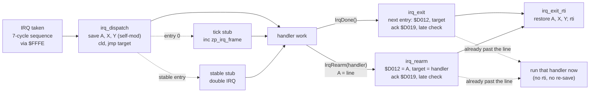
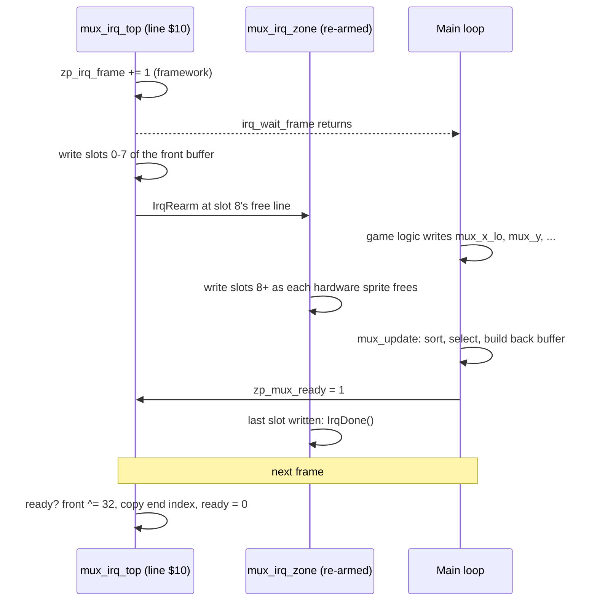
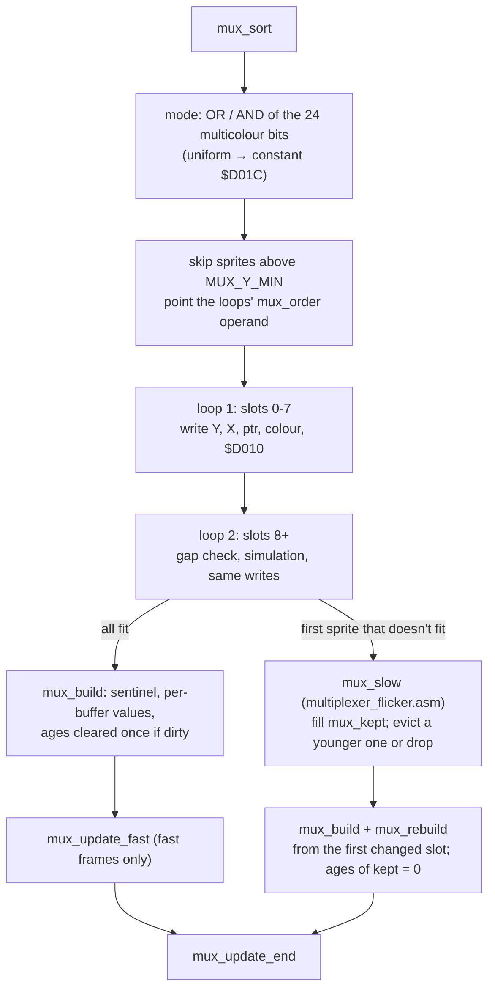
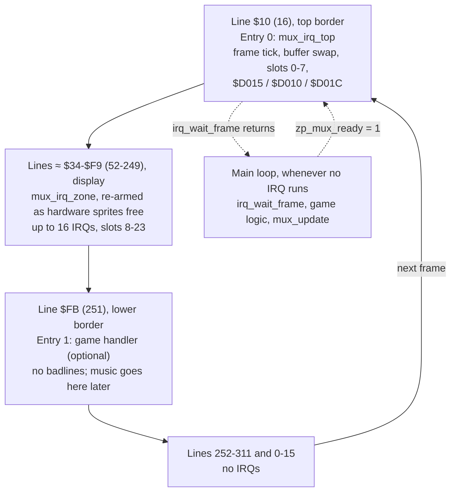
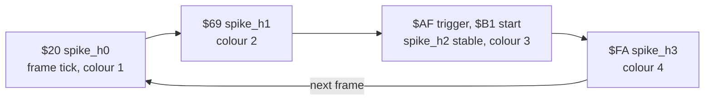

# Engine

Shared modules that every game in the studio builds on. This page is the **design contract**
for M3 ([brief](../docs/milestones/M3-engine-basics.md)): the APIs, zero page, raster timeline
and cycle budgets that the raster-engineer implements and `make test` enforces. The Technical
Director owns it. If the design can't be met, report with numbers and change this page before
the code, not after.

| Module | File | Status |
|---|---|---|
| IRQ framework | `engine/irq.asm` | **Implemented** (M3 stage 1). Costs measured in `tests/engine/irq_chain` |
| Sprite multiplexer v1 | `engine/multiplexer.asm` (+ `engine/multiplexer_flicker.asm`, the slow path) | **Stage 3 implemented** (sort, fast-path select with the build merged in, fair flicker, zone IRQs, double buffer; no pinning yet). Measured in `tests/engine/multiplexer` |

**How to read the numbers.** Every figure is marked:

- **measured**: from a probe, with the reference doc that records it.
- *estimate*: a design figure nobody has measured yet. The full list, and who measures what,
  is in [Estimates to measure in M3](#estimates-to-measure-in-m3). When a figure is measured,
  replace it here, in the routine header, and in the spike's `budget.json`.

---

## Using the engine in a game

```
BasicUpstart2(start)
#import "zp.asm"                        // the game's zero page, including the engine's bytes
.const MUX_SCREEN = $0400               // only if you use the multiplexer (see below)
.const MUX_Y_MAX  = $f9
#import "engine/irq.asm"
#import "engine/multiplexer.asm"        // optional

        IrqChainBegin()
        IrqNormal(MUX_TOP_LINE, mux_irq_top)    // entry 0: the frame entry
        IrqNormal($fb, game_irq_bottom)         // entry 1
        IrqChainEnd()

start:  jsr mux_init                    // before irq_init: entry 0 may fire straight away
        jsr irq_init                    // machine setup; returns with the chain running
main:   jsr irq_wait_frame
        jsr game_update                 // writes mux_x_lo / mux_y / ... for this frame
        jsr mux_update
        jmp main
```

What a game must provide:

| Item | Where | Needed by |
|---|---|---|
| The engine's zero-page labels (`zp_irq_*`, `zp_mux_*`) and `zp_tmp0`–`zp_tmp3` | `games/<title>/src/zp.asm` | [Zero page](#zero-page) |
| A chain: `IrqChainBegin()`, 1–16 entries, `IrqChainEnd()` | Game source | IRQ framework |
| Handlers that end in `IrqDone()` | Game source | IRQ framework |
| `MUX_SCREEN`: the screen whose last 8 bytes are the sprite pointers | `.const` before the import | Multiplexer |
| `MUX_Y_MAX`: largest sprite Y the multiplexer shows (≤ `$F9`) | `.const` before the import | Multiplexer |
| Entry 0 of the chain is `mux_irq_top` at `MUX_TOP_LINE` | Chain | Multiplexer |

Engine modules emit their code and tables where they're imported, so the game places them
with `* = ... "Engine"` like any other block and records them in its memory map.

---

## IRQ framework: `engine/irq.asm`

### Ownership

Only this module writes `$FFFE/$FFFF`, `$FFFA/$FFFB`, `$D012`, `$D019`, `$D01A`, `$DC0D`,
`$DD0D`, and bit 7 of `$D011` (raster compare bit 8). Game code and other engine modules
ask for IRQ time through the chain and the macros below, never by touching these
([coding standards](../docs/standards/coding-standards.md#irq-ownership)).

Rules this imposes on the rest of the game:

- **Chain lines are 0–255.** The compare bit 8 is always 0, so every game write to `$D011`
  (YSCROLL, DEN, bitmap mode) keeps **bit 7 clear**: `and #$7f` before `sta $d011`. Lines
  256–311 (the bottom of the lower border) can still be *run through*, just not triggered on.
- **`$01` stays `$35` whenever interrupts are enabled.** The handlers assume I/O is in and
  don't save `$01` (it would cost 12 cycles per IRQ). Anything that needs `$01=$34`
  (writing RAM under I/O) runs with interrupts off, at init time or with no IRQ due.
- **No long `sei` sections** in the main loop. Every cycle with `I` set delays whichever IRQ
  is due; the multiplexer's zone IRQs have only a few lines of slack.
- The main loop may use decimal mode (BCD scores): the dispatcher clears `D`.

### Machine setup: `irq_init`

```
// Set up the machine and start the raster chain at entry 0.
// In:  nothing (the chain is declared with IrqChainBegin/IrqChainEnd)
// Out: interrupts enabled, chain running
// Uses: A, X
irq_init:
```

It replaces the setup every program has copied from `hello`: `sei`; CIA 1 and CIA 2
interrupts off (`$7F` to `$DC0D`/`$DD0D`, then read both to clear anything pending);
`$01=$35`; `$FFFA/$FFFB` → `irq_nmi` (an `rti`); `$FFFE/$FFFF` → `irq_dispatch`; `$D011`
bit 7 cleared; `$D012` and the dispatch target set for entry 0; `$D01A=$01` (raster only);
all VIC IRQ latches acknowledged (`$FF` to `$D019`); `cli`. It doesn't touch the stack pointer,
the VIC bank, `$D018` or anything else on the screen.

### Declaring the chain

```
        IrqChainBegin()
        IrqNormal(line, handler)        // handler starts on `line`, within the normal jitter
        IrqStable(line, handler)        // handler starts on `line` at the SAME cycle every frame
        ...
        IrqChainEnd()
```

- 1–16 entries (`IRQ_MAX_ENTRIES = 16`), in **ascending line order**, run in order every frame.
  After the last, the chain wraps to entry 0.
- **Entry 0 is the frame entry**: the framework increments `zp_irq_frame` just before its
  handler runs. `irq_wait_frame` returns just after that.
- The macros emit, where `IrqChainEnd()` is: the RAM table `irq_lines` (one byte per entry,
  the trigger line: `line − 2` for a stable entry), `irq_next` (the following entry's index),
  the dispatch-target tables `irq_target_lo`/`irq_target_hi`, the handler tables
  `irq_handler_lo`/`irq_handler_hi` (read by the stable stage 2), all sized to the chain
  (6 bytes per entry, kept in one page), and the entry-0 tick stub. The double-IRQ stages are
  common code in `irq.asm`.
  They assemble-time check (`.errorif`) that there are 1–16 entries, lines are ascending and
  in 0–255, and a stable entry's line is at least 2.
- `irq_lines` may be rewritten from the main loop (one byte, atomic) to move an entry. The
  new line takes effect the next time the chain programs that entry, and must keep the
  lines ascending with enough room for each handler. Handlers can't be changed at run time
  (use `IrqRearm` for dynamic work).

### Dispatch model

`$FFFE/$FFFF` point at `irq_dispatch` permanently (except inside a stable entry's double IRQ).
The per-entry "vector switching" is the dispatcher's self-modified `jmp` target, set from
`irq_target_lo/hi` by the exit code. This costs 3 cycles more than switching `$FFFE` itself,
and buys two things: every IRQ enters through **one address**, which lets the budget runner
exclude IRQ time when it measures main-loop code, and the vector can never be left pointing
at a half-written address.



### Handler conventions

On entry to a handler:

| State | Guarantee |
|---|---|
| A, X, Y | Free to use. The framework saved them and restores them |
| `D` flag | Clear |
| `I` flag | Set. **Never `cli`** in a handler (only the framework's stable stage does) |
| `$01` | `$35` (given the rule above) |
| Stack | Free to use; the IRQ itself uses 3 bytes (6 during a stable entry) |
| `$D019` | Not yet acknowledged. **Don't touch it**: the exit does it |

A handler ends with exactly one of:

| Macro | Expands to | Effect |
|---|---|---|
| `IrqDone()` | `jmp irq_exit` | Advance to the next chain entry, acknowledge, restore, `rti` |
| `IrqRearm(handler)` | `ldx #<handler / ldy #>handler / jmp irq_rearm` | With the line in **A**: fire `handler` at that line, *without* advancing the chain. The multiplexer uses this for its zone IRQs |

`irq_exit` and `irq_rearm` write `$D012` and the target **first**, then acknowledge `$D019`,
then do the **late check**: if the raster is already on or past the new line, the IRQ would
not fire until next frame, so they acknowledge again (clearing a latch that may have happened
between the first ack and the check) and jump straight to the next handler with the registers
still saved. The next handler runs late, but it runs exactly once, and the chain stays in step.
The wrap to entry 0 is exempt from the check. Each late run increments `irq_late_count`
(1 byte, saturating at 255, DEBUG builds only), and `make test` requires it to stay 0 in every
spike: a late run means a budget was blown.

The last entry's handler must finish before line 311 ends, or entry 0 misses a frame (not
detected in v1).

### Stable handlers

`IrqStable(line, handler)` makes `handler`'s first instruction run on `line` at the same
raster cycle every frame: `IRQ_STABLE_CYCLE` = **cycle 6** (**measured**: `irq_chain` spike,
1,000 of 1,000 frames on cycle 6, with stage 1 arriving on 8 different cycles and stage 2 on
2, via `tests/engine/irq_chain/measure.py`). It uses the double IRQ from
[raster-interrupts.md](../docs/reference/raster-interrupts.md#jitter-and-stable-rasters): the chain
triggers at `line − 2`; the stable stub (label `irq_stable_begin`, common code) points
`$FFFE` at stage 2, sets `$D012` to the next line, acknowledges, `cli`s and runs `NOP`s;
stage 2 arrives with at most 1 cycle of jitter, discards its own 3-byte interrupt frame,
restores `$FFFE` to `irq_dispatch`, and removes the last cycle with a `$D012` compare
across the line change. Then it jumps to the handler, which exits normally.

Implementation notes (as built):

- Stage 1 and stage 2 switch only the **low byte** of `$FFFE`: `irq_dispatch` and
  `irq_stable_stage2` are assembled into one page (asserted). Stage 2 finds the handler
  through `irq_handler_lo/hi` indexed by `zp_irq_idx`, in the time it has to burn anyway.
- Stage 2 doesn't acknowledge its own latch: `I` is set until the handler's `irq_exit`, which
  acknowledges after writing `$D012`.
- Stage 2's wait (`IRQ_STABLE_DELAY`, `IRQ_STABLE_PAD` in `irq.asm`) was set by measurement.
  Changing any instruction in stage 2 needs the spread re-measured.
- If stage 2's IRQ never arrives (stage 1 started too late, e.g. after a long `sei` in the main
  loop), stage 1's `NOP` slide falls through to a fallback that runs the handler at once,
  unstable, and counts a late run. Stage 1 reaches `cli` 22 cycles after it starts, so it must
  start by about cycle 40 of `line − 2` (*counted*; it measured 26–33 with the worst main loop).

Constraints:

- Lines `line − 2` to `line` must **not be badlines** (the `NOP` slide needs the bus), and the
  sprite DMA on them must be the same every frame. Put stable entries in the border or in a
  gap between badlines ($AF–$B1 is fine with the default YSCROLL=3: badlines are at 51 + 8n,
  measured, [vic-ii-timing.md](../docs/reference/vic-ii-timing.md#badlines)), and never inside
  the multiplexer's region.
- Its exit may run into a badline: that only lengthens the entry's span
  ([DMA inside an IRQ](#dma-inside-an-irq)), it doesn't affect stability.
- Cost: 99–106 cycles more than a normal entry (**measured**, see [Costs](#irq-framework-costs)).
- An NMI (RESTORE key) during the stage costs one frame of stability. Accepted.

### Jitter guarantee

A normal handler starts on its line within **7 cycles** of its earliest possible start
(**measured**: spread exactly 7 on every entry of the `irq_chain` spike over 1,000 frames, with a
worst-case main loop that includes taken branches right before 7-cycle `inc abs,x`; the IRQ
sequence starts on cycle 2 of the trigger line at the earliest, so a normal handler's first
instruction runs on cycle **26–33**, entry 0's on **34–41**;
[raster-interrupts.md](../docs/reference/raster-interrupts.md#jitter-and-stable-rasters)), **provided no
badline or sprite DMA falls between the trigger and the handler**. DMA delays it by up to the
DMA on that line: 43 cycles for a badline, 81 for a badline with sprites 0–7 active around it
(**measured**, [vic-ii-timing.md](../docs/reference/vic-ii-timing.md#badline-and-sprites-on-the-same-line)).
Trigger normal entries on non-badlines when their start time matters.

### DMA inside an IRQ

The framework costs below are raster time on lines with no DMA. A badline (43 cycles,
**measured**) or sprite DMA anywhere in an IRQ's span, from the trigger to the `rti`, lengthens
that span by the cycles stolen. A normal handler starts on cycle 26–33, so with W cycles of work
its `irq_exit` starts at about cycle 36 + W and, for any small handler, runs into the next line
(**measured**: `irq_exit` 102–103 when the next lines were badlines 107 and 179, the `irq_chain`
spike's first layout at $6A and $B2, against 60 everywhere else).

What that does and doesn't cost:

- **No CPU time.** The VIC takes those cycles whatever code is running: if the IRQ didn't span
  the badline, the main loop would lose the same 43. The [frame budget](#frame-budget) counts every
  badline and sprite DMA once in its DMA rows, so an IRQ spanning DMA costs the frame nothing
  extra. (Its IRQ rows are raster time, so that DMA is counted twice, on purpose, as margin.)
- **Latency.** Whatever follows the IRQ happens later: the next chain entry can't start before
  this one's `rti`, and the main loop resumes later. This matters where IRQs are packed
  closely, which in practice means the multiplexer's zone IRQs.
- **Measurement.** A `profile` check's max includes any DMA inside the span.

Rules:

1. **Spikes that lock a framework path to its measured cost** (`irq_chain`) place each entry so
   no badline or sprite DMA falls between its trigger and its `rti`. For a small handler that's
   the trigger line and the next one: that's why the spike uses $69 and $B1.
2. **Games don't have to.** Put fixed entries where the effect needs them and budget each
   entry's **raster span**: framework overhead + work + the DMA on the lines it covers (43 per
   badline, up to 81 for a badline with sprites 0–7, **measured**,
   [vic-ii-timing.md](../docs/reference/vic-ii-timing.md#badline-and-sprites-on-the-same-line)).
   A game that scrolls vertically moves its badlines with YSCROLL and couldn't keep them clear
   anyway. Keep DMA out of an entry's span only when its *timing* matters: another entry close
   behind it, or a register write that must land by a given cycle.
3. **Stable entries** keep their hard rule (lines `line − 2` to `line` free of badlines, same
   sprite DMA every frame). Their exit may cross a badline.
4. **Multiplexer budgets** are raster spans in the display area, DMA included by design. Zone IRQs
   can't avoid badlines, and their budgets and scheduling constants must allow for them.

### Frame sync

```
// Wait for the next frame tick (entry 0 has just started).
// In: nothing   Out: A = new zp_irq_frame   Uses: A
irq_wait_frame:
```

`zp_irq_frame` is a free-running 8-bit counter. A game that needs to detect a missed frame
compares it with the value it saw last time (a difference of more than 1 = an overrun).

### IRQ framework costs

**Measured** in the `irq_chain` spike (VICE 3.10 x64sc PAL, 2026-09-29), with
`tests/engine/irq_chain/measure.py` over 1,000 frames and confirmed with `vice_profile`. Raster
cycles, no DMA on the lines involved.

| Part | Cycles | Basis |
|---|---|---|
| IRQ sequence starts (earliest) | cycle 2 of the trigger line | **measured** (lines 32, 105, 175, 250; line 0 not measured) |
| Interrupt sequence | 7 | [6502-timing.md](../docs/reference/6502-timing.md) (standard figure) |
| Jitter: finishing the interrupted instruction | 0–7 | **measured**, worst-case main loop, all 8 values seen on every entry |
| `irq_dispatch`: 3 self-mod saves (12), `cld` (2), `jmp` (3) | 17 | **measured** (`vice_profile irq_dispatch → spike_h1`: 17 every pass) |
| **Handler starts** after the IRQ is taken | **24** | **measured** (dispatch hit + 17) |
| Frame tick stub, entry 0 only | +8 | **measured** (h0 starts 25 after dispatch) |
| `irq_exit` → `irq_exit_rti` (advance, `$D012`, target, ack, late check, restore) | **60** (58 on the wrap) | **measured**, every pass; equals the instruction count. The budget is locked to it |
| `irq_rearm` → `irq_exit_rti` (`$D012`, target, ack, late check, restore) | **41** | **measured** (M3 stage 2): `irq_chain` `spike_h2` re-arms `spike_h3`, `irq_rearm` on line 177 from cycle 21, 41 in 1,000 of 1,000 passes; equals the count (35 to `jmp irq_restore` + 6) |
| `rti` + the handler's `jmp irq_exit` | 9 | [6502-timing.md](../docs/reference/6502-timing.md) |
| **Total per normal entry, excluding its work** | **93** (+8 on entry 0) | **measured** parts |
| Stable entry, extra: `irq_stable_begin` → handler | **99–106** (1.7 lines) | **measured** |
| **Total per stable entry, excluding its work** | **192–199** | **measured** parts |
| Total per re-armed IRQ (`IrqRearm`, e.g. a zone IRQ), excluding its work | 78: 7 + 17 + 7 (macro) + 41 + 6 | **measured** parts |
| All four `irq_chain` handlers, per frame (runner's IRQ-span definition) | **488–495** | **measured**, 1,000 frames (stage 2 layout: h2 ends in `IrqRearm`, 13 less than its old `IrqDone`; was 501–508 with four chain entries). Locked at 495, and `irq_rearm` at 41, in `irq_chain/budget.json` |

**Budgets for these are locks, not allowances.** Each path is straight-line code measured
where no DMA touches it, so the figure is exact and repeatable, and
`tests/engine/irq_chain/budget.json` sets each budget *equal* to it. Headroom there could only
hide a regression, and every framework cycle is paid by every IRQ (up to 18 a frame in a
multiplexer game). A change to `irq.asm` that moves one of these figures is re-measured and
re-baselined on purpose. Games get their headroom from the [frame budget](#frame-budget).

**Why `irq_exit` stays at 60.** Reviewed after stage 1: the only removable parts are the raster
bit 8 check (6: it catches a handler overrunning into lines 256–311) and the dispatch-target
write (16: the price of the single-entry dispatcher, a design decision). Both are worth what they
cost. At most one `irq_exit` runs per chain entry; zone IRQs use `irq_rearm` (41).

The exit's 60 cycles: `irq_next` table (10 for index advance), `$D012` (8), target (16), ack (6),
late check against the line (8) and raster bit 8 (6, so a handler that overruns into lines
256–311 is caught too), restore (6).

For comparison, `hello`'s hand-written handlers cost about 50 cycles each with no register
save beyond A, no table and no late check.

### Labels exported for tests

`irq_dispatch`, `irq_exit`, `irq_rearm`, `irq_exit_rti` (the `rti` itself), `irq_stable_begin`,
`irq_nmi`, `irq_late_count`, `irq_lines`. The budget runner depends on these names. Also
emitted: `irq_stable_stage2`, `irq_next`, `irq_target_lo/hi`, `irq_handler_lo/hi`, `irq_tick`,
`IRQ_COUNT`, and the constant `IRQ_STABLE_CYCLE`.

---

## Sprite multiplexer v1: `engine/multiplexer.asm`

24 virtual sprites on the 8 hardware sprites, sorted by Y each frame, with fair flicker
when too many share a row. Decisions from the brief: 24 sprites, flicker rather than drop.

### Constants

| Constant | Value | Set by | Meaning |
|---|---|---|---|
| `MUX_COUNT` | 24 | Engine | Virtual sprites |
| `MUX_OFF` | `$FF` | Engine | Y value that hides a virtual sprite |
| `MUX_TOP_LINE` | `$10` (16) | Engine | Line of `mux_irq_top` (chain entry 0) |
| `MUX_Y_MIN` | `$1E` (30) | Engine | Smallest Y shown. Y=29 is displayed on lines 30–50, all border |
| `MUX_Y_MAX` | ≤ `$F9` (249) | **Game** | Largest Y shown. Y=249 is the last with a visible line (250) |
| `MUX_SCREEN` | e.g. `$0400` | **Game** | Screen whose `+$3F8…$3FF` get the sprite pointers |
| `MUX_FREE_AFTER` | 22 | Engine | A hardware sprite is free to rewrite on line `Y_old + 22`. *Estimate*: display on Y+1 to Y+21 is unmeasured (no glitches seen in the stage 2 screenshots) |
| `MUX_IRQ_LINES` | 1 | Engine | Lines from a zone IRQ's trigger to its first write. **Measured** (stage 2, 2,000 zone IRQs): 0 or 1, and 2 once; the slack in `MUX_WRITE_LINES` absorbed it (`mux_late_count` 0) |
| `MUX_WRITE_LINES` | **2** | Engine | Lines to write one slot, allowing for DMA. **Measured** (stage 2): 1 failed (`mux_late_count` 139 in 3,000 frames); a slot takes 78 cycles block to block with no DMA (DEBUG), up to ~2 lines with DMA. 2 gives 0 late, with ≥ 7 lines of margin on back-to-back full rows |
| `MUX_MAX_PINNED` | 4 | Engine | Most sprites honoured as pinned in one frame (decision, not a measurement) |
| `MUX_PIN_EVICT_MAX` | 8 | Engine | Most evictions pinned sprites may make in one `mux_update`. Bounds the worst case. *Estimate*: set from cost, revisit once measured |

Sprites with Y outside `MUX_Y_MIN`–`MUX_Y_MAX` (including `MUX_OFF`) are not shown and cost
nothing.

### Per-frame data the game writes

Structure of arrays, indexed by virtual sprite 0–23. Written **by the main loop only**, before
it calls `mux_update` in the same frame; nothing reads them until then, so there's no race.

| Array | Bytes | Contents |
|---|---|---|
| `mux_x_lo` | 24 | X bits 0–7 |
| `mux_x_hi` | 24 | X bit 8 in bit 0; other bits 0 |
| `mux_y` | 24 | Y (as the VIC-II register). `MUX_OFF` to hide |
| `mux_ptr` | 24 | Sprite pointer: data at VIC bank base + ptr × 64 |
| `mux_col` | 24 | Colour, bits 0–3 |
| `mux_flags` | 24 | Bit 0: multicolour. Bit 7: **pinned**, never evicted by flicker (at most 4: see [Pinned sprites](#pinned-sprites)). Bits 1–6 reserved, write 0 |

Registers the multiplexer owns (nothing else writes them): `$D000–$D010`, `$D015`, `$D01C`,
`$D027–$D02E`, and `MUX_SCREEN+$3F8…$3FF`. The game owns the shared multicolours
`$D025/$D026` and priority `$D01B`. `$D017` and `$D01D` (Y and X expansion) must be 0: v1
assumes 21-line sprites.

### API

```
// Hide all virtual sprites and reset the multiplexer. Call once, before irq_init.
// In: nothing   Out: nothing   Uses: A, X
mux_init:

// Sort, select and build the next frame's sprites into the back buffer. Main loop, once per
// frame, after writing the arrays above. Doesn't block.
// In:  nothing
// Out: C=0 queued for the next mux_irq_top; C=1 skipped (the previous build hasn't been shown yet)
// Uses: A, X, Y, zp_tmp0-zp_tmp3
// Cost: measured 4,264 avg raster cycles in frames with no overflow (stage 3 fast path; stage 2
//       was 6,240), more in frames that flicker: see Multiplexer costs. Budgets in
//       tests/engine/multiplexer/budget.json
mux_update:

// Chain entry 0 (IrqNormal(MUX_TOP_LINE, mux_irq_top)). Internal: mux_irq_zone.
mux_irq_top:
```

### Frame flow and double buffering

The IRQs never read what the main loop is writing. `mux_update` writes a **back buffer** of
slot arrays; `mux_irq_top` swaps it in at the top of the next frame, before any sprite is
displayed. Each slot array is 64 bytes: buffer 0 uses indices 0–23 and buffer 1 uses 32–55,
so `zp_mux_front` (0 or 32) is just a base added to the slot index, and the IRQs pay nothing
for the double buffer.



- **Latency:** positions written in frame N are on screen in frame N+1, provided the main
  loop (game logic + `mux_update`) finishes within the frame. If it doesn't, the previous
  frame's sprites are shown again (no tearing, no garbage) and `mux_update` returns C=1 if
  called again before the swap.
- The slot arrays (all 64 bytes, `.align $40` so indexed reads never cross a page):
  `mux_s_y`, `mux_s_xlo`, `mux_s_ptr`, `mux_s_col`, `mux_s_d010`, `mux_s_d01c`
  (the cumulative `$D010`/`$D01C` value after this slot is written), `mux_s_free`
  (the line on which the slot's hardware sprite is free: `mux_s_y[k−8] + MUX_FREE_AFTER`).
  Plus `mux_s_count` (the back buffer's end index, copied to `zp_mux_end` on the swap).

### Sort

Insertion sort of an index list, `mux_order`, by `mux_y`. `mux_order` persists between
frames, so it's nearly sorted and each frame costs about one compare per sprite plus one
shift per pair that swapped places. Hidden sprites sort as Y = `$FF` (to the end) and are cut
off there.

Worst case (list fully reversed, e.g. after many sprites teleport) is 276 shifts: about 6,000
cycles (*estimate*). That's a main-loop cost, so the effect is one repeated frame, not a
display glitch. Spawn code should place new sprites with a sensible Y (not all at 0).

### Hardware sprite assignment

Kept sprites, in Y order, become slots 0, 1, 2…; **slot k uses hardware sprite k mod 8**
(round robin). The sprites active on any one line are then a consecutive run mod 8, which is at
most two DMA groups: the cheap case per the measured DMA costs
([vic-ii-timing.md](../docs/reference/vic-ii-timing.md#sprite-dma): 2 cycles per sprite + 3 per group).
The run can wrap (7 → 0), which costs one extra group (3 cycles a line) against starting
again at 0; accepted, because restarting at 0 would need an idle hardware sprite.

### Scheduling, and the minimum vertical separation

Slot k (k ≥ 8) can't be written until slot k−8, on the same hardware sprite, has finished
displaying (line `y[k−8] + MUX_FREE_AFTER`), and must be written before its own Y line. The
selection pass **simulates the zone IRQs** in raster lines with the three constants above, so
it only keeps sprites the IRQs can actually write in time:

```
done[-1] = 0
free_k  = (k < 8) ? MUX_TOP_LINE : y[k-8] + MUX_FREE_AFTER
start_k = max(free_k + MUX_IRQ_LINES, done[k-1])     // new IRQ, or carry on in the current one
done_k  = start_k + MUX_WRITE_LINES
slot k fits  <=>  done_k <= y[k]
```

What that gives, with the stage 2 constants (22 / 1 / 2, the last two **measured**):

| Layout | Minimum Y gap to the sprite 8 places earlier in Y order |
|---|---|
| One sprite reusing a hardware sprite | **25 lines** (22 + 1 + 2; was 24 with the estimated 1) |
| A full row of 8 directly below another full row | **39 lines** (22 + 1 + 16; was 31). The spike runs full rows at exactly 39 with `mux_late_count` 0 and ≥ 7 lines to spare. A finer model could get back to about 33, but **not in v1** (Technical Director, after stage 2): see below |
| Slots 0–7 (written by `mux_irq_top` from line 16) | Y ≥ 18 + slot, always met since Y ≥ `MUX_Y_MIN` (30) |

**Why not model slot writes in half-lines (39 → ~33)?** Decided after stage 2: not in v1.

- **Cost.** Half-line units don't fit a byte (Y up to 249 is 498 half-lines), so the simulation
  goes to 16 bits or scaled tables, about +10–15 cycles per zone slot. That runs against build
  rule 3.
- **Benefit.** It only helps two full rows stacked 33–38 lines apart, which is the overload boundary,
  and flicker (stage 3) handles that case anyway.
- **Risk.** It spends the margin that `MUX_WRITE_LINES` = 2 buys against a slot that straddles a
  badline with 8 sprites (up to 81 cycles stolen, **measured**).

The v2 candidate that costs no CPU: charge the first slot of an IRQ `MUX_IRQ_LINES + 2` lines and
each continuation slot 1 line. The simulation's two branches already tell these cases apart. It
needs its own proof: `mux_late_count` = 0 in a spike that puts continuation slots on badlines with
8 sprites.

So "at most 8 on a row" means, for this multiplexer, at most 8 sprites within any 25-line
window (39 for back-to-back full rows), not 8 on one raster line. The QA soak test's
"≤ 8 on a row" should be read that way.

The IRQ side doesn't need a plan: `mux_irq_zone` writes slot k, then carries on with slot k+1
if `mux_s_free[k+1]` ≤ the current raster line, re-arms at `mux_s_free[k+1]` if not, and calls
`IrqDone()` after the last slot. It writes `$D010`/`$D01C` from the cumulative slot values.
In DEBUG builds it also checks, before each slot, that the raster hasn't reached the slot's Y
line; if it has, it increments `mux_late_count` (saturating). **That counter is how the
estimated constants get validated**: the spike must run with it at 0, and if it doesn't, the
constants are raised until it does.

### As built (stage 2)

Details the design left open, as implemented in `engine/multiplexer.asm`:

- **Zone IRQ dispatch.** `mux_irq_zone` is re-armed with `IrqRearm(mux_irq_zone)`, loads the slot from
  `zp_mux_slot` and jumps through a 64-entry table to one of 8 unrolled blocks, one per hardware
  sprite, which write `$D000+2j`, `$D001+2j`, the pointer and `$D027+j` with absolute addresses
  (22 cycles to dispatch, 48 per slot for the six writes). Block j falls through to block j+1.
- **Next slot.** After a slot, block j checks slot k+1's free line against the raster: already free →
  straight on (19 cycles); frees within 2 lines → wait in the IRQ; 3 or more lines away → re-arm
  there. The 3-line threshold keeps `irq_rearm`'s own late check from seeing the line (between the
  two raster reads, ~35 CPU cycles, a badline with 8 sprites can pass 2 lines), which would count
  in `irq_late_count`. Waiting up to 2 lines costs about what a fresh IRQ would (~110 cycles).
  **Kept as is** (Technical Director, after stage 2):
  - A re-arm costs 107–114 CPU cycles: 7 in `mux_zone_rearm` + the 78 per re-armed IRQ
    ([Costs](#irq-framework-costs): 7 macro + 41 `irq_rearm` + 6 `rti` + 7 sequence + 17 dispatch)
    + 22 zone dispatch, **measured** parts, plus 0–7 jitter. A 2-line wait is at most 126 raster
    cycles, some of it DMA the main loop would lose anyway. The CPU break-even is about 1.7 lines,
    so moving the threshold would gain at most ~20 cycles per slot (≤ ~300 in a pathological frame,
    typically 0–100).
  - It would also make `irq_late_count` fire on benign races. That counter is how `make test` detects
    a blown budget, so it has to stay clean.
  - The long zone IRQ this produces (1,500 max) delays nothing: no fixed entry may sit in the zone
    region. Only the per-frame IRQ total costs the game.
- **Per-buffer values** (end index, `$D015`, and `$D010`/`$D01C` after slots 0–7) live at index
  base + 24 of the slot arrays (`mux_b_end`, `mux_b_d015`, `mux_b_d010`, `mux_b_d01c`), so the slot
  arrays stay 64 bytes each.
- **The selection walk ends on a sentinel**: `mux_order[24]` = 24 with `mux_y[24]` = `$FF`, so the
  walk needs no counter; it stops at the first Y above `MUX_Y_MAX`.
- `mux_irq_top` writes all 8 hardware sprites every frame and enables only the first min(n, 8) with
  `$D015`, so a frame with fewer than 8 sprites needs no special path.
- **Stage 2 has no flicker and no pinning.** A sprite that doesn't fit is dropped for the frame
  (`mux_drop_count`, age +1), with no rotation; `mux_flags` bit 7 is ignored.

### As built (stage 3)

What changed from stage 2, in `engine/multiplexer.asm` and `engine/multiplexer_flicker.asm`:



- **Fast path** ([Fast path](#fast-path)). The selection writes each kept sprite's slot arrays
  directly (`mux_s_y/xlo/ptr/col/d010/free/done`); there's no second walk. Two loops: slots 0–7
  (always fit, no simulation, 68–70 cycles per slot, counted) and slots 8+ (108 per slot for a
  new zone IRQ, 124 when carrying on in the previous slot's IRQ). Sprites above `MUX_Y_MIN` are
  skipped once up front (they sort first), and both loops read `mux_order` through a
  self-modified low byte (`mux_order + skipped − base`), so no order counter is kept.
- **Trimmed simulation.** A new IRQ fits exactly when `y − y[k−8] ≥ MUX_GAP_MIN` (25), which
  is checked first and bounds every later sum below 256, so the three overflow branches are
  gone. Carrying on also needs `done[k−1] + MUX_WRITE_LINES ≤ y`. `done` per slot lives in
  `mux_s_done` (main loop only), which the eviction re-simulation needs.
- **The fast path writes neither `mux_kept` nor `mux_age`.** At the first sprite that doesn't
  fit, `mux_fill_kept` fills `mux_kept` for the slots so far (they're consecutive in
  `mux_order`), and the rest of the frame runs the slow loop, which writes only `mux_s_y`,
  `mux_kept`, `mux_s_free`, `mux_s_done`. `mux_build` then rebuilds X, pointer, colour and
  `$D010` from `mux_slow_from` (the first sprite that failed, or an earlier evicted slot). A pure
  drop doesn't need a rebuild of the slots before it, so the rebuild starts at the first change,
  not at slot 0.
- **Ages.** Kept sprites' ages are zeroed only in slow frames (a pass over `mux_kept`), and a
  frame with a drop sets `mux_dirty`. The next frame with no drop zeroes all 24 ages once (an
  unrolled store) and clears the flag; fast frames with the flag clear touch no age at all.
  Consequence: a sprite that went off-screen while waiting its turn loses its seniority at the
  next frame with no drop. It wasn't missing while off-screen, so that's intended.
- **Constant `$D01C`.** `mux_select` ORs and ANDs bit 0 of all 24 `mux_flags` (unrolled, ~100
  cycles; hidden sprites count, which can only make it take the mixed path). If they're all the
  same, `mux_irq_top` writes `$00` or `$FF` once, and the buffer's zone-block table points at a
  set of blocks that don't write `$D01C`. Mixed frames build the cumulative `mux_s_d01c`
  (`mux_mixed_d01c`) and use the other block set. The table (`mux_t_blk_lo/hi`) is rewritten
  for the back buffer only when its mode changes (`mux_set_blocks`), so the IRQ pays nothing.
- **End of the slot list.** `mux_s_free[end]` = `$FF` (a sentinel), so the zone block's
  "next slot free already?" test fails after the last slot and the end test is off the fast
  path. `mux_b_end` moved to `mux_s_col + 24` to make room.
- **`mux_update_fast`**: a label only fast frames reach, at its own address just before the
  common `mux_update_end`. `budget.json` profiles `mux_update → mux_update_fast` to check the fast
  path on its own in a spike that overloads rows (a slow frame's pass is restarted by the next
  `mux_update`). It costs 8 cycles a frame.
- **Fair flicker** (pinning off): see [Overflow: fair flicker](#overflow-fair-flicker). As built,
  `mux_slow_fail` drops at once a sprite with age 0 (it can't beat anyone). Otherwise it scans the
  last 8 kept for the youngest that is *strictly* younger than v (later wins ties). A dry run then
  computes slot k−2's done line with w removed. Each shifted slot's partner 8 places earlier is
  before w, so free lines don't move and only v needs checking. If v fits, the commit shifts
  `mux_kept`/`mux_s_y` down, puts v in slot k−1, re-simulates from max(w, base + 8), and counts
  w as dropped (age + 1).

### Overflow: fair flicker

When a sprite doesn't fit, something must be dropped for this frame. Simon's decision is that
nothing vanishes permanently, so the choice rotates. Each virtual sprite has an age,
`mux_age` (frames since it was last shown, saturating at 255). Selection walks the sprites in
Y order:

```
pinned[v] = flags bit 7, for the first MUX_MAX_PINNED such sprites in virtual order 0-23
pin_evictions = 0
for each shown-range sprite v in mux_order:
    if v fits after the kept list: keep v
    elif pinned[v]:                                        // see "Pinned sprites"
        while v doesn't fit and pin_evictions < MUX_PIN_EVICT_MAX
              and an unpinned sprite is among the last 8 kept:
            remove the youngest unpinned of the last 8 kept; pin_evictions += 1
        keep v if it fits now, else drop v (mux_pin_drop_count += 1)
    else:
        w = the youngest UNPINNED of the last 8 kept (lowest age; on a tie, the later one)
        if w exists and age[v] > age[w] and v fits once w is removed:
            remove w (shift up to 7 kept entries, re-simulate them), keep v
        else: drop v
age[v] = 0 if kept, else age[v] + 1
```

Removing a kept sprite never breaks the ones after it (their "8 places earlier" sprite moves
up the screen, which only gives them more time), so one pass is enough. The effect: a sprite
dropped last frame beats one that was shown, so crowded sprites take turns. Worked through
by hand, with nothing pinned: 9 on a row, the two extras alternate (each missing at most 1
frame in 2); 24 on one row, three sets of 8 rotate (each missing 2 frames in 3).

**Flicker target for unpinned sprites.** With P pinned sprites in a crowded window, the
unpinned ones share 8 − P hardware sprites, so n unpinned sprites competing in one window
should each be missing for at most **⌈n / (8 − P)⌉ − 1 consecutive frames**:

| Pinned in the window (P) | Unpinned competing (n) | Longest run missing |
|---|---|---|
| 0 | up to 24 | 2 |
| 1 | up to 21 | 2 |
| 1 | 23 | 3 |
| 4 | up to 12 | 2 |
| 4 | 20 | 4 |

That's a design target, not a proof. `mux_max_age` (the DEBUG high-water mark) covers
**unpinned sprites only**; pinned sprites have their own counter. A pinned sprite's forced
evictions take the youngest unpinned sprite first, the same choice the age rule makes, so
they don't break the rotation. They just take capacity from it.

With ≤ 8 sprites in every window, nothing is ever dropped and nothing flickers, pinned or not.
So the QA soak criterion from the brief (no sprite missing more than 2 frames when ≤ 8 are on
a row) is unaffected by pinning.

### Pinned sprites

Decision (Simon): the player's sprite must not flicker. A virtual sprite with `mux_flags`
bit 7 set is **pinned**: it's never chosen for eviction, and when it doesn't fit it evicts
unpinned sprites until it does.

- **Selection.** A pinned sprite that fits is kept like any other. One that doesn't evicts
  the youngest unpinned sprite among the last 8 kept, and repeats (each removal brings an
  earlier kept sprite into the last 8) until it fits. It ignores ages: a pinned sprite beats
  any unpinned one. Unpinned sprites never evict a pinned one.
- **At most 4.** The first 4 sprites with bit 7 set, in virtual order 0–23, are pinned; any
  more are treated as unpinned that frame and flicker normally. So the game should pin its
  most important sprites at the lowest indices (the player at 0). Each frame with more than 4
  pinned increments `mux_pin_excess_count` (DEBUG).
- **Why 4 is always schedulable.** With the estimated constants, 4 pinned sprites never fill
  a hardware-sprite window (8), and a row of 4 needs 22 + 1 + 4 = 27 clear lines above it once
  the unpinned sprites there are evicted, which eviction provides. So **with ≤ 4 pinned sprites
  in the shown range, every one is shown every frame**, unless the eviction cap runs out.
- **The cap.** `MUX_PIN_EVICT_MAX` (8, *estimate*) bounds the evictions pinned sprites may
  make in one `mux_update`, so the worst case stays about 8 × 350 = 2,800 cycles
  (*estimate*) above normal selection. Reaching it needs several pinned sprites inside dense
  crowds in the same frame. If a pinned sprite still doesn't fit, it's **dropped for that frame**
  (never shown in the wrong place, never left half-written) and `mux_pin_drop_count` increments
  (DEBUG, saturating). Its age still counts, and next frame it evicts as before.
- **Off-screen.** A pinned sprite with Y outside `MUX_Y_MIN`–`MUX_Y_MAX` is hidden, as any
  sprite is. That isn't a drop and isn't counted.
- **Effect on the other sprites.** Every pinned eviction is an unpinned sprite
  dropped, so pinning a sprite that sits in a crowd makes the others flicker more (see the
  table above). That's the trade Simon chose.

### Multiplexer costs

**Measured in stage 2** (VICE 3.10 x64sc PAL, DEBUG build, `multiplexer` spike, 24 shown sprites in
3 groups of 8, 300 passes; no flicker or pinning code yet). Two figures for the main-loop routines:
**CPU** (sprites and the display turned off, so no DMA: what the code costs) and **raster** (in the
spike: the main loop runs through the display with 24 sprites, so badlines and sprite DMA take
about 27% more). `make test` checks the raster figure. The stage 2 measurements, min / avg / max,
with the raster maxima re-taken over **600 passes** (a full cycle of the spike's motion, ~480
frames; the 300-pass figures missed some maxima), and the budgets the Technical Director set from
them:

| Routine | CPU | Raster, 600 passes (what `make test` sees) | Budget (raster) | Was |
|---|---|---|---|---|
| `mux_sort` | 436 / 598 / 2,237 | 479 / 705 / 3,315 | **3,500** | 1,500 (*estimate*). The max is the spike reversing three groups of 8 at once (a stress case); normal frames ~600 CPU |
| `mux_select` | 2,165 / 2,183 / 2,193 | 2,364 / 2,832 / 3,295 | **3,450** | 2,200. ~55 CPU per sprite in slots 0–7, ~100 in slots 8+ (the simulation) |
| `mux_build` | 2,175 / 2,183 / 2,189 | 2,349 / 2,767 / 3,272 | **3,450** | 1,800. ~88 CPU per slot, ~46 of it the cumulative `$D010`/`$D01C` |
| `mux_update` | 4,826 / 4,984 / 6,639 | 5,263 / **6,240** / 8,595 | **9,050 max, 6,550 avg**; fast path **avg ≤ 5,000** from stage 3 | 5,600 |
| `mux_irq_top` → `irq_exit_rti` | 378 every pass | 378 (top border, no DMA) | **378** (a lock) | 600 |
| `mux_irq_zone` → `irq_exit_rti`, one IRQ | 702 / 909 / 1,448 | 744 / 962 / 1,500 (2,000 IRQs) | **1,600** | 550. Every zone IRQ in the spike writes 8 slots, including in-IRQ waits of up to 2 lines per slot |
| One zone slot, block to block | 78 (67 release) | 78 to ~190 (DMA, waits) | (none) | ~60. 48 writes + 11 DEBUG late check + 19 next-slot check |
| All IRQ time in one frame | 1,982–3,452 | 2,067–3,562 (600 frames) | **3,750** | 3,300 |
| Free per frame (`spike_idle_min` × 16) | 5,888 | (none) | **≥ 5,300** (the game promise, see [Frame budget](#frame-budget)) | ≥ 5,000 |

**Measured in stage 3** (VICE 3.10 x64sc PAL, DEBUG, 2026-09-29/30). Raster cycles in the spike,
DMA included, min / avg / max, all through the budget runner (`profile_excl_irq`, the same method
as `make test`) with a scratch `budget.json` that sets 600 samples on every routine. The zone
figures come from `tests/engine/multiplexer/measure.py 300`.

*Phase A, the fast path*, measured on the stage 2 spike motion (≤ 8 per window, so every frame
is a fast frame). Before = stage 2 code, re-measured the same way (it reproduced the stage 2
record exactly):

| Routine | Stage 2 | Stage 3 fast path | Change |
|---|---|---|---|
| `mux_sort` | 479 / 705 / 3,315 | 455 / 703 / 3,315 | unchanged (not touched) |
| `mux_select` | 2,364 / 2,832 / 3,295 | 2,771 / 3,455 / 3,933 | now includes the build |
| `mux_build` | 2,349 / 2,767 / 3,272 | 142 / 186 / 283 | now only the per-buffer tail |
| select + build (avg) | 5,599 | 3,641 | −1,958 |
| **`mux_update`** | 5,263 / **6,240** / 8,595 | 3,526 / **4,264** / 6,896 | **−1,976 avg (−32%)**; target ≤ 5,000 met |
| `mux_irq_top` → `irq_exit_rti` | 378 | 378 | unchanged |
| `mux_irq_zone` → `irq_exit_rti` (1,000 IRQs) | 744 / 968 / 1,482 | 631 / 897 / 1,484 | −71 avg |
| One zone slot, block to block, DEBUG (min over 4,800 slots) | 78 | **62** | −16 (release 67 → 53, counted) |
| All IRQ time per frame (600 frames) | 2,067–3,555 | 1,831–3,549 | the max is waits and DMA |
| Free per frame (`spike_idle_min` × 16) | 5,888 | **8,352** | +2,464 |

**Zone IRQ per-slot review.** The stage 2 "~190 per slot" was block to block *including waits and
DMA*. The code's own cost is the minimum: 78 cycles in stage 2, 62 now (DEBUG, uniform
multicolour). The 16 cycles come from three changes:
- no `$D01C` write when the multicolour bit is uniform: −8;
- the end-of-list test moved off the fast path by the `$FF` sentinel in `mux_s_free[end]`: −6;
- the DEBUG late check compares the Y just written with the raster: −2. It reads the raster
  4 cycles after the Y store, which makes it slightly stricter.

The rest of the spread (62 to 250 in the histogram) is the zone IRQ waiting for the hardware
sprite to free, plus badlines and sprite DMA. Those are scheduling, not code. The worst
slot-to-Y margin is 8 lines (stage 2: 7).

*Phase B, fair flicker*, measured on the stage 3 spike, which overloads rows: D breathes down to
9 lines, so windows hold up to 24 sprites.

| Routine | Stage 3, overloaded spike | Budget now (raster) | Proposed for the Technical Director |
|---|---|---|---|
| `mux_update`, **fast frames only** (`mux_update` → `mux_update_fast`, 600) | 3,522 / **4,300** / 6,950 | avg **≤ 5,000**, max 9,050 (new check, stage 3) | (as is) |
| `mux_update`, all frames incl. flicker (1,500) | 3,526 / 5,090 / 10,774 | 9,050 max, 6,550 avg (stage 2); and the rule 3 check, avg 5,000, measures all frames | max ≈ 11,350+ (see the 3,000-pass max); the rule 3 check to fast frames only (the new check does that) |
| Slow part of a flicker frame (`mux_slow` → `mux_sel_done`, 300) | 1,136 / 3,552 / 7,191 | (none) | (none) |
| `mux_select` (600) | 2,339 / 3,662 / 7,518 (8,145 seen in `make test`) | 3,450 (stage 2: select only) | from the 3,000-pass max + 5% |
| `mux_build` (600: tail + rebuild in slow frames) | 142 / 768 / 1,956 | 3,450 | ≈ 2,050 (tighter: it's now only the tail + rebuild) |
| `mux_sort` (600) | 479 / 693 / 2,894 | 3,500 | (as is) |
| `mux_irq_top` → `irq_exit_rti` | 378 (> 8 slots) / 387 (≤ 8 slots, ends in `IrqDone`) | 378 | 387: both paths are exact; the ≤ 8-slot one only occurs in the overloaded spike |
| `mux_irq_zone` → `irq_exit_rti` (1,000) | 159 / 804 / 1,520 | 1,600 | (as is) |
| All IRQ time per frame (600) | 736–3,577 | 3,750 | (as is) |
| `mux_max_age` (pinning off) | **2** (P = 0 target: 2) | ≤ 4 (stage 4's target) | (as is) |
| `irq_late_count`, `mux_late_count`, `spike_overrun_count` | 0, 0, 0 | 0 | (as is) |
| Free per frame (`spike_idle_min` × 16) | **5,808–5,824** | ≥ 5,300 | (as is) |

Flicker frames were 2,955 of the ~6,000 frames in that run, with 24,253 sprites dropped or evicted,
about 8 per flicker frame. The slow part averages 3,552, so a drop or eviction costs about 430
raster cycles, the dry run and re-simulation included (derived, not profiled one by one: estimate
#12). The fast path in non-overflow frames didn't regress: the same engine on the phase A spike
measured 4,269 avg (4,264 before flicker; +7 is the fast-frame exit test), and 4,300 in the
overloaded spike's fast frames, whose motion and DMA differ.

### Budget units

Decided after stage 2 (Technical Director): **every multiplexer budget is raster time in the
spike, DMA included.** Nothing is converted to CPU cycles. The reasons:

- **Raster time adds up.** Every raster cycle of a frame is inside exactly one span (an IRQ, a
  main-loop routine, the idle loop), so raster budgets sum to 19,656 and the
  [frame budget](#frame-budget) is exact. CPU budgets need separate DMA rows, and which routine a
  given badline lands on is arbitrary. The old table double-counted that DMA.
- **It's what `make test` can measure.** A CPU figure needs the display and sprites off, which is
  a different program from the spike (the raster-engineer measured one by hand, once). CPU
  figures stay in the table above as diagnostics: they show what a code change did, free of layout
  noise.
- **It's what the game feels.** The IRQ spans are latency, and the main-loop spans are what's left
  of the frame.

The cost of this choice is noise. A main-loop routine's DMA share depends on where it runs, not on
its code: `mux_select` spans 2,364–3,295 raster cycles for a CPU cost that is flat to 1%.
So:

- **Where a path is constant and DMA-free, the budget is a lock** (`mux_irq_top` 378, and the
  whole `irq_chain` file).
- **Everywhere else the budget is the max over a full motion cycle (≥ 600 passes) + ~5%**, rounded up
  to 50. The 5% covers phase differences between runs, not code growth: a code change re-baselines.
- **The common case is checked by its average** (`max_avg_cycles` on `mux_update`, 600 passes),
  which is much steadier than the max. Build rule 3 is about the common case.

Moving `mux_update` into the lower border is **not** a fast path. DMA is a fixed tax on the
frame, about 3,500 cycles with 24 sprites. Running the multiplexer in the border only moves its
share onto game logic, which would then run through the display, and the free time per frame
(`spike_idle_min`) wouldn't change.

### Fast path

Build rule 3's 3,000-cycle target isn't reachable in this architecture. The design's own
per-routine estimates for a frame with no overflow already added up to ~4,500 (sort 1,500 +
select ~1,230 + build 1,800), before DMA. The
target's purpose was to leave the game ≈ 7,200 cycles a frame, and stage 2 meets that in every
frame: the spike's worst frame leaves ≥ 7,795 (idle 5,888 + `spike_move` ≥ 1,907). The fast path
is still worth ~1,200 raster cycles in every normal frame, and it changes the structure stage 3
builds on, so it comes **first in stage 3, before flicker**. Decisions on the four candidates from
stage 2:

| Candidate | Decision | Why |
|---|---|---|
| **Merge build into select**: the keep path writes `mux_s_xlo/ptr/col/d010/d01c` directly (~450 CPU) | **Yes** | Removes the second walk. Stage 3's evictions don't shift seven arrays. Instead, the **first** drop or eviction in a frame sets a "rebuild" flag, evictions shift only `mux_kept`/`mux_s_y`/`mux_s_free` as designed, and the frame ends with the current `mux_build` loop run over all slots. The fast path pays nothing for overflow; an overflow frame pays about today's cost plus the wasted writes (≤ ~1,200 CPU), and rule 3 lets the worst case stay expensive |
| **Skip X bit 8 / multicolour bookkeeping when unused** (~1,000 CPU if both unused) | **Yes for `$D01C`, measure for `$D010`**: when every sprite has the same multicolour bit (all hires or all multicolour, the common case in games), store that constant and skip the cumulative `$D01C` (~450 CPU net in the spike) | Uniform multicolour is the norm. X bit 8 is not: any sprite in the right-hand 64 pixels sets it, so a `$D010` skip rarely fires in a real game and its detection (~100/frame, e.g. an unrolled `ora` over `mux_x_hi`) is paid every frame. Implement `$D010` detection only if it measures as a net win in a spike with X bit 8 in use about a quarter of the time |
| **Skip the scheduling simulation when no window can be full** (~720 CPU at most, ~350–400 net of detection) | **Not now; reserve** | Proven sound (if `y[k] − y[k−8]` ≥ 22 + 1 + 8 × 2 = 39 for every k, every slot fits), but it needs a per-frame test over the *shown* range, whose slot numbering the `MUX_Y_MIN` cut shifts. Its gain disappears in exactly the crowded frames where cost matters. Use it only if the two above miss the target. Trimming the simulation instead (one range check up front replaces its three overflow branches) is in scope |
| **Run `mux_update` in the lower border** | **No** | Not a saving: see [Budget units](#budget-units) |

**Target:** `mux_update` **average ≤ 5,000 raster cycles** over 600 passes of the spike (from 6,240,
about −20%; ≈ 4,000 CPU), max unchanged (≤ 9,050: the sort stress), and `spike_idle_min` × 16 ≥
5,300 throughout. Checked by `mux_update fast path (rule 3 target)` in `budget.json` from stage 3
on (all frames), and by `mux_update fast path, frames with no overflow` (to `mux_update_fast`, added in stage 3), and it stays met through stage 4 (frames without overflow must not pay for flicker or pinning,
beyond the pinned pre-pass).

The estimates the stage 2 budgets replace (design, before stage 2), kept for the record:

| Routine | Budget (cycles) | Where it runs | Basis |
|---|---|---|---|
| `mux_sort` → `mux_sort_end` | 1,500 | Main loop | *estimate*: ~24 × 25 compares + shifts for 24 bouncing sprites |
| `mux_select` → `mux_select_end` | 2,200 | Main loop | *estimate*: ~24 × 45, + ~150 for the pinned pre-pass, + evictions at ~350 each (shift 3 kept arrays ≤ 7 entries, re-simulate ≤ 7), allowing ~2 per frame in the spike |
| `mux_build` → `mux_build_end` | 1,800 | Main loop | *estimate*: ~24 × 75 (4 copies, 2 cumulative bytes, free line) |
| `mux_update` → `mux_update_end` (all three) | 5,600 | Main loop | Sum + call overhead |
| Worst case, not budgeted | + ~2,800 on select | Main loop | *estimate*: `MUX_PIN_EVICT_MAX` (8) pinned evictions × ~350. Costs at most a repeated frame, as the sort's worst case does |
| `mux_irq_top` → `irq_exit_rti` | 600 | IRQ, line 16 | *estimate*: swap + 8 slots × ~60 + `$D015`/`$D010`/`$D01C` + re-arm |
| `mux_irq_zone` → `irq_exit_rti`, one IRQ | 550 | IRQ | *estimate*: up to 8 slots × ~60 + re-arm |
| All IRQ time in one frame | 3,300 | IRQ | *estimate*: see the frame budget. Framework overhead per zone IRQ is 78 (was assumed ≈ 95) |

### Debug counters (DEBUG builds)

| Label | Meaning | Spike requires |
|---|---|---|
| `mux_late_count` | Slots the zone IRQ reached on or after their Y line | 0 |
| `mux_max_age` | Highest `mux_age` ever reached by an **unpinned** sprite (stages 2–3: by any sprite; no pinning yet) | ≤ 4 (the target for 4 pinned + 20 unpinned; see the flicker table). Stage 3 measured 2 with pinning off, meeting the P = 0 target |
| `mux_drop_count` | Sprites dropped **or evicted** in the last `mux_update` | (reported only) |
| `mux_pin_drop_count` | Times a pinned sprite in the shown range was dropped (saturating). **Stage 4**: not in the stage 2 build | 0 |
| `mux_pin_excess_count` | Frames with more than `MUX_MAX_PINNED` sprites flagged pinned (saturating). **Stage 4**: not in the stage 2 build | 0 in the budget run; the soak test forces it on purpose |

---

## Zero page

The engine doesn't pick addresses. Each game's `zp.asm` defines these labels (any free
zero-page bytes, in any order), and the engine modules use them by name. A missing label
is an assembly error ("unknown symbol"); each module also checks
`.errorif <label> > $ff, "<label> must be in zero page"` for its own labels.

| Label | Bytes | Owner | Purpose |
|---|---|---|---|
| `zp_irq_idx` | 1 | IRQ | Index of the chain entry now running |
| `zp_irq_frame` | 1 | **Shared**: IRQ writes, main reads | Frame counter, +1 at entry 0. One byte, so reads are atomic |
| `zp_mux_front` | 1 | **Shared**: IRQ writes on the swap; main reads only while `zp_mux_ready`=0 | Front buffer base, 0 or 32 |
| `zp_mux_ready` | 1 | **Shared**: main sets 1, IRQ clears to 0 on the swap | Back buffer is built and waiting |
| `zp_mux_slot` | 1 | IRQ | Next slot `mux_irq_zone` writes (includes the base) |
| `zp_mux_end` | 1 | IRQ | End index of the front buffer (includes the base) |
| `zp_tmp0`–`zp_tmp3` | (4) | Main loop (the game's scratch) | Used by `mux_update`; the caller mustn't hold them across the call |

6 bytes of the engine's own, plus 4 of the game's scratch. The register saves in
`irq_dispatch` are self-modified operands, not zero page. A game without the multiplexer
defines only the two `zp_irq_*` labels.

Suggested block for `zp.asm`, after the scratch registers:

```
// Engine (engine/README.md#zero-page)
.label zp_irq_idx   = $0a   // IRQ: current chain entry
.label zp_irq_frame = $0b   // shared: IRQ +1 at entry 0, main loop reads
.label zp_mux_front = $0c   // shared: IRQ writes on swap, main reads while ready = 0
.label zp_mux_ready = $0d   // shared: main sets 1, IRQ clears on swap
.label zp_mux_slot  = $0e   // IRQ: next slot the zone IRQ writes
.label zp_mux_end   = $0f   // IRQ: end of the front buffer
```

Non-zero-page engine RAM (in the engine block): the IRQ chain tables (6 bytes per entry, ≤ 96),
the six virtual arrays (144), `mux_order` and `mux_age` (48), the selection's kept list
(about 72), and the slot buffers (7 × 64 = 448, aligned). About 760 bytes, plus code
(IRQ framework **as built**: 310 bytes of code and data, plus 6 per entry and the 8-byte
tick stub; multiplexer *estimate* ~1.5 KB).

---

## Raster timeline

A game using the multiplexer, PAL, default YSCROLL=3 (badlines on 51 + 8n up to 243, measured).



| Line | Handler | Job | Budget (cycles) |
|---|---|---|---|
| `$10` (16) | `mux_irq_top` (entry 0) | Frame tick, swap, slots 0–7 | 378 (**measured**, a lock) + 32 framework before the handler (**measured**: 7 + 17 + 8) + 6 `rti` |
| ≈ 52–249, dynamic | `mux_irq_zone` | Slots 8–23 as hardware sprites free | 1,600 per IRQ (**measured** max 1,500 with 8 slots, waits and DMA) + 30 framework (7 + 17 + 6); ≤ 16 IRQs. All IRQs together ≤ 3,750 a frame |
| `$FB` (251) | Game entry 1 (optional) | Anything that must run at a fixed time: music (later), colour splits in the border | Its own; lines 251–311 are free of other IRQs |

Rules for other chain entries in a multiplexer game:

- None between `MUX_TOP_LINE` and `MUX_Y_MAX + 2`. The zone IRQs' lines are dynamic and must
  not interleave with fixed entries.
- Entries at `MUX_Y_MAX + 2` or later, up to 255. The last zone IRQ writes its slots before
  the slot's Y (≤ `MUX_Y_MAX`) by construction, so it's done by then.
- **With DMA, + 2 isn't always enough.** After the last write, the last zone IRQ reaches
  `irq_exit`'s late check 47 cycles later (3 + 44, *counted*), plus any DMA in between: up to
  81 on a badline with 8 sprites (**measured**), 128 in all, which is just over 2 lines (126). If
  that happens, the fixed entry runs late (it still runs, and `irq_late_count` counts it). With
  the default `MUX_Y_MAX` = `$F9` there are no badlines after 243, so + 2 holds. A bottom panel
  that puts `MUX_Y_MAX` inside the badline region (≤ 243, the last badline with YSCROLL=3) uses **`MUX_Y_MAX + 3`**, unless
  stage 2 measures the last zone IRQ's end and shows + 2 is enough.
- **Measured (stage 2, 1,000 frames):** the last zone IRQ reaches `mux_zone_done` (its `IrqDone()`)
  6–36 lines **before** its last slot's Y, because a slot is only kept if the simulation's
  `done ≤ Y`, and the real IRQ writes faster than the 2-line `MUX_WRITE_LINES`. So `irq_exit` runs
  at least 6 lines before `MUX_Y_MAX + 2`, and + 2 is enough in and below the badline region.
  The spike's fixed entry at `$FB` ran with `irq_late_count` 0 over 8,000 frames.

**Status panels: only at the bottom in v1.** A game gets a bottom panel by lowering
`MUX_Y_MAX` so no sprite reaches the panel, and adding a fixed chain entry at the panel's
first line (≥ `MUX_Y_MAX + 2`) for its colour or mode change. Note that a sprite at Y is
displayed on lines Y+1 to Y+21 (*estimate*), so for no sprite pixels over a panel starting on
line P, `MUX_Y_MAX` = P − 22. A **top panel is not supported**: `MUX_Y_MIN` is fixed by the
engine, and no fixed entry may sit between `MUX_TOP_LINE` and `MUX_Y_MAX + 2`. Nor are
splits anywhere in the play area. Either would need a future extension (a configurable
`MUX_Y_MIN`, or zone scheduling that works around fixed splits), which isn't designed.
- Nothing before `MUX_TOP_LINE`: lines 0–15 are where the previous frame's lowest sprites
  finish (a sprite at Y=249 is displayed until line 270, *estimate*) and `mux_irq_top` needs
  them finished.

The `irq_chain` spike's timeline is in [Spikes](#spikes).

---

## Frame budget

PAL, screen on, 24 virtual sprites, DEBUG build. Re-baselined after stage 2 (Technical Director)
in **raster time** ([Budget units](#budget-units)). Every row includes the DMA that lands on it, and
the rows add up to the whole frame. There are no separate DMA rows any more: badlines (25 × 43 =
1,075, **measured**) and sprite DMA (~2,400 with 24 sprites) are inside the rows below, wherever they
happen to land. The old table counted them twice.

| Item | Raster cycles per frame | Basis |
|---|---|---|
| Whole frame | 19,656 | **Measured** ([vic-ii-timing.md](../docs/reference/vic-ii-timing.md#frame-geometry)) |
| All IRQs: framework, `mux_irq_top`, zone IRQs, one fixed game entry | ≤ 3,750 | **Measured** 2,067–3,562 over 600 frames (stage 2 spike) + ~5% |
| `mux_update`, common case (no overflow) | **4,264** avg (stage 3 fast path; target ≤ 5,000; stage 2 was 6,240) | **Measured**, 600 passes |
| `mux_update`, worst frame in the spike | 10,774 (a crowded flicker frame; over the stage 2 budget of 9,050, re-baseline proposed to the Technical Director). The sort stress is 6,950 | **Measured**, 1,500 passes (stage 3). Pinned evictions (stage 4) are measured when built |
| **Left for game logic, music and everything else** | **≥ 7,200 promised** | Checked in every frame by `spike_idle_min` × 16 ≥ 5,300 (see below). Stage 2 measured ≥ 7,795 in the worst frame |

**How the promise is checked.** In the spike, game logic is `spike_move`, **measured** at
1,907–2,563 raster cycles, IRQs excluded, plus the idle loop. `spike_idle_min` × 16 counts only
cycles the idle loop actually ran (DMA and IRQs take none of its iterations), so it's a lower
bound. Idle ≥ 7,200 − 1,907 = 5,293 guarantees ≥ 7,200 for the game in every frame, the sort
stress included, so the check is `min: 5300`. Stage 2 measured 5,888.

In a common-case frame the game gets far more than 7,200:

| | Cycles |
|---|---|
| Whole frame | 19,656 |
| All IRQs (up to) | − 3,562 |
| `mux_update` (average, stage 3 fast path; stage 2 was 6,240) | − 4,264 |
| **Left for the game** | ≈ 11,830 (stage 2: ≈ 9,850) |

In the stage 3 spike's worst flicker frame the idle loop still had 5,824 (≥ 5,300), so the
≥ 7,200 promise holds with overload too.

Music (a typical player's cost is *unmeasured*) comes out of the game's share. Stages 3 and 4
must keep `spike_idle_min` × 16 ≥ 5,300. If flicker or pinning can't, the Technical Director
re-plans; the promise is not lowered silently.

---

## Budget files

Each spike has `tests/engine/<spike>/budget.json`. The Technical Director writes the budgets;
the tools-engineer's runner (`make test`, see [Running it](#running-it)) builds the spike, runs it
in VICE through `mcp/vice/vice_monitor.py`, runs every check, prints one line per check, and exits
non-zero if any fails.

```json
{
  "spike": "multiplexer",
  "src_dir": "tests/engine/multiplexer",
  "warmup_frames": 100,
  "checks": [
    {"name": "...", "kind": "profile", "routine": ["start_label", "end_label"],
     "max_cycles": 1500, "samples": 50, "basis": "estimate", "source": "engine/README.md#..."}
  ]
}
```

| Field | Meaning |
|---|---|
| `spike`, `src_dir` | Build with `make GAME=<spike> SRC_DIR=<src_dir>` (DEBUG build) |
| `warmup_frames` | Frames to run after boot before any check |
| `stage` (optional) | The build stage the spike's code has reached (M3 brief, rule 1). The raster-engineer bumps it at the start of each stage |
| `checks[].from_stage` (optional) | The stage the check applies from. While it's above the file's `stage`, the check isn't run: it prints `PENDING` and doesn't fail, except under `--strict` (M3 sign-off), where it fails. Needs a top-level `stage` |
| `checks[].name` | Shown in the output line |
| `checks[].basis` | `"measured"` (budget derived from a measured figure), `"estimate"` (not yet measured), or `"requirement"` (an acceptance criterion or invariant, e.g. jitter ≤ 7, a counter = 0). Printed, so an estimate-based pass is visible as such |
| `checks[].source` | Where the budget comes from |

Check kinds (`kind` defaults to `profile`, so the brief's single-object example is a valid check):

| `kind` | Fields | Measures | Passes if |
|---|---|---|---|
| `profile` | `routine: [start, end]`, `max_cycles`, `samples` (default 50), optional `max_avg_cycles` | Raster cycles from executing `start` to executing `end`, as `vice_profile` (includes DMA and anything that interrupts it) | max ≤ `max_cycles`, and the average over the samples ≤ `max_avg_cycles` if given (the common-case check: use enough samples to cover the spike's whole motion; the average is compared unrounded, and `max_avg_cycles` may not exceed `max_cycles`) |
| `profile_excl_irq` | as `profile` | As `profile`, minus time spent in IRQs inside the span. An IRQ spans from its `irq_dispatch` hit − 7 cycles to its `irq_exit_rti` hit + 6 | As `profile`: max ≤ `max_cycles`, and average ≤ `max_avg_cycles` if given |
| `start_cycle` | `label`, `line`, `frames` (default 100), `max_spread`, optional `max_cycle` | Raster line and cycle each time `label` is about to execute, over consecutive frames (`vice_run_until` reports the same) | Every hit on `line`, max − min cycle ≤ `max_spread`, and max ≤ `max_cycle` if given |
| `irq_time_per_frame` | `max_cycles`, `frames` | Sum of IRQ spans (as above) per frame | max over the frames ≤ `max_cycles` |
| `memory` | `address` (label), `size` (1 or 2, little-endian), `after_frames`, one of `equals` / `max` / `min`, optional `scale` | Value after running `after_frames` more frames, times `scale` | Comparison holds |

Output, one line per check (`spike  name  figures  PASS|FAIL  (basis)`); a failing check adds
indented lines saying what is over or under, what was measured, and the check's `source`:

```
irq_chain  h1 start (normal, line $69)           spread 7 / budget 7; max cycle 33 / budget 33  PASS  (measured)
irq_chain  irq_exit overhead                     max 60 / budget 60  PASS  (measured)
irq_chain  no late handlers                      irq_late_count 0 (required == 0)  PASS  (requirement)
multiplexer  pinned sprites never dropped  stage 4 check, spike is at stage 2  PENDING  (requirement)
somespike  SKIP  tests/engine/somespike/main.asm does not exist yet (14 checks not run)
budget-runner: 23/23 checks passed, 2 pending a later stage (2 spikes run, 1 skipped: no source yet)
```

A PENDING check runs no frames, so the `memory` checks after it see the same frames as if it
weren't there.

```
irq_chain  irq_exit overhead                     max 60 / budget 50  FAIL  (measured)
    max: 60 is over the budget of 50 by 10
    measured: min 58, avg 59.5, 50 passes
    budget source: engine/README.md#irq-framework-costs: measured 60 every pass ...
```

### Running it

```
make test                    # every tests/**/budget.json
make test ARGS=irq_chain     # one spike (a name, or a path to any budget.json, e.g. a scratch copy)
uv run budget-runner --no-build irq_chain   # reuse the existing build
uv run budget-runner --strict               # a missing main.asm or a PENDING check is a failure (M3 sign-off)
```

Exit status: 0 all checks passed (PENDING checks don't count); 1 a check failed, could not be measured, or a build failed;
2 a budget file is malformed or the selection matched nothing. Code: `tools/budget-runner`
(parsing and comparison in `spec.py` / `evaluate.py`, tested by pytest without VICE; the VICE
driving in `session.py`, on `mcp/vice/vice_monitor.py`). One headless x64sc runs per spike, and
its checks run one after another in file order, so a `memory` check sees the frames the earlier
checks already ran.

How the runner reads the schema, where the text above left room:

- `warmup_frames` counts from the program's entry (the BASIC `SYS` target), in whole frames.
- Every hit is a stop at an execution checkpoint, so raster figures are exact. Time is raster
  line x 63 + cycle, unwrapped across frames; two watched hits more than a frame apart cannot be
  timed, and a watched address not reached within 5 s of wall time fails that check as
  "timed out".
- `profile`: the cost of a pass is the time from a hit on `start` to the next hit on `end`; a
  second `start` before `end` restarts the pass. Passes stop after `samples`.
- `profile_excl_irq` and `irq_time_per_frame` watch the framework labels `irq_dispatch` and
  `irq_exit_rti`, which the test program must therefore export. Nested IRQs are counted once.
  Only IRQs **nested inside the pass** (dispatched after `start`, returned before `end`) are
  subtracted, so a routine that itself runs inside a handler is not reduced to nothing.
- `irq_time_per_frame` assigns each IRQ span to the frame (raster line 0 to line 0) its start falls
  in, discards the partial first frame, and takes the max over the next `frames` frames.
- `start_cycle`: **every** hit of `label` must be on `line` (a hit on another line fails, since it
  means the IRQ moved), the cycle spread over `frames` hits must be at most `max_spread`, and the
  max cycle at most `max_cycle` when given. (Decided with Simon, 2026-09-29: a hit elsewhere fails
  rather than being ignored.)
- `memory`: `address` is a label (or `$hex`); the value is read little-endian after
  `after_frames` more frames, multiplied by `scale`, then compared.
- `notes` is allowed at the top level and on a check and is ignored. An unknown field, an unknown
  `kind`, or a missing required field is a budget-file error naming the file and check.
- A spike whose `src_dir/main.asm` does not exist yet (its budget was written first, as with
  `multiplexer`) is reported as SKIP and does not fail the run. Use `--strict` to fail on it;
  M3 sign-off runs with `--strict`.

---

## Spikes

Both live in `tests/engine/<spike>/main.asm`, built with
`make GAME=<spike> SRC_DIR=tests/engine/<spike>`. Labels named here are what `budget.json` uses.

### `irq_chain`

Four entries changing the border colour, screen on (badlines active), no sprites.

| Entry | Line | Kind | Label (first instruction) | Why this line |
|---|---|---|---|---|
| 0 | `$20` (32) | Normal | `spike_h0` | Top border, frame entry |
| 1 | `$69` (105) | Normal | `spike_h1` | Display area; 105 and 106 (where its exit ends) are not badlines |
| 2 | `$B1` (177) | **Stable** | `spike_h2` | Stage lines 175–177 and 178 are not badlines (171, 179 are). Ends with `IrqRearm(spike_h3)` at `$FA`: `irq_rearm` runs on line 177 |
| (re-armed) | `$FA` (250) | Normal, via `IrqRearm` | `spike_h3` | Last display line, below the last badline (243). Its `IrqDone()` advances from entry 2 and wraps to 0 |

- Entries 1 and 2 were first designed at `$6A` and `$B2`. Their exits then ran into badlines
  107 and 179, and `irq_exit` measured 102–103 instead of 60, so both moved up one line. That's a
  rule for spikes that lock costs, not for games ([DMA inside an IRQ](#dma-inside-an-irq)).
- The **main loop must generate worst-case jitter**: a loop mixing 7-cycle instructions
  (`inc abs,x`) with 2- and 3-cycle ones, not `jmp *`. Otherwise the normal handlers show 3
  cycles of spread and the stable one proves nothing. **A fixed-length loop isn't enough**
  (**measured**): the IRQs' own durations feed back into the loop's phase, and a 25-cycle loop
  locked into 5 phases at h0 over 1,000 frames. The spike's loop takes a 30- or 37-cycle path
  chosen by an LFSR, which reached all 8 jitter values on every entry.
- **Stage 2:** `spike_h3` became a re-armed IRQ rather than chain entry 3, so the spike also measures
  `irq_rearm` → `irq_exit_rti` on DMA-free lines (41, every pass) for the Technical Director's
  locked check. Adding a fifth IRQ instead would have changed the locked per-frame total upward;
  this way every other locked figure is unchanged and the per-frame total drops by 13 (488–495).
- `spike_h2` writes the border colour as its first store, so a screenshot with `area="full"`
  shows the colour change at the same x position on every frame.
- Screenshot: `screenshots/irq-chain-bands.png`.
- Frame-by-frame figures: `uv run python tests/engine/irq_chain/measure.py 1000` (from the repo root or `mcp/vice`).



### `multiplexer`

24 virtual sprites bouncing around the screen with different speeds, so rows form, cross and
overload. Sprite data from a PNG through `tools/png2sprites`, wired into `make`.

**As built in stage 2** (no flicker or pinning, so the spike keeps ≤ 8 sprites in every scheduling
window by construction). Three groups of 8 (group = v mod 3, so the virtual order interleaves
them) share the same 8 Y offsets, `amp × j / 8`, which breathe from a full row (amp 0, where the
pattern reverses, so the sort sees real reordering) to 21 lines of spread. Group g is at
`b + g × D`, so the sprite 8 places earlier in Y order is always exactly D lines higher. D breathes
between `SPIKE_DMIN` = `MUX_FREE_AFTER + MUX_IRQ_LINES + 8 × MUX_WRITE_LINES` (39: the scheduler's
exact limit for a full row under a full row) and DMIN + 20, and b bounces the formation up and
down. Every sprite bounces in X over 24–320 at 1–3 pixels a frame (X bit 8 in use). The sprites
are the numbers 00–23 in a ring (`sprites.hires.png`, drawn by `make_sprites.py`), so a missing
sprite is easy to spot. `spike_drop_total` (DEBUG) sums `mux_drop_count` and must stay 0.
Frame-by-frame zone figures: `uv run python tests/engine/multiplexer/measure.py 1000`.

Stage 2 results: 8,000 frames with `mux_late_count`, `irq_late_count`, `spike_drop_total`,
`mux_max_age` and `spike_overrun_count` all 0, 24 slots every frame; `spike_idle_min` 368 × 16 =
**5,888** free cycles. The idle loop is 16 cycles per iteration (counted; 21 on the 1-in-256 carry).
Screenshots: `screenshots/multiplexer-24-sprites.png`, `screenshots/multiplexer-full-rows-dmin.png`
(three nearly full rows at D = 39), `screenshots/multiplexer-stage2-5000-frames.png`.

**As built in stage 3.** The same motion, but D breathes from `SPIKE_DLO` = DMIN − 30 (9 lines)
up to DMIN + 20. While D ≥ DMIN nothing overflows (fast frames); below it the three rows crowd
into one another, down to the whole 24 inside ~25 lines, where only 8 can be shown and three
sets rotate. `spike_drop_total` (drops and evictions, summed) and `spike_flicker_frames` (frames
with at least one) are reported, not required. Results: see [Multiplexer costs](#multiplexer-costs),
phase B. Screenshots: `screenshots/multiplexer-stage3-fastpath.png` (phase A, 24 shown),
`screenshots/multiplexer-overload-rotation-a.png` and `screenshots/multiplexer-overload-rotation-b.png`
(two consecutive frames of a crowded layout: different sprites shown, so they take turns rather
than vanish).

The design for stages 3–4:

- Memory: VIC bank 0, screen `$0400` (`MUX_SCREEN`), sprite data from `$2000` (pointers
  `$80`+; `$1000–$1FFF` is the character ROM for the VIC in bank 0, per
  [memory-map.md](../docs/reference/memory-map.md#bank-selection-dd00-bits-01-inverted)).
- Chain: entry 0 `mux_irq_top` at `$10`, entry 1 `spike_bottom` at `$FB` (sets nothing but
  proves a fixed entry coexists with the zone IRQs).
- The main loop is the real pattern: `irq_wait_frame`, move the sprites, `mux_update`, then an
  **idle loop** that counts iterations until the next frame tick. It keeps
  `spike_idle_min` (16-bit, the fewest iterations seen in a frame, after warm-up) and
  `spike_overrun_count` (frames where the work didn't finish before the next tick). The idle
  loop's cost per iteration is counted and written in its header (budget.json assumes 16).
- **Pinned sprites: 0–3 are pinned** (the maximum, so capacity is tested at its worst).
  Sprite 0 is the "player": it sweeps the whole shown range from top to bottom and back, so
  it passes through every crowd the bouncing sprites form. Sprite 1 tracks sprite 0's Y at a
  different X for part of each sweep, so two pinned sprites regularly share a row inside a
  crowd. Sprites 2 and 3 bounce like the others. Sprites 4–23 are unpinned.
- `budget.json` requires `mux_pin_drop_count` = 0 and `mux_pin_excess_count` = 0 over 3,000
  frames, and `mux_max_age` ≤ 4 (the flicker target for 4 pinned + 20 unpinned).
- Screenshots: `screenshots/multiplexer-24-sprites.png`, one with an overloaded row
  (`screenshots/multiplexer-overload.png`), and one with the player inside that row
  (`screenshots/multiplexer-pinned-in-crowd.png`).

**QA soak test (10,000 frames)**, in addition to the brief's no-crash / no-jam /
≤ 2-missing-frames checks:

- The player never drops out: `mux_pin_drop_count` = 0 at the end, and, sampled every frame
  (or every few frames if that's too slow through the MCP), `mux_age[0]` = 0 whenever sprite 0's
  Y is in the shown range.
- Excess pins are handled: set bit 7 of `mux_flags+4` with `vice_write_memory`, run 100 frames,
  and check `mux_pin_excess_count` > 0, sprites 0–3 still never dropped, sprite 4 flickers but
  its missing runs stay within the unpinned target, and nothing crashes. Then clear the bit.

---

## Estimates to measure in M3

The raster-engineer measures these with probes (`tests/timing/<name>/`) or in the spikes,
records them in the reference docs as measured, and updates this page and the budget files.

| # | Figure | Design value | Used for | How |
|---|---|---|---|---|
| 1 | Raster IRQ trigger cycle within the line (and whether line 0 differs) | **Measured**: IRQ sequence starts on cycle 2 at the earliest (lines 32, 105, 175, 250). Line 0 still unmeasured | Handler start cycle, `max_cycle` checks | `vice_run_until` on a handler after a `jmp *` loop |
| 2 | Writing `$D012` with the current line: does the IRQ latch immediately? | Assumed "maybe": the late check handles both | Late-check correctness | Probe |
| 3 | Framework costs: dispatch, exit, re-arm, tick, stable extra | **Measured** 17 / 60 / 41 / 8 / 99–106 (re-arm in stage 2: `irq_chain` `spike_h2` → `spike_h3`, line 177) | Every IRQ budget | `irq_chain` spike, `vice_profile` |
| 4 | `IRQ_STABLE_CYCLE`: the stable handler's start cycle | **Measured**: 6 | Stable handler users | `irq_chain` spike, `start_cycle` |
| 5 | Maximum normal jitter with the worst main loop | **Measured**: 7 (8 never seen in 4,000 IRQs, taken branches included) | Acceptance | `irq_chain` spike, `start_cycle` |
| 6 | Sprite DMA lines per sprite (display on Y+1 … Y+21) | 21 | DMA budget, `MUX_FREE_AFTER` | Extend `tests/timing/sprites` |
| 7 | Latest cycle on line Y at which writing the sprite's Y still shows it from Y+1 | Before ~cycle 55 | Scheduling, `MUX_WRITE_LINES` | Probe |
| 8 | Earliest line/cycle to rewrite X, pointer and colour without marking the previous occupant's last line | Line Y_old + 22 | `MUX_FREE_AFTER` | Probe with screenshots |
| 9 | Zone IRQ trigger-to-first-write, and per-slot write time, under worst DMA | **Measured** (stage 2): first write 0–1 lines after the free line (2 once in 2,000); a slot 78 cycles with no DMA, up to ~2 lines with it. `MUX_WRITE_LINES` raised to 2 (1 gave 139 late slots in 3,000 frames) | `MUX_IRQ_LINES`, `MUX_WRITE_LINES` | `multiplexer` spike, `measure.py`, `mux_late_count` = 0 |
| 10 | Sort, select, build and IRQ costs | **Measured** (stage 2, no flicker/pinning): see [Multiplexer costs](#multiplexer-costs). Over the estimates; budgets re-baselined to the 600-pass raster figures (Technical Director) | Budgets | `multiplexer` spike |
| 11 | Badline steal when the badline starts during IRQ entry (3 consecutive writes) | 40 | Only for cycle-exact code across a badline | Listed as unmeasured in vic-ii-timing.md |
| 12 | Cost of one eviction (remove, shift, re-simulate) | ~350 design; **~430 raster per drop or eviction on average, derived** (stage 3: slow part 3,552 avg / ~8 per flicker frame); not profiled one by one | Select budget, `MUX_PIN_EVICT_MAX` | `multiplexer` spike: profile an eviction path |
| 13 | Pinned pre-pass (effective pinned set, excess count) | ~150 | Select budget | `multiplexer` spike |
| 14 | Whether `MUX_PIN_EVICT_MAX` = 8 is ever reached in the spike and soak | Not reached | The pinned guarantee | Soak: `mux_pin_drop_count` = 0; if not, raise the cap and re-cost it |
| 15 | Flicker targets in the table in [Overflow](#overflow-fair-flicker) | ⌈n / (8 − P)⌉ − 1; **P = 0 measured**: `mux_max_age` 2 in the stage 3 spike with up to 24 in a window | `mux_max_age` checks | Spike and soak |

---

## v1 limits

Deliberately out of v1, so they don't get assumed:

- Chain lines ≥ 256; more than 16 chain entries; changing handlers at run time.
- Sprite X/Y expansion (a decision: see below), per-sprite background priority, and
  double-buffered screens (sprite pointers go to one `MUX_SCREEN`).
- Fixed chain entries inside the multiplexer's region, so no top panel and no splits in the
  play area; a bottom panel only ([Raster timeline](#raster-timeline)).
- More than 4 pinned sprites.
- `BRK` goes through the IRQ vector like an IRQ and will put the chain out of step. A stray
  `BRK` means a crash anyway; a DEBUG trap for it is possible later (about 10 cycles per IRQ).
- NTSC (out of scope for M3).

## Decisions

Simon's answers to the design's open questions (2026-09-29):

| Question | Decision |
|---|---|
| Splits inside the sprite area | Not in v1. A **bottom panel** is enough for now (`MUX_Y_MAX` plus a fixed entry below it). A top panel or play-area splits need a future extension, not designed yet |
| Should the player's sprite flicker? | **No**: "player sprite flickering is bad." Pinned sprites are in v1: `mux_flags` bit 7, at most 4 ([Pinned sprites](#pinned-sprites)) |
| Expanded (double-size) sprites | **Not needed for now.** Unsupported in v1: `$D017` and `$D01D` must be 0 |
