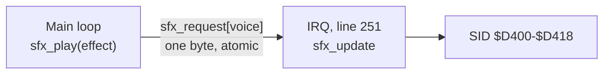

# Sound effects: `engine/sfx.asm`

Design contract for M4 (Technical Director, 2026-10-01; **tightened 2026-10-02** after four stages
of M4, before the module is built). Status: **implemented and measured** (raster-engineer, M4
stage 4, 2026-10-02), **not yet reviewed by the Technical Director and not yet heard by Simon**:
`engine/sfx.asm`, 586 bytes of code (DEBUG), no zero page; spike `tests/engine/sfx/`, 11 checks in
`make test`, all passing; `docs/reference/sid.md` written. Every path is inside its budget: three
starts **417** against 488, `sfx_play` at most **37** against 43. What was built, measured and
found is in [Results](#results-raster-engineer-2026-10-02); one SID finding there needs a
decision ([late starts](#for-the-technical-director)). Conventions are
[engine/README.md](README.md)'s.

**What the 2026-10-02 revision changed**, so nobody builds from a remembered copy:

| Was | Is | Why |
|---|---|---|
| Effect data as a byte stream read through `zp_sfx_ptr` | **Tables indexed by effect and by step**; no pointer, no zero page | Counted from the intended code, three effects starting in one tick cost about 700 through a pointer and about 470 from tables (whole calls, DEBUG): only the tables fit the 500 budgeted |
| Voice and priority in the effect's header | In two tables of their own | `sfx_play` runs in the main loop and needs them; the pointer was the IRQ's |
| "Cost: estimate 40 + jsr/rts 12", "55" for a span | Every cost given as **profile span and whole call**, per path | [Which span a figure is](README.md#which-span-a-figure-is): stages 1 and 2 lost time to figures that didn't say |
| One `profile` check over all ticks | **One call site per path in the spike**, so each can become a lock | A span that every phase passes through can only have a maximum |
| Behaviour checked by counters the spike keeps on itself | **A script check against an independent model**, every register, every frame | As `rng` and `input` did; the module's author doesn't mark his own work |
| SID facts "unverified" | A list of the facts the module rests on and how each is checked: [below](#the-reference-doc-it-must-write-docsreferencesidmd) | `docs/reference/sid.md` doesn't exist yet |
| Voices "0–2" here, "1–3" in the design | Stated: module voice v is the design's voice v + 1 | |

**SID facts aren't in `docs/reference/` yet.** Everything this page says about SID registers is
*unverified* (remembered, standard figures) until `docs/reference/sid.md` records it. The tools
can't hear: pitch, timbre and loudness are judged by Simon, in VICE and on his C64 Ultimate.

## Purpose

Play sound effects on the three SID voices, one effect per voice at a time, with priorities, from
data tables. No music. Swarm has ten effects
([design](../docs/games/swarm/design.md#sound-effects)): short pitch slides, noise bursts and
sequences of three or four notes.

Out of scope for M4: music, filters, ring modulation and sync, pulse-width sweeps, per-effect
volume, stopping an effect early (an effect ends when its data ends, or when another replaces it).

## How it runs

Two halves, on purpose:



- `sfx_play` (main loop) only leaves a **request**: one byte per voice. It never touches the SID
  or the playing state.
- `sfx_update` (IRQ, once a frame, from a fixed chain entry in the lower border: "the tick") takes
  requests, applies the priority rule, steps each playing effect by one frame and writes the SID.

So the sound keeps its tempo when the main loop overruns a frame, and nothing but one byte per
voice is shared between the main loop and the IRQ.

**Voices.** Module voice 0, 1, 2 is SID voice 1, 2, 3 (registers from `$D400`, `$D407`, `$D40E`),
which is the design's voice 1, 2, 3.

**Priority rule** (the design's): priorities are 1–3, higher wins. A new effect replaces the one
playing on its voice if its priority is **equal or higher**; otherwise the request is dropped, not
queued. An idle voice (priority 0) takes anything.

### `sfx_play`, exactly

With e = A, v = `sfx_voice[e]`, p = `sfx_request[v]`:

- p = 0 (nothing pending): `sfx_request[v]` = e + 1.
- p ≠ 0 and `sfx_prio[p − 1]` > `sfx_prio[e]`: nothing (the new request is dropped).
- otherwise (the pending one's priority is equal or lower): `sfx_request[v]` = e + 1.

So of several requests for one voice in one frame the highest priority survives, and the latest
on a tie. It reads `sfx_request[v]` and may then write it; if the tick takes the pending request
in between, the outcome is still right (the pending one started; the new one is dropped if it was
lower, or stands as the next tick's request if it was equal or higher). It never disables
interrupts.

### `sfx_update`, exactly

For voice v = 0, 1, 2 in that order, once per call:

1. **Request.** r = `sfx_request[v]`. If r ≠ 0: `sfx_request[v]` = 0, and with e = r − 1:
   - `sfx_prio[e]` ≥ `sfx_cur_prio[v]`: **start** e (below). This voice is done for this tick.
   - otherwise the request is dropped and the voice carries on with 2.
2. **Idle.** `sfx_cur_prio[v]` = 0: nothing. Next voice.
3. **Playing.** `sfx_left[v]` − 1. If the result isn't 0: **slide**: the voice's frequency (16
   bits, wrapping) + the current step's slide, written to the two frequency registers. If it is
   0: **load** the next step (the current step index + 1).

**Start** e on voice v: `sfx_cur[v]` = e + 1; `sfx_cur_prio[v]` = `sfx_prio[e]`; write attack/decay
(`sfx_ad[e]`), sustain/release (`sfx_sr[e]`) and the pulse width's high register (`sfx_pw[e]`);
write the control register 0 (gate off, so that the next gate-on starts a new attack whatever was
playing); then **load** step `sfx_first[e]`.

**Load** step s on voice v:

- `sfx_s_frames[s]` ≠ 0: `sfx_left[v]` = it; the voice's frequency = `sfx_s_flo[s]`,
  `sfx_s_fhi[s]`, written to the two frequency registers; then the control register =
  `sfx_s_ctrl[s]`; the current step = s.
- `sfx_s_frames[s]` = 0 (the end marker): the control register = `sfx_s_ctrl[s]` (the last
  waveform with the gate clear: the release plays out); `sfx_cur[v]` = 0; `sfx_cur_prio[v]` = 0.

So, counting ticks from the one that starts an effect as tick 0: a step of n frames holds its
control value for n ticks; its frequency is its start value on its first tick and + slide on each
of the other n − 1; an effect whose steps add up to N frames has its gate cleared, and its voice
idle, on tick N. Order of SID writes in a start: attack/decay, sustain/release, pulse width,
control 0, frequency low, frequency high, control: **7 writes**. A slide tick is 2; a step change
3; an end 1.

**When a request is heard.** A request made by the main loop in frame N is started by the tick at
line 251 of frame N, provided the call was made before that line.

## API

```
// Write 0 to all 25 SID registers, then $0F to $D418 (volume 15, no filter); clear every voice's
// state and request. Call once, before irq_init.
// In: nothing   Out: nothing   Uses: A, X
sfx_init:

// Ask for an effect to start at the next tick. Main loop only; never from an IRQ handler.
// In:  A = effect number, 0 to SFX_COUNT - 1 (not checked)
// Out: nothing   Uses: A, X, Y. No zero page
// Cost: profile span (sfx_play -> sfx_play_end) at most 43 CPU cycles, whole call at most 55
//       (budget). MEASURED: 22, 37 or 25 by path; whole call 34, 49, 37
sfx_play:

// The tick: advance every voice by one frame. Called from an IRQ handler, once a frame; never
// from the main loop.
// In:  nothing   Out: nothing   Uses: A, X, Y. No zero page, no zp_tmp
// Cost: profile span (sfx_update -> sfx_update_end) at most 488 CPU cycles, whole call at most
//       500 (budget). MEASURED: 417 for three starts, the worst case; whole call 429
sfx_update:
```

Each routine has one `rts`, and its `_end` label is on it. In the game:
`game_irq_bottom: jsr sfx_update` then `IrqDone()`, as chain entry 1 at line `$FB`.

## Hardware it owns

`$D400–$D418`. Nothing else writes the SID. It reads no SID register. After `sfx_init` it writes
only the seven registers of each voice: never `$D415–$D418` again (a volume write clicks on a
6581: *unverified*, and by ear only).

## Data the game provides

Parallel tables, read with absolute indexed addressing. An effect is a run of consecutive steps
in the step tables, closed by an end marker.

| Label | One entry per | Contents |
|---|---|---|
| `SFX_COUNT` (constant) | | Number of effects, 1–127 |
| `sfx_voice` | effect | Module voice 0–2 |
| `sfx_prio` | effect | Priority 1–3 |
| `sfx_ad`, `sfx_sr` | effect | Attack/decay and sustain/release, as the SID registers take them |
| `sfx_pw` | effect | Pulse width, high register (`$D403` and its two fellows): 0–15, the width in sixteenths. The low registers stay 0 |
| `sfx_first` | effect | Index of its first step |
| `sfx_s_frames` | step | Frames 1–255; **0 = end marker** |
| `sfx_s_ctrl` | step | Control register: waveform + gate. On an end marker: the last step's waveform with the gate clear |
| `sfx_s_flo`, `sfx_s_fhi` | step | Start frequency, 16 bits |
| `sfx_s_slo`, `sfx_s_shi` | step | Added to the frequency on every tick of the step but its first; signed 16 bits |

At most 255 steps in all, end markers included (one index byte). Swarm: 10 effects, about 35
steps: about 270 bytes.

The module provides the macros that build the tables, so a game writes effects, not columns.
Intended form (the raster-engineer settles the syntax; if it needs KickAssembler features that
[docs/reference/kickassembler.md](../docs/reference/kickassembler.md) doesn't list, such as lists
filled by `.eval`, check them and add them there):

```
        SfxBegin()
        // name, voice 0-2, priority 1-3, attack/decay, sustain/release, pulse width 0-15
        SfxEffect("PLAYER_SHOT", 0, 1, $00, $a0, 8)
        SfxStep(8, $41, $2800, -$0180)  // frames, control, start frequency, slide per frame
        SfxEffect("WAVE_START", 2, 2, $09, $00, 8)
        SfxStep(9, $41, $1d45, 0)       // a note
        SfxStep(1, $40, $1d45, 0)       // gate off for one frame: the next note gets a new attack
        SfxStep(9, $41, $24dc, 0)
        ...
        SfxEnd()                        // emits the tables, the end markers and SFX_COUNT, and
                                        // defines SFX_PLAYER_SHOT = 0, SFX_WAVE_START = 1, ...
```

The macros stop the build (`.errorif` or `.error`) on: a voice outside 0–2, a priority outside
1–3, a pulse width over 15, frames outside 1–255, an effect with no step, more than 255 steps, and
a control byte that isn't one waveform bit (`$10`, `$20`, `$40`, `$80`) with or without the gate
(`$01`): no combined waveforms, no test, sync or ring bit.

An effect that needs two voices (Swarm's player hit) is two effects and two `sfx_play` calls. The
numbers in the example are placeholders, not Swarm's sounds.

## Zero page

**None.** The design above needs no pointer: every table read is absolute indexed. The game's
zero page keeps `zp_sfx_ptr` (2 bytes, `$14–$15` in Swarm) reserved for this module, IRQ only, in
case the measured code needs it after all; say in the report whether it was used, and the
Technical Director releases it if not.

All state is absolute RAM in the module, per voice:

| Label | Owner | Contents |
|---|---|---|
| `sfx_request` (3) | **Shared**: `sfx_play` writes, `sfx_update` reads and clears | 0 = none, else effect + 1 |
| `sfx_cur` (3) | IRQ | The effect playing, + 1; 0 = idle |
| `sfx_cur_prio` (3) | IRQ | Its priority; 0 = idle |
| step index, `sfx_left`, frequency (2) | IRQ | |

**Sharing rule:** one byte per voice crosses, so every access is atomic and neither side disables
interrupts. `sfx_play` may use one absolute scratch byte of the module's; it is the main loop's
alone.

## Labels exported for tests

`sfx_init`, `sfx_play`, `sfx_play_end`, `sfx_update`, `sfx_update_end`, `sfx_request`, `sfx_cur`,
`sfx_cur_prio`, and in DEBUG builds **`sfx_shadow`**: 25 bytes, the last value written to each of
`$D400–$D418`, written by the same code that writes the register (the SID can't be read back by
the program). A game's own checks read `sfx_request` and `sfx_cur` to see which effect an event
asked for and which is playing.

## Cycle budget

All *estimates*, counted from the design above written as intended: the three voices' code
unrolled (no voice index), absolute addressing, the shadow store after each SID write (DEBUG).
`sfx_update` runs on lines 251 onwards, where there is no badline or sprite DMA and nothing can
interrupt it, so its raster cost is its CPU cost and each path's figure will be exact. The DEBUG
build is the one budgeted; release is the same less 4 cycles a SID write.

| Path | Counted (estimate) | Budget: profile span | Budget: whole call (+ `jsr` 6, `rts` 6) | **Measured**, DEBUG: span / whole call | Release |
|---|---|---|---|---|---|
| `sfx_update`, all three voices idle, no request | 42 | **50** | **62** | **44 / 56** | 42 / 54 |
| `sfx_update`, three voices on a slide tick | 210 | **220** | **232** | **202 / 214** | 177 / 189 |
| `sfx_update`, three effects starting in one tick (the worst case) | 456 | **488** | **500** | **417 / 429** | 333 / 345 |
| `sfx_update`, any other tick (a step change, an end, a dropped request, a mixture) | under 456 | **488** | **500** | under 417 (by count; 93–193 seen) | under 333 |
| `sfx_play`, nothing pending on the voice | 22 | **43** | **55** | **22 / 34** | the same |
| `sfx_play`, a pending request of equal or lower priority replaced | 43 | **43** | **55** | **37 / 49** | the same |
| `sfx_play`, a pending request of higher priority kept | 35 | **43** | **55** | **25 / 37** | the same |
| Size, code | | 600 bytes | | **586** | 490 |
| Swarm's effect data | | about 270 bytes, in the game's tables | | **264** (10 effects × 6 + 34 steps × 6), + padding so that no table crosses a page | |

Every measured figure is the same in every pass (constant paths, no DMA, no IRQ inside): each
can be a lock. Details and how they were taken: [Results](#costs).

Behind the 456: a start is about 152 a voice (the request and the priority test 24, three header
registers 36, the two state bytes and the first step's index 20, control 0 written 10, the step's
frames, frequency and control 62).

- **Measured figures replace these**: in the routine headers, here, and in the spike's
  `budget.json`, where each constant path becomes a lock (`min_cycles` = `max_cycles`). The
  Technical Director sets the locks from the raster-engineer's report.
- Swarm's frame budget carries **500** for the tick (the whole call) and puts each `sfx_play` in
  its caller's row at 55 CPU ([memory map](../docs/games/swarm/memory-map.md#stage-4-what-must-be-done-to-stay-in-budget)).
  With the chain entry: `jsr` 6 + 488 + `rts` 6 + `jmp irq_exit` 3 + `irq_exit` 60 = 563, checked
  at 570.
- **If three starts measure over 488, or `sfx_play` over 43: report, with the figures, before
  changing anything.** The choices are the Technical Director's: start at most two effects a tick
  (the third request stays pending for the next), or take the difference from Swarm's headroom.
  Don't trim the shadow or the write order to fit.

## The reference doc it must write: `docs/reference/sid.md`

The module is the first code in the repo to touch the SID, and `docs/reference/` has no page for
it. The raster-engineer writes one, in the style of the other reference docs: each fact marked
**measured** (with the probe), *standard figure, unverified*, or **by ear** (Simon).

**What a measurement here can and can't show.** The SID can't be read back, with two exceptions:
`$D41B` (the top 8 bits of voice 3's oscillator) and `$D41C` (voice 3's envelope). So voice 3 can
be measured and voices 1 and 2 are assumed to behave the same. And a measurement in VICE is a
measurement of VICE's SID emulation, which is itself a model of the chip: say so beside each
figure, and record which emulation it was (below). What the chip in Simon's machine does is known
only by listening.

Probe: `tests/timing/sid_readback/main.asm` (`make GAME=sid_readback SRC_DIR=tests/timing/sid_readback`),
with a script beside it if the readings are taken through the monitor, and its results committed
beside it. The page records at least:

| # | Fact | The module relies on it for | How it is checked |
|---|---|---|---|
| 1 | The register map: 7 registers a voice (frequency low/high, pulse width low/high, control, attack/decay, sustain/release) from `$D400`, `$D407`, `$D40E`; the control bits (gate `$01`, sync, ring, test, triangle `$10`, sawtooth `$20`, pulse `$40`, noise `$80`); `$D415–$D418` (filter, and volume in the low nibble of `$D418`) | Everything | Standard figure. The parts facts 5–9 exercise become **measured** for voice 3 |
| 2 | `$D400–$D418` are write-only: what a read by the program returns in VICE | "It reads no SID register"; why `sfx_shadow` exists | **Measured**: write a value, read it at once and a frame later |
| 3 | What the **VICE monitor** returns for `$D400–$D418` (the test tools' read, not the CPU's): the last value written, or not | Whether a script can check the registers themselves, in release builds too, or only `sfx_shadow` | **Measured**, through `vice_read_memory` and through the budget runner's monitor |
| 4 | Whether `$D41B` and `$D41C` return live values under the test harness (the budget runner starts VICE in warp with no window; the MCP server may differ), and the VICE resources that decide it (`SidEngine`, `SidModel`, `Sound`): their values in each harness | Facts 5–9 can only be measured if they do | **Measured**. If they don't read live, say what has to be set for the probe, and set it in the probe's script only |
| 5 | Frequency: the oscillator is a 24-bit count that adds the 16-bit frequency value every cycle, so Hz = value × clock / 16,777,216, and on PAL (985,248 cycles a second, which [vic-ii-timing.md](../docs/reference/vic-ii-timing.md) has as *unmeasured*) value = Hz × 17.03 | Every pitch in the effect data; a note table for the designer | The accumulator: **measured** on voice 3 (sawtooth, three frequency values, `$D41B` read a known number of cycles apart). Hz and the note table are *computed* from it and the clock figure, and their final check is **by ear** |
| 6 | The envelope: gate on rises to `$FF` at the attack rate, falls to the sustain level (the nibble × 17) at the decay rate; gate off falls to 0 at the release rate. The 16 attack times and the 16 decay/release times | The effects' lengths and the "Frames" column of the design | The table is a standard figure. **Measured** through `$D41C`, frame by frame, for every attack/decay and sustain/release value Swarm's ten effects use |
| 7 | Re-triggering: (a) writing a control value with the gate set while it is already set does not restart the attack; (b) gate off then on again in the same tick, some tens of cycles apart (what a start does), does, from the level the envelope was at; (c) a one-frame gate-off step between notes does | The start sequence's "control 0" write; note sequences | **Measured** through `$D41C` on voice 3, with the module's own write spacing |
| 8 | Pulse width is 12 bits; the high register's low nibble n with the low register 0 gives a duty of n/16 | `sfx_pw` | **Measured**: pulse on voice 3 at a low frequency, the share of `$D41B` reads that are `$FF` |
| 9 | Noise: the control value `$81` alone; never combined with another waveform, never with the test bit | The macros' rule on control bytes | The rule is a standard caution, *unverified*. **Measured**: that `$D41B` changes at a rate that follows the frequency value |
| 10 | `$D418` = `$0F` and `$D417` = 0: full volume, no voice through the filter, voice 3 not muted (bit 7 clear). A write to `$D418` makes a click on a 6581 | `sfx_init`; "never written again" | Standard figures. The click: **by ear** |
| 11 | The registers' state after reset | `sfx_init` writes all 25 whatever it is | Not measured: not relied on |
| 12 | The tick's rate: once a frame, 50.125 a second, so n frames = n × 19.95 ms | The design's durations | 19,656 cycles a frame is **measured** ([vic-ii-timing.md](../docs/reference/vic-ii-timing.md)); the frames a second follow from the clock figure, *unmeasured* there |
| 13 | Voices 1 and 2 behave as voice 3 | Seven of Swarm's ten effects | Assumed: no read-back. **By ear** |
| 14 | 6581 against 8580: which one VICE emulates by default, which one Simon's C64 Ultimate has or emulates, and what differs that this module could meet (the `$D418` click, loudness; the filter and combined waveforms are unused) | What "sounds right" is being judged on | The VICE resource: **measured**. The machine: ask Simon. The differences: standard lore, *unverified* |
| 15 | The envelope's known oddity: after a quick release and re-trigger the attack can start late by up to some tens of milliseconds, depending on the rates | Whether a shot's sound can start late when shots follow each other at 10 frames | Standard lore, *unverified*. If fact 7's readings show it for Swarm's values, record the figures; otherwise leave it marked unverified |

**By ear, Simon** (the only check of how it sounds; the page gets a short table of his answers,
for VICE and for the C64 Ultimate):

- each of the ten effects is recognisably the design's description: pitch direction and range,
  length, character (pulse, sawtooth, noise);
- the effects' loudness against each other;
- clicks: at a start, when one effect cuts another off (a shot over a shot), at an end;
- nothing is left sounding after an effect ends;
- VICE and the real machine agree closely enough to tune the sounds in VICE.

The page is linked from [CLAUDE.md](../CLAUDE.md)'s list of reference docs by the producer.

## Spike: `tests/engine/sfx/`

Swarm's ten effects as data (first versions: the designer's descriptions turned into numbers; the
designer and Simon tune them afterwards), three **probe effects** of the spike's own after them
(one a voice: a single step of 40 frames with a non-zero slide), a screen listing the effects,
and three ways of driving it. Chain: entry 0 at line 16 (the frame tick), entry 1 at `$FB`,
`spike_bottom`, which calls `sfx_update`. No multiplexer. `engine/input.asm` for the stick.

The spike's main-loop work is done straight after `irq_wait_frame`, in the top border, so that
its `sfx_play` calls meet no badline and their spans are exact.

| `spike_mode` | Who sets it | What the main loop does each frame |
|---|---|---|
| 1, **phases** (the value at start) | | A fixed cycle of phases, below. What `make test` measures |
| 0, **commands** | `check.py`, through the monitor | For each of the 4 bytes of `spike_cmd`, in order: if not 0, `sfx_play` with it − 1, then clear it |
| 2, **stick** | Any stick movement | Left and right choose an effect, fire plays it. For Simon |

**One call site per path**, so that each path has a span of its own and can be locked. The spans
are whole calls: from the `jsr` to the label after it.

| Call site (label, and `<label>_end` on the next instruction) | Executed when |
|---|---|
| `spike_tick_idle`: `jsr sfx_update` | Nothing is playing and nothing was asked for this frame |
| `spike_tick_slide`: `jsr sfx_update` | All three probe effects are playing and none starts, changes step or ends this tick |
| `spike_tick_start3`: `jsr sfx_update` | Three effects, one a voice, were asked for this frame and all three will start |
| `spike_tick_other`: `jsr sfx_update` | Any other tick, and every tick in modes 0 and 2 |
| `spike_play_take`: `jsr sfx_play` | Nothing is pending on the effect's voice |
| `spike_play_replace`: `jsr sfx_play` | A request of equal priority is pending there |
| `spike_play_keep`: `jsr sfx_play` | A request of higher priority is pending there |

`spike_bottom` picks its call site from a byte the main loop sets each frame (the phases are a
fixed script, so the main loop knows what the tick will be). The phase cycle must reach all seven
sites, and counts each frame it asks for three starts in `spike_triple_count` (2 bytes,
saturating).

It must demonstrate:

1. **Every register write is as specified, frame by frame**: `tests/engine/sfx/check.py`, run by
   `make test` as a `script` check. It holds an independent model of
   [`sfx_play`](#sfx_play-exactly) and [`sfx_update`](#sfx_update-exactly) in Python, reads the
   thirteen effects' tables from the running program's memory, drives the spike in command mode
   one frame at a time, and after every frame compares `sfx_shadow` (all 25 bytes), `sfx_cur`
   and `sfx_request` with the model. If [fact 3](#the-reference-doc-it-must-write-docsreferencesidmd)
   says the monitor returns the registers' last written values, it compares those too, and the
   same script then runs on the release build (`--prg`), which has no shadow. Cases:
   - each of the thirteen effects alone, to its end and two frames beyond;
   - a higher priority replacing a lower one mid-effect; an equal one replacing; a lower one
     dropped, the effect playing ending on its proper tick;
   - two and three requests for one voice in one frame, in each order of priorities;
   - a request in the frame an effect ends, and in the frame after;
   - an effect on another voice untouched by all of the above;
   - three effects starting in one frame;
   - 3,000 frames of requests drawn by the script from a fixed seed (0 to 4 a frame, any effect),
     compared every frame. This is the test for lost or stuck state.
2. **The worst case is exercised** in `make test`: `spike_triple_count` ≥ 1.
3. **The measured cost of each path**, in the routine headers, in this page's table and in the
   report.
4. **Simon listens** (`make run GAME=sfx SRC_DIR=tests/engine/sfx`, and the same PRG on the C64
   Ultimate): the list in the section above. Report it as not yet done until he has.

`tests/engine/sfx/budget.json` (`warmup_frames` long enough for one whole phase cycle):

| Check | Kind | Labels | Limit | Basis |
|---|---|---|---|---|
| The tick, all idle | `profile` | `spike_tick_idle` → `spike_tick_idle_end` | max 62 | estimate; a lock once measured |
| The tick, three slides | `profile` | `spike_tick_slide` → `spike_tick_slide_end` | max 232 | estimate; a lock once measured |
| The tick, three starts | `profile` | `spike_tick_start3` → `spike_tick_start3_end` | max 500 | estimate; a lock once measured |
| The tick, any | `profile`, 600 samples | `sfx_update` → `sfx_update_end` | max 488 | estimate |
| The sound tick IRQ | `profile`, 600 samples | `spike_bottom` → `irq_exit_rti` | max 590: the 563 of a game's entry + the spike's choice of call site (allow 25; count it and say what it is). A game's own check is 570 | estimate + measured framework |
| `sfx_play`, three paths | `profile` × 3 | `spike_play_take`, `_replace`, `_keep` → their `_end` | max 55 each | estimate; locks once measured |
| The three-starts phase ran | `memory` | `spike_triple_count`, size 2 | min 1 after one phase cycle | requirement |
| No late chain entries | `memory` | `irq_late_count` | equals 0 | requirement |
| Behaviour against the model | `script` | `check.py --prg {prg}` | exit code 0 | requirement |

## What the raster-engineer reports

- The measured cost of every path in the table, and the size.
- `make test ARGS=sfx` and `check.py`'s results (DEBUG, and release if fact 3 allows).
- Whether `zp_sfx_ptr` was used.
- `docs/reference/sid.md`, with what was measured, what stayed unverified and what waits for
  Simon's ears; and any KickAssembler syntax added to `docs/reference/kickassembler.md`.
- Anything in this contract that couldn't be built as written, with numbers, **before** building
  something else.
- For the README's owner (the Technical Director): the module table's line, and the engine
  block's new size.

## Results (raster-engineer, 2026-10-02)

Built to the contract above: `engine/sfx.asm`, the spike `tests/engine/sfx/` (`main.asm`,
`zp.asm`, `swarm_sfx.asm`, `budget.json`, `check.py`, `mutate.py`, `measure.py` and their result
files), the probe `tests/timing/sid_readback/` and [docs/reference/sid.md](../docs/reference/sid.md).
VICE 3.10 x64sc PAL. Neither stop condition was met (three starts 417 ≤ 488, `sfx_play` 37 ≤ 43),
so nothing was reshaped. **`zp_sfx_ptr` is not used**: it can be released.

### Correctness

`tests/engine/sfx/check.py` (run by `make test` as the spike's script check; about 50 s) holds a
model written from this page's two "exactly" sections and compares, after every frame: **the list
of SID writes the tick made, in order** (a store checkpoint on each of `$D400–$D418`, so the
control-0 write of a start is seen although the next write hides it), all 25 registers as the
monitor reads them ([sid.md](../docs/reference/sid.md#2-and-3-reading-the-registers), fact 3),
`sfx_shadow` in a DEBUG build, `sfx_cur` and `sfx_request`.

| Case | What | Result |
|---|---|---|
| init | `$D418` = `$0F`, `$D415–$D417` and the pulse width low registers 0 | PASS |
| alone | Each of the 13 effects to its end + 2 frames; idle and gate clear on tick N, not before | PASS, 469 frames |
| pairs | All 59 ordered pairs on one voice, the second 3 ticks after the first (17 higher, 25 equal, 17 lower), an effect on another voice running through each | PASS, 3,741 frames |
| same-frame | 77 sets of two or three requests for one voice in one frame, every order | PASS, 2,944 frames |
| end-frame | 81 cases: an equal or lower request on tick N − 1, N and N + 1 of an effect of N frames | PASS, 3,996 frames |
| triple | Three frames with a start on every voice: 21 writes each, in order | PASS |
| random | 3,000 frames from seed 20261002, 2,462 requests | PASS: 774 starts (697 cutting an effect off), 1,053 requests dropped by the tick, 214 kept back by `sfx_play`, 421 replaced, 7,170 slides, 101 step changes, 75 ends, 7 three-start ticks |
| untouched | No write to `$D415–$D418` or a pulse width low register in the whole run | PASS |

**14,289 frames, 49,142 register writes compared, DEBUG and release builds alike**
(`check_results.txt`, `check_results_release.txt`).

**The checker was itself tested** (`tests/engine/sfx/mutate.py`, `mutate_results.txt`): 13
deliberate faults in a copy of the module, each assembled with the spike and given to `check.py`.
**13 of 13 caught**: equal priority not replacing, the tie going to the earlier call, a lower
priority overwriting a pending request, the control-0 write left out, sustain/release written
before attack/decay, a step one tick too long, the gate left set at the end, a dropped request
left pending, the slide's high byte from the wrong table, the slide applied on a step's first
tick, voice 2 not serviced, a write that reaches the shadow but not the register, and `$D418`
rewritten every tick. The unmodified module passes, with and without the far jump the mutants
are given for room. (The first version of `mutate.py` reported 13 survivors: its mutants were
never built, because the import resolved to the real module. It now checks that each mutant's
PRG differs.)

One thing the contract's text settles that is worth knowing: **a lower-priority request made on
the very tick an effect ends is dropped**, because the tick looks at the request before it steps
the effect (end-frame's N cases). One tick later it starts.

### Costs

`make test ARGS=sfx` and `tests/engine/sfx/measure.py` (`measure_results.txt`,
`measure_results_release.txt`): 400 frames of the phase cycle, then 256 frames of calls in the
display. Raster cycles; in the border they are CPU cycles.

| Path | Where it ran | Profile span | Whole call | Budget (span / call) | |
|---|---|---|---|---|---|
| `sfx_update`, three voices idle | IRQ, line 251–252 | **44** | **56** | 50 / 62 | PASS |
| `sfx_update`, three slides | IRQ, lines 251–255 | **202** | **214** | 220 / 232 | PASS |
| `sfx_update`, three starts | IRQ, lines 251–258 | **417** | **429** | 488 / 500 | PASS |
| `sfx_update`, other ticks seen | IRQ, lines 251–254 | 93–193 | 105–205 | 488 / 500 | PASS |
| `sfx_play`, nothing pending | main loop, lines 19–21 | **22** | **34** | 43 / 55 | PASS |
| `sfx_play`, replaced | main loop, line 20 | **37** | **49** | 43 / 55 | PASS |
| `sfx_play`, kept | main loop, line 20 | **25** | **37** | 43 / 55 | PASS |
| `sfx_play` in the display, lines 100–111, a badline at 107 | main loop | 22–65, 37–80, 25–68 | 34–77, 49–92, 37–80 | (55 CPU; the memory map allows 70–75 raster) | see below |
| The spike's sound tick IRQ, `spike_bottom` → `rti` | line 251, cycle 26–29 | 124 idle, 286 slides, **511** three starts | | 590 | PASS |

- Every border figure is the same in every pass. Release: 42 / 177 / 333 for the three ticks
  (4 less a register write), `sfx_play` unchanged.
- **Counted per voice** (the macro in `engine/sfx.asm`): idle 14, slide 67, step change 92, end 63,
  start 139, a dropped request 23 more. The DEBUG idle and slide ticks are 2 and 1 over three
  times those: one branch of voice 1 and one of voice 2 cross a page. The module is page-aligned
  so that this is the same in every program.
- **In the display a call costs its CPU count or that + 43** (a badline; no sprites in the spike):
  77, 92 and 80 at worst against the memory map's 70–75. With sprites on the line add
  2 × sprites + 3, as [the guide](GAME-GUIDE.md) says for any short routine.
- **The chain entry around a three-start tick is 498, not 563**: `jsr` 6 + 417 + `rts` 6 + `jmp` 3
  + `irq_exit` **66**. `irq_exit` is 58 on this entry (it is the last: the wrap) and 66 when
  the handler ends after line 255, which only the three-start tick does (line 258, cycle 22):
  the framework's test of the raster's bit 8 is then reached. The spike's 511 is that + 13 for
  its choice of call site (7, 11, 13, 12 for idle, slide, start3, other).
- The tick starts on line 251 at cycle 26–29 and its `rts` is reached by line 258 at the latest.

### How it differs from the sketch above

- **The effect data's syntax.** `SfxEffect` is a function that returns the effect's number, and
  the game names it with a label: `.label SFX_PLAYER_SHOT = SfxEffect(0, 1, $00, $a0, 8)`. A macro
  can't define a symbol whose name is one of its arguments. `SfxStep`, `SfxBegin`, `SfxEnd` are
  macros as sketched; `SfxHz(hz)` gives a note's frequency value. `SfxEnd` also defines
  `SFX_STEPS`. All seven build errors the contract lists were tried and stop the build. What this
  needed from KickAssembler is in [kickassembler.md](../docs/reference/kickassembler.md).
- **The module is page-aligned** (`.align $100` before `sfx_update`): up to 255 bytes of padding
  in the engine block, so that the measured figures hold wherever it is imported.
- **`sfx_play` uses no scratch byte**: it reads the effect's voice a second time instead.
- **The spike has a fourth mode** (3, DISPLAY, for `measure.py`) and a list entry 13 that plays
  both halves of the player hit. Its phase cycle is 80 frames.
- **`budget.json` has the contract's limits, not locks**: each check's `source` gives the measured
  figure and the lock it proposes (56, 214, 429, 34, 49, 37).

### Swarm's effect data

`tests/engine/sfx/swarm_sfx.asm`: ten effects, numbers 0–9 in the design's order
(`SFX_PLAYER_SHOT`, `SFX_ENEMY_SHOT`, `SFX_DIVE`, `SFX_ENEMY_EXPLOSION`, `SFX_PLAYER_HIT_A`,
`SFX_PLAYER_HIT_B`, `SFX_WAVE_START`, `SFX_WAVE_CLEAR`, `SFX_START`, `SFX_GAME_OVER`), each as
long as the design's "Frames". **First versions: nobody has heard them.** The game imports the
same kind of file between `SfxBegin()` and `SfxEnd()`; whether the game owns the file and the
spike imports the game's, or the other way round, is the Technical Director's to say (two copies
would drift as the sounds are tuned).

### For the Technical Director

1. **Late starts** ([sid.md fact 15](../docs/reference/sid.md#15-late-starts-the-envelopes-rate-counter),
   measured in VICE's 8580 emulation). A start is up to 33 ms (1.67 ticks) late, the voice holding
   its old level meanwhile, (a) always when it cuts off an effect that fades by a slow decay (in
   Swarm: explosion over explosion, the hit over an explosion, a jingle over a dive or shot,
   each note of a jingle), and (b) now and then even from silence for those same slow-decay
   effects. The shots and the dive are never late. The data is written to keep it to that
   (release 0 everywhere). Options seen: accept it (it may well be inaudible: Simon's ears);
   **one more write in a start** (attack/decay with decay 0 first, the real value after the gate:
   measured, removes (b) entirely, 0 late of 225, costs 12 to 14 cycles a start in DEBUG, three
   starts 417 → about 455; it changes this page's "7 writes", so it was not built); nothing removes (a)
   short of not cutting such effects off.
2. The locks for `budget.json`: 56, 214, 429 (whole calls), 34, 49, 37. `sfx_update` → `sfx_update_end`
   stays a maximum (417). The game's `game_irq_bottom` → `rti` worst case is 498 by these figures.
3. The tick's first branch is 127 bytes long in DEBUG: the module can't grow between it and its
   target without that branch becoming a jump (2 cycles a voice on the idle and slide ticks).
4. README lines: module table: `engine/sfx.asm`, sound effects, 586 bytes code + 21 state + 25
   shadow (DEBUG; 490 + 21 release), page-aligned, no zero page; costs as the table above.
5. `$D41B`/`$D41C` read a constant under the test harness (`-sounddev dummy`): a fact for anyone
   who thinks of the SID as a random source ([sid.md fact 4](../docs/reference/sid.md#4-the-harness-and-the-sid)).

### Not yet done

**Simon has not listened.** `make run GAME=sfx SRC_DIR=tests/engine/sfx`, stick in port 2: any
movement leaves the test pattern; up/down choose, fire plays; entry 13 is the whole player hit.
The questions are the table at the end of [sid.md](../docs/reference/sid.md#by-ear-simon).
