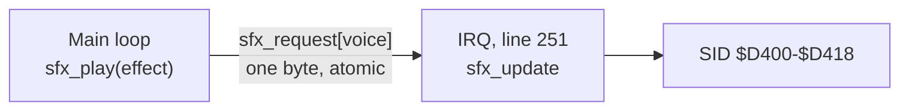

# Sound effects: `engine/sfx.asm`

Design contract for M4 (Technical Director, 2026-10-01). Status: **not implemented**. The
raster-engineer builds it in M4 stage 4 with the spike below. Conventions are
[engine/README.md](README.md)'s.

**SID facts aren't in `docs/reference/` yet.** Everything this page says about SID registers is
*unverified* (remembered, standard figures). The raster-engineer adds `docs/reference/sid.md` with
what the module relies on, and marks what the spike could and couldn't check: the emulator's sound
can't be heard through the MCP tools, so pitch and timbre are judged by Simon with `make run`.

## Purpose

Play sound effects on the three SID voices, one effect per voice at a time, with priorities, from
data tables. No music. Swarm has ten effects
([design](../docs/games/swarm/design.md#sound-effects)): short pitch slides, noise bursts and
sequences of three or four notes.

Out of scope for M4: music, filters, ring modulation and sync, pulse-width sweeps, per-effect
volume, stopping an effect early (an effect ends when its data ends, or when another replaces it).

## How it runs

Two halves, on purpose:



- `sfx_play` (main loop) only leaves a **request**: one byte per voice. It never touches the SID
  or the playing state.
- `sfx_update` (IRQ, once a frame, from a fixed chain entry in the lower border) takes requests,
  applies the priority rule, steps each playing effect by one frame and writes the SID.

So the sound keeps its tempo when the main loop overruns a frame, and nothing but one byte per
voice is shared between the main loop and the IRQ.

**Priority rule** (the design's): a new effect replaces the one playing on its voice if its
priority is **equal or higher**; otherwise the request is discarded. An idle voice takes anything.
Two requests for the same voice in one frame: the higher priority wins, the later one on a tie
(decided in `sfx_play`, against the pending request).

## API

```
// Silence the SID, set the volume to 15, clear all state and requests. Call once, before irq_init.
// In: nothing   Out: nothing   Uses: A, X
sfx_init:

// Ask for an effect to start at the next sfx_update. Main loop only.
// In:  A = effect number (0 to SFX_COUNT - 1, the game's constants)
// Out: nothing   Uses: A, X, Y
// Cost: estimate 40 CPU cycles + jsr/rts 12
sfx_play:

// Advance every voice by one frame. Called from an IRQ handler, once a frame; never from the
// main loop. Uses no zp_tmp.
// In:  nothing   Out: nothing   Uses: A, X, Y, zp_sfx_ptr
// Cost: estimate 40 (all idle) to 500 (three effects starting) CPU cycles
sfx_update:
```

In the game: `game_irq_bottom: jsr sfx_update` then `IrqDone()`, as chain entry 1 at line `$FB`.

## Hardware it owns

`$D400–$D418`. Nothing else writes the SID. It reads no SID register.

## Data the game provides

| Label | Contents |
|---|---|
| `SFX_COUNT` | Number of effects (at most 127) |
| `sfx_data_lo`, `sfx_data_hi` | One entry per effect: the address of its data |

An effect, built with the module's macros:

```
sfx_player_shot:
        SfxHeader(0, 1, $00, $A0, $08)  // voice 0-2, priority 1-3 (higher wins), attack/decay,
                                        // sustain/release, pulse width high nibble
        SfxStep(8, $41, $2800, -$0180)  // frames, control ($D404: waveform + gate), start
                                        // frequency (16 bits), added to it every frame (signed 16)
        SfxEnd()                        // gate off, voice idle
```

- Header 5 bytes, step 6 bytes (frames 1–255; `SfxEnd` is a step with frames 0).
- A **note sequence** is several steps; a step whose control byte has the gate bit clear for one
  frame re-triggers the envelope before the next note.
- When an effect ends, the voice's gate is cleared and its priority drops to 0.
- An effect that needs two voices (Swarm's player hit) is two effects and two `sfx_play` calls.

## Zero page

| Label | Bytes | Owner | Purpose |
|---|---|---|---|
| `zp_sfx_ptr` | 2 | **IRQ only** (`sfx_update`) | Pointer to the effect data being read |

Everything else is absolute RAM in the module: per voice, the request (shared, one byte: 0 = none,
else effect + 1), and IRQ-only state: effect playing, priority, data offset, frames left, frequency
(2), slide (2).

**Sharing rule:** `sfx_request` is written by the main loop (`sfx_play`) and read and cleared by
the IRQ (`sfx_update`). One byte per voice, so every access is atomic and neither side disables
interrupts. `sfx_play` may read the pending request before writing; if the IRQ consumes it in
between, the new request simply stands, which is correct.

## Cycle budget

All *estimates*. `sfx_update` runs on lines 251 onwards, where there is no badline or sprite DMA,
so its raster cost is its CPU cost and the measured figures will be exact per path.

| Path | Budget (raster cycles) | Basis |
|---|---|---|
| `sfx_update` → `sfx_update_end`, all voices idle | **50** | estimate: 3 × (request test + idle test) |
| `sfx_update`, three voices sustaining (frames − 1, 16-bit slide, two frequency writes each) | **220** | estimate: about 60 a voice |
| `sfx_update`, three effects starting in the same frame (the worst case: header 5 bytes, first step 6 bytes, 7 SID writes each) | **500** | estimate: about 150 a voice |
| `sfx_play` → `sfx_play_end` | **55** | estimate |
| Size, code | 500 bytes | estimate |
| Swarm's effect data | about 350 bytes | estimate (in the game's tables) |

Swarm's frame budget carries 500 for the tick and 100 for its `sfx_play` calls
([memory-map.md](../docs/games/swarm/memory-map.md#frame-budget)). If three starts in a frame
measure over 500, report it: the choices are a cheaper data format or starting at most two effects
a frame (the third waits one frame), and that's the Technical Director's call.

## Spike: `tests/engine/sfx/`

Swarm's ten effects as data (first versions: the designer's descriptions turned into numbers), a
screen listing them, and the joystick or a timer stepping through them. Chain: entry 0 in the top
border, entry 1 at `$FB` calling `sfx_update` (no multiplexer). DEBUG builds keep
`sfx_shadow`, a 25-byte copy of what was last written to `$D400–$D418`, because the SID can't be
read back.

It must demonstrate:

1. **Each effect plays and ends**: the voice's control register (in `sfx_shadow`) shows the gate
   set for the effect's length in frames and clear afterwards; the frequency moves as the data says.
2. **Priorities**, by a scripted sequence (`spike_phase`, cycling): a higher priority replaces a
   lower one mid-effect; an equal one replaces; a lower one is discarded and the playing effect
   finishes on time; two requests in one frame resolve as specified; an effect on another voice
   is untouched.
3. **The worst case is exercised**: one phase starts three effects in the same frame.
4. **No lost or stuck state** over 3,000 frames of random requests (using `engine/rng.asm`):
   `spike_stuck_count` = 0, where the spike's own check is that every voice with priority > 0 has
   frames left, and every idle voice has its gate clear.
5. The measured cost of each path, in the routine headers and here.
6. **Simon listens** (`make run GAME=sfx SRC_DIR=tests/engine/sfx`): the effects are recognisably
   the design's. This is the only check of how it sounds.

`tests/engine/sfx/budget.json`:

| Check | Kind | Labels | Limit | Basis |
|---|---|---|---|---|
| `sfx_update`, any frame | `profile`, 600 samples | `sfx_update` → `sfx_update_end` | `max_cycles` 500, `max_avg_cycles` 220 | estimate |
| sound tick IRQ | `profile`, 600 samples | `spike_bottom` → `irq_exit_rti` | 570 (500 + `jsr` 6 + `jmp` 3 + `irq_exit` 60, rounded up) | estimate + measured framework |
| `sfx_play` | `profile` | `sfx_play` → `sfx_play_end` | 55 | estimate |
| the three-starts phase ran | `memory` | `spike_triple_count` | min 1 after 3,000 frames | requirement |
| no stuck or lost voice | `memory` | `spike_stuck_count` | equals 0 | requirement |
| priorities as specified | `memory` | `spike_priority_errors` | equals 0 | requirement |
| no late chain entries | `memory` | `irq_late_count` | equals 0 | requirement |
