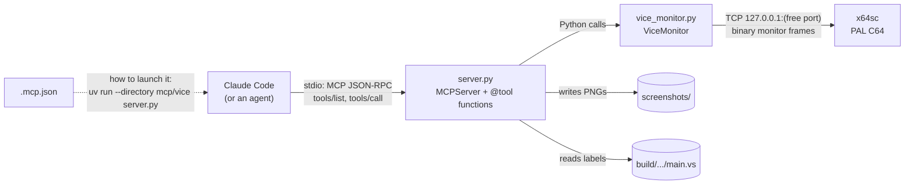
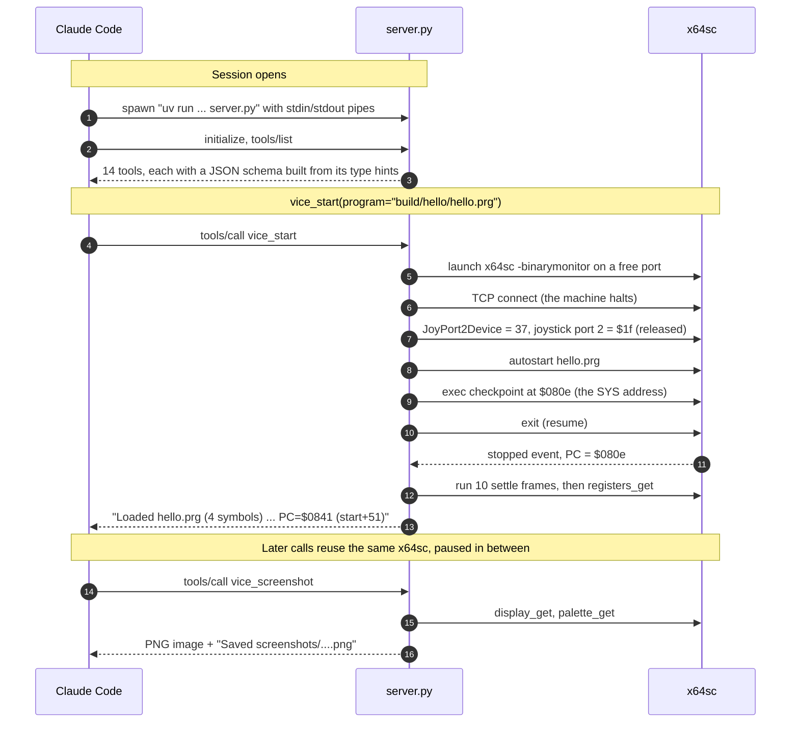
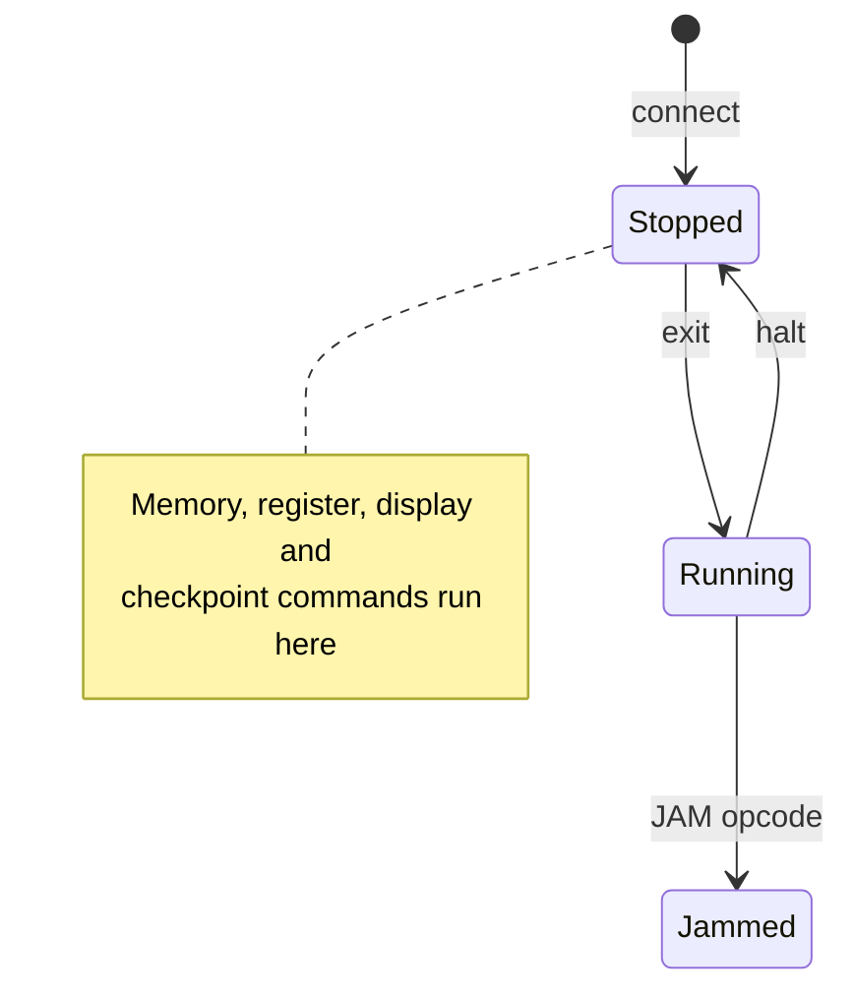
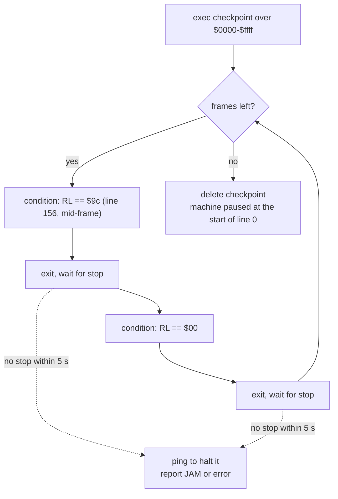
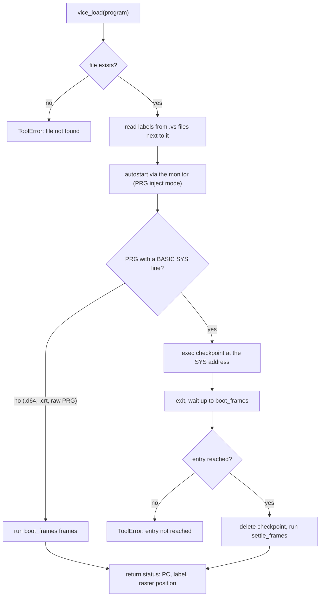
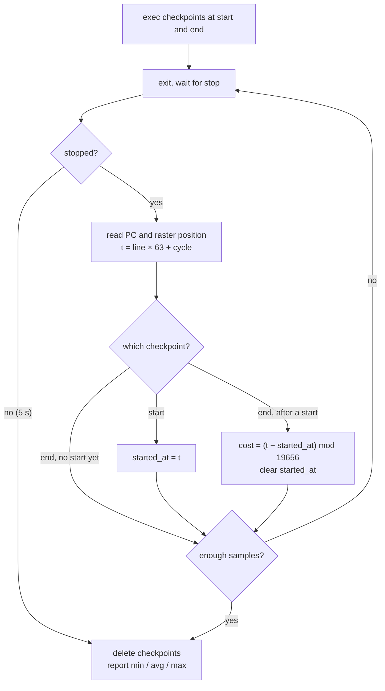

# VICE MCP server

Gives Claude Code (and every agent in this repo) tools to drive the VICE C64 emulator:
boot a program, step exact frames, take screenshots, read and write memory, use the
joystick, and measure cycle costs.

## Tools

| Tool | What it does |
|---|---|
| `vice_start(program, warp, show_window)` | Fresh x64sc (PAL, default settings, own port). Autostarts `program` if given |
| `vice_load(program)` | Autostart a .prg/.d64/.crt; for a PRG with a `SYS` line, runs until the CPU reaches it |
| `vice_stop()` / `vice_reset(hard)` | Quit / reset |
| `vice_run_frames(n)` | Advance exactly n frames; stops at the start of raster line 0 |
| `vice_run_until(address, access)` | Run until an address or label is executed, read or written |
| `vice_screenshot(name, area)` | PNG saved to `screenshots/`: `visible` 384×272, `full` 504×312 (with open borders), `inner` 320×200 |
| `vice_read_memory` / `vice_write_memory` | Hex dump / poke; addresses take `$c000`, `0xc000`, `49152`, `label`, `label+3` |
| `vice_registers(set_values)` | CPU registers plus raster line and cycle; optionally set registers |
| `vice_joystick(input, port, frames)` | e.g. `"up+fire"` for 10 frames on port 2 |
| `vice_type(text)` | Type into the KERNAL keyboard buffer (BASIC prompt, not games that scan the matrix) |
| `vice_profile(start, end)` | Cycles from `start` to `end` over several passes, measured in raster time (includes badlines and sprite DMA) |
| `vice_symbols(filter)` | Labels loaded from KickAssembler's `.vs` file next to the program |

The machine is **paused between tool calls**, so everything an agent sees is deterministic.

## How it works

> The diagrams are [Mermaid](https://mermaid.js.org): GitHub renders them automatically.
> In VS Code, install *Markdown Preview Mermaid Support* (`bierner.markdown-mermaid`) and
> open the Markdown preview (⇧⌘V).

### The pieces



- **`.mcp.json`** (repo root) tells Claude Code how to launch the server. Claude Code starts
  it when a session opens and talks to it over stdin/stdout, which is why the server must
  never `print()`.
- **`server.py`** uses the official MCP Python SDK (`mcp` 2.x, `MCPServer`). Each function
  decorated with `@tool` becomes an MCP tool: its type hints become the tool's input schema,
  and its docstring is the description the model reads.
- **`vice_monitor.py`** is a plain Python client for VICE's
  [binary monitor protocol](https://vice-emu.sourceforge.io/vice_13.html). It has no MCP in it,
  so you can use it from scripts too.
- **`smoke_test.py`** builds `hello`, launches the server exactly as `.mcp.json` does, and calls
  every tool. Run it after changing anything here.

Python environment: `uv` reads `pyproject.toml` (dependency: `mcp[cli]`),
`.python-version` (3.13) and `uv.lock` (exact pinned versions), and keeps the virtual
env in `.venv/` (git-ignored). `uv sync` recreates it; `uv add <pkg>` adds a dependency.

### A session, start to finish



### VICE under the monitor

VICE only runs the C64 while the server lets it. Every monitor command halts the machine,
and nothing moves until the server sends `exit`:



| Transition | Caused by |
|---|---|
| connect | The server opens the TCP connection, and VICE halts the machine |
| exit | The server's `exit` command resumes emulation |
| halt | A checkpoint is hit (VICE sends a `stopped` event), or the server sends any other command, e.g. `ping` |
| JAM opcode | The CPU executes an illegal JAM instruction and locks up. The server reports this instead of waiting forever |

This is why every tool that runs the machine does it the same way: set up a checkpoint,
send `exit`, wait for the `stopped` event, then read whatever it needs.

### Stepping exact frames (`vice_run_frames`)

VICE has no "run one frame" command, so the server builds one from a checkpoint that
matches *any* executed instruction, filtered by a condition on the raster line (`RL`):



Why two stops per frame? The condition `RL == $00` stays true for every instruction on
line 0, so resuming from line 0 with that same condition would stop again straight away.
Going via a mid-frame line guarantees each loop passes exactly one frame boundary. The
count is verified against the KERNAL jiffy clock: 300 frames = 359 jiffies, as PAL expects.

### Loading a program (`vice_load`)



Waiting for the real entry point matters: a fixed 150-frame wait sometimes returned while
autostart was still at the BASIC prompt.

### Measuring cycles (`vice_profile`)



Timing comes from the raster position, not a CPU cycle counter. So the result is *raster
time*: it includes cycles the VIC-II steals for badlines and sprites, which is what
matters for fitting work into a frame. `mod 19656` (one PAL frame) handles a routine that
crosses line 0. Pairing each `end` with the latest `start` means it copes with starting
anywhere, even between the two. The loop gives up after `samples × 4` stops.

### Errors

Tools raise `ViceError` (or `ValueError`/`OSError`) for failures they can foresee. The
`@tool` decorator in `server.py` converts those to the SDK's `ToolError`, so the model sees
the message, e.g. `file not found: .../build/nope.prg`. Any other exception is treated as a
crash, and the SDK deliberately hides its text: the model only sees `Error executing tool X`,
and the traceback goes to the server's log.

## VICE details worth knowing (found while building this, with VICE 3.10)

- **Joystick:** the monitor can only drive VICE's "I/O simulation" joyport device (id 37),
  with active-low values (`$1f` = nothing pressed). In 3.10 the device holds pins 5–7 low.
  On port 1 those pins are keyboard rows, so the KERNAL sees SHIFT+C= held and switches
  to lowercase. The server therefore attaches the device to port 2 at start, and to port 1
  only while `vice_joystick(port=1)` is holding input.
- **Display capture** arrives 4 bytes short of `width × height`, and the server pads it.
  The visible crop (32 px left border, 36 px top) matches `x64sc -exitscreenshot` pixel for pixel.
- **Warp** is a command-line flag (`-warp`). There is no `WarpMode` resource in 3.10.
- **Autostart** uses PRG inject mode (`-autostartprgmode 1`), which is faster than loading from a
  virtual disk.

## Running it by hand

```bash
cd mcp/vice
uv run smoke_test.py                       # full end-to-end check (builds hello first)
uv run mcp dev server.py                   # MCP Inspector: a web UI for calling the tools yourself
```

`mcp dev` downloads the Inspector with `npx`, so it needs Node.js, which isn't installed yet.
