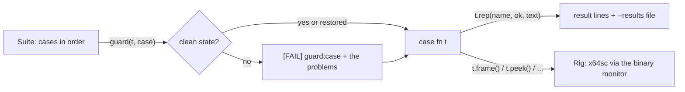

# gametest

A reusable harness for **behaviour tests of a game** in headless VICE: the things `make test`'s cycle budgets can't
check (press the stick, read what the game did). Swarm's `tests/games/swarm/check.py` (122 results) is built on it;
the next game's test starts from the same pieces.

```
uv run --package gametest python tests/games/<title>/check.py [--prg build/<title>/<title>.prg]
        [--only CASE ...] [--list] [--results FILE]
uv run --quiet --all-packages pytest -q tools/gametest      # the library's own tests, no VICE (also: make test-tools)
```

## What is in it

| Module | What |
|---|---|
| `gametest.rig` | `Rig`: one headless `x64sc` on a free port (reuses `budget_runner.session.Vice`, which loads the labels from `main.vs`), stepped one game frame at a time. `step/frame/frames`, `set_stick`, `peek/peek16/peeks/poke/poke16/mem` by label, `watch` (stop on every execution of, or store to, an address), `run_to`, `resume`, `is_debug`. `BITS`, `stick_mask`. |
| `gametest.cases` | `Suite` (the case registry and runner), `Result`, `GuardError`, `Handoff`. |
| `gametest.guard` | `expect_memory(rig, {...})`: compare memory with what a clean state holds (for writing a guard). |
| `gametest.cli` | `run_cli(suite, make_rig=..., default_prg=..., guard=...)`: `--prg --only --list --results`. |
| `gametest.build` | `build_game(game, release=False)` and `prg_path(game, release)`: the DEBUG or the release build by `make`. |

The VICE side is `mcp/vice/vice_monitor.py` and `budget_runner.session` imported as they are; nothing there is copied or changed.



## A game's test, in three parts

1. **The rig.** Subclass `Rig` for the game's state readers and placing helpers (`tests/games/swarm/swarmtest.py`):

   ```python
   class SwarmRig(Rig):
       def __init__(self, prg):
           super().__init__(prg, frame_label="game_update_end", debug_labels=("mux_late_count",))
       def frame(self, pressed=None):      # one game frame; return what the cases read each frame
           super().step(pressed)
           return self.state()
   ```

   `frame_label` is a label run once a frame (the game's main loop end): the machine stops there and nowhere else, so
   every sample is exactly one frame apart. `debug_labels` exist only in a DEBUG build: `t.is_debug` tells a case
   whether the counters are there, so the **same script runs on a DEBUG and a release build** (`--prg
   build/<title>-release/<title>.prg`).

2. **The cases**, top-level functions registered in order; `t` is the rig:

   ```python
   suite = Suite("swarm")

   @suite.case("hit", needs="fight")
   def hit(t):
       ...
       t.rep("hit", ok, "what was seen")          # PASS/FAIL line; a case may report several names

   @suite.case("autoplay-seed", rig=False)        # a case that starts its own emulators gets no rig
   def autoplay_seed(t): t.rep(...)

   sys.exit(run_cli(suite, make_rig=SwarmRig, default_prg="build/swarm/swarm.prg", guard=swarm_guard))
   ```

   Values one case hands to a later one go in `t.ns` (a `Handoff`: a missing one says which case didn't run).
   Case order is the order of registration; a case may build on the one before it, **but say so** (see the guard).

3. **The clean-state guard**, a function `guard(t, case)` that returns a list of problems (empty = clean), raises
   `GuardError`, or restores the state first. The runner calls it **before every case** with the case's `needs`
   word (whatever the game defines: `"fight"`, `"title"`, `None` for "the case sets everything itself").
   A start state the case did not expect prints `[FAIL] guard:<case>: clean-state guard (needs 'fight'): <problems>`
   and the case still runs (so one dirty start doesn't hide the rest; `skip_on_guard_failure=True` skips it).
   This is what makes a case that **only passed because the last case's leftovers had settled** fail loudly the day
   an earlier case changes. The fix goes in the case (put its own start state in place, or declare in `needs` that it
   continues the case before). Swarm's: `swarmtest.swarm_guard` and the `NEEDS` table at the top of `check.py`.

## Results and exit codes

Every result prints `[PASS] name: facts` (or `[FAIL]`) as it happens; the script ends with `ALL PASS` or `FAILED:
names`. `--results FILE` also writes everything printed, under a header with the command and date, so a results file
is what the script printed. Exit code 0 all pass, 1 any FAIL, 2 aborted (a jam or a missing label: `FAIL (jam/hang)`;
an error in a case; an unmet hand-over `FAIL (state)`): the machine's state is unknown after that, so the run stops.

## Wiring into `make test`

A `script` check in the game's `budget.json` runs it with `"command": ["uv", "run", "--quiet", "--package",
"gametest", "python", "tests/games/<title>/check.py", "--prg", "{prg}"]` and `"build": {"game": "<title>"}`
(`--package gametest`, not `budget-runner`, so the library is in the environment). The release build is run by hand with `--prg`.

## Unit tests

`tools/gametest/tests/` use a fake emulator (no VICE): labels, memory, stick masks, frame stepping and jams, watches, the
case runner, the guard (fail, restore, skip), `--only`, `--list` and `--results`.
